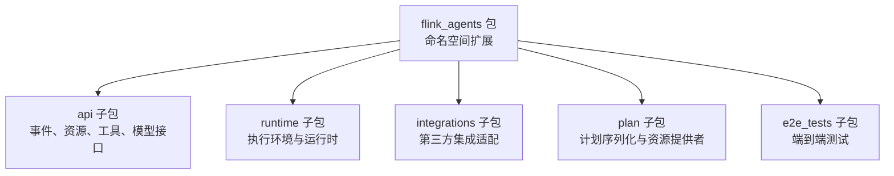
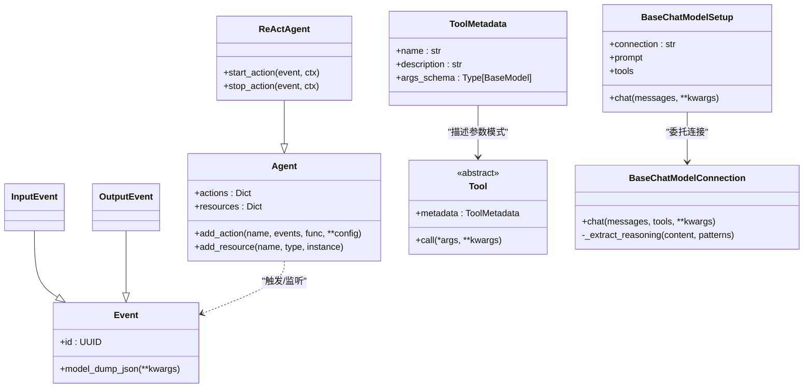
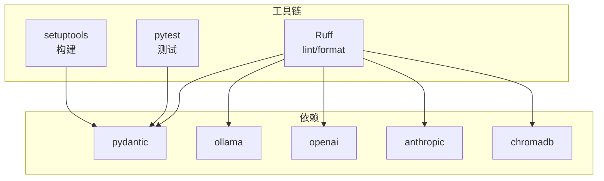

# Python 代码规范

<cite>
**本文引用的文件**
- [pyproject.toml](file://python/pyproject.toml)
- [__init__.py](file://python/flink_agents/__init__.py)
- [__init__.py](file://python/flink_agents/api/__init__.py)
- [__init__.py](file://python/flink_agents/api/agents/__init__.py)
- [types.py](file://python/flink_agents/api/agents/types.py)
- [agent.py](file://python/flink_agents/api/agents/agent.py)
- [react_agent.py](file://python/flink_agents/api/agents/react_agent.py)
- [chat_model.py](file://python/flink_agents/api/chat_models/chat_model.py)
- [tool.py](file://python/flink_agents/api/tools/tool.py)
- [long_term_memory.py](file://python/flink_agents/api/memory/long_term_memory.py)
- [event.py](file://python/flink_agents/api/events/event.py)
- [decorators.py](file://python/flink_agents/api/decorators.py)
- [configuration.py](file://python/flink_agents/api/configuration.py)
- [local_execution_environment.py](file://python/flink_agents/runtime/local_execution_environment.py)
- [test_decorators.py](file://python/flink_agents/api/tests/test_decorators.py)
</cite>

## 目录
1. [引言](#引言)
2. [项目结构](#项目结构)
3. [核心组件](#核心组件)
4. [架构总览](#架构总览)
5. [详细组件分析](#详细组件分析)
6. [依赖关系分析](#依赖关系分析)
7. [性能考虑](#性能考虑)
8. [故障排查指南](#故障排查指南)
9. [结论](#结论)
10. [附录](#附录)

## 引言
本规范旨在为 Apache Flink Agents 项目的 Python 代码制定统一的编码标准，覆盖 PEP 8 遵循、类型注解、模块组织、字符串格式化、异常处理、异步与并发、以及性能优化等关键方面。规范以仓库现有实现为依据，结合工具链配置（如 Ruff）与测试用例，形成可落地的工程实践，确保跨语言一致性与高质量交付。

## 项目结构
- 包根路径：python/flink_agents
- 模块组织采用按功能域分层：api、runtime、integrations、plan 等
- 包级初始化文件用于扩展命名空间包，确保多模块协同工作
- 工具链通过 pyproject.toml 统一管理，包括依赖、构建、测试与代码检查策略

图表来源
- [__init__.py](file://python/flink_agents/__init__.py#L18-L19)
- [__init__.py](file://python/flink_agents/api/__init__.py#L1-L18)
- [__init__.py](file://python/flink_agents/api/agents/__init__.py#L1-L18)

章节来源
- [pyproject.toml](file://python/pyproject.toml#L64-L69)
- [__init__.py](file://python/flink_agents/__init__.py#L18-L19)

## 核心组件
- 类型注解与 Pydantic 模型广泛使用，涵盖 BaseModel、字段校验、序列化与反序列化
- 装饰器体系用于声明资源与动作，简化代理与工具的注册流程
- 事件驱动架构，通过事件类型与监听器机制实现解耦
- 配置系统支持读写访问与类型约束，便于运行时参数管理

章节来源
- [types.py](file://python/flink_agents/api/agents/types.py#L25-L68)
- [agent.py](file://python/flink_agents/api/agents/agent.py#L31-L160)
- [react_agent.py](file://python/flink_agents/api/agents/react_agent.py#L42-L212)
- [chat_model.py](file://python/flink_agents/api/chat_models/chat_model.py#L31-L232)
- [tool.py](file://python/flink_agents/api/tools/tool.py#L30-L156)
- [long_term_memory.py](file://python/flink_agents/api/memory/long_term_memory.py#L37-L305)
- [event.py](file://python/flink_agents/api/events/event.py#L33-L114)
- [decorators.py](file://python/flink_agents/api/decorators.py#L23-L196)
- [configuration.py](file://python/flink_agents/api/configuration.py#L22-L170)

## 架构总览
下图展示 Python API 层的核心类与交互关系，体现事件驱动、资源注入与工具调用的典型流程。

图表来源
- [agent.py](file://python/flink_agents/api/agents/agent.py#L31-L160)
- [react_agent.py](file://python/flink_agents/api/agents/react_agent.py#L42-L212)
- [event.py](file://python/flink_agents/api/events/event.py#L33-L114)
- [tool.py](file://python/flink_agents/api/tools/tool.py#L103-L156)
- [chat_model.py](file://python/flink_agents/api/chat_models/chat_model.py#L121-L232)

## 详细组件分析

### 类型注解与 Pydantic 模型
- 使用 BaseModel 定义数据模型，配合 model_validator 与 model_serializer 实现自定义序列化/反序列化
- 字段类型明确，必要时使用 Union、泛型与 Any，但尽量避免过度使用 Any
- 使用 Field、exclude 等特性控制序列化行为与字段可见性

章节来源
- [types.py](file://python/flink_agents/api/agents/types.py#L25-L68)
- [tool.py](file://python/flink_agents/api/tools/tool.py#L53-L101)
- [long_term_memory.py](file://python/flink_agents/api/memory/long_term_memory.py#L86-L135)
- [event.py](file://python/flink_agents/api/events/event.py#L33-L94)

### 模块组织与导入顺序
- 包级初始化文件采用命名空间扩展方式，确保子包可被正确发现
- 导入遵循绝对路径优先，避免相对导入带来的耦合
- 依赖声明集中在 pyproject.toml，开发、测试、格式化与静态检查工具统一管理

章节来源
- [__init__.py](file://python/flink_agents/__init__.py#L18-L19)
- [__init__.py](file://python/flink_agents/api/__init__.py#L1-L18)
- [__init__.py](file://python/flink_agents/api/agents/__init__.py#L1-L18)
- [pyproject.toml](file://python/pyproject.toml#L118-L194)

### 字符串格式化与文档字符串
- 文档字符串采用 Google 风格，参数与返回值说明清晰
- 代码中未见 f-string 使用，建议在需要时采用 f-string 提升可读性与性能
- 格式化由 Ruff 控制，行长度限制与格式化规则已在工具配置中设定

章节来源
- [pyproject.toml](file://python/pyproject.toml#L180-L194)
- [react_agent.py](file://python/flink_agents/api/agents/react_agent.py#L53-L95)

### 异常处理与错误传播
- 在资源不存在或配置冲突时抛出明确的异常（如 ValueError、TypeError、RuntimeError）
- 对外部输入进行显式校验并在失败时提供可诊断的错误信息
- 建议在公共 API 中统一异常层次，便于上层捕获与恢复

章节来源
- [agent.py](file://python/flink_agents/api/agents/agent.py#L129-L132)
- [agent.py](file://python/flink_agents/api/agents/agent.py#L154-L157)
- [react_agent.py](file://python/flink_agents/api/agents/react_agent.py#L166-L171)
- [local_execution_environment.py](file://python/flink_agents/runtime/local_execution_environment.py#L60-L63)

### 装饰器与资源声明
- 通过装饰器声明动作、模型连接/设置、工具、提示词、MCP 服务器与向量存储
- 装饰器为函数附加元数据标记，便于运行时自动发现与装配
- 测试用例验证装饰器的行为与断言

章节来源
- [decorators.py](file://python/flink_agents/api/decorators.py#L23-L196)
- [test_decorators.py](file://python/flink_agents/api/tests/test_decorators.py#L27-L65)

### 事件驱动与动作执行
- 事件基类支持额外属性与内容驱动的确定性 ID 生成
- 动作通过监听器机制响应事件，支持单事件或多事件监听
- ReActAgent 将输入转换为消息序列，并根据输出模式发送结果事件

章节来源
- [event.py](file://python/flink_agents/api/events/event.py#L33-L94)
- [agent.py](file://python/flink_agents/api/agents/agent.py#L108-L160)
- [react_agent.py](file://python/flink_agents/api/agents/react_agent.py#L137-L212)

### 配置系统
- ConfigOption 定义键、类型与默认值
- ReadableConfiguration/WritableConfiguration 提供读写能力
- 支持整数、浮点、布尔与字符串类型的配置项

章节来源
- [configuration.py](file://python/flink_agents/api/configuration.py#L22-L170)

### 执行环境与本地运行
- LocalExecutionEnvironment 提供从列表输入到本地执行的入口
- LocalAgentBuilder 负责装配资源与创建 Runner
- 不支持 DataStream/Table 输出（本地环境限制）

章节来源
- [local_execution_environment.py](file://python/flink_agents/runtime/local_execution_environment.py#L92-L179)

## 依赖关系分析
- 工具链：Ruff（lint/format）、pytest（测试）、setuptools（构建）
- 依赖范围：核心库、可选集成库、平台特定依赖
- 严格类型检查与导入整洁性规则在工具配置中启用

图表来源
- [pyproject.toml](file://python/pyproject.toml#L44-L59)
- [pyproject.toml](file://python/pyproject.toml#L118-L194)

章节来源
- [pyproject.toml](file://python/pyproject.toml#L44-L59)
- [pyproject.toml](file://python/pyproject.toml#L118-L194)

## 性能考虑
- 列表推导式与生成器表达式优先于显式循环，减少中间对象创建
- 使用 Pydantic 的 model_dump_json/fallback 机制避免昂贵的二次序列化
- 合理拆分方法，避免过长函数；对热点路径进行缓存与去重（如事件 ID）
- 严格类型注解有助于静态分析与 JIT 优化（视运行时而定）

## 故障排查指南
- 文档字符串风格与行长度：遵循 Google 风格与 pycodestyle 最大长度
- 导入相对路径：禁止相对导入，统一使用绝对路径
- 类型检查严格性：开启 flake8-type-checking 严格模式
- 常见问题定位：
  - 装饰器未生效：确认装饰器是否正确附加元数据
  - 序列化失败：检查未知类型处理与 fallback 回退逻辑
  - 配置读取异常：核对 ConfigOption 的键名与类型

章节来源
- [pyproject.toml](file://python/pyproject.toml#L180-L194)
- [event.py](file://python/flink_agents/api/events/event.py#L49-L94)
- [decorators.py](file://python/flink_agents/api/decorators.py#L23-L53)

## 结论
本规范基于现有代码与工具链配置，总结了 Apache Flink Agents Python 代码的风格与实践要点。建议在后续开发中持续遵循类型注解、模块边界、异常处理与性能优化的最佳实践，配合 Ruff 与 pytest 确保代码质量与一致性。

## 附录
- 术语
  - 事件：系统内传递的消息载体，具备确定性 ID 与可序列化属性
  - 资源：可被代理或工具引用的可序列化对象，如模型连接、提示词、工具等
  - 动作：对事件的响应函数，通过装饰器声明监听的事件类型
- 参考实现路径
  - 事件与动作：[event.py](file://python/flink_agents/api/events/event.py#L33-L114)，[agent.py](file://python/flink_agents/api/agents/agent.py#L108-L160)，[decorators.py](file://python/flink_agents/api/decorators.py#L23-L53)
  - 模型与工具：[chat_model.py](file://python/flink_agents/api/chat_models/chat_model.py#L121-L232)，[tool.py](file://python/flink_agents/api/tools/tool.py#L103-L156)
  - 内存与配置：[long_term_memory.py](file://python/flink_agents/api/memory/long_term_memory.py#L183-L305)，[configuration.py](file://python/flink_agents/api/configuration.py#L22-L170)
  - 运行时与本地执行：[local_execution_environment.py](file://python/flink_agents/runtime/local_execution_environment.py#L92-L179)