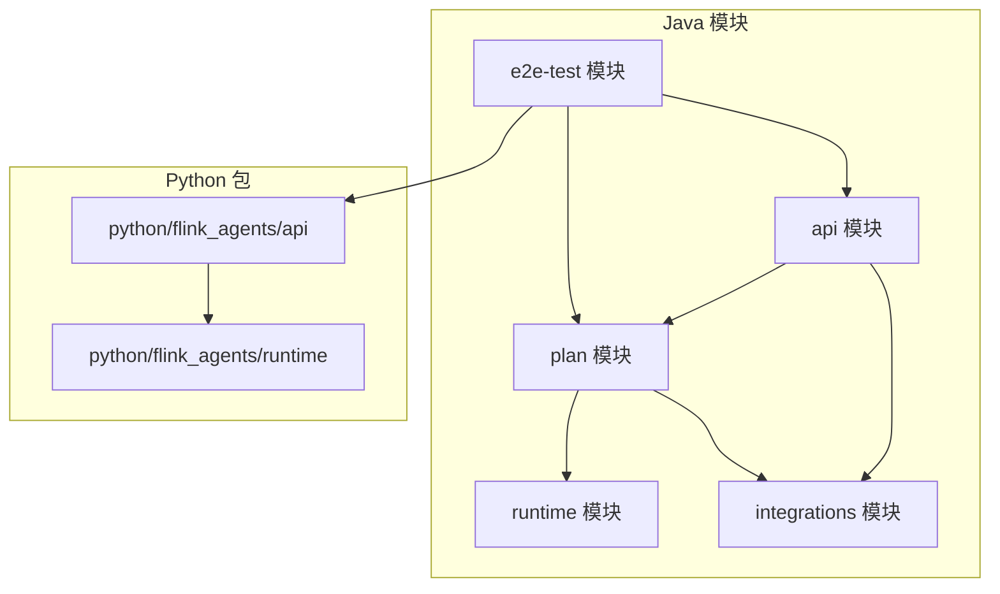
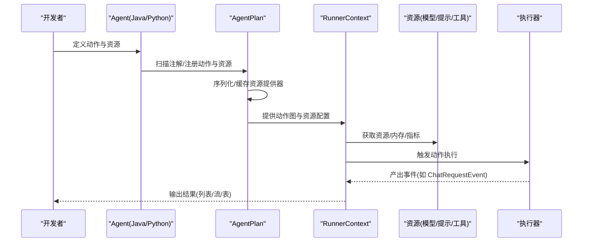
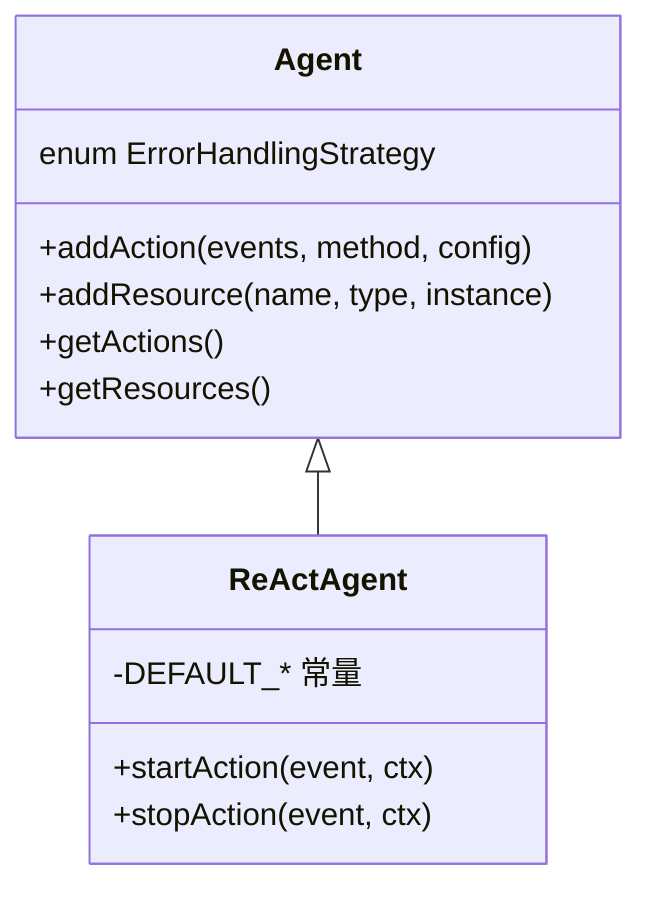
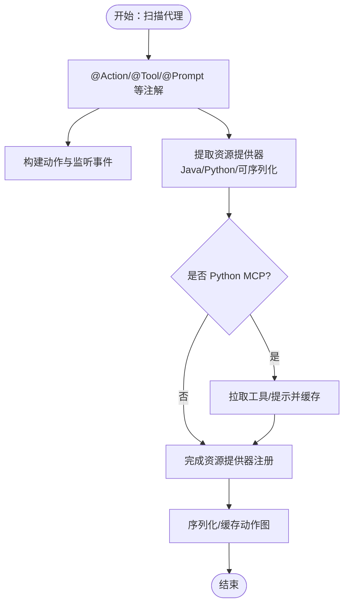
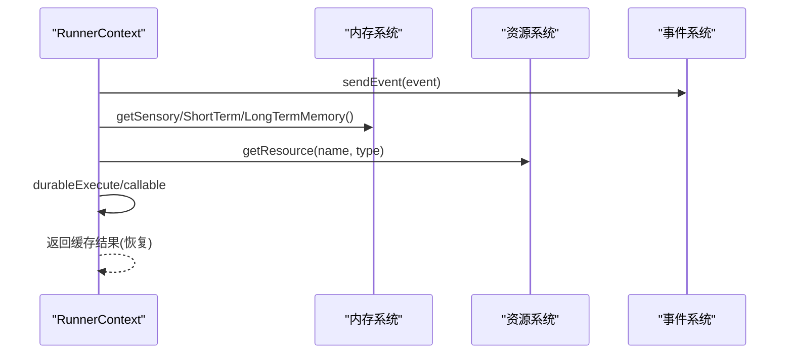
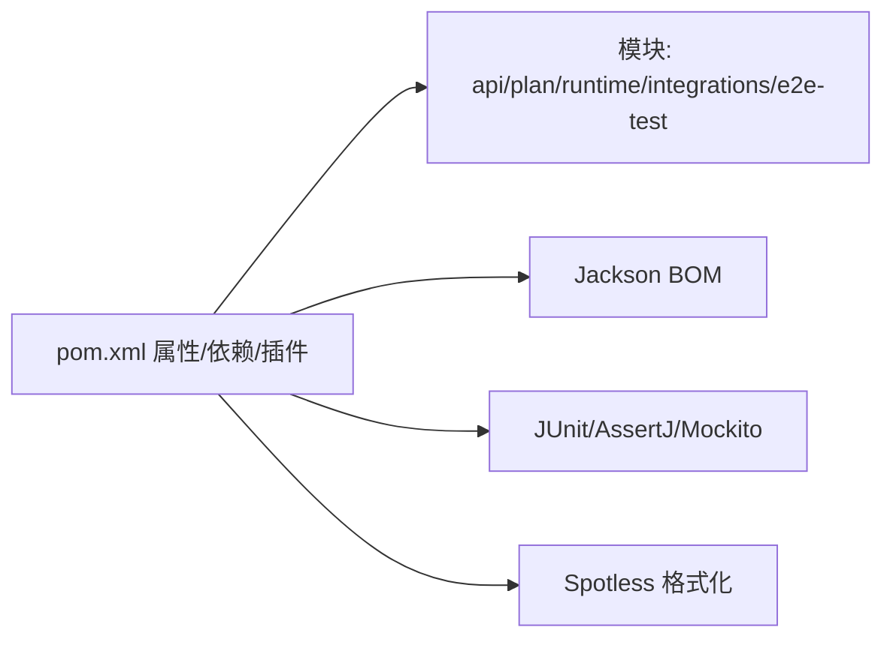

# 代码审查清单

<cite>
**本文引用的文件**
- [README.md](file://README.md)
- [pom.xml](file://pom.xml)
- [Agent.java](file://api/src/main/java/org/apache/flink/agents/api/agents/Agent.java)
- [ReActAgent.java](file://api/src/main/java/org/apache/flink/agents/api/agents/ReActAgent.java)
- [AgentBuilder.java](file://api/src/main/java/org/apache/flink/agents/api/AgentBuilder.java)
- [RunnerContext.java](file://api/src/main/java/org/apache/flink/agents/api/context/RunnerContext.java)
- [ChatRequestEvent.java](file://api/src/main/java/org/apache/flink/agents/api/event/ChatRequestEvent.java)
- [AgentPlan.java](file://plan/src/main/java/org/apache/flink/agents/plan/AgentPlan.java)
- [Action.java](file://plan/src/main/java/org/apache/flink/agents/plan/actions/Action.java)
- [agent.py](file://python/flink_agents/api/agents/agent.py)
- [ReActAgentTest.java](file://api/src/test/java/org/apache/flink/agents/api/agents/ReActAgentTest.java)
- [lint.sh](file://tools/lint.sh)
- [ut.sh](file://tools/ut.sh)
- [e2e.sh](file://tools/e2e.sh)
</cite>

## 目录
1. [简介](#简介)
2. [项目结构](#项目结构)
3. [核心组件](#核心组件)
4. [架构总览](#架构总览)
5. [详细组件分析](#详细组件分析)
6. [依赖关系分析](#依赖关系分析)
7. [性能考量](#性能考量)
8. [故障排查指南](#故障排查指南)
9. [结论](#结论)
10. [附录](#附录)

## 简介
本清单面向 Apache Flink Agents 项目的代码审查与贡献，提供标准化的功能性、安全性、性能、可维护性、兼容性与测试覆盖检查要点，并配套端到端测试与格式化工具链，确保跨语言（Java/Python）与多模块（api/plan/runtime/integrations/e2e-test）的一致质量标准。

## 项目结构
项目采用多模块 Maven 结构，核心模块包括：
- api：对外 API 与事件模型、资源抽象、上下文接口等
- plan：代理计划编译与序列化、动作与资源提供器
- runtime：运行时执行、状态存储、异步与度量
- integrations：第三方集成（聊天模型、嵌入模型、MCP、向量库）
- e2e-test：端到端测试与跨语言资源测试
- python：Python 对应 API 与运行时适配
- tools：构建、格式化、单元与端到端测试脚本

图表来源
- [pom.xml](file://pom.xml#L58-L67)
- [README.md](file://README.md#L1-L44)

章节来源
- [pom.xml](file://pom.xml#L58-L67)
- [README.md](file://README.md#L1-L44)

## 核心组件
- 代理基类与内置 ReAct 实现：定义动作注册、资源注入与错误处理策略
- 代理计划：从代理实例扫描注解，生成可序列化的动作图与资源提供器映射
- 运行时上下文：事件发送、内存访问、指标组、持久化执行与配置读取
- 事件与消息：聊天请求/响应、消息角色与输出模式
- 构建器接口：将代理执行结果转换为列表、数据流或表
- Python 侧代理：与 Java 代理等价的抽象与装饰器支持

章节来源
- [Agent.java](file://api/src/main/java/org/apache/flink/agents/api/agents/Agent.java#L34-L131)
- [ReActAgent.java](file://api/src/main/java/org/apache/flink/agents/api/agents/ReActAgent.java#L51-L183)
- [AgentPlan.java](file://plan/src/main/java/org/apache/flink/agents/plan/AgentPlan.java#L73-L625)
- [RunnerContext.java](file://api/src/main/java/org/apache/flink/agents/api/context/RunnerContext.java#L33-L138)
- [ChatRequestEvent.java](file://api/src/main/java/org/apache/flink/agents/api/event/ChatRequestEvent.java#L29-L58)
- [AgentBuilder.java](file://api/src/main/java/org/apache/flink/agents/api/AgentBuilder.java#L35-L77)
- [agent.py](file://python/flink_agents/api/agents/agent.py#L31-L160)

## 架构总览
下图展示从代理到计划再到运行时的整体交互：代理通过注解声明动作与资源；计划模块解析并生成可序列化图；运行时根据图触发动作，通过上下文发送事件并访问资源。

图表来源
- [Agent.java](file://api/src/main/java/org/apache/flink/agents/api/agents/Agent.java#L48-L111)
- [AgentPlan.java](file://plan/src/main/java/org/apache/flink/agents/plan/AgentPlan.java#L132-L141)
- [RunnerContext.java](file://api/src/main/java/org/apache/flink/agents/api/context/RunnerContext.java#L39-L133)
- [ChatRequestEvent.java](file://api/src/main/java/org/apache/flink/agents/api/event/ChatRequestEvent.java#L34-L56)

## 详细组件分析

### 组件一：代理与 ReAct 行为
- 功能性检查要点
  - 动作唯一性与重复注册防护
  - 资源类型与实例校验（可序列化/描述符）
  - 输出模式与结构化输出键值处理
  - 输入类型分支（原始类型、Row、POJO）与提示格式化
- 边界条件与错误处理
  - 非法输入类型抛出明确异常
  - 缺失用户提示时对非原始输入的处理策略
  - 默认资源名称冲突与初始化顺序
- 安全性检查要点
  - 输入到消息格式化时的字段映射与空值处理
  - 外部 JSON 解析失败的降级与异常传播
- 性能考量
  - ObjectMapper 复用与 Schema 生成缓存
  - 动作方法签名一致性检查避免反射开销
- 可维护性
  - 方法职责单一，事件监听与执行分离
  - 常量集中管理（默认资源名）

图表来源
- [Agent.java](file://api/src/main/java/org/apache/flink/agents/api/agents/Agent.java#L48-L111)
- [ReActAgent.java](file://api/src/main/java/org/apache/flink/agents/api/agents/ReActAgent.java#L59-L101)

章节来源
- [Agent.java](file://api/src/main/java/org/apache/flink/agents/api/agents/Agent.java#L48-L111)
- [ReActAgent.java](file://api/src/main/java/org/apache/flink/agents/api/agents/ReActAgent.java#L103-L181)

### 组件二：代理计划与资源提供器
- 功能性检查要点
  - 注解扫描：@Action、@Tool、@Prompt、@ChatModel、@Embedding、@VectorStore、@MCPServer
  - 资源提供器选择：Java/Python/可序列化资源提供器
  - Python MCP 服务器桥接与工具/提示缓存
  - 序列化与反序列化一致性（自定义 writeObject/readObject）
- 边界条件与错误处理
  - 资源未找到与提供失败的异常传播
  - Java 11/21 下 MCP 版本选择与不支持场景
  - 反射调用失败的兜底与异常包装
- 安全性检查要点
  - 反射调用的安全边界与参数校验
  - Python 资源适配器的生命周期管理
- 性能考量
  - 资源缓存 ConcurrentHashMap 减少重复创建
  - 序列化字符串复用与对象图重建
- 可维护性
  - 资源提供器工厂化，类型分支清晰
  - 配置与元数据抽取逻辑内聚

图表来源
- [AgentPlan.java](file://plan/src/main/java/org/apache/flink/agents/plan/AgentPlan.java#L298-L360)
- [AgentPlan.java](file://plan/src/main/java/org/apache/flink/agents/plan/AgentPlan.java#L362-L598)

章节来源
- [AgentPlan.java](file://plan/src/main/java/org/apache/flink/agents/plan/AgentPlan.java#L132-L141)
- [AgentPlan.java](file://plan/src/main/java/org/apache/flink/agents/plan/AgentPlan.java#L143-L197)
- [AgentPlan.java](file://plan/src/main/java/org/apache/flink/agents/plan/AgentPlan.java#L231-L264)
- [AgentPlan.java](file://plan/src/main/java/org/apache/flink/agents/plan/AgentPlan.java#L283-L296)
- [AgentPlan.java](file://plan/src/main/java/org/apache/flink/agents/plan/AgentPlan.java#L532-L559)

### 组件三：运行时上下文与事件
- 功能性检查要点
  - 事件发送与动作配置读取
  - 内存对象（感知/短期/长期）获取与作用域
  - 指标组共享与动作级隔离
  - 持久化执行（同步/异步）与恢复语义
- 边界条件与错误处理
  - 状态后端不可访问的异常传播
  - durableExecute 禁止在回调中访问内存/事件
- 安全性检查要点
  - 上下文隔离与资源访问控制
  - 异步执行的线程模型与 JDK 版本差异
- 性能考量
  - 指标组按作用域分层减少竞争
  - 异步执行在 JDK 21+ 使用 Continuation 降低阻塞
- 可维护性
  - 接口职责清晰，方法命名语义明确

图表来源
- [RunnerContext.java](file://api/src/main/java/org/apache/flink/agents/api/context/RunnerContext.java#L39-L133)

章节来源
- [RunnerContext.java](file://api/src/main/java/org/apache/flink/agents/api/context/RunnerContext.java#L33-L138)

### 组件四：构建器与输出形态
- 功能性检查要点
  - toList/toDataStream/toTable 的输出形态一致性
  - 数据流/表的 Schema 映射与类型安全
- 边界条件与错误处理
  - 空输出与无事件场景的处理
- 性能考量
  - 流式输出的背压与批转流的转换成本
- 可维护性
  - 接口链式调用，职责单一

章节来源
- [AgentBuilder.java](file://api/src/main/java/org/apache/flink/agents/api/AgentBuilder.java#L35-L77)

### 组件五：Python 代理与跨语言适配
- 功能性检查要点
  - 与 Java 代理等价的动作注册与资源注入
  - 装饰器与静态方法的资源声明
- 兼容性检查要点
  - Python 与 Java 资源描述符的互操作
  - 版本差异下的 MCP 语言选择
- 可维护性
  - 类型注解与文档示例完善

章节来源
- [agent.py](file://python/flink_agents/api/agents/agent.py#L31-L160)

## 依赖关系分析
- Maven 多模块聚合与版本管理
- Jackson BOM 统一 Jackson 生态版本
- 单测框架与断言库统一
- Spotless 格式化与 JDK 21 兼容性开关

图表来源
- [pom.xml](file://pom.xml#L37-L107)
- [pom.xml](file://pom.xml#L275-L317)

章节来源
- [pom.xml](file://pom.xml#L37-L107)
- [pom.xml](file://pom.xml#L275-L317)

## 性能考量
- 资源缓存：AgentPlan 中使用并发缓存减少重复创建
- 序列化：自定义序列化/反序列化以降低反射成本
- 异步执行：JDK 21+ 使用 Continuation，JDK 11 回退同步
- 指标分层：全局与动作级指标组减少竞争
- I/O 与网络：聊天/嵌入/向量库调用的超时与重试策略（由具体集成实现）

章节来源
- [AgentPlan.java](file://plan/src/main/java/org/apache/flink/agents/plan/AgentPlan.java#L92-L99)
- [AgentPlan.java](file://plan/src/main/java/org/apache/flink/agents/plan/AgentPlan.java#L283-L296)
- [RunnerContext.java](file://api/src/main/java/org/apache/flink/agents/api/context/RunnerContext.java#L122-L133)

## 故障排查指南
- 单元测试
  - Java：Maven Surefire 插件配置了必要的 JVM 参数
  - Python：pytest 脚本按版本安装 Flink 并过滤端到端测试
- 端到端测试
  - 跨语言资源测试、代理计划兼容性测试、配置互操作测试
  - 自动构建与依赖安装失败时的回退策略
- 代码格式化
  - Python：Ruff 检查/修复
  - Java：Spotless Google Java Format
- 常见问题定位
  - 反射调用失败：检查类加载器与方法签名
  - 资源未找到：确认资源提供器注册与名称一致
  - 序列化异常：核对自定义序列化实现与字段一致性

章节来源
- [ut.sh](file://tools/ut.sh#L122-L196)
- [ut.sh](file://tools/ut.sh#L198-L284)
- [e2e.sh](file://tools/e2e.sh#L20-L86)
- [lint.sh](file://tools/lint.sh#L115-L167)

## 结论
本清单提供了从功能、安全、性能、可维护性、兼容性到测试覆盖的全流程审查要点。建议在每次提交中：
- 通过格式化脚本与单测脚本进行本地验证
- 针对新增/修改模块补充单元测试与端到端测试
- 关注跨语言与多 JDK 版本的兼容性回归
- 在 PR 中附带测试结果与变更影响说明

## 附录

### 功能性检查清单
- 需求符合性
  - 是否满足代理动作注册、资源注入与事件驱动执行
  - 输出形态（列表/流/表）与业务需求一致
- 边界条件
  - 输入类型分支与提示缺失场景
  - 资源未找到与重复注册
- 错误处理
  - 明确异常类型与错误信息
  - 恢复路径（持久化执行）与缓存一致性

章节来源
- [ReActAgent.java](file://api/src/main/java/org/apache/flink/agents/api/agents/ReActAgent.java#L114-L150)
- [Agent.java](file://api/src/main/java/org/apache/flink/agents/api/agents/Agent.java#L98-L111)
- [RunnerContext.java](file://api/src/main/java/org/apache/flink/agents/api/context/RunnerContext.java#L113-L133)

### 安全性检查清单
- 输入验证
  - JSON/Row/POJO 解析失败的处理
  - 字段映射与空值保护
- 权限控制
  - 资源访问的类型与名称约束
  - 反射调用的白名单与参数校验
- 安全漏洞防范
  - 序列化/反序列化安全边界
  - 跨语言进程间通信的最小暴露面

章节来源
- [ReActAgent.java](file://api/src/main/java/org/apache/flink/agents/api/agents/ReActAgent.java#L138-L147)
- [AgentPlan.java](file://plan/src/main/java/org/apache/flink/agents/plan/AgentPlan.java#L362-L388)

### 性能相关检查清单
- 内存使用
  - 资源缓存大小与淘汰策略
  - 序列化对象图的内存占用
- 并发处理
  - 异步执行在不同 JDK 的行为
  - 指标组与状态后端的并发访问
- 资源管理
  - 资源关闭与生命周期管理
  - Python 资源适配器的连接池与超时

章节来源
- [AgentPlan.java](file://plan/src/main/java/org/apache/flink/agents/plan/AgentPlan.java#L274-L281)
- [RunnerContext.java](file://api/src/main/java/org/apache/flink/agents/api/context/RunnerContext.java#L122-L133)

### 可维护性评估标准
- 代码复杂度
  - 方法长度与嵌套层级控制
  - 注解扫描与反射逻辑的可读性
- 命名规范
  - 动作名、资源名、事件名一致性
- 注释质量
  - 接口与关键流程的文档注释
  - 示例与注意事项

章节来源
- [Action.java](file://plan/src/main/java/org/apache/flink/agents/plan/actions/Action.java#L35-L43)
- [AgentPlan.java](file://plan/src/main/java/org/apache/flink/agents/plan/AgentPlan.java#L298-L322)

### 兼容性检查清单
- 向后兼容性
  - 注解与资源提供器扩展点
  - 序列化格式的演进策略
- API 稳定性
  - RunnerContext 与 AgentBuilder 的稳定性
- 版本管理
  - Flink 版本矩阵与测试覆盖
  - JDK 11/21 的差异化行为

章节来源
- [ut.sh](file://tools/ut.sh#L45-L56)
- [AgentPlan.java](file://plan/src/main/java/org/apache/flink/agents/plan/AgentPlan.java#L532-L559)

### 测试覆盖检查
- 单元测试质量
  - 覆盖动作签名、资源提供器、序列化/反序列化
  - 边界条件与异常路径
- 测试用例完整性
  - Java 与 Python 双栈覆盖
  - 端到端测试脚本与跨语言场景
- 测试执行结果
  - 本地预检：格式化与单测通过
  - CI 回归：多版本 Flink 与多 JDK

章节来源
- [ReActAgentTest.java](file://api/src/test/java/org/apache/flink/agents/api/agents/ReActAgentTest.java#L30-L44)
- [ut.sh](file://tools/ut.sh#L170-L175)
- [e2e.sh](file://tools/e2e.sh#L149-L154)

### 文档完整性检查
- API 文档
  - Javadoc 与 Python 文档字符串
- 变更日志
  - 版本号与破坏性变更说明
- 用户指南更新
  - 新增注解与跨语言资源使用示例

章节来源
- [pom.xml](file://pom.xml#L253-L273)
- [README.md](file://README.md#L5-L6)