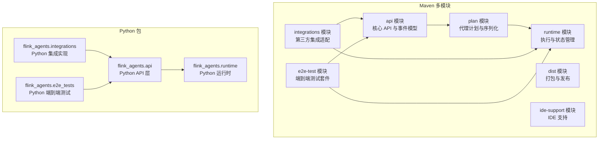
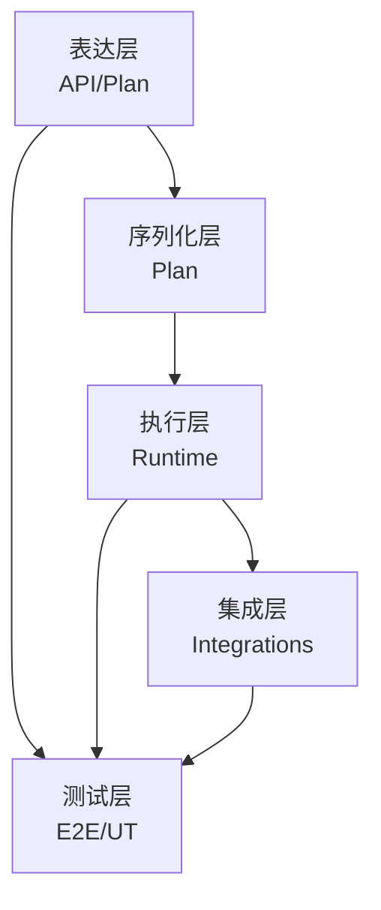
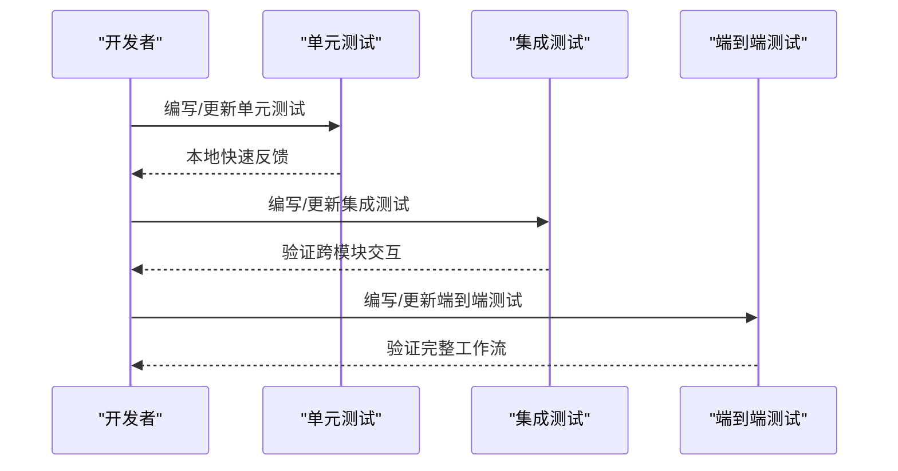
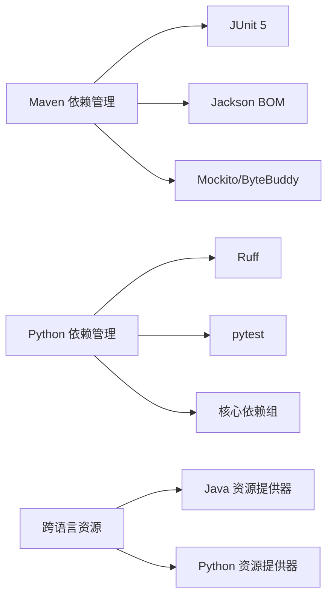

# 代码规范与最佳实践

<cite>
**本文引用的文件**
- [README.md](file://README.md)
- [pom.xml](file://pom.xml)
- [pyproject.toml](file://python/pyproject.toml)
- [Agent.java](file://api/src/main/java/org/apache/flink/agents/api/agents/Agent.java)
- [AgentBuilder.java](file://api/src/main/java/org/apache/flink/agents/api/AgentBuilder.java)
- [agent.py](file://python/flink_agents/api/agents/agent.py)
- [react_agent.py](file://python/flink_agents/api/agents/react_agent.py)
- [ReActAgentTest.java](file://api/src/test/java/org/apache/flink/agents/api/agents/ReActAgentTest.java)
- [test_decorators.py](file://python/flink_agents/api/tests/test_decorators.py)
- [lint.sh](file://tools/lint.sh)
- [ut.sh](file://tools/ut.sh)
</cite>

## 目录
1. [简介](#简介)
2. [项目结构](#项目结构)
3. [核心组件](#核心组件)
4. [架构总览](#架构总览)
5. [详细组件分析](#详细组件分析)
6. [依赖关系分析](#依赖关系分析)
7. [性能考虑](#性能考虑)
8. [故障排查指南](#故障排查指南)
9. [结论](#结论)
10. [附录](#附录)

## 简介
本指南面向 Apache Flink Agents 项目贡献者，提供统一的 Java 与 Python 代码规范、架构设计原则、测试与文档标准、代码审查清单以及性能优化建议。目标是确保跨语言（Java/Python）与多模块（API/Runtime/Plan/Integrations/E2E）的一致性、可维护性与可扩展性。

## 项目结构
项目采用多模块 Maven 结构，包含 API、运行时、计划序列化、集成适配器、端到端测试等模块；同时提供 Python 包与独立的构建脚本。整体布局如下：

图表来源
- [pom.xml](file://pom.xml#L58-L67)
- [README.md](file://README.md#L1-L44)

章节来源
- [pom.xml](file://pom.xml#L58-L67)
- [README.md](file://README.md#L1-L44)

## 核心组件
- Java API 核心类：Agent、AgentBuilder 等，定义代理行为与输出集成方式。
- Python API 核心类：Agent、ReActAgent 等，提供装饰器与资源声明能力。
- 测试与工具：单元测试、端到端测试脚本、格式化与检查脚本。

章节来源
- [Agent.java](file://api/src/main/java/org/apache/flink/agents/api/agents/Agent.java#L34-L131)
- [AgentBuilder.java](file://api/src/main/java/org/apache/flink/agents/api/AgentBuilder.java#L35-L77)
- [agent.py](file://python/flink_agents/api/agents/agent.py#L31-L160)
- [react_agent.py](file://python/flink_agents/api/agents/react_agent.py#L42-L212)

## 架构总览
系统采用“跨语言协作 + 分层设计”的架构：
- 表达层：API 模块（Java/Python）定义事件、资源、代理与计划。
- 序列化层：Plan 模块负责 JSON 序列化/反序列化与跨语言资源提供器。
- 执行层：Runtime 模块负责在 Flink 环境中的动作状态、异步执行与度量。
- 集成层：Integrations 提供第三方模型与向量库适配。
- 测试层：E2E 与单元测试覆盖功能与兼容性。

图表来源
- [pom.xml](file://pom.xml#L58-L67)
- [AgentBuilder.java](file://api/src/main/java/org/apache/flink/agents/api/AgentBuilder.java#L35-L77)
- [agent.py](file://python/flink_agents/api/agents/agent.py#L31-L160)

## 详细组件分析

### Java 代码规范
- 命名约定
  - 包名：采用反向域名风格，如 org.apache.flink.agents.api。
  - 类名：帕斯卡命名，如 Agent、AgentBuilder。
  - 方法与字段：驼峰命名，常量使用全大写加下划线。
  - 注释：遵循 Javadoc 规范，方法与公共 API 必须包含参数、返回值与异常说明。
- 包结构
  - API 模块按领域划分包：agents、annotation、chat、configuration、context、embedding、event、listener、logger、memory、metrics、prompt、resource、tools、vectorstores。
  - 保持高内聚低耦合，避免循环依赖。
- 注释与文档
  - 公共类与方法必须提供 Javadoc。
  - 复杂逻辑需添加行内注释，说明设计权衡。
- 代码格式化
  - 使用 Google Java Format（AOSP 风格），通过 Maven Spotless 插件在构建阶段强制执行。
  - 自动导入排序与无用导入清理。
- 错误处理
  - 明确区分非法参数、不支持类型与运行时错误，抛出语义清晰的异常。
  - 对重复注册（如资源或动作）进行显式校验与报错。

章节来源
- [pom.xml](file://pom.xml#L275-L317)
- [Agent.java](file://api/src/main/java/org/apache/flink/agents/api/agents/Agent.java#L34-L131)
- [AgentBuilder.java](file://api/src/main/java/org/apache/flink/agents/api/AgentBuilder.java#L35-L77)

### Python 代码规范
- PEP 8 遵循
  - 使用 Ruff 进行静态检查与自动修复，严格遵循缩进、空行、命名等规范。
- 类型注解
  - 函数签名与属性标注使用标准类型注解；对泛型与联合类型明确标注。
  - 避免 Any 的滥用，必要时提供更精确的类型约束。
- 模块组织
  - 按功能域拆分模块：agents、chat_models、embedding_models、events、memory、prompts、tools、vector_stores 等。
  - 使用 __init__.py 明确导出接口，保持包可见性一致。
- 文档字符串
  - 使用 Google 风格 docstring，包含参数、返回值、示例与异常说明。
- 依赖管理
  - 通过 pyproject.toml 统一声明依赖与可选开发/测试/lint 依赖组，便于安装与锁定版本。

章节来源
- [pyproject.toml](file://python/pyproject.toml#L118-L194)
- [agent.py](file://python/flink_agents/api/agents/agent.py#L31-L160)
- [react_agent.py](file://python/flink_agents/api/agents/react_agent.py#L42-L212)

### 架构设计原则
- 分层设计
  - API/Plan/Runtime 明确职责边界，数据通过事件与资源在层间传递。
- 接口隔离
  - 将动作、资源、事件抽象为稳定接口，避免上层直接依赖具体实现。
- 依赖注入
  - 通过资源描述符与资源提供器实现跨语言资源注入，降低耦合。
- 可扩展性
  - 新增集成通过适配器模式接入，不影响核心流程。

章节来源
- [Agent.java](file://api/src/main/java/org/apache/flink/agents/api/agents/Agent.java#L34-L131)
- [agent.py](file://python/flink_agents/api/agents/agent.py#L31-L160)

### 测试编写规范
- 单元测试
  - Java：使用 JUnit 5，断言使用 AssertJ；覆盖关键分支与异常路径。
  - Python：使用 pytest，测试函数以 test_ 开头，参数化与夹具合理使用。
- 集成测试
  - 覆盖跨语言资源交互、事件流转与输出一致性。
- 端到端测试
  - 使用 e2e-test 模块与 Python e2e_tests，验证真实环境下的工作流。
- 测试脚本
  - ut.sh 支持选择运行 Java/Python/E2E 与指定 Flink 版本组合。
  - lint.sh 统一执行 Java 与 Python 的格式化与检查。

图表来源
- [ut.sh](file://tools/ut.sh#L122-L284)
- [lint.sh](file://tools/lint.sh#L143-L167)

章节来源
- [ReActAgentTest.java](file://api/src/test/java/org/apache/flink/agents/api/agents/ReActAgentTest.java#L29-L44)
- [test_decorators.py](file://python/flink_agents/api/tests/test_decorators.py#L27-L65)
- [ut.sh](file://tools/ut.sh#L122-L284)
- [lint.sh](file://tools/lint.sh#L143-L167)

### 文档编写标准
- Javadoc（Java）
  - 类、接口、方法、字段均需提供 Javadoc；参数、返回值、异常、线程安全与并发注意事项需明确。
- Python docstring（Google 风格）
  - 函数/类/模块文档字符串包含用途、参数、返回值、示例与异常。
- API 文档
  - 使用 Maven Javadoc 插件生成 Java API 文档；Python 文档由 Sphinx/Hugo 等工具生成（项目中存在文档目录与脚本）。

章节来源
- [pom.xml](file://pom.xml#L253-L273)
- [pyproject.toml](file://python/pyproject.toml#L183-L194)

### 代码审查清单与检查要点
- 代码风格
  - Java：是否通过 Spotless AOSP 格式化；导入顺序与无用导入是否清理。
  - Python：是否通过 Ruff 检查与修复；docstring 是否符合 Google 风格。
- 设计一致性
  - 是否遵循分层与接口隔离；是否使用资源描述符与资源提供器实现注入。
  - 是否避免魔法字符串/数字；常量集中管理。
- 测试覆盖
  - 是否新增/修改了关键逻辑的单元测试；是否补充集成与端到端测试。
- 性能与健壮性
  - 是否避免不必要的对象创建与锁竞争；异常路径是否清晰。
- 文档与注释
  - 是否更新相关 API 文档与模块说明；复杂逻辑是否有足够注释。

章节来源
- [lint.sh](file://tools/lint.sh#L115-L167)
- [pom.xml](file://pom.xml#L275-L317)
- [pyproject.toml](file://python/pyproject.toml#L118-L194)

## 依赖关系分析
- Maven 依赖管理
  - 通过 dependencyManagement 统一 Jackson 版本；JUnit、AssertJ、Mockito、ByteBuddy 作为测试依赖。
  - 通过 profiles 控制 Java 版本与发布流程。
- Python 依赖管理
  - 通过 pyproject.toml 声明核心依赖与可选依赖组；Ruff、pytest 等工具依赖分组管理。
- 跨语言依赖
  - Python 通过 pemja 或 Java 资源包装器与 Java 侧资源交互；资源提供器负责序列化与反序列化。

图表来源
- [pom.xml](file://pom.xml#L69-L107)
- [pyproject.toml](file://python/pyproject.toml#L44-L94)

章节来源
- [pom.xml](file://pom.xml#L69-L107)
- [pyproject.toml](file://python/pyproject.toml#L44-L94)

## 性能考虑
- Java
  - 使用 AOSP 格式化减少差异带来的构建开销；避免在热路径创建临时对象。
  - 利用 Flink 类型信息与 RowTypeInfo 降低序列化成本。
- Python
  - 使用 Pydantic 模型进行结构化输出，减少解析与转换开销。
  - 合理使用类型注解，提升解释器与静态检查效率。
- 通用
  - 在事件与资源传递中尽量使用不可变结构；对长列表/字典操作使用生成器或惰性迭代。
  - 关注日志级别与事件记录频率，避免在生产环境产生过多 IO。

## 故障排查指南
- 构建失败
  - 检查 Java 版本与 Maven 配置；确认 Spotless 是否被跳过（例如 JDK 21 下的 profile）。
- 单测失败
  - 使用 ut.sh 指定模块与版本复现；优先缩小到最小可复现用例。
- 跨语言资源问题
  - 确认资源描述符与资源提供器序列化/反序列化一致；检查资源名称唯一性。
- 格式化冲突
  - 使用 lint.sh --format 一键修复；若失败，先修复 Python 依赖安装问题再执行。

章节来源
- [pom.xml](file://pom.xml#L109-L131)
- [ut.sh](file://tools/ut.sh#L122-L284)
- [lint.sh](file://tools/lint.sh#L115-L167)

## 结论
本指南总结了 Apache Flink Agents 的代码规范与最佳实践，涵盖 Java 与 Python 的风格、架构设计原则、测试策略、文档标准、审查清单与性能优化建议。建议贡献者在提交前使用 lint.sh 与 ut.sh 进行自检，并参考本指南完善代码质量与一致性。

## 附录
- 快速检查清单
  - Java：Spotless 通过、Javadoc 完整、测试覆盖关键路径。
  - Python：Ruff 通过、docstring 符合 Google 风格、类型注解清晰。
  - 架构：接口隔离、依赖注入、分层清晰。
  - 测试：单元/集成/E2E 覆盖，脚本可复现。
  - 文档：API 文档更新，变更说明与示例完善。