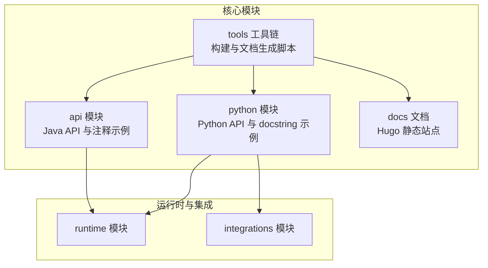
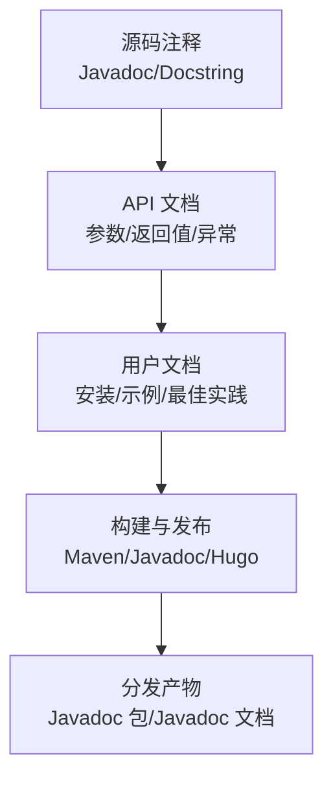
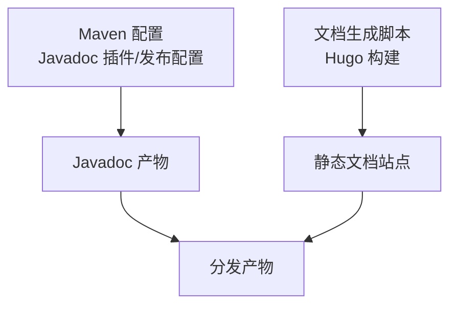

# 文档编写标准

<cite>
**本文引用的文件**
- [README.md](file://README.md)
- [pom.xml](file://pom.xml)
- [docs.sh](file://tools/docs.sh)
- [Agent.java](file://api/src/main/java/org/apache/flink/agents/api/agents/Agent.java)
- [AgentBuilder.java](file://api/src/main/java/org/apache/flink/agents/api/AgentBuilder.java)
- [agent.py](file://python/flink_agents/api/agents/agent.py)
- [react_agent.py](file://python/flink_agents/api/agents/react_agent.py)
- [chat_model.py](file://python/flink_agents/api/chat_models/chat_model.py)
- [tool.py](file://python/flink_agents/api/tools/tool.py)
- [_index.md](file://docs/content/docs/development/_index.md)
- [installation.md](file://docs/content/docs/get-started/installation.md)
- [react_agent.md](file://docs/content/docs/development/react_agent.md)
- [tool_use.md](file://docs/content/docs/development/tool_use.md)
- [chat_models.md](file://docs/content/docs/development/chat_models.md)
</cite>

## 目录
1. [引言](#引言)
2. [项目结构](#项目结构)
3. [核心组件](#核心组件)
4. [架构总览](#架构总览)
5. [详细组件分析](#详细组件分析)
6. [依赖关系分析](#依赖关系分析)
7. [性能考量](#性能考量)
8. [故障排查指南](#故障排查指南)
9. [结论](#结论)
10. [附录](#附录)

## 引言
本指南旨在为 Apache Flink Agents 项目的文档作者与维护者提供统一、可执行的文档编写标准，覆盖以下方面：
- Javadoc 编写规范（类文档、方法注释、参数说明）
- Python docstring 标准（函数、类、模块文档）
- API 文档规范（接口描述、参数说明、返回值）
- 示例代码标准（代码片段格式、注释说明、可运行示例）
- 架构文档要求（设计决策说明、技术选型理由、系统边界定义）
- 变更日志规范（版本记录、功能更新、破坏性变更说明）
- 多语言文档支持（中英文双语与国际化）

本指南以仓库现有实现与文档为依据，结合构建与发布流程，形成可落地的标准。

## 项目结构
项目采用多模块聚合结构，核心模块包括：
- api：Java API 定义与注释示例
- python：Python API 实现与 docstring 示例
- docs：用户与开发者文档（Hugo 静态站点）
- tools：构建与文档生成脚本
- 运行时与集成模块：聊天模型、嵌入模型、向量库、MCP 等

图表来源
- [pom.xml](file://pom.xml#L58-L67)
- [docs.sh](file://tools/docs.sh#L32-L37)

章节来源
- [pom.xml](file://pom.xml#L58-L67)
- [README.md](file://README.md#L1-L44)

## 核心组件
本节聚焦于文档编写标准中的关键对象与接口，作为后续规范制定的依据。

- Java Agent 类与 addAction/addResource 方法注释体现了 Javadoc 的参数与返回值说明风格
- Python Agent 类与 ReActAgent 类展示了 docstring 的结构化描述方式
- AgentBuilder 接口提供了输出类型转换的 API 描述范式
- 聊天模型与工具模块提供了资源类型与参数表的文档模板

章节来源
- [Agent.java](file://api/src/main/java/org/apache/flink/agents/api/agents/Agent.java#L56-L111)
- [AgentBuilder.java](file://api/src/main/java/org/apache/flink/agents/api/AgentBuilder.java#L29-L76)
- [agent.py](file://python/flink_agents/api/agents/agent.py#L31-L160)
- [react_agent.py](file://python/flink_agents/api/agents/react_agent.py#L42-L212)
- [chat_model.py](file://python/flink_agents/api/chat_models/chat_model.py#L31-L232)
- [tool.py](file://python/flink_agents/api/tools/tool.py#L30-L156)

## 架构总览
下图展示文档标准在系统中的位置与作用：从源码注释到 API 文档，再到用户文档与发布流程。

图表来源
- [pom.xml](file://pom.xml#L182-L191)
- [docs.sh](file://tools/docs.sh#L32-L37)

## 详细组件分析

### Javadoc 编写规范（Java）
- 类文档
  - 使用简洁语义描述类职责与适用场景，避免冗长与重复
  - 对公共 API 提供使用示例或链接至示例文档
- 方法注释
  - 参数说明：使用“参数名 + 类型 + 语义说明”，必要时标注默认值、取值范围、是否必填
  - 返回值说明：明确返回类型与业务含义；对可能为空或异常情况给出说明
  - 异常说明：列出抛出的受检/非受检异常及触发条件
- 注释风格
  - 使用“@param/@return/@throws”等标准标签
  - 保持段落清晰、术语一致

参考示例（路径）
- [Agent.java](file://api/src/main/java/org/apache/flink/agents/api/agents/Agent.java#L56-L111)
- [AgentBuilder.java](file://api/src/main/java/org/apache/flink/agents/api/AgentBuilder.java#L29-L76)

章节来源
- [Agent.java](file://api/src/main/java/org/apache/flink/agents/api/agents/Agent.java#L56-L111)
- [AgentBuilder.java](file://api/src/main/java/org/apache/flink/agents/api/AgentBuilder.java#L29-L76)

### Python Docstring 标准（PEP 257）
- 模块文档
  - 模块级 docstring 用于概述模块功能、导出对象与使用注意事项
- 类文档
  - 类级 docstring 描述类职责、关键属性与典型用法
  - 若存在公开属性/方法，建议在类级 docstring 中简述其用途
- 函数/方法文档
  - 使用 Google 风格或 NumPy 风格的参数/返回值/异常说明
  - 参数说明：名称、类型、是否必填、默认值、取值约束、业务含义
  - 返回值说明：类型、结构、解析要点
  - 异常说明：抛出条件与处理建议
- 示例
  - 在 docstring 中提供“示例”小节，展示典型调用与预期行为
  - 示例应尽量自包含且可运行

参考示例（路径）
- [agent.py](file://python/flink_agents/api/agents/agent.py#L31-L160)
- [react_agent.py](file://python/flink_agents/api/agents/react_agent.py#L42-L212)
- [chat_model.py](file://python/flink_agents/api/chat_models/chat_model.py#L31-L232)
- [tool.py](file://python/flink_agents/api/tools/tool.py#L30-L156)

章节来源
- [agent.py](file://python/flink_agents/api/agents/agent.py#L31-L160)
- [react_agent.py](file://python/flink_agents/api/agents/react_agent.py#L42-L212)
- [chat_model.py](file://python/flink_agents/api/chat_models/chat_model.py#L31-L232)
- [tool.py](file://python/flink_agents/api/tools/tool.py#L30-L156)

### API 文档规范
- 接口描述
  - 明确接口职责、输入事件/输出事件、线程安全与生命周期
- 参数说明
  - 列举每个参数的类型、是否必填、默认值、取值范围、约束条件
  - 对复杂参数（如资源描述符）提供结构化说明与示例
- 返回值文档
  - 明确返回类型、结构、解析方式与错误码映射
- 示例
  - 提供最小可运行示例，展示从资源声明到事件交互的关键步骤
  - 对不同语言（Java/Python）分别给出示例，并保持一致性

参考示例（路径）
- [AgentBuilder.java](file://api/src/main/java/org/apache/flink/agents/api/AgentBuilder.java#L29-L76)
- [react_agent.py](file://python/flink_agents/api/agents/react_agent.py#L53-L95)
- [chat_models.md](file://docs/content/docs/development/chat_models.md#L54-L140)

章节来源
- [AgentBuilder.java](file://api/src/main/java/org/apache/flink/agents/api/AgentBuilder.java#L29-L76)
- [react_agent.py](file://python/flink_agents/api/agents/react_agent.py#L53-L95)
- [chat_models.md](file://docs/content/docs/development/chat_models.md#L54-L140)

### 示例代码标准
- 代码片段格式
  - 使用 fenced code block 并标注语言类型
  - 保持缩进一致，避免多余空行
- 注释说明
  - 关键步骤添加注释，解释为何这样配置与预期效果
- 可运行示例
  - 提供最小可运行示例，包含必要的导入、初始化与调用
  - 对外部依赖（如模型服务）提供启动与验证步骤

参考示例（路径）
- [installation.md](file://docs/content/docs/get-started/installation.md#L135-L167)
- [react_agent.md](file://docs/content/docs/development/react_agent.md#L33-L59)
- [tool_use.md](file://docs/content/docs/development/tool_use.md#L41-L100)

章节来源
- [installation.md](file://docs/content/docs/get-started/installation.md#L135-L167)
- [react_agent.md](file://docs/content/docs/development/react_agent.md#L33-L59)
- [tool_use.md](file://docs/content/docs/development/tool_use.md#L41-L100)

### 架构文档要求
- 设计决策说明
  - 解释为何选择事件驱动与资源抽象（连接/设置/工具），以及跨语言互操作的设计动机
- 技术选型理由
  - 说明为什么采用特定的聊天模型/嵌入模型/向量库，以及版本与兼容性考虑
- 系统边界定义
  - 明确 Java 与 Python 边界、运行时与集群边界、资源与事件边界
- 参考示例（路径）
  - [chat_models.md](file://docs/content/docs/development/chat_models.md#L25-L53)

章节来源
- [chat_models.md](file://docs/content/docs/development/chat_models.md#L25-L53)

### 变更日志规范
- 版本记录
  - 使用语义化版本号，记录主/次/补丁版本变更
- 功能更新
  - 新增 API/资源类型/工具时，说明参数与行为变化
- 破坏性变更说明
  - 对不兼容的变更提供迁移指引与替代方案
- 参考示例（路径）
  - [pom.xml](file://pom.xml#L34-L34)

章节来源
- [pom.xml](file://pom.xml#L34-L34)

### 多语言文档支持
- 中英文双语文档
  - 用户文档采用 Hugo 组织，建议在目录与页面元信息中体现多语言标识
- 国际化考虑
  - 术语表与常见问题提供中英对照
  - 示例与截图需考虑本地化需求

参考示例（路径）
- [installation.md](file://docs/content/docs/get-started/installation.md#L1-L316)
- [docs.sh](file://tools/docs.sh#L25-L37)

章节来源
- [installation.md](file://docs/content/docs/get-started/installation.md#L1-L316)
- [docs.sh](file://tools/docs.sh#L25-L37)

## 依赖关系分析
文档标准与构建流程的耦合关系如下：

图表来源
- [pom.xml](file://pom.xml#L182-L191)
- [docs.sh](file://tools/docs.sh#L32-L37)

章节来源
- [pom.xml](file://pom.xml#L182-L191)
- [docs.sh](file://tools/docs.sh#L32-L37)

## 性能考量
- 文档生成性能
  - 控制示例代码规模，避免过长片段影响渲染时间
  - 合理拆分文档章节，减少单页体积
- 发布流程优化
  - 使用缓存与增量构建，缩短文档与 Javadoc 生成时间

## 故障排查指南
- 文档构建失败
  - 检查 Hugo 版本与依赖，确保脚本正确初始化子模块
  - 参考：[docs.sh](file://tools/docs.sh#L21-L37)
- Javadoc 生成异常
  - 确认 Java 版本与 Javadoc 插件配置，检查注释语法
  - 参考：[pom.xml](file://pom.xml#L258-L271)

章节来源
- [docs.sh](file://tools/docs.sh#L21-L37)
- [pom.xml](file://pom.xml#L258-L271)

## 结论
通过统一 Javadoc 与 docstring 规范、API 文档模板、示例代码标准、架构文档要求与多语言支持策略，Apache Flink Agents 项目可以建立高质量、一致性的文档体系，提升开发者体验与社区协作效率。

## 附录
- 快速检查清单
  - 所有公共类/方法均具备完整注释
  - API 文档包含参数、返回值、异常与示例
  - 示例代码可直接运行并附带注释说明
  - 架构文档明确设计决策与系统边界
  - 变更日志清晰记录版本与破坏性变更
  - 文档支持中英文双语与国际化