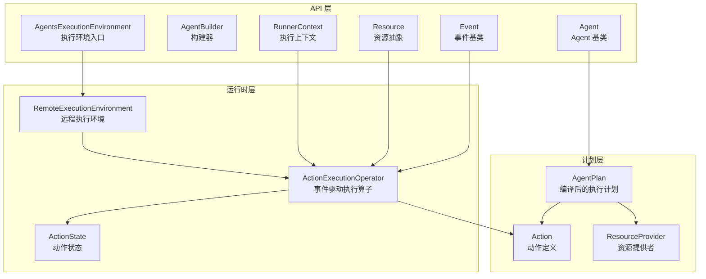
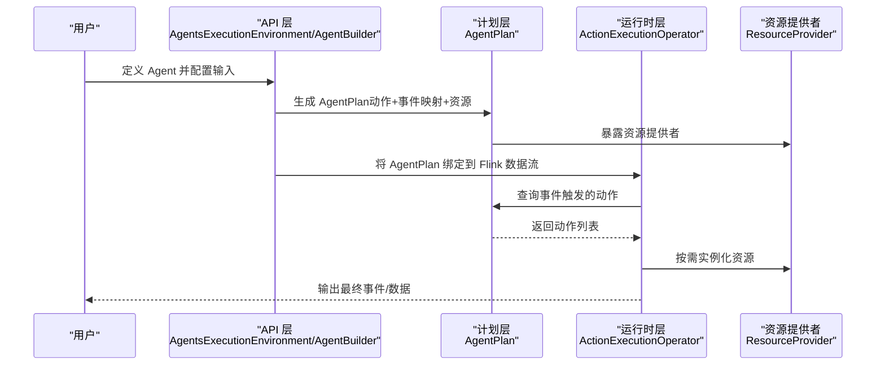
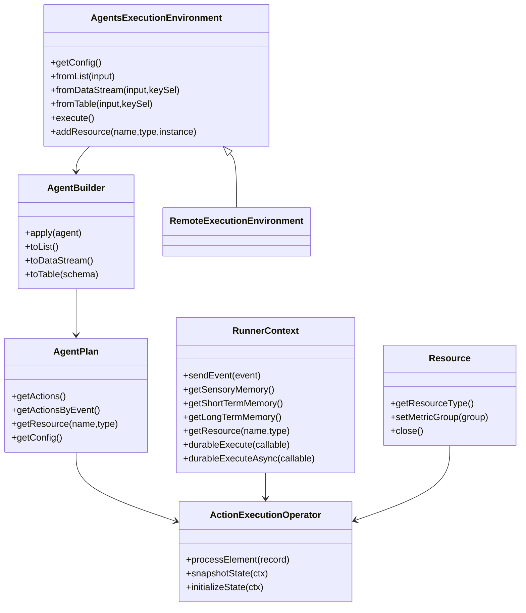
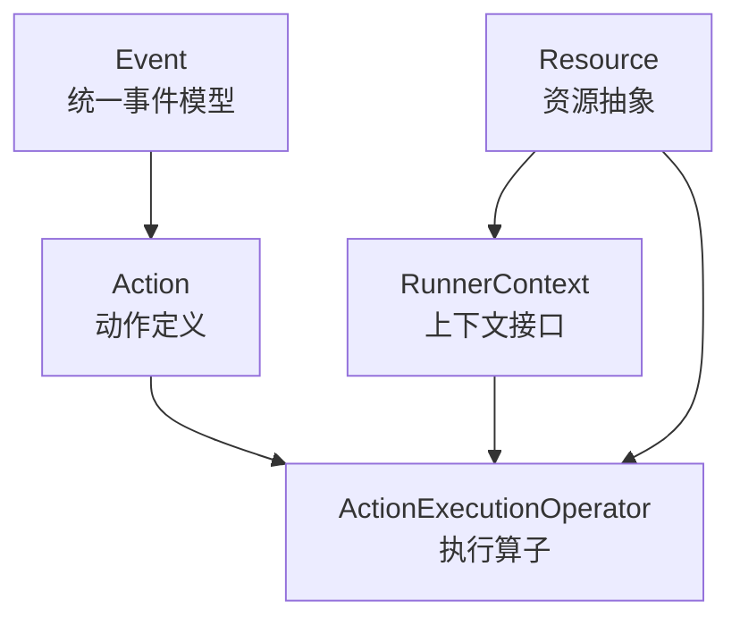
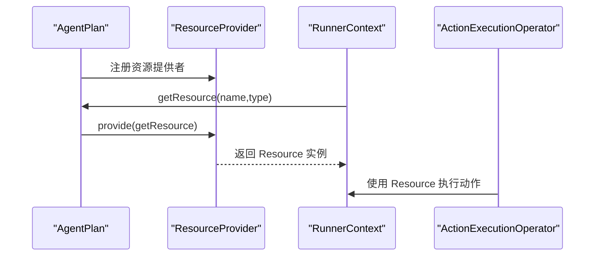
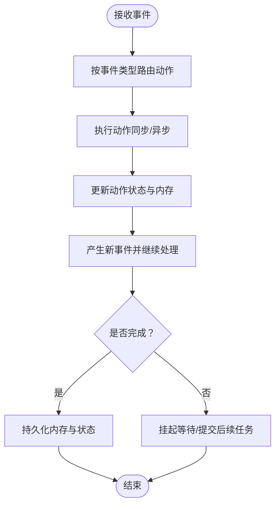
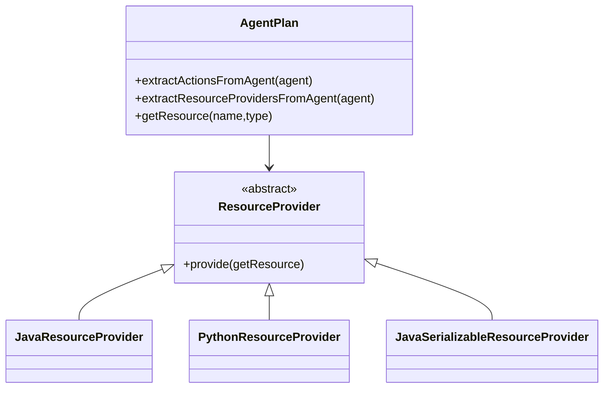
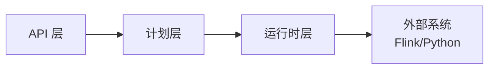
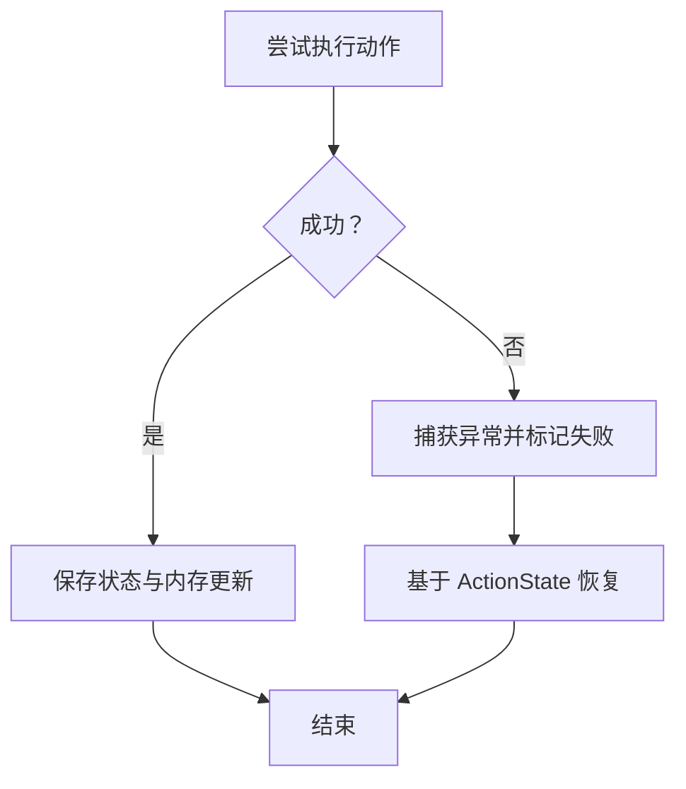

# 架构设计原则

<cite>
**本文引用的文件**
- [AgentBuilder.java](file://api/src/main/java/org/apache/flink/agents/api/AgentBuilder.java)
- [AgentsExecutionEnvironment.java](file://api/src/main/java/org/apache/flink/agents/api/AgentsExecutionEnvironment.java)
- [Agent.java](file://api/src/main/java/org/apache/flink/agents/api/agents/Agent.java)
- [Event.java](file://api/src/main/java/org/apache/flink/agents/api/Event.java)
- [RunnerContext.java](file://api/src/main/java/org/apache/flink/agents/api/context/RunnerContext.java)
- [Resource.java](file://api/src/main/java/org/apache/flink/agents/api/resource/Resource.java)
- [ActionExecutionOperator.java](file://runtime/src/main/java/org/apache/flink/agents/runtime/operator/ActionExecutionOperator.java)
- [RemoteExecutionEnvironment.java](file://runtime/src/main/java/org/apache/flink/agents/runtime/env/RemoteExecutionEnvironment.java)
- [ActionState.java](file://runtime/src/main/java/org/apache/flink/agents/runtime/actionstate/ActionState.java)
- [Action.java](file://plan/src/main/java/org/apache/flink/agents/plan/actions/Action.java)
- [AgentPlan.java](file://plan/src/main/java/org/apache/flink/agents/plan/AgentPlan.java)
- [ResourceProvider.java](file://plan/src/main/java/org/apache/flink/agents/plan/resourceprovider/ResourceProvider.java)
</cite>

## 目录
1. [引言](#引言)
2. [项目结构](#项目结构)
3. [核心组件](#核心组件)
4. [架构总览](#架构总览)
5. [详细组件分析](#详细组件分析)
6. [依赖关系分析](#依赖关系分析)
7. [性能考量](#性能考量)
8. [故障与错误处理策略](#故障与错误处理策略)
9. [结论](#结论)

## 引言
本指南面向架构师与高级开发者，系统阐述 Apache Flink Agents 的架构设计原则，围绕分层设计（API 层、计划层、运行时层）、接口隔离、依赖注入、事件驱动、插件化与扩展点、错误与降级策略以及性能优化进行深入解析，并提供可视化图示与实操建议，帮助在复杂流式场景中实现高可扩展性与可维护性。

## 项目结构
项目采用多模块分层组织：
- API 层：对外暴露统一的执行环境、事件模型、上下文与资源抽象，屏蔽底层差异。
- 计划层：将用户定义的 Agent 编译为可序列化的 AgentPlan，描述动作、事件映射与资源提供者。
- 运行时层：基于 Flink Operator 实现事件驱动的动作执行、状态持久化、内存与度量管理、Python 资源桥接等。

**图表来源**
- [AgentsExecutionEnvironment.java](file://api/src/main/java/org/apache/flink/agents/api/AgentsExecutionEnvironment.java#L43-L222)
- [AgentBuilder.java](file://api/src/main/java/org/apache/flink/agents/api/AgentBuilder.java#L35-L76)
- [Event.java](file://api/src/main/java/org/apache/flink/agents/api/Event.java#L30-L89)
- [RunnerContext.java](file://api/src/main/java/org/apache/flink/agents/api/context/RunnerContext.java#L33-L137)
- [Resource.java](file://api/src/main/java/org/apache/flink/agents/api/resource/Resource.java#L30-L70)
- [AgentPlan.java](file://plan/src/main/java/org/apache/flink/agents/plan/AgentPlan.java#L73-L624)
- [Action.java](file://plan/src/main/java/org/apache/flink/agents/plan/actions/Action.java#L43-L99)
- [ResourceProvider.java](file://plan/src/main/java/org/apache/flink/agents/plan/resourceprovider/ResourceProvider.java#L38-L75)
- [ActionExecutionOperator.java](file://runtime/src/main/java/org/apache/flink/agents/runtime/operator/ActionExecutionOperator.java#L118-L1132)
- [RemoteExecutionEnvironment.java](file://runtime/src/main/java/org/apache/flink/agents/runtime/env/RemoteExecutionEnvironment.java#L50-L216)
- [ActionState.java](file://runtime/src/main/java/org/apache/flink/agents/runtime/actionstate/ActionState.java#L28-L233)

**章节来源**
- [AgentsExecutionEnvironment.java](file://api/src/main/java/org/apache/flink/agents/api/AgentsExecutionEnvironment.java#L43-L222)
- [AgentPlan.java](file://plan/src/main/java/org/apache/flink/agents/plan/AgentPlan.java#L73-L624)
- [ActionExecutionOperator.java](file://runtime/src/main/java/org/apache/flink/agents/runtime/operator/ActionExecutionOperator.java#L118-L1132)

## 核心组件
- 执行环境与构建器：API 层通过执行环境工厂创建本地或远程环境，并以构建器将输入数据与 Agent 绑定，输出 DataStream/Table/List。
- 事件模型：统一的 Event 抽象承载事件标识、属性与时间戳，支持过滤、监听与日志记录。
- 动作与计划：计划层将注解与静态方法扫描为 Action，建立“事件类型 → 动作集合”的映射；同时收集资源提供者，形成可序列化计划。
- 运行时算子：运行时层基于 Flink Operator 实现事件驱动的执行，支持状态恢复、内存更新、度量与 Python 资源桥接。
- 上下文与资源：RunnerContext 提供发送事件、内存访问、资源获取、配置与持久化执行能力；Resource 抽象承载各类外部能力（模型、工具、向量库等）。

**章节来源**
- [AgentBuilder.java](file://api/src/main/java/org/apache/flink/agents/api/AgentBuilder.java#L35-L76)
- [AgentsExecutionEnvironment.java](file://api/src/main/java/org/apache/flink/agents/api/AgentsExecutionEnvironment.java#L68-L222)
- [Event.java](file://api/src/main/java/org/apache/flink/agents/api/Event.java#L30-L89)
- [Action.java](file://plan/src/main/java/org/apache/flink/agents/plan/actions/Action.java#L43-L99)
- [AgentPlan.java](file://plan/src/main/java/org/apache/flink/agents/plan/AgentPlan.java#L73-L624)
- [ActionExecutionOperator.java](file://runtime/src/main/java/org/apache/flink/agents/runtime/operator/ActionExecutionOperator.java#L118-L1132)
- [RunnerContext.java](file://api/src/main/java/org/apache/flink/agents/api/context/RunnerContext.java#L33-L137)
- [Resource.java](file://api/src/main/java/org/apache/flink/agents/api/resource/Resource.java#L30-L70)

## 架构总览
系统遵循“声明式计划 + 事件驱动执行”的模式：
- 用户在 API 层定义 Agent（动作、资源），由计划层生成可序列化 AgentPlan。
- 运行时层在 Flink 中以 Operator 形式消费事件，按事件类型路由到对应 Action，产出新事件并持续迭代，直至产生最终输出事件。
- 通过资源提供者与 RunnerContext 注入外部能力，支持 Java/Python 双栈资源与跨语言协作。

**图表来源**
- [AgentsExecutionEnvironment.java](file://api/src/main/java/org/apache/flink/agents/api/AgentsExecutionEnvironment.java#L68-L222)
- [AgentPlan.java](file://plan/src/main/java/org/apache/flink/agents/plan/AgentPlan.java#L73-L624)
- [ActionExecutionOperator.java](file://runtime/src/main/java/org/apache/flink/agents/runtime/operator/ActionExecutionOperator.java#L118-L1132)
- [ResourceProvider.java](file://plan/src/main/java/org/apache/flink/agents/plan/resourceprovider/ResourceProvider.java#L38-L75)

## 详细组件分析

### 分层设计原则与职责分离
- API 层：提供统一的执行环境与构建器，屏蔽本地/远程差异；暴露事件、上下文、资源抽象，保证上层仅关注业务逻辑。
- 计划层：负责将用户定义的 Agent 编译为可序列化计划，集中管理动作、事件映射与资源提供者，确保运行时可确定性与可恢复性。
- 运行时层：实现事件驱动的 Operator，负责状态恢复、内存更新、度量统计、Python 资源桥接与并发控制，保障高吞吐与容错。

**图表来源**
- [AgentsExecutionEnvironment.java](file://api/src/main/java/org/apache/flink/agents/api/AgentsExecutionEnvironment.java#L43-L222)
- [AgentBuilder.java](file://api/src/main/java/org/apache/flink/agents/api/AgentBuilder.java#L35-L76)
- [AgentPlan.java](file://plan/src/main/java/org/apache/flink/agents/plan/AgentPlan.java#L73-L624)
- [ActionExecutionOperator.java](file://runtime/src/main/java/org/apache/flink/agents/runtime/operator/ActionExecutionOperator.java#L118-L1132)
- [RunnerContext.java](file://api/src/main/java/org/apache/flink/agents/api/context/RunnerContext.java#L33-L137)
- [Resource.java](file://api/src/main/java/org/apache/flink/agents/api/resource/Resource.java#L30-L70)

**章节来源**
- [AgentsExecutionEnvironment.java](file://api/src/main/java/org/apache/flink/agents/api/AgentsExecutionEnvironment.java#L68-L222)
- [AgentPlan.java](file://plan/src/main/java/org/apache/flink/agents/plan/AgentPlan.java#L73-L624)
- [ActionExecutionOperator.java](file://runtime/src/main/java/org/apache/flink/agents/runtime/operator/ActionExecutionOperator.java#L118-L1132)

### 接口隔离原则
- 事件隔离：Event 作为所有事件的基类，提供统一标识与属性，避免上层直接依赖具体实现细节。
- 资源隔离：Resource 抽象出资源类型与生命周期，RunnerContext 仅暴露必要方法（获取资源、内存、度量），降低耦合。
- 动作隔离：Action 仅描述“事件监听 + 函数执行”，不关心具体实现语言，便于 Java/Python 统一调度。

**图表来源**
- [Event.java](file://api/src/main/java/org/apache/flink/agents/api/Event.java#L30-L89)
- [Action.java](file://plan/src/main/java/org/apache/flink/agents/plan/actions/Action.java#L43-L99)
- [RunnerContext.java](file://api/src/main/java/org/apache/flink/agents/api/context/RunnerContext.java#L33-L137)
- [Resource.java](file://api/src/main/java/org/apache/flink/agents/api/resource/Resource.java#L30-L70)
- [ActionExecutionOperator.java](file://runtime/src/main/java/org/apache/flink/agents/runtime/operator/ActionExecutionOperator.java#L118-L1132)

**章节来源**
- [Event.java](file://api/src/main/java/org/apache/flink/agents/api/Event.java#L30-L89)
- [RunnerContext.java](file://api/src/main/java/org/apache/flink/agents/api/context/RunnerContext.java#L33-L137)
- [Resource.java](file://api/src/main/java/org/apache/flink/agents/api/resource/Resource.java#L30-L70)

### 依赖注入模式：资源提供者与组件装配
- 资源提供者：ResourceProvider 在计划层携带资源元信息，在运行时按需实例化；支持 Java/Python 资源提供者与可序列化资源提供者。
- 组件装配：AgentPlan 收集注解与静态方法，生成动作与资源提供者映射；运行时通过 RunnerContext.getResource 获取资源，实现松耦合装配。
- 跨语言桥接：运行时根据计划自动初始化 Python 环境与适配器，实现 Java/Python 资源互访。

**图表来源**
- [AgentPlan.java](file://plan/src/main/java/org/apache/flink/agents/plan/AgentPlan.java#L73-L624)
- [ResourceProvider.java](file://plan/src/main/java/org/apache/flink/agents/plan/resourceprovider/ResourceProvider.java#L38-L75)
- [RunnerContext.java](file://api/src/main/java/org/apache/flink/agents/api/context/RunnerContext.java#L89-L137)
- [ActionExecutionOperator.java](file://runtime/src/main/java/org/apache/flink/agents/runtime/operator/ActionExecutionOperator.java#L604-L610)

**章节来源**
- [AgentPlan.java](file://plan/src/main/java/org/apache/flink/agents/plan/AgentPlan.java#L73-L624)
- [ResourceProvider.java](file://plan/src/main/java/org/apache/flink/agents/plan/resourceprovider/ResourceProvider.java#L38-L75)
- [ActionExecutionOperator.java](file://runtime/src/main/java/org/apache/flink/agents/runtime/operator/ActionExecutionOperator.java#L604-L610)

### 事件驱动架构：事件类型设计与异步处理
- 事件类型设计：Event 提供唯一 ID、属性与可选源时间戳；不同动作监听不同事件类型，形成“事件 → 动作”的路由。
- 异步处理：RunnerContext.durableExecuteAsync 利用 Continuation 在 JDK 21+ 实现挂起/恢复，JDK < 21 回退同步；支持细粒度结果缓存与恢复。
- 状态与恢复：ActionState 记录动作执行进度、内存更新与输出事件，结合 ActionStateStore 支持 Kafka/内存等后端，实现精确恢复。

**图表来源**
- [Event.java](file://api/src/main/java/org/apache/flink/agents/api/Event.java#L30-L89)
- [Action.java](file://plan/src/main/java/org/apache/flink/agents/plan/actions/Action.java#L43-L99)
- [ActionState.java](file://runtime/src/main/java/org/apache/flink/agents/runtime/actionstate/ActionState.java#L28-L233)
- [RunnerContext.java](file://api/src/main/java/org/apache/flink/agents/api/context/RunnerContext.java#L113-L133)
- [ActionExecutionOperator.java](file://runtime/src/main/java/org/apache/flink/agents/runtime/operator/ActionExecutionOperator.java#L426-L601)

**章节来源**
- [ActionExecutionOperator.java](file://runtime/src/main/java/org/apache/flink/agents/runtime/operator/ActionExecutionOperator.java#L426-L601)
- [ActionState.java](file://runtime/src/main/java/org/apache/flink/agents/runtime/actionstate/ActionState.java#L28-L233)
- [RunnerContext.java](file://api/src/main/java/org/apache/flink/agents/api/context/RunnerContext.java#L113-L133)

### 插件化设计：扩展点与第三方集成
- 扩展点：AgentPlan 支持通过注解与静态方法声明动作与资源；资源提供者抽象支持 Java/Python 与可序列化资源，便于第三方集成。
- 第三方集成：通过 ResourceProvider 与 RunnerContext 资源获取，可无缝接入外部模型、工具与向量库；运行时自动桥接 Python 资源。
- 配置与兼容：AgentPlan 支持从 YAML 加载配置，保证部署一致性与版本兼容。

**图表来源**
- [AgentPlan.java](file://plan/src/main/java/org/apache/flink/agents/plan/AgentPlan.java#L334-L598)
- [ResourceProvider.java](file://plan/src/main/java/org/apache/flink/agents/plan/resourceprovider/ResourceProvider.java#L38-L75)

**章节来源**
- [AgentPlan.java](file://plan/src/main/java/org/apache/flink/agents/plan/AgentPlan.java#L334-L598)
- [ResourceProvider.java](file://plan/src/main/java/org/apache/flink/agents/plan/resourceprovider/ResourceProvider.java#L38-L75)

## 依赖关系分析
- 组件耦合：API 层与运行时层通过计划层解耦；动作与资源通过 Provider 解耦；上下文仅暴露必要接口，避免直接依赖具体实现。
- 外部依赖：运行时依赖 Flink Operator 生命周期与状态后端；Python 资源依赖 pemja 与分布式缓存传递依赖信息。
- 循环依赖：未见循环依赖迹象；计划层仅持有资源提供者与动作描述，运行时按需实例化。

**图表来源**
- [AgentsExecutionEnvironment.java](file://api/src/main/java/org/apache/flink/agents/api/AgentsExecutionEnvironment.java#L68-L222)
- [AgentPlan.java](file://plan/src/main/java/org/apache/flink/agents/plan/AgentPlan.java#L73-L624)
- [ActionExecutionOperator.java](file://runtime/src/main/java/org/apache/flink/agents/runtime/operator/ActionExecutionOperator.java#L118-L1132)

**章节来源**
- [ActionExecutionOperator.java](file://runtime/src/main/java/org/apache/flink/agents/runtime/operator/ActionExecutionOperator.java#L118-L1132)

## 性能考量
- 内存管理：动作完成后清理感官记忆，减少状态体积；ActionState 在完成时清空中间调用结果，降低存储压力。
- 并发控制：使用 MailboxExecutor 串行化同一键的任务队列，避免乱序；异步执行通过 ContinuationActionExecutor 控制并发线程数。
- 资源优化：资源实例化采用缓存（AgentPlan 资源缓存），避免重复创建；Python 环境按需初始化，减少启动开销。
- 序列化与网络：计划层对动作与资源提供者进行 JSON 序列化，便于跨语言传输与持久化。

**章节来源**
- [ActionState.java](file://runtime/src/main/java/org/apache/flink/agents/runtime/actionstate/ActionState.java#L148-L180)
- [ActionExecutionOperator.java](file://runtime/src/main/java/org/apache/flink/agents/runtime/operator/ActionExecutionOperator.java#L314-L318)
- [AgentPlan.java](file://plan/src/main/java/org/apache/flink/agents/plan/AgentPlan.java#L231-L264)

## 故障与错误处理策略
- 错误传播：运行时捕获动作执行异常并通过邮箱线程抛出，确保失败可见且可定位。
- 恢复与重放：ActionState 记录已完成动作与内存更新，重启后跳过已完成步骤并重放内存与事件，保证幂等。
- 降级机制：当资源不可用时，RunnerContext.getResource 抛出异常；可通过配置切换回本地/简化资源，保证流程可用。
- 日志与度量：内置事件日志与度量组，便于问题诊断与性能监控。

**图表来源**
- [ActionExecutionOperator.java](file://runtime/src/main/java/org/apache/flink/agents/runtime/operator/ActionExecutionOperator.java#L426-L601)
- [ActionState.java](file://runtime/src/main/java/org/apache/flink/agents/runtime/actionstate/ActionState.java#L168-L180)

**章节来源**
- [ActionExecutionOperator.java](file://runtime/src/main/java/org/apache/flink/agents/runtime/operator/ActionExecutionOperator.java#L426-L601)
- [ActionState.java](file://runtime/src/main/java/org/apache/flink/agents/runtime/actionstate/ActionState.java#L168-L180)

## 结论
本指南总结了 Apache Flink Agents 的分层设计、接口隔离、依赖注入、事件驱动与插件化扩展等关键原则，并结合运行时状态与资源管理给出性能与可靠性建议。遵循这些原则可在复杂流式场景中实现高可扩展性与可维护性，同时保持跨语言与第三方集成的灵活性。