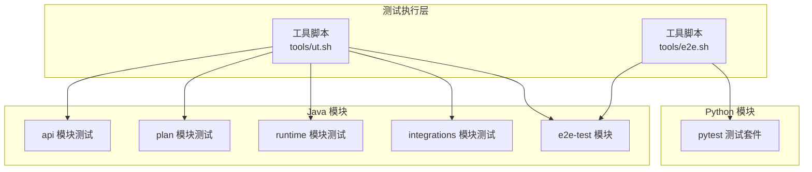
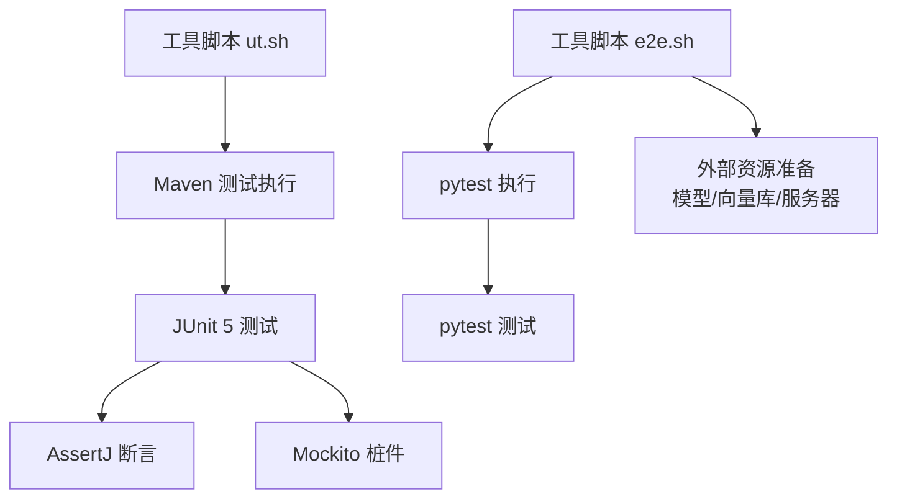
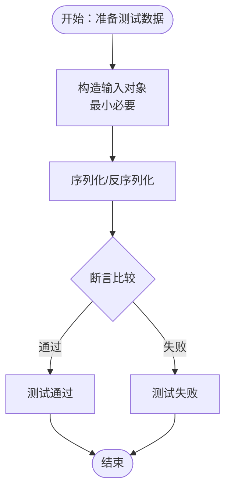
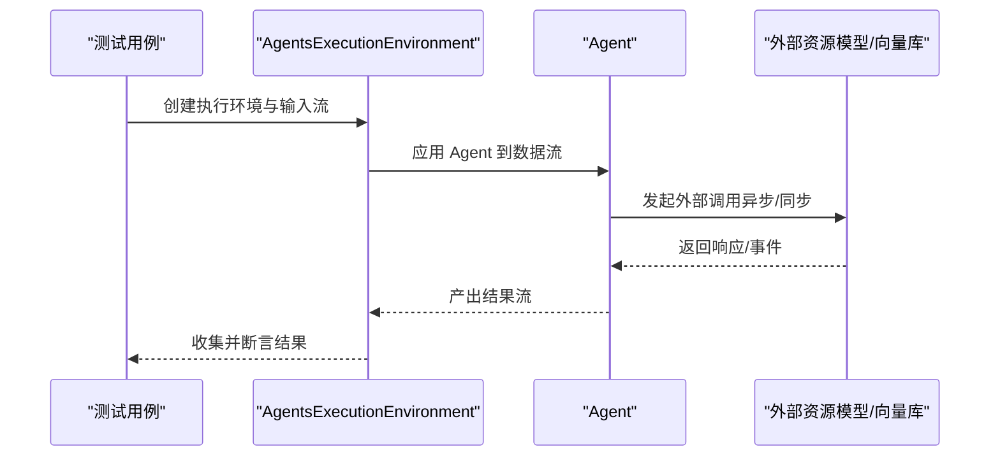
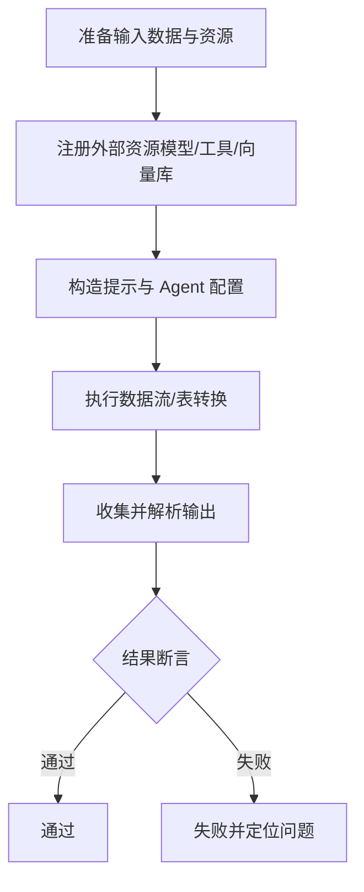
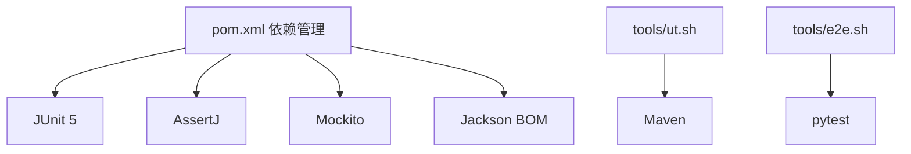

# 测试编写规范

<cite>
**本文引用的文件**
- [pom.xml](file://pom.xml)
- [tools/ut.sh](file://tools/ut.sh)
- [tools/e2e.sh](file://tools/e2e.sh)
- [api/src/test/java/org/apache/flink/agents/api/agents/ReActAgentTest.java](file://api/src/test/java/org/apache/flink/agents/api/agents/ReActAgentTest.java)
- [plan/src/test/java/org/apache/flink/agents/plan/serializer/AgentPlanJsonSerializerTest.java](file://plan/src/test/java/org/apache/flink/agents/plan/serializer/AgentPlanJsonSerializerTest.java)
- [runtime/src/test/java/org/apache/flink/agents/runtime/actionstate/ActionStateSerdeTest.java](file://runtime/src/test/java/org/apache/flink/agents/runtime/actionstate/ActionStateSerdeTest.java)
- [integrations/mcp/src/test/java/org/apache/flink/agents/integrations/mcp/MCPServerTest.java](file://integrations/mcp/src/test/java/org/apache/flink/agents/integrations/mcp/MCPServerTest.java)
- [e2e-test/flink-agents-end-to-end-tests-integration/src/test/java/org/apache/flink/agents/integration/test/AsyncExecutionTest.java](file://e2e-test/flink-agents-end-to-end-tests-integration/src/test/java/org/apache/flink/agents/integration/test/AsyncExecutionTest.java)
- [python/flink_agents/e2e_tests/e2e_tests_integration/react_agent_test.py](file://python/flink_agents/e2e_tests/e2e_tests_integration/react_agent_test.py)
- [python/pyproject.toml](file://python/pyproject.toml)
</cite>

## 目录
1. [引言](#引言)
2. [项目结构](#项目结构)
3. [核心组件](#核心组件)
4. [架构总览](#架构总览)
5. [详细组件分析](#详细组件分析)
6. [依赖关系分析](#依赖关系分析)
7. [性能考虑](#性能考虑)
8. [故障排查指南](#故障排查指南)
9. [结论](#结论)
10. [附录](#附录)

## 引言
本规范旨在为 Apache Flink Agents 项目建立统一、可执行且可维护的测试体系，覆盖单元测试、集成测试与端到端测试（E2E），明确测试用例设计、断言使用、测试数据准备、覆盖率目标、测试工具使用、测试数据管理以及持续集成策略。文档以现有测试实践为基础，结合仓库中的实际测试文件进行提炼与扩展，确保代码质量与系统稳定性。

## 项目结构
项目采用多模块 Maven 结构，测试分布在以下模块：
- Java 单元测试：api、plan、runtime、integrations 等模块的 test 目录
- 集成测试：e2e-test 模块下的多个子工程
- Python 测试：python 子项目中使用 pytest 的测试套件

测试运行通过统一脚本工具进行编排，支持 Java/Python 双栈测试、多 Flink 版本矩阵、E2E 脚本等。

**图表来源**
- [tools/ut.sh](file://tools/ut.sh#L122-L196)
- [tools/e2e.sh](file://tools/e2e.sh#L20-L86)

**章节来源**
- [pom.xml](file://pom.xml#L58-L67)
- [tools/ut.sh](file://tools/ut.sh#L122-L196)
- [tools/e2e.sh](file://tools/e2e.sh#L20-L86)

## 核心组件
- 测试框架与断言库
  - JUnit 5：统一的 Java 测试框架
  - AssertJ：流式断言，提升可读性与表达力
  - Mockito：用于桩件与行为验证
- 测试工具链
  - Maven Surefire 插件：执行 Java 单元测试
  - pytest：Python 测试执行器
  - 工具脚本：统一编排 Java/Python/E2E 测试

**章节来源**
- [pom.xml](file://pom.xml#L82-L107)
- [tools/ut.sh](file://tools/ut.sh#L122-L196)
- [tools/e2e.sh](file://tools/e2e.sh#L20-L86)

## 架构总览
下图展示了测试在项目中的分层与交互关系，从工具脚本到各模块测试，再到外部依赖与资源准备。

**图表来源**
- [tools/ut.sh](file://tools/ut.sh#L122-L196)
- [tools/e2e.sh](file://tools/e2e.sh#L20-L86)
- [pom.xml](file://pom.xml#L82-L107)

## 详细组件分析

### 单元测试规范
- 测试用例设计
  - 每个被测类/方法应有独立测试类；测试类命名以 Test 结尾
  - 使用参数化与组合场景覆盖边界与异常路径
  - 优先使用领域内对象构造器或工厂方法创建输入，避免硬编码
- 断言使用
  - 优先使用 AssertJ 进行链式断言，提升可读性
  - 对 JSON 序列化/反序列化使用 ObjectMapper 进行 round-trip 校验
- 测试数据准备
  - 使用最小必要数据构造输入；对复杂对象使用构建器模式
  - 对需要序列化的对象，先序列化再反序列化，断言相等性
- 示例参考
  - 输出模式序列化/反序列化校验
  - 计划序列化器对动作与事件映射的校验
  - 动作状态的序列化/反序列化与字段一致性校验

**图表来源**
- [api/src/test/java/org/apache/flink/agents/api/agents/ReActAgentTest.java](file://api/src/test/java/org/apache/flink/agents/api/agents/ReActAgentTest.java#L31-L43)
- [plan/src/test/java/org/apache/flink/agents/plan/serializer/AgentPlanJsonSerializerTest.java](file://plan/src/test/java/org/apache/flink/agents/plan/serializer/AgentPlanJsonSerializerTest.java#L68-L100)
- [runtime/src/test/java/org/apache/flink/agents/runtime/actionstate/ActionStateSerdeTest.java](file://runtime/src/test/java/org/apache/flink/agents/runtime/actionstate/ActionStateSerdeTest.java#L37-L92)

**章节来源**
- [api/src/test/java/org/apache/flink/agents/api/agents/ReActAgentTest.java](file://api/src/test/java/org/apache/flink/agents/api/agents/ReActAgentTest.java#L29-L45)
- [plan/src/test/java/org/apache/flink/agents/plan/serializer/AgentPlanJsonSerializerTest.java](file://plan/src/test/java/org/apache/flink/agents/plan/serializer/AgentPlanJsonSerializerTest.java#L40-L230)
- [runtime/src/test/java/org/apache/flink/agents/runtime/actionstate/ActionStateSerdeTest.java](file://runtime/src/test/java/org/apache/flink/agents/runtime/actionstate/ActionStateSerdeTest.java#L34-L257)

### 集成测试规范
- 组件交互测试
  - 基于 Flink DataStream/Table 环境，验证跨组件协作（如聊天模型、嵌入模型、向量库、内存）
  - 使用 AgentsExecutionEnvironment 将输入转换为输出，断言结果类型与内容
- 外部依赖模拟
  - 通过资源注册与描述符配置，将外部服务抽象为受控资源
  - 对不可靠外部依赖（如 LLM）使用条件跳过与降级策略
- 示例参考
  - 异步执行测试：验证 durableExecuteAsync、并发键处理、JDK 21 上的并行性检测
  - 资源跨语言测试：Java/Python 资源互通与配置传递
  - MCP 服务器：端点、超时、认证、头部、序列化/反序列化与不可变性

**图表来源**
- [e2e-test/flink-agents-end-to-end-tests-integration/src/test/java/org/apache/flink/agents/integration/test/AsyncExecutionTest.java](file://e2e-test/flink-agents-end-to-end-tests-integration/src/test/java/org/apache/flink/agents/integration/test/AsyncExecutionTest.java#L44-L96)
- [integrations/mcp/src/test/java/org/apache/flink/agents/integrations/mcp/MCPServerTest.java](file://integrations/mcp/src/test/java/org/apache/flink/agents/integrations/mcp/MCPServerTest.java#L44-L155)

**章节来源**
- [e2e-test/flink-agents-end-to-end-tests-integration/src/test/java/org/apache/flink/agents/integration/test/AsyncExecutionTest.java](file://e2e-test/flink-agents-end-to-end-tests-integration/src/test/java/org/apache/flink/agents/integration/test/AsyncExecutionTest.java#L36-L391)
- [integrations/mcp/src/test/java/org/apache/flink/agents/integrations/mcp/MCPServerTest.java](file://integrations/mcp/src/test/java/org/apache/flink/agents/integrations/mcp/MCPServerTest.java#L40-L247)

### 端到端测试策略
- 完整流程测试
  - 覆盖从输入到输出的完整链路，包括资源注册、提示构造、工具调用、结果解析
  - 对 Python 侧 ReAct Agent 在本地与远程执行环境分别验证
- 性能基准测试
  - 通过异步任务的执行时间区间重叠判断 JDK 21+ 并行执行能力
  - 对高并发键场景进行吞吐与一致性验证
- 示例参考
  - ReAct Agent 在本地与远程执行环境的端到端验证
  - 异步执行并行性检测与多键高负载测试

**图表来源**
- [python/flink_agents/e2e_tests/e2e_tests_integration/react_agent_test.py](file://python/flink_agents/e2e_tests/e2e_tests_integration/react_agent_test.py#L81-L134)
- [e2e-test/flink-agents-end-to-end-tests-integration/src/test/java/org/apache/flink/agents/integration/test/AsyncExecutionTest.java](file://e2e-test/flink-agents-end-to-end-tests-integration/src/test/java/org/apache/flink/agents/integration/test/AsyncExecutionTest.java#L219-L334)

**章节来源**
- [python/flink_agents/e2e_tests/e2e_tests_integration/react_agent_test.py](file://python/flink_agents/e2e_tests/e2e_tests_integration/react_agent_test.py#L1-L240)
- [e2e-test/flink-agents-end-to-end-tests-integration/src/test/java/org/apache/flink/agents/integration/test/AsyncExecutionTest.java](file://e2e-test/flink-agents-end-to-end-tests-integration/src/test/java/org/apache/flink/agents/integration/test/AsyncExecutionTest.java#L36-L391)

## 依赖关系分析
- 测试依赖管理
  - JUnit 5、AssertJ、Mockito 作为统一测试依赖
  - Jackson BOM 管理 Jackson 生态版本
- 工具脚本依赖
  - Maven 用于 Java 测试编译与执行
  - pytest 用于 Python 测试执行
  - Bash 脚本负责 E2E 流程编排与资源准备

**图表来源**
- [pom.xml](file://pom.xml#L69-L107)
- [tools/ut.sh](file://tools/ut.sh#L122-L196)
- [tools/e2e.sh](file://tools/e2e.sh#L20-L86)

**章节来源**
- [pom.xml](file://pom.xml#L69-L107)
- [tools/ut.sh](file://tools/ut.sh#L122-L196)
- [tools/e2e.sh](file://tools/e2e.sh#L20-L86)

## 性能考虑
- 异步执行与并行度
  - 使用 JDK 21+ 的 Continuation 进行并行异步执行，通过时间区间重叠验证并行性
  - 多键高负载测试验证不同键的独立处理与并发隔离
- 资源与延迟
  - 对外部服务调用增加超时与重试策略，避免单点阻塞
  - 对模型服务使用条件跳过，保证测试可重复性

**章节来源**
- [e2e-test/flink-agents-end-to-end-tests-integration/src/test/java/org/apache/flink/agents/integration/test/AsyncExecutionTest.java](file://e2e-test/flink-agents-end-to-end-tests-integration/src/test/java/org/apache/flink/agents/integration/test/AsyncExecutionTest.java#L219-L334)

## 故障排查指南
- 常见问题定位
  - 序列化/反序列化失败：检查字段完整性与类型匹配
  - 外部依赖不可用：确认资源是否正确注册与可用，必要时跳过测试
  - 并发与并行性：在 JDK 21+ 下观察异步任务时间区间重叠情况
- 日志与调试
  - 使用日志配置与断言信息定位失败点
  - 对 Python 测试，使用 pytest 的详细输出与临时目录结果比对

**章节来源**
- [runtime/src/test/java/org/apache/flink/agents/runtime/actionstate/ActionStateSerdeTest.java](file://runtime/src/test/java/org/apache/flink/agents/runtime/actionstate/ActionStateSerdeTest.java#L37-L92)
- [integrations/mcp/src/test/java/org/apache/flink/agents/integrations/mcp/MCPServerTest.java](file://integrations/mcp/src/test/java/org/apache/flink/agents/integrations/mcp/MCPServerTest.java#L113-L122)
- [e2e-test/flink-agents-end-to-end-tests-integration/src/test/java/org/apache/flink/agents/integration/test/AsyncExecutionTest.java](file://e2e-test/flink-agents-end-to-end-tests-integration/src/test/java/org/apache/flink/agents/integration/test/AsyncExecutionTest.java#L276-L331)

## 结论
通过统一的测试框架、清晰的测试分层与严格的断言策略，结合工具脚本的自动化编排，Apache Flink Agents 项目能够稳定地保障核心功能的质量与可靠性。建议在后续迭代中逐步完善覆盖率指标与自动化回归策略，持续提升测试效率与系统健壮性。

## 附录

### 测试覆盖率要求（建议）
- 行覆盖率：≥ 80%
- 分支覆盖率：≥ 70%
- 条件覆盖率：≥ 60%
- 说明：以上为建议阈值，可根据模块重要性与风险调整；建议在 CI 中引入覆盖率报告与阈值拦截。

[本节为通用指导，不直接分析具体文件，故无“章节来源”]

### 测试工具使用指南
- JUnit 5
  - 使用注解组织测试生命周期与用例
  - 使用 AssertJ 提升断言可读性
- Mockito
  - 仅对不可控外部依赖进行桩件，避免过度 mock
- AssertJ
  - 使用流式断言链，增强可读性与错误定位

**章节来源**
- [pom.xml](file://pom.xml#L82-L107)
- [plan/src/test/java/org/apache/flink/agents/plan/serializer/AgentPlanJsonSerializerTest.java](file://plan/src/test/java/org/apache/flink/agents/plan/serializer/AgentPlanJsonSerializerTest.java#L37-L100)

### 测试数据管理
- 测试夹具
  - 使用最小输入构造器与工厂方法，避免冗余数据
- 测试环境
  - 对 Python 测试，使用 pyproject.toml 的测试依赖组
  - 对 Java 测试，通过 Maven 依赖与测试编译保证环境一致
- 数据清理
  - 对临时文件与外部资源，使用工具脚本统一清理

**章节来源**
- [python/pyproject.toml](file://python/pyproject.toml#L85-L88)
- [tools/e2e.sh](file://tools/e2e.sh#L156-L159)

### 持续集成要求
- 测试执行时间限制
  - 建议为单次测试设置超时上限，避免长时间挂起
- 并行测试策略
  - 使用工具脚本的并行参数与线程池配置，提高整体吞吐
- 多版本矩阵
  - 通过工具脚本支持多 Flink 版本测试，确保兼容性

**章节来源**
- [tools/ut.sh](file://tools/ut.sh#L173-L175)
- [tools/e2e.sh](file://tools/e2e.sh#L149-L154)