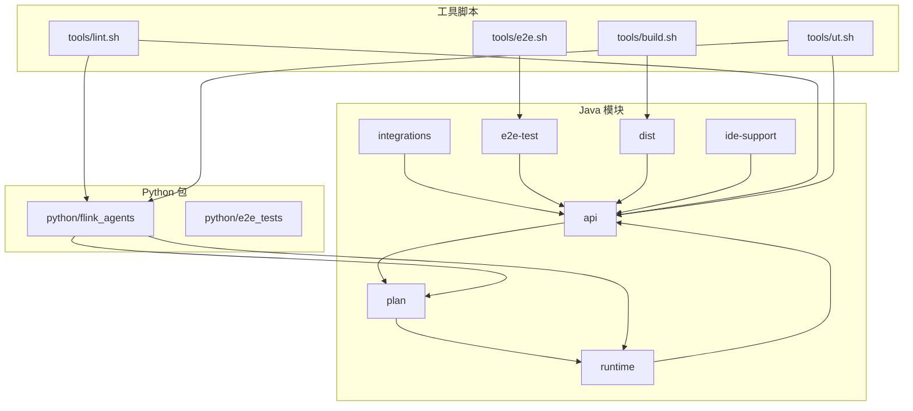
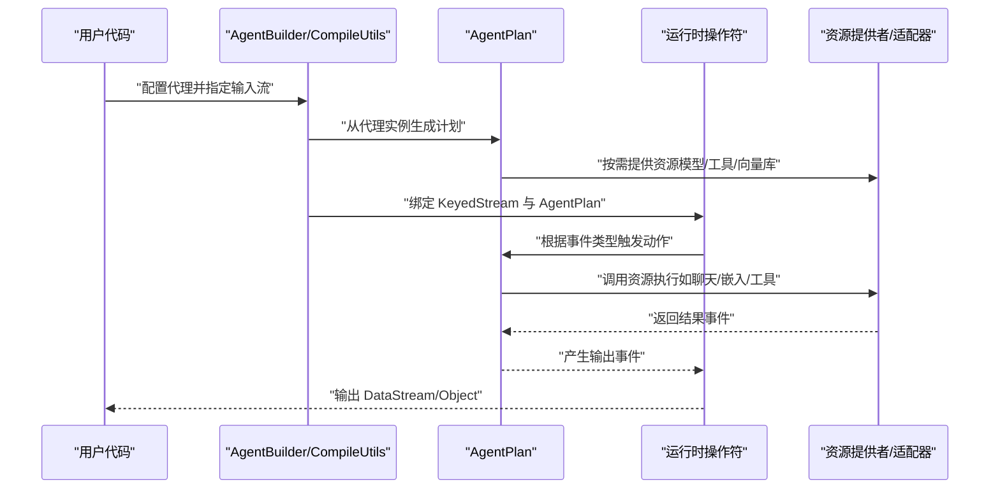
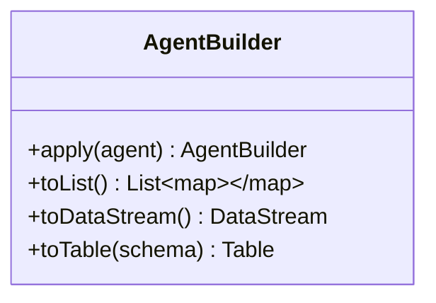
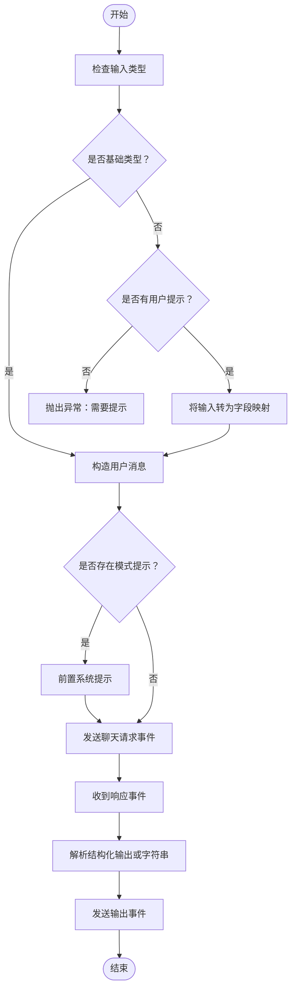
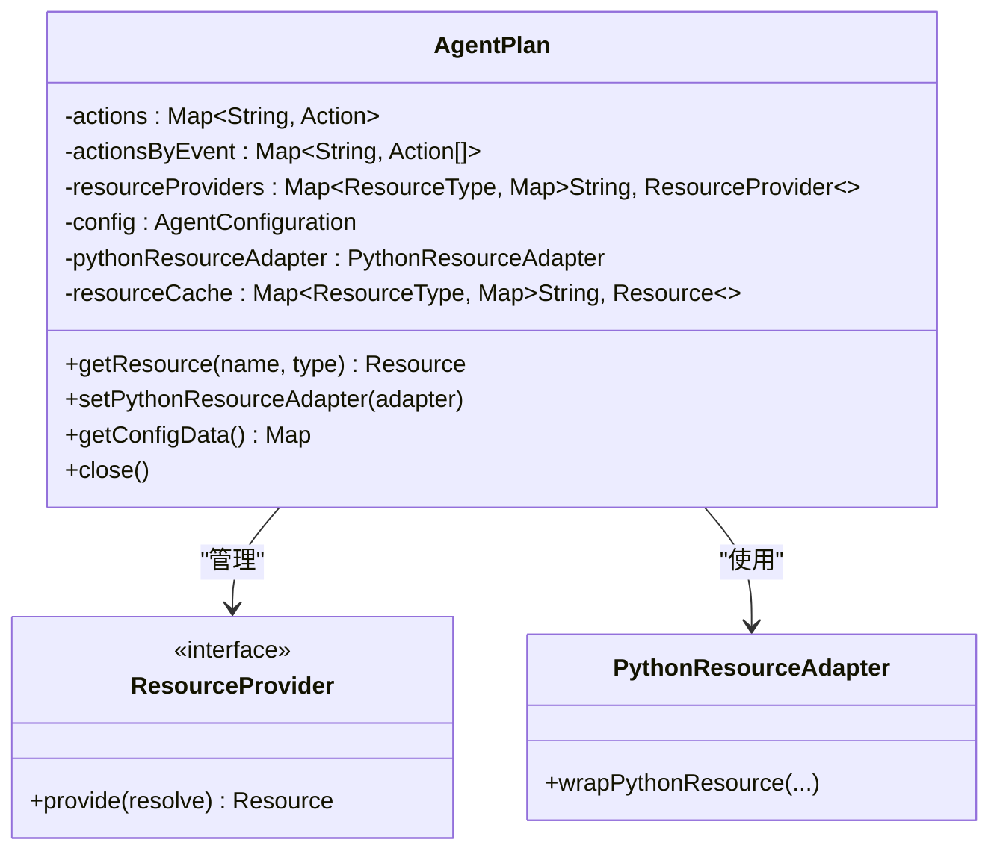
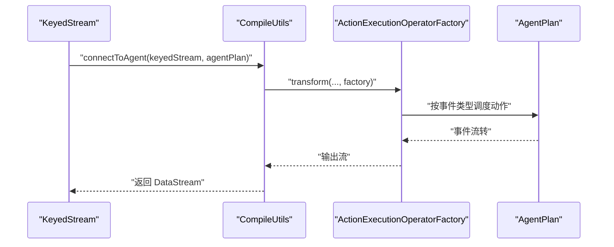
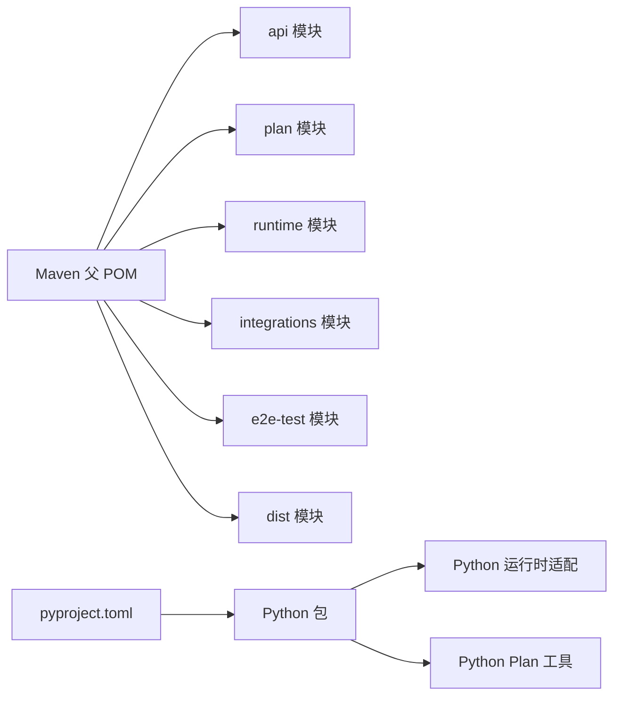

# 开发指南

<cite>
**本文引用的文件**
- [README.md](file://README.md)
- [pom.xml](file://pom.xml)
- [pyproject.toml](file://python/pyproject.toml)
- [build.sh](file://tools/build.sh)
- [lint.sh](file://tools/lint.sh)
- [ut.sh](file://tools/ut.sh)
- [e2e.sh](file://tools/e2e.sh)
- [AgentBuilder.java](file://api/src/main/java/org/apache/flink/agents/api/AgentBuilder.java)
- [ReActAgent.java](file://api/src/main/java/org/apache/flink/agents/api/agents/ReActAgent.java)
- [Configuration.java](file://api/src/main/java/org/apache/flink/agents/api/configuration/Configuration.java)
- [AgentPlan.java](file://plan/src/main/java/org/apache/flink/agents/plan/AgentPlan.java)
- [CompileUtils.java](file://runtime/src/main/java/org/apache/flink/agents/runtime/CompileUtils.java)
- [CONTRIBUTING.md](file://.github/CONTRIBUTING.md)
- [react_agent.md](file://docs/content/docs/development/react_agent.md)
</cite>

## 目录
1. [简介](#简介)
2. [项目结构](#项目结构)
3. [核心组件](#核心组件)
4. [架构总览](#架构总览)
5. [详细组件分析](#详细组件分析)
6. [依赖关系分析](#依赖关系分析)
7. [性能考虑](#性能考虑)
8. [故障排查指南](#故障排查指南)
9. [结论](#结论)
10. [附录](#附录)

## 简介
Apache Flink Agents 是一个基于 Apache Flink 的智能体（Agent）框架，支持在流式数据处理管道中集成大模型推理与工具调用能力。项目同时提供 Java 与 Python 双语言 API，并通过跨语言资源适配实现 Java 与 Python 资源的统一编排。

## 项目结构
项目采用多模块聚合结构，核心模块包括：
- api：对外 API 与注解、事件、配置、资源等抽象
- plan：代理计划（AgentPlan）序列化/反序列化与资源提供者管理
- runtime：运行时桥接 Flink DataStream/SQL 与代理执行
- integrations：第三方模型与向量库等集成
- e2e-test：端到端测试与跨语言兼容性测试
- python：Python 包与示例、测试与资源适配
- tools：构建、格式化、测试与发布辅助脚本

图表来源
- [pom.xml](file://pom.xml#L58-L67)
- [pyproject.toml](file://python/pyproject.toml#L64-L69)

章节来源
- [pom.xml](file://pom.xml#L58-L67)
- [pyproject.toml](file://python/pyproject.toml#L64-L69)

## 核心组件
- 代理构建器（AgentBuilder）：提供将代理接入 Flink DataStream/Table 的统一入口，支持本地列表输出、数据流输出与表输出三种模式。
- ReAct 代理（ReActAgent）：内置的推理与行动代理，支持用户提示、输出模式约束与工具调用。
- 代理计划（AgentPlan）：从代理实例扫描注解生成可序列化的执行计划，管理动作、事件映射与资源提供者。
- 运行时桥接（CompileUtils）：将 KeyedStream 与 AgentPlan 绑定，生成代理执行后的输出流。
- 配置接口（Configuration）：统一读写配置能力。

章节来源
- [AgentBuilder.java](file://api/src/main/java/org/apache/flink/agents/api/AgentBuilder.java#L35-L76)
- [ReActAgent.java](file://api/src/main/java/org/apache/flink/agents/api/agents/ReActAgent.java#L51-L182)
- [AgentPlan.java](file://plan/src/main/java/org/apache/flink/agents/plan/AgentPlan.java#L70-L281)
- [CompileUtils.java](file://runtime/src/main/java/org/apache/flink/agents/runtime/CompileUtils.java#L34-L84)
- [Configuration.java](file://api/src/main/java/org/apache/flink/agents/api/configuration/Configuration.java#L20-L24)

## 架构总览
下图展示了从输入数据到代理执行再到输出的端到端流程，以及 Java 与 Python 资源的交互路径。

图表来源
- [CompileUtils.java](file://runtime/src/main/java/org/apache/flink/agents/runtime/CompileUtils.java#L44-L84)
- [AgentPlan.java](file://plan/src/main/java/org/apache/flink/agents/plan/AgentPlan.java#L231-L264)

## 详细组件分析

### 代理构建器（AgentBuilder）
- 职责：为不同执行环境提供统一的代理接入接口，支持本地列表、Flink DataStream 与 Table 输出。
- 关键方法：apply、toList、toDataStream、toTable。
- 设计要点：链式调用、类型安全的输出转换、与 Flink 类型系统对接。

图表来源
- [AgentBuilder.java](file://api/src/main/java/org/apache/flink/agents/api/AgentBuilder.java#L35-L76)

章节来源
- [AgentBuilder.java](file://api/src/main/java/org/apache/flink/agents/api/AgentBuilder.java#L35-L76)

### ReAct 代理（ReActAgent）
- 职责：内置推理与行动代理，支持用户提示注入、输出模式约束与事件驱动的动作执行。
- 关键点：默认资源注册、输入消息构造、响应解析与输出事件发送。
- 使用建议：为复杂输入提供明确提示；通过输出模式约束确保结构化输出。

图表来源
- [ReActAgent.java](file://api/src/main/java/org/apache/flink/agents/api/agents/ReActAgent.java#L103-L181)

章节来源
- [ReActAgent.java](file://api/src/main/java/org/apache/flink/agents/api/agents/ReActAgent.java#L51-L182)
- [react_agent.md](file://docs/content/docs/development/react_agent.md#L37-L59)

### 代理计划（AgentPlan）
- 职责：从代理实例扫描注解生成可序列化的执行计划，维护动作映射、事件触发关系与资源提供者。
- 关键点：资源缓存、Python 资源适配器集成、跨语言 MCP 服务器发现与工具/提示注入。
- 序列化：支持对象序列化与 JSON 序列化，便于跨进程/跨语言传递。

图表来源
- [AgentPlan.java](file://plan/src/main/java/org/apache/flink/agents/plan/AgentPlan.java#L73-L281)

章节来源
- [AgentPlan.java](file://plan/src/main/java/org/apache/flink/agents/plan/AgentPlan.java#L70-L281)

### 运行时桥接（CompileUtils）
- 职责：将 KeyedStream 与 AgentPlan 绑定，生成代理执行后的输出流，区分 Java/Python 输入类型。
- 关键点：OperatorFactory 绑定、并行度继承、类型信息适配。

图表来源
- [CompileUtils.java](file://runtime/src/main/java/org/apache/flink/agents/runtime/CompileUtils.java#L44-L84)

章节来源
- [CompileUtils.java](file://runtime/src/main/java/org/apache/flink/agents/runtime/CompileUtils.java#L34-L84)

### 配置接口（Configuration）
- 职责：统一读写配置能力，结合可序列化配置对象用于代理计划与运行时参数传递。

章节来源
- [Configuration.java](file://api/src/main/java/org/apache/flink/agents/api/configuration/Configuration.java#L20-L24)

## 依赖关系分析
- Maven 版本与插件：统一 Java 版本、Google Java Format、Spotless、JUnit5、AssertJ、Mockito、ByteBuddy 等。
- Python 依赖：pydantic、pyyaml、mcp、ollama、openai、anthropic、chromadb 等，按平台与版本进行条件安装。
- 跨语言资源：通过 PythonResourceAdapter 与 PythonResourceProvider 实现 Java 与 Python 资源的统一管理。

图表来源
- [pom.xml](file://pom.xml#L58-L67)
- [pyproject.toml](file://python/pyproject.toml#L44-L59)

章节来源
- [pom.xml](file://pom.xml#L37-L107)
- [pyproject.toml](file://python/pyproject.toml#L44-L59)

## 性能考虑
- 并行度保持：运行时输出流并行度与输入 KeyedStream 一致，避免不必要的重分区。
- 资源缓存：AgentPlan 内部对已实例化资源进行缓存，减少重复创建开销。
- 序列化优化：AgentPlan 支持 JSON 序列化，便于跨语言传输；同时保留对象序列化以支持复杂场景。
- 测试并行：单元测试使用多线程执行，提升反馈速度。

章节来源
- [CompileUtils.java](file://runtime/src/main/java/org/apache/flink/agents/runtime/CompileUtils.java#L76-L84)
- [AgentPlan.java](file://plan/src/main/java/org/apache/flink/agents/plan/AgentPlan.java#L92-L99)
- [ut.sh](file://tools/ut.sh#L173-L174)

## 故障排查指南
- 构建失败
  - 确认环境满足：Unix-like 环境、Git、Maven、Java 11、Python 3.10/3.11。
  - 使用统一构建脚本：先构建 Java，再复制 JAR 到 Python lib，最后打包 Python 包。
- 单元测试失败
  - 使用工具脚本运行 Java 或 Python 测试套件，支持指定 Flink 版本与仅运行某一部分测试。
  - 对于端到端测试，确保先安装 dist 模块并正确设置依赖。
- 代码风格问题
  - 使用统一格式化脚本修复 Java 与 Python 代码风格，支持格式化与检查两种模式。
- 许可证头缺失
  - 使用许可证检查脚本自动修复文件头部。

章节来源
- [README.md](file://README.md#L9-L28)
- [build.sh](file://tools/build.sh#L42-L86)
- [ut.sh](file://tools/ut.sh#L40-L108)
- [lint.sh](file://tools/lint.sh#L131-L167)
- [CONTRIBUTING.md](file://.github/CONTRIBUTING.md#L43-L77)

## 结论
本指南围绕开发环境搭建、代码规范、贡献流程、构建与发布、新功能开发指导、调试与性能分析等方面提供了系统性的说明。建议贡献者在提交前完成格式化与测试，并遵循社区沟通渠道进行协作。

## 附录

### 开发环境搭建
- 基础环境
  - 操作系统：Linux/macOS/WSL
  - 工具：Git、Maven、Python 3.10/3.11
- 克隆与构建
  - 使用提供的构建脚本一次性完成 Java 与 Python 构建，并将 Java 产物复制到 Python 包中。
- IDE 配置
  - 推荐使用支持 Maven 与 Python 的 IDE，启用 Spotless 与 Ruff 的格式化规则。

章节来源
- [README.md](file://README.md#L9-L28)
- [build.sh](file://tools/build.sh#L42-L86)

### 代码规范与最佳实践
- Java
  - 使用 Google Java Format（AOSP），由 Spotless 插件统一校验与修复。
  - 单测使用 JUnit5、AssertJ、Mockito。
- Python
  - 使用 Ruff 进行格式化与静态检查，遵循 Google 风格文档字符串。
- 注释与文档
  - 方法与类应提供清晰的文档字符串，遵循 Google 风格。

章节来源
- [pom.xml](file://pom.xml#L275-L316)
- [lint.sh](file://tools/lint.sh#L131-L167)
- [pyproject.toml](file://python/pyproject.toml#L118-L194)

### 贡献流程与代码审查
- 报告缺陷与功能请求：在 Issues 中搜索已有条目后新建。
- 代码贡献：热修复可直接提交 PR；其他变更需先开 Issue 并获得至少一名提交者支持。
- 提交规范：PR 标题包含相关组件标签（如 [api]、[runtime]、[java]、[python]、[hotfix]）。
- 设计讨论：小改动可在 Issue 中讨论；重大设计需在 Discussions 中发起并附设计文档。
- 测试：使用工具脚本运行全量或分语言测试。
- 代码风格：使用 lint 脚本统一修复。
- 许可证头：使用许可证检查脚本修复。

章节来源
- [.github/CONTRIBUTING.md](file://.github/CONTRIBUTING.md#L26-L77)

### 构建系统与发布流程
- Maven 属性与版本
  - 统一 Java 版本、Jackson BOM、JUnit5、AssertJ、Mockito、ByteBuddy 等依赖版本。
  - Maven Profile 支持 release 与 docs-and-source 场景。
- 发布脚本
  - 提供构建、格式化、测试、端到端测试与发布分支创建等脚本。
- Python 包管理
  - 使用 pyproject.toml 定义依赖与可选组，支持 uv 与传统 pip 管理。
  - 打包时包含 Java 产物 JAR 并安装到 Python 包中。

章节来源
- [pom.xml](file://pom.xml#L37-L107)
- [pyproject.toml](file://python/pyproject.toml#L44-L59)
- [build.sh](file://tools/build.sh#L48-L86)

### 新功能开发指导
- 模块设计
  - 在 api/plan/runtime 中分别定义接口、计划与运行时逻辑，确保职责分离。
- 接口定义
  - 使用注解声明动作与资源，AgentPlan 自动扫描并生成可序列化计划。
- 测试要求
  - 为新增功能补充单元测试与端到端测试，覆盖 Java 与 Python 两套实现。
- 跨语言资源
  - 通过 PythonResourceAdapter 与 PythonResourceProvider 将 Python 资源暴露给 Java 端。

章节来源
- [AgentPlan.java](file://plan/src/main/java/org/apache/flink/agents/plan/AgentPlan.java#L143-L197)
- [react_agent.md](file://docs/content/docs/development/react_agent.md#L61-L178)

### 调试技巧与性能分析
- 单元测试
  - 使用工具脚本选择性运行 Java/Python/端到端测试，支持指定 Flink 版本。
- 端到端测试
  - 使用 e2e 脚本验证跨语言资源与代理计划兼容性。
- 性能优化
  - 保持并行度、复用资源、避免不必要的序列化与反序列化。

章节来源
- [ut.sh](file://tools/ut.sh#L122-L196)
- [e2e.sh](file://tools/e2e.sh#L20-L86)

### 社区参与与沟通
- Slack 频道
  - 用户问题与排障：#flink-agents-user
  - 开发讨论：#flink-agents-dev
- 社区同步
  - 每周线上同步，欢迎参与。

章节来源
- [README.md](file://README.md#L36-L44)