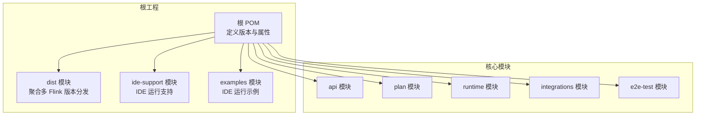
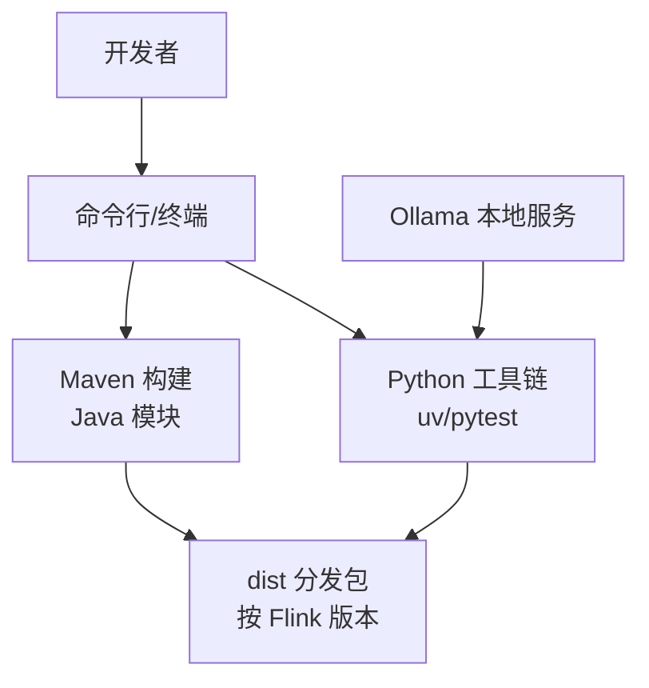
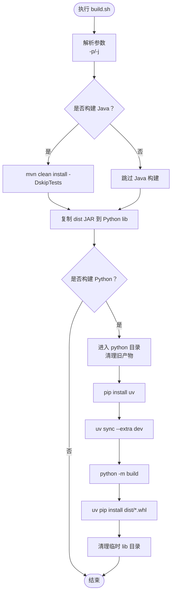
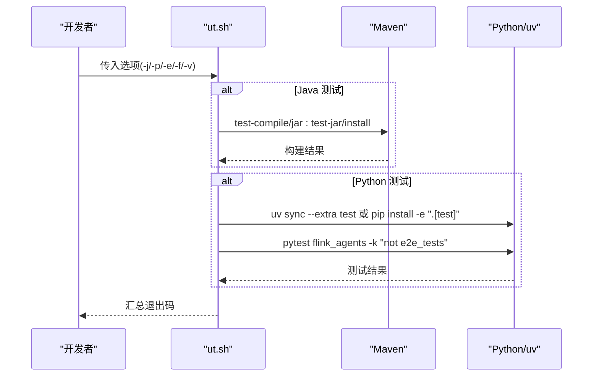
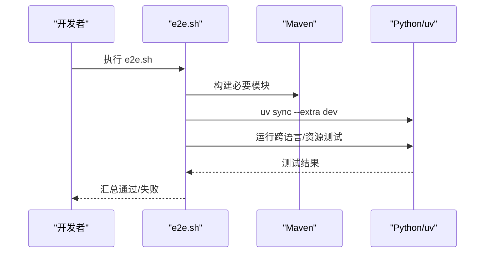
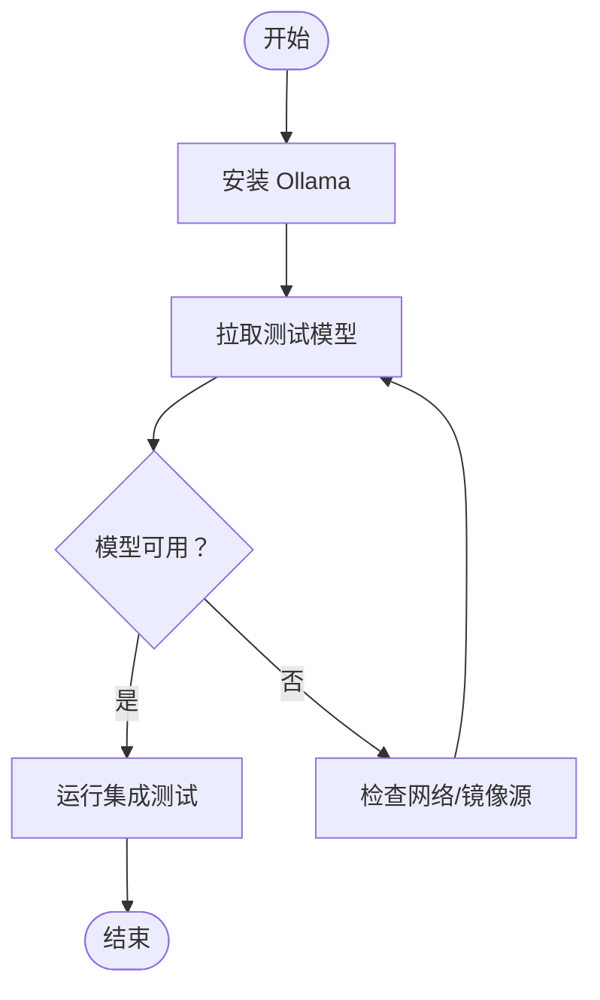
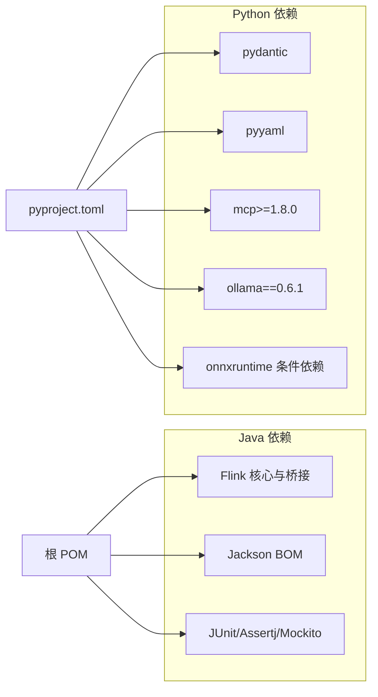

# 开发环境搭建

<cite>
**本文引用的文件**
- [README.md](file://README.md)
- [pom.xml](file://pom.xml)
- [pyproject.toml](file://python/pyproject.toml)
- [build.sh](file://tools/build.sh)
- [ut.sh](file://tools/ut.sh)
- [e2e.sh](file://tools/e2e.sh)
- [start_ollama_server.sh](file://tools/start_ollama_server.sh)
- [ollama_pull_model.sh](file://e2e-test/flink-agents-end-to-end-tests-integration/src/test/resources/ollama_pull_model.sh)
- [ide-support/pom.xml](file://ide-support/pom.xml)
- [examples/pom.xml](file://examples/pom.xml)
- [dist/pom.xml](file://dist/pom.xml)
</cite>

## 目录
1. [简介](#简介)
2. [项目结构](#项目结构)
3. [核心组件](#核心组件)
4. [架构总览](#架构总览)
5. [详细组件分析](#详细组件分析)
6. [依赖分析](#依赖分析)
7. [性能考虑](#性能考虑)
8. [故障排查指南](#故障排查指南)
9. [结论](#结论)
10. [附录](#附录)

## 简介
本指南面向首次参与 Apache Flink Agents 开发的工程师，提供从零开始的开发环境搭建步骤与最佳实践。内容覆盖系统要求（Java 11+、Python 3.10–3.11、Maven、Node.js）、IDE 配置建议（IntelliJ IDEA 与 PyCharm）、依赖管理（Maven 依赖树解析、Python 依赖安装与虚拟环境配置）、构建脚本使用（build.sh 各种选项与参数）、本地服务启动（Ollama 服务器）以及常见问题排查。

## 项目结构
该项目采用多模块 Maven 工程组织，核心模块包括：
- api：Java API 定义与事件模型
- plan：跨语言计划序列化与资源提供器
- runtime：运行时执行与异步状态管理
- integrations：第三方集成（聊天模型、嵌入模型、向量库、MCP）
- e2e-test：端到端测试
- dist：分发包聚合（按 Flink 版本打包）
- ide-support：IDE 运行支持（提供运行所需依赖）
- examples：示例工程（IDE 运行示例）

图表来源
- [pom.xml](file://pom.xml#L58-L67)
- [dist/pom.xml](file://dist/pom.xml#L39-L44)
- [ide-support/pom.xml](file://ide-support/pom.xml#L28-L33)
- [examples/pom.xml](file://examples/pom.xml#L28-L30)

章节来源
- [pom.xml](file://pom.xml#L58-L67)
- [dist/pom.xml](file://dist/pom.xml#L39-L44)
- [ide-support/pom.xml](file://ide-support/pom.xml#L28-L33)
- [examples/pom.xml](file://examples/pom.xml#L28-L30)

## 核心组件
- 构建与发布：通过 Maven 多模块构建，dist 模块按 Flink 版本生成分发包；Python 包由工具脚本打包并安装至本地。
- 测试体系：Java 单元测试与端到端测试分离；Python 使用 pytest；提供统一测试脚本 ut.sh/e2e.sh。
- 依赖管理：Maven 统一管理 Java 依赖；Python 使用 pyproject.toml 与 optional-dependencies；工具脚本默认使用 uv 进行依赖同步。
- 本地服务：Ollama 作为本地大模型服务，提供拉取模型脚本与启动脚本。

章节来源
- [build.sh](file://tools/build.sh#L42-L86)
- [ut.sh](file://tools/ut.sh#L122-L196)
- [e2e.sh](file://tools/e2e.sh#L151-L154)
- [pyproject.toml](file://python/pyproject.toml#L44-L59)

## 架构总览
下图展示开发环境中的关键交互：开发者通过命令行或 IDE 触发构建与测试；Maven 负责 Java 构建与依赖解析；Python 工具链负责打包与测试；Ollama 提供本地模型服务。

图表来源
- [build.sh](file://tools/build.sh#L42-L86)
- [ut.sh](file://tools/ut.sh#L212-L250)
- [e2e.sh](file://tools/e2e.sh#L147-L150)
- [start_ollama_server.sh](file://tools/start_ollama_server.sh#L23-L28)

## 详细组件分析

### 系统要求与前置条件
- 操作系统：类 Unix 环境（Linux、macOS、WSL）
- Git：用于克隆仓库
- Maven：用于 Java 构建
- Java：目标版本 11（同时支持 11/21，21 会跳过格式检查）
- Python：3.10 或 3.11（pyproject.toml 明确要求）
- Node.js：用于前端相关任务（如文档构建），在项目中存在 Node 相关脚本

章节来源
- [README.md](file://README.md#L9-L16)
- [pom.xml](file://pom.xml#L39-L41)
- [pyproject.toml](file://python/pyproject.toml#L32-L42)

### IDE 配置建议

#### IntelliJ IDEA
- 导入项目：选择根目录的 pom.xml，等待索引完成
- 运行配置：
  - 使用 ide-support 模块提供的运行依赖，避免缺少运行时依赖
  - 示例工程 examples 可直接在 IDE 中运行
- 编译与测试：
  - 使用 Maven 工具窗口执行测试或构建
  - 如需在 IDE 中运行，启用“包含 provided 依赖”以满足运行时需求

章节来源
- [examples/pom.xml](file://examples/pom.xml#L53-L60)
- [ide-support/pom.xml](file://ide-support/pom.xml#L35-L202)

#### PyCharm
- 打开项目根目录，选择合适的 Python 解释器（3.10 或 3.11）
- 使用工具脚本进行依赖同步与测试
- 若使用 uv，推荐在 PyCharm 终端中直接调用 uv 命令

章节来源
- [pyproject.toml](file://python/pyproject.toml#L105-L117)
- [ut.sh](file://tools/ut.sh#L212-L250)

### 依赖管理

#### Maven 依赖树解析
- 使用以下命令查看依赖树，定位冲突与传递依赖：
  - 查看所有模块依赖树：mvn dependency:tree
  - 指定模块：mvn dependency:tree -pl api
  - 分析冲突：mvn dependency:tree -Dverbose
- 关键点：
  - Java 目标版本固定为 11（可通过 profile 控制）
  - Jackson 使用 BOM 统一版本
  - 运行时使用 provided 依赖（IDE 运行需 ide-support）

章节来源
- [pom.xml](file://pom.xml#L69-L107)
- [pom.xml](file://pom.xml#L39-L41)
- [examples/pom.xml](file://examples/pom.xml#L53-L60)
- [ide-support/pom.xml](file://ide-support/pom.xml#L35-L202)

#### Python 依赖安装与虚拟环境
- 推荐使用 uv 进行依赖同步与安装（工具脚本默认使用 uv）
- 依赖来源：
  - pyproject.toml 中的 dependencies 与 optional-dependencies
  - dev/test/lint 等可选组
- 虚拟环境：
  - 使用 uv 的 venv 行为自动隔离
  - 若无 uv，回退到 pip 安装可选组

章节来源
- [pyproject.toml](file://python/pyproject.toml#L44-L59)
- [pyproject.toml](file://python/pyproject.toml#L72-L89)
- [ut.sh](file://tools/ut.sh#L212-L250)

### 构建脚本使用

#### build.sh
- 功能：一键构建 Java 与 Python 两部分，并将 Java 分发包复制到 Python 包中
- 主要选项：
  - -p/--python：仅构建 Python 部分
  - -j/--java：仅构建 Java 部分
- 行为要点：
  - 自动检测项目版本并复制对应 Flink 版本的 JAR 到 Python lib 目录
  - 使用 uv sync --extra dev 安装开发依赖
  - 最终安装生成的 wheel 至本地 Python 环境

图表来源
- [build.sh](file://tools/build.sh#L18-L86)

章节来源
- [build.sh](file://tools/build.sh#L18-L86)

#### ut.sh（单元测试与端到端测试）
- 功能：统一运行 Java 与 Python 测试套件，支持指定 Flink 版本
- 主要选项：
  - -j/--java：仅运行 Java 测试
  - -p/--python：仅运行 Python 测试
  - -e/--e2e：运行端到端测试
  - -f/--flink：指定 Flink 版本（可多次传入）
  - -v/--verbose：详细输出
- 行为要点：
  - Java：根据是否运行 e2e 决定安装 dist 模块或全量模块
  - Python：优先使用 uv，否则回退到 pip；自动安装指定版本的 apache-flink

图表来源
- [ut.sh](file://tools/ut.sh#L67-L108)
- [ut.sh](file://tools/ut.sh#L122-L196)
- [ut.sh](file://tools/ut.sh#L198-L284)

章节来源
- [ut.sh](file://tools/ut.sh#L34-L65)
- [ut.sh](file://tools/ut.sh#L122-L196)
- [ut.sh](file://tools/ut.sh#L198-L284)

#### e2e.sh（端到端测试）
- 功能：运行跨语言与资源交互等端到端测试
- 行为要点：
  - 自动构建 Java 并准备 Python 环境
  - 支持在 Java 与 Python 中分别运行跨语言测试
  - 自动设置 PYTHONPATH 以便 IDE 运行

图表来源
- [e2e.sh](file://tools/e2e.sh#L90-L111)
- [e2e.sh](file://tools/e2e.sh#L151-L154)

章节来源
- [e2e.sh](file://tools/e2e.sh#L90-L111)
- [e2e.sh](file://tools/e2e.sh#L151-L154)

### 本地服务启动指南

#### Ollama 服务器
- 安装与启动：
  - 使用工具脚本安装 Ollama（当前平台脚本）
  - 在测试资源中提供模型拉取脚本，便于拉取所需模型
- 建议流程：
  - 先安装 Ollama，再拉取测试所需的模型
  - 在本地运行集成测试前确保模型可用

图表来源
- [start_ollama_server.sh](file://tools/start_ollama_server.sh#L23-L28)
- [ollama_pull_model.sh](file://e2e-test/flink-agents-end-to-end-tests-integration/src/test/resources/ollama_pull_model.sh#L19-L20)

章节来源
- [start_ollama_server.sh](file://tools/start_ollama_server.sh#L19-L28)
- [ollama_pull_model.sh](file://e2e-test/flink-agents-end-to-end-tests-integration/src/test/resources/ollama_pull_model.sh#L1-L20)

## 依赖分析

图表来源
- [pom.xml](file://pom.xml#L69-L107)
- [pyproject.toml](file://python/pyproject.toml#L44-L59)

章节来源
- [pom.xml](file://pom.xml#L69-L107)
- [pyproject.toml](file://python/pyproject.toml#L44-L59)

## 性能考虑
- 构建性能：
  - 使用 Maven 并行度与缓存，避免重复下载依赖
  - Python 使用 uv 可显著提升依赖同步速度
- 测试性能：
  - 按需运行 Java/Python 测试，减少不必要的构建与安装
  - 端到端测试前先拉取模型，避免测试过程中网络阻塞

## 故障排查指南
- Java 版本不匹配
  - 现象：构建报错或格式检查失败
  - 处理：确保使用 Java 11；若使用 Java 21，注意格式检查被禁用
- Python 版本不符
  - 现象：安装失败或运行时报错
  - 处理：使用 Python 3.10 或 3.11；确认 pyproject.toml 中版本范围
- 依赖冲突
  - 现象：Maven 报告冲突或运行时异常
  - 处理：使用 mvn dependency:tree 定位冲突模块，调整版本或排除传递依赖
- Ollama 无法启动/模型拉取失败
  - 现象：测试阶段卡住或模型不可用
  - 处理：检查网络与镜像源；使用提供的脚本拉取模型
- IDE 运行缺少依赖
  - 现象：运行时报缺少类或依赖
  - 处理：启用 ide-support 提供的运行配置，或在 IDE 中包含 provided 依赖

章节来源
- [pom.xml](file://pom.xml#L110-L131)
- [pyproject.toml](file://python/pyproject.toml#L32-L42)
- [ut.sh](file://tools/ut.sh#L122-L196)
- [e2e.sh](file://tools/e2e.sh#L130-L135)
- [examples/pom.xml](file://examples/pom.xml#L53-L60)

## 结论
通过遵循本指南，您可以快速搭建 Apache Flink Agents 的开发环境。建议优先使用 uv 管理 Python 依赖，配合 Maven 完成 Java 构建，并在本地启动 Ollama 以支持模型相关测试。遇到问题时，结合工具脚本与日志信息进行定位，通常可快速恢复开发效率。

## 附录

### 常用命令速查
- 克隆仓库与基础构建
  - git clone 与 ./tools/build.sh
- 仅构建 Java 或 Python
  - ./tools/build.sh -j 或 ./tools/build.sh -p
- 运行测试（Java/Python/端到端）
  - ./tools/ut.sh --java / --python / --e2e
- 指定 Flink 版本运行测试
  - ./tools/ut.sh -f 2.2 -f 1.20
- 启动 Ollama 与拉取模型
  - ./tools/start_ollama_server.sh
  - 在测试资源中使用 ollama_pull_model.sh

章节来源
- [README.md](file://README.md#L17-L30)
- [build.sh](file://tools/build.sh#L18-L36)
- [ut.sh](file://tools/ut.sh#L34-L65)
- [e2e.sh](file://tools/e2e.sh#L151-L154)
- [start_ollama_server.sh](file://tools/start_ollama_server.sh#L23-L28)
- [ollama_pull_model.sh](file://e2e-test/flink-agents-end-to-end-tests-integration/src/test/resources/ollama_pull_model.sh#L19-L20)