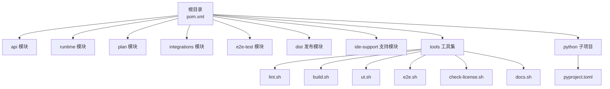
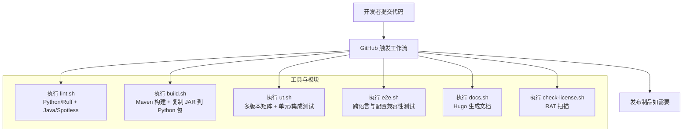
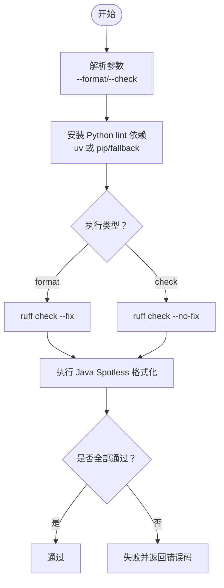
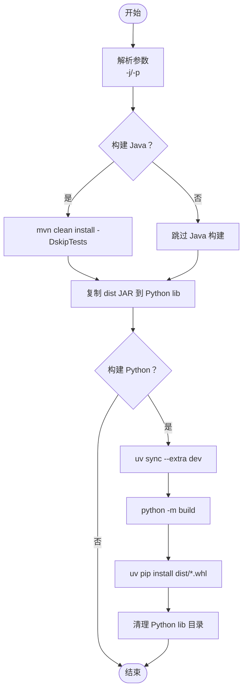
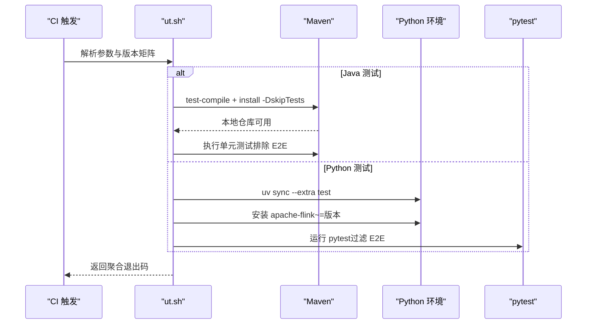
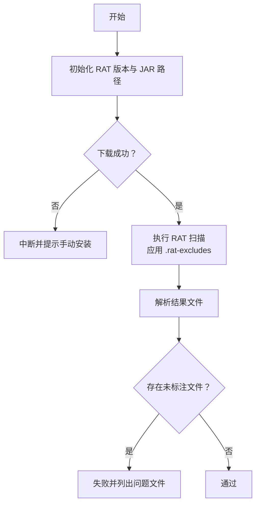
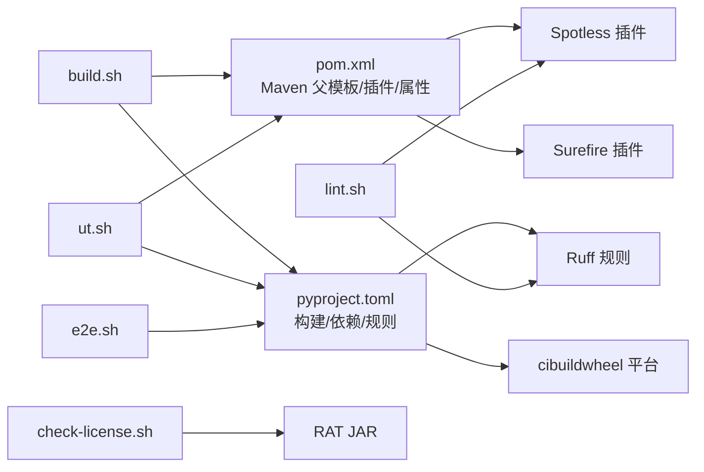

# CI/CD 自动化

<cite>
**本文引用的文件**
- [.asf.yaml](file://.asf.yaml)
- [pom.xml](file://pom.xml)
- [tools/lint.sh](file://tools/lint.sh)
- [tools/build.sh](file://tools/build.sh)
- [tools/ut.sh](file://tools/ut.sh)
- [tools/e2e.sh](file://tools/e2e.sh)
- [tools/check-license.sh](file://tools/check-license.sh)
- [tools/docs.sh](file://tools/docs.sh)
- [tools/.rat-excludes](file://tools/.rat-excludes)
- [python/pyproject.toml](file://python/pyproject.toml)
- [README.md](file://README.md)
</cite>

## 目录
1. [简介](#简介)
2. [项目结构](#项目结构)
3. [核心组件](#核心组件)
4. [架构总览](#架构总览)
5. [详细组件分析](#详细组件分析)
6. [依赖关系分析](#依赖关系分析)
7. [性能考量](#性能考量)
8. [故障排除指南](#故障排除指南)
9. [结论](#结论)
10. [附录](#附录)

## 简介
本指南面向 Apache Flink Agents 项目，系统性地阐述如何基于现有工具链与 Maven/Gradle 生态实现 CI/CD 自动化，涵盖：
- GitHub Actions 工作流配置要点（构建、测试、发布）
- Apache 软件基金会 .asf.yaml 配置与 ASF 特定要求
- 代码质量检查自动化（lint.sh 与静态分析工具）
- 持续集成流水线设计（多模块、多版本矩阵与并行策略）
- 自动化测试集成（单元测试、端到端测试、结果收集与通知）
- 代码覆盖率与质量门禁建议
- 故障排除与性能优化建议

## 项目结构
项目采用多模块 Maven 结构，包含 Java API、运行时、计划模型、集成适配器、端到端测试以及 Python 包等；同时提供丰富的工具脚本用于本地开发与 CI 集成。

图表来源
- [pom.xml](file://pom.xml#L58-L67)
- [tools/lint.sh](file://tools/lint.sh#L1-L194)
- [tools/build.sh](file://tools/build.sh#L1-L86)
- [tools/ut.sh](file://tools/ut.sh#L1-L328)
- [tools/e2e.sh](file://tools/e2e.sh#L1-L166)
- [tools/check-license.sh](file://tools/check-license.sh#L1-L88)
- [tools/docs.sh](file://tools/docs.sh#L1-L38)
- [python/pyproject.toml](file://python/pyproject.toml#L1-L194)

章节来源
- [pom.xml](file://pom.xml#L58-L67)
- [README.md](file://README.md#L1-L44)

## 核心组件
- 质量检查与格式化：通过 lint.sh 统一执行 Python/Ruff 与 Java/Spotless 格式化与检查。
- 构建与打包：build.sh 负责 Java 模块构建并将产物复制到 Python 包中，随后使用 uv/build 打包 Python Wheel 并安装。
- 单元与端到端测试：ut.sh 支持按模块选择、多 Flink 版本矩阵、E2E 测试；e2e.sh 提供跨语言资源与配置兼容性测试。
- 许可证合规：check-license.sh 使用 Apache RAT 对源码进行许可扫描，结合 .rat-excludes 排除项。
- 文档生成：docs.sh 初始化子模块并使用 Hugo 生成文档站点。
- 项目元数据：.asf.yaml 定义 GitHub 仓库标签、合并策略、通知邮箱等 ASF 要求。

章节来源
- [tools/lint.sh](file://tools/lint.sh#L115-L167)
- [tools/build.sh](file://tools/build.sh#L42-L86)
- [tools/ut.sh](file://tools/ut.sh#L122-L327)
- [tools/e2e.sh](file://tools/e2e.sh#L20-L166)
- [tools/check-license.sh](file://tools/check-license.sh#L23-L88)
- [tools/docs.sh](file://tools/docs.sh#L21-L38)
- [.asf.yaml](file://.asf.yaml#L16-L56)

## 架构总览
下图展示从代码提交到构建、测试、文档与发布的关键路径，映射到实际脚本与模块：

图表来源
- [tools/lint.sh](file://tools/lint.sh#L115-L167)
- [tools/build.sh](file://tools/build.sh#L42-L86)
- [tools/ut.sh](file://tools/ut.sh#L122-L327)
- [tools/e2e.sh](file://tools/e2e.sh#L20-L166)
- [tools/docs.sh](file://tools/docs.sh#L21-L38)
- [tools/check-license.sh](file://tools/check-license.sh#L23-L88)
- [pom.xml](file://pom.xml#L275-L317)

## 详细组件分析

### 质量检查与格式化（lint.sh）
- 功能：统一处理 Python 与 Java 代码格式化与检查，支持 --format 与 --check 两种模式。
- Python：优先使用 uv 同步 [lint] 依赖组，再用 ruff 执行格式化或检查；若无 uv，则回退到 pip 或 pyproject 依赖组。
- Java：调用 Maven Spotless 插件执行 google-java-format 与 import order 校验。
- 退出码：失败时返回非零值，便于 CI 中断。

图表来源
- [tools/lint.sh](file://tools/lint.sh#L41-L167)

章节来源
- [tools/lint.sh](file://tools/lint.sh#L41-L167)
- [python/pyproject.toml](file://python/pyproject.toml#L90-L94)

### 构建与打包（build.sh）
- 功能：根据参数选择仅构建 Java 或 Python；默认双端构建。
- Java：打印 Maven 版本后执行 clean install -DskipTests。
- Python：自动解析版本号，遍历 dist 下的各 Flink 版本目录，复制对应 JAR 到 Python 包的 lib 子目录；随后使用 uv 安装开发依赖、构建 wheel 并安装。
- 输出：Java 产物与 Python wheel 双重制品，便于后续测试与发布。

图表来源
- [tools/build.sh](file://tools/build.sh#L18-L86)

章节来源
- [tools/build.sh](file://tools/build.sh#L18-L86)

### 单元与端到端测试（ut.sh 与 e2e.sh）
- ut.sh
  - 支持 --java/--python/--both/--e2e 选择测试范围，支持 -f 指定 Flink 版本（如 2.2、1.20），默认运行 2.2。
  - Java：先安装 dist 模块（E2E 模式）或全模块测试 jar 到本地仓库，再在排除 E2E 模块的情况下执行单元测试。
  - Python：逐版本安装依赖（含 apache-flink 约束），使用 uv 或 pip 运行 pytest，过滤掉 E2E 测试。
  - 退出码聚合：分别记录 Java 与 Python 结果并综合输出。
- e2e.sh
  - 作为独立 Bash 脚本，负责跨语言资源、配置兼容性与代理计划兼容性测试。
  - 自动构建与依赖准备，使用 uv 环境执行测试脚本，并统计通过/总数。

图表来源
- [tools/ut.sh](file://tools/ut.sh#L67-L327)

章节来源
- [tools/ut.sh](file://tools/ut.sh#L67-L327)
- [tools/e2e.sh](file://tools/e2e.sh#L20-L166)

### 许可证合规（check-license.sh 与 .rat-excludes）
- 使用 Apache RAT 扫描项目，读取 .rat-excludes 排除构建产物、IDE 文件、缓存、许可证文件等。
- 将扫描结果写入 build/rat-results.txt，若发现未标注许可头的文件则失败。

图表来源
- [tools/check-license.sh](file://tools/check-license.sh#L23-L88)
- [tools/.rat-excludes](file://tools/.rat-excludes#L1-L19)

章节来源
- [tools/check-license.sh](file://tools/check-license.sh#L23-L88)
- [tools/.rat-excludes](file://tools/.rat-excludes#L1-L19)

### 文档生成（docs.sh）
- 克隆/更新子模块，初始化 Hugo 环境，生成文档至 docs/target 目录。
- 适合在 CI 中作为可选步骤，用于预览或发布文档站点。

章节来源
- [tools/docs.sh](file://tools/docs.sh#L21-L38)

### Apache 软件基金会配置（.asf.yaml）
- 仓库描述、主页、标签、合并按钮策略（squash/rebase/merge）、功能开关与协作者列表。
- 通知邮箱：commits、issues、pull requests、discussions。

章节来源
- [.asf.yaml](file://.asf.yaml#L16-L56)

## 依赖关系分析
- Maven 层面：父 POM 引入 Apache 父模板，定义 Java 版本、Flink 版本、插件版本与 profiles（如 release、docs-and-source）。Spotless 插件在 validate 阶段执行 check；Surefire 配置了 JVM 开放参数。
- Python 层面：pyproject.toml 定义构建系统、依赖与可选分组（lint/test/build/dev），并配置 cibuildwheel 平台与 ruff 规则。
- 工具脚本：lint.sh 依赖 Maven Spotless 与 ruff；build.sh 依赖 Maven 与 uv；ut.sh 依赖 Maven 与 pytest；e2e.sh 依赖 uv 与 Bash 脚本；check-license.sh 依赖 RAT JAR 与 Java。

图表来源
- [pom.xml](file://pom.xml#L37-L56)
- [pom.xml](file://pom.xml#L275-L317)
- [python/pyproject.toml](file://python/pyproject.toml#L18-L70)
- [python/pyproject.toml](file://python/pyproject.toml#L118-L194)
- [tools/lint.sh](file://tools/lint.sh#L115-L167)
- [tools/build.sh](file://tools/build.sh#L42-L86)
- [tools/ut.sh](file://tools/ut.sh#L122-L327)
- [tools/e2e.sh](file://tools/e2e.sh#L20-L166)
- [tools/check-license.sh](file://tools/check-license.sh#L23-L88)

章节来源
- [pom.xml](file://pom.xml#L37-L56)
- [pom.xml](file://pom.xml#L275-L317)
- [python/pyproject.toml](file://python/pyproject.toml#L18-L70)
- [python/pyproject.toml](file://python/pyproject.toml#L118-L194)

## 性能考量
- 并行度与缓存
  - Maven 并行：lint.sh 与 build.sh 均使用 -T 参数提升并行度；建议在 CI 中启用 Maven 与工具缓存（如 ~/.m2 缓存）。
  - Python 依赖：优先使用 uv（支持 lock 文件与缓存），减少依赖解析时间。
- 测试矩阵
  - ut.sh 支持多 Flink 版本并行执行，建议在 CI 中拆分为多个作业并行跑不同版本，缩短总耗时。
- I/O 与网络
  - RAT 下载与 Hugo 构建可能受网络影响，建议缓存相关依赖与工具。
- 日志与超时
  - 在 CI 中设置合理超时与日志截断，避免长时间卡住导致资源浪费。

## 故障排除指南
- Java 版本不匹配
  - 现象：构建失败或 Spotless 校验不通过。
  - 排查：确认 CI 环境 Java 版本与 pom 中 target.java.version 一致；必要时在 CI 中显式安装对应 JDK。
- Python 依赖安装失败
  - 现象：uv 或 pip 安装失败。
  - 排查：检查 pyproject.toml optional-dependencies 与网络；优先使用 uv.lock；确保 Python 版本满足 requires-python。
- E2E 测试找不到 JAR
  - 现象：e2e.sh 报错无法找到目标 JAR。
  - 排查：先执行 build.sh 确保 dist 产物存在；检查版本目录命名与 JAR 文件名。
- RAT 扫描失败
  - 现象：RAT 报告存在未标注许可头文件。
  - 排查：核对 .rat-excludes 是否遗漏；为新增文件添加正确许可头。
- 文档生成失败
  - 现象：docs.sh 构建失败。
  - 排查：确认 Hugo 环境初始化脚本可用、子模块已更新、Hugo 版本兼容。

章节来源
- [tools/lint.sh](file://tools/lint.sh#L115-L167)
- [tools/build.sh](file://tools/build.sh#L42-L86)
- [tools/e2e.sh](file://tools/e2e.sh#L90-L166)
- [tools/check-license.sh](file://tools/check-license.sh#L23-L88)
- [tools/docs.sh](file://tools/docs.sh#L21-L38)

## 结论
通过现有工具链与 Maven/Python 生态，Flink Agents 已具备完善的本地与 CI 可用能力。建议在 GitHub Actions 中：
- 分阶段流水线：质量检查 → 构建 → 多版本矩阵测试 → 文档与许可证检查 → 发布（可选）。
- 并行化：将不同 Flink 版本与语言的测试拆分为独立作业并行执行。
- 质量门禁：将 lint.sh 与单元测试作为强制步骤；覆盖率与质量门限可在后续引入 SonarQube 或类似工具。
- 缓存与超时：启用 Maven/uv 缓存与网络镜像，设置合理超时与重试策略。

## 附录
- 常用命令参考
  - 质量检查：./tools/lint.sh --check
  - 格式化：./tools/lint.sh --format
  - 构建：./tools/build.sh
  - 单元测试（默认 2.2）：./tools/ut.sh --both
  - 多版本测试：./tools/ut.sh -f 2.2 -f 1.20
  - E2E 测试：./tools/e2e.sh
  - 许可证扫描：./tools/check-license.sh
  - 文档生成：./tools/docs.sh