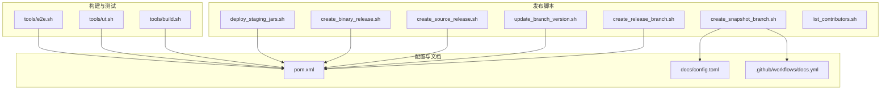
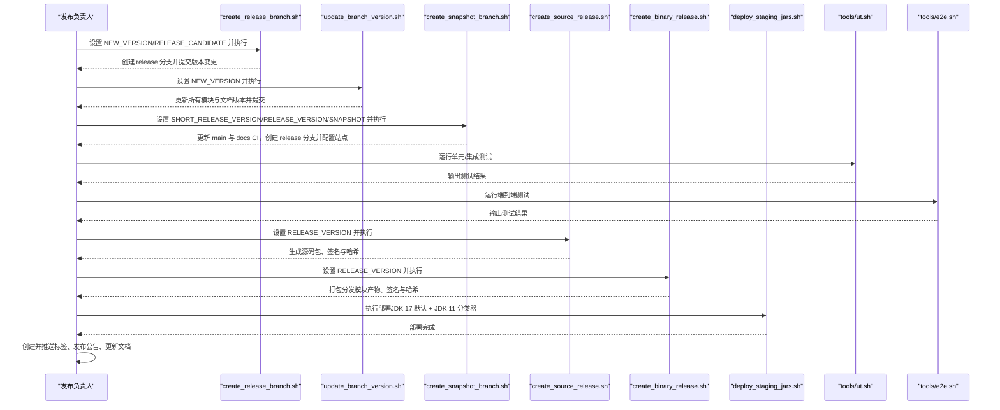
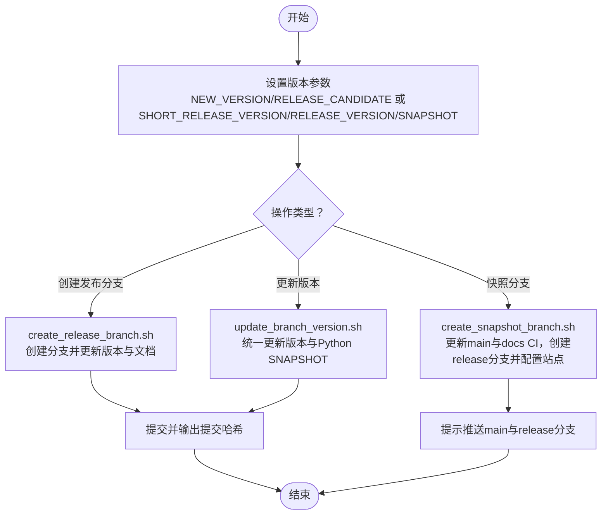
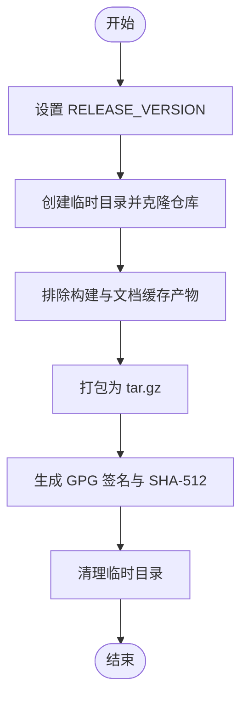
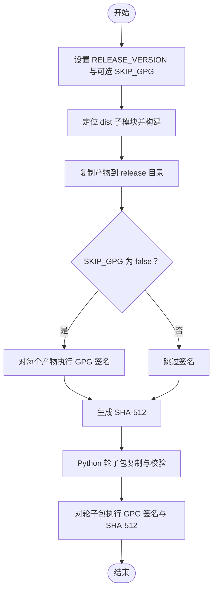
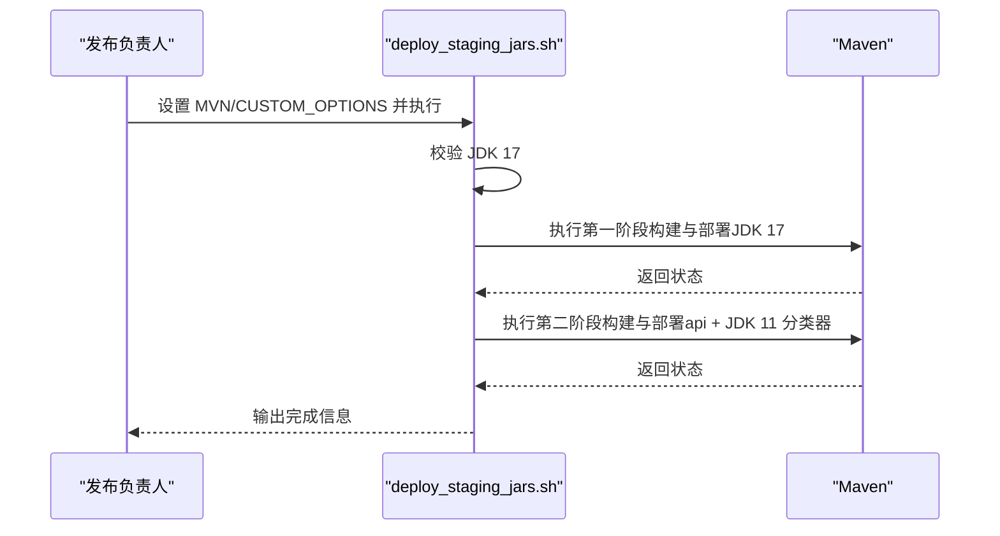
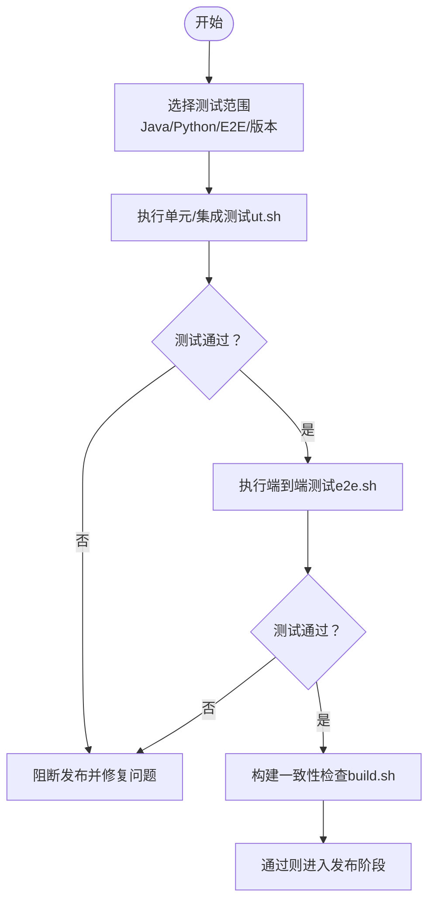
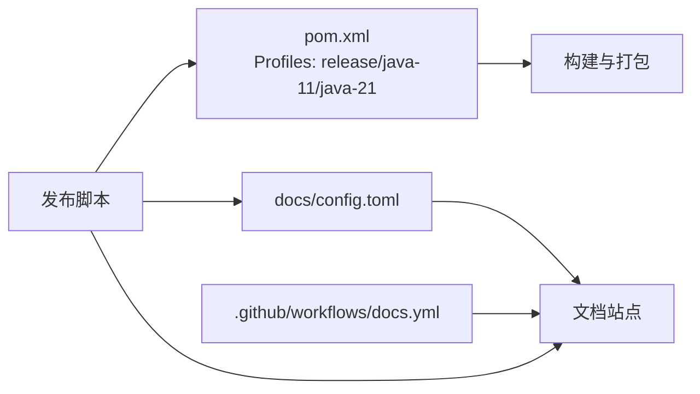

# 发布流程管理

<cite>
**本文引用的文件**
- [tools/releasing/create_binary_release.sh](file://tools/releasing/create_binary_release.sh)
- [tools/releasing/deploy_staging_jars.sh](file://tools/releasing/deploy_staging_jars.sh)
- [tools/releasing/create_release_branch.sh](file://tools/releasing/create_release_branch.sh)
- [tools/releasing/update_branch_version.sh](file://tools/releasing/update_branch_version.sh)
- [tools/releasing/create_source_release.sh](file://tools/releasing/create_source_release.sh)
- [tools/releasing/create_snapshot_branch.sh](file://tools/releasing/create_snapshot_branch.sh)
- [tools/releasing/list_contributors.sh](file://tools/releasing/list_contributors.sh)
- [tools/build.sh](file://tools/build.sh)
- [tools/e2e.sh](file://tools/e2e.sh)
- [tools/ut.sh](file://tools/ut.sh)
- [pom.xml](file://pom.xml)
- [docs/config.toml](file://docs/config.toml)
- [.github/workflows/docs.yml](file://.github/workflows/docs.yml)
- [README.md](file://README.md)
</cite>

## 目录
1. [简介](#简介)
2. [项目结构](#项目结构)
3. [核心组件](#核心组件)
4. [架构总览](#架构总览)
5. [详细组件分析](#详细组件分析)
6. [依赖关系分析](#依赖关系分析)
7. [性能考虑](#性能考虑)
8. [故障排查指南](#故障排查指南)
9. [结论](#结论)
10. [附录](#附录)

## 简介
本文件面向 Apache Flink Agents 项目的发布与维护团队，系统化梳理发布流程管理，覆盖发布前准备、分支策略、二进制与源码发布、Staging Jar 部署、发布验证、发布后清理、回滚策略以及质量门禁与风险控制。文档以仓库内现有发布脚本与配置为依据，结合 Maven 多模块结构与多语言（Java/Python）产物，形成可操作、可追溯、可审计的发布实践。

## 项目结构
- 发布相关脚本集中于 tools/releasing 目录，涵盖分支创建、版本更新、源码打包、二进制打包、Staging 部署等。
- 根 POM 定义了多模块结构与发布 Profile；文档站点配置位于 docs/config.toml，并通过 GitHub Actions 工作流进行文档发布。
- 测试工具链包括单元/集成测试脚本与端到端测试脚本，用于发布前质量验证。

图表来源
- [tools/releasing/create_release_branch.sh](file://tools/releasing/create_release_branch.sh#L1-L77)
- [tools/releasing/update_branch_version.sh](file://tools/releasing/update_branch_version.sh#L1-L64)
- [tools/releasing/create_snapshot_branch.sh](file://tools/releasing/create_snapshot_branch.sh#L1-L96)
- [tools/releasing/create_source_release.sh](file://tools/releasing/create_source_release.sh#L1-L83)
- [tools/releasing/create_binary_release.sh](file://tools/releasing/create_binary_release.sh#L1-L127)
- [tools/releasing/deploy_staging_jars.sh](file://tools/releasing/deploy_staging_jars.sh#L1-L76)
- [tools/build.sh](file://tools/build.sh#L1-L86)
- [tools/ut.sh](file://tools/ut.sh#L1-L328)
- [tools/e2e.sh](file://tools/e2e.sh#L1-L166)
- [pom.xml](file://pom.xml#L1-L200)
- [docs/config.toml](file://docs/config.toml#L1-L97)
- [.github/workflows/docs.yml](file://.github/workflows/docs.yml)

章节来源
- [README.md](file://README.md#L1-L44)
- [pom.xml](file://pom.xml#L1-L200)
- [docs/config.toml](file://docs/config.toml#L1-L97)

## 核心组件
- 分支与版本管理脚本：负责创建/更新发布分支、设置版本号、更新文档站点配置。
- 源码与二进制发布脚本：负责生成源码包、签名与哈希校验、打包分发模块产物。
- Staging Jar 部署脚本：负责在多 JDK 条件下构建并部署默认版本与 JDK 11 分类器版本。
- 测试与验证脚本：提供单元/集成与端到端测试入口，支撑发布前质量门禁。
- 文档与 CI 配置：维护文档站点版本、分支与发布 URL，确保发布后文档同步。

章节来源
- [tools/releasing/create_release_branch.sh](file://tools/releasing/create_release_branch.sh#L1-L77)
- [tools/releasing/update_branch_version.sh](file://tools/releasing/update_branch_version.sh#L1-L64)
- [tools/releasing/create_snapshot_branch.sh](file://tools/releasing/create_snapshot_branch.sh#L1-L96)
- [tools/releasing/create_source_release.sh](file://tools/releasing/create_source_release.sh#L1-L83)
- [tools/releasing/create_binary_release.sh](file://tools/releasing/create_binary_release.sh#L1-L127)
- [tools/releasing/deploy_staging_jars.sh](file://tools/releasing/deploy_staging_jars.sh#L1-L76)
- [tools/ut.sh](file://tools/ut.sh#L1-L328)
- [tools/e2e.sh](file://tools/e2e.sh#L1-L166)
- [docs/config.toml](file://docs/config.toml#L1-L97)

## 架构总览
发布流程由“准备—构建—部署—验证—发布—清理”六个阶段构成，各阶段通过脚本与配置协同完成。

图表来源
- [tools/releasing/create_release_branch.sh](file://tools/releasing/create_release_branch.sh#L1-L77)
- [tools/releasing/update_branch_version.sh](file://tools/releasing/update_branch_version.sh#L1-L64)
- [tools/releasing/create_snapshot_branch.sh](file://tools/releasing/create_snapshot_branch.sh#L1-L96)
- [tools/releasing/create_source_release.sh](file://tools/releasing/create_source_release.sh#L1-L83)
- [tools/releasing/create_binary_release.sh](file://tools/releasing/create_binary_release.sh#L1-L127)
- [tools/releasing/deploy_staging_jars.sh](file://tools/releasing/deploy_staging_jars.sh#L1-L76)
- [tools/ut.sh](file://tools/ut.sh#L1-L328)
- [tools/e2e.sh](file://tools/e2e.sh#L1-L166)

## 详细组件分析

### 分支与版本管理策略
- 创建发布分支
  - 输入：NEW_VERSION、RELEASE_CANDIDATE（可选）
  - 行为：基于 main 创建 release 分支，批量更新所有模块版本、文档站点版本与标题、Python 版本，提交并输出新提交哈希。
  - 注意：RC 版本会在分支名中附加 rc 后缀。
- 更新分支版本
  - 输入：NEW_VERSION
  - 行为：统一更新所有模块与文档版本，Python 版本文件中的 SNAPSHOT 替换为 .dev0，提交变更。
- 快照分支创建（发布后维护）
  - 输入：SHORT_RELEASE_VERSION、RELEASE_VERSION、SHORT_NEXT_SNAPSHOT_VERSION
  - 行为：在 main 上更新 PreviousDocs 与 docs CI 工作流，切换到 release 分支更新站点版本、分支、URL 与稳定标记，最后提示推送到远端。

图表来源
- [tools/releasing/create_release_branch.sh](file://tools/releasing/create_release_branch.sh#L1-L77)
- [tools/releasing/update_branch_version.sh](file://tools/releasing/update_branch_version.sh#L1-L64)
- [tools/releasing/create_snapshot_branch.sh](file://tools/releasing/create_snapshot_branch.sh#L1-L96)

章节来源
- [tools/releasing/create_release_branch.sh](file://tools/releasing/create_release_branch.sh#L26-L77)
- [tools/releasing/update_branch_version.sh](file://tools/releasing/update_branch_version.sh#L25-L64)
- [tools/releasing/create_snapshot_branch.sh](file://tools/releasing/create_snapshot_branch.sh#L20-L96)
- [docs/config.toml](file://docs/config.toml#L37-L44)
- [.github/workflows/docs.yml](file://.github/workflows/docs.yml)

### 源码发布流程
- 输入：RELEASE_VERSION
- 行为：
  - 在临时目录克隆当前仓库，排除大量构建与文档缓存产物，仅保留源码树。
  - 打包为 tar.gz，生成 GPG 签名与 SHA-512 哈希。
  - 清理临时目录。
- 关键点：严格排除非源码产物，保证发布包纯净；签名与哈希便于完整性与来源校验。

图表来源
- [tools/releasing/create_source_release.sh](file://tools/releasing/create_source_release.sh#L25-L83)

章节来源
- [tools/releasing/create_source_release.sh](file://tools/releasing/create_source_release.sh#L25-L83)

### 二进制发布流程
- 输入：RELEASE_VERSION、可选 SKIP_GPG
- 行为：
  - 自动发现 dist 子模块，构建多模块产物，复制至 release 目录。
  - 对每个 dist 模块产物执行 GPG 签名与 SHA-512 校验生成。
  - Python 轮子包从 python/dist 复制到 release/python，校验命名一致性，随后签名与哈希。
- 关键点：支持跳过 GPG 签名（CI 环境），自动识别 dist 子模块列表，统一签名与哈希流程。

图表来源
- [tools/releasing/create_binary_release.sh](file://tools/releasing/create_binary_release.sh#L26-L127)

章节来源
- [tools/releasing/create_binary_release.sh](file://tools/releasing/create_binary_release.sh#L26-L127)

### Staging Jar 部署流程
- 输入：MVN、CUSTOM_OPTIONS（可选）
- 行为：
  - 校验 JDK 17 环境。
  - 第一阶段：构建并部署默认版本（JDK 17 字节码）。
  - 第二阶段：针对 api 模块启用 java-11-target Profile，构建并部署 JDK 11 分类器版本。
- 关键点：通过 Maven Profile 控制字节码目标版本，满足多 JDK 兼容性。

图表来源
- [tools/releasing/deploy_staging_jars.sh](file://tools/releasing/deploy_staging_jars.sh#L38-L76)
- [pom.xml](file://pom.xml#L109-L131)

章节来源
- [tools/releasing/deploy_staging_jars.sh](file://tools/releasing/deploy_staging_jars.sh#L38-L76)
- [pom.xml](file://pom.xml#L109-L131)

### 发布验证步骤
- 单元/集成测试：通过 tools/ut.sh 支持 Java/Python 双栈测试，可按 Flink 版本选择运行范围，支持 E2E 与非 E2E 场景。
- 端到端测试：通过 tools/e2e.sh 统一运行跨语言资源、计划兼容性与配置互通等场景，自动准备环境与依赖。
- 构建一致性：tools/build.sh 将 Java 分发产物复制到 Python 包，确保 Python 使用最新本地构建的 JAR。

图表来源
- [tools/ut.sh](file://tools/ut.sh#L67-L328)
- [tools/e2e.sh](file://tools/e2e.sh#L20-L166)
- [tools/build.sh](file://tools/build.sh#L42-L86)

章节来源
- [tools/ut.sh](file://tools/ut.sh#L67-L328)
- [tools/e2e.sh](file://tools/e2e.sh#L20-L166)
- [tools/build.sh](file://tools/build.sh#L42-L86)

### 发布后清理与公告
- 标签创建与推送：在 release 分支上创建并推送带签名的发布标签，作为发布里程碑。
- 文档更新：确保 docs/config.toml 中的 Version、VersionTitle、Branch、IsStable、PreviousDocs 与 baseURL 正确指向新版本。
- 公告发布：在社区渠道发布版本公告，附带下载链接与变更摘要。
- 贡献者统计：使用 tools/releasing/list_contributors.sh 生成贡献者名单，辅助公告与致谢。

章节来源
- [tools/releasing/list_contributors.sh](file://tools/releasing/list_contributors.sh#L20-L33)
- [docs/config.toml](file://docs/config.toml#L37-L44)

### 发布回滚流程
- 紧急修复（Hotfix）：
  - 从已发布标签创建 hotfix 分支，修复问题后合并回 release 与 main，并打新标签。
- 版本回退：
  - 若发布已进入下游分发环节，优先采用补丁版本（patch）修复；如需撤销，应遵循社区公告与文档回退策略，必要时通过发布通道撤销或替换。
- 风险控制：
  - 严格遵循“只读发布分支、禁止直接修改已发布标签”的原则；所有变更通过 PR 合并，确保可追溯。

（本节为通用流程说明，不直接分析具体文件）

## 依赖关系分析
- Maven Profile 与多 JDK 兼容
  - release Profile 启用 GPG 签名与 Javadoc 打包；java-11 Profile 控制编译目标为 11；java-21 Profile 跳过格式化插件以适配 JDK 21。
- 文档站点与 CI
  - docs/config.toml 统一维护版本、分支、URL 与 PreviousDocs；.github/workflows/docs.yml 配置文档发布分支列表与别名。
- 发布脚本依赖
  - 所有发布脚本均要求在 tools/ 目录下执行，且依赖 Maven、Git、GPG、SHA-512 工具链。

图表来源
- [pom.xml](file://pom.xml#L109-L131)
- [docs/config.toml](file://docs/config.toml#L37-L44)
- [.github/workflows/docs.yml](file://.github/workflows/docs.yml)

章节来源
- [pom.xml](file://pom.xml#L109-L131)
- [docs/config.toml](file://docs/config.toml#L37-L44)
- [.github/workflows/docs.yml](file://.github/workflows/docs.yml)

## 性能考虑
- 并行测试：ut.sh 支持多 Flink 版本并行测试，提升验证效率。
- 构建缓存：e2e.sh 与 ut.sh 在首次缺失时会触发构建，建议在 CI 中预热缓存以减少重复构建时间。
- 产物打包：create_binary_release.sh 动态发现 dist 子模块，避免硬编码导致的遗漏与重复构建。

（本节为通用指导，不直接分析具体文件）

## 故障排查指南
- 发布脚本执行位置错误
  - 症状：脚本报错提示必须在 tools/ 目录下执行。
  - 处理：切换到仓库根目录下的 tools/ 目录再执行。
- 缺少必要环境变量
  - 症状：create_binary_release.sh 提示未设置 RELEASE_VERSION；create_release_branch.sh 提示未设置 NEW_VERSION；create_source_release.sh 提示未设置 RELEASE_VERSION。
  - 处理：在执行前正确导出所需变量。
- JDK 版本不符
  - 症状：deploy_staging_jars.sh 报错 JDK 17 不符合。
  - 处理：切换到 JDK 17 环境后再执行。
- Python 轮子包命名不一致
  - 症状：create_binary_release.sh 校验失败，提示 wheel 文件名与给定版本不一致。
  - 处理：确保 python/dist 下的 wheel 包命名与 RELEASE_VERSION 对应。
- 文档站点配置冲突
  - 症状：create_snapshot_branch.sh 提示 release 分支已存在或 PreviousDocs 中已存在该版本。
  - 处理：修正版本号或删除冲突项后重试。

章节来源
- [tools/releasing/create_binary_release.sh](file://tools/releasing/create_binary_release.sh#L26-L41)
- [tools/releasing/create_release_branch.sh](file://tools/releasing/create_release_branch.sh#L26-L41)
- [tools/releasing/create_source_release.sh](file://tools/releasing/create_source_release.sh#L25-L40)
- [tools/releasing/deploy_staging_jars.sh](file://tools/releasing/deploy_staging_jars.sh#L38-L43)
- [tools/releasing/create_snapshot_branch.sh](file://tools/releasing/create_snapshot_branch.sh#L50-L60)

## 结论
本发布流程以脚本化与配置化为核心，覆盖从分支与版本管理、源码与二进制打包、Staging 部署、测试验证到发布后清理与回滚的全生命周期。通过明确的输入参数、严格的环境校验与签名哈希机制，确保发布产物的可复现性与可审计性。建议在 CI 中固化上述流程，配合质量门禁与风险控制，持续提升发布稳定性与效率。

## 附录
- 质量门禁清单
  - 所有测试通过（单元/集成/E2E）。
  - 源码包与二进制包均具备 GPG 签名与 SHA-512 校验。
  - 文档站点版本与分支配置正确。
  - 发布分支与标签管理规范，变更记录完整。
- 风险控制清单
  - 仅允许通过 PR 合并变更发布分支。
  - 禁止直接修改已发布标签。
  - Hotfix 与回退需经至少一名维护者批准并记录在案。