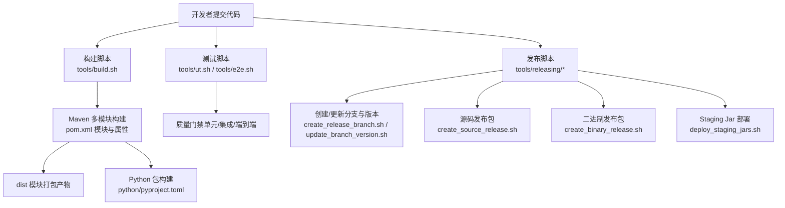
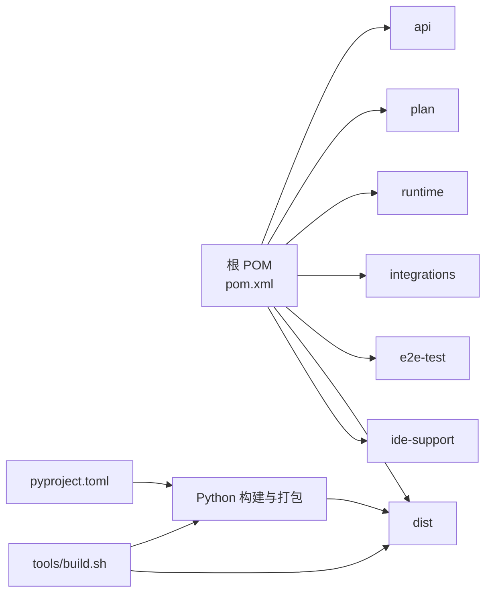

# 构建与发布管理

<cite>
**本文引用的文件**
- [根 POM（pom.xml）](file://pom.xml)
- [构建脚本（tools/build.sh）](file://tools/build.sh)
- [单元/集成/端到端测试脚本（tools/ut.sh）](file://tools/ut.sh)
- [端到端测试脚本（tools/e2e.sh）](file://tools/e2e.sh)
- [发布脚本：部署 Staging Jar（tools/releasing/deploy_staging_jars.sh）](file://tools/releasing/deploy_staging_jars.sh)
- [发布脚本：创建二进制发布包（tools/releasing/create_binary_release.sh）](file://tools/releasing/create_binary_release.sh)
- [发布脚本：创建发布分支（tools/releasing/create_release_branch.sh）](file://tools/releasing/create_release_branch.sh)
- [发布脚本：创建源码发布包（tools/releasing/create_source_release.sh）](file://tools/releasing/create_source_release.sh)
- [发布脚本：更新分支版本（tools/releasing/update_branch_version.sh）](file://tools/releasing/update_branch_version.sh)
- [发布脚本：贡献者列表（tools/releasing/list_contributors.sh）](file://tools/releasing/list_contributors.sh)
- [发布脚本：创建快照分支（tools/releasing/create_snapshot_branch.sh）](file://tools/releasing/create_snapshot_branch.sh)
- [Python 项目配置（python/pyproject.toml）](file://python/pyproject.toml)
- [用户文档（README.md）](file://README.md)
- [ASF 配置（.asf.yaml）](file://.asf.yaml)
</cite>

## 目录
1. [简介](#简介)
2. [项目结构](#项目结构)
3. [核心组件](#核心组件)
4. [架构总览](#架构总览)
5. [详细组件分析](#详细组件分析)
6. [依赖关系分析](#依赖关系分析)
7. [性能考量](#性能考量)
8. [故障排查指南](#故障排查指南)
9. [结论](#结论)
10. [附录](#附录)

## 简介
本指南面向 Apache Flink Agents 项目的维护者与发布管理员，提供从多模块构建、测试执行、发布打包、Staging 部署到二进制发布的完整操作手册。内容涵盖 Maven 多模块配置、依赖管理与构建顺序、构建与测试脚本用法、发布流程（版本管理、分支与标签）、部署流程（Staging Jar 与二进制发布）、持续集成注意事项、发布前检查清单与质量门禁，以及发布回滚与紧急修复流程。

## 项目结构
项目采用 Maven 聚合工程组织，顶层 POM 声明模块与全局属性；各子模块按功能拆分（API、Plan、Runtime、Integrations、E2E 测试、Dist、IDE 支持等）。Python 子项目位于 python/ 目录，通过 pyproject.toml 管理依赖与打包配置。工具脚本集中在 tools/ 与 tools/releasing/ 下，覆盖构建、测试、发布等场景。

```mermaid
graph TB
Root["根 POM<br/>声明模块与属性"] --> API["模块：api"]
Root --> PLAN["模块：plan"]
Root --> RUNTIME["模块：runtime"]
Root --> INTEGRATIONS["模块：integrations"]
Root --> E2E["模块：e2e-test"]
Root --> DIST["模块：dist"]
Root --> IDE["模块：ide-support"]
Root --> PY["Python 子项目<br/>python/pyproject.toml"]
subgraph "工具脚本"
BUILD["tools/build.sh"]
UT["tools/ut.sh"]
E2E_SHELL["tools/e2e.sh"]
REL_DEPLOY["tools/releasing/deploy_staging_jars.sh"]
REL_BIN["tools/releasing/create_binary_release.sh"]
REL_BR["tools/releasing/create_release_branch.sh"]
REL_SRC["tools/releasing/create_source_release.sh"]
REL_UP["tools/releasing/update_branch_version.sh"]
REL_CON["tools/releasing/list_contributors.sh"]
REL_SNAP["tools/releasing/create_snapshot_branch.sh"]
end
BUILD --> API
BUILD --> PLAN
BUILD --> RUNTIME
BUILD --> INTEGRATIONS
BUILD --> DIST
BUILD --> PY
UT --> API
UT --> PLAN
UT --> RUNTIME
UT --> INTEGRATIONS
UT --> E2E
E2E_SHELL --> E2E
E2E_SHELL --> PY
REL_DEPLOY --> DIST
REL_BIN --> DIST
REL_SRC --> Root
REL_BR --> Root
REL_UP --> Root
REL_SNAP --> Root
```

图表来源
- [根 POM（pom.xml）](file://pom.xml#L58-L67)
- [构建脚本（tools/build.sh）](file://tools/build.sh#L38-L86)
- [单元/集成/端到端测试脚本（tools/ut.sh）](file://tools/ut.sh#L122-L196)
- [端到端测试脚本（tools/e2e.sh）](file://tools/e2e.sh#L125-L166)
- [发布脚本：部署 Staging Jar（tools/releasing/deploy_staging_jars.sh）](file://tools/releasing/deploy_staging_jars.sh#L52-L76)
- [发布脚本：创建二进制发布包（tools/releasing/create_binary_release.sh）](file://tools/releasing/create_binary_release.sh#L76-L94)
- [发布脚本：创建发布分支（tools/releasing/create_release_branch.sh）](file://tools/releasing/create_release_branch.sh#L54-L71)
- [发布脚本：创建源码发布包（tools/releasing/create_source_release.sh）](file://tools/releasing/create_source_release.sh#L76-L79)
- [发布脚本：更新分支版本（tools/releasing/update_branch_version.sh）](file://tools/releasing/update_branch_version.sh#L46-L61)
- [发布脚本：创建快照分支（tools/releasing/create_snapshot_branch.sh）](file://tools/releasing/create_snapshot_branch.sh#L79-L90)

章节来源
- [根 POM（pom.xml）](file://pom.xml#L58-L67)
- [用户文档（README.md）](file://README.md#L7-L31)

## 核心组件
- 多模块 Maven 工程：顶层 POM 定义模块集合与全局属性，统一 Java 版本、Jackson BOM、JUnit/Mockito/AssertJ 等测试依赖，并提供 release、docs-and-source、java-11、java-21 等构建配置与插件。
- 构建脚本：tools/build.sh 支持仅构建 Java 或仅构建 Python，自动复制 dist 产物至 Python 包的本地库目录，并通过 uv/pip 构建与安装 Python 包。
- 测试脚本：tools/ut.sh 支持选择运行 Java/Python/端到端测试，可指定 Flink 版本（如 2.2、1.20），并支持并行与详细输出；tools/e2e.sh 提供跨语言资源与计划兼容性等端到端测试。
- 发布脚本：tools/releasing/* 提供分支创建、版本更新、源码与二进制发布包生成、Staging 部署、贡献者统计与快照分支准备等能力。

章节来源
- [根 POM（pom.xml）](file://pom.xml#L37-L107)
- [构建脚本（tools/build.sh）](file://tools/build.sh#L18-L86)
- [单元/集成/端到端测试脚本（tools/ut.sh）](file://tools/ut.sh#L34-L120)
- [端到端测试脚本（tools/e2e.sh）](file://tools/e2e.sh#L18-L166)
- [发布脚本：部署 Staging Jar（tools/releasing/deploy_staging_jars.sh）](file://tools/releasing/deploy_staging_jars.sh#L38-L76)
- [发布脚本：创建二进制发布包（tools/releasing/create_binary_release.sh）](file://tools/releasing/create_binary_release.sh#L58-L127)
- [发布脚本：创建发布分支（tools/releasing/create_release_branch.sh）](file://tools/releasing/create_release_branch.sh#L47-L76)
- [发布脚本：创建源码发布包（tools/releasing/create_source_release.sh）](file://tools/releasing/create_source_release.sh#L56-L83)
- [发布脚本：更新分支版本（tools/releasing/update_branch_version.sh）](file://tools/releasing/update_branch_version.sh#L46-L63)
- [发布脚本：贡献者列表（tools/releasing/list_contributors.sh）](file://tools/releasing/list_contributors.sh#L20-L33)
- [发布脚本：创建快照分支（tools/releasing/create_snapshot_branch.sh）](file://tools/releasing/create_snapshot_branch.sh#L50-L96)

## 架构总览
下图展示从代码提交到发布产物的关键路径：构建脚本负责编译与打包；测试脚本负责质量门禁；发布脚本负责版本管理、打包与部署。

图表来源
- [根 POM（pom.xml）](file://pom.xml#L58-L67)
- [构建脚本（tools/build.sh）](file://tools/build.sh#L42-L86)
- [单元/集成/端到端测试脚本（tools/ut.sh）](file://tools/ut.sh#L122-L196)
- [端到端测试脚本（tools/e2e.sh）](file://tools/e2e.sh#L125-L166)
- [发布脚本：部署 Staging Jar（tools/releasing/deploy_staging_jars.sh）](file://tools/releasing/deploy_staging_jars.sh#L52-L76)
- [发布脚本：创建二进制发布包（tools/releasing/create_binary_release.sh）](file://tools/releasing/create_binary_release.sh#L76-L94)
- [发布脚本：创建源码发布包（tools/releasing/create_source_release.sh）](file://tools/releasing/create_source_release.sh#L76-L79)

## 详细组件分析

### Maven 多模块与依赖管理
- 模块划分：api、plan、runtime、integrations、e2e-test、dist、ide-support 等，顶层 POM 统一管理 Java 版本、Jackson BOM、测试框架与格式化工具。
- 依赖策略：通过 dependencyManagement 引入 Jackson BOM，确保 Jackson 各模块版本一致；在 profiles 中启用 release 与 docs-and-source 插件链路，满足发布要求。
- 构建特性：java-11 与 java-21 两个 JDK 兼容 profile；release profile 强制 Java 版本与 GPG 签名；docs-and-source profile 生成源码与 Javadoc。

章节来源
- [根 POM（pom.xml）](file://pom.xml#L37-L107)
- [根 POM（pom.xml）](file://pom.xml#L109-L251)
- [根 POM（pom.xml）](file://pom.xml#L253-L317)

### 构建脚本 build.sh
- 功能概览：默认同时构建 Java 与 Python；可通过参数选择仅 Java 或仅 Python；构建完成后将 dist 产物复制到 Python 包的本地库目录，并使用 uv/pip 完成 Python 包构建与安装。
- 关键步骤：
  - 解析参数：-p/--python 仅构建 Python；-j/--java 仅构建 Java。
  - 读取版本：从根 POM 获取当前版本号。
  - 自动发现 dist 子模块并复制对应 JAR 至 Python 库目录。
  - Python 构建：清理旧产物、安装 uv、同步开发依赖、构建 wheel 并安装。
- 注意事项：构建前会打印 Maven 版本信息；Python 构建前会清理旧产物以避免污染。

章节来源
- [构建脚本（tools/build.sh）](file://tools/build.sh#L18-L86)

### 测试执行流程 ut.sh
- 功能概览：支持仅 Java、仅 Python、端到端测试、指定 Flink 版本（可多次传参）、详细输出与退出码聚合。
- 运行模式：
  - 单元/集成测试：默认安装所有模块与 test-jar 到本地仓库后执行测试，排除 e2e 模块。
  - 端到端测试：先安装 dist 模块到本地仓库，再按指定 Flink 版本逐个运行 e2e-test 模块。
  - Python 测试：优先使用 uv；否则回退到 pip；支持按版本安装 apache-flink 并过滤掉 e2e 标记的测试。
- 退出码约定：0 全部通过；1 Java 失败；2 Python 失败；3 全部失败。
- 性能建议：使用 -T16 并行度提升 Java 测试速度；在 CI 中结合缓存与增量构建。

章节来源
- [单元/集成/端到端测试脚本（tools/ut.sh）](file://tools/ut.sh#L34-L120)
- [单元/集成/端到端测试脚本（tools/ut.sh）](file://tools/ut.sh#L122-L196)
- [单元/集成/端到端测试脚本（tools/ut.sh）](file://tools/ut.sh#L198-L284)
- [单元/集成/端到端测试脚本（tools/ut.sh）](file://tools/ut.sh#L286-L328)

### 端到端测试脚本 e2e.sh
- 功能概览：封装跨语言资源、计划兼容性、配置互操作等端到端测试，自动构建并设置 Python 环境，支持临时目录与错误处理。
- 测试项：
  - 资源跨语言测试（Java/Python 双侧）。
  - Agent 计划兼容性测试。
  - 跨语言配置选项测试。
- 执行流程：检测 e2e 目标是否存在，必要时调用 build.sh；确保 Python 环境（uv）可用；定位 JAR 文件；设置 JVM 参数；依次执行各项测试并统计通过数。

章节来源
- [端到端测试脚本（tools/e2e.sh）](file://tools/e2e.sh#L18-L166)

### 发布流程：版本管理与分支
- 创建发布分支：根据 NEW_VERSION 与可选 RELEASE_CANDIDATE 生成 release-$VERSION 或 release-$VERSION-rc$RC 分支，批量更新所有 pom.xml 版本，同步更新文档版本与标题，并提交。
- 更新分支版本：将所有 pom.xml 与文档版本更新为目标版本，Python pyproject.toml 同步更新版本并移除 -SNAPSHOT 后缀，提交变更。
- 快照分支准备：在 main 上更新文档 PreviousDocs 与 CI 工作流，随后创建 release-$SHORT_RELEASE_VERSION 分支并设置文档基础 URL、分支、稳定性标记等。

章节来源
- [发布脚本：创建发布分支（tools/releasing/create_release_branch.sh）](file://tools/releasing/create_release_branch.sh#L47-L76)
- [发布脚本：更新分支版本（tools/releasing/update_branch_version.sh）](file://tools/releasing/update_branch_version.sh#L46-L63)
- [发布脚本：创建快照分支（tools/releasing/create_snapshot_branch.sh）](file://tools/releasing/create_snapshot_branch.sh#L50-L96)

### 发布流程：源码与二进制发布包
- 源码发布包：在临时克隆中排除大量构建与缓存产物，生成 flink-agents-${VERSION}-src.tgz，附加 GPG 签名与 SHA512 校验。
- 二进制发布包：动态发现 dist 子模块，构建并复制对应 dist JAR 至发布目录，生成签名与校验文件；Python 轮子包需手动放置于 python/dist 并校验命名一致性。

章节来源
- [发布脚本：创建源码发布包（tools/releasing/create_source_release.sh）](file://tools/releasing/create_source_release.sh#L56-L83)
- [发布脚本：创建二进制发布包（tools/releasing/create_binary_release.sh）](file://tools/releasing/create_binary_release.sh#L58-L127)

### 发布流程：Staging Jar 部署
- 阶段一：默认 JDK 17 构建并部署，启用 release 与 docs-and-source profile，跳过测试与检查样式。
- 阶段二：针对 api 模块单独构建并部署 jdk11 分类器版本，确保 JDK 11 兼容性。
- 要求：必须使用 JDK 17 执行脚本。

章节来源
- [发布脚本：部署 Staging Jar（tools/releasing/deploy_staging_jars.sh）](file://tools/releasing/deploy_staging_jars.sh#L38-L76)

### Python 包与依赖
- Python 项目通过 pyproject.toml 管理依赖与打包配置，支持 cibuildwheel 平台矩阵、uv workspace、lint/test/build 依赖组等。
- 包数据：声明 flink_agents.lib 为包含 JAR 的包数据，便于在 Python 环境中使用本地 JAR。

章节来源
- [Python 项目配置（python/pyproject.toml）](file://python/pyproject.toml#L67-L70)
- [Python 项目配置（python/pyproject.toml）](file://python/pyproject.toml#L104-L117)

## 依赖关系分析
- Maven 层面：顶层 POM 作为聚合根，模块间通过 Maven 插件与 profiles 解耦；Jackson 使用 BOM 统一版本；测试框架集中管理。
- Python 层面：Python 包通过 setuptools 构建，依赖组与平台矩阵由 pyproject.toml 管理；构建脚本将 dist JAR 注入 Python 包数据以便运行时使用。
- 发布层面：发布脚本与 Maven/Python 配置协同，确保版本一致性与产物完整性。

图表来源
- [根 POM（pom.xml）](file://pom.xml#L58-L67)
- [构建脚本（tools/build.sh）](file://tools/build.sh#L48-L86)
- [Python 项目配置（python/pyproject.toml）](file://python/pyproject.toml#L67-L70)

章节来源
- [根 POM（pom.xml）](file://pom.xml#L58-L67)
- [构建脚本（tools/build.sh）](file://tools/build.sh#L48-L86)
- [Python 项目配置（python/pyproject.toml）](file://python/pyproject.toml#L67-L70)

## 性能考量
- 并行度：Java 测试使用 -T16 并行度，建议在 CI 中结合缓存与并行任务提升吞吐。
- 依赖解析：优先使用 uv 进行 Python 依赖管理，减少 pip 回溯成本；在本地开发中复用虚拟环境缓存。
- 构建范围：仅在需要时构建特定模块（如 -p/-j 参数），缩短构建时间。
- 产物复用：构建脚本会将 dist JAR 复制到 Python 包，避免重复打包。

[本节为通用指导，不直接分析具体文件]

## 故障排查指南
- 构建失败（JDK 版本不符）
  - 症状：Staging 部署脚本报错要求 JDK 17。
  - 处理：切换到 JDK 17 后重试。
- Python 依赖问题
  - 症状：pytest 无法找到测试或 uv 不可用。
  - 处理：确保已安装 uv；若未安装，脚本会尝试回退到 pip；检查 pyproject.toml 依赖组与平台矩阵。
- 端到端测试缺失
  - 症状：找不到 e2e 目标 JAR 或 Python 目录不存在。
  - 处理：先执行 build.sh；确认 e2e-test/target 与 python 目录存在；检查 JAR 文件命名与版本。
- 发布包校验失败
  - 症状：二进制发布包轮子文件名与版本不一致。
  - 处理：确保 python/dist 下的 wheel 文件名符合 flink_agents-${VERSION}.dev0 格式。

章节来源
- [发布脚本：部署 Staging Jar（tools/releasing/deploy_staging_jars.sh）](file://tools/releasing/deploy_staging_jars.sh#L38-L43)
- [端到端测试脚本（tools/e2e.sh）](file://tools/e2e.sh#L90-L111)
- [发布脚本：创建二进制发布包（tools/releasing/create_binary_release.sh）](file://tools/releasing/create_binary_release.sh#L100-L107)

## 结论
本指南提供了从构建、测试到发布与部署的全链路操作说明。通过 Maven 多模块与统一依赖管理、脚本化的构建与测试、规范化的发布流程，能够稳定地产出 Java 与 Python 双栈产物，并满足 Apache 发布要求。建议在 CI 中固化上述脚本与参数，配合缓存与并行，进一步提升效率与可靠性。

[本节为总结，不直接分析具体文件]

## 附录

### 发布前检查清单
- 代码合规：Spotless 检查通过；许可证与 RAT 校验完成。
- 构建验证：Java 与 Python 构建均成功；dist 产物齐全。
- 测试验证：单元/集成测试全部通过；端到端测试覆盖关键场景。
- 版本一致性：所有 pom.xml、文档与 Python 版本一致；无 -SNAPSHOT 残留。
- 发布材料：源码包、二进制包、签名与校验文件齐备。
- 文档与公告：发布说明、变更日志、社区公告准备就绪。

[本节为通用清单，不直接分析具体文件]

### 质量门禁与 CI 建议
- 门禁规则：强制 Java 版本（release profile）；GPG 签名；Javadoc 与源码打包；测试覆盖率阈值（建议在 CI 中配置）。
- CI 最佳实践：缓存 Maven/uv 依赖；并行执行多 Flink 版本测试；分阶段发布（Staging → 二进制 → 文档）。

[本节为通用指导，不直接分析具体文件]

### 发布回滚与紧急修复
- 回滚策略：
  - 若发布后发现问题，优先回退到上一个稳定版本；对二进制与源码包进行标记与注释。
  - 对于 Staging Jar，可在发布系统中撤销；对已下载的包，建议在镜像站与公告中标注风险。
- 紧急修复：
  - 在 release 分支上修复并打补丁标签；重新生成二进制与源码包；更新文档与公告。
  - 如涉及 API 变更，评估向后兼容性并提供迁移指引。

[本节为通用指导，不直接分析具体文件]