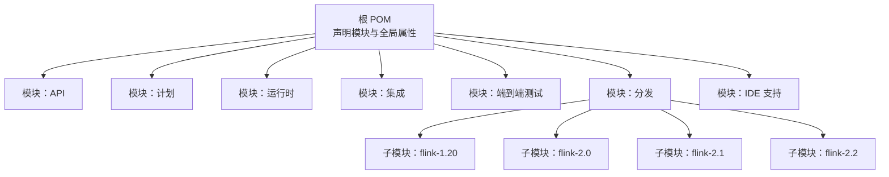
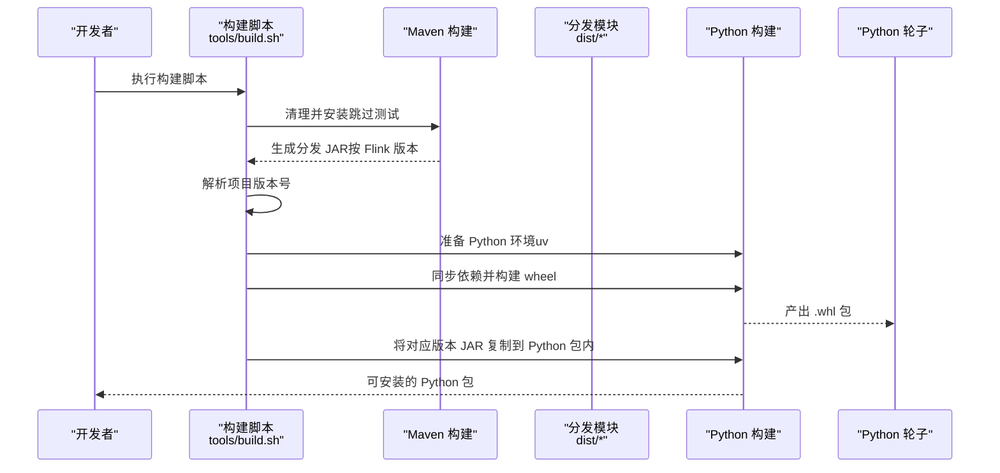
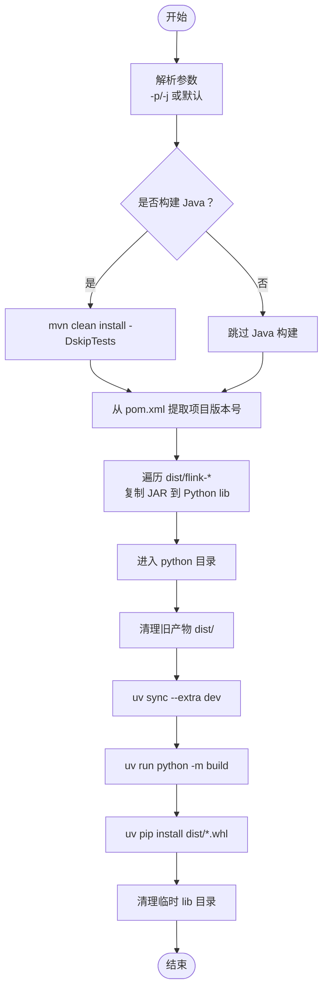
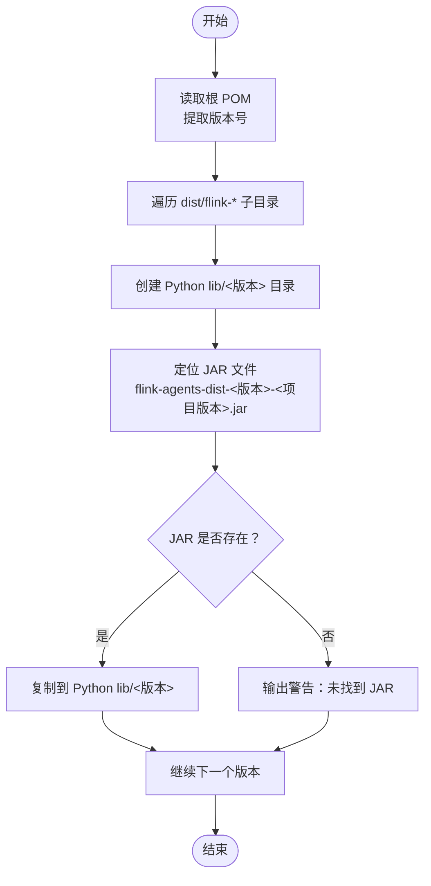
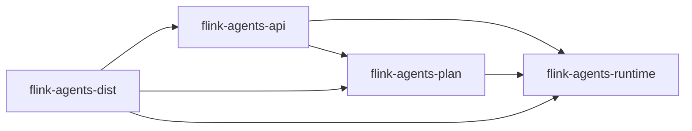

# 构建系统配置

<cite>
**本文引用的文件**
- [根 POM（pom.xml）](file://pom.xml)
- [构建脚本（tools/build.sh）](file://tools/build.sh)
- [Python 配置（python/pyproject.toml）](file://python/pyproject.toml)
- [API 模块 POM（api/pom.xml）](file://api/pom.xml)
- [运行时模块 POM（runtime/pom.xml）](file://runtime/pom.xml)
- [计划模块 POM（plan/pom.xml）](file://plan/pom.xml)
- [分发模块 POM（dist/pom.xml）](file://dist/pom.xml)
- [单元测试脚本（tools/ut.sh）](file://tools/ut.sh)
- [端到端测试脚本（tools/e2e.sh）](file://tools/e2e.sh)
- [代码格式化脚本（tools/lint.sh）](file://tools/lint.sh)
- [更新 Flink 版本脚本（tools/update_flink_version.sh）](file://tools/update_flink_version.sh)
- [许可证检查脚本（tools/check-license.sh）](file://tools/check-license.sh)
- [用户文档（README.md）](file://README.md)
</cite>

## 目录
1. [简介](#简介)
2. [项目结构](#项目结构)
3. [核心组件](#核心组件)
4. [架构总览](#架构总览)
5. [详细组件分析](#详细组件分析)
6. [依赖关系分析](#依赖关系分析)
7. [性能考虑](#性能考虑)
8. [故障排除指南](#故障排除指南)
9. [结论](#结论)
10. [附录](#附录)

## 简介
本文件面向 Apache Flink Agents 项目的构建系统，系统性梳理 Maven 多模块构建配置、构建脚本与参数选择机制、Python 包构建配置、版本管理策略、构建环境要求以及性能优化与故障排除建议。目标是帮助开发者快速理解并高效地完成本地与 CI 构建。

## 项目结构
项目采用 Maven 聚合工程组织，顶层 POM 声明模块与全局属性；各子模块按功能拆分，如 API、计划、运行时、集成、端到端测试、分发与 IDE 支持等；同时提供统一的构建脚本与测试脚本，覆盖 Java 与 Python 双栈。

图表来源
- [根 POM（pom.xml）](file://pom.xml#L58-L67)
- [分发模块 POM（dist/pom.xml）](file://dist/pom.xml#L39-L44)

章节来源
- [根 POM（pom.xml）](file://pom.xml#L1-L319)
- [分发模块 POM（dist/pom.xml）](file://dist/pom.xml#L1-L138)

## 核心组件
- Maven 聚合与模块化：顶层 POM 统一管理版本与插件，子模块按职责划分，避免重复配置。
- 构建脚本：tools/build.sh 提供 Java/Python 单独或联合构建能力，并在 Python 构建前自动复制对应 Flink 版本的 JAR 到 Python 包中。
- Python 包配置：python/pyproject.toml 定义包名、版本、依赖与可选开发/测试/构建依赖组，支持 uv 工作区与跨平台打包。
- 版本管理：通过 POM 属性集中管理 Flink 版本，脚本中使用正则提取项目版本号，用于 JAR 文件命名与复制。
- 测试与质量：提供单元测试、端到端测试与代码格式化脚本，支持多 Flink 版本矩阵测试。

章节来源
- [根 POM（pom.xml）](file://pom.xml#L37-L56)
- [构建脚本（tools/build.sh）](file://tools/build.sh#L18-L86)
- [Python 配置（python/pyproject.toml）](file://python/pyproject.toml#L18-L194)

## 架构总览
下图展示从命令行到产物产出的整体流程，包括 Java 编译、分发打包、Python 包构建与 JAR 复制。

图表来源
- [构建脚本（tools/build.sh）](file://tools/build.sh#L43-L86)
- [分发模块 POM（dist/pom.xml）](file://dist/pom.xml#L99-L137)
- [Python 配置（python/pyproject.toml）](file://python/pyproject.toml#L18-L194)

## 详细组件分析

### Maven 多模块与生命周期
- 模块组织：顶层 POM 声明 api、plan、runtime、integrations、e2e-test、dist、ide-support 等模块，便于按需编译与测试。
- 全局属性：集中定义 Java 版本、Jackson、Flink、Kafka、JUnit、Log4j2、Mockito 等版本，确保一致性。
- 插件管理：统一管理 javadoc、spotless、maven-surefire 等插件版本与配置，保证风格与测试行为一致。
- 构建生命周期：默认执行 validate -> compile -> test -> package -> install；release/profile 触发额外签名与发布流程。

章节来源
- [根 POM（pom.xml）](file://pom.xml#L58-L67)
- [根 POM（pom.xml）](file://pom.xml#L37-L56)
- [根 POM（pom.xml）](file://pom.xml#L253-L317)

### 构建脚本 build.sh 功能与参数
- 参数解析：支持 -p/--python（仅构建 Python）、-j/--java（仅构建 Java），默认双栈构建。
- Java 构建：打印 Maven 版本后执行清理安装并跳过测试，加速构建。
- Python 构建前准备：解析顶层 POM 中的项目版本号，遍历 dist 下的 flink-* 子目录，复制对应版本的 dist JAR 到 Python 包的 lib 目录中。
- Python 构建：进入 python 目录，清理旧产物，安装 uv，同步开发依赖，构建 wheel 并安装 wheel，最后清理临时 lib 目录。

图表来源
- [构建脚本（tools/build.sh）](file://tools/build.sh#L18-L86)

章节来源
- [构建脚本（tools/build.sh）](file://tools/build.sh#L18-L86)

### Python 包构建配置（pyproject.toml）
- 构建系统：使用 setuptools 作为构建后端，wheel 作为元数据格式。
- 包元信息：名称、版本、描述、许可证、作者、Python 版本范围与分类器。
- 依赖管理：核心依赖（如 pydantic、pyyaml、openai、ollama 等），可选依赖组（dev、build、test、lint）。
- 包数据：声明 flink_agents.lib 与示例资源的打包规则。
- 平台与打包：cibuildwheel 配置支持多平台；uv 工作区与所需环境约束。
- 代码规范：ruff 配置（规则集、忽略项、格式化等）。

章节来源
- [Python 配置（python/pyproject.toml）](file://python/pyproject.toml#L18-L194)

### 版本管理与 JAR 复制逻辑
- 项目版本号提取：通过正则从顶层 POM 的 <version> 标签提取版本号，用于 JAR 文件命名与复制。
- Flink 版本映射：dist/pom.xml 中为不同 Flink 主次版本维护独立属性，分发模块聚合依赖并打包。
- JAR 复制：脚本遍历 dist/flink-* 目录，按版本子目录创建 Python 包内的 lib 子目录，并复制对应 JAR 文件。

图表来源
- [构建脚本（tools/build.sh）](file://tools/build.sh#L54-L75)
- [分发模块 POM（dist/pom.xml）](file://dist/pom.xml#L32-L37)

章节来源
- [构建脚本（tools/build.sh）](file://tools/build.sh#L54-L75)
- [分发模块 POM（dist/pom.xml）](file://dist/pom.xml#L32-L37)

### 测试与质量脚本
- 单元测试（tools/ut.sh）：支持 Java/Python 单独或联合测试，可指定 Flink 版本列表，批量安装并执行测试，支持 E2E 测试路径。
- 端到端测试（tools/e2e.sh）：自动构建项目与 Python 环境，执行跨语言资源、代理计划兼容性与配置互操作等测试。
- 代码格式化（tools/lint.sh）：统一 Python（ruff）与 Java（spotless）格式化与检查，支持格式修复与只检查模式。

章节来源
- [单元测试脚本（tools/ut.sh）](file://tools/ut.sh#L67-L196)
- [端到端测试脚本（tools/e2e.sh）](file://tools/e2e.sh#L20-L166)
- [代码格式化脚本（tools/lint.sh）](file://tools/lint.sh#L115-L167)

### Flink 版本更新与许可证检查
- 更新 Flink 版本（tools/update_flink_version.sh）：校验目标版本格式，批量更新 dist 与 e2e-test 模块的版本属性，必要时同步根 POM 默认版本。
- 许可证检查（tools/check-license.sh）：下载 Apache RAT 工具，扫描项目并检查许可证头。

章节来源
- [更新 Flink 版本脚本（tools/update_flink_version.sh）](file://tools/update_flink_version.sh#L22-L79)
- [许可证检查脚本（tools/check-license.sh）](file://tools/check-license.sh#L23-L88)

## 依赖关系分析
- 模块间依赖：runtime 依赖 api 与 plan；plan 依赖 api 与若干 Jackson、Testcontainers；dist 聚合多个集成模块并打包为 Uber JAR。
- 运行时多版本支持：runtime 模块通过 profile 在 JDK 21+ 编译特定源码至 META-INF/versions/21，实现多发行版本 JAR。
- 分发模块：dist 模块聚合 api、plan、runtime 与多个集成模块，使用 shade 插件生成包含所有依赖的可运行 JAR。

图表来源
- [运行时模块 POM（runtime/pom.xml）](file://runtime/pom.xml#L31-L42)
- [计划模块 POM（plan/pom.xml）](file://plan/pom.xml#L31-L48)
- [分发模块 POM（dist/pom.xml）](file://dist/pom.xml#L46-L97)

章节来源
- [运行时模块 POM（runtime/pom.xml）](file://runtime/pom.xml#L31-L42)
- [计划模块 POM（plan/pom.xml）](file://plan/pom.xml#L31-L48)
- [分发模块 POM（dist/pom.xml）](file://dist/pom.xml#L46-L97)

## 性能考虑
- 并行构建：Maven 使用 -T16（tools/ut.sh）提升测试阶段并发度；lint 脚本使用 -T10（tools/lint.sh）对 Java 格式化进行并发控制。
- 跳过测试：构建脚本默认跳过测试以缩短构建时间；如需验证可移除 -DskipTests。
- 选择性模块：通过 Maven -pl 指定模块，减少无关模块编译与测试。
- 依赖缓存：Python 使用 uv（tools/ut.sh、tools/e2e.sh）提升依赖解析与安装速度；建议在 CI 中缓存 uv 环境。
- 仅构建目标：使用 build.sh 的 -j/-p 参数，避免不必要的另一侧构建。

章节来源
- [单元测试脚本（tools/ut.sh）](file://tools/ut.sh#L173-L174)
- [代码格式化脚本（tools/lint.sh）](file://tools/lint.sh#L132-L133)
- [构建脚本（tools/build.sh）](file://tools/build.sh#L44-L46)

## 故障排除指南
- Java 版本不匹配
  - 现象：构建失败或启用 JDK 21 特性时报错。
  - 排查：确认 JDK 版本与 POM 中 target.java.version 一致；JDK 21+ 会自动跳过 spotless。
  - 参考：根 POM profiles 与运行时模块的 java-21 profile。
- Python 依赖安装失败
  - 现象：uv 或 pip 安装依赖报错。
  - 排查：优先使用 uv；若无 uv，则回退到 pip 安装 pyproject.toml 的 test/dev/lint 依赖组；确保网络可达。
  - 参考：tools/ut.sh、tools/e2e.sh、tools/lint.sh。
- 未找到 JAR 文件
  - 现象：Python 构建阶段提示 JAR 未找到。
  - 排查：确认 dist 模块已成功构建且 dist/flink-* 下存在对应版本 JAR；检查项目版本号提取逻辑。
  - 参考：tools/build.sh 的 JAR 查找与复制逻辑。
- 端到端测试失败
  - 现象：跨语言资源或代理计划兼容性测试失败。
  - 排查：先执行 tools/build.sh 完成基础构建；确保 Python 环境已安装；检查 Ollama/第三方服务可用性。
  - 参考：tools/e2e.sh。
- 许可证检查失败
  - 现象：RAT 报告缺失许可证头。
  - 排查：根据报告补充缺失文件的许可证头；检查 .rat-excludes 是否正确。
  - 参考：tools/check-license.sh。

章节来源
- [根 POM（pom.xml）](file://pom.xml#L110-L131)
- [运行时模块 POM（runtime/pom.xml）](file://runtime/pom.xml#L164-L205)
- [单元测试脚本（tools/ut.sh）](file://tools/ut.sh#L208-L250)
- [端到端测试脚本（tools/e2e.sh）](file://tools/e2e.sh#L129-L135)
- [构建脚本（tools/build.sh）](file://tools/build.sh#L67-L73)
- [许可证检查脚本（tools/check-license.sh）](file://tools/check-license.sh#L80-L87)

## 结论
本项目通过 Maven 聚合与模块化设计、统一的构建与测试脚本、以及 Python 包的自动化集成，实现了 Java 与 Python 双栈的一致构建体验。借助版本属性集中管理与脚本化的 JAR 复制，确保了多 Flink 版本的可维护性。建议在本地与 CI 中结合并行构建与选择性模块，以获得最佳效率。

## 附录
- 构建环境要求
  - 操作系统：Unix-like 环境（Linux、macOS、WSL/Cygwin）。
  - 工具链：Git、Maven、Java 11（推荐配合 JDK 21+ 以启用多发行版本特性）、Python 3.10/3.11。
  - 参考：README.md 中的“构建”部分与构建脚本注释。
- 快速开始
  - 使用 tools/build.sh 一键构建 Java 与 Python；或使用 -j/-p 仅构建一侧。
  - 使用 tools/ut.sh 指定 Flink 版本矩阵进行测试；使用 tools/e2e.sh 执行端到端测试。
  - 使用 tools/lint.sh 进行代码格式化与检查。

章节来源
- [用户文档（README.md）](file://README.md#L9-L28)
- [构建脚本（tools/build.sh）](file://tools/build.sh#L44-L46)
- [单元测试脚本（tools/ut.sh）](file://tools/ut.sh#L85-L113)
- [端到端测试脚本（tools/e2e.sh）](file://tools/e2e.sh#L147-L148)
- [代码格式化脚本（tools/lint.sh）](file://tools/lint.sh#L132-L133)