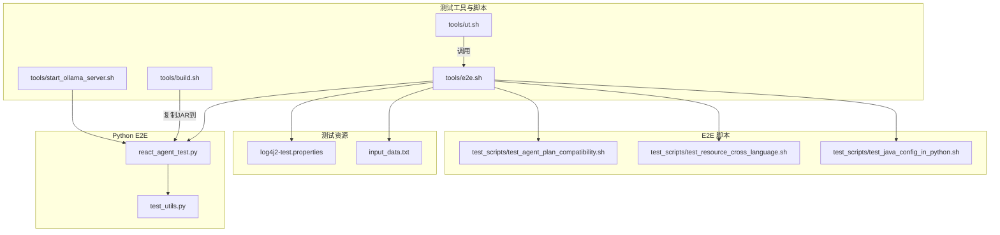
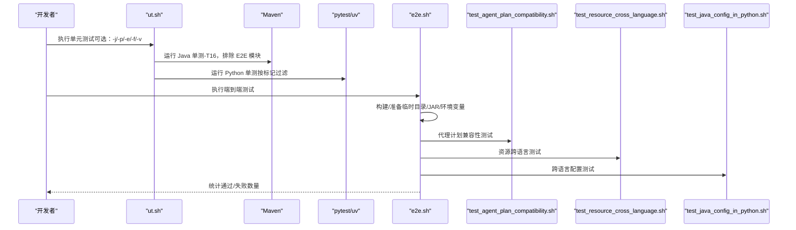
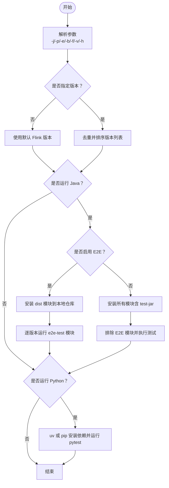
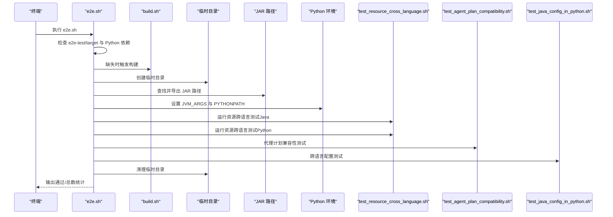
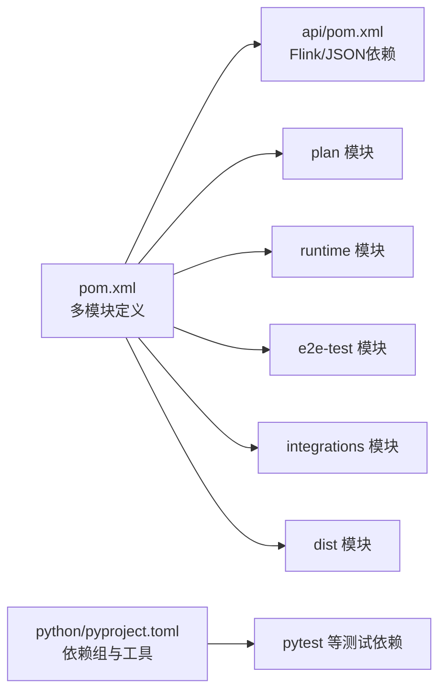

# 测试执行管理

<cite>
**本文引用的文件**
- [tools/ut.sh](file://tools/ut.sh)
- [tools/e2e.sh](file://tools/e2e.sh)
- [tools/build.sh](file://tools/build.sh)
- [tools/start_ollama_server.sh](file://tools/start_ollama_server.sh)
- [e2e-test/test-scripts/test_agent_plan_compatibility.sh](file://e2e-test/test-scripts/test_agent_plan_compatibility.sh)
- [e2e-test/test-scripts/test_resource_cross_language.sh](file://e2e-test/test-scripts/test_resource_cross_language.sh)
- [e2e-test/test-scripts/test_java_config_in_python.sh](file://e2e-test/test-scripts/test_java_config_in_python.sh)
- [e2e-test/flink-agents-end-to-end-tests-integration/src/test/resources/log4j2-test.properties](file://e2e-test/flink-agents-end-to-end-tests-integration/src/test/resources/log4j2-test.properties)
- [python/flink_agents/e2e_tests/e2e_tests_integration/react_agent_test.py](file://python/flink_agents/e2e_tests/e2e_tests_integration/react_agent_test.py)
- [python/flink_agents/e2e_tests/test_utils.py](file://python/flink_agents/e2e_tests/test_utils.py)
- [python/pyproject.toml](file://python/pyproject.toml)
- [pom.xml](file://pom.xml)
- [api/pom.xml](file://api/pom.xml)
</cite>

## 目录
1. [简介](#简介)
2. [项目结构](#项目结构)
3. [核心组件](#核心组件)
4. [架构总览](#架构总览)
5. [详细组件分析](#详细组件分析)
6. [依赖分析](#依赖分析)
7. [性能考虑](#性能考虑)
8. [故障排查指南](#故障排查指南)
9. [结论](#结论)
10. [附录](#附录)

## 简介
本指南面向 Apache Flink Agents 项目的测试执行管理，覆盖单元测试、集成测试与端到端测试（E2E）的完整流程。内容包括：
- 单元测试执行：ut.sh 的功能、参数与执行逻辑
- 集成测试与端到端测试：e2e.sh 的使用、测试环境准备与外部服务启动
- 测试配置与环境变量：测试数据准备、日志配置、外部模型服务（如 Ollama）
- 测试报告与结果解读：退出码语义、测试结果统计
- 测试隔离与并发：模块化与并行度控制
- 调试技巧：断点与日志定位
- 环境搭建：构建脚本、Docker 外部依赖准备

## 项目结构
测试相关的关键目录与文件：
- 工具脚本：tools/ut.sh、tools/e2e.sh、tools/build.sh、tools/start_ollama_server.sh
- E2E 测试脚本：e2e-test/test-scripts/*.sh
- 测试资源与日志：e2e-test/*/src/test/resources/*
- Python 端到端测试：python/flink_agents/e2e_tests/**
- 依赖与打包：python/pyproject.toml、pom.xml、api/pom.xml

图表来源
- [tools/ut.sh](file://tools/ut.sh#L1-L328)
- [tools/e2e.sh](file://tools/e2e.sh#L1-L166)
- [tools/build.sh](file://tools/build.sh#L1-L86)
- [tools/start_ollama_server.sh](file://tools/start_ollama_server.sh#L1-L28)
- [e2e-test/test-scripts/test_agent_plan_compatibility.sh](file://e2e-test/test-scripts/test_agent_plan_compatibility.sh#L1-L78)
- [e2e-test/test-scripts/test_resource_cross_language.sh](file://e2e-test/test-scripts/test_resource_cross_language.sh#L1-L42)
- [e2e-test/test-scripts/test_java_config_in_python.sh](file://e2e-test/test-scripts/test_java_config_in_python.sh#L1-L46)
- [e2e-test/flink-agents-end-to-end-tests-integration/src/test/resources/log4j2-test.properties](file://e2e-test/flink-agents-end-to-end-tests-integration/src/test/resources/log4j2-test.properties#L1-L29)
- [python/flink_agents/e2e_tests/e2e_tests_integration/react_agent_test.py](file://python/flink_agents/e2e_tests/e2e_tests_integration/react_agent_test.py#L1-L240)
- [python/flink_agents/e2e_tests/test_utils.py](file://python/flink_agents/e2e_tests/test_utils.py#L1-L69)

章节来源
- [tools/ut.sh](file://tools/ut.sh#L1-L328)
- [tools/e2e.sh](file://tools/e2e.sh#L1-L166)
- [tools/build.sh](file://tools/build.sh#L1-L86)
- [tools/start_ollama_server.sh](file://tools/start_ollama_server.sh#L1-L28)
- [e2e-test/test-scripts/test_agent_plan_compatibility.sh](file://e2e-test/test-scripts/test_agent_plan_compatibility.sh#L1-L78)
- [e2e-test/test-scripts/test_resource_cross_language.sh](file://e2e-test/test-scripts/test_resource_cross_language.sh#L1-L42)
- [e2e-test/test-scripts/test_java_config_in_python.sh](file://e2e-test/test-scripts/test_java_config_in_python.sh#L1-L46)
- [e2e-test/flink-agents-end-to-end-tests-integration/src/test/resources/log4j2-test.properties](file://e2e-test/flink-agents-end-to-end-tests-integration/src/test/resources/log4j2-test.properties#L1-L29)
- [python/flink_agents/e2e_tests/e2e_tests_integration/react_agent_test.py](file://python/flink_agents/e2e_tests/e2e_tests_integration/react_agent_test.py#L1-L240)
- [python/flink_agents/e2e_tests/test_utils.py](file://python/flink_agents/e2e_tests/test_utils.py#L1-L69)

## 核心组件
- 单元测试执行器：tools/ut.sh
  - 支持仅 Java、仅 Python、同时运行、指定 Flink 版本、E2E 混合模式
  - 使用 Maven 并行执行（-T16），跳过安装测试 JAR
  - Python 使用 pytest 或 uv+pytest，支持按标记过滤
- 端到端测试编排：tools/e2e.sh
  - 自动构建、准备临时目录、收集 JAR、设置 JVM 参数
  - 依次运行跨语言资源测试、代理计划兼容性测试、跨语言配置测试
- 构建与分发：tools/build.sh
  - 同步拷贝各版本 Flink 的 JAR 到 Python 包内，供 E2E 使用
  - 使用 uv 进行依赖同步与打包安装
- 外部服务准备：tools/start_ollama_server.sh
  - 在 Linux 环境安装 Ollama，并在 Python E2E 中拉取模型
- E2E 脚本与测试
  - test_agent_plan_compatibility.sh：验证 Java 与 Python 之间的代理计划互转
  - test_resource_cross_language.sh：运行资源跨语言集成测试模块
  - test_java_config_in_python.sh：验证 Java 配置选项到 Python 的转换
  - react_agent_test.py：ReAct Agent 在本地与远程执行环境中的端到端用例
  - test_utils.py：封装 Ollama 模型拉取与结果校验工具

章节来源
- [tools/ut.sh](file://tools/ut.sh#L34-L65)
- [tools/ut.sh](file://tools/ut.sh#L122-L196)
- [tools/ut.sh](file://tools/ut.sh#L198-L284)
- [tools/ut.sh](file://tools/ut.sh#L286-L327)
- [tools/e2e.sh](file://tools/e2e.sh#L20-L86)
- [tools/e2e.sh](file://tools/e2e.sh#L90-L166)
- [tools/build.sh](file://tools/build.sh#L42-L86)
- [tools/start_ollama_server.sh](file://tools/start_ollama_server.sh#L19-L28)
- [e2e-test/test-scripts/test_agent_plan_compatibility.sh](file://e2e-test/test-scripts/test_agent_plan_compatibility.sh#L36-L78)
- [e2e-test/test-scripts/test_resource_cross_language.sh](file://e2e-test/test-scripts/test_resource_cross_language.sh#L29-L42)
- [e2e-test/test-scripts/test_java_config_in_python.sh](file://e2e-test/test-scripts/test_java_config_in_python.sh#L31-L46)
- [python/flink_agents/e2e_tests/e2e_tests_integration/react_agent_test.py](file://python/flink_agents/e2e_tests/e2e_tests_integration/react_agent_test.py#L78-L138)
- [python/flink_agents/e2e_tests/test_utils.py](file://python/flink_agents/e2e_tests/test_utils.py#L26-L49)

## 架构总览
下图展示从命令行到具体测试执行的总体流程：

图表来源
- [tools/ut.sh](file://tools/ut.sh#L122-L196)
- [tools/ut.sh](file://tools/ut.sh#L198-L284)
- [tools/e2e.sh](file://tools/e2e.sh#L90-L166)
- [e2e-test/test-scripts/test_agent_plan_compatibility.sh](file://e2e-test/test-scripts/test_agent_plan_compatibility.sh#L36-L78)
- [e2e-test/test-scripts/test_resource_cross_language.sh](file://e2e-test/test-scripts/test_resource_cross_language.sh#L29-L42)
- [e2e-test/test-scripts/test_java_config_in_python.sh](file://e2e-test/test-scripts/test_java_config_in_python.sh#L31-L46)

## 详细组件分析

### 单元测试执行器：ut.sh
- 功能概览
  - 解析参数：-j/--java、-p/--python、-e/--e2e、-b/--both、-f/--flink、-v/--verbose、-h/--help
  - 默认行为：未指定版本时使用默认 Flink 版本；去重并排序版本列表
  - Java 测试路径：
    - 若启用 E2E：先安装 dist 模块到本地仓库，再逐版本运行 e2e-test 模块
    - 否则：安装所有模块（含 test-jar），并排除 E2E 模块后执行测试
  - Python 测试路径：
    - 优先使用 uv（若存在）；否则回退到 pip+pyproject.toml
    - 支持按标记过滤（排除 e2e_tests 或仅运行 e2e_tests_integration）
- 退出码语义
  - 0：全部通过
  - 1：Java 失败
  - 2：Python 失败
  - 3：全部失败

图表来源
- [tools/ut.sh](file://tools/ut.sh#L67-L108)
- [tools/ut.sh](file://tools/ut.sh#L115-L121)
- [tools/ut.sh](file://tools/ut.sh#L122-L196)
- [tools/ut.sh](file://tools/ut.sh#L198-L284)

章节来源
- [tools/ut.sh](file://tools/ut.sh#L34-L65)
- [tools/ut.sh](file://tools/ut.sh#L115-L121)
- [tools/ut.sh](file://tools/ut.sh#L122-L196)
- [tools/ut.sh](file://tools/ut.sh#L198-L284)
- [tools/ut.sh](file://tools/ut.sh#L286-L327)

### 端到端测试编排：e2e.sh
- 功能概览
  - 自动构建与依赖准备：若缺少 e2e-test/target 或 Python 依赖，则触发 build.sh
  - 创建临时目录用于数据交换
  - 查找并导出 JAR 文件路径，设置 JVM 参数（如 --add-exports）
  - 依次运行：
    - 资源跨语言测试（Java 侧）
    - 资源跨语言测试（Python 侧）
    - 代理计划兼容性测试
    - 跨语言配置测试
  - 清理临时目录并输出统计结果
- 关键步骤
  - 获取绝对路径与 JAR 文件
  - 设置 PYTHONPATH（当通过 uv 虚拟环境探测到 Python 版本时）
  - 通过 uv 运行 Bash/Pytest 子脚本

图表来源
- [tools/e2e.sh](file://tools/e2e.sh#L90-L166)
- [e2e-test/test-scripts/test_resource_cross_language.sh](file://e2e-test/test-scripts/test_resource_cross_language.sh#L29-L42)
- [e2e-test/test-scripts/test_agent_plan_compatibility.sh](file://e2e-test/test-scripts/test_agent_plan_compatibility.sh#L36-L78)
- [e2e-test/test-scripts/test_java_config_in_python.sh](file://e2e-test/test-scripts/test_java_config_in_python.sh#L31-L46)

章节来源
- [tools/e2e.sh](file://tools/e2e.sh#L20-L86)
- [tools/e2e.sh](file://tools/e2e.sh#L90-L166)

### E2E 脚本与测试
- 代理计划兼容性测试
  - 生成 Java/Python 代理计划 JSON，分别由 Java 与 Python 互转，校验一致性
- 资源跨语言测试
  - 使用 Maven 在资源跨语言模块中执行测试
- 跨语言配置测试
  - 将 Java 配置选项转换为 Python 可用格式
- Python 端到端测试
  - ReAct Agent 在本地与远程执行环境中的用例
  - 通过环境变量控制模型名称与超时
  - 使用 Ollama 拉取模型并进行结果断言

章节来源
- [e2e-test/test-scripts/test_agent_plan_compatibility.sh](file://e2e-test/test-scripts/test_agent_plan_compatibility.sh#L36-L78)
- [e2e-test/test-scripts/test_resource_cross_language.sh](file://e2e-test/test-scripts/test_resource_cross_language.sh#L29-L42)
- [e2e-test/test-scripts/test_java_config_in_python.sh](file://e2e-test/test-scripts/test_java_config_in_python.sh#L31-L46)
- [python/flink_agents/e2e_tests/e2e_tests_integration/react_agent_test.py](file://python/flink_agents/e2e_tests/e2e_tests_integration/react_agent_test.py#L78-L138)
- [python/flink_agents/e2e_tests/test_utils.py](file://python/flink_agents/e2e_tests/test_utils.py#L26-L49)

## 依赖分析
- Maven 顶层 POM
  - 定义多模块结构（api、plan、runtime、e2e-test、integrations、dist、ide-support）
  - 统一管理 Flink 版本、JUnit、AssertJ、Mockito 等依赖
- API 模块 POM
  - 提供对 Flink Streaming/Table API 的编译期依赖（provided scope）
  - 引入 Jackson 与 pemja（用于 Python 交互）
- Python 依赖
  - pyproject.toml 定义核心库与可选依赖组（test/dev/build/lint）
  - E2E 测试依赖 pytest、pyflink、pydantic、ollama 等

图表来源
- [pom.xml](file://pom.xml#L58-L67)
- [api/pom.xml](file://api/pom.xml#L30-L65)
- [python/pyproject.toml](file://python/pyproject.toml#L86-L88)

章节来源
- [pom.xml](file://pom.xml#L58-L67)
- [api/pom.xml](file://api/pom.xml#L30-L65)
- [python/pyproject.toml](file://python/pyproject.toml#L86-L88)

## 性能考虑
- 并行度控制
  - ut.sh 使用 Maven 并行参数（-T16）提升 Java 单测执行速度
  - e2e.sh 在资源跨语言模块中使用 Maven 并行执行（-T16）
- 依赖安装优化
  - 优先使用 uv（若可用）以加速 Python 依赖解析与安装
  - 构建阶段一次性复制多版本 JAR 至 Python 包内，避免运行时重复下载
- 日志级别
  - E2E 测试日志根级别默认关闭，便于 CI 环境下减少噪音；可通过调整 log4j2-test.properties 提升调试可见性

章节来源
- [tools/ut.sh](file://tools/ut.sh#L173-L174)
- [tools/e2e.sh](file://tools/e2e.sh#L33-L33)
- [tools/build.sh](file://tools/build.sh#L77-L86)
- [e2e-test/flink-agents-end-to-end-tests-integration/src/test/resources/log4j2-test.properties](file://e2e-test/flink-agents-end-to-end-tests-integration/src/test/resources/log4j2-test.properties#L19-L29)

## 故障排查指南
- 退出码解读
  - 0：全部通过
  - 1：Java 测试失败
  - 2：Python 测试失败
  - 3：全部失败
- 常见问题定位
  - Flink 版本不匹配：确保 -f 指定的版本与实际构建产物一致
  - Python 依赖缺失：确认 uv 或 pip 安装了 [test] 依赖组
  - Ollama 服务不可用：检查 tools/start_ollama_server.sh 是否成功安装，或在 Python E2E 中通过 test_utils.py 拉取模型
  - 日志过多影响定位：将 log4j2-test.properties 的 rootLogger.level 从 OFF 调整为 INFO
- 断点与日志
  - Java：在对应测试类中添加断点，结合 Maven 测试日志定位
  - Python：在 pytest 中使用 -s 输出实时日志，必要时在关键函数前加断点

章节来源
- [tools/ut.sh](file://tools/ut.sh#L59-L64)
- [tools/e2e.sh](file://tools/e2e.sh#L149-L149)
- [e2e-test/flink-agents-end-to-end-tests-integration/src/test/resources/log4j2-test.properties](file://e2e-test/flink-agents-end-to-end-tests-integration/src/test/resources/log4j2-test.properties#L19-L29)
- [python/flink_agents/e2e_tests/test_utils.py](file://python/flink_agents/e2e_tests/test_utils.py#L26-L49)

## 结论
通过 ut.sh 与 e2e.sh 的协同，项目实现了从单元测试到端到端验证的全链路测试体系。配合多版本 Flink 支持、Python 依赖管理与外部服务准备脚本，能够稳定地支撑跨语言与跨模块的测试执行。建议在 CI 中固定 Flink 版本并开启并行执行，同时根据需要调整日志级别以平衡可观测性与性能。

## 附录
- 测试环境搭建步骤
  - 安装 Ollama（Linux）：执行 tools/start_ollama_server.sh
  - 准备 Python 依赖：确保 uv 可用，或使用 pip 安装 [test] 依赖组
  - 构建项目：执行 tools/build.sh，自动复制 JAR 至 Python 包内
  - 运行单测：tools/ut.sh（支持 -j/-p/-e/-f/-v）
  - 运行 E2E：tools/e2e.sh（自动准备 JAR 与临时目录）

章节来源
- [tools/start_ollama_server.sh](file://tools/start_ollama_server.sh#L19-L28)
- [python/pyproject.toml](file://python/pyproject.toml#L86-L88)
- [tools/build.sh](file://tools/build.sh#L42-L86)
- [tools/ut.sh](file://tools/ut.sh#L34-L65)
- [tools/e2e.sh](file://tools/e2e.sh#L90-L166)