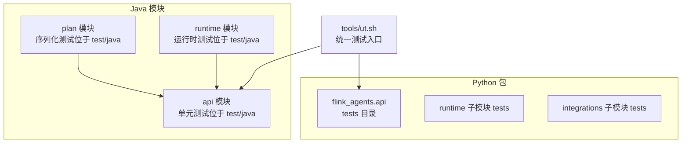
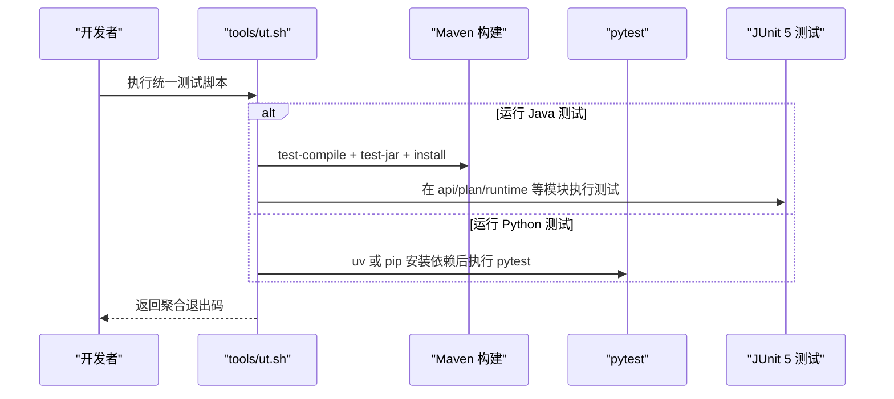
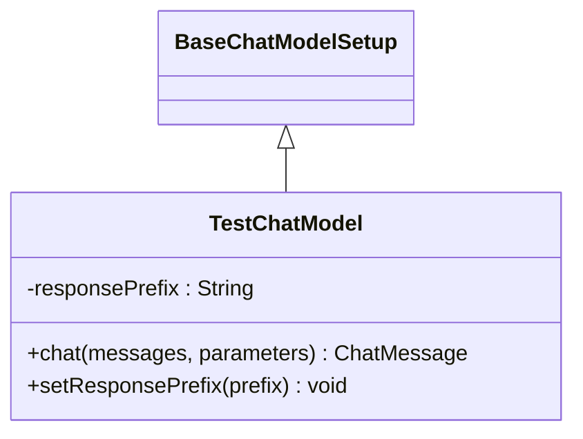
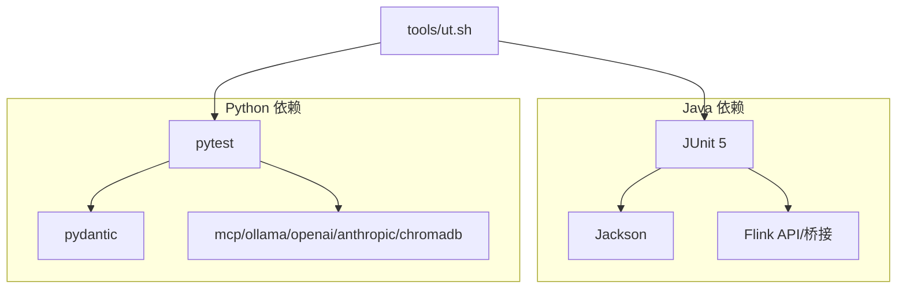

# 单元测试编写

<cite>
**本文引用的文件**
- [ReActAgentTest.java](file://api/src/test/java/org/apache/flink/agents/api/agents/ReActAgentTest.java)
- [BaseChatModelTest.java](file://api/src/test/java/org/apache/flink/agents/api/chat/model/BaseChatModelTest.java)
- [EmbeddingModelUtilsTest.java](file://api/src/test/java/org/apache/flink/agents/api/embedding/model/EmbeddingModelUtilsTest.java)
- [ChatMessageTest.java](file://api/src/test/java/org/apache/flink/agents/api/chat/messages/ChatMessageTest.java)
- [ActionJsonSerializerTest.java](file://plan/src/test/java/org/apache/flink/agents/plan/serializer/ActionJsonSerializerTest.java)
- [test_decorators.py](file://python/flink_agents/api/tests/test_decorators.py)
- [test_event.py](file://python/flink_agents/api/tests/test_event.py)
- [test_prompt.py](file://python/flink_agents/api/tests/test_prompt.py)
- [test_tool.py](file://python/flink_agents/api/tests/test_tool.py)
- [test_version_compatibility.py](file://python/flink_agents/api/tests/test_version_compatibility.py)
- [pyproject.toml](file://python/pyproject.toml)
- [ut.sh](file://tools/ut.sh)
- [pom.xml](file://api/pom.xml)
</cite>

## 目录
1. [引言](#引言)
2. [项目结构](#项目结构)
3. [核心组件](#核心组件)
4. [架构总览](#架构总览)
5. [详细组件分析](#详细组件分析)
6. [依赖分析](#依赖分析)
7. [性能考虑](#性能考虑)
8. [故障排查指南](#故障排查指南)
9. [结论](#结论)
10. [附录](#附录)

## 引言
本指南面向 Apache Flink Agents 项目的开发者与贡献者，系统性地阐述如何在该项目中编写高质量的单元测试，覆盖 Java（JUnit 5）与 Python（pytest）两种语言生态，并结合现有测试样例总结测试组织、命名规范、Mock 使用、数据准备、断言策略、覆盖率工具配置、测试隔离与环境清理、最佳实践与常见模式等主题。读者无需深入代码即可理解测试策略与实施要点。

## 项目结构
本项目采用多模块结构，测试分布在以下位置：
- Java 单元测试：位于各模块的 test/java 下，如 api 模块的 agents、chat、embedding、memory 等包内。
- Python 单元测试：位于 python/flink_agents/api/tests 及子模块 tests 中。
- 脚本与工具：tools/ut.sh 提供统一的 Java/Python 测试执行入口；pyproject.toml 定义 Python 测试依赖；api/pom.xml 展示 Java 依赖与作用域。

**图表来源**
- [ut.sh](file://tools/ut.sh#L122-L284)
- [pyproject.toml](file://python/pyproject.toml#L86-L88)
- [pom.xml](file://api/pom.xml#L30-L65)

**章节来源**
- [ut.sh](file://tools/ut.sh#L1-L328)
- [pyproject.toml](file://python/pyproject.toml#L1-L194)
- [pom.xml](file://api/pom.xml#L1-L67)

## 核心组件
本节从测试角度梳理关键组件与对应测试策略：
- 输出模式与序列化：ReActAgentTest 展示了 OutputSchema 的序列化与反序列化断言。
- 聊天模型行为：BaseChatModelTest 覆盖资源类型、提示格式化、对话消息处理、空输入、多用户消息、响应格式、长输入等场景。
- 嵌入向量工具：EmbeddingModelUtilsTest 验证数值列表到浮点数组转换及异常路径。
- 消息模型：ChatMessageTest 覆盖角色、工具调用、额外参数、相等性、字符串表示、角色值等。
- 计划序列化：ActionJsonSerializerTest 验证 Java/Python 函数类型的序列化、多事件监听、空事件列表、往返序列化与配置字段。
- Python 行事件与装饰器：test_event.py、test_decorators.py 分别验证事件序列化、行类型兼容与装饰器行为。
- 提示与工具：test_prompt.py、test_tool.py 验证提示模板格式化、工具元数据序列化/反序列化。
- 版本兼容：test_version_compatibility.py 使用 Mock 验证版本解析与比较逻辑。

**章节来源**
- [ReActAgentTest.java](file://api/src/test/java/org/apache/flink/agents/api/agents/ReActAgentTest.java#L29-L44)
- [BaseChatModelTest.java](file://api/src/test/java/org/apache/flink/agents/api/chat/model/BaseChatModelTest.java#L44-L256)
- [EmbeddingModelUtilsTest.java](file://api/src/test/java/org/apache/flink/agents/api/embedding/model/EmbeddingModelUtilsTest.java#L32-L123)
- [ChatMessageTest.java](file://api/src/test/java/org/apache/flink/agents/api/chat/messages/ChatMessageTest.java#L34-L153)
- [ActionJsonSerializerTest.java](file://plan/src/test/java/org/apache/flink/agents/plan/serializer/ActionJsonSerializerTest.java#L41-L239)
- [test_event.py](file://python/flink_agents/api/tests/test_event.py#L1-L128)
- [test_decorators.py](file://python/flink_agents/api/tests/test_decorators.py#L1-L65)
- [test_prompt.py](file://python/flink_agents/api/tests/test_prompt.py#L1-L131)
- [test_tool.py](file://python/flink_agents/api/tests/test_tool.py#L1-L72)
- [test_version_compatibility.py](file://python/flink_agents/api/tests/test_version_compatibility.py#L1-L170)

## 架构总览
下图展示测试执行流程与工具链关系：

**图表来源**
- [ut.sh](file://tools/ut.sh#L122-L284)

**章节来源**
- [ut.sh](file://tools/ut.sh#L1-L328)

## 详细组件分析

### Java 测试组织与命名规范
- 包与类组织：测试类按被测包结构放置于 test/java 下，例如 agents、chat.messages、chat.model、embedding.model、vectorstores.python 等。
- 类命名：以被测类名加 Test 结尾，如 ReActAgentTest、ChatMessageTest、BaseChatModelTest、EmbeddingModelUtilsTest、ActionJsonSerializerTest。
- 方法命名：使用语义化动词短语描述行为，配合 @DisplayName 提升可读性，如 testChatModelResourceType、testBasicChat、testToFloatArrayFromDoubleList、testSerializeJavaFunction。
- 断言风格：优先使用 JUnit 5 的 Assertions，结合静态导入简化断言调用。

**章节来源**
- [ReActAgentTest.java](file://api/src/test/java/org/apache/flink/agents/api/agents/ReActAgentTest.java#L29-L44)
- [ChatMessageTest.java](file://api/src/test/java/org/apache/flink/agents/api/chat/messages/ChatMessageTest.java#L34-L153)
- [BaseChatModelTest.java](file://api/src/test/java/org/apache/flink/agents/api/chat/model/BaseChatModelTest.java#L44-L256)
- [EmbeddingModelUtilsTest.java](file://api/src/test/java/org/apache/flink/agents/api/embedding/model/EmbeddingModelUtilsTest.java#L32-L123)
- [ActionJsonSerializerTest.java](file://plan/src/test/java/org/apache/flink/agents/plan/serializer/ActionJsonSerializerTest.java#L41-L239)

### Java Mock 对象与测试替身
- 替身实现：BaseChatModelTest 中通过继承 BaseChatModelSetup 创建 TestChatModel，重写 chat 方法以返回可控响应，避免真实外部服务依赖。
- 资源描述符：使用 ResourceDescriptor 构造测试替身，确保资源类型与参数传递符合预期。
- 参数化行为：通过 setter 注入可变状态（如响应前缀），验证不同配置下的行为差异。

**图表来源**
- [BaseChatModelTest.java](file://api/src/test/java/org/apache/flink/agents/api/chat/model/BaseChatModelTest.java#L50-L86)

**章节来源**
- [BaseChatModelTest.java](file://api/src/test/java/org/apache/flink/agents/api/chat/model/BaseChatModelTest.java#L44-L256)

### Java 测试数据准备与断言验证
- 数据准备：使用 RowTypeInfo、TypeInformation、Prompt.fromText/fromMessages、MessageRole 等构造输入数据。
- 断言策略：覆盖相等性、非空性、内容包含、长度与范围、异常抛出等。
- 序列化验证：通过 ObjectMapper 对 OutputSchema、Action 等进行序列化/反序列化校验，确保跨语言/跨模块兼容。

**章节来源**
- [ReActAgentTest.java](file://api/src/test/java/org/apache/flink/agents/api/agents/ReActAgentTest.java#L29-L44)
- [ActionJsonSerializerTest.java](file://plan/src/test/java/org/apache/flink/agents/plan/serializer/ActionJsonSerializerTest.java#L41-L239)

### Python 测试组织与命名规范
- 包与目录：测试位于 flink_agents/api/tests 以及各子模块 tests 目录，遵循与源码一致的层次结构。
- 文件命名：以 test_ 前缀命名，如 test_decorators.py、test_event.py、test_prompt.py、test_tool.py、test_version_compatibility.py。
- 函数命名：使用语义化动词短语，pytest 自动收集测试函数；必要时使用 pytest.mark.* 装饰器（本项目未广泛使用，但具备扩展能力）。
- 断言风格：使用 pytest 断言与异常捕获，结合 pytest.fixture 提供共享测试夹具。

**章节来源**
- [test_decorators.py](file://python/flink_agents/api/tests/test_decorators.py#L1-L65)
- [test_event.py](file://python/flink_agents/api/tests/test_event.py#L1-L128)
- [test_prompt.py](file://python/flink_agents/api/tests/test_prompt.py#L1-L131)
- [test_tool.py](file://python/flink_agents/api/tests/test_tool.py#L1-L72)
- [test_version_compatibility.py](file://python/flink_agents/api/tests/test_version_compatibility.py#L1-L170)

### Python Mock 对象与测试替身
- Mock 使用：test_version_compatibility.py 使用 unittest.mock.patch 替换 importlib.metadata.version，验证版本解析与比较逻辑在有无安装包时的行为。
- 行类型兼容：test_event.py 验证 Row 类型的序列化与回退机制，确保与上游 Flink Row 的兼容。

**章节来源**
- [test_version_compatibility.py](file://python/flink_agents/api/tests/test_version_compatibility.py#L1-L170)
- [test_event.py](file://python/flink_agents/api/tests/test_event.py#L1-L128)

### Python 测试数据准备与断言验证
- 夹具（fixture）：test_prompt.py 使用 pytest.fixture 提供 Prompt 实例，减少重复构造。
- 序列化一致性：test_tool.py 通过资源文件比对 ToolMetadata 的 JSON 序列化结果，保证跨版本兼容。
- 异常与边界：test_event.py 验证非序列化类型导致的异常，确保错误路径可预期。

**章节来源**
- [test_prompt.py](file://python/flink_agents/api/tests/test_prompt.py#L24-L131)
- [test_tool.py](file://python/flink_agents/api/tests/test_tool.py#L1-L72)
- [test_event.py](file://python/flink_agents/api/tests/test_event.py#L1-L128)

### 测试覆盖率工具配置
- Java（JaCoCo）：当前仓库未直接集成 JaCoCo 插件配置；建议在根 pom 或 api/plan/runtime 模块中引入 JaCoCo 插件，在 Maven test 生命周期中生成覆盖率报告。
- Python（coverage.py）：当前仓库未直接集成 coverage.py；建议在 pyproject.toml 中添加 coverage 工具依赖，并在 pytest 命令中启用 --cov 参数生成覆盖率报告。

注意：以上为通用建议，具体配置需结合项目构建与 CI/CD 流程进行落地。

**章节来源**
- [pom.xml](file://api/pom.xml#L1-L67)
- [pyproject.toml](file://python/pyproject.toml#L1-L194)

### 测试隔离与测试环境设置
- Java：使用 Maven test-compile 与 test-jar 安装本地仓库，确保模块间依赖可解析；测试日志配置位于 runtime 模块的 test/resources/log4j2-test.properties。
- Python：支持 uv 与 pip 两种依赖管理方式；通过 -k 排除 e2e 测试，避免端到端依赖影响单元测试稳定性。
- 资源清理：当前测试未见显式临时文件或网络资源清理逻辑；建议在需要时使用 @BeforeEach/@AfterEach 或 pytest fixture 的 teardown 机制进行清理。

**章节来源**
- [ut.sh](file://tools/ut.sh#L122-L284)
- [runtime 模块测试资源](file://runtime/pom.xml#L1-L67)

### 测试用例设计原则与常见模式
- 行为驱动：围绕“输入-期望输出”设计用例，如聊天模型的系统/用户消息、嵌入向量的数值转换。
- 边界与异常：覆盖空输入、单元素、混合类型、长输入、异常类型等边界条件。
- 往返测试：序列化/反序列化一致性验证，确保跨模块数据交换稳定。
- 版本兼容：通过 Mock 模拟外部依赖版本变化，验证兼容性判断逻辑。

**章节来源**
- [BaseChatModelTest.java](file://api/src/test/java/org/apache/flink/agents/api/chat/model/BaseChatModelTest.java#L107-L255)
- [EmbeddingModelUtilsTest.java](file://api/src/test/java/org/apache/flink/agents/api/embedding/model/EmbeddingModelUtilsTest.java#L35-L122)
- [ActionJsonSerializerTest.java](file://plan/src/test/java/org/apache/flink/agents/plan/serializer/ActionJsonSerializerTest.java#L173-L238)
- [test_version_compatibility.py](file://python/flink_agents/api/tests/test_version_compatibility.py#L135-L170)

## 依赖分析
Java 与 Python 测试依赖分布如下：
- Java：JUnit 5（测试框架）、Jackson（序列化）、Flink 相关 API/桥接（provided 作用域）。
- Python：pytest、pydantic、mcp、ollama、openai、anthropic、chromadb 等（测试依赖集中于 pyproject.toml 的 test 组）。

**图表来源**
- [pom.xml](file://api/pom.xml#L30-L65)
- [pyproject.toml](file://python/pyproject.toml#L86-L88)

**章节来源**
- [pom.xml](file://api/pom.xml#L1-L67)
- [pyproject.toml](file://python/pyproject.toml#L1-L194)

## 性能考虑
- 测试粒度：优先小而精的单元测试，避免过度依赖外部资源；必要时使用替身与 Mock。
- 并行执行：Java 可利用 Maven Parallel 执行器；Python 可使用 pytest-xdist（需在项目中新增配置）。
- 资源复用：通过 @BeforeEach/@BeforeAll 初始化共享资源，减少重复构造成本。
- 日志与输出：避免在测试中产生大量日志输出，保持测试执行快速稳定。

## 故障排查指南
- Java 测试失败定位：查看 Maven test 输出与堆栈信息，结合 @DisplayName 标注快速定位失败用例；检查序列化/反序列化字段是否匹配。
- Python 测试失败定位：使用 pytest -v/-s 输出详细信息；对 Mock 场景检查 patch 路径与返回值。
- 版本不一致：若出现版本比较失败，检查 Flink 安装版本与 _normalize_version 的处理逻辑。
- 依赖缺失：确认 tools/ut.sh 中的依赖安装步骤已正确执行，尤其是 uv/pip 选择与 apache-flink 版本匹配。

**章节来源**
- [ut.sh](file://tools/ut.sh#L122-L284)
- [test_version_compatibility.py](file://python/flink_agents/api/tests/test_version_compatibility.py#L1-L170)

## 结论
本指南基于现有测试样例总结了 Apache Flink Agents 项目的单元测试编写方法，涵盖 Java 与 Python 生态的组织结构、命名规范、Mock 与替身、数据准备与断言策略、覆盖率工具建议、隔离与环境设置、最佳实践与常见模式。建议在现有基础上持续完善覆盖率与端到端测试，确保跨语言与跨版本的稳定性。

## 附录
- 测试执行命令参考（来自工具脚本）
  - Java 全量测试：tools/ut.sh --java
  - Python 全量测试：tools/ut.sh --python
  - 排除 e2e：pytest flink_agents -k "not e2e_tests"
  - 指定 Flink 版本：tools/ut.sh -f 2.2 或 -f 1.20

**章节来源**
- [ut.sh](file://tools/ut.sh#L33-L108)
- [ut.sh](file://tools/ut.sh#L198-L284)