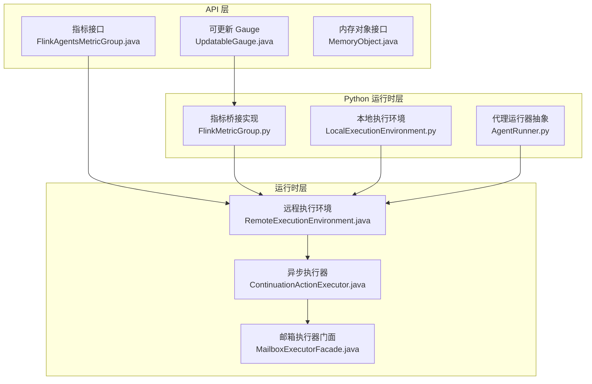
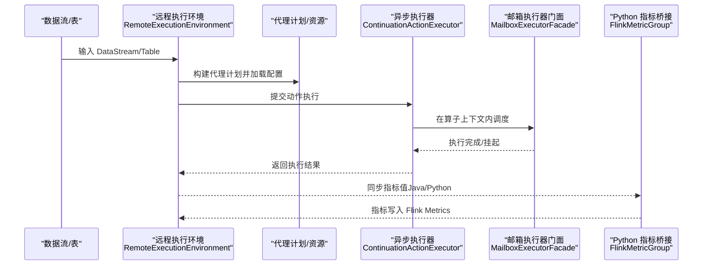
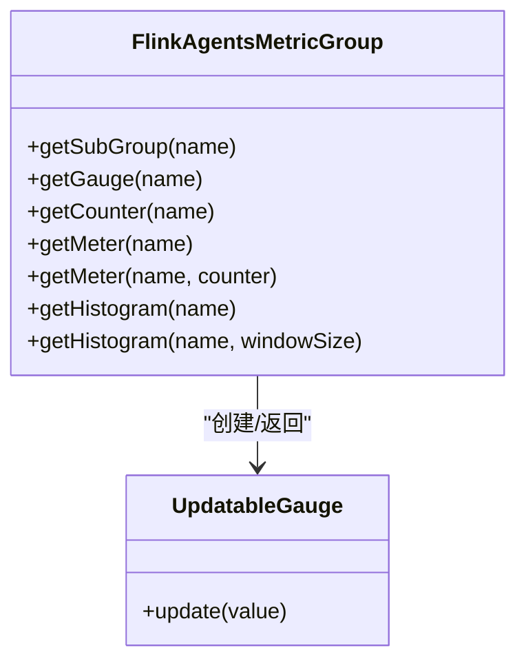
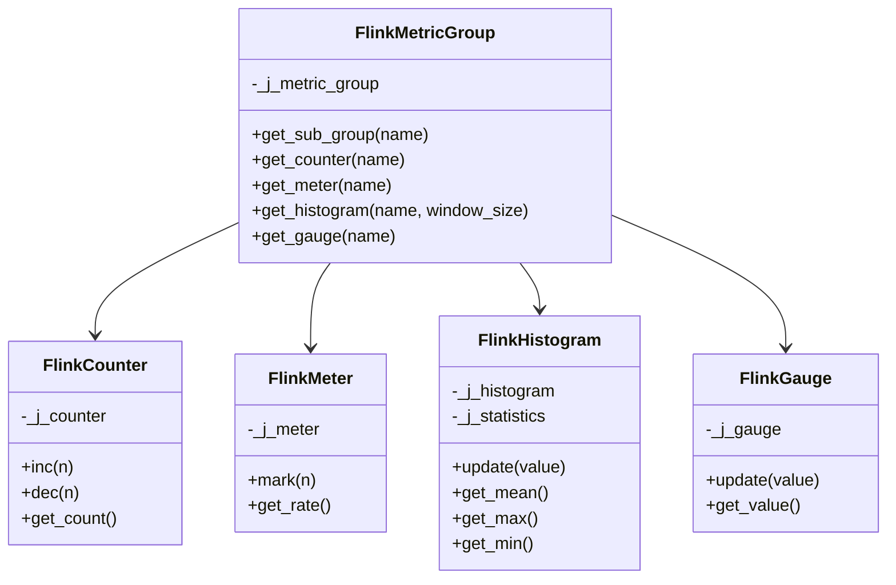
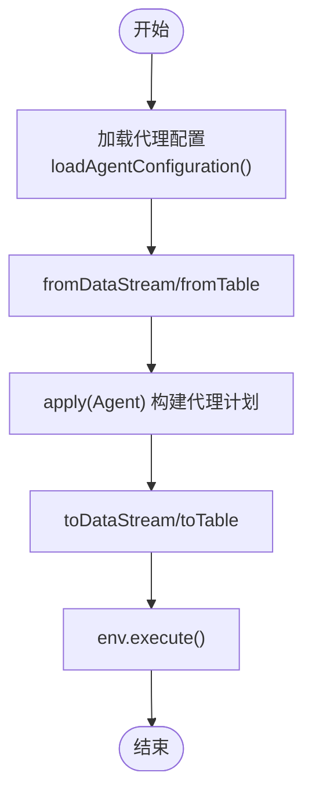
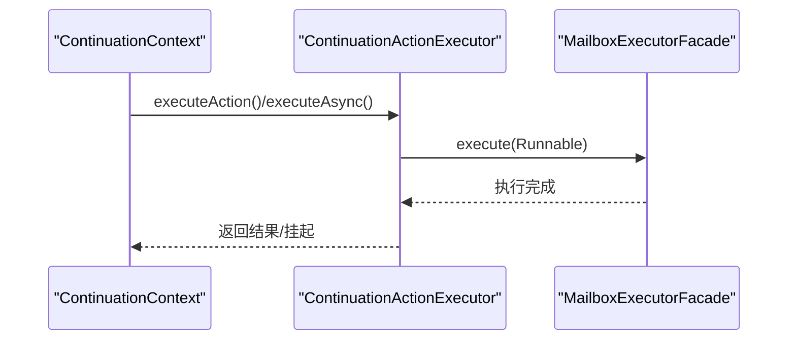
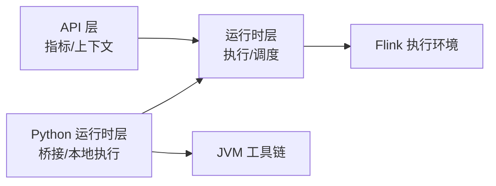

# 性能分析与优化

<cite>
**本文引用的文件**
- [README.md](file://README.md)
- [FlinkAgentsMetricGroup.java](file://api/src/main/java/org/apache/flink/agents/api/metrics/FlinkAgentsMetricGroup.java)
- [UpdatableGauge.java](file://api/src/main/java/org/apache/flink/agents/api/metrics/UpdatableGauge.java)
- [FlinkMetricGroup.py](file://python/flink_agents/runtime/flink_metric_group.py)
- [RemoteExecutionEnvironment.java](file://runtime/src/main/java/org/apache/flink/agents/runtime/env/RemoteExecutionEnvironment.java)
- [ContinuationActionExecutor.java](file://runtime/src/main/java/org/apache/flink/agents/runtime/async/ContinuationActionExecutor.java)
- [MailboxExecutorFacade.java](file://runtime/src/main/java/org/apache/flink/agents/runtime/common/MailboxExecutorFacade.java)
- [LocalExecutionEnvironment.py](file://python/flink_agents/runtime/local_execution_environment.py)
- [MemoryObject.java](file://api/src/main/java/org/apache/flink/agents/api/context/MemoryObject.java)
- [AgentRunner.py](file://python/flink_agents/runtime/agent_runner.py)
</cite>

## 目录
1. [简介](#简介)
2. [项目结构](#项目结构)
3. [核心组件](#核心组件)
4. [架构总览](#架构总览)
5. [详细组件分析](#详细组件分析)
6. [依赖关系分析](#依赖关系分析)
7. [性能考虑](#性能考虑)
8. [故障排查指南](#故障排查指南)
9. [结论](#结论)
10. [附录](#附录)

## 简介
本指南面向 Apache Flink Agents 项目的性能分析与优化，围绕以下主题展开：性能监控指标采集与分析（内存、CPU、网络 I/O）、JVM 性能分析工具（JProfiler、VisualVM、Flight Recorder）使用建议、Flink 作业性能分析（背压检测与算子性能监控）、内存泄漏检测与分析（堆转储与内存使用模式识别）、异步执行优化（线程池与任务调度）、跨语言调用性能影响与优化、代码质量分析工具（静态分析与复杂度评估）、性能基准测试设计与执行、以及性能优化案例与最佳实践。

## 项目结构
该项目采用多模块结构，包含 Java API、运行时（runtime）、Python 运行时与桥接层、端到端测试与集成示例等。与性能相关的关键位置包括：
- API 层：定义指标接口与可更新 Gauge，用于统一 Java/Python 的指标交互。
- 运行时层：远程执行环境与异步执行器、邮箱执行器门面等，承载 Flink 作业的执行与调度。
- Python 运行时层：指标桥接实现、本地执行环境、代理运行器等，负责与 Java 运行时协同。

**图表来源**
- [FlinkAgentsMetricGroup.java](file://api/src/main/java/org/apache/flink/agents/api/metrics/FlinkAgentsMetricGroup.java#L30-L92)
- [UpdatableGauge.java](file://api/src/main/java/org/apache/flink/agents/api/metrics/UpdatableGauge.java#L30-L37)
- [RemoteExecutionEnvironment.java](file://runtime/src/main/java/org/apache/flink/agents/runtime/env/RemoteExecutionEnvironment.java#L50-L117)
- [ContinuationActionExecutor.java](file://runtime/src/main/java/org/apache/flink/agents/runtime/async/ContinuationActionExecutor.java#L28-L69)
- [MailboxExecutorFacade.java](file://runtime/src/main/java/org/apache/flink/agents/runtime/common/MailboxExecutorFacade.java#L31-L44)
- [FlinkMetricGroup.py](file://python/flink_agents/runtime/flink_metric_group.py#L25-L57)
- [LocalExecutionEnvironment.py](file://python/flink_agents/runtime/local_execution_environment.py#L92-L179)
- [AgentRunner.py](file://python/flink_agents/runtime/agent_runner.py#L22-L44)

**章节来源**
- [README.md](file://README.md#L1-L44)

## 核心组件
- 指标体系与可更新 Gauge：通过统一的指标组接口与可更新 Gauge，支持在 Java 与 Python 之间一致地暴露与更新指标值，便于跨语言的性能观测。
- 远程执行环境：封装 Flink 流式执行环境，负责从 DataStream/Table 构建代理执行图，并加载代理配置。
- 异步执行器：在 JDK 11 下回退到同步执行；在 JDK 21+ 可利用 Continuation API 实现真正的异步执行。
- 邮箱执行器门面：将任务提交至 Flink 的 MailboxExecutor，确保在算子上下文内安全调度。
- 指标桥接实现（Python）：将 Python 侧指标对象映射到 Java 指标系统，实现与 Flink Metrics 的互通。
- 本地执行环境（Python）：提供本地调试与验证能力，便于小规模性能测试与验证。

**章节来源**
- [FlinkAgentsMetricGroup.java](file://api/src/main/java/org/apache/flink/agents/api/metrics/FlinkAgentsMetricGroup.java#L30-L92)
- [UpdatableGauge.java](file://api/src/main/java/org/apache/flink/agents/api/metrics/UpdatableGauge.java#L30-L37)
- [RemoteExecutionEnvironment.java](file://runtime/src/main/java/org/apache/flink/agents/runtime/env/RemoteExecutionEnvironment.java#L50-L117)
- [ContinuationActionExecutor.java](file://runtime/src/main/java/org/apache/flink/agents/runtime/async/ContinuationActionExecutor.java#L28-L69)
- [MailboxExecutorFacade.java](file://runtime/src/main/java/org/apache/flink/agents/runtime/common/MailboxExecutorFacade.java#L31-L44)
- [FlinkMetricGroup.py](file://python/flink_agents/runtime/flink_metric_group.py#L25-L57)
- [LocalExecutionEnvironment.py](file://python/flink_agents/runtime/local_execution_environment.py#L92-L179)

## 架构总览
下图展示了从输入数据流到代理执行再到指标上报的整体流程，以及跨语言指标桥接与异步执行路径。

**图表来源**
- [RemoteExecutionEnvironment.java](file://runtime/src/main/java/org/apache/flink/agents/runtime/env/RemoteExecutionEnvironment.java#L86-L214)
- [ContinuationActionExecutor.java](file://runtime/src/main/java/org/apache/flink/agents/runtime/async/ContinuationActionExecutor.java#L40-L57)
- [MailboxExecutorFacade.java](file://runtime/src/main/java/org/apache/flink/agents/runtime/common/MailboxExecutorFacade.java#L40-L43)
- [FlinkMetricGroup.py](file://python/flink_agents/runtime/flink_metric_group.py#L38-L56)

## 详细组件分析

### 指标体系与可更新 Gauge
- 设计要点
  - 统一的指标组接口提供子组、计数器、计量器、直方图与可更新 Gauge 的创建与访问。
  - 可更新 Gauge 使用字符串类型以避免跨语言类型不一致问题，便于 Python 与 Java 互操作。
- 性能意义
  - 通过直方图统计延迟分布、计量器统计吞吐、计数器统计事件总数，结合可更新 Gauge 动态反映运行时状态（如队列长度、并发度等）。
  - 建议按动作、资源、算子维度分层建立指标组，便于定位热点与瓶颈。

**图表来源**
- [FlinkAgentsMetricGroup.java](file://api/src/main/java/org/apache/flink/agents/api/metrics/FlinkAgentsMetricGroup.java#L30-L92)
- [UpdatableGauge.java](file://api/src/main/java/org/apache/flink/agents/api/metrics/UpdatableGauge.java#L30-L37)

**章节来源**
- [FlinkAgentsMetricGroup.java](file://api/src/main/java/org/apache/flink/agents/api/metrics/FlinkAgentsMetricGroup.java#L30-L92)
- [UpdatableGauge.java](file://api/src/main/java/org/apache/flink/agents/api/metrics/UpdatableGauge.java#L30-L37)

### 跨语言指标桥接（Python → Java）
- 设计要点
  - Python 侧指标对象持有 Java 指标对象句柄，所有读写操作委托给 Java 实现。
  - 支持子组、计数器、计量器、直方图与 Gauge 的完整映射。
- 性能意义
  - 通过桥接减少 Python 侧重复实现，保证与 Flink Metrics 的一致性与可观测性。
  - 建议在高吞吐场景中批量更新或合并指标写入，降低跨语言调用开销。

**图表来源**
- [FlinkMetricGroup.py](file://python/flink_agents/runtime/flink_metric_group.py#L25-L170)

**章节来源**
- [FlinkMetricGroup.py](file://python/flink_agents/runtime/flink_metric_group.py#L25-L170)

### 远程执行环境与代理构建
- 设计要点
  - 从 DataStream/Table 构建代理执行图，支持 KeySelector 与 Schema 映射。
  - 从 Flink 配置目录加载代理配置，确保运行时参数可配置。
- 性能意义
  - 将代理逻辑编译进 Flink 数据流拓扑，减少额外序列化与传输成本。
  - 合理设置 KeySelector 与分区策略，避免数据倾斜与热点。

**图表来源**
- [RemoteExecutionEnvironment.java](file://runtime/src/main/java/org/apache/flink/agents/runtime/env/RemoteExecutionEnvironment.java#L102-L117)
- [RemoteExecutionEnvironment.java](file://runtime/src/main/java/org/apache/flink/agents/runtime/env/RemoteExecutionEnvironment.java#L173-L214)

**章节来源**
- [RemoteExecutionEnvironment.java](file://runtime/src/main/java/org/apache/flink/agents/runtime/env/RemoteExecutionEnvironment.java#L50-L117)
- [RemoteExecutionEnvironment.java](file://runtime/src/main/java/org/apache/flink/agents/runtime/env/RemoteExecutionEnvironment.java#L173-L214)

### 异步执行与线程调度
- 设计要点
  - JDK 11 版本回退到同步执行；JDK 21+ 可利用 Continuation API 实现真正异步。
  - 邮箱执行器门面将任务提交到 Flink MailboxExecutor，确保在算子上下文内调度。
- 性能意义
  - 异步执行可提升 CPU 利用率与吞吐，但需注意上下文切换与锁竞争。
  - 合理配置线程池大小与任务调度策略，避免过度并发导致的抖动。

**图表来源**
- [ContinuationActionExecutor.java](file://runtime/src/main/java/org/apache/flink/agents/runtime/async/ContinuationActionExecutor.java#L40-L57)
- [MailboxExecutorFacade.java](file://runtime/src/main/java/org/apache/flink/agents/runtime/common/MailboxExecutorFacade.java#L40-L43)

**章节来源**
- [ContinuationActionExecutor.java](file://runtime/src/main/java/org/apache/flink/agents/runtime/async/ContinuationActionExecutor.java#L28-L69)
- [MailboxExecutorFacade.java](file://runtime/src/main/java/org/apache/flink/agents/runtime/common/MailboxExecutorFacade.java#L31-L44)

### 内存与状态管理
- 设计要点
  - MemoryObject 接口提供对短期记忆的路径访问、字段读写与嵌套对象管理。
  - 建议在代理动作中谨慎管理内存对象生命周期，避免大对象常驻与频繁分配。
- 性能意义
  - 合理的内存结构与访问模式可降低 GC 压力与延迟。
  - 对于长短期记忆，应区分读写路径与清理策略，防止内存泄漏。

**章节来源**
- [MemoryObject.java](file://api/src/main/java/org/apache/flink/agents/api/context/MemoryObject.java#L29-L131)

### 本地执行环境与代理运行器（Python）
- 设计要点
  - LocalExecutionEnvironment 提供本地列表输入与顺序执行能力，便于快速验证与小规模测试。
  - AgentRunner 抽象定义了代理执行接口，具体实现由运行时负责。
- 性能意义
  - 本地执行适合原型验证与低延迟场景，但在吞吐与容错方面不如远程执行。
  - 建议在本地验证后迁移至远程执行以获得更真实的性能画像。

**章节来源**
- [LocalExecutionEnvironment.py](file://python/flink_agents/runtime/local_execution_environment.py#L92-L179)
- [AgentRunner.py](file://python/flink_agents/runtime/agent_runner.py#L22-L44)

## 依赖关系分析
- 组件耦合
  - 运行时层依赖 API 层的指标与上下文接口，确保行为一致性。
  - Python 桥接层依赖 Java 运行时，通过对象句柄实现指标互通。
  - 异步执行器与邮箱执行器门面共同保障任务在算子上下文内的安全调度。
- 外部依赖
  - Flink 流式执行环境与表环境作为宿主，提供作业部署与监控能力。
  - JVM 工具链（JFR、VisualVM、JProfiler）用于深入分析运行时行为。

**图表来源**
- [RemoteExecutionEnvironment.java](file://runtime/src/main/java/org/apache/flink/agents/runtime/env/RemoteExecutionEnvironment.java#L50-L117)
- [FlinkMetricGroup.py](file://python/flink_agents/runtime/flink_metric_group.py#L25-L57)

**章节来源**
- [RemoteExecutionEnvironment.java](file://runtime/src/main/java/org/apache/flink/agents/runtime/env/RemoteExecutionEnvironment.java#L50-L117)
- [FlinkMetricGroup.py](file://python/flink_agents/runtime/flink_metric_group.py#L25-L57)

## 性能考虑

### 性能监控指标采集与分析
- 指标类型与用途
  - 计数器：累计事件总数，用于衡量吞吐与错误计数。
  - 计量器：记录事件速率，用于观察处理速率变化。
  - 直方图：记录延迟分布（均值、最大、最小），用于识别尾延迟与异常波动。
  - 可更新 Gauge：动态反映当前状态（如队列长度、并发度、内存占用等）。
- 采集建议
  - 按动作、资源、算子维度分层建立指标组，便于定位热点。
  - 在关键路径（模型调用、向量检索、工具调用）埋点，关注延迟与失败率。
  - 结合 Flink Web UI 与 Metrics 端点，持续观察指标趋势。

### JVM 性能分析工具使用
- JProfiler
  - 适用于 CPU 与内存热点定位、线程分析与火焰图生成。
  - 建议在远程执行环境中附加到 Flink TaskManager/JobManager，捕获真实负载下的性能画像。
- VisualVM
  - 适合快速检查堆内存、线程状态与 GC 行为。
  - 可配合 JFR 录制进行离线分析。
- Flight Recorder（JFR）
  - 低开销录制运行时事件（线程、GC、编译、锁竞争等）。
  - 建议在生产或准生产环境启用短时录制，定位偶发性能问题。

### Flink 作业性能分析
- 背压检测
  - 通过 Flink Web UI 的“背压”视图识别阻塞通道，结合算子指标定位慢算子。
  - 关注网络 I/O 与磁盘 I/O 导致的背压，必要时调整并行度或分区策略。
- 算子性能监控
  - 结合算子级吞吐、延迟直方图与水位线，识别数据倾斜与热点。
  - 对外部系统调用（LLM、向量库、工具）增加细粒度指标，区分网络与服务端延迟。

### 内存泄漏检测与分析
- 堆转储分析
  - 使用 JFR 或 JMC 生成堆转储，结合 Eclipse MAT 或 VisualVM 分析对象保留集。
  - 关注代理动作中的缓存、会话对象与临时集合是否正确释放。
- 内存使用模式识别
  - 观察晋升曲线与老年代增长速率，识别大对象与长期存活对象。
  - 对短期记忆与长期记忆的边界进行审查，避免误用导致的内存膨胀。

### 异步执行性能优化
- 线程池配置
  - 控制异步执行线程数量，避免与 Flink 并行度冲突导致上下文切换开销。
  - 对 I/O 密集型动作使用独立线程池，隔离 CPU 密集型任务。
- 任务调度优化
  - 利用邮箱执行器门面确保任务在算子上下文内调度，减少跨线程通信。
  - 合理划分动作粒度，避免过细导致调度开销过大。

### 跨语言调用性能影响与优化
- 性能影响
  - Python 与 Java 之间的对象传递与序列化存在额外开销。
  - 指标桥接通过句柄访问 Java 指标系统，频繁更新可能成为瓶颈。
- 优化策略
  - 减少跨语言调用频率，合并指标更新与批量化写入。
  - 在 Python 侧缓存常用资源描述符，避免重复构造与传递。

### 代码质量分析工具
- 静态代码分析
  - 使用 SpotBugs/PMD/Checkstyle 等工具检查潜在性能问题（如循环中的对象创建、锁范围过大）。
- 复杂度评估
  - 关注方法圈复杂度与嵌套深度，优先简化热点路径与异步回调。

### 性能基准测试设计与执行
- 设计原则
  - 明确基线场景（纯计算、I/O 密集、混合负载）与关键指标（P95/P99 延迟、吞吐、CPU/内存占用）。
  - 控制变量：固定并行度、分区策略、外部系统响应时间。
- 执行方法
  - 使用 Flink 自带的压测工具或自定义数据生成器，稳定注入流量。
  - 多轮次运行，排除冷启动与 GC 抖动影响，取稳健统计值。

## 故障排查指南
- 指标缺失或异常
  - 检查指标组创建与命名是否一致，确认 Python 桥接层句柄有效。
  - 核对 Flink Metrics 端点与 Web UI 配置，确保指标可见。
- 异步执行未生效
  - 确认运行时 JDK 版本，JDK 11 回退到同步执行属预期行为。
  - 检查邮箱执行器门面是否正确注册到算子上下文。
- 背压与吞吐不足
  - 审查慢算子与下游瓶颈，调整并行度与分区键。
  - 关注外部系统限流与超时配置，必要时引入重试与熔断。
- 内存压力与 GC 抖动
  - 分析堆转储，定位大对象与长生命周期对象。
  - 优化代理动作中的缓存策略与对象复用。

**章节来源**
- [FlinkMetricGroup.py](file://python/flink_agents/runtime/flink_metric_group.py#L25-L57)
- [ContinuationActionExecutor.java](file://runtime/src/main/java/org/apache/flink/agents/runtime/async/ContinuationActionExecutor.java#L28-L69)
- [MailboxExecutorFacade.java](file://runtime/src/main/java/org/apache/flink/agents/runtime/common/MailboxExecutorFacade.java#L31-L44)

## 结论
通过统一的指标体系、跨语言桥接与异步执行机制，Flink Agents 在保持灵活性的同时提供了可观测性与扩展性。结合 JVM 工具链与 Flink 监控面板，可在不同阶段（开发、测试、生产）系统性地发现并解决性能瓶颈。建议在实际部署中持续采集关键指标，定期进行基准测试与回归分析，形成闭环的性能治理流程。

## 附录
- 参考文档与社区
  - 用户文档与社区讨论渠道可用于获取最新实践与问题解答。
- 版本与构建
  - 使用提供的构建脚本与依赖版本，确保本地与远端环境一致性。

**章节来源**
- [README.md](file://README.md#L1-L44)