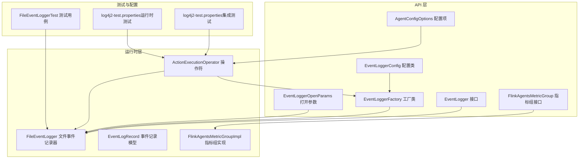
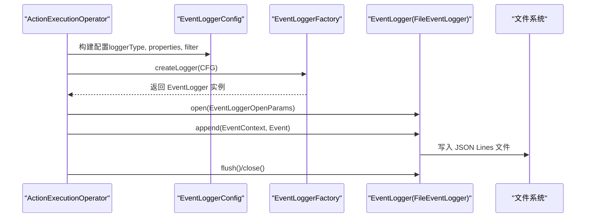
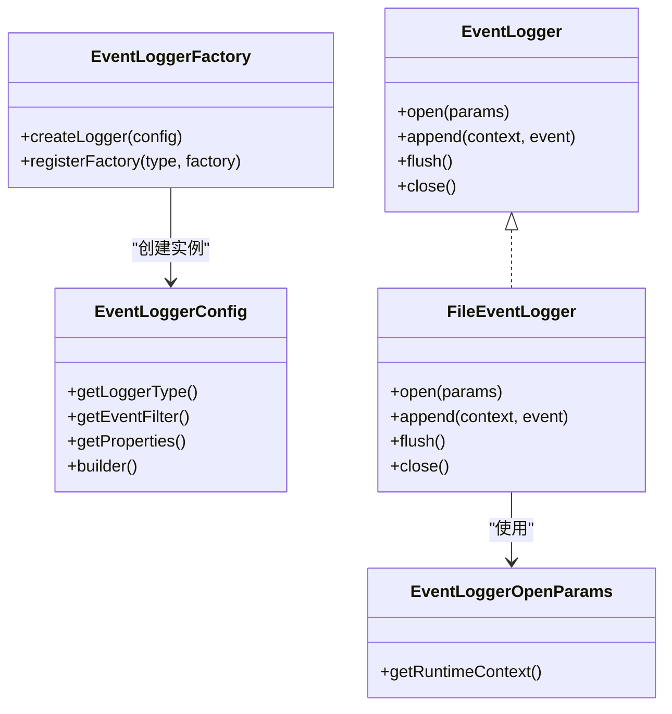
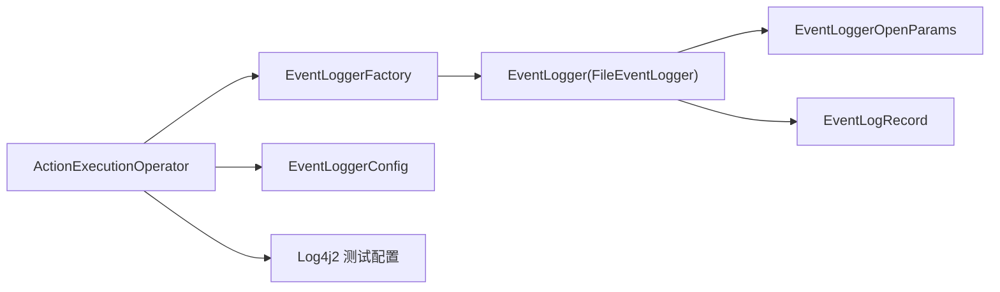

# 日志配置与监控

<cite>
**本文引用的文件**
- [EventLogger 接口](file://api/src/main/java/org/apache/flink/agents/api/logger/EventLogger.java)
- [EventLoggerConfig 配置类](file://api/src/main/java/org/apache/flink/agents/api/logger/EventLoggerConfig.java)
- [EventLoggerFactory 工厂类](file://api/src/main/java/org/apache/flink/agents/api/logger/EventLoggerFactory.java)
- [EventLoggerOpenParams 打开参数](file://api/src/main/java/org/apache/flink/agents/api/logger/EventLoggerOpenParams.java)
- [FileEventLogger 文件事件记录器](file://runtime/src/main/java/org/apache/flink/agents/runtime/eventlog/FileEventLogger.java)
- [EventLogRecord 事件记录模型](file://runtime/src/main/java/org/apache/flink/agents/runtime/eventlog/EventLogRecord.java)
- [ActionExecutionOperator 操作符（事件日志初始化）](file://runtime/src/main/java/org/apache/flink/agents/runtime/operator/ActionExecutionOperator.java)
- [AgentConfigOptions 配置项](file://api/src/main/java/org/apache/flink/agents/api/configuration/AgentConfigOptions.java)
- [FlinkAgentsMetricGroup 指标组接口](file://api/src/main/java/org/apache/flink/agents/api/metrics/FlinkAgentsMetricGroup.java)
- [FlinkAgentsMetricGroupImpl 指标组实现](file://runtime/src/main/java/org/apache/flink/agents/runtime/metrics/FlinkAgentsMetricGroupImpl.java)
- [log4j2-test.properties（集成测试）](file://e2e-test/flink-agents-end-to-end-tests-integration/src/test/resources/log4j2-test.properties)
- [log4j2-test.properties（运行时测试）](file://runtime/src/test/resources/log4j2-test.properties)
- [FileEventLoggerTest 测试用例](file://runtime/src/test/java/org/apache/flink/agents/runtime/eventlog/FileEventLoggerTest.java)
</cite>

## 目录
1. [简介](#简介)
2. [项目结构](#项目结构)
3. [核心组件](#核心组件)
4. [架构总览](#架构总览)
5. [详细组件分析](#详细组件分析)
6. [依赖关系分析](#依赖关系分析)
7. [性能考量](#性能考量)
8. [故障排查指南](#故障排查指南)
9. [结论](#结论)
10. [附录：配置模板与示例](#附录配置模板与示例)

## 简介
本指南面向 Apache Flink Agents 项目的日志配置与监控，覆盖以下主题：
- Log4j2 配置文件设置与自定义（日志级别、输出格式、控制台输出）
- 事件日志系统（EventLogger）的配置与事件追踪
- 调试日志最佳实践（敏感信息过滤、性能影响最小化）
- 生产环境日志监控方案（日志聚合与告警）
- 性能指标采集与监控仪表板设置
- 日志分析工具与故障排查方法
- 日志配置模板与常见示例

## 项目结构
围绕日志与监控的关键模块如下：
- API 层：定义事件日志接口、配置与工厂
- 运行时层：实现文件事件记录器、事件记录模型、指标组等
- 集成测试与运行时测试：提供 Log4j2 测试配置样例
- 操作符：在运行期初始化并使用事件日志器

图表来源
- [EventLogger 接口](file://api/src/main/java/org/apache/flink/agents/api/logger/EventLogger.java#L31-L77)
- [EventLoggerConfig 配置类](file://api/src/main/java/org/apache/flink/agents/api/logger/EventLoggerConfig.java#L45-L108)
- [EventLoggerFactory 工厂类](file://api/src/main/java/org/apache/flink/agents/api/logger/EventLoggerFactory.java#L68-L184)
- [EventLoggerOpenParams 打开参数](file://api/src/main/java/org/apache/flink/agents/api/logger/EventLoggerOpenParams.java#L23-L33)
- [FileEventLogger 文件事件记录器](file://runtime/src/main/java/org/apache/flink/agents/runtime/eventlog/FileEventLogger.java#L77-L156)
- [EventLogRecord 事件记录模型](file://runtime/src/main/java/org/apache/flink/agents/runtime/eventlog/EventLogRecord.java#L37-L53)
- [ActionExecutionOperator 操作符](file://runtime/src/main/java/org/apache/flink/agents/runtime/operator/ActionExecutionOperator.java#L217-L336)
- [AgentConfigOptions 配置项](file://api/src/main/java/org/apache/flink/agents/api/configuration/AgentConfigOptions.java#L21-L50)
- [FlinkAgentsMetricGroup 指标组接口](file://api/src/main/java/org/apache/flink/agents/api/metrics/FlinkAgentsMetricGroup.java#L40-L92)
- [FlinkAgentsMetricGroupImpl 指标组实现](file://runtime/src/main/java/org/apache/flink/agents/runtime/metrics/FlinkAgentsMetricGroupImpl.java#L69-L104)
- [log4j2-test.properties（集成测试）](file://e2e-test/flink-agents-end-to-end-tests-integration/src/test/resources/log4j2-test.properties#L19-L29)
- [log4j2-test.properties（运行时测试）](file://runtime/src/test/resources/log4j2-test.properties#L19-L29)
- [FileEventLoggerTest 测试用例](file://runtime/src/test/java/org/apache/flink/agents/runtime/eventlog/FileEventLoggerTest.java#L134-L198)

章节来源
- [EventLogger 接口](file://api/src/main/java/org/apache/flink/agents/api/logger/EventLogger.java#L24-L77)
- [EventLoggerConfig 配置类](file://api/src/main/java/org/apache/flink/agents/api/logger/EventLoggerConfig.java#L28-L136)
- [EventLoggerFactory 工厂类](file://api/src/main/java/org/apache/flink/agents/api/logger/EventLoggerFactory.java#L26-L184)
- [FileEventLogger 文件事件记录器](file://runtime/src/main/java/org/apache/flink/agents/runtime/eventlog/FileEventLogger.java#L36-L156)
- [ActionExecutionOperator 操作符](file://runtime/src/main/java/org/apache/flink/agents/runtime/operator/ActionExecutionOperator.java#L217-L336)
- [log4j2-test.properties（集成测试）](file://e2e-test/flink-agents-end-to-end-tests-integration/src/test/resources/log4j2-test.properties#L19-L29)
- [log4j2-test.properties（运行时测试）](file://runtime/src/test/resources/log4j2-test.properties#L19-L29)

## 核心组件
- 事件日志接口与实现
  - EventLogger：统一的事件日志写入接口，支持 open/append/flush/close 生命周期管理
  - FileEventLogger：基于文件的事件日志实现，按子任务生成唯一日志文件，采用 JSON Lines 格式
- 配置与工厂
  - EventLoggerConfig：统一配置对象，支持 loggerType、EventFilter 与属性映射
  - EventLoggerFactory：通过字符串类型标识注册与创建不同类型的事件日志器
  - EventLoggerOpenParams：打开事件日志器时传入的运行时上下文参数
- 指标与监控
  - FlinkAgentsMetricGroup：指标组抽象，提供 Gauge/Counter/Meter/Histogram 获取能力
  - FlinkAgentsMetricGroupImpl：默认实现，封装 Flink 指标视图与窗口统计

章节来源
- [EventLogger 接口](file://api/src/main/java/org/apache/flink/agents/api/logger/EventLogger.java#L31-L77)
- [FileEventLogger 文件事件记录器](file://runtime/src/main/java/org/apache/flink/agents/runtime/eventlog/FileEventLogger.java#L77-L156)
- [EventLoggerConfig 配置类](file://api/src/main/java/org/apache/flink/agents/api/logger/EventLoggerConfig.java#L45-L108)
- [EventLoggerFactory 工厂类](file://api/src/main/java/org/apache/flink/agents/api/logger/EventLoggerFactory.java#L68-L184)
- [EventLoggerOpenParams 打开参数](file://api/src/main/java/org/apache/flink/agents/api/logger/EventLoggerOpenParams.java#L23-L33)
- [FlinkAgentsMetricGroup 指标组接口](file://api/src/main/java/org/apache/flink/agents/api/metrics/FlinkAgentsMetricGroup.java#L40-L92)
- [FlinkAgentsMetricGroupImpl 指标组实现](file://runtime/src/main/java/org/apache/flink/agents/runtime/metrics/FlinkAgentsMetricGroupImpl.java#L69-L104)

## 架构总览
事件日志从配置到落盘的端到端流程如下：

图表来源
- [ActionExecutionOperator 操作符](file://runtime/src/main/java/org/apache/flink/agents/runtime/operator/ActionExecutionOperator.java#L217-L336)
- [EventLoggerConfig 配置类](file://api/src/main/java/org/apache/flink/agents/api/logger/EventLoggerConfig.java#L45-L108)
- [EventLoggerFactory 工厂类](file://api/src/main/java/org/apache/flink/agents/api/logger/EventLoggerFactory.java#L92-L119)
- [FileEventLogger 文件事件记录器](file://runtime/src/main/java/org/apache/flink/agents/runtime/eventlog/FileEventLogger.java#L94-L155)

## 详细组件分析

### 事件日志系统（EventLogger）
- 设计要点
  - 统一接口：open/append/flush/close 生命周期清晰
  - 可插拔：通过工厂按字符串类型创建不同实现
  - 过滤机制：可配置 EventFilter 对事件进行筛选
- 文件事件记录器（FileEventLogger）
  - 命名规则：events-{jobId}-{taskName}-{subtaskId}.log，避免多子任务冲突
  - 输出格式：JSON Lines，便于解析与检索
  - 默认目录：未指定时使用系统临时目录下的 flink-agents 子目录
- 初始化与使用
  - 操作符在 open 阶段调用 initEventLogger 完成打开
  - 在处理事件时调用 append 记录事件上下文与事件内容

图表来源
- [EventLogger 接口](file://api/src/main/java/org/apache/flink/agents/api/logger/EventLogger.java#L31-L77)
- [EventLoggerConfig 配置类](file://api/src/main/java/org/apache/flink/agents/api/logger/EventLoggerConfig.java#L45-L108)
- [EventLoggerFactory 工厂类](file://api/src/main/java/org/apache/flink/agents/api/logger/EventLoggerFactory.java#L92-L119)
- [EventLoggerOpenParams 打开参数](file://api/src/main/java/org/apache/flink/agents/api/logger/EventLoggerOpenParams.java#L23-L33)
- [FileEventLogger 文件事件记录器](file://runtime/src/main/java/org/apache/flink/agents/runtime/eventlog/FileEventLogger.java#L77-L156)

章节来源
- [EventLogger 接口](file://api/src/main/java/org/apache/flink/agents/api/logger/EventLogger.java#L31-L77)
- [FileEventLogger 文件事件记录器](file://runtime/src/main/java/org/apache/flink/agents/runtime/eventlog/FileEventLogger.java#L77-L156)
- [ActionExecutionOperator 操作符](file://runtime/src/main/java/org/apache/flink/agents/runtime/operator/ActionExecutionOperator.java#L331-L336)

### Log4j2 配置与自定义
- 测试环境配置
  - 根日志器级别默认关闭，避免构建日志过载；可通过手动提升级别进行调试
  - 控制台输出目标为标准错误流，使用 PatternLayout 模式输出时间、线程、级别、类名等
- 生产环境建议
  - 使用文件 Appender 并启用滚动策略（大小或时间维度），结合压缩减少磁盘占用
  - 设置合适的日志级别（如 INFO/DEBUG），避免在高吞吐场景下产生过多 DEBUG 日志
  - 输出格式建议包含作业标识、任务名称、子任务索引等关键字段，便于聚合与检索

章节来源
- [log4j2-test.properties（集成测试）](file://e2e-test/flink-agents-end-to-end-tests-integration/src/test/resources/log4j2-test.properties#L19-L29)
- [log4j2-test.properties（运行时测试）](file://runtime/src/test/resources/log4j2-test.properties#L19-L29)

### 事件追踪与过滤
- 事件过滤
  - EventLoggerConfig 支持设置 EventFilter，默认接受全部事件
  - 可通过工厂注册自定义过滤逻辑，仅记录关键事件（如错误、超时、异常）
- 事件记录模型
  - EventLogRecord 封装 EventContext 与 Event，采用 Jackson 序列化，支持多态事件类型
- 测试验证
  - 单测覆盖了默认过滤行为、按事件类型过滤、追加模式与 JSON 结构校验

章节来源
- [EventLoggerConfig 配置类](file://api/src/main/java/org/apache/flink/agents/api/logger/EventLoggerConfig.java#L89-L108)
- [FileEventLogger 文件事件记录器](file://runtime/src/main/java/org/apache/flink/agents/runtime/eventlog/FileEventLogger.java#L123-L138)
- [EventLogRecord 事件记录模型](file://runtime/src/main/java/org/apache/flink/agents/runtime/eventlog/EventLogRecord.java#L37-L53)
- [FileEventLoggerTest 测试用例](file://runtime/src/test/java/org/apache/flink/agents/runtime/eventlog/FileEventLoggerTest.java#L134-L198)

### 性能指标采集与监控仪表板
- 指标组接口
  - 提供 Gauge/Counter/Meter/Histogram 获取能力，并支持关联 Counter 的 Meter
- 默认实现
  - FlinkAgentsMetricGroupImpl 封装 Flink 指标视图，提供直方图窗口大小配置
- 仪表板对接
  - 可将指标导出至 Prometheus/Grafana 或 Flink Web UI，结合作业标识与任务名称进行可视化

章节来源
- [FlinkAgentsMetricGroup 指标组接口](file://api/src/main/java/org/apache/flink/agents/api/metrics/FlinkAgentsMetricGroup.java#L40-L92)
- [FlinkAgentsMetricGroupImpl 指标组实现](file://runtime/src/main/java/org/apache/flink/agents/runtime/metrics/FlinkAgentsMetricGroupImpl.java#L69-L104)

## 依赖关系分析
- 组件耦合
  - ActionExecutionOperator 依赖 EventLoggerFactory 与 EventLoggerConfig 创建并初始化事件日志器
  - FileEventLogger 依赖 EventLoggerConfig 中的属性与 EventFilter，以及运行时上下文生成唯一日志路径
- 外部依赖
  - Log4j2 用于框架内部日志输出（测试配置示例）
  - Jackson 用于事件记录的序列化/反序列化

图表来源
- [ActionExecutionOperator 操作符](file://runtime/src/main/java/org/apache/flink/agents/runtime/operator/ActionExecutionOperator.java#L217-L336)
- [EventLoggerFactory 工厂类](file://api/src/main/java/org/apache/flink/agents/api/logger/EventLoggerFactory.java#L92-L119)
- [EventLoggerConfig 配置类](file://api/src/main/java/org/apache/flink/agents/api/logger/EventLoggerConfig.java#L45-L108)
- [FileEventLogger 文件事件记录器](file://runtime/src/main/java/org/apache/flink/agents/runtime/eventlog/FileEventLogger.java#L77-L156)
- [EventLogRecord 事件记录模型](file://runtime/src/main/java/org/apache/flink/agents/runtime/eventlog/EventLogRecord.java#L37-L53)
- [log4j2-test.properties（集成测试）](file://e2e-test/flink-agents-end-to-end-tests-integration/src/test/resources/log4j2-test.properties#L19-L29)

章节来源
- [ActionExecutionOperator 操作符](file://runtime/src/main/java/org/apache/flink/agents/runtime/operator/ActionExecutionOperator.java#L217-L336)
- [EventLoggerFactory 工厂类](file://api/src/main/java/org/apache/flink/agents/api/logger/EventLoggerFactory.java#L92-L119)
- [FileEventLogger 文件事件记录器](file://runtime/src/main/java/org/apache/flink/agents/runtime/eventlog/FileEventLogger.java#L77-L156)

## 性能考量
- 事件日志性能
  - 采用 JSON Lines 追加写入，避免频繁打开/关闭文件
  - 合理设置 flush 频率，平衡数据安全与 I/O 开销
- 指标开销
  - Meter/Histogram 会引入统计计算成本，建议根据场景选择合适窗口大小
- 日志级别与输出
  - 生产环境避免使用 DEBUG 级别或大量细粒度日志
  - 控制台输出仅用于开发调试，生产环境建议使用文件 Appender 并开启滚动

## 故障排查指南
- 事件日志未落盘
  - 检查 EventLogger 是否成功创建与打开
  - 确认 baseLogDir 是否可写，文件命名是否冲突
- 事件缺失或重复
  - 核对 EventFilter 配置，确认是否误过滤
  - 检查 append/flush/close 调用顺序与异常处理
- 日志解析失败
  - 确认 EventLogRecord 的序列化/反序列化逻辑与事件类型一致
- 指标异常
  - 检查指标组初始化与命名空间，确保同名指标复用正确

章节来源
- [FileEventLogger 文件事件记录器](file://runtime/src/main/java/org/apache/flink/agents/runtime/eventlog/FileEventLogger.java#L94-L155)
- [FileEventLoggerTest 测试用例](file://runtime/src/test/java/org/apache/flink/agents/runtime/eventlog/FileEventLoggerTest.java#L134-L198)

## 结论
通过统一的事件日志接口与工厂模式，Flink Agents 实现了灵活且可扩展的日志体系。配合合理的 Log4j2 配置、事件过滤与指标采集，可在保证性能的前提下满足生产级监控与排障需求。

## 附录：配置模板与示例

- 事件日志配置模板（基于文件）
  - 类型标识：file
  - 关键属性：baseLogDir（日志根目录）
  - 过滤策略：EventFilter（默认接受全部，可按需定制）
  - 示例参考：[EventLoggerConfig.builder 使用示例](file://api/src/main/java/org/apache/flink/agents/api/logger/EventLoggerConfig.java#L37-L43)

- 工厂注册与创建
  - 注册自定义日志器类型：[registerFactory](file://api/src/main/java/org/apache/flink/agents/api/logger/EventLoggerFactory.java#L135-L143)
  - 创建实例：[createLogger](file://api/src/main/java/org/apache/flink/agents/api/logger/EventLoggerFactory.java#L92-L119)

- 操作符初始化事件日志器
  - 初始化流程：[initEventLogger](file://runtime/src/main/java/org/apache/flink/agents/runtime/operator/ActionExecutionOperator.java#L331-L336)

- Log4j2 测试配置示例
  - 集成测试配置：[log4j2-test.properties](file://e2e-test/flink-agents-end-to-end-tests-integration/src/test/resources/log4j2-test.properties#L19-L29)
  - 运行时测试配置：[log4j2-test.properties](file://runtime/src/test/resources/log4j2-test.properties#L19-L29)

- 指标组使用示例
  - 获取计数器/计量器/直方图：[FlinkAgentsMetricGroup](file://api/src/main/java/org/apache/flink/agents/api/metrics/FlinkAgentsMetricGroup.java#L40-L92)
  - 默认实现：[FlinkAgentsMetricGroupImpl](file://runtime/src/main/java/org/apache/flink/agents/runtime/metrics/FlinkAgentsMetricGroupImpl.java#L69-L104)

- 事件记录与序列化
  - 事件记录模型：[EventLogRecord](file://runtime/src/main/java/org/apache/flink/agents/runtime/eventlog/EventLogRecord.java#L37-L53)
  - 文件事件记录器写入逻辑：[FileEventLogger.append](file://runtime/src/main/java/org/apache/flink/agents/runtime/eventlog/FileEventLogger.java#L123-L138)