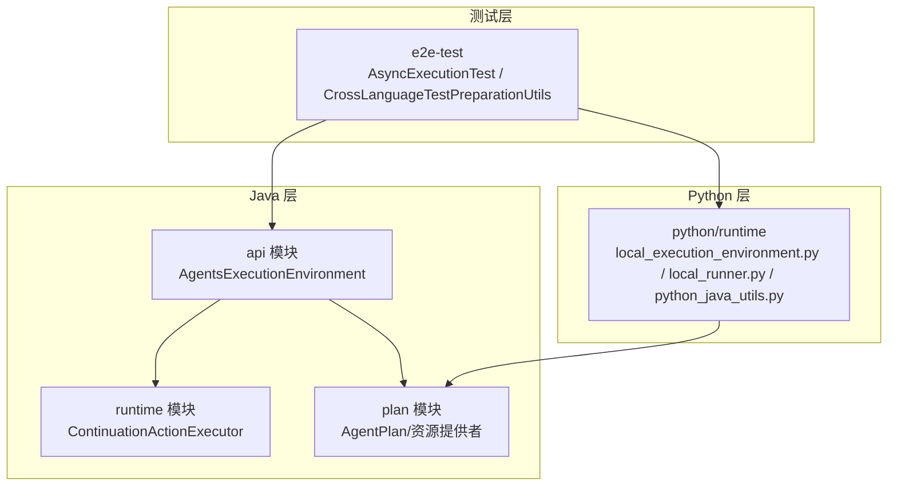
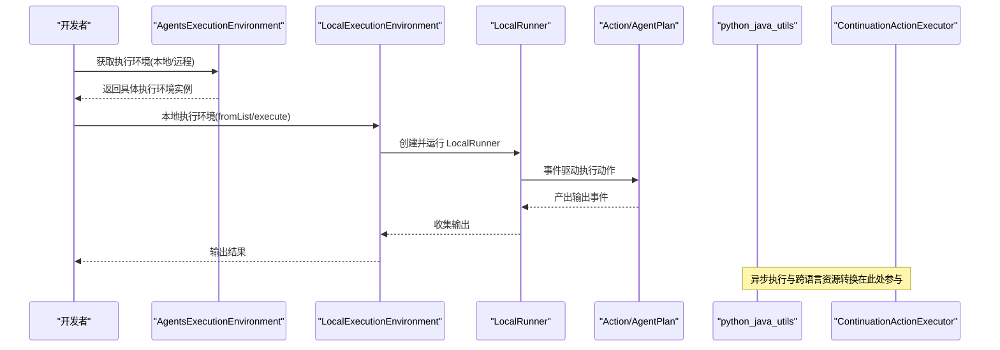
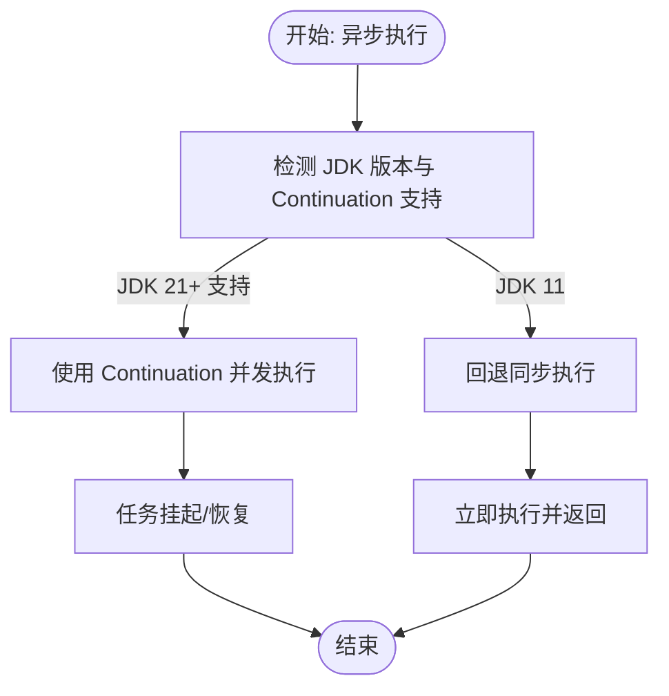
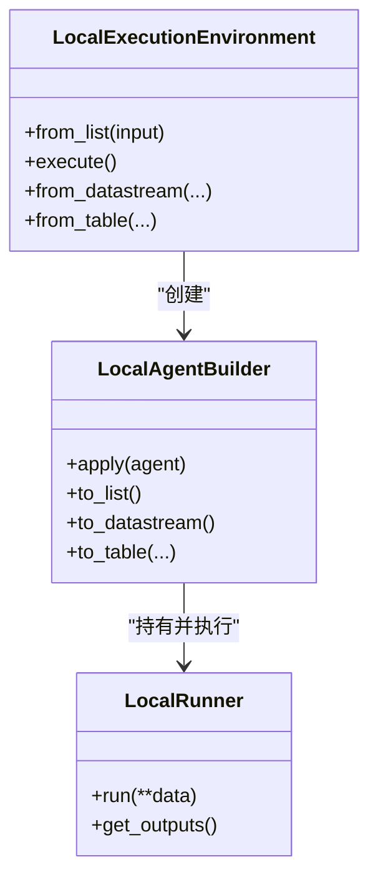
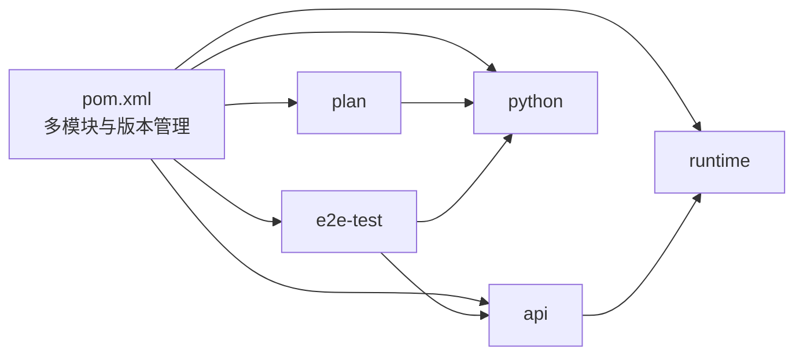

# 本地调试技巧

<cite>
**本文引用的文件**
- [README.md](file://README.md)
- [pom.xml](file://pom.xml)
- [AgentsExecutionEnvironment.java](file://api/src/main/java/org/apache/flink/agents/api/AgentsExecutionEnvironment.java)
- [LocalExecutionEnvironment.java](file://python/flink_agents/runtime/local_execution_environment.py)
- [AsyncExecutionTest.java](file://e2e-test/flink-agents-end-to-end-tests-integration/src/test/java/org/apache/flink/agents/integration/test/AsyncExecutionTest.java)
- [ContinuationActionExecutor.java](file://runtime/src/main/java/org/apache/flink/agents/runtime/async/ContinuationActionExecutor.java)
- [local_runner.py](file://python/flink_agents/runtime/local_runner.py)
- [python_java_utils.py](file://python/flink_agents/runtime/python_java_utils.py)
- [log4j2-test.properties](file://e2e-test/flink-agents-end-to-end-tests-integration/src/test/resources/log4j2-test.properties)
- [CrossLanguageTestPreparationUtils.java](file://e2e-test/flink-agents-end-to-end-tests-resource-cross-language/src/test/java/org/apache/flink/agents/resource/test/CrossLanguageTestPreparationUtils.java)
</cite>

## 目录
1. [简介](#简介)
2. [项目结构](#项目结构)
3. [核心组件](#核心组件)
4. [架构总览](#架构总览)
5. [详细组件分析](#详细组件分析)
6. [依赖关系分析](#依赖关系分析)
7. [性能考量](#性能考量)
8. [故障排查指南](#故障排查指南)
9. [结论](#结论)
10. [附录](#附录)

## 简介
本指南面向在本地调试 Apache Flink Agents 的开发者，覆盖 IDE 断点与调试配置（IntelliJ IDEA 与 Eclipse）、变量检查与监视表达式、调用栈与线程状态分析、本地集群与远程调试、跨语言（Java-Python）调试、内存与 GC 监控、常见问题定位与最佳实践。文档中的所有技术细节均基于仓库源码与测试用例进行提炼与可视化。

## 项目结构
Flink Agents 采用多模块 Maven 结构，核心模块包括：
- api：对外 API 与抽象执行环境
- runtime：运行时实现（含异步执行、事件日志、度量等）
- plan：代理计划序列化/反序列化与资源提供者
- python：Python 运行时与桥接工具（与 Java 资源互操作）
- e2e-test：端到端测试（包含异步执行、跨语言资源等）
- integrations：第三方集成（聊天模型、嵌入模型、向量库等）

下图展示与调试相关的关键模块与交互：

图表来源
- [AgentsExecutionEnvironment.java](file://api/src/main/java/org/apache/flink/agents/api/AgentsExecutionEnvironment.java#L68-L121)
- [ContinuationActionExecutor.java](file://runtime/src/main/java/org/apache/flink/agents/runtime/async/ContinuationActionExecutor.java#L28-L68)
- [LocalExecutionEnvironment.java](file://python/flink_agents/runtime/local_execution_environment.py#L92-L179)
- [local_runner.py](file://python/flink_agents/runtime/local_runner.py#L252-L356)
- [python_java_utils.py](file://python/flink_agents/runtime/python_java_utils.py#L48-L152)
- [AsyncExecutionTest.java](file://e2e-test/flink-agents-end-to-end-tests-integration/src/test/java/org/apache/flink/agents/integration/test/AsyncExecutionTest.java#L44-L96)
- [CrossLanguageTestPreparationUtils.java](file://e2e-test/flink-agents-end-to-end-tests-resource-cross-language/src/test/java/org/apache/flink/agents/resource/test/CrossLanguageTestPreparationUtils.java#L27-L81)

章节来源
- [pom.xml](file://pom.xml#L58-L67)

## 核心组件
- 执行环境工厂与选择
  - Java 侧通过工厂方法根据是否传入 Flink 环境选择本地或远程执行环境，便于本地开发与远端集群调试切换。
- 异步执行器
  - JDK 11 回退同步执行；JDK 21+ 可利用 Continuation API 实现真正的异步并发。
- 本地执行环境与运行器
  - Python 侧提供 LocalExecutionEnvironment 与 LocalRunner，支持本地串行调试与事件驱动流程验证。
- 跨语言桥接
  - Python 与 Java 资源对象相互转换、序列化/反序列化、方法调用桥接，支撑跨语言资源调试。

章节来源
- [AgentsExecutionEnvironment.java](file://api/src/main/java/org/apache/flink/agents/api/AgentsExecutionEnvironment.java#L68-L121)
- [ContinuationActionExecutor.java](file://runtime/src/main/java/org/apache/flink/agents/runtime/async/ContinuationActionExecutor.java#L28-L68)
- [LocalExecutionEnvironment.java](file://python/flink_agents/runtime/local_execution_environment.py#L92-L179)
- [local_runner.py](file://python/flink_agents/runtime/local_runner.py#L252-L356)
- [python_java_utils.py](file://python/flink_agents/runtime/python_java_utils.py#L48-L152)

## 架构总览
下图展示从输入到输出的本地与远程执行路径，以及异步执行与跨语言资源的关键节点。

图表来源
- [AgentsExecutionEnvironment.java](file://api/src/main/java/org/apache/flink/agents/api/AgentsExecutionEnvironment.java#L68-L121)
- [LocalExecutionEnvironment.java](file://python/flink_agents/runtime/local_execution_environment.py#L92-L179)
- [local_runner.py](file://python/flink_agents/runtime/local_runner.py#L286-L345)
- [python_java_utils.py](file://python/flink_agents/runtime/python_java_utils.py#L78-L152)
- [ContinuationActionExecutor.java](file://runtime/src/main/java/org/apache/flink/agents/runtime/async/ContinuationActionExecutor.java#L40-L57)

## 详细组件分析

### 组件一：执行环境与本地/远程切换
- 工厂方法依据是否传入 Flink 环境决定返回本地或远程执行环境，便于在本地快速验证、在集群中验证真实流处理行为。
- 本地执行环境不支持 DataStream/Table 输入，仅支持列表输入与本地执行；远程执行环境支持与 Flink 数据源对接。

调试要点
- 在工厂方法入口设置断点，观察入参与返回类型，确认当前处于本地还是远程执行路径。
- 在本地执行环境中对 fromList/execute 设置断点，验证输入数据与输出收集流程。

章节来源
- [AgentsExecutionEnvironment.java](file://api/src/main/java/org/apache/flink/agents/api/AgentsExecutionEnvironment.java#L68-L121)
- [LocalExecutionEnvironment.java](file://python/flink_agents/runtime/local_execution_environment.py#L107-L156)

### 组件二：异步执行与并发验证
- JDK 11 版本的异步执行器回退为同步执行；JDK 21+ 可通过 Continuation API 实现并发。
- 测试用例覆盖单次异步、多次链式异步、多键并发等场景，并通过时间戳重叠判断并发性。

调试要点
- 在 ContinuationActionExecutor 的 executeAsync/executeAction 设置断点，观察 JDK 版本分支与执行路径。
- 在 AsyncExecutionTest 中针对不同用例设置断点，验证异步链路与并发行为。
- 使用日志级别调整（见“故障排查”）以增强异步执行可见性。

图表来源
- [ContinuationActionExecutor.java](file://runtime/src/main/java/org/apache/flink/agents/runtime/async/ContinuationActionExecutor.java#L28-L68)
- [AsyncExecutionTest.java](file://e2e-test/flink-agents-end-to-end-tests-integration/src/test/java/org/apache/flink/agents/integration/test/AsyncExecutionTest.java#L219-L334)

章节来源
- [ContinuationActionExecutor.java](file://runtime/src/main/java/org/apache/flink/agents/runtime/async/ContinuationActionExecutor.java#L28-L68)
- [AsyncExecutionTest.java](file://e2e-test/flink-agents-end-to-end-tests-integration/src/test/java/org/apache/flink/agents/integration/test/AsyncExecutionTest.java#L44-L96)

### 组件三：本地执行器与事件驱动流程
- LocalRunner 基于事件队列驱动动作执行，支持协程推进与异常捕获，适合本地串行调试。
- LocalExecutionEnvironment 将输入列表包装为 LocalAgentBuilder，再由 LocalRunner 驱动执行。

调试要点
- 在 LocalRunner.run 的事件循环处设置断点，观察事件类型、动作名称与输出事件生成。
- 在协程推进 send(None) 处设置断点，定位异步动作的完成时机。
- 使用输出收集器 to_list() 验证本地执行结果。

图表来源
- [LocalExecutionEnvironment.java](file://python/flink_agents/runtime/local_execution_environment.py#L92-L179)
- [local_runner.py](file://python/flink_agents/runtime/local_runner.py#L252-L356)

章节来源
- [LocalExecutionEnvironment.java](file://python/flink_agents/runtime/local_execution_environment.py#L92-L179)
- [local_runner.py](file://python/flink_agents/runtime/local_runner.py#L286-L345)

### 组件四：跨语言资源桥接与调试
- Python 与 Java 资源对象通过动态导入与映射进行转换，支持工具、提示词、向量库等资源的跨语言使用。
- 提供 wrap/unwrap、序列化/反序列化、方法调用桥接等工具函数。

调试要点
- 在资源创建与转换函数（如 from_java_resource/from_java_tool/from_java_prompt）设置断点，验证类型映射与参数传递。
- 在 Python 侧启动外部进程（如 MCP 服务器）时，结合日志与进程状态检查，确保资源可用性。

章节来源
- [python_java_utils.py](file://python/flink_agents/runtime/python_java_utils.py#L78-L152)
- [CrossLanguageTestPreparationUtils.java](file://e2e-test/flink-agents-end-to-end-tests-resource-cross-language/src/test/java/org/apache/flink/agents/resource/test/CrossLanguageTestPreparationUtils.java#L27-L81)

## 依赖关系分析
- Java 与 Python 的耦合点主要集中在资源桥接与事件序列化，通过统一的资源类型与序列化协议降低耦合。
- 异步执行器在不同 JDK 版本下的行为差异通过条件分支体现，测试用例覆盖了关键分支。

图表来源
- [pom.xml](file://pom.xml#L58-L67)

章节来源
- [pom.xml](file://pom.xml#L58-L67)

## 性能考量
- 异步并发：在 JDK 21+ 上启用 Continuation 并发可显著提升吞吐；在 JDK 11 下需关注同步阻塞带来的延迟。
- 本地调试建议：使用单并行度验证逻辑正确性，再逐步提高并行度观察并发行为。
- 日志与指标：通过测试日志配置与事件日志字符串构建，辅助定位性能瓶颈与异常路径。

## 故障排查指南
常见问题与定位步骤
- 异步执行未并发
  - 确认 JDK 版本与 Continuation 支持状态；参考异步测试用例的时间戳重叠判断。
  - 在 ContinuationActionExecutor 的执行路径设置断点，观察执行分支。
- 资源加载失败
  - 检查资源类型映射与动态导入路径；在资源创建与转换函数断点验证。
  - 对跨语言资源（如 MCP 服务器），确认外部进程启动与健康状态。
- 本地执行无输出
  - 在 LocalRunner 的事件循环与输出收集处设置断点，确认事件队列与输出生成。
- 日志过少或过多
  - 调整测试日志级别配置，按需开启 INFO 或更细粒度日志。

章节来源
- [AsyncExecutionTest.java](file://e2e-test/flink-agents-end-to-end-tests-integration/src/test/java/org/apache/flink/agents/integration/test/AsyncExecutionTest.java#L219-L334)
- [ContinuationActionExecutor.java](file://runtime/src/main/java/org/apache/flink/agents/runtime/async/ContinuationActionExecutor.java#L66-L68)
- [python_java_utils.py](file://python/flink_agents/runtime/python_java_utils.py#L78-L152)
- [CrossLanguageTestPreparationUtils.java](file://e2e-test/flink-agents-end-to-end-tests-resource-cross-language/src/test/java/org/apache/flink/agents/resource/test/CrossLanguageTestPreparationUtils.java#L49-L79)
- [local_runner.py](file://python/flink_agents/runtime/local_runner.py#L324-L345)
- [log4j2-test.properties](file://e2e-test/flink-agents-end-to-end-tests-integration/src/test/resources/log4j2-test.properties#L19-L29)

## 结论
通过在工厂方法、本地执行器、异步执行器与跨语言桥接等关键路径设置断点，并结合测试用例与日志配置，可以高效地定位与解决本地调试中的问题。建议优先在本地验证逻辑正确性，再在集群中验证并发与资源可用性。

## 附录
- IDE 调试建议
  - IntelliJ IDEA/Eclipse 均可设置断点于上述关键方法与事件循环处；为避免控制台刷屏，可在测试日志配置中临时提升日志级别。
- 跨语言调试
  - 在 Python 侧启动外部服务（如 MCP 服务器）后，先在 Java 侧通过资源适配器进行最小化调用验证，再逐步扩展到完整流程。
- 内存与 GC 监控
  - 在本地调试阶段可结合 JVM 参数与 IDE 的内存视图观察堆内存变化；在集群中可通过 Flink Web UI 查看内存与 GC 指标。