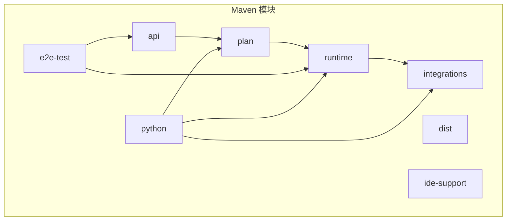
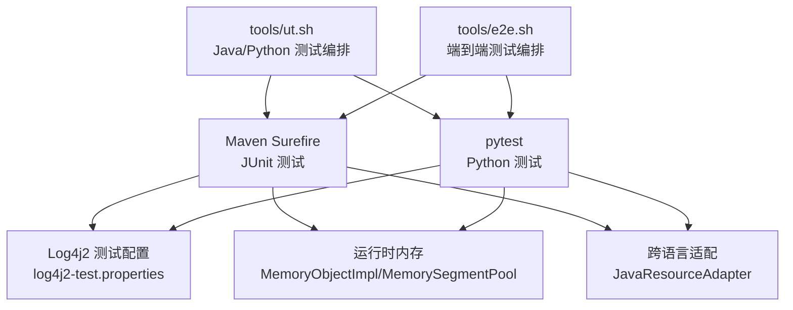
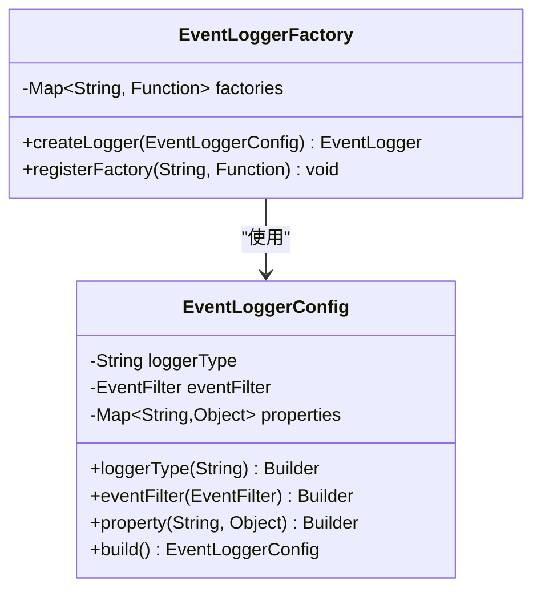
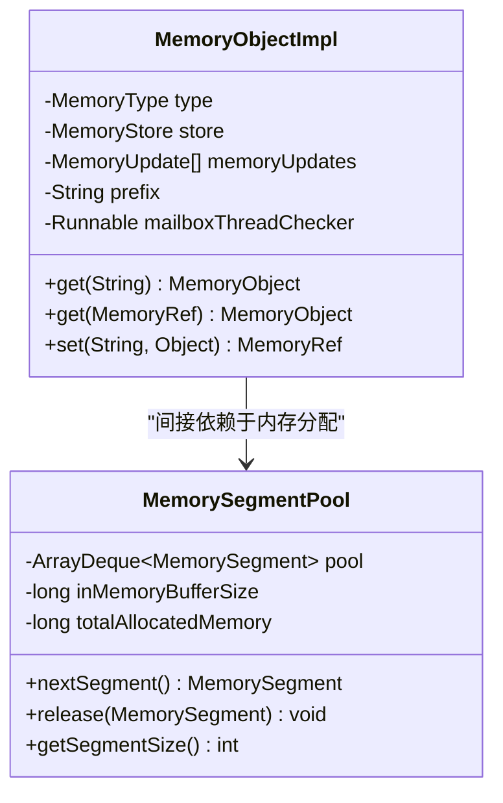
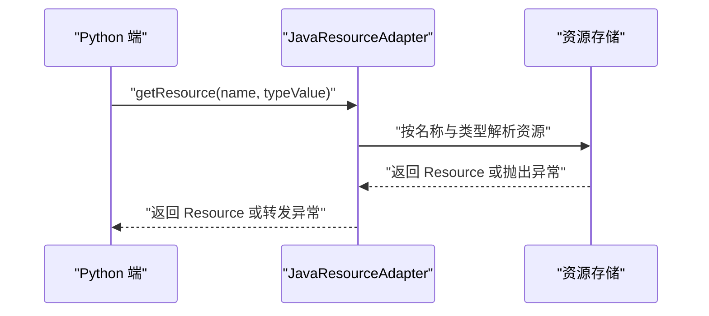
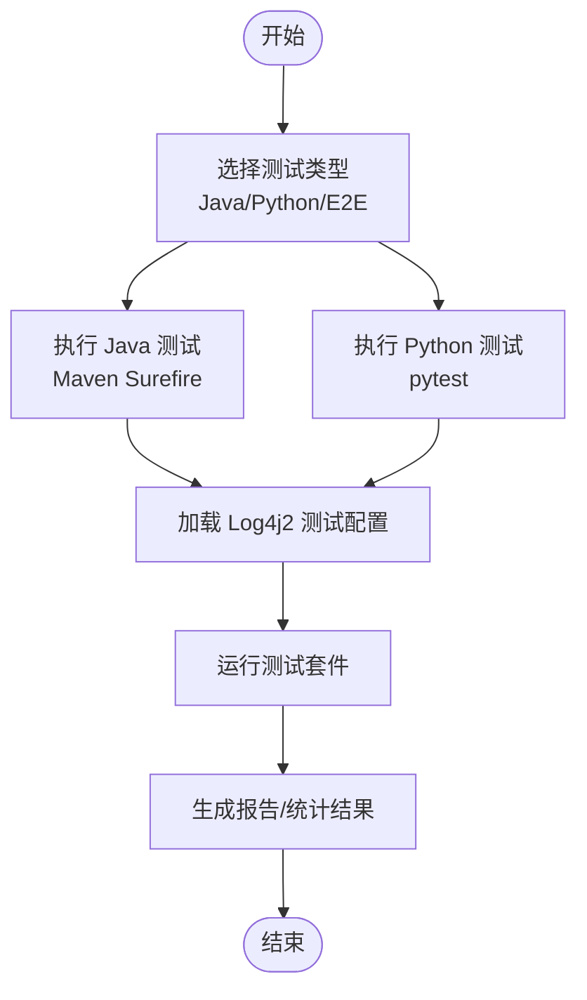
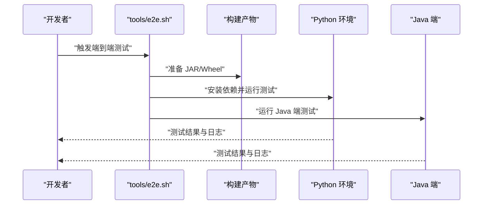
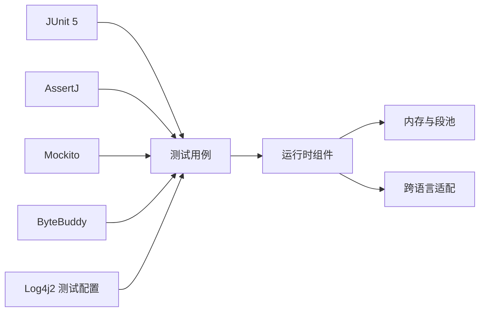

# 调试与测试指南

<cite>
**本文引用的文件**
- [README.md](file://README.md)
- [pom.xml](file://pom.xml)
- [tools/ut.sh](file://tools/ut.sh)
- [tools/e2e.sh](file://tools/e2e.sh)
- [e2e-test/flink-agents-end-to-end-tests-integration/src/test/resources/log4j2-test.properties](file://e2e-test/flink-agents-end-to-end-tests-integration/src/test/resources/log4j2-test.properties)
- [runtime/src/test/resources/log4j2-test.properties](file://runtime/src/test/resources/log4j2-test.properties)
- [api/src/main/java/org/apache/flink/agents/api/logger/EventLoggerConfig.java](file://api/src/main/java/org/apache/flink/agents/api/logger/EventLoggerConfig.java)
- [api/src/main/java/org/apache/flink/agents/api/logger/EventLoggerFactory.java](file://api/src/main/java/org/apache/flink/agents/api/logger/EventLoggerFactory.java)
- [api/src/test/java/org/apache/flink/agents/api/agents/ReActAgentTest.java](file://api/src/test/java/org/apache/flink/agents/api/agents/ReActAgentTest.java)
- [e2e-test/flink-agents-end-to-end-tests-integration/src/test/java/org/apache/flink/agents/integration/test/ReActAgentTest.java](file://e2e-test/flink-agents-end-to-end-tests-integration/src/test/java/org/apache/flink/agents/integration/test/ReActAgentTest.java)
- [python/flink_agents/api/tests/test_decorators.py](file://python/flink_agents/api/tests/test_decorators.py)
- [runtime/src/test/java/org/apache/flink/agents/runtime/memory/MemoryObjectTest.java](file://runtime/src/test/java/org/apache/flink/agents/runtime/memory/MemoryObjectTest.java)
- [runtime/src/test/java/org/apache/flink/agents/runtime/memory/MemoryRefTest.java](file://runtime/src/test/java/org/apache/flink/agents/runtime/memory/MemoryRefTest.java)
- [runtime/src/main/java/org/apache/flink/agents/runtime/memory/MemoryObjectImpl.java](file://runtime/src/main/java/org/apache/flink/agents/runtime/memory/MemoryObjectImpl.java)
- [runtime/src/main/java/org/apache/flink/agents/runtime/memory/MemorySegmentPool.java](file://runtime/src/main/java/org/apache/flink/agents/runtime/memory/MemorySegmentPool.java)
- [runtime/src/main/java/org/apache/flink/agents/runtime/python/utils/JavaResourceAdapter.java](file://runtime/src/main/java/org/apache/flink/agents/runtime/python/utils/JavaResourceAdapter.java)
- [e2e-test/flink-agents-end-to-end-tests-resource-cross-language/src/test/java/org/apache/flink/agents/resource/test/MCPCrossLanguageAgent.java](file://e2e-test/flink-agents-end-to-end-tests-resource-cross-language/src/test/java/org/apache/flink/agents/resource/test/MCPCrossLanguageAgent.java)
- [e2e-test/flink-agents-end-to-end-tests-resource-cross-language/src/test/java/org/apache/flink/agents/resource/test/CrossLanguageTestPreparationUtils.java](file://e2e-test/flink-agents-end-to-end-tests-resource-cross-language/src/test/java/org/apache/flink/agents/resource/test/CrossLanguageTestPreparationUtils.java)
</cite>

## 目录
1. [简介](#简介)
2. [项目结构](#项目结构)
3. [核心组件](#核心组件)
4. [架构总览](#架构总览)
5. [详细组件分析](#详细组件分析)
6. [依赖关系分析](#依赖关系分析)
7. [性能考量](#性能考量)
8. [故障排查指南](#故障排查指南)
9. [结论](#结论)
10. [附录](#附录)

## 简介
本指南面向 Apache Flink Agents 项目的开发者，提供系统化的调试与测试实践，覆盖本地断点调试、日志配置、单元测试与集成/端到端测试、性能分析与内存泄漏检测、跨语言（Java-Python）调试技巧、测试覆盖率与质量度量建议，以及常见问题诊断与解决方案。内容基于仓库现有实现与脚本进行提炼，确保可操作性与可追溯性。

## 项目结构
该项目采用多模块 Maven 结构，主要模块包括：
- api：对外 API 与注解、事件、资源、向量库、嵌入模型、聊天模型等抽象与实现
- plan：代理计划序列化/反序列化、资源提供者、函数桥接等
- runtime：运行时实现（含异步执行、内存对象、日志、指标、Python 互操作等）
- integrations：第三方集成（如聊天模型、嵌入模型、MCP、向量库等）
- e2e-test：集成与端到端测试模块
- python：Python 包与测试
- tools：构建与测试脚本

图表来源
- [pom.xml](file://pom.xml#L58-L67)

章节来源
- [pom.xml](file://pom.xml#L1-L319)

## 核心组件
- 日志与事件记录：通过统一的事件日志配置与工厂创建不同类型的日志器，便于在不同模块中一致地输出调试信息。
- 运行时内存管理：内存对象与段池实现，支持短/长期记忆、并发访问与容量控制，是定位内存相关问题的关键。
- 跨语言适配：Java 侧对 Python 资源的适配器，支撑 Java 与 Python 资源的互操作，是跨语言调试的核心入口。
- 测试与脚本：提供 Java 与 Python 双栈测试脚本，支持按版本选择与端到端测试编排。

章节来源
- [api/src/main/java/org/apache/flink/agents/api/logger/EventLoggerConfig.java](file://api/src/main/java/org/apache/flink/agents/api/logger/EventLoggerConfig.java#L45-L136)
- [api/src/main/java/org/apache/flink/agents/api/logger/EventLoggerFactory.java](file://api/src/main/java/org/apache/flink/agents/api/logger/EventLoggerFactory.java#L70-L102)
- [runtime/src/main/java/org/apache/flink/agents/runtime/memory/MemoryObjectImpl.java](file://runtime/src/main/java/org/apache/flink/agents/runtime/memory/MemoryObjectImpl.java#L40-L86)
- [runtime/src/main/java/org/apache/flink/agents/runtime/memory/MemorySegmentPool.java](file://runtime/src/main/java/org/apache/flink/agents/runtime/memory/MemorySegmentPool.java#L39-L78)
- [runtime/src/main/java/org/apache/flink/agents/runtime/python/utils/JavaResourceAdapter.java](file://runtime/src/main/java/org/apache/flink/agents/runtime/python/utils/JavaResourceAdapter.java#L34-L56)

## 架构总览
下图展示测试与调试相关的高层交互：测试脚本驱动 Maven/pytest 执行，JUnit/Pytest 加载 Log4j2 测试配置，运行时组件负责事件记录、内存与跨语言资源交互。

图表来源
- [tools/ut.sh](file://tools/ut.sh#L122-L196)
- [tools/ut.sh](file://tools/ut.sh#L198-L284)
- [tools/e2e.sh](file://tools/e2e.sh#L20-L86)
- [e2e-test/flink-agents-end-to-end-tests-integration/src/test/resources/log4j2-test.properties](file://e2e-test/flink-agents-end-to-end-tests-integration/src/test/resources/log4j2-test.properties#L19-L28)
- [runtime/src/test/resources/log4j2-test.properties](file://runtime/src/test/resources/log4j2-test.properties#L19-L28)
- [runtime/src/main/java/org/apache/flink/agents/runtime/memory/MemoryObjectImpl.java](file://runtime/src/main/java/org/apache/flink/agents/runtime/memory/MemoryObjectImpl.java#L40-L86)
- [runtime/src/main/java/org/apache/flink/agents/runtime/memory/MemorySegmentPool.java](file://runtime/src/main/java/org/apache/flink/agents/runtime/memory/MemorySegmentPool.java#L39-L78)
- [runtime/src/main/java/org/apache/flink/agents/runtime/python/utils/JavaResourceAdapter.java](file://runtime/src/main/java/org/apache/flink/agents/runtime/python/utils/JavaResourceAdapter.java#L34-L56)

## 详细组件分析

### 日志与事件记录（EventLogger）
- 统一配置：通过配置类与构建器设置日志类型、事件过滤器与属性，支持扩展多种日志后端。
- 工厂创建：注册内置工厂，按类型查找并创建日志器实例，便于集中管理与替换。

图表来源
- [api/src/main/java/org/apache/flink/agents/api/logger/EventLoggerConfig.java](file://api/src/main/java/org/apache/flink/agents/api/logger/EventLoggerConfig.java#L45-L136)
- [api/src/main/java/org/apache/flink/agents/api/logger/EventLoggerFactory.java](file://api/src/main/java/org/apache/flink/agents/api/logger/EventLoggerFactory.java#L70-L102)

章节来源
- [api/src/main/java/org/apache/flink/agents/api/logger/EventLoggerConfig.java](file://api/src/main/java/org/apache/flink/agents/api/logger/EventLoggerConfig.java#L45-L136)
- [api/src/main/java/org/apache/flink/agents/api/logger/EventLoggerFactory.java](file://api/src/main/java/org/apache/flink/agents/api/logger/EventLoggerFactory.java#L70-L102)

### 运行时内存（MemoryObject 与 MemorySegmentPool）
- 内存对象：支持路径式访问、前缀隔离与更新追踪，便于定位状态变更与并发问题。
- 段池：按容量限制分配与回收内存段，避免无界增长；释放策略与阈值控制是内存泄漏检测重点。

图表来源
- [runtime/src/main/java/org/apache/flink/agents/runtime/memory/MemoryObjectImpl.java](file://runtime/src/main/java/org/apache/flink/agents/runtime/memory/MemoryObjectImpl.java#L40-L86)
- [runtime/src/main/java/org/apache/flink/agents/runtime/memory/MemorySegmentPool.java](file://runtime/src/main/java/org/apache/flink/agents/runtime/memory/MemorySegmentPool.java#L39-L78)

章节来源
- [runtime/src/main/java/org/apache/flink/agents/runtime/memory/MemoryObjectImpl.java](file://runtime/src/main/java/org/apache/flink/agents/runtime/memory/MemoryObjectImpl.java#L40-L86)
- [runtime/src/main/java/org/apache/flink/agents/runtime/memory/MemorySegmentPool.java](file://runtime/src/main/java/org/apache/flink/agents/runtime/memory/MemorySegmentPool.java#L39-L78)

### 跨语言资源适配（JavaResourceAdapter）
- 作用：在 Python 环境中由 Java 侧暴露资源查询能力，便于端到端测试与实际运行时场景下的资源共享。
- 关键点：资源名称与类型映射、异常传播与错误回传，便于定位资源解析失败或类型不匹配问题。

图表来源
- [runtime/src/main/java/org/apache/flink/agents/runtime/python/utils/JavaResourceAdapter.java](file://runtime/src/main/java/org/apache/flink/agents/runtime/python/utils/JavaResourceAdapter.java#L34-L56)

章节来源
- [runtime/src/main/java/org/apache/flink/agents/runtime/python/utils/JavaResourceAdapter.java](file://runtime/src/main/java/org/apache/flink/agents/runtime/python/utils/JavaResourceAdapter.java#L34-L56)

### 单元测试与执行（JUnit 与 pytest）
- Java 测试：通过 Maven Surefire 插件执行，支持并行与模块化测试；测试日志默认关闭，必要时可临时提升级别。
- Python 测试：通过 pytest 执行，支持按关键字筛选（排除端到端测试），并可结合 uv/requirements 管理依赖。

图表来源
- [tools/ut.sh](file://tools/ut.sh#L122-L196)
- [tools/ut.sh](file://tools/ut.sh#L198-L284)
- [e2e-test/flink-agents-end-to-end-tests-integration/src/test/resources/log4j2-test.properties](file://e2e-test/flink-agents-end-to-end-tests-integration/src/test/resources/log4j2-test.properties#L19-L28)
- [runtime/src/test/resources/log4j2-test.properties](file://runtime/src/test/resources/log4j2-test.properties#L19-L28)

章节来源
- [tools/ut.sh](file://tools/ut.sh#L122-L196)
- [tools/ut.sh](file://tools/ut.sh#L198-L284)
- [e2e-test/flink-agents-end-to-end-tests-integration/src/test/resources/log4j2-test.properties](file://e2e-test/flink-agents-end-to-end-tests-integration/src/test/resources/log4j2-test.properties#L19-L28)
- [runtime/src/test/resources/log4j2-test.properties](file://runtime/src/test/resources/log4j2-test.properties#L19-L28)

### 集成与端到端测试（E2E）
- 编排脚本：提供 Bash 脚本用于编译、准备环境、运行跨语言与兼容性测试，并统计通过率。
- 测试数据与资源：端到端测试包含输入数据、期望输出与模型准备脚本，便于复现与验证。
- 调试要点：通过日志级别提升与断点配合，定位资源准备、模型拉取、跨语言通信与计划兼容性问题。

图表来源
- [tools/e2e.sh](file://tools/e2e.sh#L20-L86)
- [tools/e2e.sh](file://tools/e2e.sh#L149-L154)

章节来源
- [tools/e2e.sh](file://tools/e2e.sh#L20-L86)
- [tools/e2e.sh](file://tools/e2e.sh#L149-L154)

## 依赖关系分析
- 测试框架与断言：JUnit 5、AssertJ、Mockito、ByteBuddy 提供测试基础能力。
- 日志系统：Log4j2 测试配置集中于各模块 test-resources，根日志器默认关闭，避免构建日志过载。
- 并发与异步：运行时包含异步执行与邮箱线程检查逻辑，测试时需关注线程切换与状态一致性。

图表来源
- [pom.xml](file://pom.xml#L82-L107)
- [e2e-test/flink-agents-end-to-end-tests-integration/src/test/resources/log4j2-test.properties](file://e2e-test/flink-agents-end-to-end-tests-integration/src/test/resources/log4j2-test.properties#L19-L28)
- [runtime/src/test/resources/log4j2-test.properties](file://runtime/src/test/resources/log4j2-test.properties#L19-L28)

章节来源
- [pom.xml](file://pom.xml#L82-L107)
- [e2e-test/flink-agents-end-to-end-tests-integration/src/test/resources/log4j2-test.properties](file://e2e-test/flink-agents-end-to-end-tests-integration/src/test/resources/log4j2-test.properties#L19-L28)
- [runtime/src/test/resources/log4j2-test.properties](file://runtime/src/test/resources/log4j2-test.properties#L19-L28)

## 性能考量
- 日志级别：测试配置默认关闭根日志器，避免噪声；在定位性能瓶颈时可临时提升至合适级别。
- 内存分配：段池容量与释放策略直接影响内存占用与 GC 压力；建议在长运行任务中监控已分配内存与池大小。
- 并发与异步：异步执行与邮箱线程检查可能引入上下文切换开销；测试中可通过降低并行度或禁用部分异步路径进行对比。

章节来源
- [runtime/src/main/java/org/apache/flink/agents/runtime/memory/MemorySegmentPool.java](file://runtime/src/main/java/org/apache/flink/agents/runtime/memory/MemorySegmentPool.java#L39-L78)
- [runtime/src/test/resources/log4j2-test.properties](file://runtime/src/test/resources/log4j2-test.properties#L19-L28)

## 故障排查指南

### 日志与日志级别
- 测试日志配置：两处测试配置文件均将根日志器级别设为关闭，便于减少构建噪音；需要调试时可临时调整为更高等级。
- 建议做法：在本地调试时将日志级别临时提升到合适的粒度，结合断点观察事件流与资源解析过程。

章节来源
- [e2e-test/flink-agents-end-to-end-tests-integration/src/test/resources/log4j2-test.properties](file://e2e-test/flink-agents-end-to-end-tests-integration/src/test/resources/log4j2-test.properties#L19-L28)
- [runtime/src/test/resources/log4j2-test.properties](file://runtime/src/test/resources/log4j2-test.properties#L19-L28)

### 断点与变量检查
- Java：在单元测试与端到端测试入口设置断点，结合日志级别提升，逐步跟踪资源注册、事件分发与异步执行。
- Python：在 pytest 中设置断点，检查装饰器行为、事件监听与资源跨语言传递是否符合预期。

章节来源
- [api/src/test/java/org/apache/flink/agents/api/agents/ReActAgentTest.java](file://api/src/test/java/org/apache/flink/agents/api/agents/ReActAgentTest.java#L29-L44)
- [python/flink_agents/api/tests/test_decorators.py](file://python/flink_agents/api/tests/test_decorators.py#L27-L64)

### 调用栈分析
- 异步执行：在异步路径中出现异常时，优先查看异步执行器与邮箱线程检查的调用栈，确认线程切换与状态一致性。
- 跨语言：当资源解析失败时，从适配器入口开始向上回溯，定位类型映射与异常传播链路。

章节来源
- [runtime/src/test/java/org/apache/flink/agents/runtime/memory/MemoryObjectTest.java](file://runtime/src/test/java/org/apache/flink/agents/runtime/memory/MemoryObjectTest.java#L31-L70)
- [runtime/src/main/java/org/apache/flink/agents/runtime/python/utils/JavaResourceAdapter.java](file://runtime/src/main/java/org/apache/flink/agents/runtime/python/utils/JavaResourceAdapter.java#L34-L56)

### 内存与资源问题
- 内存泄漏检测：关注段池的总分配内存与阈值比较，若持续增长且无法回收，检查是否存在未释放的段或过度缓存。
- 资源生命周期：在跨语言测试中，确认资源在 Python 端正确注册并在 Java 端可解析，避免悬挂引用。

章节来源
- [runtime/src/main/java/org/apache/flink/agents/runtime/memory/MemorySegmentPool.java](file://runtime/src/main/java/org/apache/flink/agents/runtime/memory/MemorySegmentPool.java#L39-L78)
- [e2e-test/flink-agents-end-to-end-tests-resource-cross-language/src/test/java/org/apache/flink/agents/resource/test/MCPCrossLanguageAgent.java](file://e2e-test/flink-agents-end-to-end-tests-resource-cross-language/src/test/java/org/apache/flink/agents/resource/test/MCPCrossLanguageAgent.java#L74-L84)

### 常见问题与解决方案
- ReAct 代理输出模式不匹配：当 LLM 输出与期望模式不一致导致结果为空时，检查输出模式与提示词设计。
- 资源准备失败：在端到端测试前确保模型已拉取并可达，否则测试会跳过或失败。
- 跨语言资源不可用：核对资源名称、类型值与适配器映射，确保异常信息被正确回传。

章节来源
- [e2e-test/flink-agents-end-to-end-tests-integration/src/test/java/org/apache/flink/agents/integration/test/ReActAgentTest.java](file://e2e-test/flink-agents-end-to-end-tests-integration/src/test/java/org/apache/flink/agents/integration/test/ReActAgentTest.java#L182-L188)
- [e2e-test/flink-agents-end-to-end-tests-resource-cross-language/src/test/java/org/apache/flink/agents/resource/test/CrossLanguageTestPreparationUtils.java](file://e2e-test/flink-agents-end-to-end-tests-resource-cross-language/src/test/java/org/apache/flink/agents/resource/test/CrossLanguageTestPreparationUtils.java#L27-L29)

## 结论
本指南提供了从日志配置、断点调试、内存与资源问题到跨语言互操作的系统化调试与测试方法。建议在日常开发中：
- 使用测试脚本快速执行双栈测试；
- 在定位问题时临时提升日志级别并配合断点；
- 关注内存与资源生命周期，利用段池与内存对象的机制进行问题归因；
- 在端到端测试中完善输入与期望输出，确保可复现与可回归。

## 附录

### 本地调试最佳实践
- 设置断点：在关键流程（资源注册、事件处理、异步执行、跨语言适配）入口设置断点。
- 变量检查：重点关注资源描述符、事件过滤器、内存对象路径与更新列表。
- 调用栈：在异常与异步路径中，优先查看线程切换与状态一致性。

### 测试执行与覆盖率
- 执行方式：通过测试脚本分别运行 Java 与 Python 测试，支持按版本选择与端到端测试。
- 覆盖率：建议在本地与 CI 中结合工具收集覆盖率报告，聚焦高风险路径（资源解析、事件分发、内存管理）。

章节来源
- [tools/ut.sh](file://tools/ut.sh#L122-L196)
- [tools/ut.sh](file://tools/ut.sh#L198-L284)
- [tools/e2e.sh](file://tools/e2e.sh#L20-L86)