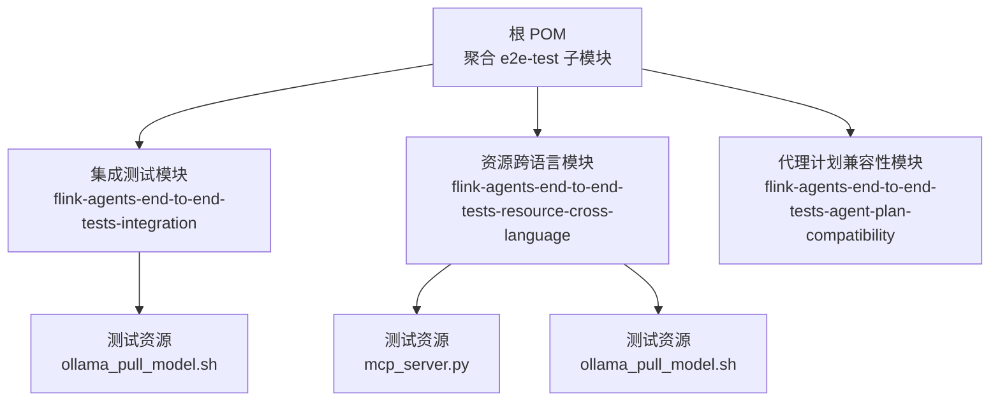
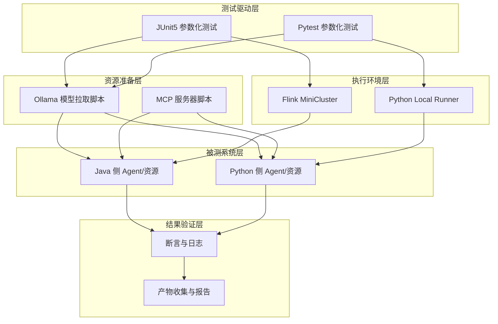
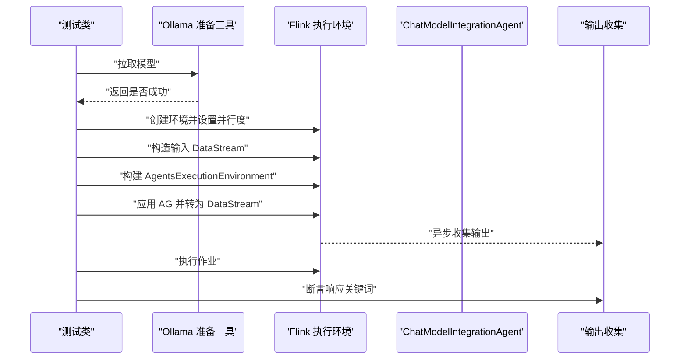
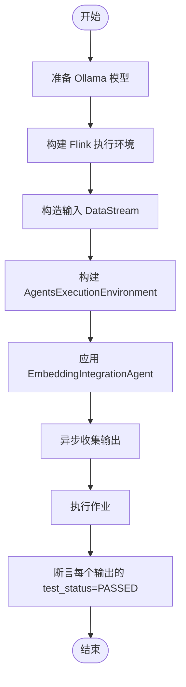
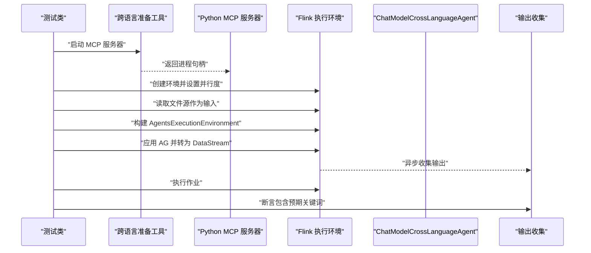
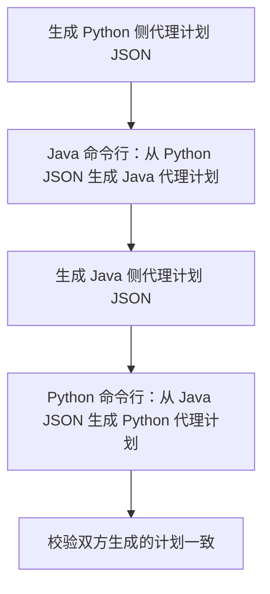
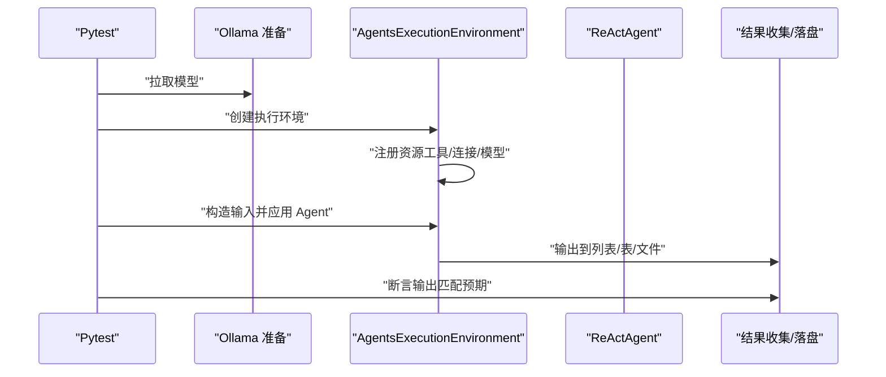
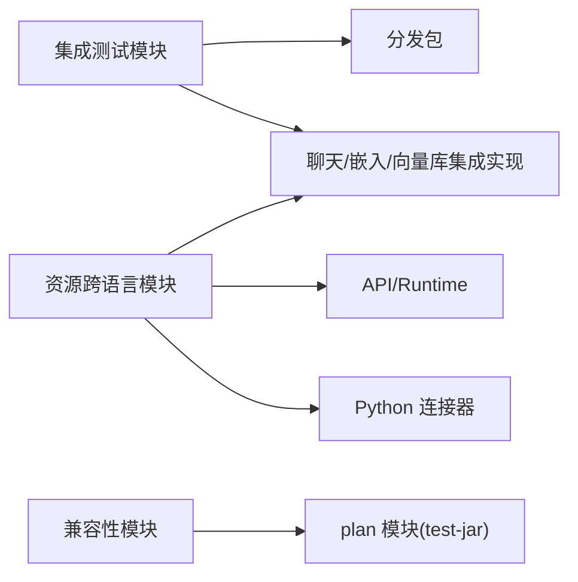

# 集成测试与端到端测试

<cite>
**本文引用的文件**
- [e2e-test/pom.xml](file://e2e-test/pom.xml)
- [e2e-test/flink-agents-end-to-end-tests-integration/pom.xml](file://e2e-test/flink-agents-end-to-end-tests-integration/pom.xml)
- [e2e-test/flink-agents-end-to-end-tests-resource-cross-language/pom.xml](file://e2e-test/flink-agents-end-to-end-tests-resource-cross-language/pom.xml)
- [e2e-test/flink-agents-end-to-end-tests-agent-plan-compatibility/pom.xml](file://e2e-test/flink-agents-end-to-end-tests-agent-plan-compatibility/pom.xml)
- [e2e-test/flink-agents-end-to-end-tests-integration/src/test/java/org/apache/flink/agents/integration/test/OllamaPreparationUtils.java](file://e2e-test/flink-agents-end-to-end-tests-integration/src/test/java/org/apache/flink/agents/integration/test/OllamaPreparationUtils.java)
- [e2e-test/flink-agents-end-to-end-tests-integration/src/test/java/org/apache/flink/agents/integration/test/ChatModelIntegrationTest.java](file://e2e-test/flink-agents-end-to-end-tests-integration/src/test/java/org/apache/flink/agents/integration/test/ChatModelIntegrationTest.java)
- [e2e-test/flink-agents-end-to-end-tests-integration/src/test/java/org/apache/flink/agents/integration/test/EmbeddingIntegrationTest.java](file://e2e-test/flink-agents-end-to-end-tests-integration/src/test/java/org/apache/flink/agents/integration/test/EmbeddingIntegrationTest.java)
- [e2e-test/flink-agents-end-to-end-tests-integration/src/test/resources/ollama_pull_model.sh](file://e2e-test/flink-agents-end-to-end-tests-integration/src/test/resources/ollama_pull_model.sh)
- [e2e-test/flink-agents-end-to-end-tests-resource-cross-language/src/test/java/org/apache/flink/agents/resource/test/CrossLanguageTestPreparationUtils.java](file://e2e-test/flink-agents-end-to-end-tests-resource-cross-language/src/test/java/org/apache/flink/agents/resource/test/CrossLanguageTestPreparationUtils.java)
- [e2e-test/flink-agents-end-to-end-tests-resource-cross-language/src/test/resources/mcp_server.py](file://e2e-test/flink-agents-end-to-end-tests-resource-cross-language/src/test/resources/mcp_server.py)
- [e2e-test/test-scripts/test_agent_plan_compatibility.sh](file://e2e-test/test-scripts/test_agent_plan_compatibility.sh)
- [e2e-test/test-scripts/test_resource_cross_language.sh](file://e2e-test/test-scripts/test_resource_cross_language.sh)
- [tools/start_ollama_server.sh](file://tools/start_ollama_server.sh)
- [python/flink_agents/e2e_tests/e2e_tests_integration/chat_model_integration_test.py](file://python/flink_agents/e2e_tests/e2e_tests_integration/chat_model_integration_test.py)
- [python/flink_agents/e2e_tests/e2e_tests_integration/react_agent_test.py](file://python/flink_agents/e2e_tests/e2e_tests_integration/react_agent_test.py)
- [python/flink_agents/e2e_tests/e2e_tests_resource_cross_language/chat_model_cross_language_test.py](file://python/flink_agents/e2e_tests/e2e_tests_resource_cross_language/chat_model_cross_language_test.py)
</cite>

## 目录
1. [引言](#引言)
2. [项目结构](#项目结构)
3. [核心组件](#核心组件)
4. [架构总览](#架构总览)
5. [详细组件分析](#详细组件分析)
6. [依赖关系分析](#依赖关系分析)
7. [性能考量](#性能考量)
8. [故障排查指南](#故障排查指南)
9. [结论](#结论)
10. [附录](#附录)

## 引言
本指南面向 Apache Flink Agents 项目的集成测试与端到端测试（E2E），覆盖以下目标：
- 设计原则：最小化外部依赖、可重复性、隔离性、可观察性与可回放性。
- 实现方法：外部依赖模拟（如 Ollama 模型拉取）、测试环境准备（脚本与工具）、真实环境与跨语言集成测试。
- 测试数据与资源管理：模型下载、MCP 服务器启动、输入输出数据准备。
- 测试脚本：Shell 与 Python 测试框架的使用与执行。
- 结果验证与报告：断言策略、日志与产物收集。
- CI 执行：模块化配置与并行度控制。
- 环境搭建：Docker 与本地服务配置建议。
- 故障排查与调试：常见问题定位与修复思路。

## 项目结构
端到端测试模块采用多模块聚合结构，分别聚焦“资源跨语言”、“集成测试”、“代理计划兼容性”。各模块通过 Maven 聚合管理，子模块内包含 Java/JUnit 或 Python/Pytest 的测试套件，并配套资源脚本与输入数据。

图表来源
- [e2e-test/pom.xml](file://e2e-test/pom.xml#L31-L35)
- [e2e-test/flink-agents-end-to-end-tests-integration/pom.xml](file://e2e-test/flink-agents-end-to-end-tests-integration/pom.xml#L28-L39)
- [e2e-test/flink-agents-end-to-end-tests-resource-cross-language/pom.xml](file://e2e-test/flink-agents-end-to-end-tests-resource-cross-language/pom.xml#L12-L13)

章节来源
- [e2e-test/pom.xml](file://e2e-test/pom.xml#L31-L35)
- [e2e-test/flink-agents-end-to-end-tests-integration/pom.xml](file://e2e-test/flink-agents-end-to-end-tests-integration/pom.xml#L31-L39)
- [e2e-test/flink-agents-end-to-end-tests-resource-cross-language/pom.xml](file://e2e-test/flink-agents-end-to-end-tests-resource-cross-language/pom.xml#L15-L27)

## 核心组件
- 外部依赖准备工具
  - Ollama 模型拉取：通过测试资源脚本在测试前拉取所需模型，失败时跳过对应测试。
  - MCP 服务器：在跨语言测试中启动本地 Python 服务器，供 Java/Python 资源交互。
- 集成测试套件
  - Chat Model 集成测试：参数化不同供应商（如 Ollama、OpenAI、AzureOpenAI、Anthropic）与工具调用。
  - Embedding 集成测试：验证嵌入生成与相似度检索流程。
- 跨语言测试套件
  - Chat Model 资源跨语言：Java 侧资源由 Python 侧实现驱动，验证数据流与结果一致性。
  - 其他资源类型（向量库、嵌入模型、MCP）亦有相应测试。
- 代理计划兼容性测试
  - 通过命令行工具在 Java 与 Python 之间互转代理计划 JSON，确保跨语言兼容。
- 测试脚本
  - Shell 脚本：统一入口，负责生成临时目录、运行 Java/Python 工具、调用 Maven 执行模块测试。
  - Python 测试：Pytest 参数化与断言，结合环境变量控制供应商与模型。

章节来源
- [e2e-test/flink-agents-end-to-end-tests-integration/src/test/java/org/apache/flink/agents/integration/test/OllamaPreparationUtils.java](file://e2e-test/flink-agents-end-to-end-tests-integration/src/test/java/org/apache/flink/agents/integration/test/OllamaPreparationUtils.java#L30-L46)
- [e2e-test/flink-agents-end-to-end-tests-resource-cross-language/src/test/java/org/apache/flink/agents/resource/test/CrossLanguageTestPreparationUtils.java](file://e2e-test/flink-agents-end-to-end-tests-resource-cross-language/src/test/java/org/apache/flink/agents/resource/test/CrossLanguageTestPreparationUtils.java#L31-L79)
- [e2e-test/flink-agents-end-to-end-tests-integration/src/test/java/org/apache/flink/agents/integration/test/ChatModelIntegrationTest.java](file://e2e-test/flink-agents-end-to-end-tests-integration/src/test/java/org/apache/flink/agents/integration/test/ChatModelIntegrationTest.java#L55-L102)
- [e2e-test/flink-agents-end-to-end-tests-integration/src/test/java/org/apache/flink/agents/integration/test/EmbeddingIntegrationTest.java](file://e2e-test/flink-agents-end-to-end-tests-integration/src/test/java/org/apache/flink/agents/integration/test/EmbeddingIntegrationTest.java#L50-L96)
- [e2e-test/test-scripts/test_agent_plan_compatibility.sh](file://e2e-test/test-scripts/test_agent_plan_compatibility.sh#L36-L77)
- [e2e-test/test-scripts/test_resource_cross_language.sh](file://e2e-test/test-scripts/test_resource_cross_language.sh#L29-L39)

## 架构总览
下图展示了端到端测试的整体架构：测试驱动层（JUnit/Pytest）、资源准备层（Ollama/MCP）、执行环境层（Flink MiniCluster/Local Runner）、被测系统层（Java/Python 侧 Agent 与资源）以及结果验证层（断言与产物收集）。

图表来源
- [e2e-test/flink-agents-end-to-end-tests-integration/src/test/resources/ollama_pull_model.sh](file://e2e-test/flink-agents-end-to-end-tests-integration/src/test/resources/ollama_pull_model.sh#L19-L20)
- [e2e-test/flink-agents-end-to-end-tests-resource-cross-language/src/test/resources/mcp_server.py](file://e2e-test/flink-agents-end-to-end-tests-resource-cross-language/src/test/resources/mcp_server.py#L26-L50)
- [python/flink_agents/e2e_tests/e2e_tests_integration/chat_model_integration_test.py](file://python/flink_agents/e2e_tests/e2e_tests_integration/chat_model_integration_test.py#L79-L98)
- [python/flink_agents/e2e_tests/e2e_tests_integration/react_agent_test.py](file://python/flink_agents/e2e_tests/e2e_tests_integration/react_agent_test.py#L81-L134)

## 详细组件分析

### 组件一：Chat Model 集成测试（Java）
该组件通过参数化测试覆盖多个大模型供应商，使用 Flink DataStream 将用户提示输入到代理，再输出响应；测试对响应中是否包含预期关键词进行断言。

图表来源
- [e2e-test/flink-agents-end-to-end-tests-integration/src/test/java/org/apache/flink/agents/integration/test/ChatModelIntegrationTest.java](file://e2e-test/flink-agents-end-to-end-tests-integration/src/test/java/org/apache/flink/agents/integration/test/ChatModelIntegrationTest.java#L55-L102)
- [e2e-test/flink-agents-end-to-end-tests-integration/src/test/java/org/apache/flink/agents/integration/test/OllamaPreparationUtils.java](file://e2e-test/flink-agents-end-to-end-tests-integration/src/test/java/org/apache/flink/agents/integration/test/OllamaPreparationUtils.java#L30-L46)

章节来源
- [e2e-test/flink-agents-end-to-end-tests-integration/src/test/java/org/apache/flink/agents/integration/test/ChatModelIntegrationTest.java](file://e2e-test/flink-agents-end-to-end-tests-integration/src/test/java/org/apache/flink/agents/integration/test/ChatModelIntegrationTest.java#L55-L102)

### 组件二：Embedding 集成测试（Java）
该组件验证嵌入生成与相似度检索流程，输出为结构化 Map，断言测试状态字段为“PASSED”。

图表来源
- [e2e-test/flink-agents-end-to-end-tests-integration/src/test/java/org/apache/flink/agents/integration/test/EmbeddingIntegrationTest.java](file://e2e-test/flink-agents-end-to-end-tests-integration/src/test/java/org/apache/flink/agents/integration/test/EmbeddingIntegrationTest.java#L50-L96)

章节来源
- [e2e-test/flink-agents-end-to-end-tests-integration/src/test/java/org/apache/flink/agents/integration/test/EmbeddingIntegrationTest.java](file://e2e-test/flink-agents-end-to-end-tests-integration/src/test/java/org/apache/flink/agents/integration/test/EmbeddingIntegrationTest.java#L50-L96)

### 组件三：资源跨语言测试（Java + Python）
该组件通过 Python 启动 MCP 服务器，Java 侧以资源形式注册并调用，验证数据流从 Java 到 Java 的处理链路与结果。

图表来源
- [e2e-test/flink-agents-end-to-end-tests-resource-cross-language/src/test/java/org/apache/flink/agents/resource/test/CrossLanguageTestPreparationUtils.java](file://e2e-test/flink-agents-end-to-end-tests-resource-cross-language/src/test/java/org/apache/flink/agents/resource/test/CrossLanguageTestPreparationUtils.java#L49-L79)
- [e2e-test/flink-agents-end-to-end-tests-resource-cross-language/src/test/resources/mcp_server.py](file://e2e-test/flink-agents-end-to-end-tests-resource-cross-language/src/test/resources/mcp_server.py#L26-L50)
- [python/flink_agents/e2e_tests/e2e_tests_resource_cross_language/chat_model_cross_language_test.py](file://python/flink_agents/e2e_tests/e2e_tests_resource_cross_language/chat_model_cross_language_test.py#L50-L103)

章节来源
- [e2e-test/flink-agents-end-to-end-tests-resource-cross-language/src/test/java/org/apache/flink/agents/resource/test/CrossLanguageTestPreparationUtils.java](file://e2e-test/flink-agents-end-to-end-tests-resource-cross-language/src/test/java/org/apache/flink/agents/resource/test/CrossLanguageTestPreparationUtils.java#L31-L79)
- [python/flink_agents/e2e_tests/e2e_tests_resource_cross_language/chat_model_cross_language_test.py](file://python/flink_agents/e2e_tests/e2e_tests_resource_cross_language/chat_model_cross_language_test.py#L50-L103)

### 组件四：代理计划兼容性测试（Java ↔ Python）
该组件通过命令行工具在 Java 与 Python 之间互转代理计划 JSON，验证跨语言序列化/反序列化一致性。

图表来源
- [e2e-test/test-scripts/test_agent_plan_compatibility.sh](file://e2e-test/test-scripts/test_agent_plan_compatibility.sh#L36-L77)

章节来源
- [e2e-test/test-scripts/test_agent_plan_compatibility.sh](file://e2e-test/test-scripts/test_agent_plan_compatibility.sh#L36-L77)

### 组件五：Python 端到端测试（ReAct Agent）
该组件在 Python 环境中使用本地或远程 Runner 执行 ReAct Agent，注册工具与聊天模型资源，断言输出符合预期。

图表来源
- [python/flink_agents/e2e_tests/e2e_tests_integration/react_agent_test.py](file://python/flink_agents/e2e_tests/e2e_tests_integration/react_agent_test.py#L81-L134)
- [python/flink_agents/e2e_tests/e2e_tests_integration/react_agent_test.py](file://python/flink_agents/e2e_tests/e2e_tests_integration/react_agent_test.py#L139-L240)

章节来源
- [python/flink_agents/e2e_tests/e2e_tests_integration/react_agent_test.py](file://python/flink_agents/e2e_tests/e2e_tests_integration/react_agent_test.py#L81-L134)
- [python/flink_agents/e2e_tests/e2e_tests_integration/react_agent_test.py](file://python/flink_agents/e2e_tests/e2e_tests_integration/react_agent_test.py#L139-L240)

## 依赖关系分析
- Maven 模块依赖
  - 集成测试模块依赖分发包与多种集成实现（如 Ollama、OpenAI、Anthropic、AzureAI、Elasticsearch 等），并提供针对不同 Flink 版本的 profile。
  - 资源跨语言模块依赖 API、Runtime、Python 连接器与本地集成实现。
  - 兼容性模块依赖 plan 模块及其测试 jar。
- 测试资源依赖
  - Chat Model/Embedding 测试依赖 Ollama 模型拉取脚本。
  - 资源跨语言测试依赖 MCP 服务器脚本与 Ollama 模型拉取脚本。
- 运行时依赖
  - Java 侧通过 Flink MiniCluster 执行；Python 侧通过 Local Runner 或 Table API 执行。

图表来源
- [e2e-test/flink-agents-end-to-end-tests-integration/pom.xml](file://e2e-test/flink-agents-end-to-end-tests-integration/pom.xml#L41-L112)
- [e2e-test/flink-agents-end-to-end-tests-resource-cross-language/pom.xml](file://e2e-test/flink-agents-end-to-end-tests-resource-cross-language/pom.xml#L15-L58)
- [e2e-test/flink-agents-end-to-end-tests-agent-plan-compatibility/pom.xml](file://e2e-test/flink-agents-end-to-end-tests-agent-plan-compatibility/pom.xml#L31-L49)

章节来源
- [e2e-test/flink-agents-end-to-end-tests-integration/pom.xml](file://e2e-test/flink-agents-end-to-end-tests-integration/pom.xml#L41-L112)
- [e2e-test/flink-agents-end-to-end-tests-resource-cross-language/pom.xml](file://e2e-test/flink-agents-end-to-end-tests-resource-cross-language/pom.xml#L15-L58)
- [e2e-test/flink-agents-end-to-end-tests-agent-plan-compatibility/pom.xml](file://e2e-test/flink-agents-end-to-end-tests-agent-plan-compatibility/pom.xml#L31-L49)

## 性能考量
- 并行度与吞吐
  - 集成测试默认设置并行度为 1，便于稳定性和可重复性；在需要评估吞吐时可按需调整。
- 资源准备时间
  - Ollama 拉模耗时较长，建议在 CI 中缓存镜像或复用已有实例。
- I/O 与落盘
  - 跨语言测试将结果写入文件系统，注意磁盘空间与路径权限。
- 并行执行
  - 使用 Maven 的并行度参数提升整体执行效率，但需避免资源竞争（如端口、模型文件锁）。

## 故障排查指南
- 模型拉取失败
  - 现象：测试跳过或失败。
  - 排查：确认网络可达、脚本可执行、模型名称正确；参考资源脚本路径与超时设置。
  - 参考
    - [e2e-test/flink-agents-end-to-end-tests-integration/src/test/resources/ollama_pull_model.sh](file://e2e-test/flink-agents-end-to-end-tests-integration/src/test/resources/ollama_pull_model.sh#L19-L20)
    - [e2e-test/flink-agents-end-to-end-tests-integration/src/test/java/org/apache/flink/agents/integration/test/OllamaPreparationUtils.java](file://e2e-test/flink-agents-end-to-end-tests-integration/src/test/java/org/apache/flink/agents/integration/test/OllamaPreparationUtils.java#L30-L46)
- MCP 服务器启动失败
  - 现象：跨语言测试跳过。
  - 排查：确认 Python 环境、依赖安装、端口未占用；查看日志输出。
  - 参考
    - [e2e-test/flink-agents-end-to-end-tests-resource-cross-language/src/test/resources/mcp_server.py](file://e2e-test/flink-agents-end-to-end-tests-resource-cross-language/src/test/resources/mcp_server.py#L26-L50)
    - [e2e-test/flink-agents-end-to-end-tests-resource-cross-language/src/test/java/org/apache/flink/agents/resource/test/CrossLanguageTestPreparationUtils.java](file://e2e-test/flink-agents-end-to-end-tests-resource-cross-language/src/test/java/org/apache/flink/agents/resource/test/CrossLanguageTestPreparationUtils.java#L49-L79)
- 认证信息缺失
  - 现象：参数化测试跳过。
  - 排查：检查环境变量（如 API Key）是否设置。
  - 参考
    - [e2e-test/flink-agents-end-to-end-tests-integration/src/test/java/org/apache/flink/agents/integration/test/ChatModelIntegrationTest.java](file://e2e-test/flink-agents-end-to-end-tests-integration/src/test/java/org/apache/flink/agents/integration/test/ChatModelIntegrationTest.java#L58-L62)
- 断言失败
  - 现象：响应不包含预期关键词或状态异常。
  - 排查：核对提示词、工具调用、输出模式与断言逻辑。
  - 参考
    - [e2e-test/flink-agents-end-to-end-tests-integration/src/test/java/org/apache/flink/agents/integration/test/ChatModelIntegrationTest.java](file://e2e-test/flink-agents-end-to-end-tests-integration/src/test/java/org/apache/flink/agents/integration/test/ChatModelIntegrationTest.java#L104-L125)
    - [e2e-test/flink-agents-end-to-end-tests-integration/src/test/java/org/apache/flink/agents/integration/test/EmbeddingIntegrationTest.java](file://e2e-test/flink-agents-end-to-end-tests-integration/src/test/java/org/apache/flink/agents/integration/test/EmbeddingIntegrationTest.java#L99-L108)

## 结论
本指南提供了 Apache Flink Agents 在真实与跨语言场景下的测试设计与实践方法。通过资源准备脚本、参数化测试与断言策略，结合模块化与并行执行能力，可在保证稳定性的同时覆盖关键功能路径。建议在 CI 中启用并行度与缓存策略，并完善日志与产物收集以便快速定位问题。

## 附录

### 测试环境搭建指南
- 本地环境
  - 安装 Ollama 并拉取测试模型（参考脚本与环境变量）。
  - 安装 Python 依赖（如 MCP 服务器示例）。
  - 设置环境变量（如 API Key、模型名称）。
- Docker 环境
  - 使用官方 Ollama 镜像启动服务，挂载卷用于模型持久化。
  - 在容器内执行测试脚本，确保网络连通与端口映射正确。
- Flink 环境
  - 使用 MiniCluster 运行 Java 测试；Python 测试可使用 Local Runner 或 Table API。

章节来源
- [tools/start_ollama_server.sh](file://tools/start_ollama_server.sh#L23-L27)
- [e2e-test/flink-agents-end-to-end-tests-integration/src/test/resources/ollama_pull_model.sh](file://e2e-test/flink-agents-end-to-end-tests-integration/src/test/resources/ollama_pull_model.sh#L19-L20)
- [e2e-test/flink-agents-end-to-end-tests-resource-cross-language/src/test/resources/mcp_server.py](file://e2e-test/flink-agents-end-to-end-tests-resource-cross-language/src/test/resources/mcp_server.py#L26-L50)

### 测试脚本与执行
- Shell 脚本
  - 代理计划兼容性：生成 JSON 并在 Java/Python 间互转，失败即退出。
  - 资源跨语言：进入模块目录并并行执行测试。
- Python 测试框架
  - 使用 Pytest 参数化供应商与模型，结合环境变量与断言。
- Maven 执行
  - 集成测试模块支持多 Flink 版本 profile，可通过激活 profile 选择目标版本。

章节来源
- [e2e-test/test-scripts/test_agent_plan_compatibility.sh](file://e2e-test/test-scripts/test_agent_plan_compatibility.sh#L36-L77)
- [e2e-test/test-scripts/test_resource_cross_language.sh](file://e2e-test/test-scripts/test_resource_cross_language.sh#L29-L39)
- [python/flink_agents/e2e_tests/e2e_tests_integration/chat_model_integration_test.py](file://python/flink_agents/e2e_tests/e2e_tests_integration/chat_model_integration_test.py#L79-L98)
- [e2e-test/flink-agents-end-to-end-tests-integration/pom.xml](file://e2e-test/flink-agents-end-to-end-tests-integration/pom.xml#L114-L161)