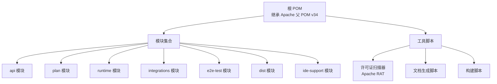
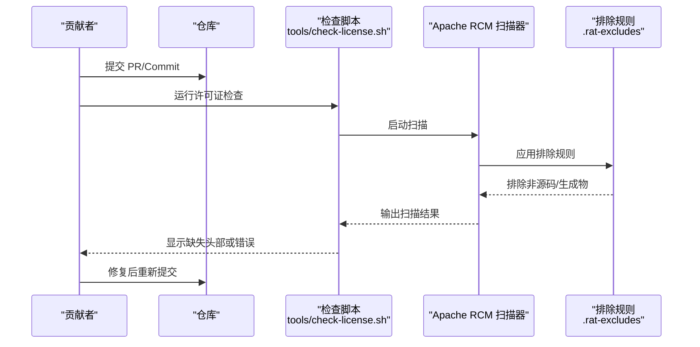
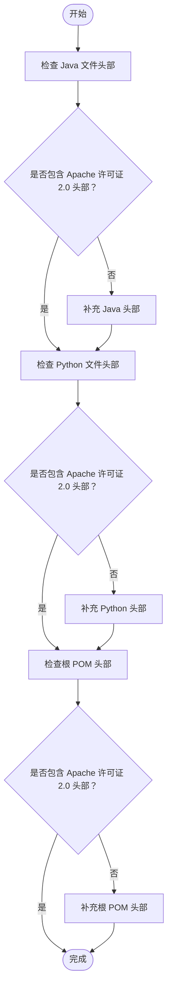
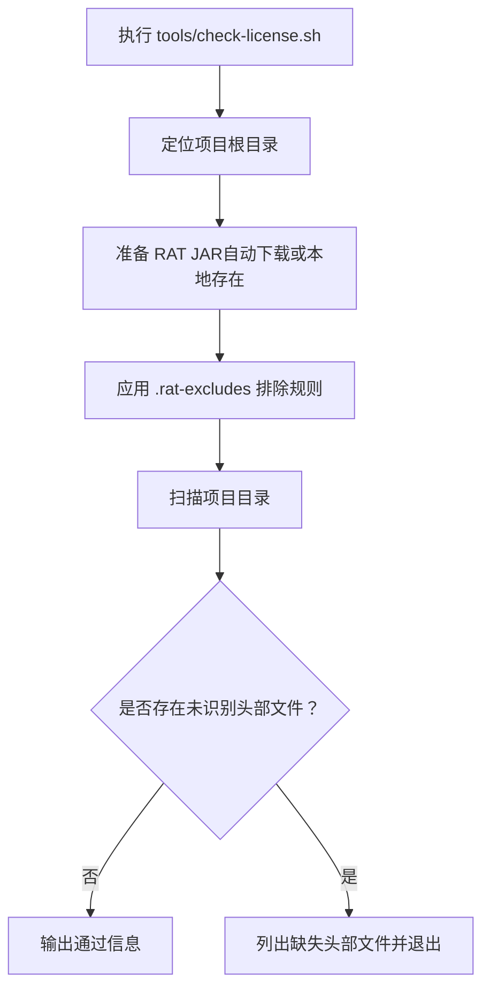
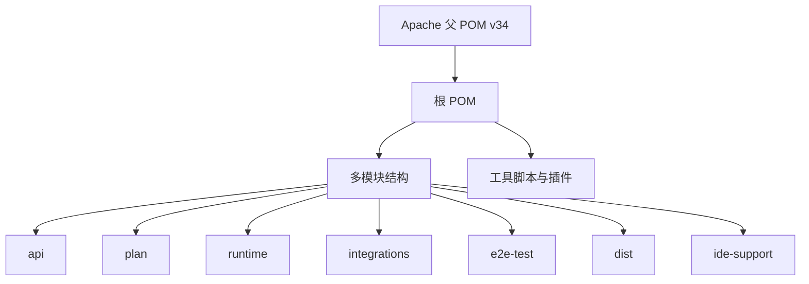

# Apache 软件基金会合规

<cite>
**本文引用的文件**
- [pom.xml](file://pom.xml)
- [.asf.yaml](file://.asf.yaml)
- [README.md](file://README.md)
- [tools/check-license.sh](file://tools/check-license.sh)
- [tools/.rat-excludes](file://tools/.rat-excludes)
- [api/src/main/java/org/apache/flink/agents/api/agents/Agent.java](file://api/src/main/java/org/apache/flink/agents/api/agents/Agent.java)
- [python/flink_agents/__init__.py](file://python/flink_agents/__init__.py)
</cite>

## 目录
1. [引言](#引言)
2. [项目结构](#项目结构)
3. [核心组件](#核心组件)
4. [架构总览](#架构总览)
5. [详细组件分析](#详细组件分析)
6. [依赖关系分析](#依赖关系分析)
7. [性能考虑](#性能考虑)
8. [故障排查指南](#故障排查指南)
9. [结论](#结论)
10. [附录](#附录)

## 引言
本指南面向 Apache Flink Agents 项目的所有贡献者与维护者，系统性说明 Apache 软件基金会（ASF）合规要求与实践，涵盖以下要点：
- Apache 许可证 2.0 的适用范围与使用条款
- 贡献者许可协议（CLA）的签署流程与要求
- ASF 知识产权政策与商标使用规范
- 代码提交前的合规检查清单：许可证头部、依赖项许可证审查、第三方代码处理
- 项目治理结构与决策流程
- 版权声明与许可证信息的正确标注方法
- 常见合规问题的解决方案与最佳实践

## 项目结构
Flink Agents 是一个基于 Apache Maven 的多模块项目，采用 Java 与 Python 双语言实现，并通过工具脚本进行许可证与文档质量检查。项目根 POM 继承自 Apache 父 POM v34，统一了许可证头、发布与签名等合规要求。

图表来源
- [pom.xml](file://pom.xml#L18-L67)

章节来源
- [pom.xml](file://pom.xml#L18-L67)

## 核心组件
- 许可证头部与版权标注：Java 与 Python 源码均包含标准 Apache 许可证 2.0 头部，确保版权归属与许可证声明一致。
- 许可证扫描工具：通过 Apache RCM（Apache Rat）扫描器对源码进行合规检查，排除非源码与生成产物。
- GitHub 配置：.asf.yaml 定义了仓库描述、主页、标签、合并策略与通知邮箱，体现 ASF 项目治理与协作方式。

章节来源
- [api/src/main/java/org/apache/flink/agents/api/agents/Agent.java](file://api/src/main/java/org/apache/flink/agents/api/agents/Agent.java#L1-L17)
- [python/flink_agents/__init__.py](file://python/flink_agents/__init__.py#L1-L17)
- [tools/check-license.sh](file://tools/check-license.sh#L1-L18)
- [tools/.rat-excludes](file://tools/.rat-excludes#L1-L19)
- [.asf.yaml](file://.asf.yaml#L16-L56)

## 架构总览
下图展示了贡献者在提交代码前需要遵循的合规流程，以及工具链如何协助完成许可证与文档检查。

图表来源
- [tools/check-license.sh](file://tools/check-license.sh#L53-L88)
- [tools/.rat-excludes](file://tools/.rat-excludes#L1-L19)

## 详细组件分析

### 许可证头部与版权标注
- Java 源码：每个 Java 文件顶部包含标准 Apache 许可证 2.0 头部，明确版权归属与许可证版本。
- Python 源码：Python 包初始化文件同样包含标准 Apache 许可证 2.0 头部，确保跨语言一致性。
- 项目根 POM：根 POM 文件包含 Apache 许可证 2.0 头部，体现项目整体合规基线。

图表来源
- [api/src/main/java/org/apache/flink/agents/api/agents/Agent.java](file://api/src/main/java/org/apache/flink/agents/api/agents/Agent.java#L1-L17)
- [python/flink_agents/__init__.py](file://python/flink_agents/__init__.py#L1-L17)
- [pom.xml](file://pom.xml#L2-L17)

章节来源
- [api/src/main/java/org/apache/flink/agents/api/agents/Agent.java](file://api/src/main/java/org/apache/flink/agents/api/agents/Agent.java#L1-L17)
- [python/flink_agents/__init__.py](file://python/flink_agents/__init__.py#L1-L17)
- [pom.xml](file://pom.xml#L2-L17)

### 许可证扫描与排除规则
- 工具脚本：tools/check-license.sh 使用 Apache RCM 扫描器对项目进行许可证检查，自动下载所需 JAR 并输出结果。
- 排除规则：.rat-excludes 列表定义了扫描时应忽略的目录与文件类型（如构建产物、IDE 配置、生成缓存、许可证目录等），避免误报。
- 结果处理：若发现缺失头部的文件，脚本会列出具体文件路径并退出，提示贡献者补充头部。

图表来源
- [tools/check-license.sh](file://tools/check-license.sh#L53-L88)
- [tools/.rat-excludes](file://tools/.rat-excludes#L1-L19)

章节来源
- [tools/check-license.sh](file://tools/check-license.sh#L1-L88)
- [tools/.rat-excludes](file://tools/.rat-excludes#L1-L19)

### GitHub 与 ASF 治理配置
- 仓库描述与主页：.asf.yaml 中定义了项目描述与主页链接，便于外部用户与社区识别。
- 合并策略：启用 Squash、Rebase 合并，限制 Merge 提交，有助于保持提交历史整洁与合规。
- 协作者与通知：列出了项目维护者与关键邮件列表，便于沟通与审计。

章节来源
- [.asf.yaml](file://.asf.yaml#L16-L56)

## 依赖关系分析
- 根 POM 继承 Apache 父 POM v34，统一许可证头、发布与签名等合规要求。
- 模块化结构：api、plan、runtime、integrations、e2e-test、dist、ide-support 等模块分工明确，便于独立开发与测试。
- 工具链：构建与检查脚本与 Maven 插件协同工作，保障代码风格与许可证一致性。

图表来源
- [pom.xml](file://pom.xml#L21-L67)

章节来源
- [pom.xml](file://pom.xml#L21-L67)

## 性能考虑
- 许可证扫描性能：通过 .rat-excludes 精确排除非源码与生成产物，减少扫描时间。
- 构建与测试：Maven 插件与脚本在本地与 CI 环境中协同，确保快速反馈与一致性。

## 故障排查指南
- 缺失许可证头部
  - 现象：许可证扫描脚本报告“未识别头部”文件。
  - 处理：为缺失头部的文件补充标准 Apache 许可证 2.0 头部；参考现有 Java 与 Python 文件头部格式。
  - 参考路径
    - [api/src/main/java/org/apache/flink/agents/api/agents/Agent.java](file://api/src/main/java/org/apache/flink/agents/api/agents/Agent.java#L1-L17)
    - [python/flink_agents/__init__.py](file://python/flink_agents/__init__.py#L1-L17)
- 排除规则误判
  - 现象：扫描结果包含不应检查的文件。
  - 处理：检查 .rat-excludes 是否覆盖该文件类型或目录；必要时新增排除条目。
  - 参考路径
    - [tools/.rat-excludes](file://tools/.rat-excludes#L1-L19)
- 扫描失败或网络问题
  - 现象：无法下载 RAT JAR 或扫描异常退出。
  - 处理：确保网络可用或手动下载指定版本 JAR 至 lib 目录；确认 JAVA_HOME 设置正确。
  - 参考路径
    - [tools/check-license.sh](file://tools/check-license.sh#L23-L70)

章节来源
- [tools/check-license.sh](file://tools/check-license.sh#L23-L88)
- [tools/.rat-excludes](file://tools/.rat-excludes#L1-L19)
- [api/src/main/java/org/apache/flink/agents/api/agents/Agent.java](file://api/src/main/java/org/apache/flink/agents/api/agents/Agent.java#L1-L17)
- [python/flink_agents/__init__.py](file://python/flink_agents/__init__.py#L1-L17)

## 结论
本指南总结了 Flink Agents 在 ASF 环境下的合规要求与实践，重点在于：
- 统一的许可证头部与版权标注
- 借助工具链自动化完成许可证扫描与排除
- 明确的治理与协作机制
建议贡献者在提交代码前，先运行许可证检查脚本并修正问题，确保符合 ASF 合规要求。

## 附录

### Apache 许可证 2.0 要求与使用条款
- 许可证要求
  - 必须保留版权与许可证声明
  - 修改文件需注明修改内容
  - 不得暗示 ASF 或其项目背书
- 使用条款
  - 允许商业与非商业使用
  - 允许修改与分发
  - 需在分发时附带许可证文本

### 贡献者许可协议（CLA）
- 个人贡献者：在首次向 ASF 项目提交代码前，需签署个人 CLA（ICLA）。
- 企业贡献者：企业员工代表公司贡献时，需签署企业 CLA（CCLA）。
- 提交流程
  - 在 ASF 门户完成 CLA 签署
  - 在提交 PR 时附上 CLA 签署记录
  - 项目维护者审核并合并

### ASF 知识产权政策与商标使用规范
- 知识产权政策
  - 所有贡献需确保无第三方权利冲突
  - 新增第三方依赖需满足 ASF 许可证兼容性
- 商标使用
  - “Apache”、“Flink”等商标仅用于指代项目与社区
  - 不得用于暗示官方背书或商业推广

### 代码提交前合规检查清单
- 许可证头部
  - Java/Python 文件均包含标准 Apache 许可证 2.0 头部
- 依赖项许可证审查
  - 使用工具扫描第三方依赖，确保与 Apache 许可证兼容
- 第三方代码处理
  - 来源不明或第三方代码需注明来源与许可证
  - 禁止引入禁止类许可证（如 GPL）的依赖
- 版权声明与许可证信息
  - 确保版权年份与文件变更一致
  - 分发包内包含 LICENSE 与 NOTICE 文件

### 项目治理与决策流程
- 治理结构
  - 由 ASF 技术委员会（TOC）监督项目方向
  - 项目维护者负责日常管理与代码审核
- 决策流程
  - 重大变更通过 PMC 讨论与投票
  - 社区讨论通过 GitHub Discussions 与邮件列表进行