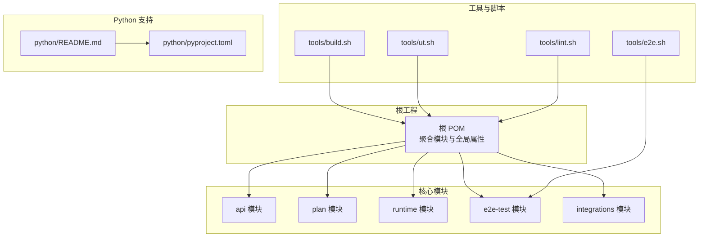
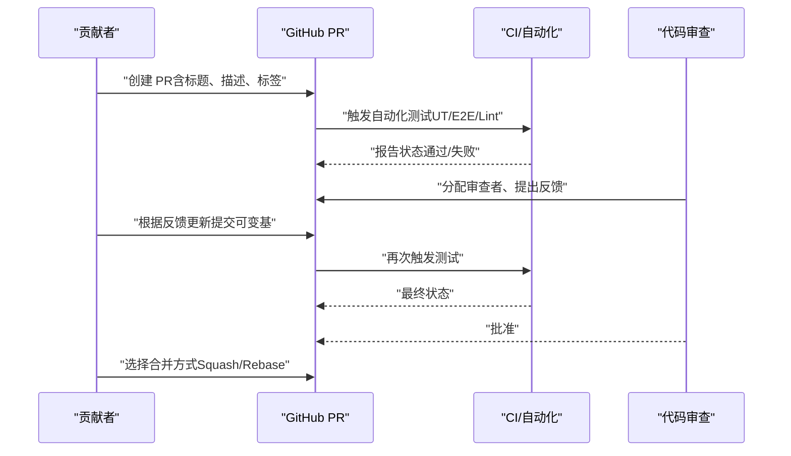
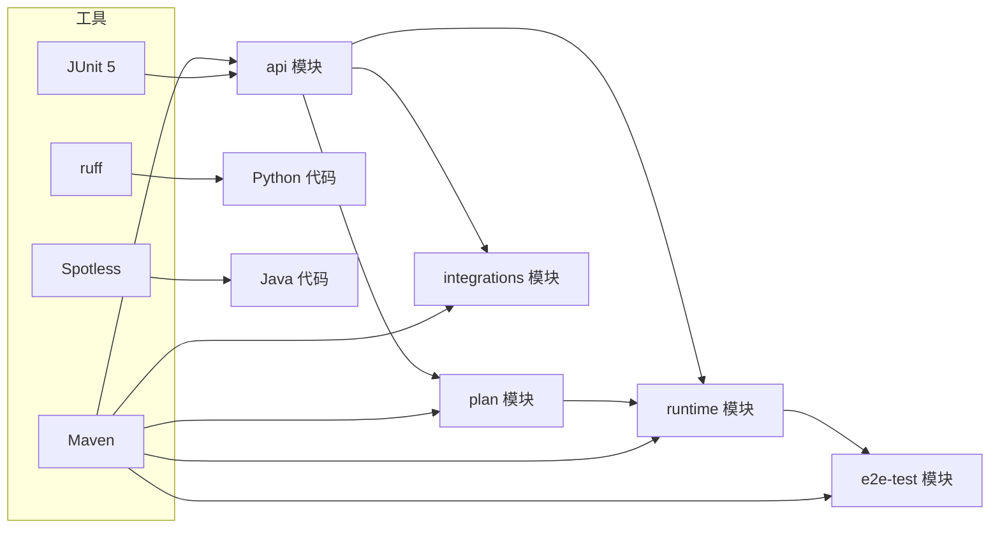

# Pull Request 工作流程

<cite>
**本文引用的文件**
- [README.md](file://README.md)
- [.asf.yaml](file://.asf.yaml)
- [pom.xml](file://pom.xml)
- [tools/build.sh](file://tools/build.sh)
- [tools/ut.sh](file://tools/ut.sh)
- [tools/e2e.sh](file://tools/e2e.sh)
- [tools/lint.sh](file://tools/lint.sh)
- [api/pom.xml](file://api/pom.xml)
- [runtime/pom.xml](file://runtime/pom.xml)
- [plan/pom.xml](file://plan/pom.xml)
- [e2e-test/pom.xml](file://e2e-test/pom.xml)
- [integrations/pom.xml](file://integrations/pom.xml)
- [python/README.md](file://python/README.md)
- [python/pyproject.toml](file://python/pyproject.toml)
</cite>

## 目录
1. [简介](#简介)
2. [项目结构](#项目结构)
3. [核心组件](#核心组件)
4. [架构总览](#架构总览)
5. [详细组件分析](#详细组件分析)
6. [依赖分析](#依赖分析)
7. [性能考虑](#性能考虑)
8. [故障排查指南](#故障排查指南)
9. [结论](#结论)
10. [附录](#附录)

## 简介
本指南面向 Apache Flink Agents 项目的贡献者，提供从 PR 创建、审查、测试到合并的完整工作流程。内容涵盖标题规范、描述模板、标签使用、自动化测试要求、CI 状态检查与批准要求、PR 更新与变基策略，以及常见问题的诊断与解决方法。

## 项目结构
该项目采用多模块 Maven 结构，核心模块包括 API、计划（Plan）、运行时（Runtime）、端到端测试（E2E）、集成适配层（Integrations）等；同时提供 Python 包与脚本工具链支持本地开发与测试。

图表来源
- [pom.xml](file://pom.xml#L58-L67)
- [tools/build.sh](file://tools/build.sh#L42-L86)
- [tools/ut.sh](file://tools/ut.sh#L122-L196)
- [tools/e2e.sh](file://tools/e2e.sh#L139-L166)
- [tools/lint.sh](file://tools/lint.sh#L115-L167)
- [python/README.md](file://python/README.md#L1-L1)
- [python/pyproject.toml](file://python/pyproject.toml)

章节来源
- [pom.xml](file://pom.xml#L58-L67)
- [README.md](file://README.md#L1-L44)

## 核心组件
- 多模块 Maven 构建：通过根 POM 聚合各子模块，统一版本与插件配置。
- 测试与验证工具：提供 Java/Python 单元测试、端到端测试与格式化检查脚本。
- Python 支持：提供 Python 包与依赖管理，便于跨语言资源与执行环境集成。
- 合并与提交策略：GitHub 侧启用 Squash、Rebase 合并方式，建议优先使用变基以保持线性历史。

章节来源
- [pom.xml](file://pom.xml#L37-L56)
- [tools/ut.sh](file://tools/ut.sh#L26-L65)
- [tools/e2e.sh](file://tools/e2e.sh#L18-L39)
- [tools/lint.sh](file://tools/lint.sh#L21-L39)
- [.asf.yaml](file://.asf.yaml#L32-L35)

## 架构总览
下图展示 PR 生命周期中的关键步骤与工具交互关系，包括本地准备、自动化测试与合并策略。

图表来源
- [.asf.yaml](file://.asf.yaml#L32-L35)
- [tools/ut.sh](file://tools/ut.sh#L122-L196)
- [tools/e2e.sh](file://tools/e2e.sh#L139-L166)
- [tools/lint.sh](file://tools/lint.sh#L115-L167)

## 详细组件分析

### PR 创建与标准流程
- 标题规范
  - 建议采用“类型: 摘要”的结构，例如 feat: 添加新工具能力、fix: 修复内存泄漏问题、docs: 更新用户文档等。
  - 类型参考：feat、fix、docs、style、refactor、perf、test、chore、revert 等。
- 描述模板
  - 背景与动机：说明变更原因与影响范围。
  - 变更内容：逐项列出具体改动点。
  - 测试策略：说明已覆盖的场景与新增测试。
  - 兼容性：是否引入破坏性变更或需要迁移步骤。
  - 关联 Issue/PR：引用相关问题或上游 PR。
- 标签使用
  - 使用项目预设标签：ai、agent、agentic-ai、multi-agents、framework、agentic-framework、flink、real-time、distributed、event-driven、java、python 等。
  - 建议添加：needs-review、ready-to-merge、documentation、testing 等。

章节来源
- [.asf.yaml](file://.asf.yaml#L19-L31)

### 代码审查流程
- 审查者分配
  - 由维护者根据模块与领域进行指派，或在讨论区公开认领。
- 反馈处理
  - 对每个评论逐一回复，说明修改或保留理由。
  - 修改后重新推送提交，避免创建新的 PR。
- 迭代修改
  - 优先使用变基（rebase）保持线性历史，必要时进行交互式变基整理提交。

章节来源
- [.asf.yaml](file://.asf.yaml#L41-L50)

### 自动化测试要求
- 单元测试（Java）
  - 使用 Maven Surefire 执行，支持多 Flink 版本矩阵。
  - 可通过工具脚本选择仅运行 Java 或指定 Flink 版本。
- 单元测试（Python）
  - 使用 pytest，支持 uv 与传统 pip 两种依赖管理方式。
  - 可排除 E2E 测试，专注于常规单元测试。
- 端到端测试（E2E）
  - 提供独立脚本，自动安装依赖、构建产物并运行跨语言与资源兼容性测试。
  - 支持在 Java 与 Python 环境中分别执行。
- 代码格式化与检查
  - Python 使用 ruff，Java 使用 Spotless（Google Java Format）。
  - 提供格式化与检查两种模式，确保风格一致。

章节来源
- [tools/ut.sh](file://tools/ut.sh#L122-L196)
- [tools/ut.sh](file://tools/ut.sh#L198-L284)
- [tools/e2e.sh](file://tools/e2e.sh#L139-L166)
- [tools/lint.sh](file://tools/lint.sh#L115-L167)

### 合并条件与触发机制
- 合并按钮
  - GitHub 已启用 Squash 与 Rebase 合并，不启用 Merge 提交按钮。
- CI 状态检查
  - 必须通过所有自动化测试（单元测试、端到端测试、格式化检查）。
- 审查批准
  - 至少一名维护者批准方可合并。
- 版本与构建
  - 根 POM 统一管理 Java 版本与 Flink 版本，确保构建一致性。

章节来源
- [.asf.yaml](file://.asf.yaml#L32-L35)
- [pom.xml](file://pom.xml#L37-L56)

### PR 更新与重新基底策略
- 更新 PR
  - 在同一分支上追加或修改提交，避免创建新的 PR。
- 重新基底（Rebase）
  - 将最新主干变更应用到当前分支，保持线性历史。
  - 若涉及冲突，需先解决再推送。
- 提交信息
  - 保持清晰、简洁，遵循项目风格。

章节来源
- [.asf.yaml](file://.asf.yaml#L32-L35)

### PR 模板与检查清单
- 标题规范：见“PR 创建与标准流程”。
- 描述模板：见“PR 创建与标准流程”。
- 标签使用：见“PR 创建与标准流程”。
- 检查清单
  - 本地已运行单元测试并通过。
  - 已运行端到端测试（如适用）。
  - 已通过格式化检查。
  - 已更新相关文档或示例。
  - 已清理无用提交，必要时进行变基。
  - 已获得至少一名维护者的批准。

章节来源
- [tools/ut.sh](file://tools/ut.sh#L26-L65)
- [tools/e2e.sh](file://tools/e2e.sh#L18-L39)
- [tools/lint.sh](file://tools/lint.sh#L21-L39)

## 依赖分析
- 模块间依赖
  - API 模块为公共接口与事件模型，PLAN 与 RUNTIME 基于 API 构建执行计划与运行时行为。
  - E2E 模块依赖 API 与 RUNTIME，用于跨模块与跨语言集成验证。
  - Integrations 模块提供外部服务适配器，作为 API 的扩展。
- 工具链依赖
  - Java：Maven、JUnit 5、AssertJ、Mockito、Spotless。
  - Python：pytest、ruff、uv（可选），以及 Flink 版本兼容性约束。

图表来源
- [pom.xml](file://pom.xml#L58-L67)
- [api/pom.xml](file://api/pom.xml)
- [plan/pom.xml](file://plan/pom.xml)
- [runtime/pom.xml](file://runtime/pom.xml)
- [e2e-test/pom.xml](file://e2e-test/pom.xml)
- [integrations/pom.xml](file://integrations/pom.xml)
- [tools/lint.sh](file://tools/lint.sh#L115-L167)

章节来源
- [pom.xml](file://pom.xml#L58-L67)

## 性能考虑
- 测试并行度
  - Java 测试通过 Maven Surefire 并行执行，提升吞吐。
- 依赖管理
  - Python 优先使用 uv 以加速依赖解析与安装。
- 构建缓存
  - 利用本地仓库缓存已安装的模块与测试 JAR，减少重复下载。

章节来源
- [tools/ut.sh](file://tools/ut.sh#L169-L175)
- [tools/build.sh](file://tools/build.sh#L80-L83)

## 故障排查指南
- 单元测试失败
  - 使用工具脚本定位失败模块与版本，逐步缩小范围。
  - 检查本地依赖与 Flink 版本匹配情况。
- 端到端测试失败
  - 确认已正确安装 Python 依赖与 Flink 版本，检查临时目录权限与资源可用性。
- 格式化检查失败
  - 先运行格式化脚本修复，再执行检查模式复核。
- 合并被拒绝
  - 确保 CI 状态全部通过且获得批准；若使用 Squash/Rebase，请确认提交历史整洁。

章节来源
- [tools/ut.sh](file://tools/ut.sh#L176-L196)
- [tools/e2e.sh](file://tools/e2e.sh#L139-L166)
- [tools/lint.sh](file://tools/lint.sh#L143-L167)

## 结论
遵循本文提供的 PR 工作流程，可显著提升贡献效率与代码质量。请始终确保测试完备、格式统一、审查通过，并按需进行变基以维持整洁的历史记录。

## 附录
- 快速命令参考
  - 构建：./tools/build.sh
  - 运行测试：./tools/ut.sh（可选参数：--java/--python/-f 指定版本）
  - 运行 E2E：./tools/e2e.sh
  - 格式化：./tools/lint.sh --format
  - 检查：./tools/lint.sh --check

章节来源
- [tools/build.sh](file://tools/build.sh#L42-L86)
- [tools/ut.sh](file://tools/ut.sh#L34-L65)
- [tools/e2e.sh](file://tools/e2e.sh#L18-L39)
- [tools/lint.sh](file://tools/lint.sh#L24-L39)