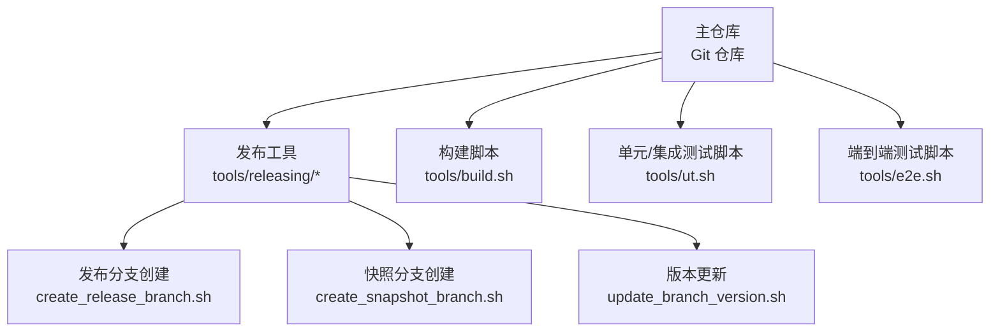
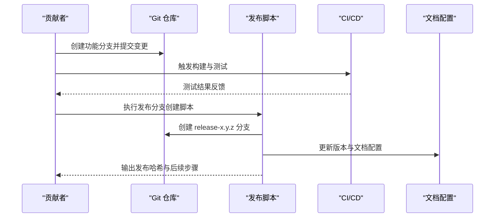
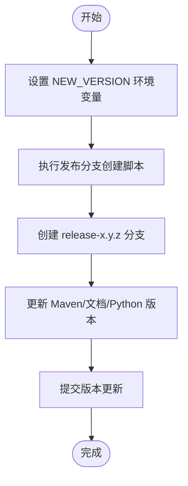
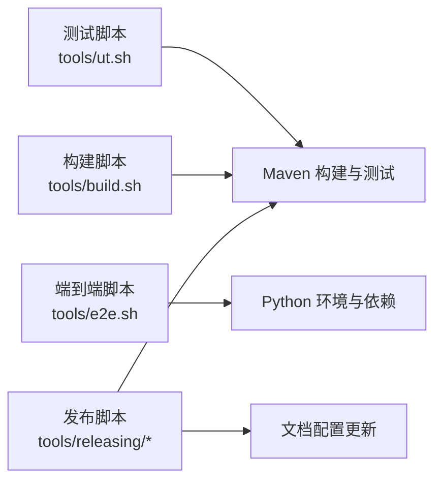

# 分支管理策略

<cite>
**本文引用的文件**
- [.asf.yaml](file://.asf.yaml)
- [tools/releasing/create_release_branch.sh](file://tools/releasing/create_release_branch.sh)
- [tools/releasing/create_snapshot_branch.sh](file://tools/releasing/create_snapshot_branch.sh)
- [tools/releasing/update_branch_version.sh](file://tools/releasing/update_branch_version.sh)
- [tools/build.sh](file://tools/build.sh)
- [tools/ut.sh](file://tools/ut.sh)
- [tools/e2e.sh](file://tools/e2e.sh)
- [README.md](file://README.md)
</cite>

## 目录
1. [引言](#引言)
2. [项目结构](#项目结构)
3. [核心组件](#核心组件)
4. [架构总览](#架构总览)
5. [详细组件分析](#详细组件分析)
6. [依赖关系分析](#依赖关系分析)
7. [性能考量](#性能考量)
8. [故障排查指南](#故障排查指南)
9. [结论](#结论)
10. [附录](#附录)

## 引言
本文件为 Apache Flink Agents 项目的分支管理策略文档，面向贡献者与维护者，系统阐述分支模型、命名规范、保护策略、发布流程、同步与合并实践、冲突解决与清理策略、权限与安全注意事项，并提供可操作的分支操作指导。内容基于仓库中现有的配置与脚本进行归纳总结，确保与实际开发流程一致。

## 项目结构
本项目采用多模块结构，包含 Java 与 Python 双语言实现，以及端到端测试与发布工具。与分支管理直接相关的关键点如下：
- 使用 Git 进行版本控制与分支协作
- 通过脚本驱动发布分支创建、版本更新与文档配置
- 通过统一的构建与测试脚本保障合并前的质量门禁

图表来源
- [tools/releasing/create_release_branch.sh](file://tools/releasing/create_release_branch.sh#L47-L55)
- [tools/releasing/create_snapshot_branch.sh](file://tools/releasing/create_snapshot_branch.sh#L75-L90)
- [tools/releasing/update_branch_version.sh](file://tools/releasing/update_branch_version.sh#L46-L59)
- [tools/build.sh](file://tools/build.sh#L44-L83)
- [tools/ut.sh](file://tools/ut.sh#L122-L196)
- [tools/e2e.sh](file://tools/e2e.sh#L139-L165)

章节来源
- [README.md](file://README.md#L17-L28)
- [tools/build.sh](file://tools/build.sh#L18-L86)
- [tools/ut.sh](file://tools/ut.sh#L34-L108)
- [tools/e2e.sh](file://tools/e2e.sh#L18-L166)

## 核心组件
- 分支保护与合并策略：GitHub 侧启用强制审查、CI/CD 集成与代码质量门禁；合并方式默认为 squash 或 rebase，禁止直接 merge。
- 发布分支创建：通过发布脚本自动创建 release-x.y.z 分支，更新多处版本信息（Maven、文档、Python），并生成提交记录。
- 快照分支创建：在 main 上预更新文档配置后创建 release 分支，设置文档版本、分支别名、稳定标识等。
- 版本更新：在分支上批量更新版本号与文档标题，确保一致性。
- 构建与测试：统一的构建与测试脚本，作为合并前的质量门禁执行入口。

章节来源
- [.asf.yaml](file://.asf.yaml#L32-L35)
- [tools/releasing/create_release_branch.sh](file://tools/releasing/create_release_branch.sh#L47-L71)
- [tools/releasing/create_snapshot_branch.sh](file://tools/releasing/create_snapshot_branch.sh#L62-L90)
- [tools/releasing/update_branch_version.sh](file://tools/releasing/update_branch_version.sh#L46-L61)
- [tools/build.sh](file://tools/build.sh#L44-L83)
- [tools/ut.sh](file://tools/ut.sh#L122-L196)
- [tools/e2e.sh](file://tools/e2e.sh#L139-L165)

## 架构总览
下图展示从功能开发到发布分支创建的整体流程，以及与脚本的对应关系：

图表来源
- [tools/releasing/create_release_branch.sh](file://tools/releasing/create_release_branch.sh#L47-L71)
- [tools/releasing/create_snapshot_branch.sh](file://tools/releasing/create_snapshot_branch.sh#L62-L90)
- [tools/ut.sh](file://tools/ut.sh#L122-L196)
- [tools/e2e.sh](file://tools/e2e.sh#L139-L165)

## 详细组件分析

### 分支模型与命名约定
- 主分支（main）
  - 用途：承载最新稳定代码与文档配置；用于快照分支创建前的预处理。
  - 约束：禁止直接推送大改动，需通过拉取请求评审与 CI 检查。
- 开发分支（develop）
  - 说明：当前仓库未显式使用 develop 分支；建议在团队内部以 main 作为主要开发线，或通过功能分支直连 main 的评审流程替代。
- 功能分支（feature/*）
  - 命名：feature/<issue-or-descriptive-name>
  - 用途：短期迭代与实验性功能开发；完成后通过评审与测试再合并至 main。
- 发布分支（release-x.y.z）
  - 命名：release-<version>，RC 可追加 rc<N>
  - 创建：由发布脚本自动完成，更新版本号与文档配置。
- 快照分支（release-<short-version>）
  - 命名：release-<major.minor>
  - 创建：先在 main 更新文档配置，再创建 release 分支并设置稳定标识与文档 URL。

章节来源
- [tools/releasing/create_release_branch.sh](file://tools/releasing/create_release_branch.sh#L47-L50)
- [tools/releasing/create_snapshot_branch.sh](file://tools/releasing/create_snapshot_branch.sh#L75-L89)

### 分支保护策略
- 合并方式
  - 默认不允许直接 merge；推荐使用 squash 或 rebase 合并，保持提交历史整洁。
- 强制审查
  - 通过 GitHub 评审机制保证至少一次审查通过后方可合并。
- CI/CD 集成与质量门禁
  - 合并前必须通过构建与测试脚本的检查；Java 与 Python 测试分别由统一脚本驱动。
- 文档与版本一致性
  - 发布脚本会同步更新 Maven、文档与 Python 版本，避免版本漂移。

章节来源
- [.asf.yaml](file://.asf.yaml#L32-L35)
- [tools/ut.sh](file://tools/ut.sh#L122-L196)
- [tools/e2e.sh](file://tools/e2e.sh#L139-L165)
- [tools/releasing/create_release_branch.sh](file://tools/releasing/create_release_branch.sh#L54-L68)
- [tools/releasing/update_branch_version.sh](file://tools/releasing/update_branch_version.sh#L46-L59)

### 发布分支的创建与维护
- 创建发布分支
  - 设置 NEW_VERSION 环境变量，运行发布脚本，自动创建 release-x.y.z 并提交版本更新。
  - 如需 RC，脚本会自动追加 rc<N>。
- 维护发布分支
  - 在 release 分支上进行小范围热修复与版本更新，使用版本更新脚本统一修改多处版本信息。
  - 稳定后可打标签并归档文档。
- 快照分支
  - 先在 main 更新文档 PreviousDocs 与 CI 配置，再创建 release-<major.minor> 分支，设置 IsStable 与 baseURL，便于文档站点切换。

图表来源
- [tools/releasing/create_release_branch.sh](file://tools/releasing/create_release_branch.sh#L26-L71)

章节来源
- [tools/releasing/create_release_branch.sh](file://tools/releasing/create_release_branch.sh#L26-L71)
- [tools/releasing/create_snapshot_branch.sh](file://tools/releasing/create_snapshot_branch.sh#L62-L90)
- [tools/releasing/update_branch_version.sh](file://tools/releasing/update_branch_version.sh#L46-L61)

### 分支同步与合并最佳实践
- 同步策略
  - 定期从 main rebase 功能分支，保持基线一致，降低合并冲突概率。
- 合并策略
  - 推荐使用 squash 合并，将功能分支的多次提交压缩为单条提交，提升历史可读性。
  - 对于需要保留细粒度提交历史的场景，可使用 rebase 合并并确保线性历史。
- 提交信息
  - 采用清晰的描述性提交信息，配合脚本生成的版本更新提交，便于追溯。

章节来源
- [.asf.yaml](file://.asf.yaml#L32-L35)
- [tools/releasing/create_release_branch.sh](file://tools/releasing/create_release_branch.sh#L71-L71)

### 冲突解决流程
- 识别冲突
  - 在 rebase 或合并时出现冲突，优先定位到具体文件与段落。
- 解决步骤
  - 逐个解决冲突文件，确认逻辑正确后再继续 rebase。
  - 解决后重新运行测试脚本，确保无回归。
- 回滚与重试
  - 若冲突复杂，可临时保存现场并回退到最近一次干净状态，分模块逐一解决。

章节来源
- [tools/ut.sh](file://tools/ut.sh#L122-L196)
- [tools/e2e.sh](file://tools/e2e.sh#L139-L165)

### 分支清理策略
- 功能分支
  - 合并完成后立即删除，避免分支冗余。
- 发布分支
  - 稳定发布后可按需保留，但应定期清理长期无人维护的分支。
- 备份与归档
  - 对重要发布分支进行标签与文档归档，便于后续查阅。

章节来源
- [tools/releasing/create_release_branch.sh](file://tools/releasing/create_release_branch.sh#L71-L71)

### 权限管理与安全考虑
- 合并权限
  - 仅授权维护者具备直接合并权限；所有变更必须通过评审。
- 审查要求
  - 至少一次审查通过，且审查者不为变更作者。
- 安全与合规
  - 通过 CI 脚本统一执行测试，减少引入不兼容或低质量代码的风险。
- 通知与沟通
  - 通过邮件列表与讨论区进行变更通知，确保社区知情。

章节来源
- [.asf.yaml](file://.asf.yaml#L41-L55)

## 依赖关系分析
发布与测试脚本之间的依赖关系如下：

图表来源
- [tools/ut.sh](file://tools/ut.sh#L122-L196)
- [tools/e2e.sh](file://tools/e2e.sh#L139-L165)
- [tools/build.sh](file://tools/build.sh#L44-L83)
- [tools/releasing/create_release_branch.sh](file://tools/releasing/create_release_branch.sh#L54-L68)

章节来源
- [tools/ut.sh](file://tools/ut.sh#L122-L196)
- [tools/e2e.sh](file://tools/e2e.sh#L139-L165)
- [tools/build.sh](file://tools/build.sh#L44-L83)
- [tools/releasing/create_release_branch.sh](file://tools/releasing/create_release_branch.sh#L54-L68)

## 性能考量
- 测试执行效率
  - 通过脚本参数选择性运行 Java/Python/端到端测试，缩短反馈周期。
- 并行化与缓存
  - Maven 与 Python 依赖安装支持并行与缓存，减少重复构建时间。
- 文档与版本更新
  - 发布脚本集中更新多处版本信息，避免手动遗漏导致的返工。

章节来源
- [tools/ut.sh](file://tools/ut.sh#L67-L108)
- [tools/build.sh](file://tools/build.sh#L77-L83)
- [tools/releasing/create_release_branch.sh](file://tools/releasing/create_release_branch.sh#L54-L68)

## 故障排查指南
- 构建失败
  - 检查本地环境与依赖是否满足 README 中的前置条件；使用构建脚本进行自检。
- 测试失败
  - 使用测试脚本的详细输出定位失败用例；必要时单独运行 Java 或 Python 测试套件。
- 发布脚本错误
  - 确认环境变量（如 NEW_VERSION）已正确设置；遵循脚本调用路径（tools/ 目录）。
- 文档配置异常
  - 快照分支脚本会更新 PreviousDocs 与 CI 配置，若文档站点异常，检查对应字段是否被正确替换。

章节来源
- [README.md](file://README.md#L9-L16)
- [tools/build.sh](file://tools/build.sh#L38-L46)
- [tools/ut.sh](file://tools/ut.sh#L122-L196)
- [tools/e2e.sh](file://tools/e2e.sh#L139-L165)
- [tools/releasing/create_snapshot_branch.sh](file://tools/releasing/create_snapshot_branch.sh#L65-L71)

## 结论
本策略文档基于现有仓库配置与脚本，明确了分支模型、保护与合并策略、发布流程与质量门禁。建议团队在实践中坚持：
- 使用功能分支进行短期迭代，合并前必须通过统一的构建与测试脚本；
- 发布分支创建与版本更新由脚本统一执行，确保一致性；
- 采用 squash 或 rebase 合并，保持线性历史；
- 建立定期清理与归档机制，维持仓库健康。

## 附录
- 常用命令参考
  - 构建：./tools/build.sh
  - 单元/集成测试：./tools/ut.sh
  - 端到端测试：./tools/e2e.sh
  - 创建发布分支：NEW_VERSION=x.y.z ./tools/releasing/create_release_branch.sh
  - 更新分支版本：NEW_VERSION=x.y.z ./tools/releasing/update_branch_version.sh
  - 创建快照分支：SHORT_RELEASE_VERSION=x.y RELEASE_VERSION=x.y.z SHORT_NEXT_SNAPSHOT_VERSION=x.y+1 ./tools/releasing/create_snapshot_branch.sh

章节来源
- [tools/build.sh](file://tools/build.sh#L26-L28)
- [tools/ut.sh](file://tools/ut.sh#L34-L65)
- [tools/e2e.sh](file://tools/e2e.sh#L18-L32)
- [tools/releasing/create_release_branch.sh](file://tools/releasing/create_release_branch.sh#L26-L29)
- [tools/releasing/update_branch_version.sh](file://tools/releasing/update_branch_version.sh#L25-L28)
- [tools/releasing/create_snapshot_branch.sh](file://tools/releasing/create_snapshot_branch.sh#L20-L33)