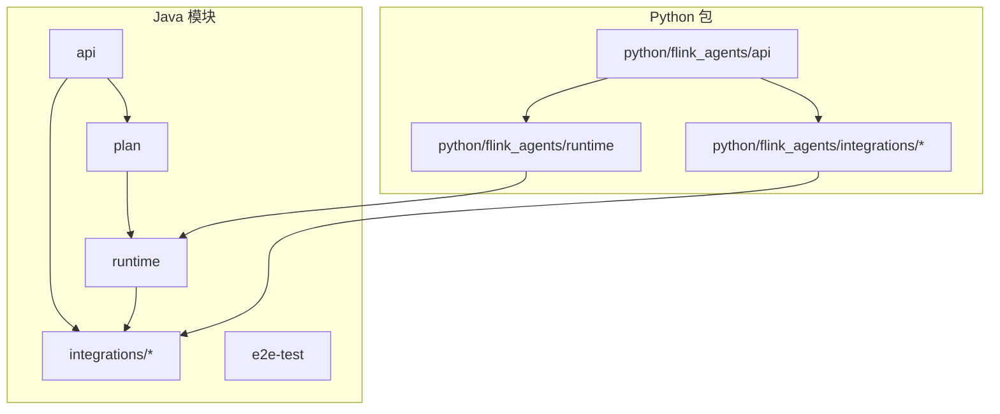
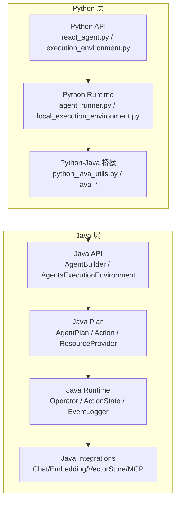
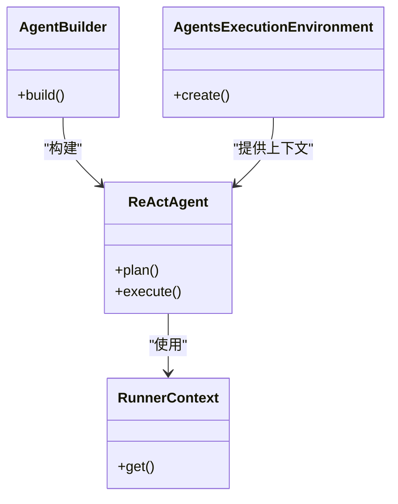
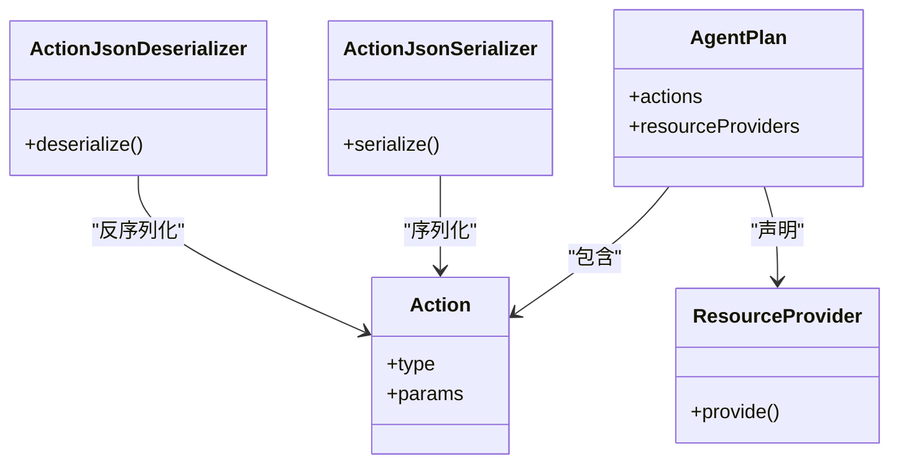
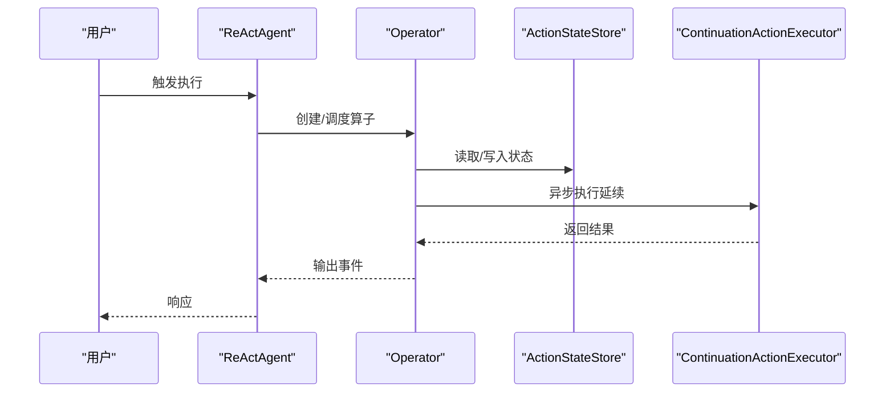
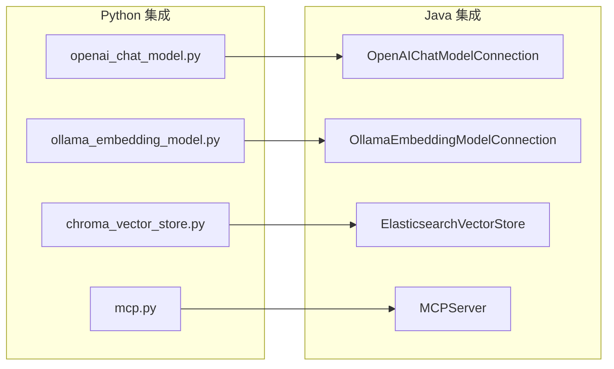
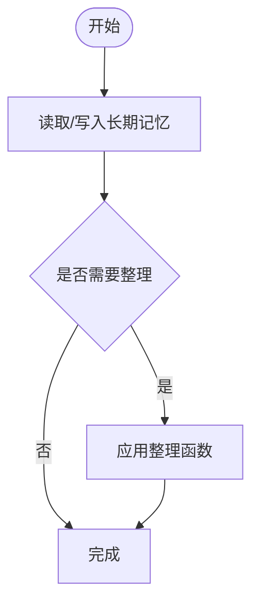
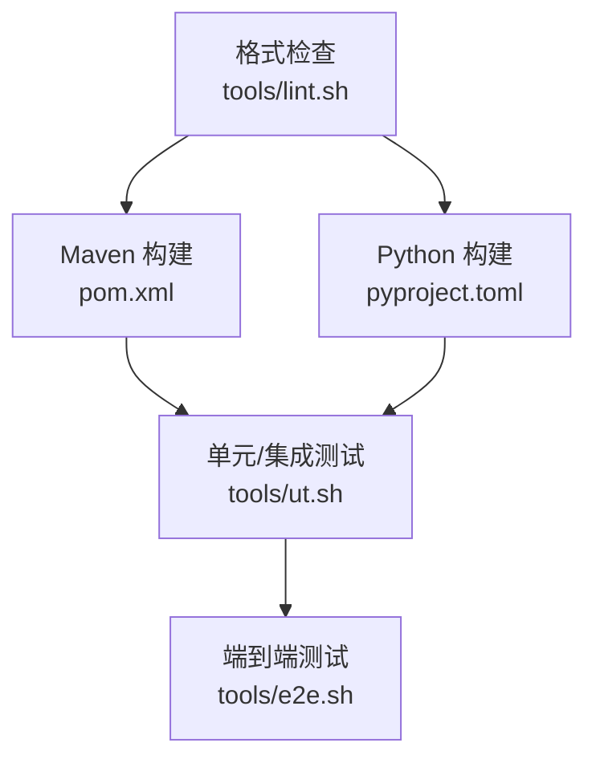

# 新贡献者引导

<cite>
**本文引用的文件**
- [README.md](file://README.md)
- [pom.xml](file://pom.xml)
- [pyproject.toml](file://python/pyproject.toml)
- [tools/build.sh](file://tools/build.sh)
- [tools/ut.sh](file://tools/ut.sh)
- [tools/e2e.sh](file://tools/e2e.sh)
- [tools/lint.sh](file://tools/lint.sh)
- [.asf.yaml](file://.asf.yaml)
- [api/src/main/java/org/apache/flink/agents/api/agents/ReActAgent.java](file://api/src/main/java/org/apache/flink/agents/api/agents/ReActAgent.java)
- [api/src/main/java/org/apache/flink/agents/api/AgentBuilder.java](file://api/src/main/java/org/apache/flink/agents/api/AgentBuilder.java)
- [api/src/main/java/org/apache/flink/agents/api/AgentsExecutionEnvironment.java](file://api/src/main/java/org/apache/flink/agents/api/AgentsExecutionEnvironment.java)
- [api/src/main/java/org/apache/flink/agents/api/context/RunnerContext.java](file://api/src/main/java/org/apache/flink/agents/api/context/RunnerContext.java)
- [api/src/main/java/org/apache/flink/agents/api/configuration/Configuration.java](file://api/src/main/java/org/apache/flink/agents/api/configuration/Configuration.java)
- [api/src/main/java/org/apache/flink/agents/api/event/ChatRequestEvent.java](file://api/src/main/java/org/apache/flink/agents/api/event/ChatRequestEvent.java)
- [api/src/main/java/org/apache/flink/agents/api/memory/BaseLongTermMemory.java](file://api/src/main/java/org/apache/flink/agents/api/memory/BaseLongTermMemory.java)
- [api/src/main/java/org/apache/flink/agents/api/tools/Tool.java](file://api/src/main/java/org/apache/flink/agents/api/tools/Tool.java)
- [api/src/main/java/org/apache/flink/agents/api/vectorstores/VectorStoreQuery.java](file://api/src/main/java/org/apache/flink/agents/api/vectorstores/VectorStoreQuery.java)
- [plan/src/main/java/org/apache/flink/agents/plan/AgentPlan.java](file://plan/src/main/java/org/apache/flink/agents/plan/AgentPlan.java)
- [plan/src/main/java/org/apache/flink/agents/plan/resourceprovider/ResourceProvider.java](file://plan/src/main/java/org/apache/flink/agents/plan/resourceprovider/ResourceProvider.java)
- [plan/src/main/java/org/apache/flink/agents/plan/actions/Action.java](file://plan/src/main/java/org/apache/flink/agents/plan/actions/Action.java)
- [plan/src/main/java/org/apache/flink/agents/plan/serializer/ActionJsonSerializer.java](file://plan/src/main/java/org/apache/flink/agents/plan/serializer/ActionJsonSerializer.java)
- [runtime/src/main/java/org/apache/flink/agents/runtime/operator/Operator.java](file://runtime/src/main/java/org/apache/flink/agents/runtime/operator/Operator.java)
- [runtime/src/main/java/org/apache/flink/agents/runtime/actionstate/ActionState.java](file://runtime/src/main/java/org/apache/flink/agents/runtime/actionstate/ActionState.java)
- [runtime/src/main/java/org/apache/flink/agents/runtime/async/ContinuationActionExecutor.java](file://runtime/src/main/java/org/apache/flink/agents/runtime/async/ContinuationActionExecutor.java)
- [runtime/src/main/java/org/apache/flink/agents/runtime/logger/EventLogger.java](file://runtime/src/main/java/org/apache/flink/agents/runtime/logger/EventLogger.java)
- [runtime/src/main/java/org/apache/flink/agents/runtime/memory/VectorStoreLongTermMemory.java](file://runtime/src/main/java/org/apache/flink/agents/runtime/memory/VectorStoreLongTermMemory.java)
- [integrations/chat-models/openai/src/main/java/org/apache/flink/agents/integrations/chatmodels/openai/OpenAIChatModelConnection.java](file://integrations/chat-models/openai/src/main/java/org/apache/flink/agents/integrations/chatmodels/openai/OpenAIChatModelConnection.java)
- [integrations/embedding-models/ollama/src/main/java/org/apache/flink/agents/integrations/embeddingmodels/ollama/OllamaEmbeddingModelConnection.java](file://integrations/embedding-models/ollama/src/main/java/org/apache/flink/agents/integrations/embeddingmodels/ollama/OllamaEmbeddingModelConnection.java)
- [integrations/mcp/src/main/java/org/apache/flink/agents/integrations/mcp/MCPServer.java](file://integrations/mcp/src/main/java/org/apache/flink/agents/integrations/mcp/MCPServer.java)
- [integrations/vector-stores/elasticsearch/src/main/java/org/apache/flink/agents/integrations/vectorstores/elasticsearch/ElasticsearchVectorStore.java](file://integrations/vector-stores/elasticsearch/src/main/java/org/apache/flink/agents/integrations/vectorstores/elasticsearch/ElasticsearchVectorStore.java)
- [python/flink_agents/api/agents/react_agent.py](file://python/flink_agents/api/agents/react_agent.py)
- [python/flink_agents/api/execution_environment.py](file://python/flink_agents/api/execution_environment.py)
- [python/flink_agents/api/tools/tool.py](file://python/flink_agents/api/tools/tool.py)
- [python/flink_agents/api/vector_stores/vector_store.py](file://python/flink_agents/api/vector_stores/vector_store.py)
- [python/flink_agents/runtime/local_execution_environment.py](file://python/flink_agents/runtime/local_execution_environment.py)
- [python/flink_agents/runtime/remote_execution_environment.py](file://python/flink_agents/runtime/remote_execution_environment.py)
- [python/flink_agents/runtime/agent_runner.py](file://python/flink_agents/runtime/agent_runner.py)
- [python/flink_agents/runtime/runtime/local_runner.py](file://python/flink_agents/runtime/local_runner.py)
- [python/flink_agents/runtime/runtime/flink_runner_context.py](file://python/flink_agents/runtime/flink_runner_context.py)
- [python/flink_agents/runtime/runtime/flink_memory_object.py](file://python/flink_agents/runtime/flink_memory_object.py)
- [python/flink_agents/runtime/runtime/flink_metric_group.py](file://python/flink_agents/runtime/flink_metric_group.py)
- [python/flink_agents/runtime/runtime/python_java_utils.py](file://python/flink_agents/runtime/python_java_utils.py)
- [python/flink_agents/runtime/runtime/java/java_chat_model.py](file://python/flink_agents/runtime/java/java_chat_model.py)
- [python/flink_agents/runtime/runtime/java/java_embedding_model.py](file://python/flink_agents/runtime/java/java_embedding_model.py)
- [python/flink_agents/runtime/runtime/java/java_vector_store.py](file://python/flink_agents/runtime/java/java_vector_store.py)
- [python/flink_agents/runtime/runtime/java/java_resource_wrapper.py](file://python/flink_agents/runtime/java/java_resource_wrapper.py)
- [python/flink_agents/runtime/memory/vector_store_long_term_memory.py](file://python/flink_agents/runtime/memory/vector_store_long_term_memory.py)
- [python/flink_agents/runtime/memory/internal_base_long_term_memory.py](file://python/flink_agents/runtime/memory/internal_base_long_term_memory.py)
- [python/flink_agents/runtime/memory/compaction_functions.py](file://python/flink_agents/runtime/memory/compaction_functions.py)
- [python/flink_agents/integrations/chat_models/openai/openai_chat_model.py](file://python/flink_agents/integrations/chat_models/openai/openai_chat_model.py)
- [python/flink_agents/integrations/embedding_models/local/ollama_embedding_model.py](file://python/flink_agents/integrations/embedding_models/local/ollama_embedding_model.py)
- [python/flink_agents/integrations/mcp/mcp.py](file://python/flink_agents/integrations/mcp/mcp.py)
- [python/flink_agents/integrations/vector_stores/chroma/chroma_vector_store.py](file://python/flink_agents/integrations/vector_stores/chroma/chroma_vector_store.py)
</cite>

## 目录
1. [引言](#引言)
2. [项目结构](#项目结构)
3. [核心组件](#核心组件)
4. [架构总览](#架构总览)
5. [详细组件分析](#详细组件分析)
6. [依赖关系分析](#依赖关系分析)
7. [性能考虑](#性能考虑)
8. [故障排查指南](#故障排查指南)
9. [结论](#结论)
10. [附录](#附录)

## 引言
Apache Flink Agents 是一个基于 Apache Flink 的智能体（Agent）框架，旨在通过事件驱动与分布式计算能力，实现多智能体在实时数据流上的协同工作。它同时提供 Java 与 Python 双栈 API，支持跨语言资源与执行环境，覆盖从提示工程、工具调用到向量检索与长程记忆的完整链路。

本指南面向新贡献者，帮助你快速理解项目愿景、搭建开发环境、定位核心模块，并给出“第一次贡献”的建议路径与最佳实践。

## 项目结构
仓库采用多模块聚合结构，核心模块包括：
- api：通用 API 与运行时抽象（Java）
- plan：代理计划序列化与资源提供器（Java）
- runtime：运行时算子、状态、日志与内存（Java）
- integrations：各类外部集成（聊天模型、嵌入模型、向量库、MCP 等）
- python：Python API、运行时与示例（双栈桥接）
- e2e-test：端到端测试与脚本
- tools：构建、测试、格式化与发布脚本

图表来源
- [pom.xml](file://pom.xml#L58-L67)
- [pyproject.toml](file://python/pyproject.toml#L64-L70)

章节来源
- [pom.xml](file://pom.xml#L58-L67)
- [pyproject.toml](file://python/pyproject.toml#L64-L70)

## 核心组件
- 代理与执行环境
  - Java：AgentBuilder、AgentsExecutionEnvironment、ReActAgent、RunnerContext
  - Python：execution_environment、react_agent、agent_runner
- 计划与序列化
  - AgentPlan、Action、ResourceProvider、JSON 序列化器
- 运行时与状态
  - Operator、ActionState、ContinuationActionExecutor、EventLogger
- 集成与适配
  - 聊聊模型（OpenAI、AzureAI、Anthropic、Ollama）、嵌入模型（OpenAI、Ollama）、向量库（Elasticsearch、Chroma）、MCP
- 内存与指标
  - BaseLongTermMemory、VectorStoreLongTermMemory、FlinkAgentsMetricGroup

章节来源
- [api/src/main/java/org/apache/flink/agents/api/AgentBuilder.java](file://api/src/main/java/org/apache/flink/agents/api/AgentBuilder.java)
- [api/src/main/java/org/apache/flink/agents/api/AgentsExecutionEnvironment.java](file://api/src/main/java/org/apache/flink/agents/api/AgentsExecutionEnvironment.java)
- [api/src/main/java/org/apache/flink/agents/api/agents/ReActAgent.java](file://api/src/main/java/org/apache/flink/agents/api/agents/ReActAgent.java)
- [api/src/main/java/org/apache/flink/agents/api/context/RunnerContext.java](file://api/src/main/java/org/apache/flink/agents/api/context/RunnerContext.java)
- [plan/src/main/java/org/apache/flink/agents/plan/AgentPlan.java](file://plan/src/main/java/org/apache/flink/agents/plan/AgentPlan.java)
- [plan/src/main/java/org/apache/flink/agents/plan/actions/Action.java](file://plan/src/main/java/org/apache/flink/agents/plan/actions/Action.java)
- [plan/src/main/java/org/apache/flink/agents/plan/resourceprovider/ResourceProvider.java](file://plan/src/main/java/org/apache/flink/agents/plan/resourceprovider/ResourceProvider.java)
- [runtime/src/main/java/org/apache/flink/agents/runtime/operator/Operator.java](file://runtime/src/main/java/org/apache/flink/agents/runtime/operator/Operator.java)
- [runtime/src/main/java/org/apache/flink/agents/runtime/actionstate/ActionState.java](file://runtime/src/main/java/org/apache/flink/agents/runtime/actionstate/ActionState.java)
- [runtime/src/main/java/org/apache/flink/agents/runtime/async/ContinuationActionExecutor.java](file://runtime/src/main/java/org/apache/flink/agents/runtime/async/ContinuationActionExecutor.java)
- [runtime/src/main/java/org/apache/flink/agents/runtime/logger/EventLogger.java](file://runtime/src/main/java/org/apache/flink/agents/runtime/logger/EventLogger.java)
- [runtime/src/main/java/org/apache/flink/agents/runtime/memory/VectorStoreLongTermMemory.java](file://runtime/src/main/java/org/apache/flink/agents/runtime/memory/VectorStoreLongTermMemory.java)
- [api/src/main/java/org/apache/flink/agents/api/memory/BaseLongTermMemory.java](file://api/src/main/java/org/apache/flink/agents/api/memory/BaseLongTermMemory.java)
- [api/src/main/java/org/apache/flink/agents/api/metrics/FlinkAgentsMetricGroup.java](file://api/src/main/java/org/apache/flink/agents/api/metrics/FlinkAgentsMetricGroup.java)

## 架构总览
下图展示了 Java 与 Python 层之间的交互关系，以及与外部集成的连接点。

图表来源
- [python/flink_agents/api/agents/react_agent.py](file://python/flink_agents/api/agents/react_agent.py)
- [python/flink_agents/api/execution_environment.py](file://python/flink_agents/api/execution_environment.py)
- [python/flink_agents/runtime/agent_runner.py](file://python/flink_agents/runtime/agent_runner.py)
- [python/flink_agents/runtime/local_execution_environment.py](file://python/flink_agents/runtime/local_execution_environment.py)
- [python/flink_agents/runtime/python_java_utils.py](file://python/flink_agents/runtime/python_java_utils.py)
- [api/src/main/java/org/apache/flink/agents/api/AgentBuilder.java](file://api/src/main/java/org/apache/flink/agents/api/AgentBuilder.java)
- [api/src/main/java/org/apache/flink/agents/api/AgentsExecutionEnvironment.java](file://api/src/main/java/org/apache/flink/agents/api/AgentsExecutionEnvironment.java)
- [plan/src/main/java/org/apache/flink/agents/plan/AgentPlan.java](file://plan/src/main/java/org/apache/flink/agents/plan/AgentPlan.java)
- [runtime/src/main/java/org/apache/flink/agents/runtime/operator/Operator.java](file://runtime/src/main/java/org/apache/flink/agents/runtime/operator/Operator.java)
- [runtime/src/main/java/org/apache/flink/agents/runtime/logger/EventLogger.java](file://runtime/src/main/java/org/apache/flink/agents/runtime/logger/EventLogger.java)

## 详细组件分析

### 组件一：代理与执行环境（Java/Python）
- Java 侧通过 AgentBuilder 构建代理，AgentsExecutionEnvironment 提供执行上下文；ReActAgent 实现典型规划-行动循环；RunnerContext 提供运行期上下文注入。
- Python 侧提供等价 API，react_agent.py 对应 ReActAgent，execution_environment.py 对应 AgentsExecutionEnvironment，agent_runner.py 负责运行。

图表来源
- [api/src/main/java/org/apache/flink/agents/api/AgentBuilder.java](file://api/src/main/java/org/apache/flink/agents/api/AgentBuilder.java)
- [api/src/main/java/org/apache/flink/agents/api/AgentsExecutionEnvironment.java](file://api/src/main/java/org/apache/flink/agents/api/AgentsExecutionEnvironment.java)
- [api/src/main/java/org/apache/flink/agents/api/agents/ReActAgent.java](file://api/src/main/java/org/apache/flink/agents/api/agents/ReActAgent.java)
- [api/src/main/java/org/apache/flink/agents/api/context/RunnerContext.java](file://api/src/main/java/org/apache/flink/agents/api/context/RunnerContext.java)

章节来源
- [api/src/main/java/org/apache/flink/agents/api/agents/ReActAgent.java](file://api/src/main/java/org/apache/flink/agents/api/agents/ReActAgent.java)
- [api/src/main/java/org/apache/flink/agents/api/AgentBuilder.java](file://api/src/main/java/org/apache/flink/agents/api/AgentBuilder.java)
- [api/src/main/java/org/apache/flink/agents/api/AgentsExecutionEnvironment.java](file://api/src/main/java/org/apache/flink/agents/api/AgentsExecutionEnvironment.java)
- [api/src/main/java/org/apache/flink/agents/api/context/RunnerContext.java](file://api/src/main/java/org/apache/flink/agents/api/context/RunnerContext.java)
- [python/flink_agents/api/agents/react_agent.py](file://python/flink_agents/api/agents/react_agent.py)
- [python/flink_agents/api/execution_environment.py](file://python/flink_agents/api/execution_environment.py)
- [python/flink_agents/runtime/agent_runner.py](file://python/flink_agents/runtime/agent_runner.py)

### 组件二：代理计划与序列化（Java）
- AgentPlan 描述代理的声明式计划；Action 定义可序列化的动作；ResourceProvider 抽象资源提供；ActionJsonSerializer/Deserializer 负责 JSON 序列化。

图表来源
- [plan/src/main/java/org/apache/flink/agents/plan/AgentPlan.java](file://plan/src/main/java/org/apache/flink/agents/plan/AgentPlan.java)
- [plan/src/main/java/org/apache/flink/agents/plan/actions/Action.java](file://plan/src/main/java/org/apache/flink/agents/plan/actions/Action.java)
- [plan/src/main/java/org/apache/flink/agents/plan/resourceprovider/ResourceProvider.java](file://plan/src/main/java/org/apache/flink/agents/plan/resourceprovider/ResourceProvider.java)
- [plan/src/main/java/org/apache/flink/agents/plan/serializer/ActionJsonSerializer.java](file://plan/src/main/java/org/apache/flink/agents/plan/serializer/ActionJsonSerializer.java)

章节来源
- [plan/src/main/java/org/apache/flink/agents/plan/AgentPlan.java](file://plan/src/main/java/org/apache/flink/agents/plan/AgentPlan.java)
- [plan/src/main/java/org/apache/flink/agents/plan/actions/Action.java](file://plan/src/main/java/org/apache/flink/agents/plan/actions/Action.java)
- [plan/src/main/java/org/apache/flink/agents/plan/resourceprovider/ResourceProvider.java](file://plan/src/main/java/org/apache/flink/agents/plan/resourceprovider/ResourceProvider.java)
- [plan/src/main/java/org/apache/flink/agents/plan/serializer/ActionJsonSerializer.java](file://plan/src/main/java/org/apache/flink/agents/plan/serializer/ActionJsonSerializer.java)

### 组件三：运行时与状态（Java）
- Operator 作为运行时算子基类；ActionState/ActionStateStore 管理动作状态；ContinuationActionExecutor 支持异步延续执行；EventLogger 记录事件日志。

图表来源
- [runtime/src/main/java/org/apache/flink/agents/runtime/operator/Operator.java](file://runtime/src/main/java/org/apache/flink/agents/runtime/operator/Operator.java)
- [runtime/src/main/java/org/apache/flink/agents/runtime/actionstate/ActionState.java](file://runtime/src/main/java/org/apache/flink/agents/runtime/actionstate/ActionState.java)
- [runtime/src/main/java/org/apache/flink/agents/runtime/async/ContinuationActionExecutor.java](file://runtime/src/main/java/org/apache/flink/agents/runtime/async/ContinuationActionExecutor.java)
- [runtime/src/main/java/org/apache/flink/agents/runtime/logger/EventLogger.java](file://runtime/src/main/java/org/apache/flink/agents/runtime/logger/EventLogger.java)

章节来源
- [runtime/src/main/java/org/apache/flink/agents/runtime/operator/Operator.java](file://runtime/src/main/java/org/apache/flink/agents/runtime/operator/Operator.java)
- [runtime/src/main/java/org/apache/flink/agents/runtime/actionstate/ActionState.java](file://runtime/src/main/java/org/apache/flink/agents/runtime/actionstate/ActionState.java)
- [runtime/src/main/java/org/apache/flink/agents/runtime/async/ContinuationActionExecutor.java](file://runtime/src/main/java/org/apache/flink/agents/runtime/async/ContinuationActionExecutor.java)
- [runtime/src/main/java/org/apache/flink/agents/runtime/logger/EventLogger.java](file://runtime/src/main/java/org/apache/flink/agents/runtime/logger/EventLogger.java)

### 组件四：集成与适配（Java/Python）
- 聊天模型：OpenAI、AzureAI、Anthropic、Ollama；嵌入模型：OpenAI、Ollama；向量库：Elasticsearch、Chroma；MCP：统一协议服务与工具封装。
- Python 侧提供对应适配层，通过 java_* 模块桥接到 Java 实现。

图表来源
- [integrations/chat-models/openai/src/main/java/org/apache/flink/agents/integrations/chatmodels/openai/OpenAIChatModelConnection.java](file://integrations/chat-models/openai/src/main/java/org/apache/flink/agents/integrations/chatmodels/openai/OpenAIChatModelConnection.java)
- [integrations/embedding-models/ollama/src/main/java/org/apache/flink/agents/integrations/embeddingmodels/ollama/OllamaEmbeddingModelConnection.java](file://integrations/embedding-models/ollama/src/main/java/org/apache/flink/agents/integrations/embeddingmodels/ollama/OllamaEmbeddingModelConnection.java)
- [integrations/vector-stores/elasticsearch/src/main/java/org/apache/flink/agents/integrations/vectorstores/elasticsearch/ElasticsearchVectorStore.java](file://integrations/vector-stores/elasticsearch/src/main/java/org/apache/flink/agents/integrations/vectorstores/elasticsearch/ElasticsearchVectorStore.java)
- [integrations/mcp/src/main/java/org/apache/flink/agents/integrations/mcp/MCPServer.java](file://integrations/mcp/src/main/java/org/apache/flink/agents/integrations/mcp/MCPServer.java)
- [python/flink_agents/integrations/chat_models/openai/openai_chat_model.py](file://python/flink_agents/integrations/chat_models/openai/openai_chat_model.py)
- [python/flink_agents/integrations/embedding_models/local/ollama_embedding_model.py](file://python/flink_agents/integrations/embedding_models/local/ollama_embedding_model.py)
- [python/flink_agents/integrations/vector_stores/chroma/chroma_vector_store.py](file://python/flink_agents/integrations/vector_stores/chroma/chroma_vector_store.py)
- [python/flink_agents/integrations/mcp/mcp.py](file://python/flink_agents/integrations/mcp/mcp.py)

章节来源
- [integrations/chat-models/openai/src/main/java/org/apache/flink/agents/integrations/chatmodels/openai/OpenAIChatModelConnection.java](file://integrations/chat-models/openai/src/main/java/org/apache/flink/agents/integrations/chatmodels/openai/OpenAIChatModelConnection.java)
- [integrations/embedding-models/ollama/src/main/java/org/apache/flink/agents/integrations/embeddingmodels/ollama/OllamaEmbeddingModelConnection.java](file://integrations/embedding-models/ollama/src/main/java/org/apache/flink/agents/integrations/embeddingmodels/ollama/OllamaEmbeddingModelConnection.java)
- [integrations/vector-stores/elasticsearch/src/main/java/org/apache/flink/agents/integrations/vectorstores/elasticsearch/ElasticsearchVectorStore.java](file://integrations/vector-stores/elasticsearch/src/main/java/org/apache/flink/agents/integrations/vectorstores/elasticsearch/ElasticsearchVectorStore.java)
- [integrations/mcp/src/main/java/org/apache/flink/agents/integrations/mcp/MCPServer.java](file://integrations/mcp/src/main/java/org/apache/flink/agents/integrations/mcp/MCPServer.java)
- [python/flink_agents/integrations/chat_models/openai/openai_chat_model.py](file://python/flink_agents/integrations/chat_models/openai/openai_chat_model.py)
- [python/flink_agents/integrations/embedding_models/local/ollama_embedding_model.py](file://python/flink_agents/integrations/embedding_models/local/ollama_embedding_model.py)
- [python/flink_agents/integrations/vector_stores/chroma/chroma_vector_store.py](file://python/flink_agents/integrations/vector_stores/chroma/chroma_vector_store.py)
- [python/flink_agents/integrations/mcp/mcp.py](file://python/flink_agents/integrations/mcp/mcp.py)

### 组件五：内存与指标（Java/Python）
- Java：BaseLongTermMemory、VectorStoreLongTermMemory 管理长期记忆；FlinkAgentsMetricGroup 提供指标组。
- Python：vector_store_long_term_memory.py、internal_base_long_term_memory.py、compaction_functions.py 提供等价能力。

图表来源
- [api/src/main/java/org/apache/flink/agents/api/memory/BaseLongTermMemory.java](file://api/src/main/java/org/apache/flink/agents/api/memory/BaseLongTermMemory.java)
- [runtime/src/main/java/org/apache/flink/agents/runtime/memory/VectorStoreLongTermMemory.java](file://runtime/src/main/java/org/apache/flink/agents/runtime/memory/VectorStoreLongTermMemory.java)
- [python/flink_agents/runtime/memory/vector_store_long_term_memory.py](file://python/flink_agents/runtime/memory/vector_store_long_term_memory.py)
- [python/flink_agents/runtime/memory/internal_base_long_term_memory.py](file://python/flink_agents/runtime/memory/internal_base_long_term_memory.py)
- [python/flink_agents/runtime/memory/compaction_functions.py](file://python/flink_agents/runtime/memory/compaction_functions.py)

章节来源
- [api/src/main/java/org/apache/flink/agents/api/memory/BaseLongTermMemory.java](file://api/src/main/java/org/apache/flink/agents/api/memory/BaseLongTermMemory.java)
- [runtime/src/main/java/org/apache/flink/agents/runtime/memory/VectorStoreLongTermMemory.java](file://runtime/src/main/java/org/apache/flink/agents/runtime/memory/VectorStoreLongTermMemory.java)
- [python/flink_agents/runtime/memory/vector_store_long_term_memory.py](file://python/flink_agents/runtime/memory/vector_store_long_term_memory.py)
- [python/flink_agents/runtime/memory/internal_base_long_term_memory.py](file://python/flink_agents/runtime/memory/internal_base_long_term_memory.py)
- [python/flink_agents/runtime/memory/compaction_functions.py](file://python/flink_agents/runtime/memory/compaction_functions.py)

## 依赖关系分析
- 版本与工具
  - Java：JDK 11；Maven；JUnit5、AssertJ、Mockito、ByteBuddy；Spotless（Google Java Format）；Flink 2.2.0；Jackson BOM。
  - Python：3.10–3.11；setuptools、pytest、ruff；可选依赖如 openai、ollama、chromadb、mcp 等。
- 构建与测试
  - Maven 聚合多模块；tools/build.sh 同步构建 Java 与 Python 并打包；tools/ut.sh 控制 Java/Python 测试与端到端；tools/e2e.sh 执行跨语言端到端验证；tools/lint.sh 统一格式检查。

图表来源
- [pom.xml](file://pom.xml#L37-L56)
- [pyproject.toml](file://python/pyproject.toml#L26-L59)
- [tools/build.sh](file://tools/build.sh#L44-L83)
- [tools/ut.sh](file://tools/ut.sh#L122-L196)
- [tools/e2e.sh](file://tools/e2e.sh#L146-L165)
- [tools/lint.sh](file://tools/lint.sh#L115-L167)

章节来源
- [pom.xml](file://pom.xml#L37-L56)
- [pyproject.toml](file://python/pyproject.toml#L26-L59)
- [tools/build.sh](file://tools/build.sh#L44-L83)
- [tools/ut.sh](file://tools/ut.sh#L122-L196)
- [tools/e2e.sh](file://tools/e2e.sh#L146-L165)
- [tools/lint.sh](file://tools/lint.sh#L115-L167)

## 性能考虑
- 异步与延续执行：通过 ContinuationActionExecutor 支持非阻塞动作执行，降低尾延迟。
- 状态存储：ActionStateStore 使用 Kafka 等高吞吐存储，减少序列化开销。
- 序列化：JSON 序列化器对 AgentPlan 与 Action 进行高效编解码，避免冗余字段。
- 日志与指标：EventLogger 与 FlinkAgentsMetricGroup 提供可观测性，便于定位热点。

## 故障排查指南
- 构建失败
  - 确认已安装 JDK 11、Maven、Git；执行 tools/build.sh 完成 Java 与 Python 同步构建。
- 测试失败
  - 使用 tools/ut.sh 指定 -j/-p/-e 控制测试范围；查看具体模块测试输出定位问题。
- 端到端失败
  - tools/e2e.sh 自动构建并运行跨语言端到端测试；检查 Python 依赖与 JVM 参数设置。
- 格式检查失败
  - tools/lint.sh 自动安装依赖并执行 ruff 与 spotless；按提示修复格式问题。
- 社区支持
  - Slack：#flink-agents-user（用户问题）、#flink-agents-dev（开发讨论）；GitHub Discussions 定期同步会议记录。

章节来源
- [tools/build.sh](file://tools/build.sh#L44-L83)
- [tools/ut.sh](file://tools/ut.sh#L122-L196)
- [tools/e2e.sh](file://tools/e2e.sh#L146-L165)
- [tools/lint.sh](file://tools/lint.sh#L115-L167)
- [.asf.yaml](file://.asf.yaml#L36-L40)
- [README.md](file://README.md#L36-L44)

## 结论
本指南为你提供了从环境搭建到首次贡献的全景路线。建议优先从文档改进、小 bug 修复或补充测试入手，逐步深入代理计划、运行时状态与跨语言集成等核心模块。欢迎在社区中积极提问与分享经验。

## 附录

### 开发环境搭建步骤
- 系统与工具
  - 操作系统：Linux/macOS/WSL；Git；Maven；JDK 11；Python 3.10–3.11。
- 克隆与构建
  - 使用 tools/build.sh 完成 Java 与 Python 同步构建，并将 Java 产物打包进 Python Wheel。
- 验证
  - 运行 tools/ut.sh 与 tools/e2e.sh 确认本地环境稳定。

章节来源
- [README.md](file://README.md#L9-L28)
- [tools/build.sh](file://tools/build.sh#L44-L83)

### 第一次贡献建议路径
- 文档改进：修正 README 或模块注释中的错别字与不一致描述。
- 小 bug 修复：修复测试用例或工具脚本中的边界条件问题。
- 测试用例：为未覆盖的分支或异常路径新增单元测试。
- 跨语言验证：协助完善 e2e-test 中的跨语言兼容性测试。

章节来源
- [tools/ut.sh](file://tools/ut.sh#L122-L196)
- [tools/e2e.sh](file://tools/e2e.sh#L146-L165)

### 代码风格与提交规范
- Java：使用 Google Java Format（由 Spotless 管理），导入顺序与无用导入自动清理。
- Python：使用 ruff（lint/format），遵循 Google 风格与 pydocstyle 规范。
- 提交信息：遵循 ASF 贡献流程，保持清晰简洁，描述变更动机与影响范围。

章节来源
- [pom.xml](file://pom.xml#L275-L316)
- [pyproject.toml](file://python/pyproject.toml#L118-L194)
- [.asf.yaml](file://.asf.yaml#L32-L35)

### 社区文化与协作
- 沟通渠道：Slack #flink-agents-user（用户问题）、#flink-agents-dev（开发讨论）。
- 同步会议：GitHub Discussions 页面提供周会安排与归档。
- 协作方式：PR 使用 Squash Merge，鼓励小步快跑与持续反馈。

章节来源
- [README.md](file://README.md#L36-L44)
- [.asf.yaml](file://.asf.yaml#L32-L35)

### 导师与学习资源
- 导师制度：通过 GitHub Collaborators 列表了解维护者，可在讨论区或 PR 中请求指导。
- 学习路径：先阅读 API 与 Plan 模块，再深入 Runtime 与 Integrations，最后结合 Python 侧进行端到端验证。

章节来源
- [.asf.yaml](file://.asf.yaml#L41-L50)