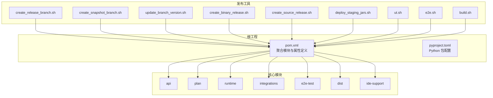
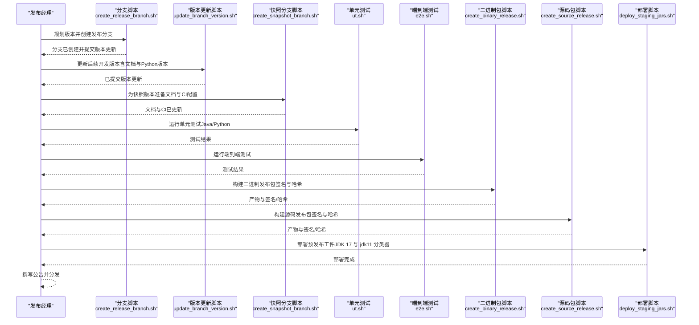
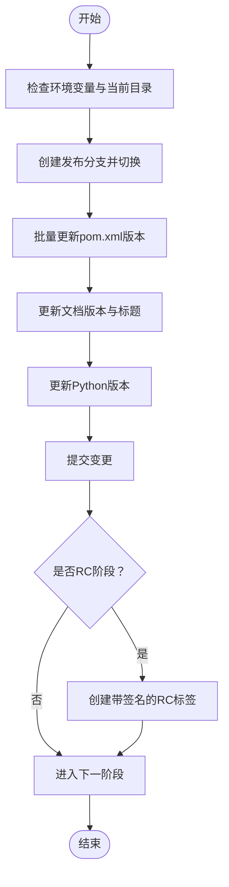
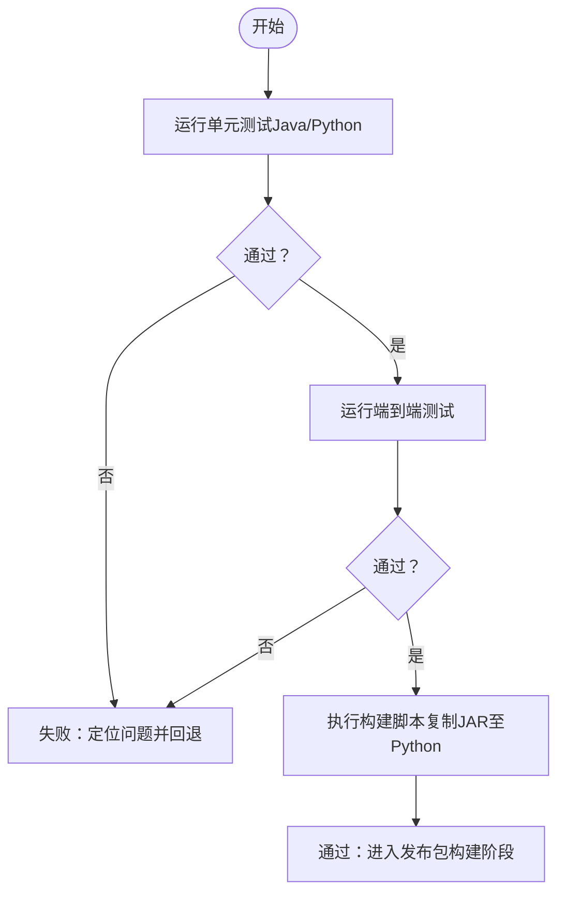
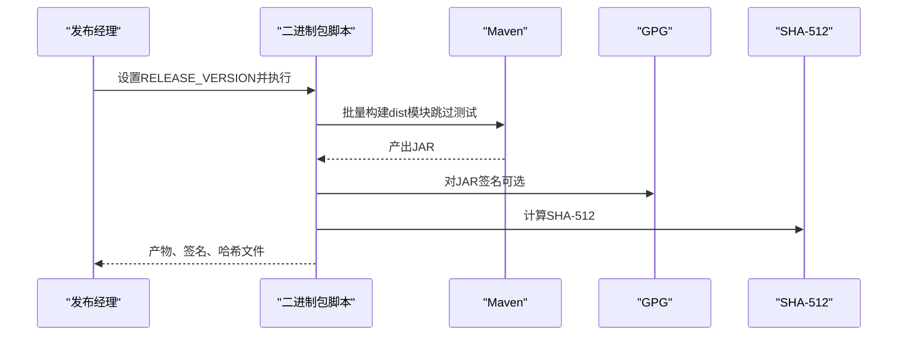
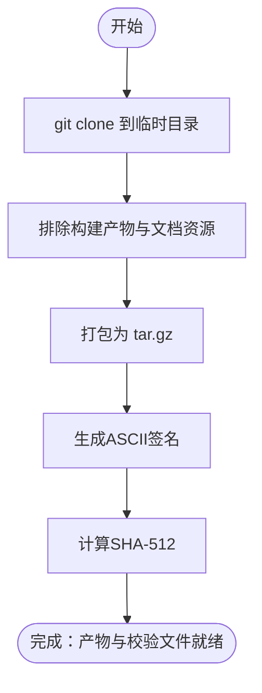
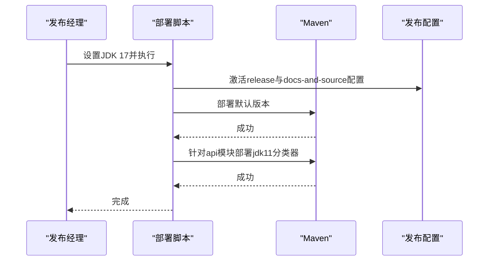
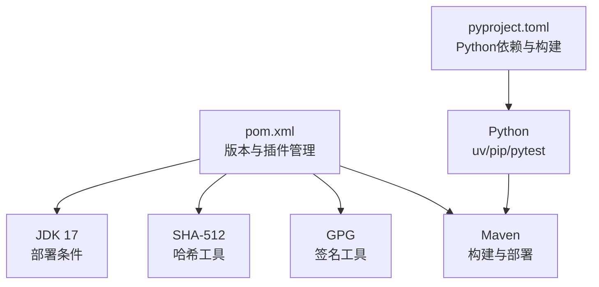

# 版本发布流程

<cite>
**本文引用的文件**
- [pom.xml](file://pom.xml)
- [pyproject.toml](file://python/pyproject.toml)
- [create_binary_release.sh](file://tools/releasing/create_binary_release.sh)
- [create_source_release.sh](file://tools/releasing/create_source_release.sh)
- [create_release_branch.sh](file://tools/releasing/create_release_branch.sh)
- [deploy_staging_jars.sh](file://tools/releasing/deploy_staging_jars.sh)
- [update_branch_version.sh](file://tools/releasing/update_branch_version.sh)
- [create_snapshot_branch.sh](file://tools/releasing/create_snapshot_branch.sh)
- [.asf.yaml](file://.asf.yaml)
- [README.md](file://README.md)
- [build.sh](file://tools/build.sh)
- [e2e.sh](file://tools/e2e.sh)
- [ut.sh](file://tools/ut.sh)
</cite>

## 目录
1. [简介](#简介)
2. [项目结构](#项目结构)
3. [核心组件](#核心组件)
4. [架构总览](#架构总览)
5. [详细组件分析](#详细组件分析)
6. [依赖关系分析](#依赖关系分析)
7. [性能考量](#性能考量)
8. [故障排查指南](#故障排查指南)
9. [结论](#结论)
10. [附录](#附录)

## 简介
本文件面向发布经理与高级贡献者，系统化梳理 Apache Flink Agents 项目的版本发布流程，覆盖发布前准备（版本号规划、变更日志整理、依赖检查）、发布分支创建与维护（代码冻结、回归测试）、二进制与源码发布包构建与校验（签名与完整性）、公告撰写与分发（邮件列表与社交媒体）、发布后维护（回滚与紧急修复）以及发布工具与自动化脚本的使用方法。内容严格基于仓库现有配置与脚本，确保可执行性与一致性。

## 项目结构
Flink Agents 采用多模块聚合工程组织，核心模块包括 API、计划（plan）、运行时（runtime）、集成（integrations）、端到端测试（e2e-test）、分发（dist）等；同时提供 Python 包管理与打包配置。发布工具集中在 tools/releasing 下，配套工具如构建、单元与端到端测试脚本位于 tools 目录。

图表来源
- [pom.xml](file://pom.xml#L58-L67)
- [pyproject.toml](file://python/pyproject.toml#L26-L60)
- [create_release_branch.sh](file://tools/releasing/create_release_branch.sh#L47-L76)
- [create_snapshot_branch.sh](file://tools/releasing/create_snapshot_branch.sh#L49-L95)
- [update_branch_version.sh](file://tools/releasing/update_branch_version.sh#L46-L63)
- [create_binary_release.sh](file://tools/releasing/create_binary_release.sh#L58-L94)
- [create_source_release.sh](file://tools/releasing/create_source_release.sh#L56-L82)
- [deploy_staging_jars.sh](file://tools/releasing/deploy_staging_jars.sh#L52-L75)
- [ut.sh](file://tools/ut.sh#L122-L196)
- [e2e.sh](file://tools/e2e.sh#L146-L165)
- [build.sh](file://tools/build.sh#L42-L85)

章节来源
- [pom.xml](file://pom.xml#L58-L67)
- [pyproject.toml](file://python/pyproject.toml#L26-L60)

## 核心组件
- 发布分支与版本管理脚本：负责创建/更新发布分支、版本号同步与文档版本更新。
- 发布包构建与校验脚本：负责二进制与源码包的生成、签名与哈希校验。
- 发布工件部署脚本：负责在指定 JDK 条件下部署多版本构件（默认与 jdk11 分类器）。
- 测试与构建工具：提供统一的 Java/Python 单元测试、端到端测试与本地构建流程，保障发布质量。

章节来源
- [create_release_branch.sh](file://tools/releasing/create_release_branch.sh#L47-L76)
- [create_snapshot_branch.sh](file://tools/releasing/create_snapshot_branch.sh#L49-L95)
- [update_branch_version.sh](file://tools/releasing/update_branch_version.sh#L46-L63)
- [create_binary_release.sh](file://tools/releasing/create_binary_release.sh#L58-L94)
- [create_source_release.sh](file://tools/releasing/create_source_release.sh#L56-L82)
- [deploy_staging_jars.sh](file://tools/releasing/deploy_staging_jars.sh#L38-L75)
- [ut.sh](file://tools/ut.sh#L122-L196)
- [e2e.sh](file://tools/e2e.sh#L146-L165)
- [build.sh](file://tools/build.sh#L42-L85)

## 架构总览
发布流程围绕“分支—构建—校验—部署—公告—维护”的闭环展开。下图展示从版本候选到正式发布的整体步骤与关键交互点。

图表来源
- [create_release_branch.sh](file://tools/releasing/create_release_branch.sh#L47-L76)
- [update_branch_version.sh](file://tools/releasing/update_branch_version.sh#L46-L63)
- [create_snapshot_branch.sh](file://tools/releasing/create_snapshot_branch.sh#L49-L95)
- [ut.sh](file://tools/ut.sh#L122-L196)
- [e2e.sh](file://tools/e2e.sh#L146-L165)
- [create_binary_release.sh](file://tools/releasing/create_binary_release.sh#L58-L94)
- [create_source_release.sh](file://tools/releasing/create_source_release.sh#L56-L82)
- [deploy_staging_jars.sh](file://tools/releasing/deploy_staging_jars.sh#L52-L75)

## 详细组件分析

### 发布分支创建与维护
- 创建发布分支：根据新版本号创建 release-x.y 分支，必要时追加 rc 候选号；批量更新所有 pom.xml 的版本，并同步文档与 Python 版本。
- 快照分支准备：在 main 上更新文档历史记录与 CI 配置，再切出 release-x.y 并设置分支专属文档参数。
- 后续版本更新：将开发版本更新为下一个快照版本，同步文档标题与 Python 版本标记。

图表来源
- [create_release_branch.sh](file://tools/releasing/create_release_branch.sh#L47-L76)
- [create_snapshot_branch.sh](file://tools/releasing/create_snapshot_branch.sh#L62-L90)
- [update_branch_version.sh](file://tools/releasing/update_branch_version.sh#L46-L63)

章节来源
- [create_release_branch.sh](file://tools/releasing/create_release_branch.sh#L26-L76)
- [create_snapshot_branch.sh](file://tools/releasing/create_snapshot_branch.sh#L49-L95)
- [update_branch_version.sh](file://tools/releasing/update_branch_version.sh#L25-L63)

### 发布前测试与回归验证
- 单元测试：支持 Java/Python 双栈测试，可按 Flink 版本选择运行范围，自动安装依赖并执行测试套件。
- 端到端测试：覆盖跨语言资源、ReAct 计划兼容性、配置互通等场景，确保发布质量。
- 构建脚本：统一 Java/Python 构建流程，自动复制分发 JAR 至 Python 包，便于本地验证。

图表来源
- [ut.sh](file://tools/ut.sh#L122-L196)
- [e2e.sh](file://tools/e2e.sh#L146-L165)
- [build.sh](file://tools/build.sh#L42-L85)

章节来源
- [ut.sh](file://tools/ut.sh#L122-L196)
- [e2e.sh](file://tools/e2e.sh#L146-L165)
- [build.sh](file://tools/build.sh#L42-L85)

### 二进制发布包构建与验证
- 多模块构建：动态发现 dist 子模块并打包，生成对应 JAR。
- 签名与哈希：对每个 JAR 生成 ASCII 签名与 SHA-512 校验值；支持跳过 GPG。
- Python 轮子处理：校验轮子命名一致性，生成签名与哈希。

图表来源
- [create_binary_release.sh](file://tools/releasing/create_binary_release.sh#L58-L94)

章节来源
- [create_binary_release.sh](file://tools/releasing/create_binary_release.sh#L23-L94)

### 源码发布包准备与上传
- 清洁克隆：在临时目录中进行干净克隆，排除构建产物与无关文件。
- 归档与校验：打包为 tar.gz，生成 ASCII 签名与 SHA-512 校验值。
- 上传：将产物与校验文件放置于发布目录，等待后续上传至发布站点。

图表来源
- [create_source_release.sh](file://tools/releasing/create_source_release.sh#L61-L79)

章节来源
- [create_source_release.sh](file://tools/releasing/create_source_release.sh#L23-L79)

### 发布工件部署与多版本支持
- JDK 条件：要求 JDK 17 进行部署，确保默认字节码版本。
- 多版本部署：先部署默认版本，再针对 api 模块以 jdk11 分类器单独部署，满足不同运行时需求。
- 文档与源码：在发布配置中启用文档与源码打包插件，确保 javadoc 与源码包随工件附带。

图表来源
- [deploy_staging_jars.sh](file://tools/releasing/deploy_staging_jars.sh#L38-L75)
- [pom.xml](file://pom.xml#L133-L250)

章节来源
- [deploy_staging_jars.sh](file://tools/releasing/deploy_staging_jars.sh#L38-L75)
- [pom.xml](file://pom.xml#L133-L250)

### 公告撰写与分发
- 邮件列表：根据 ASF 配置，向 commits@、issues@ 等邮件列表发送公告。
- 社交媒体：结合社区渠道（如 Slack）进行公告与讨论引导。
- 内容要点：版本号、主要特性、已知问题、升级指引、下载链接与校验信息。

章节来源
- [.asf.yaml](file://.asf.yaml#L52-L55)
- [README.md](file://README.md#L36-L44)

### 发布后维护与紧急修复
- 回滚机制：若发布后发现问题，依据版本标签与工件状态进行回滚或撤销。
- 紧急修复：在受影响分支上提交修复并重新打 RC，完成回归测试后再次发布。
- 文档与CI：确保文档版本与 CI 配置同步更新，避免用户混淆。

章节来源
- [create_release_branch.sh](file://tools/releasing/create_release_branch.sh#L71-L76)
- [create_snapshot_branch.sh](file://tools/releasing/create_snapshot_branch.sh#L62-L90)

## 依赖关系分析
- 版本与依赖管理：根 pom.xml 统一管理 Java 依赖与插件版本；Python 侧通过 pyproject.toml 管理依赖与构建工具。
- 插件与配置：发布配置启用 GPG 签名、Javadoc 与源码打包；测试配置覆盖 Java 与 Python 双栈。
- 工具链：Maven、GPG、SHA-512 工具、JDK 17、Python uv/pip、pytest 等。

图表来源
- [pom.xml](file://pom.xml#L37-L56)
- [pyproject.toml](file://python/pyproject.toml#L18-L60)
- [deploy_staging_jars.sh](file://tools/releasing/deploy_staging_jars.sh#L38-L43)
- [create_binary_release.sh](file://tools/releasing/create_binary_release.sh#L23-L47)

章节来源
- [pom.xml](file://pom.xml#L37-L56)
- [pyproject.toml](file://python/pyproject.toml#L18-L60)

## 性能考量
- 并行测试：单元测试脚本支持多版本并行运行，缩短回归周期。
- 本地构建优化：构建脚本自动复制 JAR 至 Python 包，减少重复打包时间。
- 发布包生成：二进制与源码包脚本仅处理必要文件，避免冗余产物。

## 故障排查指南
- 分支脚本错误
  - 症状：未从 tools 目录执行或未设置 NEW_VERSION/RELEASE_CANDIDATE。
  - 处理：确认当前目录为 tools，正确设置环境变量后重试。
- 快照分支冲突
  - 症状：release 分支或 PreviousDocs 已存在导致失败。
  - 处理：清理冲突分支或调整版本号后重试。
- 部署 JDK 不匹配
  - 症状：提示需要 JDK 17。
  - 处理：切换至 JDK 17 后重试。
- 二进制包签名失败
  - 症状：GPG 密钥不可用或 SKIP_GPG 未正确设置。
  - 处理：配置 GPG 或显式设置 SKIP_GPG=true。
- 源码包校验失败
  - 症状：平台差异导致哈希工具不一致。
  - 处理：确保使用脚本内检测的工具（macOS 使用 shasum -a 512，Linux 使用 sha512sum）。

章节来源
- [create_release_branch.sh](file://tools/releasing/create_release_branch.sh#L26-L41)
- [create_snapshot_branch.sh](file://tools/releasing/create_snapshot_branch.sh#L50-L60)
- [deploy_staging_jars.sh](file://tools/releasing/deploy_staging_jars.sh#L38-L43)
- [create_binary_release.sh](file://tools/releasing/create_binary_release.sh#L23-L47)
- [create_source_release.sh](file://tools/releasing/create_source_release.sh#L42-L46)

## 结论
本流程以脚本化与自动化为核心，覆盖从分支创建、测试验证到发布包生成与部署的全生命周期。通过严格的版本管理、签名与哈希校验、多版本工件支持以及清晰的公告与维护机制，确保发布过程可控、可追溯且高效。

## 附录
- 发布工具清单与用途
  - create_release_branch.sh：创建发布分支并同步版本
  - create_snapshot_branch.sh：准备快照版本文档与CI
  - update_branch_version.sh：更新后续开发版本
  - create_binary_release.sh：构建二进制发布包（签名与哈希）
  - create_source_release.sh：构建源码发布包（签名与哈希）
  - deploy_staging_jars.sh：部署预发布工件（JDK 17 与 jdk11 分类器）
  - ut.sh：统一运行 Java/Python 单元测试
  - e2e.sh：运行端到端测试
  - build.sh：统一构建 Java/Python 并复制 JAR 至 Python 包
- 关键配置参考
  - 根 pom.xml：版本、模块、插件与发布配置
  - Python pyproject.toml：包名、版本、依赖与构建工具
  - .asf.yaml：邮件列表与社区协作配置

章节来源
- [create_release_branch.sh](file://tools/releasing/create_release_branch.sh#L47-L76)
- [create_snapshot_branch.sh](file://tools/releasing/create_snapshot_branch.sh#L62-L90)
- [update_branch_version.sh](file://tools/releasing/update_branch_version.sh#L46-L63)
- [create_binary_release.sh](file://tools/releasing/create_binary_release.sh#L58-L94)
- [create_source_release.sh](file://tools/releasing/create_source_release.sh#L56-L82)
- [deploy_staging_jars.sh](file://tools/releasing/deploy_staging_jars.sh#L52-L75)
- [ut.sh](file://tools/ut.sh#L122-L196)
- [e2e.sh](file://tools/e2e.sh#L146-L165)
- [build.sh](file://tools/build.sh#L42-L85)
- [pom.xml](file://pom.xml#L37-L56)
- [pyproject.toml](file://python/pyproject.toml#L26-L60)
- [.asf.yaml](file://.asf.yaml#L52-L55)