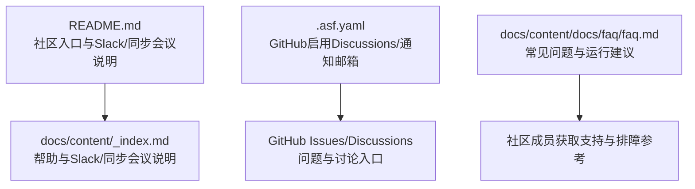
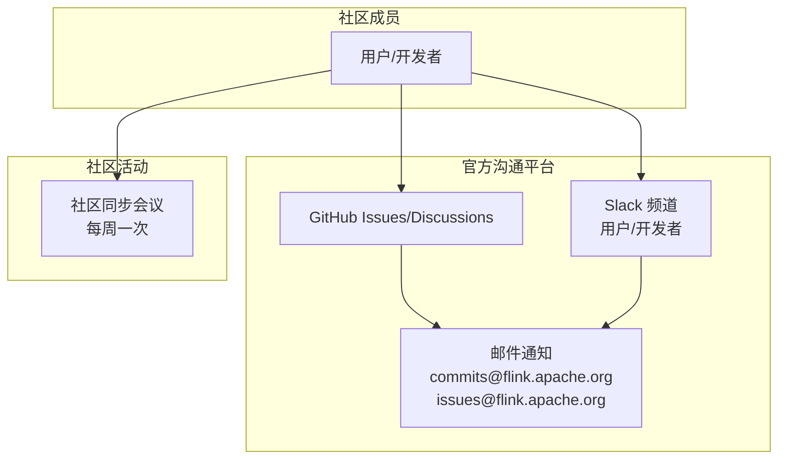
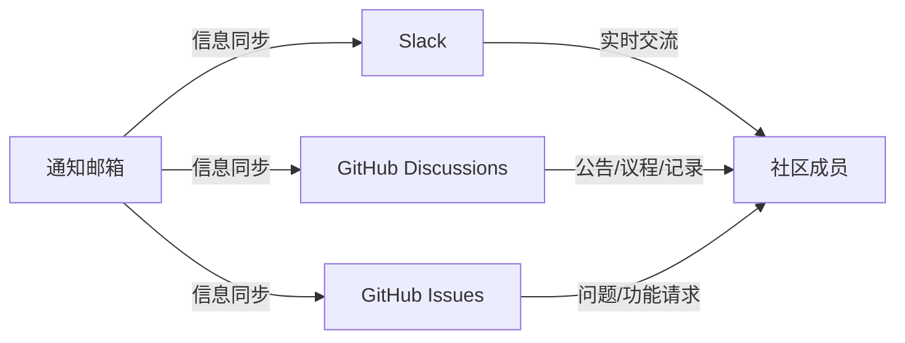

# 社区沟通渠道

<cite>
**本文引用的文件**
- [README.md](file://README.md)
- [.asf.yaml](file://.asf.yaml)
- [docs/content/_index.md](file://docs/content/_index.md)
- [docs/content/docs/faq/faq.md](file://docs/content/docs/faq/faq.md)
</cite>

## 目录
1. [简介](#简介)
2. [项目结构](#项目结构)
3. [核心组件](#核心组件)
4. [架构总览](#架构总览)
5. [详细组件分析](#详细组件分析)
6. [依赖分析](#依赖分析)
7. [性能考虑](#性能考虑)
8. [故障排查指南](#故障排查指南)
9. [结论](#结论)
10. [附录](#附录)

## 简介
本指南面向 Apache Flink Agents 社区成员，提供完整的沟通与协作路径：官方沟通平台（Slack）、GitHub 讨论区（Discussions）与问题跟踪（Issues）、社区同步会议安排、问题报告与功能请求流程、社区礼仪与沟通准则、社区活动与会议、技术支持与帮助获取途径，以及社区资源与学习材料推荐。内容基于仓库中已公开的社区信息进行整理，确保可操作与一致性。

## 项目结构
- 官方用户与开发者沟通渠道通过 README 与文档首页明确列出，包括 Slack 用户频道与开发者频道，以及每周社区同步会议的讨论页链接。
- 项目根配置文件中声明了 GitHub 仓库启用 Discussions 功能，并配置了通知邮箱，便于社区成员在不同渠道间保持信息同步。

**图表来源**
- [README.md](file://README.md#L36-L47)
- [docs/content/_index.md](file://docs/content/_index.md#L35-L47)
- [.asf.yaml](file://.asf.yaml#L36-L40)

**章节来源**
- [README.md](file://README.md#L36-L47)
- [docs/content/_index.md](file://docs/content/_index.md#L35-L47)
- [.asf.yaml](file://.asf.yaml#L36-L40)

## 核心组件
- Slack 工作区与频道
  - 用户频道用于用户讨论与故障排查
  - 开发者频道用于开发相关讨论
  - 加入方式与工作区入口由 Apache Flink 官网统一提供
- GitHub Discussions
  - 用于长期讨论、活动与会议议程、公告等
  - 社区同步会议的议程、日程与记录均在此页面维护
- GitHub Issues
  - 用于问题报告与功能请求
  - 项目配置启用了 Issues 功能
- 通知与协作
  - 项目配置了 commits/Issues/Pull Requests/Discussions 的通知邮箱，便于社区与项目管理信息同步

**章节来源**
- [README.md](file://README.md#L36-L47)
- [docs/content/_index.md](file://docs/content/_index.md#L35-L47)
- [.asf.yaml](file://.asf.yaml#L36-L56)

## 架构总览
下图展示了社区成员在不同沟通渠道之间的交互关系与信息流向：

**图表来源**
- [README.md](file://README.md#L36-L47)
- [docs/content/_index.md](file://docs/content/_index.md#L35-L47)
- [.asf.yaml](file://.asf.yaml#L52-L56)

## 详细组件分析

### Slack 使用指南与最佳实践
- 加入方式
  - 通过 Apache Flink 官网提供的入口加入 Slack 工作区
- 频道分工
  - 用户频道：面向用户的问题讨论与故障排查
  - 开发者频道：面向开发相关讨论
- 最佳实践
  - 提问前先检索历史消息，避免重复问题
  - 描述问题时提供最小可复现步骤、环境信息与期望/实际结果
  - 回答他人问题时保持尊重与专业，建设性交流

**章节来源**
- [README.md](file://README.md#L36-L41)
- [docs/content/_index.md](file://docs/content/_index.md#L35-L43)

### GitHub Discussions 使用指南与最佳实践
- 功能启用
  - 项目已启用 Discussions，可用于活动公告、会议议程与记录等
- 使用场景
  - 社区同步会议的议程、日程与记录集中于特定讨论页
- 最佳实践
  - 议题分类清晰，标题简洁明确
  - 重要公告与会议纪要及时更新，方便追溯

**章节来源**
- [.asf.yaml](file://.asf.yaml#L36-L40)
- [README.md](file://README.md#L42-L44)
- [docs/content/_index.md](file://docs/content/_index.md#L45-L47)

### GitHub Issues 使用指南与最佳实践
- 功能启用
  - 项目已启用 Issues，用于问题报告与功能请求
- 通知机制
  - commits、Issues、Pull Requests、Discussions 均有对应通知邮箱
- 报告与请求流程
  - 选择合适的模板或按示例格式描述问题/需求
  - 提供必要上下文（版本、环境、复现步骤、日志片段等）
  - 关注后续进展与维护者的反馈

**章节来源**
- [.asf.yaml](file://.asf.yaml#L36-L56)

### 社区同步会议
- 形式与频率
  - 每周在线同步会议，欢迎所有成员参加
- 资源位置
  - 议程、日程与往期记录集中于指定 GitHub 讨论页
- 参与建议
  - 提前查看议程，准备问题与建议
  - 会后关注会议纪要与行动项跟进

**章节来源**
- [README.md](file://README.md#L42-L44)
- [docs/content/_index.md](file://docs/content/_index.md#L45-L47)

### 问题报告与功能请求的正确渠道与格式要求
- 正确渠道
  - 一般问题与讨论：Slack 用户频道
  - 开发相关与技术细节：Slack 开发者频道
  - 正式问题与功能请求：GitHub Issues
  - 公告与活动：GitHub Discussions
- 基本格式要求（通用建议）
  - 标题简明，能快速识别问题类型
  - 正文包含：背景、复现步骤、期望结果、实际结果、环境信息（版本、操作系统、语言版本等）
  - 适当提供日志片段或截图，但注意脱敏敏感信息
  - 对于功能请求，说明使用场景与收益，有助于评估优先级

**章节来源**
- [README.md](file://README.md#L36-L47)
- [docs/content/_index.md](file://docs/content/_index.md#L35-L47)
- [.asf.yaml](file://.asf.yaml#L36-L56)

### 社区礼仪与沟通准则
- 尊重与包容
  - 尊重不同背景与经验水平的成员，避免人身攻击
- 专业与客观
  - 基于事实与证据进行讨论，避免情绪化表达
- 建设性交流
  - 积极提供解决方案或替代方案，而非仅指出问题
- 分类沟通
  - 在用户频道聚焦用户问题，在开发者频道聚焦技术细节

**章节来源**
- [README.md](file://README.md#L36-L41)
- [docs/content/_index.md](file://docs/content/_index.md#L35-L43)

### 社区活动与会议安排
- 社区同步会议
  - 每周一次，具体时间与议程以讨论页为准
  - 往期会议记录可在同一页面查阅
- 其他活动
  - 项目未在当前仓库信息中披露其他固定活动；请关注 Discussions 与通知邮箱获取最新动态

**章节来源**
- [README.md](file://README.md#L42-L44)
- [docs/content/_index.md](file://docs/content/_index.md#L45-L47)

### 技术支持与帮助获取途径
- 文档与常见问题
  - 官方用户文档与 FAQ 提供常见问题解答与运行建议
- 实战建议
  - 若遇到跨语言资源或运行环境相关问题，可参考 FAQ 中的环境与运行建议
- 获取帮助
  - 在 Slack 用户频道提出问题，或在 GitHub Issues 中提交正式问题单

**章节来源**
- [docs/content/docs/faq/faq.md](file://docs/content/docs/faq/faq.md#L28-L129)

### 社区资源与学习材料推荐
- 官方用户文档
  - 项目主页提供用户文档入口，适合入门与进阶学习
- 社区入口
  - README 与文档首页提供 Slack 与社区同步会议入口，便于快速融入

**章节来源**
- [README.md](file://README.md#L4-L5)
- [docs/content/_index.md](file://docs/content/_index.md#L25-L31)

## 依赖分析
- 渠道耦合关系
  - Slack 与 GitHub Discussions/Issues 互为补充：Slack 更适合实时交流，Discussions/Issues 更适合沉淀与追踪
  - 通知邮箱作为信息中枢，连接多个渠道，确保社区与项目管理信息同步
- 外部依赖
  - 加入 Slack 需遵循 Apache Flink 官网提供的工作区入口与规则

**图表来源**
- [README.md](file://README.md#L36-L47)
- [.asf.yaml](file://.asf.yaml#L52-L56)

**章节来源**
- [README.md](file://README.md#L36-L47)
- [.asf.yaml](file://.asf.yaml#L36-L56)

## 性能考虑
- 选择合适渠道以提升沟通效率
  - 日常问题与快速反馈：Slack 用户频道
  - 技术细节与长期讨论：Slack 开发者频道或 GitHub Discussions
  - 正式问题与功能请求：GitHub Issues
- 会议参与
  - 社区同步会议为定期同步，建议提前准备议题，减少无效讨论时间

## 故障排查指南
- 常见问题参考
  - FAQ 提供了 Python 环境、跨语言资源限制、异步执行与 JDK 版本等常见问题的说明与建议
- 排障建议
  - 在提问前先查阅 FAQ 与历史讨论，避免重复问题
  - 提供尽可能详细的环境与复现信息，便于他人快速定位

**章节来源**
- [docs/content/docs/faq/faq.md](file://docs/content/docs/faq/faq.md#L28-L129)

## 结论
通过明确的沟通渠道与规范，Apache Flink Agents 社区鼓励成员以尊重、专业与建设性的方式进行交流。Slack 适合实时互动，GitHub Discussions/Issues 适合沉淀与追踪，社区同步会议提供定期对齐机会。配合官方文档与 FAQ，成员可以高效获取支持、报告问题与贡献功能请求。

## 附录
- 快速链接
  - Slack 加入入口与频道说明：参见 README 与文档首页
  - 社区同步会议讨论页：参见 README 与文档首页
  - GitHub Issues/Discussions 启用与通知邮箱：参见 .asf.yaml