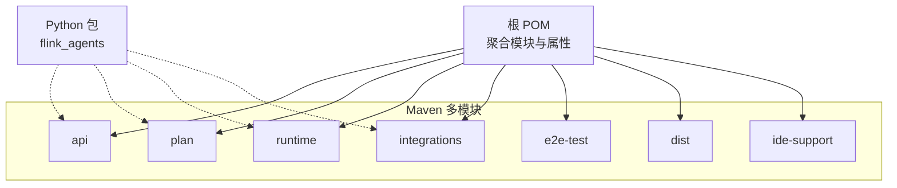
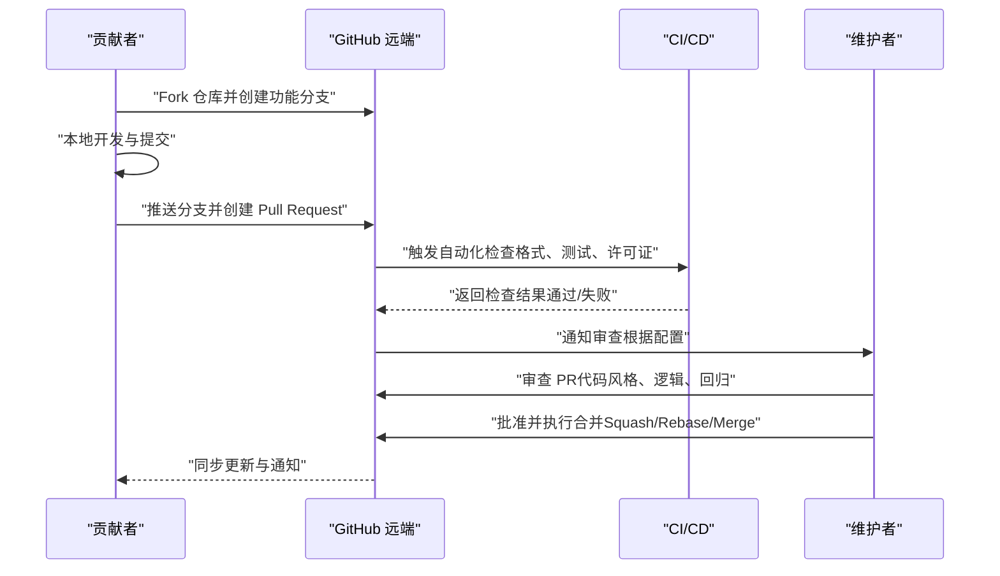
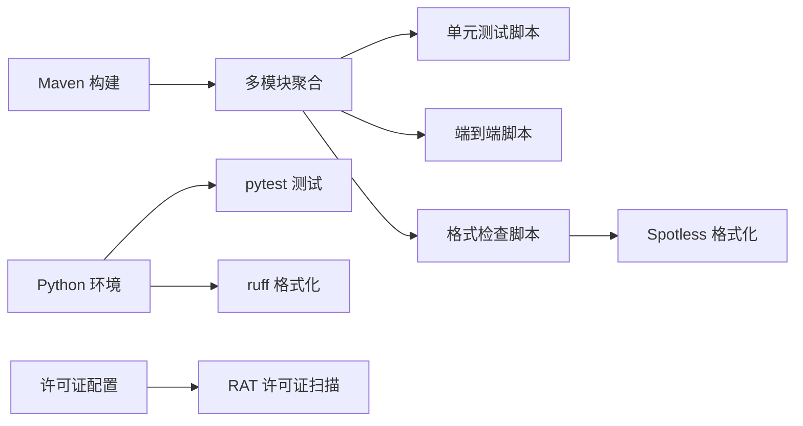

# 贡献流程与协作

<cite>
**本文引用的文件**
- [README.md](file://README.md)
- [.asf.yaml](file://.asf.yaml)
- [pom.xml](file://pom.xml)
- [.licenserc.yaml](file://.licenserc.yaml)
- [tools/check-license.sh](file://tools/check-license.sh)
- [tools/build.sh](file://tools/build.sh)
- [tools/ut.sh](file://tools/ut.sh)
- [tools/e2e.sh](file://tools/e2e.sh)
- [tools/lint.sh](file://tools/lint.sh)
- [docs/content/docs/development/workflow_agent.md](file://docs/content/docs/development/workflow_agent.md)
</cite>

## 目录
1. [引言](#引言)
2. [项目结构](#项目结构)
3. [核心组件](#核心组件)
4. [架构总览](#架构总览)
5. [详细组件分析](#详细组件分析)
6. [依赖分析](#依赖分析)
7. [性能考虑](#性能考虑)
8. [故障排查指南](#故障排查指南)
9. [结论](#结论)
10. [附录](#附录)

## 引言
本指南面向希望参与 Apache Flink Agents 项目开发的贡献者，系统化地阐述贡献流程、分支策略、Git 工作流、Pull Request 审查与合并、问题报告与功能请求模板、社区沟通渠道、版本发布流程、新贡献者入门与导师制度等。内容基于仓库现有脚本、配置与文档进行归纳总结，并结合 Apache 软件基金会（ASF）要求与实践，帮助贡献者高效、合规地参与协作。

## 项目结构
仓库采用多模块 Maven 结构，核心模块包括 API、计划（Plan）、运行时（Runtime）、集成（Integrations）、端到端测试（E2E Test）、分发包（Dist）与 IDE 支持等。同时提供 Python 包与工具链脚本，覆盖构建、单元测试、端到端测试、格式检查与许可证校验等。

图表来源
- [pom.xml](file://pom.xml#L58-L67)

章节来源
- [pom.xml](file://pom.xml#L1-L200)

## 核心组件
- 构建与测试脚本
  - 构建：统一构建 Java 与 Python 组件，复制分发 JAR 至 Python 库并打包 Wheel。
  - 单元测试：支持按语言、Flink 版本选择性运行，含端到端测试路径。
  - 端到端测试：跨语言资源与代理计划兼容性验证。
  - 代码格式与检查：Python 使用 ruff，Java 使用 Spotless；支持格式化与检查两种模式。
  - 许可证校验：通过 Apache RAT 检查文件头，生成报告并失败提示缺失头的文件。
- 社区与协作配置
  - GitHub 设置：启用 Issues、Discussions；默认允许 Squash/Merge 与 Rebase 合并；开启通知邮箱。
  - 项目描述、主页与标签：便于外部用户发现与定位。
- 开发文档
  - 工作流代理示例与事件驱动模型：提供 Python 与 Java 示例，说明动作（Action）、事件（Event）、持久化执行与异步执行等概念。

章节来源
- [tools/build.sh](file://tools/build.sh#L1-L86)
- [tools/ut.sh](file://tools/ut.sh#L1-L328)
- [tools/e2e.sh](file://tools/e2e.sh#L1-L166)
- [tools/lint.sh](file://tools/lint.sh#L1-L194)
- [tools/check-license.sh](file://tools/check-license.sh#L1-L88)
- [.asf.yaml](file://.asf.yaml#L16-L56)
- [docs/content/docs/development/workflow_agent.md](file://docs/content/docs/development/workflow_agent.md#L1-L451)

## 架构总览
下图展示贡献者在本地与远端协作的关键交互：从 Fork 与分支创建，到提交变更、推送与发起 PR，再到 CI/CD 自动化检查（格式、测试、许可证），最终由维护者完成审查与合并。

图表来源
- [.asf.yaml](file://.asf.yaml#L32-L35)
- [tools/lint.sh](file://tools/lint.sh#L131-L132)
- [tools/ut.sh](file://tools/ut.sh#L122-L196)
- [tools/check-license.sh](file://tools/check-license.sh#L72-L73)

## 详细组件分析

### 分支策略与 Git 工作流
- 主分支保护
  - 默认允许 Squash、Rebase 与 Merge 三种方式合并，建议优先使用 Squash 以保持提交历史整洁。
  - Issues 与 Discussions 已启用，便于问题跟踪与社区讨论。
- 功能分支创建
  - 建议基于最新主分支创建功能分支，命名清晰表达变更意图。
- 提交与推送
  - 提交前请确保通过格式检查与单元测试；如涉及端到端场景，建议本地先跑端到端脚本。
- 合并条件
  - 通过 CI 检查（格式、测试、许可证）；获得至少一名维护者批准；满足合并策略（Squash/Rebase/Merge）。

章节来源
- [.asf.yaml](file://.asf.yaml#L32-L35)
- [tools/lint.sh](file://tools/lint.sh#L131-L132)
- [tools/ut.sh](file://tools/ut.sh#L122-L196)
- [tools/check-license.sh](file://tools/check-license.sh#L72-L73)

### Pull Request 创建与审查流程
- 创建 PR
  - 在 GitHub 上从功能分支创建 PR，选择合适的目标分支（通常为主分支）。
  - 在 PR 描述中清晰说明变更动机、范围与影响，并关联相关 Issue。
- 代码审查标准
  - 代码风格：遵循项目格式规范（Python ruff、Java Spotless）。
  - 功能正确性：新增或修改逻辑需有充分测试覆盖；端到端场景优先。
  - 兼容性：避免破坏既有 API 或行为；必要时提供迁移指引。
  - 文档与注释：新增功能需补充文档或示例；复杂逻辑需有清晰注释。
- CI/CD 集成
  - 自动化检查包括：格式检查、单元测试、端到端测试、许可证头部校验。
  - 若 CI 失败，请在本地复现并修复后再推动 PR。
- 合并条件
  - CI 全部通过；至少一名维护者批准；遵循项目合并策略（Squash/Rebase/Merge）。

章节来源
- [.asf.yaml](file://.asf.yaml#L32-L35)
- [tools/lint.sh](file://tools/lint.sh#L131-L132)
- [tools/ut.sh](file://tools/ut.sh#L122-L196)
- [tools/e2e.sh](file://tools/e2e.sh#L1-L166)
- [tools/check-license.sh](file://tools/check-license.sh#L72-L73)

### 问题报告与功能请求模板与流程
- 问题报告（Bug）
  - 在 GitHub Issues 中新建问题，选择“Bug 报告”模板（若存在）。
  - 提供：环境信息（操作系统、Java/Python 版本、Flink 版本）、复现步骤、期望行为与实际行为、日志与截图（如适用）。
- 功能请求（Feature Request）
  - 选择“功能请求”模板（若存在），描述背景、需求与预期收益。
  - 可先行在 Discussions 中发起讨论，收集反馈后再转为正式 Issue。
- 社区沟通
  - Slack：用户与开发讨论频道见 README 中的链接与频道名。
  - GitHub Discussions：用于周会纪要、议程与过往记录查阅。

章节来源
- [README.md](file://README.md#L32-L44)
- [.asf.yaml](file://.asf.yaml#L37-L38)

### 社区沟通渠道
- Slack
  - 用户支持与排障：#flink-agents-user
  - 开发讨论：#flink-agents-dev
- GitHub Discussions
  - 周会安排、议程与往期记录在指定页面维护。
- 邮件列表
  - 通知与邮件列表：commits@flink.apache.org、issues@flink.apache.org、pullrequests@flink.apache.org、discussions@flink.apache.org

章节来源
- [README.md](file://README.md#L36-L44)
- [.asf.yaml](file://.asf.yaml#L52-L55)

### 版本发布流程（概览）
- 里程碑管理
  - 在 GitHub Releases 中创建里程碑，规划版本迭代与任务分配。
- 标签创建
  - 发布前创建对应版本标签（遵循语义化版本），并生成发布说明。
- 发布说明编写
  - 汇总重大变更、已修复问题、已知限制与升级指引。
- 发布后清理
  - 更新主分支版本号，维护文档与示例。

章节来源
- [pom.xml](file://pom.xml#L34-L34)

### 新贡献者入门与导师制度
- 入门步骤
  - 阅读用户文档与开发文档，理解工作流代理与事件驱动模型。
  - 准备本地环境（Unix-like、Git、Maven、Java 11、Python 3.10/3.11）。
  - 使用构建脚本完成首次构建，运行单元测试与端到端测试。
- 导师制度
  - 建议新贡献者在 Discussions 或 Slack 中寻找导师，或认领简单 Issue 作为切入点。
  - 优先从文档完善、小 Bug 修复与测试用例扩展开始，逐步深入核心模块。

章节来源
- [README.md](file://README.md#L7-L31)
- [docs/content/docs/development/workflow_agent.md](file://docs/content/docs/development/workflow_agent.md#L1-L451)

## 依赖分析
- 构建与测试工具链
  - Maven：多模块构建、插件与 Profile（含 Java 版本与发布配置）。
  - Python：uv 或 pip 管理依赖，pytest 运行测试，ruff 格式化。
  - Shell：统一脚本封装构建、测试、端到端与格式检查。
- 许可证与合规
  - SPDX 标识为 Apache-2.0，版权归属 Apache Software Foundation。
  - 通过 RAT 扫描确保源文件包含许可证头。

图表来源
- [pom.xml](file://pom.xml#L37-L56)
- [tools/build.sh](file://tools/build.sh#L44-L45)
- [tools/ut.sh](file://tools/ut.sh#L122-L196)
- [tools/e2e.sh](file://tools/e2e.sh#L147-L148)
- [tools/lint.sh](file://tools/lint.sh#L131-L132)
- [.licenserc.yaml](file://.licenserc.yaml#L18-L32)
- [tools/check-license.sh](file://tools/check-license.sh#L72-L73)

章节来源
- [pom.xml](file://pom.xml#L1-L200)
- [tools/build.sh](file://tools/build.sh#L1-L86)
- [tools/ut.sh](file://tools/ut.sh#L1-L328)
- [tools/e2e.sh](file://tools/e2e.sh#L1-L166)
- [tools/lint.sh](file://tools/lint.sh#L1-L194)
- [.licenserc.yaml](file://.licenserc.yaml#L1-L36)
- [tools/check-license.sh](file://tools/check-license.sh#L1-L88)

## 性能考虑
- 测试并行度与缓存
  - 单元测试脚本支持并行线程参数，合理设置以提升测试效率。
  - 端到端测试依赖外部服务（如 Ollama），建议在本地准备镜像与资源，减少网络抖动对测试的影响。
- 构建优化
  - 构建脚本自动复制分发 JAR 并安装至 Python Wheel，避免重复编译。
  - 根据需要选择仅构建 Java 或 Python 子系统，缩短迭代周期。
- 格式检查与许可证扫描
  - 将格式检查与许可证扫描纳入本地钩子或 CI，尽早发现问题，降低返工成本。

章节来源
- [tools/ut.sh](file://tools/ut.sh#L115-L120)
- [tools/build.sh](file://tools/build.sh#L44-L45)
- [tools/lint.sh](file://tools/lint.sh#L131-L132)
- [tools/check-license.sh](file://tools/check-license.sh#L72-L73)

## 故障排查指南
- 许可证头部缺失
  - 使用许可证检查脚本定位缺失头的文件，按模板添加 ASF 许可证头。
- 格式不一致
  - 使用格式检查脚本自动修复（格式模式）或仅检查（检查模式），确保 Python 与 Java 规范一致。
- 测试失败
  - 先在本地复现失败用例，确认是环境差异还是逻辑错误；针对端到端测试，检查外部依赖是否就绪。
- 构建失败
  - 检查 Java 版本与 Maven 配置；确认分发模块已正确安装；核对 Python 依赖与 Flink 版本匹配。

章节来源
- [tools/check-license.sh](file://tools/check-license.sh#L80-L87)
- [tools/lint.sh](file://tools/lint.sh#L143-L167)
- [tools/ut.sh](file://tools/ut.sh#L122-L196)
- [tools/e2e.sh](file://tools/e2e.sh#L147-L148)
- [tools/build.sh](file://tools/build.sh#L44-L45)

## 结论
本指南基于仓库现有脚本与配置，为贡献者提供了从环境准备、分支与 PR 流程、CI/CD 集成到问题报告与发布管理的完整协作路径。建议新贡献者从入门文档与简单任务开始，逐步参与核心模块开发；所有变更均应通过格式检查、测试与许可证校验，确保质量与合规。维护团队可通过 GitHub 设置与邮件通知体系，保障审查与沟通效率。

## 附录
- 快速参考
  - 构建：./tools/build.sh
  - 单测：./tools/ut.sh
  - 端到端：./tools/e2e.sh
  - 格式：./tools/lint.sh
  - 许可证：./tools/check-license.sh
- 社区与文档
  - 用户文档与开发文档入口见 README
  - Slack 频道与 Discussions 页面见 README 与 .asf.yaml