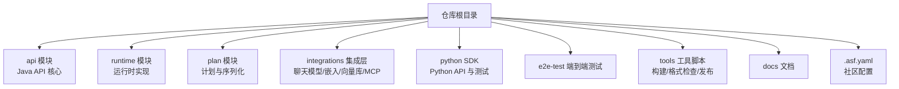
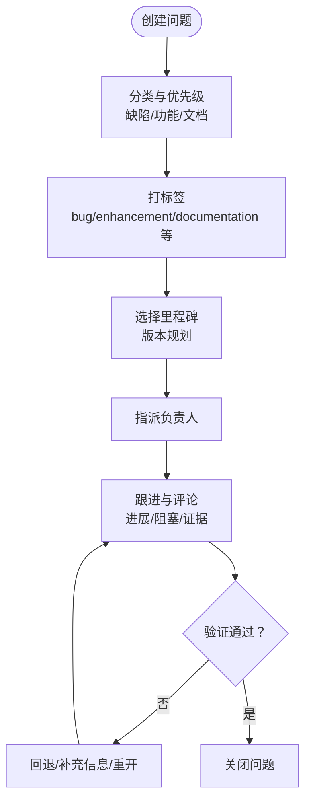
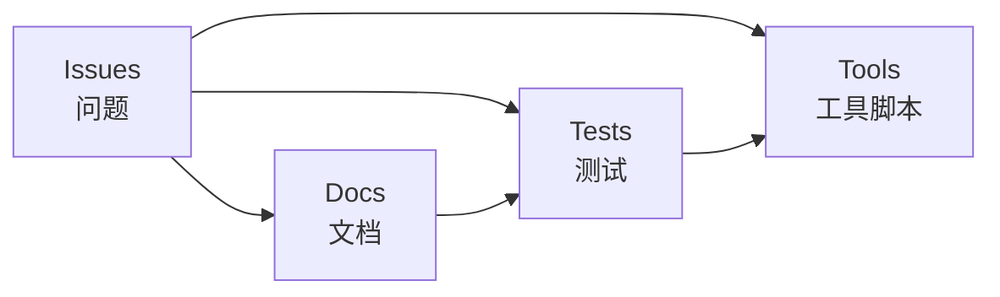

# 问题跟踪与管理

<cite>
**本文引用的文件**
- [README.md](file://README.md)
- [.asf.yaml](file://.asf.yaml)
- [docs/content/_index.md](file://docs/content/_index.md)
- [docs/content/docs/faq/faq.md](file://docs/content/docs/faq/faq.md)
- [docs/content/docs/development/_index.md](file://docs/content/docs/development/_index.md)
- [python/flink_agents/e2e_tests/e2e_tests_integration/python_event_logging_test.py](file://python/flink_agents/e2e_tests/e2e_tests_integration/python_event_logging_test.py)
- [integrations/mcp/src/main/java/org/apache/flink/agents/integrations/mcp/MCPContentExtractor.java](file://integrations/mcp/src/main/java/org/apache/flink/agents/integrations/mcp/MCPContentExtractor.java)
- [e2e-test/flink-agents-end-to-end-tests-integration/src/test/java/org/apache/flink/agents/integration/test/VectorStoreIntegrationTest.java](file://e2e-test/flink-agents-end-to-end-tests-integration/src/test/java/org/apache/flink/agents/integration/test/VectorStoreIntegrationTest.java)
- [tools/lint.sh](file://tools/lint.sh)
</cite>

## 目录
1. [简介](#简介)
2. [项目结构](#项目结构)
3. [核心组件](#核心组件)
4. [架构总览](#架构总览)
5. [详细组件分析](#详细组件分析)
6. [依赖关系分析](#依赖关系分析)
7. [性能考量](#性能考量)
8. [故障排查指南](#故障排查指南)
9. [结论](#结论)
10. [附录](#附录)

## 简介
本指南面向用户与贡献者，提供 Apache Flink Agents 项目的“问题跟踪与管理”操作手册。内容涵盖问题分类与优先级、报告模板与信息收集、分配与跟进流程（含标签与里程碑）、状态跟踪与关闭标准、讨论与沟通最佳实践、问题迁移与重复检测机制、统计与报告能力等，帮助团队高效协作、提升问题解决质量与透明度。

## 项目结构
- 仓库采用多模块结构，包含 Java API、Python SDK、运行时、集成适配层、端到端测试与工具脚本等。
- 社区沟通渠道通过 GitHub Issues 与 Discussions 开启，并在 ASF 配置中启用 Issues 与 Discussions 功能；同时提供 Slack 频道用于用户与开发者交流。

图表来源
- [README.md](file://README.md#L1-L44)
- [.asf.yaml](file://.asf.yaml#L16-L56)

章节来源
- [README.md](file://README.md#L1-L44)
- [.asf.yaml](file://.asf.yaml#L16-L56)

## 核心组件
- 问题分类：缺陷（Bug）、功能请求（Feature）、文档改进（Documentation）。
- 优先级：P0（阻塞性）、P1（高）、P2（中）、P3（低），建议结合影响范围与紧急程度评估。
- 报告模板：必填字段包括“重现步骤、预期行为、实际行为、环境信息、日志/截图/最小复现示例链接”。
- 分配与跟进：使用标签（如 bug、enhancement、documentation、good first issue、help wanted）与里程碑（milestone）管理；指派负责人并定期更新进度。
- 关闭标准：问题得到修复或验证、用户确认解决、或被合理地迁移/归档。
- 统计与报告：基于标签、里程碑、时间窗口生成问题趋势、解决时延、活跃度等指标。

章节来源
- [README.md](file://README.md#L32-L44)
- [.asf.yaml](file://.asf.yaml#L16-L56)

## 架构总览
下图展示问题生命周期与关键交互点：从问题创建、标签与里程碑标注、分配与跟进，到验证与关闭；同时体现与文档、测试、工具脚本的关联。

图表来源
- [.asf.yaml](file://.asf.yaml#L16-L56)
- [README.md](file://README.md#L32-L44)

## 详细组件分析

### 问题分类与优先级
- 缺陷（Bug）
  - 行为异常、崩溃、数据错误、兼容性问题等。
  - 建议优先级 P0-P2，依据对生产/测试的影响程度。
- 功能请求（Feature）
  - 新能力、API 扩展、集成支持等。
  - 建议优先级 P1-P3，结合社区需求与资源评估。
- 文档改进（Documentation）
  - 文档缺失、过时、不清晰、示例错误等。
  - 建议优先级 P1-P2，保障用户与贡献者体验。

章节来源
- [README.md](file://README.md#L32-L44)

### 问题报告模板与信息收集
- 必填信息清单
  - 重现步骤：具体、可复现、按顺序列出。
  - 预期行为：明确期望结果。
  - 实际行为：描述真实结果与异常表现。
  - 环境信息：操作系统、Java/Python 版本、Flink 版本、集成组件版本。
  - 日志与截图：关键错误日志、堆栈、UI 截图、事件日志片段。
  - 最小复现示例：可运行的最小代码或命令行示例链接。
- 示例参考
  - 事件日志结构与字段校验可作为“最小证据”的参考来源之一，便于定位问题与验证修复。

章节来源
- [python/flink_agents/e2e_tests/e2e_tests_integration/python_event_logging_test.py](file://python/flink_agents/e2e_tests/e2e_tests_integration/python_event_logging_test.py#L107-L142)

### 标签体系与里程碑管理
- 标签建议
  - 类别：bug、enhancement、documentation、question
  - 资源：help wanted、good first issue、up-for-grabs
  - 影响面：security、performance、compatibility
  - 开发相关：needs-triage、needs-reproduction、reproducer-wanted
- 里程碑（Milestone）
  - 与版本发布节奏绑定，用于追踪计划内完成项。
  - 建议按季度/功能迭代设定里程碑，避免过度细化导致维护成本上升。

章节来源
- [.asf.yaml](file://.asf.yaml#L16-L56)

### 分配与跟进流程
- 分配
  - 初审由维护者负责，必要时转交领域专家。
  - 首次响应时限建议：工作日 24 小时内；非紧急问题 48-72 小时内。
- 跟进
  - 使用评论记录进展、阻塞原因、证据链接。
  - 引用相关 PR/提交以建立线索链路。
- 状态更新
  - 未处理：新建/待复现
  - 处理中：已分配/正在修复
  - 待验证：已修复/等待回归
  - 已关闭：已验证/已迁移/已归档

章节来源
- [README.md](file://README.md#L32-L44)

### 问题状态跟踪与关闭标准
- 状态可视化
  - 仪表板建议包含：总数、按标签分布、按优先级分布、平均解决时长、滞留超期数。
- 关闭标准
  - 已修复并通过回归验证；
  - 用户确认问题解决；
  - 迁移至更高优先级或更合适的仓库；
  - 无进一步价值或重复问题归档。

章节来源
- [README.md](file://README.md#L32-L44)

### 讨论与沟通最佳实践
- 回复时效性
  - 首次响应：工作日 24 小时内；非紧急 48-72 小时内。
- 证据提供
  - 日志、最小复现、截图、视频演示、对比结果。
- 沟通渠道
  - 用户问题优先在 Issues 提交；复杂场景可在 Discussions 或 Slack 频道先行沟通，再沉淀到 Issue。

章节来源
- [README.md](file://README.md#L32-L44)
- [docs/content/_index.md](file://docs/content/_index.md#L40-L46)

### 问题迁移与重复检测机制
- 重复检测
  - 在创建前进行关键词检索与相关问题比对，避免重复。
  - 对相似问题建议合并或引用，保留原始上下文。
- 迁移
  - 当问题涉及其他仓库（如上游依赖或文档子项目）时，应迁移至合适位置并保留证据链。
  - 迁移后在原问题中添加指向新位置的链接。

章节来源
- [README.md](file://README.md#L32-L44)

### 统计与报告功能
- 可视化建议
  - 按周/月统计问题创建、关闭、滞留数量；
  - 按标签与优先级拆分趋势；
  - 平均解决时长与首次响应时长；
  - 重复问题占比与迁移率。
- 数据来源
  - GitHub Issues 的标签、里程碑、时间戳、评论与附件。

章节来源
- [.asf.yaml](file://.asf.yaml#L16-L56)

## 依赖关系分析
- 问题管理与文档、测试、工具脚本的耦合关系如下：
  - 文档（FAQ/开发指南）为问题提供背景知识与参考路径；
  - 测试（单元/集成/端到端）为问题验证与回归提供证据；
  - 工具脚本（格式检查/构建）为问题修复与验证提供基础环境一致性。

图表来源
- [docs/content/docs/faq/faq.md](file://docs/content/docs/faq/faq.md#L28-L129)
- [tools/lint.sh](file://tools/lint.sh#L35-L193)

章节来源
- [docs/content/docs/faq/faq.md](file://docs/content/docs/faq/faq.md#L28-L129)
- [tools/lint.sh](file://tools/lint.sh#L35-L193)

## 性能考量
- 问题生命周期效率
  - 明确的首响应时限与标签策略可降低等待成本；
  - 合理的里程碑拆分避免积压与返工。
- 验证与回归
  - 结合端到端测试与事件日志校验，缩短回归周期；
  - 对跨语言/跨组件问题，优先在受控环境中验证，减少现场不确定性。

章节来源
- [python/flink_agents/e2e_tests/e2e_tests_integration/python_event_logging_test.py](file://python/flink_agents/e2e_tests/e2e_tests_integration/python_event_logging_test.py#L107-L142)
- [e2e-test/flink-agents-end-to-end-tests-integration/src/test/java/org/apache/flink/agents/integration/test/VectorStoreIntegrationTest.java](file://e2e-test/flink-agents-end-to-end-tests-integration/src/test/java/org/apache/flink/agents/integration/test/VectorStoreIntegrationTest.java#L101-L121)

## 故障排查指南
- 常见问题定位思路
  - 事件日志结构与字段校验：参考事件日志测试，确保日志包含时间戳、事件类型、属性等关键字段。
  - 内容提取与资源解析：MCP 内容提取器展示了对文本、图片、嵌入资源的规范化处理，有助于排查内容型问题。
- 证据收集要点
  - 保存最小可复现示例与对应日志；
  - 明确环境差异（Java/Python 版本、集成组件版本）；
  - 若为跨语言问题，提供本地与集群模式下的行为对比。

章节来源
- [python/flink_agents/e2e_tests/e2e_tests_integration/python_event_logging_test.py](file://python/flink_agents/e2e_tests/e2e_tests_integration/python_event_logging_test.py#L107-L142)
- [integrations/mcp/src/main/java/org/apache/flink/agents/integrations/mcp/MCPContentExtractor.java](file://integrations/mcp/src/main/java/org/apache/flink/agents/integrations/mcp/MCPContentExtractor.java#L34-L106)

## 结论
通过规范的问题分类与优先级、标准化的报告模板与证据收集、清晰的标签与里程碑管理、严格的分配与跟进流程、明确的状态跟踪与关闭标准，以及良好的讨论与沟通实践，Apache Flink Agents 项目可以显著提升问题处理效率与透明度。配合文档、测试与工具脚本的协同，形成闭环的质量保障体系。

## 附录
- 社区与沟通
  - Slack 频道：用户讨论与排障、开发者讨论；
  - 讨论区：周会安排、议程与记录。
- 开发与贡献
  - 贡献指南与构建说明；
  - 文档构建与本地预览方法。

章节来源
- [README.md](file://README.md#L32-L44)
- [docs/content/_index.md](file://docs/content/_index.md#L40-L46)
- [docs/content/docs/development/_index.md](file://docs/content/docs/development/_index.md#L1-L25)