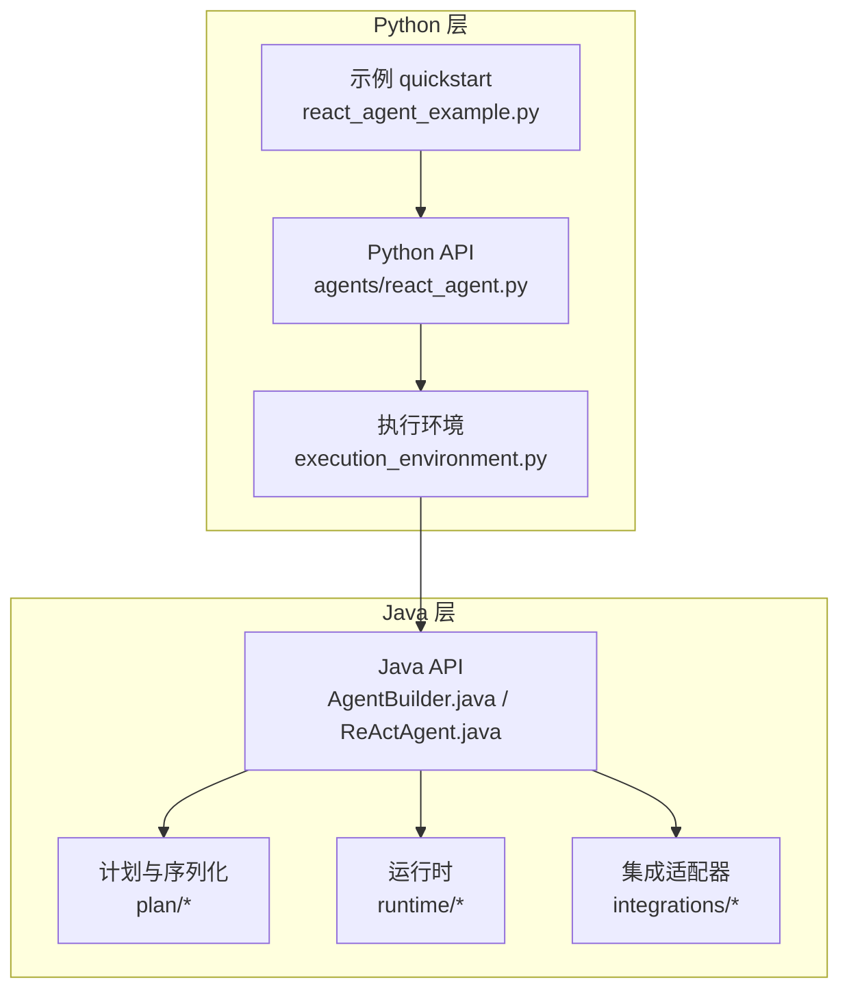
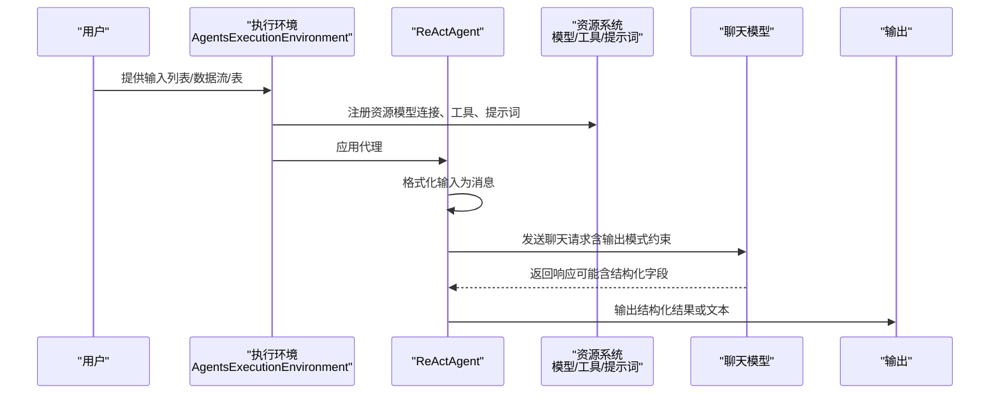
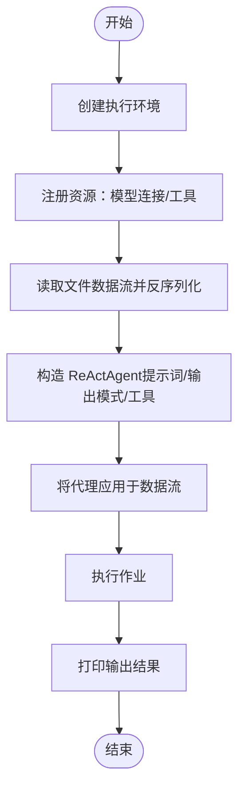
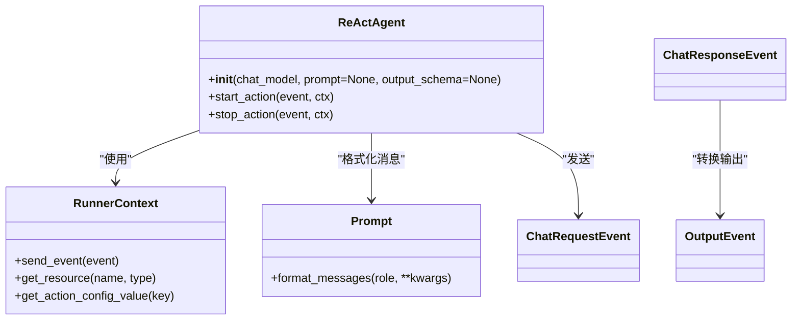
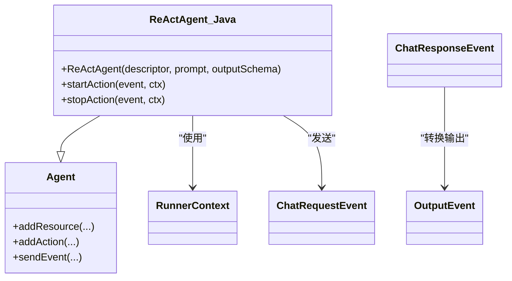
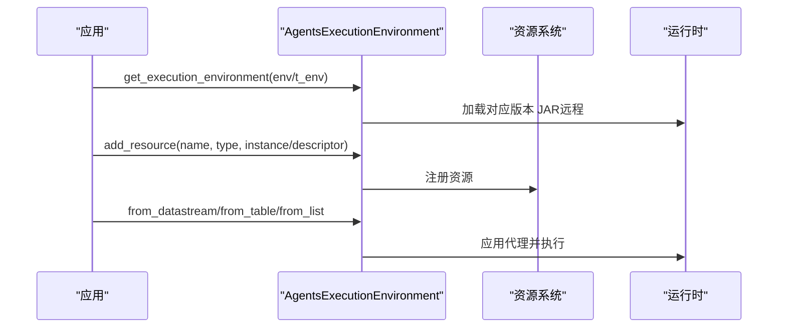
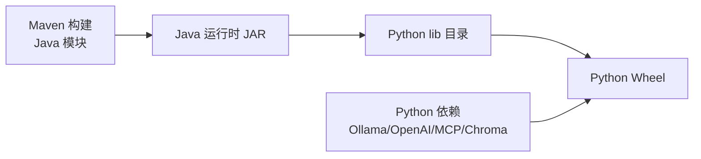

# 快速开始

<cite>
**本文引用的文件**
- [README.md](file://README.md)
- [pom.xml](file://pom.xml)
- [pyproject.toml](file://python/pyproject.toml)
- [build.sh](file://tools/build.sh)
- [react_agent.py](file://python/flink_agents/api/agents/react_agent.py)
- [react_agent_example.py](file://python/flink_agents/examples/quickstart/react_agent_example.py)
- [custom_types_and_resources.py](file://python/flink_agents/examples/quickstart/agents/custom_types_and_resources.py)
- [react_agent_test.py](file://python/flink_agents/e2e_tests/e2e_tests_integration/react_agent_test.py)
- [execution_environment.py](file://python/flink_agents/api/execution_environment.py)
- [AgentBuilder.java](file://api/src/main/java/org/apache/flink/agents/api/AgentBuilder.java)
- [ReActAgent.java](file://api/src/main/java/org/apache/flink/agents/api/agents/ReActAgent.java)
</cite>

## 目录
1. [简介](#简介)
2. [项目结构](#项目结构)
3. [核心组件](#核心组件)
4. [架构总览](#架构总览)
5. [详细组件分析](#详细组件分析)
6. [依赖关系分析](#依赖关系分析)
7. [性能注意事项](#性能注意事项)
8. [故障排除指南](#故障排除指南)
9. [结论](#结论)
10. [附录](#附录)

## 简介
本指南面向初学者，带你快速上手 Apache Flink Agents。你将完成环境准备、安装构建、运行第一个 ReAct 代理（聊天 + 工具调用），并了解常见配置与问题排查方法。示例基于 Python API，可直接在本地或远程 Flink 环境中运行。

## 项目结构
仓库采用多模块结构，核心模块包括：
- api：Java 与 Python 双栈 API 定义与基础能力
- plan：代理计划序列化/反序列化与资源提供者
- runtime：运行时（本地/远程）与事件日志、度量等
- integrations：与外部模型/向量库等集成（如 Ollama、OpenAI、Chroma 等）
- python：Python 包与示例、端到端测试
- tools：构建脚本与工具
- e2e-test：端到端测试模块

图表来源
- [react_agent.py](file://python/flink_agents/api/agents/react_agent.py#L42-L212)
- [execution_environment.py](file://python/flink_agents/api/execution_environment.py#L91-L253)
- [AgentBuilder.java](file://api/src/main/java/org/apache/flink/agents/api/AgentBuilder.java#L29-L77)
- [ReActAgent.java](file://api/src/main/java/org/apache/flink/agents/api/agents/ReActAgent.java#L50-L183)

章节来源
- [README.md](file://README.md#L1-L44)
- [pom.xml](file://pom.xml#L58-L67)

## 核心组件
- ReActAgent（Python）：内置的“思考-行动-观察”代理实现，基于大模型函数/工具调用能力，自动解析结构化输出。
- ReActAgent（Java）：Java 版本的 ReAct 实现，负责将输入转换为消息列表、发送聊天请求、接收响应并输出。
- 执行环境（AgentsExecutionEnvironment）：统一接入本地/远程 Flink 环境，注册资源、配置参数、发起执行。
- AgentBuilder（Java）：在数据流/表上应用代理并产出 List/DataStream/Table 结果。
- 资源系统：连接模型（Chat Model）、工具（Tool）、提示词（Prompt）、向量库等。

章节来源
- [react_agent.py](file://python/flink_agents/api/agents/react_agent.py#L42-L212)
- [ReActAgent.java](file://api/src/main/java/org/apache/flink/agents/api/agents/ReActAgent.java#L50-L183)
- [execution_environment.py](file://python/flink_agents/api/execution_environment.py#L91-L253)
- [AgentBuilder.java](file://api/src/main/java/org/apache/flink/agents/api/AgentBuilder.java#L29-L77)

## 架构总览
下图展示了从输入到输出的关键流程：数据进入执行环境 → 注册资源（模型/工具/提示词）→ 代理将输入格式化为消息 → 发送聊天请求 → 接收响应并按需解析结构化输出 → 输出到 List/DataStream/Table。

图表来源
- [react_agent.py](file://python/flink_agents/api/agents/react_agent.py#L144-L212)
- [execution_environment.py](file://python/flink_agents/api/execution_environment.py#L108-L227)

## 详细组件分析

### 环境准备与安装
- 操作系统：类 Unix 环境（Linux、macOS、WSL/Cygwin）
- 软件版本要求
  - Java：11+
  - Python：3.10 或 3.11
  - Maven：用于构建 Java 组件
  - Git：克隆仓库
- 安装步骤
  1) 克隆仓库
     - 使用 Git 克隆项目到本地
  2) 构建项目
     - 使用提供的构建脚本同时构建 Java 与 Python 部分，并将 Java 产物打包进 Python Wheel
- 运行第一个 ReAct 代理
  - 示例位于 Python 包内，演示了从文件读取 JSON 行、反序列化为 Pydantic 模型、交给 ReActAgent 分析、并在需要时调用工具通知物流管理。

章节来源
- [README.md](file://README.md#L9-L28)
- [pyproject.toml](file://python/pyproject.toml#L32-L32)
- [pom.xml](file://pom.xml#L39-L42)
- [build.sh](file://tools/build.sh#L43-L86)
- [react_agent_example.py](file://python/flink_agents/examples/quickstart/react_agent_example.py#L43-L118)

### 第一个 ReAct 代理：聊天 + 工具调用
- 场景描述
  - 从文件读取产品评论（每行一条 JSON），反序列化为 Pydantic 模型后，交由 ReActAgent 分析评分与不满原因；若涉及物流问题，则调用工具通知物流管理。
- 关键步骤
  1) 创建 Flink 流执行环境与 Agents 执行环境
  2) 注册资源：聊天模型连接、工具（通知物流管理）
  3) 读取文件数据流并映射为 Pydantic 模型
  4) 构造 ReActAgent（指定聊天模型资源、提示词、输出模式）
  5) 将代理应用于数据流并输出到控制台
  6) 执行作业
- 预期输出
  - 控制台打印每条记录的分析结果（包含评分与原因），若触发工具则会打印对应通知信息。

图表来源
- [react_agent_example.py](file://python/flink_agents/examples/quickstart/react_agent_example.py#L53-L118)
- [custom_types_and_resources.py](file://python/flink_agents/examples/quickstart/agents/custom_types_and_resources.py#L26-L88)

章节来源
- [react_agent_example.py](file://python/flink_agents/examples/quickstart/react_agent_example.py#L43-L118)
- [custom_types_and_resources.py](file://python/flink_agents/examples/quickstart/agents/custom_types_and_resources.py#L26-L132)

### Python ReActAgent 实现要点
- 初始化
  - 接收 chat_model（资源描述符）、prompt（可选）、output_schema（Pydantic 类或 RowTypeInfo）
  - 自动注入默认系统提示（约束输出 JSON 模式）与用户提示
  - 注册动作：start_action（输入事件）与 stop_action（响应事件）
- 输入处理
  - 支持原始类型（布尔/字符串/整数/浮点/空）与复杂对象（Row/Pydantic BaseModel）
  - 复杂对象通过提示词模板填充字段
- 输出处理
  - 若响应携带结构化输出字段，则优先使用；否则回退为纯文本内容
- 工具调用
  - 通过聊天模型的函数/工具调用能力直接执行，无需手动解析文本

图表来源
- [react_agent.py](file://python/flink_agents/api/agents/react_agent.py#L97-L212)

章节来源
- [react_agent.py](file://python/flink_agents/api/agents/react_agent.py#L97-L212)

### Java ReActAgent 实现要点
- 初始化
  - 注入默认聊天模型资源与可选的用户提示与输出模式提示
  - 注册内部动作（startAction）监听输入事件
- 输入处理
  - 对原始类型直接转为消息；对复杂对象（Row/POJO）通过提示词模板生成消息
  - 在存在输出模式时，在消息序列前插入系统级模式约束
- 响应处理
  - 从响应中提取结构化输出或回退为文本内容
  - 发出最终输出事件

图表来源
- [ReActAgent.java](file://api/src/main/java/org/apache/flink/agents/api/agents/ReActAgent.java#L59-L183)
- [AgentBuilder.java](file://api/src/main/java/org/apache/flink/agents/api/AgentBuilder.java#L29-L77)

章节来源
- [ReActAgent.java](file://api/src/main/java/org/apache/flink/agents/api/agents/ReActAgent.java#L59-L183)
- [AgentBuilder.java](file://api/src/main/java/org/apache/flink/agents/api/AgentBuilder.java#L29-L77)

### 执行环境与资源注册
- 获取执行环境
  - 无 Flink 环境参数时返回本地执行环境
  - 传入 Flink 环境时返回远程执行环境，并自动加载对应版本的 Java 运行时 JAR
- 注册资源
  - 支持多种资源类型：聊天模型连接/设置、工具、提示词、向量库等
  - 同一类型资源名称需唯一
- 数据接入
  - 支持 from_list（本地）、from_datastream（远程）、from_table（远程）

图表来源
- [execution_environment.py](file://python/flink_agents/api/execution_environment.py#L108-L227)

章节来源
- [execution_environment.py](file://python/flink_agents/api/execution_environment.py#L108-L227)

### 端到端测试参考
- 测试场景
  - 本地运行：使用本地执行环境，注册 Ollama 连接与加法/乘法工具，验证输出结构化结果
  - 远程运行：在 Table 环境中执行，将结果写入文件系统 sink
- 关键配置
  - 错误处理策略与重试次数
  - 输出模式（Pydantic/RowTypeInfo）与提示词模板

章节来源
- [react_agent_test.py](file://python/flink_agents/e2e_tests/e2e_tests_integration/react_agent_test.py#L78-L240)

## 依赖关系分析
- 版本与兼容性
  - Java 目标版本：11
  - Flink 版本：2.2.0
  - Python 支持：3.10/3.11
- 构建与打包
  - Maven 管理 Java 模块与依赖
  - 构建脚本同步复制 Java 产物至 Python lib 并构建 Wheel
- 运行时依赖
  - Python 侧包含模型 SDK（如 Ollama/OpenAI/Anthropic）、向量库（如 Chroma）、MCP 等

图表来源
- [pom.xml](file://pom.xml#L39-L44)
- [pyproject.toml](file://python/pyproject.toml#L44-L59)
- [build.sh](file://tools/build.sh#L54-L86)

章节来源
- [pom.xml](file://pom.xml#L39-L44)
- [pyproject.toml](file://python/pyproject.toml#L44-L59)
- [build.sh](file://tools/build.sh#L54-L86)

## 性能注意事项
- 异步并发
  - 可通过配置限制异步线程数量，避免过载本地模型服务（例如 Ollama）
- 输出模式
  - 显式提供输出模式（Pydantic/RowTypeInfo）有助于减少 LLM 生成偏差，提高稳定性
- 数据分区与键选择
  - 在远程执行环境中合理选择 KeySelector，保证状态与并行度可控

章节来源
- [react_agent_example.py](file://python/flink_agents/examples/quickstart/react_agent_example.py#L57-L59)

## 故障排除指南
- Java 版本不匹配
  - 症状：构建失败或运行时报错
  - 处理：确保使用 Java 11+，必要时切换 JDK 版本
- Python 版本不匹配
  - 症状：pip/uv 安装失败或运行时报错
  - 处理：使用 Python 3.10 或 3.11
- 缺少模型服务
  - 症状：测试或示例无法连接 Ollama
  - 处理：启动本地 Ollama 服务并拉取所需模型（示例中使用 qwen3 系列）
- 远程执行找不到 JAR
  - 症状：远程执行时报错，提示未找到对应版本的 dist JAR
  - 处理：先执行构建脚本，确保 Java 产物已复制到 Python lib；确认 Flink 主版本号与 lib 子目录一致
- 输出模式不匹配
  - 症状：测试断言失败，提示 LLM 响应不符合输出模式
  - 处理：完善提示词中的输出示例与约束，或调整输出模式定义
- 资源名称冲突
  - 症状：注册同名资源时报错
  - 处理：为不同资源使用唯一名称

章节来源
- [README.md](file://README.md#L9-L28)
- [pyproject.toml](file://python/pyproject.toml#L32-L32)
- [pom.xml](file://pom.xml#L39-L42)
- [execution_environment.py](file://python/flink_agents/api/execution_environment.py#L134-L154)
- [react_agent_test.py](file://python/flink_agents/e2e_tests/e2e_tests_integration/react_agent_test.py#L130-L138)

## 结论
通过本指南，你已完成环境准备、安装构建，并成功运行了第一个 ReAct 代理示例。建议在掌握基础后，尝试扩展更多工具、优化提示词与输出模式，并结合实际业务数据进行集成。

## 附录
- 快速命令摘要
  - 克隆：git clone https://github.com/apache/flink-agents.git
  - 构建：./tools/build.sh
  - 运行示例：在 Python 示例目录执行主程序入口
- 参考文件路径
  - 示例入口：python/flink_agents/examples/quickstart/react_agent_example.py
  - 资源与提示词：python/flink_agents/examples/quickstart/agents/custom_types_and_resources.py
  - 端到端测试：python/flink_agents/e2e_tests/e2e_tests_integration/react_agent_test.py