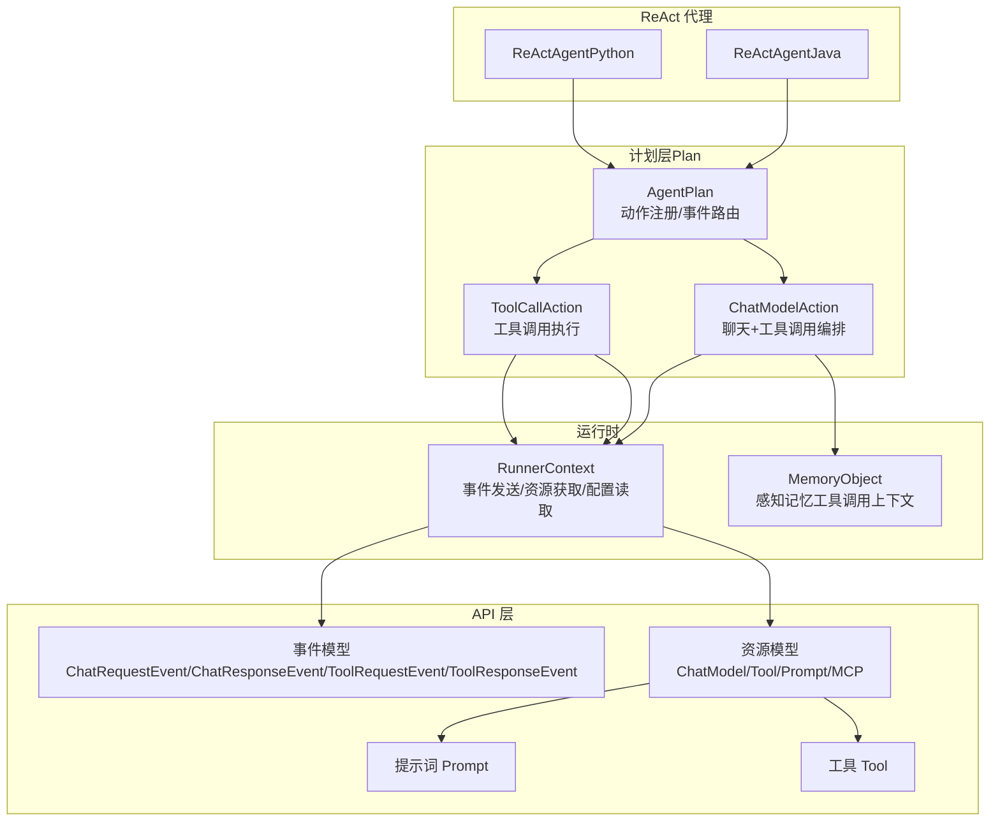
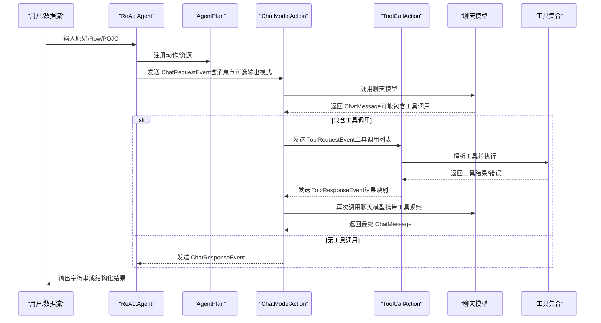
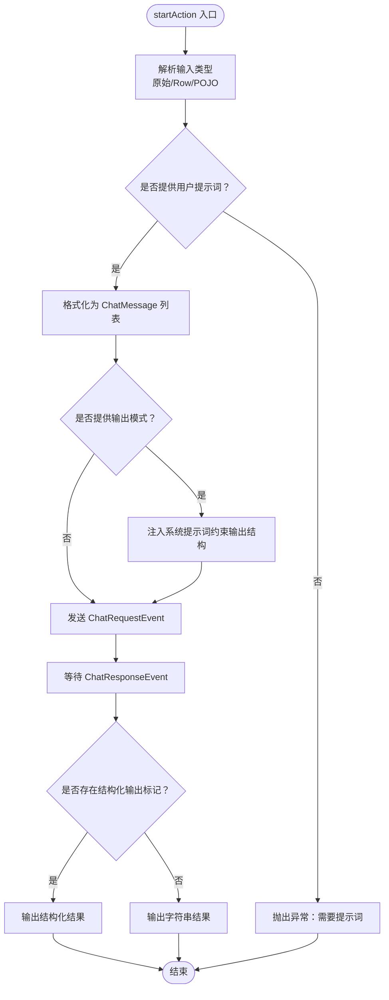
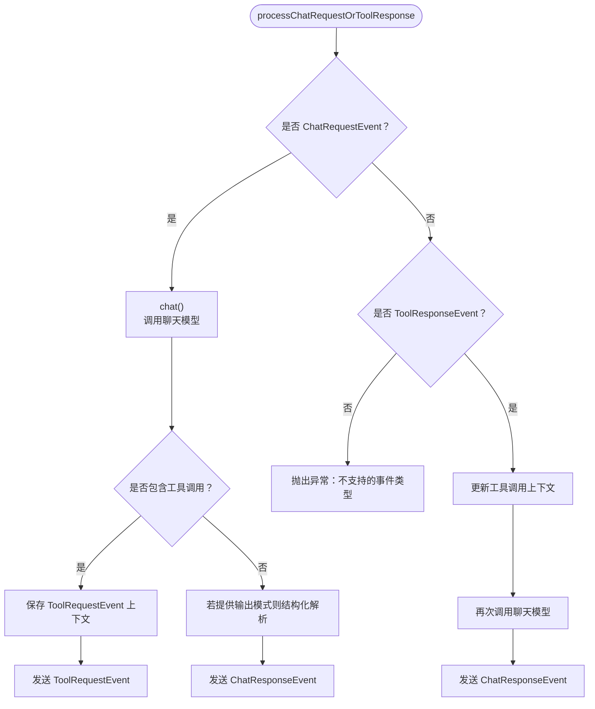
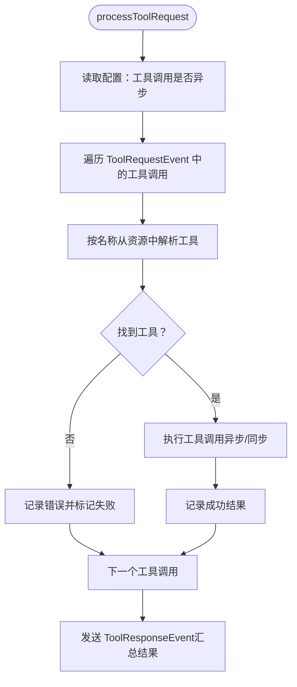
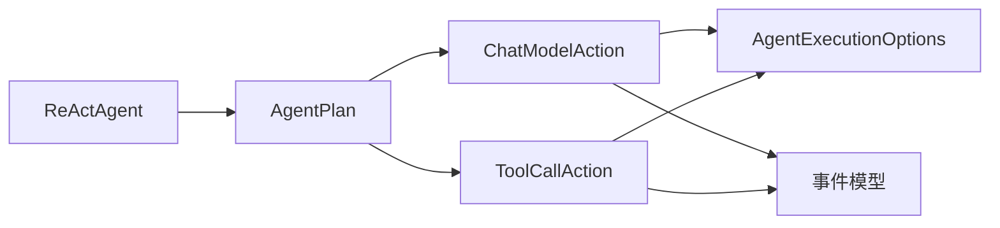

# ReAct 代理机制

<cite>
**本文引用的文件**
- [ReActAgent.java](file://api/src/main/java/org/apache/flink/agents/api/agents/ReActAgent.java)
- [react_agent.py](file://python/flink_agents/api/agents/react_agent.py)
- [ChatModelAction.java](file://plan/src/main/java/org/apache/flink/agents/plan/actions/ChatModelAction.java)
- [ToolCallAction.java](file://plan/src/main/java/org/apache/flink/agents/plan/actions/ToolCallAction.java)
- [chat_model_action.py](file://python/flink_agents/plan/actions/chat_model_action.py)
- [tool_call_action.py](file://python/flink_agents/plan/actions/tool_call_action.py)
- [AgentExecutionOptions.java](file://api/src/main/java/org/apache/flink/agents/api/agents/AgentExecutionOptions.java)
- [ChatRequestEvent.java](file://api/src/main/java/org/apache/flink/agents/api/event/ChatRequestEvent.java)
- [ChatResponseEvent.java](file://api/src/main/java/org/apache/flink/agents/api/event/ChatResponseEvent.java)
- [ToolRequestEvent.java](file://api/src/main/java/org/apache/flink/agents/api/event/ToolRequestEvent.java)
- [ToolResponseEvent.java](file://api/src/main/java/org/apache/flink/agents/api/event/ToolResponseEvent.java)
- [AgentPlan.java](file://plan/src/main/java/org/apache/flink/agents/plan/AgentPlan.java)
- [ReActAgentTest.java](file://api/src/test/java/org/apache/flink/agents/api/agents/ReActAgentTest.java)
- [ReActAgentTest.java](file://e2e-test/flink-agents-end-to-end-tests-integration/src/test/java/org/apache/flink/agents/integration/test/ReActAgentTest.java)
- [react_agent_test.py](file://python/flink_agents/e2e_tests/e2e_tests_integration/react_agent_test.py)
</cite>

## 目录
1. [引言](#引言)
2. [项目结构](#项目结构)
3. [核心组件](#核心组件)
4. [架构总览](#架构总览)
5. [详细组件分析](#详细组件分析)
6. [依赖关系分析](#依赖关系分析)
7. [性能考量](#性能考量)
8. [故障排查指南](#故障排查指南)
9. [结论](#结论)
10. [附录](#附录)

## 引言
本文件系统性阐述 Apache Flink Agents 中 ReAct（Reasoning and Acting）代理机制的设计与实现，重点覆盖以下方面：
- ReAct 核心理念：思维（Reasoning）、行动（Action）、观察（Observation）三阶段循环的工作原理
- ReActAgent 的实现细节：输入解析、中间思考过程生成、工具调用执行与结果反馈收集
- ReAct 循环中的状态管理：上下文维护、历史对话保存、决策过程跟踪
- 动作系统实现：ChatModelAction 与 ToolCallAction 的差异与适用场景
- ReAct 代理与传统代理的对比及在复杂任务处理中的优势
- 配置选项与自定义扩展：思维模板、工具选择策略、输出格式控制

## 项目结构
Flink Agents 将 ReAct 能力以“资源 + 计划 + 运行时”的方式组织：
- API 层：定义事件、资源、提示词、工具等基础抽象
- 计划层（Plan）：将用户定义的 Agent 编译为可序列化的 AgentPlan，并内置标准动作（ChatModelAction、ToolCallAction）
- Python 实现：提供与 Java 等价的 Python 版本，便于跨语言集成
- 运行时：负责事件驱动的执行、持久化、内存对象与异步执行

图表来源
- [AgentPlan.java](file://plan/src/main/java/org/apache/flink/agents/plan/AgentPlan.java#L70-L141)
- [ChatModelAction.java](file://plan/src/main/java/org/apache/flink/agents/plan/actions/ChatModelAction.java#L51-L71)
- [ToolCallAction.java](file://plan/src/main/java/org/apache/flink/agents/plan/actions/ToolCallAction.java#L35-L45)

章节来源
- [AgentPlan.java](file://plan/src/main/java/org/apache/flink/agents/plan/AgentPlan.java#L70-L141)

## 核心组件
- ReActAgent（Java 与 Python 双实现）：负责将用户输入转换为 ChatMessage 列表，注入系统提示（如输出模式约束），并通过 ChatRequestEvent 触发推理；在收到 ChatResponseEvent 后，按需结构化解析并输出最终结果。
- ChatModelAction：监听 ChatRequestEvent 与 ToolResponseEvent，调用聊天模型，处理工具调用提取与回传，维护工具调用上下文，必要时再次发起聊天请求。
- ToolCallAction：监听 ToolRequestEvent，按工具名从资源中解析工具实例，执行工具调用，汇总成功/失败与错误信息，回发 ToolResponseEvent。
- 执行配置：通过 AgentExecutionOptions 控制错误处理策略、重试次数、异步线程数、聊天与工具调用的异步开关。

章节来源
- [ReActAgent.java](file://api/src/main/java/org/apache/flink/agents/api/agents/ReActAgent.java#L50-L101)
- [react_agent.py](file://python/flink_agents/api/agents/react_agent.py#L42-L143)
- [ChatModelAction.java](file://plan/src/main/java/org/apache/flink/agents/plan/actions/ChatModelAction.java#L51-L71)
- [ToolCallAction.java](file://plan/src/main/java/org/apache/flink/agents/plan/actions/ToolCallAction.java#L35-L45)
- [AgentExecutionOptions.java](file://api/src/main/java/org/apache/flink/agents/api/agents/AgentExecutionOptions.java#L23-L47)

## 架构总览
ReAct 的执行流由事件驱动，形成“输入 → 推理 → 工具调用 → 观察 → 决策/输出”的闭环。Java 与 Python 实现共享相同的行为契约。

图表来源
- [ReActAgent.java](file://api/src/main/java/org/apache/flink/agents/api/agents/ReActAgent.java#L103-L181)
- [ChatModelAction.java](file://plan/src/main/java/org/apache/flink/agents/plan/actions/ChatModelAction.java#L191-L277)
- [ToolCallAction.java](file://plan/src/main/java/org/apache/flink/agents/plan/actions/ToolCallAction.java#L47-L111)
- [ChatRequestEvent.java](file://api/src/main/java/org/apache/flink/agents/api/event/ChatRequestEvent.java#L28-L57)
- [ChatResponseEvent.java](file://api/src/main/java/org/apache/flink/agents/api/event/ChatResponseEvent.java#L26-L42)
- [ToolRequestEvent.java](file://api/src/main/java/org/apache/flink/agents/api/event/ToolRequestEvent.java#L26-L62)
- [ToolResponseEvent.java](file://api/src/main/java/org/apache/flink/agents/api/event/ToolResponseEvent.java#L27-L94)

## 详细组件分析

### ReActAgent（Java）
- 输入解析与提示词注入
  - 支持原始类型、Row、POJO 三种输入；若为非原始类型，必须提供用户提示词以将输入字段映射为 ChatMessage。
  - 若提供输出模式（RowTypeInfo 或 POJO 类型），自动注入系统提示词，约束最终 JSON 结构。
- 启动动作（startAction）
  - 组装消息列表，必要时插入系统提示词，构造 ChatRequestEvent 并发送。
- 停止动作（stopAction）
  - 从 ChatResponseEvent 中提取内容；若存在结构化输出标记，则直接使用结构化结果；否则返回字符串内容。

图表来源
- [ReActAgent.java](file://api/src/main/java/org/apache/flink/agents/api/agents/ReActAgent.java#L103-L181)

章节来源
- [ReActAgent.java](file://api/src/main/java/org/apache/flink/agents/api/agents/ReActAgent.java#L50-L101)
- [ReActAgent.java](file://api/src/main/java/org/apache/flink/agents/api/agents/ReActAgent.java#L103-L181)

### ReActAgent（Python）
- 行为与 Java 等价：支持输出模式（Pydantic BaseModel 或 RowTypeInfo），自动注入系统提示词；输入支持原语、Row、任意对象（需提供提示词）。
- 结构化输出：当聊天模型返回 JSON 且无工具调用时，按输出模式反序列化为结构化对象。

章节来源
- [react_agent.py](file://python/flink_agents/api/agents/react_agent.py#L42-L143)
- [react_agent.py](file://python/flink_agents/api/agents/react_agent.py#L144-L212)

### ChatModelAction（Java）
- 功能职责
  - 处理 ChatRequestEvent：调用聊天模型，根据响应是否包含工具调用决定后续流程。
  - 处理 ToolResponseEvent：将工具执行结果拼接到上下文中，再次调用聊天模型以获得最终回答。
- 上下文管理
  - 使用 MemoryObject 维护“初始请求 ID → 消息上下文”的映射，避免重复存储与读写放大。
  - 保存 ToolRequestEvent 的上下文（初始请求 ID、模型名、输出模式），以便回溯。
- 错误处理与重试
  - 依据 AgentExecutionOptions 的策略进行重试或忽略；支持异步聊天（Java 侧对 Python 模型有兼容限制）。
- 结构化输出
  - 当无工具调用且提供输出模式时，将字符串结果反序列化为 POJO 或 Row。

图表来源
- [ChatModelAction.java](file://plan/src/main/java/org/apache/flink/agents/plan/actions/ChatModelAction.java#L191-L277)
- [ChatModelAction.java](file://plan/src/main/java/org/apache/flink/agents/plan/actions/ChatModelAction.java#L284-L350)

章节来源
- [ChatModelAction.java](file://plan/src/main/java/org/apache/flink/agents/plan/actions/ChatModelAction.java#L51-L71)
- [ChatModelAction.java](file://plan/src/main/java/org/apache/flink/agents/plan/actions/ChatModelAction.java#L191-L277)
- [ChatModelAction.java](file://plan/src/main/java/org/apache/flink/agents/plan/actions/ChatModelAction.java#L284-L350)

### ChatModelAction（Python）
- 行为与 Java 等价，但使用 PythonFunction 包装异步执行，增强与 Python 生态的兼容性。
- 上下文管理与错误处理策略一致。

章节来源
- [chat_model_action.py](file://python/flink_agents/plan/actions/chat_model_action.py#L164-L235)
- [chat_model_action.py](file://python/flink_agents/plan/actions/chat_model_action.py#L285-L310)

### ToolCallAction（Java）
- 功能职责
  - 从 ToolRequestEvent 中解析每个工具调用（ID、名称、参数），从资源中解析对应工具实例并执行。
  - 支持异步工具调用；聚合成功/失败与错误信息，回发 ToolResponseEvent。
- 错误处理
  - 工具不存在或执行异常时，记录错误并返回失败标记。

图表来源
- [ToolCallAction.java](file://plan/src/main/java/org/apache/flink/agents/plan/actions/ToolCallAction.java#L47-L111)

章节来源
- [ToolCallAction.java](file://plan/src/main/java/org/apache/flink/agents/plan/actions/ToolCallAction.java#L35-L45)
- [ToolCallAction.java](file://plan/src/main/java/org/apache/flink/agents/plan/actions/ToolCallAction.java#L47-L111)

### ToolCallAction（Python）
- 行为与 Java 等价，采用 PythonFunction 包装异步执行。

章节来源
- [tool_call_action.py](file://python/flink_agents/plan/actions/tool_call_action.py#L29-L66)

### 事件模型与状态管理
- ChatRequestEvent/ChatResponseEvent：封装聊天请求与响应，携带消息列表与可选输出模式。
- ToolRequestEvent/ToolResponseEvent：封装工具调用请求与响应，包含工具调用 ID、外部 ID 映射、成功/错误标记。
- 上下文与历史
  - ChatModelAction 使用 MemoryObject 维护工具调用上下文，确保多轮对话与工具观察的连贯性。
  - ToolRequestEvent 上下文保存初始请求 ID、模型名与输出模式，用于回溯与再次调用聊天模型。

章节来源
- [ChatRequestEvent.java](file://api/src/main/java/org/apache/flink/agents/api/event/ChatRequestEvent.java#L28-L57)
- [ChatResponseEvent.java](file://api/src/main/java/org/apache/flink/agents/api/event/ChatResponseEvent.java#L26-L42)
- [ToolRequestEvent.java](file://api/src/main/java/org/apache/flink/agents/api/event/ToolRequestEvent.java#L26-L62)
- [ToolResponseEvent.java](file://api/src/main/java/org/apache/flink/agents/api/event/ToolResponseEvent.java#L27-L94)

## 依赖关系分析
- ReActAgent 依赖 AgentPlan 的动作注册与事件路由能力，通过资源描述符注册默认聊天模型与可选提示词、输出模式。
- ChatModelAction 与 ToolCallAction 作为内置动作，分别处理聊天与工具调用，二者通过事件解耦。
- 执行配置（AgentExecutionOptions）贯穿动作执行，影响错误处理策略、重试次数与异步行为。

图表来源
- [AgentPlan.java](file://plan/src/main/java/org/apache/flink/agents/plan/AgentPlan.java#L78-L141)
- [ChatModelAction.java](file://plan/src/main/java/org/apache/flink/agents/plan/actions/ChatModelAction.java#L51-L71)
- [ToolCallAction.java](file://plan/src/main/java/org/apache/flink/agents/plan/actions/ToolCallAction.java#L35-L45)
- [AgentExecutionOptions.java](file://api/src/main/java/org/apache/flink/agents/api/agents/AgentExecutionOptions.java#L23-L47)

章节来源
- [AgentPlan.java](file://plan/src/main/java/org/apache/flink/agents/plan/AgentPlan.java#L70-L200)

## 性能考量
- 异步执行
  - 聊天与工具调用均支持异步执行，可通过配置项开启；Java 侧对 Python 聊天模型存在兼容限制。
- 重试与错误处理
  - 提供 FAIL/IGNORE/RETRY 三种策略与最大重试次数配置，平衡可靠性与吞吐。
- 上下文存储
  - 使用内存对象缓存工具调用上下文，减少重复存储；注意在大规模并发下的写放大问题。

章节来源
- [AgentExecutionOptions.java](file://api/src/main/java/org/apache/flink/agents/api/agents/AgentExecutionOptions.java#L23-L47)
- [ChatModelAction.java](file://plan/src/main/java/org/apache/flink/agents/plan/actions/ChatModelAction.java#L201-L214)
- [chat_model_action.py](file://python/flink_agents/plan/actions/chat_model_action.py#L181-L190)

## 故障排查指南
- 输入类型不匹配
  - 非原始类型输入必须提供用户提示词，否则会抛出异常；检查提示词是否正确映射字段。
- 输出模式不匹配
  - 若提供输出模式（POJO/RowTypeInfo），最终 JSON 必须满足模式；否则结构化解析会失败。
- 工具不存在或执行异常
  - ToolCallAction 会记录错误并标记失败；检查工具名称与参数是否正确。
- 聊天模型异常
  - 根据错误处理策略决定重试或忽略；查看日志与重试次数配置。

章节来源
- [ReActAgent.java](file://api/src/main/java/org/apache/flink/agents/api/agents/ReActAgent.java#L122-L147)
- [ToolCallAction.java](file://plan/src/main/java/org/apache/flink/agents/plan/actions/ToolCallAction.java#L65-L73)
- [AgentExecutionOptions.java](file://api/src/main/java/org/apache/flink/agents/api/agents/AgentExecutionOptions.java#L23-L47)

## 结论
ReAct 代理通过“思维-行动-观察”三阶段循环，结合工具函数调用与结构化输出，实现了对复杂任务的稳健处理。其事件驱动的架构与内置动作体系，使得在 Java 与 Python 生态之间保持一致的行为契约，同时具备良好的可扩展性与可配置性。

## 附录

### 配置选项与自定义扩展
- 执行配置（AgentExecutionOptions）
  - 错误处理策略：FAIL/IGNORE/RETRY
  - 最大重试次数
  - 异步线程数
  - 聊天异步开关
  - 工具调用异步开关
- 自定义扩展
  - 提示词：通过用户提示词指导输入到消息的转换与输出格式约束
  - 工具：注册 Tool 资源并在聊天模型中启用工具调用
  - 输出模式：支持 RowTypeInfo 与 Pydantic BaseModel，自动结构化解析

章节来源
- [AgentExecutionOptions.java](file://api/src/main/java/org/apache/flink/agents/api/agents/AgentExecutionOptions.java#L23-L47)
- [ReActAgent.java](file://api/src/main/java/org/apache/flink/agents/api/agents/ReActAgent.java#L59-L101)
- [react_agent.py](file://python/flink_agents/api/agents/react_agent.py#L97-L143)

### 测试与验证
- 单元测试：验证输出模式序列化与反序列化一致性
- 端到端测试：在真实聊天模型与工具环境下验证 ReAct 代理的推理与工具调用链路

章节来源
- [ReActAgentTest.java](file://api/src/test/java/org/apache/flink/agents/api/agents/ReActAgentTest.java#L30-L44)
- [ReActAgentTest.java](file://e2e-test/flink-agents-end-to-end-tests-integration/src/test/java/org/apache/flink/agents/integration/test/ReActAgentTest.java#L77-L190)
- [react_agent_test.py](file://python/flink_agents/e2e_tests/e2e_tests_integration/react_agent_test.py#L78-L240)