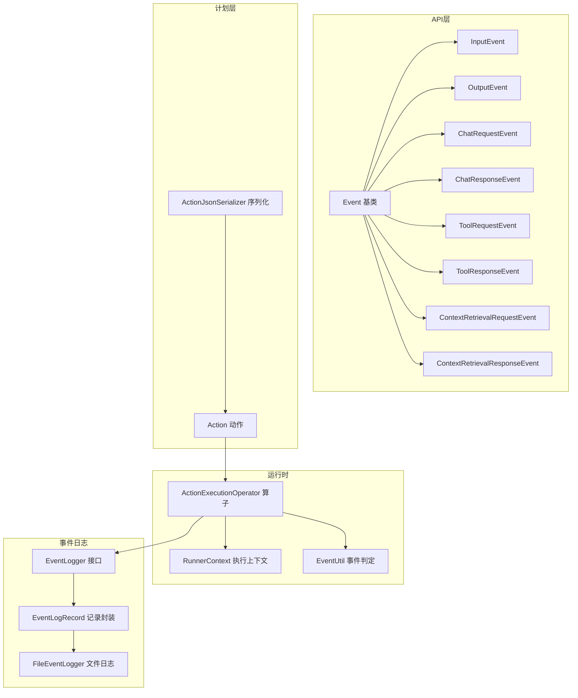
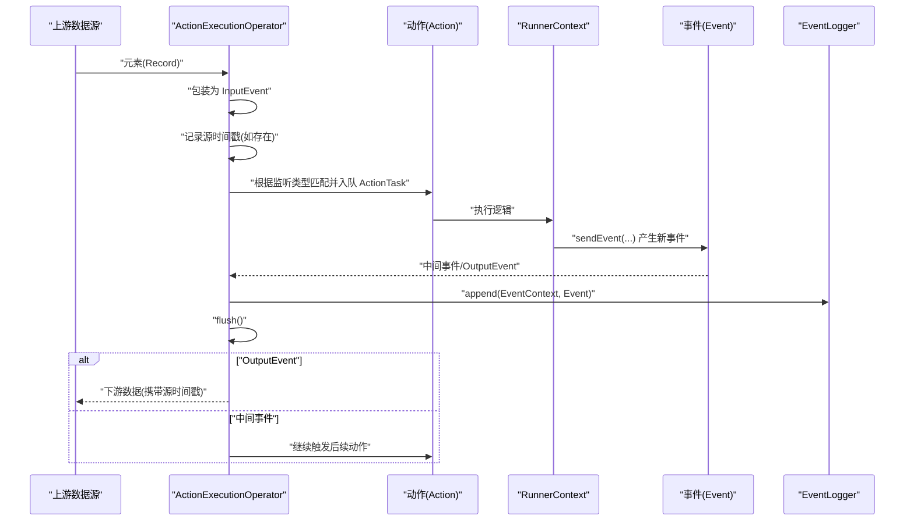
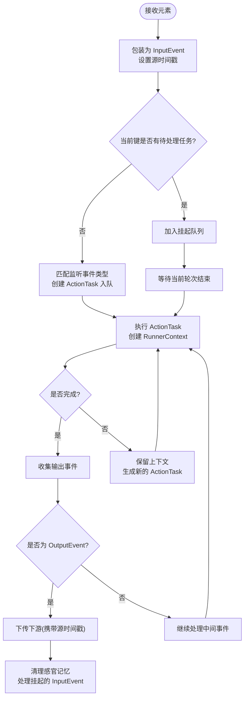
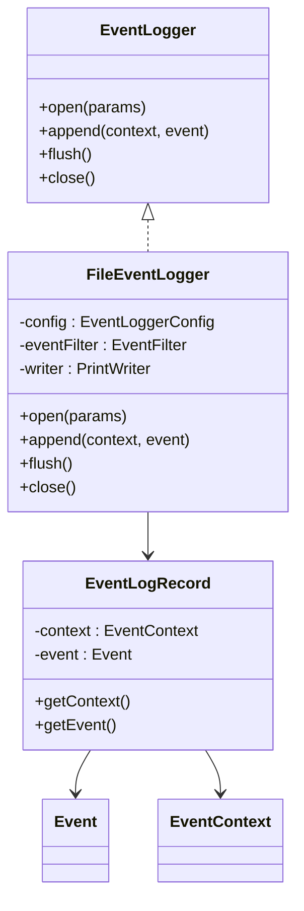
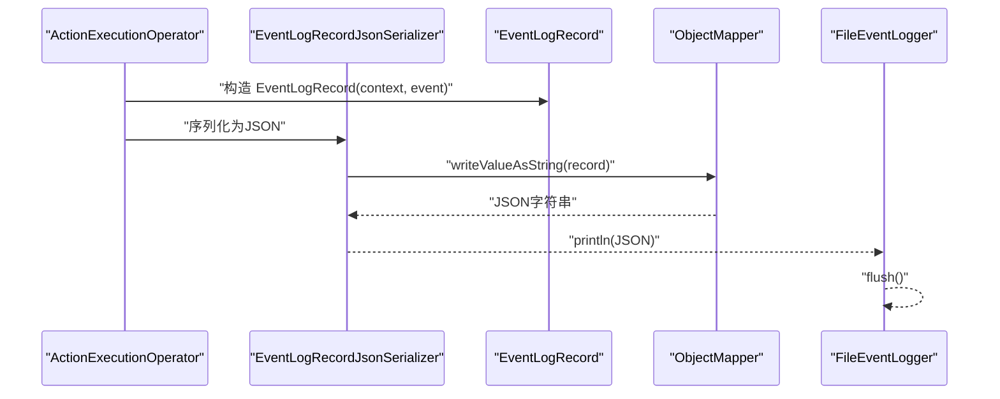
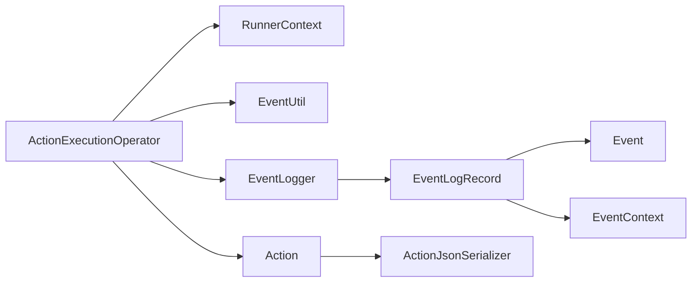

# 事件驱动架构

<cite>
**本文引用的文件**
- [Event.java](file://api/src/main/java/org/apache/flink/agents/api/Event.java)
- [InputEvent.java](file://api/src/main/java/org/apache/flink/agents/api/InputEvent.java)
- [OutputEvent.java](file://api/src/main/java/org/apache/flink/agents/api/OutputEvent.java)
- [ChatRequestEvent.java](file://api/src/main/java/org/apache/flink/agents/api/event/ChatRequestEvent.java)
- [ChatResponseEvent.java](file://api/src/main/java/org/apache/flink/agents/api/event/ChatResponseEvent.java)
- [ToolRequestEvent.java](file://api/src/main/java/org/apache/flink/agents/api/event/ToolRequestEvent.java)
- [ToolResponseEvent.java](file://api/src/main/java/org/apache/flink/agents/api/event/ToolResponseEvent.java)
- [ContextRetrievalRequestEvent.java](file://api/src/main/java/org/apache/flink/agents/api/event/ContextRetrievalRequestEvent.java)
- [ContextRetrievalResponseEvent.java](file://api/src/main/java/org/apache/flink/agents/api/event/ContextRetrievalResponseEvent.java)
- [EventLogger.java](file://api/src/main/java/org/apache/flink/agents/api/logger/EventLogger.java)
- [EventLogRecord.java](file://runtime/src/main/java/org/apache/flink/agents/runtime/eventlog/EventLogRecord.java)
- [FileEventLogger.java](file://runtime/src/main/java/org/apache/flink/agents/runtime/eventlog/FileEventLogger.java)
- [ActionExecutionOperator.java](file://runtime/src/main/java/org/apache/flink/agents/runtime/operator/ActionExecutionOperator.java)
- [Action.java](file://plan/src/main/java/org/apache/flink/agents/plan/actions/Action.java)
- [RunnerContext.java](file://api/src/main/java/org/apache/flink/agents/api/context/RunnerContext.java)
- [EventUtil.java](file://runtime/src/main/java/org/apache/flink/agents/runtime/utils/EventUtil.java)
- [ActionJsonSerializer.java](file://plan/src/main/java/org/apache/flink/agents/plan/serializer/ActionJsonSerializer.java)
</cite>

## 目录
1. [引言](#引言)
2. [项目结构](#项目结构)
3. [核心组件](#核心组件)
4. [架构总览](#架构总览)
5. [组件详解](#组件详解)
6. [依赖关系分析](#依赖关系分析)
7. [性能与可扩展性](#性能与可扩展性)
8. [故障排查指南](#故障排查指南)
9. [结论](#结论)
10. [附录：最佳实践与规范](#附录最佳实践与规范)

## 引言
本文件系统性阐述 Apache Flink Agents 的事件驱动架构，聚焦于事件模型、事件在 ActionExecutionOperator 中的流转、事件日志记录与持久化、跨语言事件序列化与传递，以及在分布式流式环境中的同步与一致性保障。读者将理解从输入事件进入、动作执行、到输出事件产生的完整链路，并掌握事件处理的最佳实践。

## 项目结构
围绕事件驱动的核心代码分布在以下模块：
- api 层：定义通用事件接口与具体事件类型（输入、输出、聊天、工具调用、上下文检索等）
- plan 层：定义动作（Action）及其序列化/反序列化策略，用于描述“监听哪些事件、如何执行”
- runtime 层：实现运行时算子 ActionExecutionOperator，负责事件接收、调度、执行、状态恢复、事件日志与指标
- runtime/eventlog：事件日志记录器与记录封装，支持文件落盘与 JSON Lines 格式

图表来源
- [Event.java](file://api/src/main/java/org/apache/flink/agents/api/Event.java#L29-L89)
- [InputEvent.java](file://api/src/main/java/org/apache/flink/agents/api/InputEvent.java#L27-L48)
- [OutputEvent.java](file://api/src/main/java/org/apache/flink/agents/api/OutputEvent.java#L27-L51)
- [ChatRequestEvent.java](file://api/src/main/java/org/apache/flink/agents/api/event/ChatRequestEvent.java#L28-L57)
- [ChatResponseEvent.java](file://api/src/main/java/org/apache/flink/agents/api/event/ChatResponseEvent.java#L26-L42)
- [ToolRequestEvent.java](file://api/src/main/java/org/apache/flink/agents/api/event/ToolRequestEvent.java#L26-L62)
- [ToolResponseEvent.java](file://api/src/main/java/org/apache/flink/agents/api/event/ToolResponseEvent.java#L27-L94)
- [ContextRetrievalRequestEvent.java](file://api/src/main/java/org/apache/flink/agents/api/event/ContextRetrievalRequestEvent.java#L23-L70)
- [ContextRetrievalResponseEvent.java](file://api/src/main/java/org/apache/flink/agents/api/event/ContextRetrievalResponseEvent.java#L27-L65)
- [Action.java](file://plan/src/main/java/org/apache/flink/agents/plan/actions/Action.java#L35-L100)
- [ActionJsonSerializer.java](file://plan/src/main/java/org/apache/flink/agents/plan/serializer/ActionJsonSerializer.java#L31-L155)
- [ActionExecutionOperator.java](file://runtime/src/main/java/org/apache/flink/agents/runtime/operator/ActionExecutionOperator.java#L108-L800)
- [RunnerContext.java](file://api/src/main/java/org/apache/flink/agents/api/context/RunnerContext.java#L29-L138)
- [EventUtil.java](file://runtime/src/main/java/org/apache/flink/agents/runtime/utils/EventUtil.java#L25-L49)
- [EventLogger.java](file://api/src/main/java/org/apache/flink/agents/api/logger/EventLogger.java#L24-L79)
- [EventLogRecord.java](file://runtime/src/main/java/org/apache/flink/agents/runtime/eventlog/EventLogRecord.java#L26-L54)
- [FileEventLogger.java](file://runtime/src/main/java/org/apache/flink/agents/runtime/eventlog/FileEventLogger.java#L36-L157)

章节来源
- [Event.java](file://api/src/main/java/org/apache/flink/agents/api/Event.java#L29-L89)
- [ActionExecutionOperator.java](file://runtime/src/main/java/org/apache/flink/agents/runtime/operator/ActionExecutionOperator.java#L108-L800)

## 核心组件
- 通用事件接口与类型
  - Event：所有事件的抽象基类，统一包含唯一标识、属性映射、源时间戳字段
  - InputEvent：框架生成的输入事件，承载上游数据
  - OutputEvent：动作执行结果输出事件，直接作为下游数据发出
  - 业务事件：ChatRequest/Response、ToolRequest/Response、ContextRetrievalRequest/Response 等
- 运行时算子 ActionExecutionOperator：接收元素 → 包装为 InputEvent → 触发匹配动作 → 产出中间事件或 OutputEvent → 下游传播
- 事件日志 EventLogger 与记录 EventLogRecord：封装事件上下文与事件本身，支持文件落盘与过滤
- 动作 Action：声明“监听事件类型 + 执行函数”，由计划层序列化/反序列化
- 执行上下文 RunnerContext：向动作暴露发送事件、内存、资源、指标、配置等能力
- 事件工具 EventUtil：判断事件是否为 InputEvent/OutputEvent（含跨语言 PythonEvent）

章节来源
- [Event.java](file://api/src/main/java/org/apache/flink/agents/api/Event.java#L29-L89)
- [InputEvent.java](file://api/src/main/java/org/apache/flink/agents/api/InputEvent.java#L27-L48)
- [OutputEvent.java](file://api/src/main/java/org/apache/flink/agents/api/OutputEvent.java#L27-L51)
- [ChatRequestEvent.java](file://api/src/main/java/org/apache/flink/agents/api/event/ChatRequestEvent.java#L28-L57)
- [ChatResponseEvent.java](file://api/src/main/java/org/apache/flink/agents/api/event/ChatResponseEvent.java#L26-L42)
- [ToolRequestEvent.java](file://api/src/main/java/org/apache/flink/agents/api/event/ToolRequestEvent.java#L26-L62)
- [ToolResponseEvent.java](file://api/src/main/java/org/apache/flink/agents/api/event/ToolResponseEvent.java#L27-L94)
- [ContextRetrievalRequestEvent.java](file://api/src/main/java/org/apache/flink/agents/api/event/ContextRetrievalRequestEvent.java#L23-L70)
- [ContextRetrievalResponseEvent.java](file://api/src/main/java/org/apache/flink/agents/api/event/ContextRetrievalResponseEvent.java#L27-L65)
- [ActionExecutionOperator.java](file://runtime/src/main/java/org/apache/flink/agents/runtime/operator/ActionExecutionOperator.java#L108-L800)
- [EventLogger.java](file://api/src/main/java/org/apache/flink/agents/api/logger/EventLogger.java#L24-L79)
- [EventLogRecord.java](file://runtime/src/main/java/org/apache/flink/agents/runtime/eventlog/EventLogRecord.java#L26-L54)
- [Action.java](file://plan/src/main/java/org/apache/flink/agents/plan/actions/Action.java#L35-L100)
- [RunnerContext.java](file://api/src/main/java/org/apache/flink/agents/api/context/RunnerContext.java#L29-L138)
- [EventUtil.java](file://runtime/src/main/java/org/apache/flink/agents/runtime/utils/EventUtil.java#L25-L49)

## 架构总览
事件驱动在 Flink Agents 中以“算子即处理器”的方式实现：每个事件进入 ActionExecutionOperator 后，被包装为 InputEvent 并触发匹配的动作；动作通过 RunnerContext 发送新的事件，形成事件流水线；当出现 OutputEvent 时，算子将其转换为下游数据并携带源时间戳。

图表来源
- [ActionExecutionOperator.java](file://runtime/src/main/java/org/apache/flink/agents/runtime/operator/ActionExecutionOperator.java#L344-L424)
- [EventUtil.java](file://runtime/src/main/java/org/apache/flink/agents/runtime/utils/EventUtil.java#L33-L47)
- [EventLogger.java](file://api/src/main/java/org/apache/flink/agents/api/logger/EventLogger.java#L46-L66)
- [EventLogRecord.java](file://runtime/src/main/java/org/apache/flink/agents/runtime/eventlog/EventLogRecord.java#L35-L52)

## 组件详解

### 事件类型体系与职责
- Event 抽象基类：统一 id、attributes、sourceTimestamp 字段，便于追踪与审计
- InputEvent：表示来自上游的输入，作为动作执行的起点
- OutputEvent：表示动作执行的最终结果，直接作为下游数据发出
- 业务事件：
  - ChatRequest/Response：与聊天模型交互的请求/响应
  - ToolRequest/Response：工具调用的请求/响应，包含成功/失败/错误信息
  - ContextRetrievalRequest/Response：向向量库检索上下文的请求/响应

这些事件类型均继承自 Event，确保统一的元数据与序列化能力。

章节来源
- [Event.java](file://api/src/main/java/org/apache/flink/agents/api/Event.java#L29-L89)
- [InputEvent.java](file://api/src/main/java/org/apache/flink/agents/api/InputEvent.java#L27-L48)
- [OutputEvent.java](file://api/src/main/java/org/apache/flink/agents/api/OutputEvent.java#L27-L51)
- [ChatRequestEvent.java](file://api/src/main/java/org/apache/flink/agents/api/event/ChatRequestEvent.java#L28-L57)
- [ChatResponseEvent.java](file://api/src/main/java/org/apache/flink/agents/api/event/ChatResponseEvent.java#L26-L42)
- [ToolRequestEvent.java](file://api/src/main/java/org/apache/flink/agents/api/event/ToolRequestEvent.java#L26-L62)
- [ToolResponseEvent.java](file://api/src/main/java/org/apache/flink/agents/api/event/ToolResponseEvent.java#L27-L94)
- [ContextRetrievalRequestEvent.java](file://api/src/main/java/org/apache/flink/agents/api/event/ContextRetrievalRequestEvent.java#L23-L70)
- [ContextRetrievalResponseEvent.java](file://api/src/main/java/org/apache/flink/agents/api/event/ContextRetrievalResponseEvent.java#L27-L65)

### 事件在 ActionExecutionOperator 中的流转
- 元素到达：包装为 InputEvent，设置源时间戳（若 Record 携带）
- 事件分发：判定是否为 OutputEvent，若是则直接下传；否则根据监听类型匹配动作，创建 ActionTask 并入队
- 动作执行：按键分区顺序取出 ActionTask，创建 RunnerContext，执行动作；若动作未完成，生成新的 ActionTask 继续执行
- 结果处理：收集输出事件，递归处理；当 InputEvent 完成后清理感官记忆并处理挂起的下一个 InputEvent
- 日志与监听：每处理一个事件，记录 EventContext 与 Event 到 EventLogger，并通知事件监听器

图表来源
- [ActionExecutionOperator.java](file://runtime/src/main/java/org/apache/flink/agents/runtime/operator/ActionExecutionOperator.java#L344-L602)
- [EventUtil.java](file://runtime/src/main/java/org/apache/flink/agents/runtime/utils/EventUtil.java#L33-L47)

章节来源
- [ActionExecutionOperator.java](file://runtime/src/main/java/org/apache/flink/agents/runtime/operator/ActionExecutionOperator.java#L344-L602)
- [EventUtil.java](file://runtime/src/main/java/org/apache/flink/agents/runtime/utils/EventUtil.java#L33-L47)

### 事件日志记录机制与持久化
- EventLogger 接口：定义 open、append、flush、close 生命周期方法，支持不同后端（文件、数据库等）
- EventLogRecord：封装 EventContext 与 Event，配合自定义 JSON 序列化/反序列化处理多态事件类型
- FileEventLogger：基于 JSON Lines 的文件日志，按子任务生成唯一文件名，避免冲突；默认目录可配置
- 写入策略：每次事件处理后 append 并 flush，保证可观测性与可回溯性

图表来源
- [EventLogger.java](file://api/src/main/java/org/apache/flink/agents/api/logger/EventLogger.java#L24-L79)
- [EventLogRecord.java](file://runtime/src/main/java/org/apache/flink/agents/runtime/eventlog/EventLogRecord.java#L26-L54)
- [FileEventLogger.java](file://runtime/src/main/java/org/apache/flink/agents/runtime/eventlog/FileEventLogger.java#L36-L157)

章节来源
- [EventLogger.java](file://api/src/main/java/org/apache/flink/agents/api/logger/EventLogger.java#L24-L79)
- [EventLogRecord.java](file://runtime/src/main/java/org/apache/flink/agents/runtime/eventlog/EventLogRecord.java#L26-L54)
- [FileEventLogger.java](file://runtime/src/main/java/org/apache/flink/agents/runtime/eventlog/FileEventLogger.java#L36-L157)

### 事件消息格式与序列化
- 事件序列化：Event 基类与具体事件类型通过 Jackson 注解支持 JSON 序列化；EventLogRecord 使用自定义序列化器/反序列化器，利用 EventContext 中的 eventType 字段进行多态重建
- 动作序列化：ActionJsonSerializer 将 Action.exec（JavaFunction/PythonFunction）序列化为包含类型标记的 JSON，支持跨语言动作描述
- 跨语言事件：EventUtil 提供对 PythonEvent 的识别，区分 InputEvent 与 OutputEvent 的 Python 名称常量

图表来源
- [EventLogRecord.java](file://runtime/src/main/java/org/apache/flink/agents/runtime/eventlog/EventLogRecord.java#L35-L52)
- [FileEventLogger.java](file://runtime/src/main/java/org/apache/flink/agents/runtime/eventlog/FileEventLogger.java#L123-L138)
- [ActionJsonSerializer.java](file://plan/src/main/java/org/apache/flink/agents/plan/serializer/ActionJsonSerializer.java#L44-L155)
- [EventUtil.java](file://runtime/src/main/java/org/apache/flink/agents/runtime/utils/EventUtil.java#L28-L31)

章节来源
- [EventLogRecord.java](file://runtime/src/main/java/org/apache/flink/agents/runtime/eventlog/EventLogRecord.java#L35-L52)
- [FileEventLogger.java](file://runtime/src/main/java/org/apache/flink/agents/runtime/eventlog/FileEventLogger.java#L123-L138)
- [ActionJsonSerializer.java](file://plan/src/main/java/org/apache/flink/agents/plan/serializer/ActionJsonSerializer.java#L44-L155)
- [EventUtil.java](file://runtime/src/main/java/org/apache/flink/agents/runtime/utils/EventUtil.java#L28-L31)

### 分布式环境中的传递与同步
- 键分区与顺序：按键分区维护消息序号与挂起队列，确保同一键内事件有序处理
- 水位线与窗口：通过 SegmentedQueue 与水位线推进，协调事件处理与背压
- 恢复与重放：ActionStateStore 支持动作状态持久化与恢复，避免重复执行；Operator 状态包含恢复标记、序列号、当前处理键集合等
- Python 集成：通过 PythonActionExecutor 与资源适配器桥接 Java/Python 动作与资源，保持事件语义一致

章节来源
- [ActionExecutionOperator.java](file://runtime/src/main/java/org/apache/flink/agents/runtime/operator/ActionExecutionOperator.java#L271-L329)
- [ActionExecutionOperator.java](file://runtime/src/main/java/org/apache/flink/agents/runtime/operator/ActionExecutionOperator.java#L776-L800)

## 依赖关系分析
- ActionExecutionOperator 依赖：
  - RunnerContext：提供发送事件、内存、资源、指标、配置等能力
  - EventUtil：判定 InputEvent/OutputEvent
  - EventLogger：事件日志记录
  - Action：动作定义与执行入口
- 事件类型与序列化：
  - EventLogRecord 依赖 Event 与 EventContext
  - FileEventLogger 依赖 EventLogger 接口与 EventFilter
  - ActionJsonSerializer 依赖 JavaFunction/PythonFunction

图表来源
- [ActionExecutionOperator.java](file://runtime/src/main/java/org/apache/flink/agents/runtime/operator/ActionExecutionOperator.java#L118-L236)
- [RunnerContext.java](file://api/src/main/java/org/apache/flink/agents/api/context/RunnerContext.java#L29-L138)
- [EventUtil.java](file://runtime/src/main/java/org/apache/flink/agents/runtime/utils/EventUtil.java#L25-L49)
- [EventLogger.java](file://api/src/main/java/org/apache/flink/agents/api/logger/EventLogger.java#L24-L79)
- [EventLogRecord.java](file://runtime/src/main/java/org/apache/flink/agents/runtime/eventlog/EventLogRecord.java#L26-L54)
- [Action.java](file://plan/src/main/java/org/apache/flink/agents/plan/actions/Action.java#L35-L100)
- [ActionJsonSerializer.java](file://plan/src/main/java/org/apache/flink/agents/plan/serializer/ActionJsonSerializer.java#L31-L155)

章节来源
- [ActionExecutionOperator.java](file://runtime/src/main/java/org/apache/flink/agents/runtime/operator/ActionExecutionOperator.java#L118-L236)
- [RunnerContext.java](file://api/src/main/java/org/apache/flink/agents/api/context/RunnerContext.java#L29-L138)
- [EventUtil.java](file://runtime/src/main/java/org/apache/flink/agents/runtime/utils/EventUtil.java#L25-L49)
- [EventLogger.java](file://api/src/main/java/org/apache/flink/agents/api/logger/EventLogger.java#L24-L79)
- [EventLogRecord.java](file://runtime/src/main/java/org/apache/flink/agents/runtime/eventlog/EventLogRecord.java#L26-L54)
- [Action.java](file://plan/src/main/java/org/apache/flink/agents/plan/actions/Action.java#L35-L100)
- [ActionJsonSerializer.java](file://plan/src/main/java/org/apache/flink/agents/plan/serializer/ActionJsonSerializer.java#L31-L155)

## 性能与可扩展性
- 异步执行与恢复
  - RunnerContext.durableExecuteAsync 在 JDK 21+ 使用 Continuation 实现无阻塞挂起，降低线程占用
  - ActionStateStore 支持 Kafka/本地存储，保障动作状态可恢复
- 事件日志
  - FileEventLogger 默认逐条 flush，确保可观测性；可结合 EventFilter 控制写入量
- 内存与状态
  - Sensory/Short/Long-term Memory 提供多级记忆，减少重复计算
- 并行与分区
  - 键分区保证同一键内顺序，SegmentedQueue 协调水位线推进，避免全局阻塞

章节来源
- [RunnerContext.java](file://api/src/main/java/org/apache/flink/agents/api/context/RunnerContext.java#L113-L133)
- [ActionExecutionOperator.java](file://runtime/src/main/java/org/apache/flink/agents/runtime/operator/ActionExecutionOperator.java#L271-L329)
- [FileEventLogger.java](file://runtime/src/main/java/org/apache/flink/agents/runtime/eventlog/FileEventLogger.java#L140-L147)

## 故障排查指南
- 事件未下传
  - 检查是否为 OutputEvent：参考 EventUtil 判定逻辑
  - 确认 ActionExecutionOperator 是否正确收集并下传
- 事件日志缺失
  - 确认 EventLogger 已初始化并 open
  - 检查 EventFilter 是否拒绝该事件类型
  - 确认 flush 调用是否正常
- 动作未执行或重复执行
  - 检查 ActionStateStore 是否可用，恢复标记是否正确
  - 查看序列号与当前处理键集合状态
- Python 事件识别问题
  - 确认 PythonEvent 的 eventType 名称与常量一致

章节来源
- [EventUtil.java](file://runtime/src/main/java/org/apache/flink/agents/runtime/utils/EventUtil.java#L33-L47)
- [ActionExecutionOperator.java](file://runtime/src/main/java/org/apache/flink/agents/runtime/operator/ActionExecutionOperator.java#L407-L424)
- [FileEventLogger.java](file://runtime/src/main/java/org/apache/flink/agents/runtime/eventlog/FileEventLogger.java#L123-L147)

## 结论
Apache Flink Agents 的事件驱动架构以 Event 为核心，通过 ActionExecutionOperator 将输入事件转化为动作执行图，借助 RunnerContext 提供统一的执行上下文，结合事件日志与状态恢复实现高可靠、可观测、可扩展的流式代理系统。跨语言动作与资源适配进一步增强了生态兼容性。

## 附录：最佳实践与规范
- 异步处理
  - 对外部调用使用 RunnerContext.durableExecuteAsync，避免阻塞主执行线程
  - 合理设置异步线程数，避免过度并发导致资源争用
- 错误恢复
  - 使用 ActionStateStore 保存动作状态，确保幂等与可恢复
  - 对关键动作采用细粒度 ActionTask，缩短单次执行时间
- 性能优化
  - 通过 EventFilter 限制日志写入量，降低 IO 压力
  - 合理划分键空间，避免热点键造成排队延迟
- 事件设计
  - 为复杂业务事件补充必要的 attributes，便于审计与排障
  - 输出事件应尽量携带源时间戳，便于下游窗口与对齐