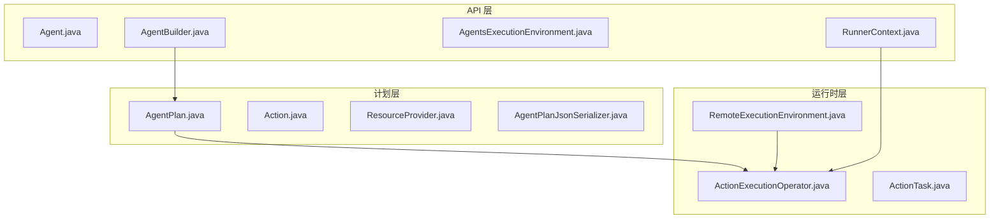
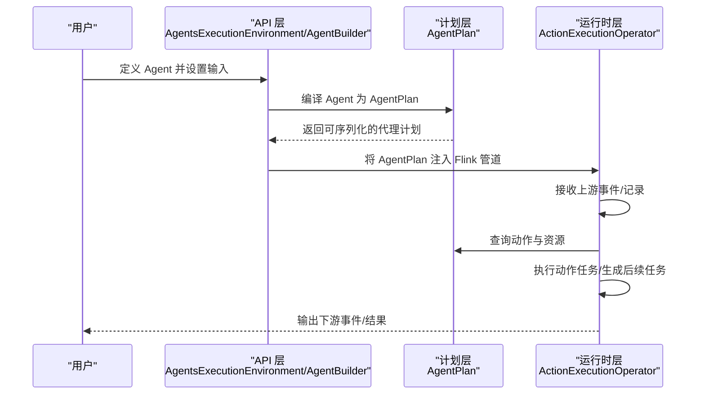
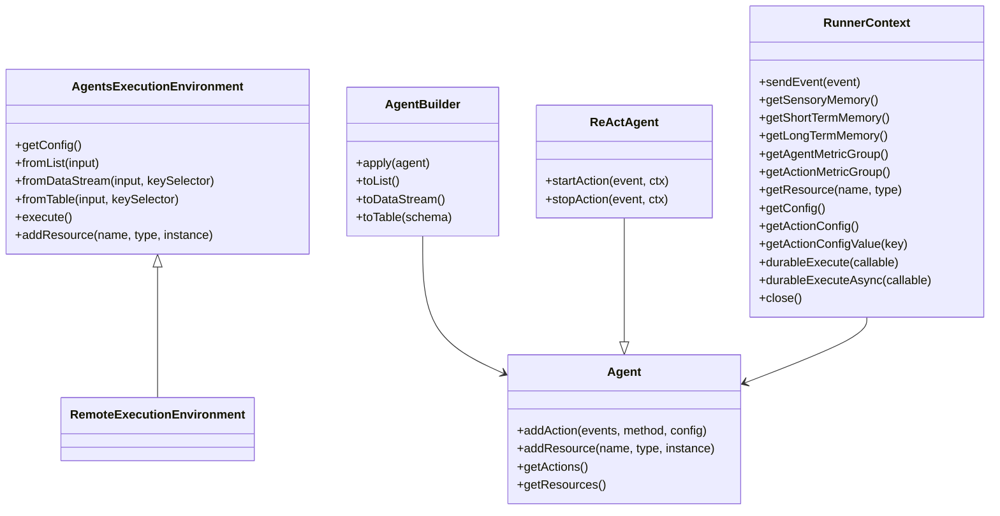
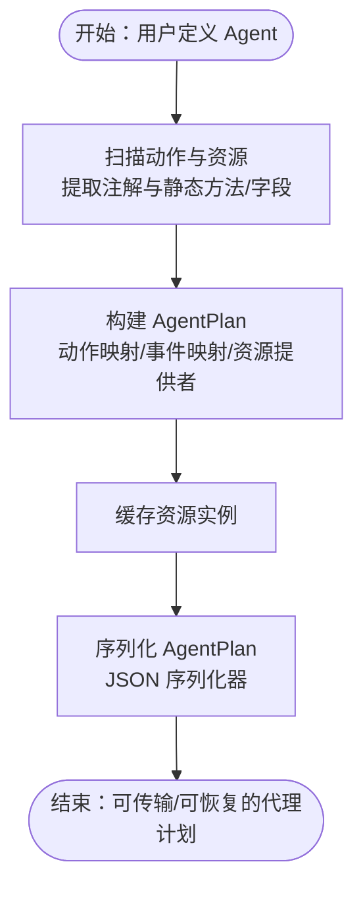
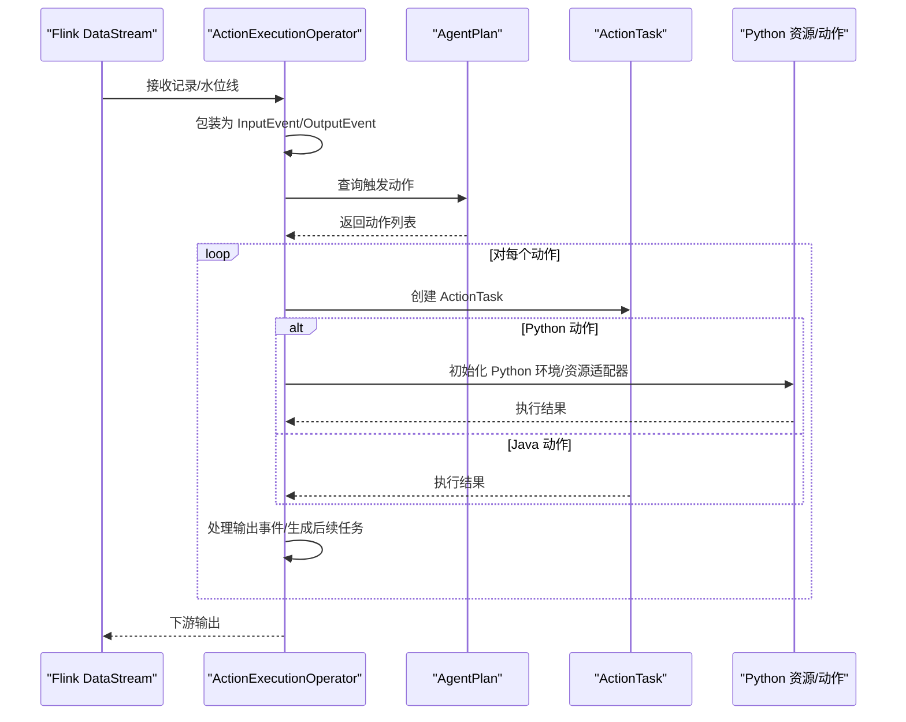
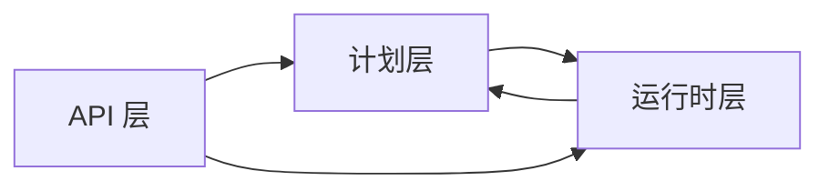

# 分层架构设计

<cite>
**本文档引用的文件**
- [AgentBuilder.java](file://api/src/main/java/org/apache/flink/agents/api/AgentBuilder.java)
- [AgentsExecutionEnvironment.java](file://api/src/main/java/org/apache/flink/agents/api/AgentsExecutionEnvironment.java)
- [Agent.java](file://api/src/main/java/org/apache/flink/agents/api/agents/Agent.java)
- [ReActAgent.java](file://api/src/main/java/org/apache/flink/agents/api/agents/ReActAgent.java)
- [RunnerContext.java](file://api/src/main/java/org/apache/flink/agents/api/context/RunnerContext.java)
- [AgentPlan.java](file://plan/src/main/java/org/apache/flink/agents/plan/AgentPlan.java)
- [Action.java](file://plan/src/main/java/org/apache/flink/agents/plan/actions/Action.java)
- [ResourceProvider.java](file://plan/src/main/java/org/apache/flink/agents/plan/resourceprovider/ResourceProvider.java)
- [AgentPlanJsonSerializer.java](file://plan/src/main/java/org/apache/flink/agents/plan/serializer/AgentPlanJsonSerializer.java)
- [RemoteExecutionEnvironment.java](file://runtime/src/main/java/org/apache/flink/agents/runtime/env/RemoteExecutionEnvironment.java)
- [ActionExecutionOperator.java](file://runtime/src/main/java/org/apache/flink/agents/runtime/operator/ActionExecutionOperator.java)
- [ActionTask.java](file://runtime/src/main/java/org/apache/flink/agents/runtime/operator/ActionTask.java)
- [Function.java](file://plan/src/main/java/org/apache/flink/agents/plan/Function.java)
</cite>

## 目录
1. [引言](#引言)
2. [项目结构](#项目结构)
3. [核心组件](#核心组件)
4. [架构总览](#架构总览)
5. [详细组件分析](#详细组件分析)
6. [依赖关系分析](#依赖关系分析)
7. [性能考虑](#性能考虑)
8. [故障排查指南](#故障排查指南)
9. [结论](#结论)

## 引言
本文件系统性阐述 Apache Flink Agents 的三层分层架构设计：API 层、计划层（Plan）、运行时层（Runtime）。该架构以“关注点分离”为核心理念，通过清晰的职责边界与交互协议，实现从用户定义的智能体到 Flink 流式执行的完整闭环。API 层负责对外接口与配置入口，承担代理构建与输出转换；计划层负责将用户定义的智能体编译为可序列化的代理计划，并管理资源提供者；运行时层则在 Flink 运行时中执行具体动作，维护状态与内存，支持跨语言资源与异步/持久化执行。

## 项目结构
项目采用模块化组织，按三层划分：
- api：对外 API 与注解、事件、工具、资源等基础能力
- plan：代理计划编译、序列化、资源提供者抽象
- runtime：Flink 运行时集成、Operator 实现、状态与内存管理
- integrations：第三方模型与向量库等集成示例
- python：Python 侧 API、计划与运行时实现（与 Java 互通）

**图表来源**
- [AgentBuilder.java](file://api/src/main/java/org/apache/flink/agents/api/AgentBuilder.java#L35-L76)
- [AgentsExecutionEnvironment.java](file://api/src/main/java/org/apache/flink/agents/api/AgentsExecutionEnvironment.java#L43-L222)
- [AgentPlan.java](file://plan/src/main/java/org/apache/flink/agents/plan/AgentPlan.java#L73-L624)
- [Action.java](file://plan/src/main/java/org/apache/flink/agents/plan/actions/Action.java#L43-L99)
- [ResourceProvider.java](file://plan/src/main/java/org/apache/flink/agents/plan/resourceprovider/ResourceProvider.java#L38-L75)
- [AgentPlanJsonSerializer.java](file://plan/src/main/java/org/apache/flink/agents/plan/serializer/AgentPlanJsonSerializer.java#L32-L128)
- [RemoteExecutionEnvironment.java](file://runtime/src/main/java/org/apache/flink/agents/runtime/env/RemoteExecutionEnvironment.java#L50-L216)
- [ActionExecutionOperator.java](file://runtime/src/main/java/org/apache/flink/agents/runtime/operator/ActionExecutionOperator.java#L118-L1132)
- [ActionTask.java](file://runtime/src/main/java/org/apache/flink/agents/runtime/operator/ActionTask.java#L43-L132)

**章节来源**
- [AgentBuilder.java](file://api/src/main/java/org/apache/flink/agents/api/AgentBuilder.java#L29-L76)
- [AgentsExecutionEnvironment.java](file://api/src/main/java/org/apache/flink/agents/api/AgentsExecutionEnvironment.java#L37-L222)
- [AgentPlan.java](file://plan/src/main/java/org/apache/flink/agents/plan/AgentPlan.java#L70-L624)
- [ActionExecutionOperator.java](file://runtime/src/main/java/org/apache/flink/agents/runtime/operator/ActionExecutionOperator.java#L108-L1132)

## 核心组件
- API 层
  - Agent：定义智能体行为与资源注册入口
  - AgentBuilder：面向用户的 Fluent 接口，负责将输入数据流/表转换为代理输出
  - AgentsExecutionEnvironment：统一的执行环境工厂，区分本地与远程（Flink 集群）执行
  - RunnerContext：动作执行上下文，提供事件发送、内存访问、指标、资源获取与持久化执行能力
- 计划层
  - AgentPlan：编译用户智能体为可序列化的代理计划，包含动作映射、事件触发映射、资源提供者与配置
  - Action：封装动作名称、监听事件类型与可执行函数
  - ResourceProvider：资源提供者抽象，负责在运行时创建资源实例
  - AgentPlanJsonSerializer：代理计划 JSON 序列化器，确保跨语言传输一致性
- 运行时层
  - RemoteExecutionEnvironment：远程执行环境，将代理计划接入 Flink DataStream/Table 管道
  - ActionExecutionOperator：核心 Operator，接收上游事件，调度动作执行，处理状态与内存，支持 Python 资源与动作
  - ActionTask：动作任务抽象，表示动作的可拆分执行单元，支持生成后续任务以实现多阶段执行

**章节来源**
- [Agent.java](file://api/src/main/java/org/apache/flink/agents/api/agents/Agent.java#L34-L130)
- [AgentBuilder.java](file://api/src/main/java/org/apache/flink/agents/api/AgentBuilder.java#L35-L76)
- [AgentsExecutionEnvironment.java](file://api/src/main/java/org/apache/flink/agents/api/AgentsExecutionEnvironment.java#L43-L222)
- [RunnerContext.java](file://api/src/main/java/org/apache/flink/agents/api/context/RunnerContext.java#L33-L137)
- [AgentPlan.java](file://plan/src/main/java/org/apache/flink/agents/plan/AgentPlan.java#L73-L624)
- [Action.java](file://plan/src/main/java/org/apache/flink/agents/plan/actions/Action.java#L43-L99)
- [ResourceProvider.java](file://plan/src/main/java/org/apache/flink/agents/plan/resourceprovider/ResourceProvider.java#L38-L75)
- [AgentPlanJsonSerializer.java](file://plan/src/main/java/org/apache/flink/agents/plan/serializer/AgentPlanJsonSerializer.java#L32-L128)
- [RemoteExecutionEnvironment.java](file://runtime/src/main/java/org/apache/flink/agents/runtime/env/RemoteExecutionEnvironment.java#L50-L216)
- [ActionExecutionOperator.java](file://runtime/src/main/java/org/apache/flink/agents/runtime/operator/ActionExecutionOperator.java#L118-L1132)
- [ActionTask.java](file://runtime/src/main/java/org/apache/flink/agents/runtime/operator/ActionTask.java#L43-L132)

## 架构总览
三层架构的职责边界与交互流程如下：
- API 层：用户通过 Agent 定义行为，使用 AgentsExecutionEnvironment 获取执行环境，再通过 AgentBuilder 将输入数据流/表转换为代理输出
- 计划层：AgentPlan 将用户智能体扫描为动作与资源提供者，建立事件到动作的映射，并支持序列化与反序列化
- 运行时层：ActionExecutionOperator 在 Flink 运行时中接收事件，根据 AgentPlan 触发相应动作，维护状态与内存，支持跨语言资源与异步/持久化执行

**图表来源**
- [AgentsExecutionEnvironment.java](file://api/src/main/java/org/apache/flink/agents/api/AgentsExecutionEnvironment.java#L68-L121)
- [RemoteExecutionEnvironment.java](file://runtime/src/main/java/org/apache/flink/agents/runtime/env/RemoteExecutionEnvironment.java#L172-L215)
- [AgentPlan.java](file://plan/src/main/java/org/apache/flink/agents/plan/AgentPlan.java#L132-L141)
- [ActionExecutionOperator.java](file://runtime/src/main/java/org/apache/flink/agents/runtime/operator/ActionExecutionOperator.java#L344-L602)

## 详细组件分析

### API 层：对外接口与配置入口
- AgentsExecutionEnvironment
  - 工厂方法根据是否传入 Flink 环境返回本地或远程执行环境
  - 提供 fromList/fromDataStream/fromTable 等输入适配方法
  - 统一的资源配置注册 addResource
- AgentBuilder
  - apply(Agent)：将智能体应用到构建器
  - toList/toDataStream/toTable：将代理执行结果转换为不同输出形式
- Agent/ReActAgent
  - Agent：声明动作与资源，支持静态方法与字段两种资源注册方式
  - ReActAgent：内置 ReAct 流程，自动注入默认聊天模型与提示词资源，并定义 start/stop 动作
- RunnerContext
  - sendEvent：发送事件到下游
  - 内存访问：感官认知记忆、短期记忆、长期记忆
  - 指标：全局与动作级指标组
  - 资源获取：按名称与类型获取资源
  - 配置：全局与动作级配置读取
  - 持久化执行：同步/异步的持久化执行能力

**图表来源**
- [AgentsExecutionEnvironment.java](file://api/src/main/java/org/apache/flink/agents/api/AgentsExecutionEnvironment.java#L43-L222)
- [AgentBuilder.java](file://api/src/main/java/org/apache/flink/agents/api/AgentBuilder.java#L35-L76)
- [Agent.java](file://api/src/main/java/org/apache/flink/agents/api/agents/Agent.java#L34-L130)
- [ReActAgent.java](file://api/src/main/java/org/apache/flink/agents/api/agents/ReActAgent.java#L51-L182)
- [RunnerContext.java](file://api/src/main/java/org/apache/flink/agents/api/context/RunnerContext.java#L33-L137)

**章节来源**
- [AgentsExecutionEnvironment.java](file://api/src/main/java/org/apache/flink/agents/api/AgentsExecutionEnvironment.java#L68-L121)
- [AgentBuilder.java](file://api/src/main/java/org/apache/flink/agents/api/AgentBuilder.java#L35-L76)
- [Agent.java](file://api/src/main/java/org/apache/flink/agents/api/agents/Agent.java#L34-L130)
- [ReActAgent.java](file://api/src/main/java/org/apache/flink/agents/api/agents/ReActAgent.java#L51-L182)
- [RunnerContext.java](file://api/src/main/java/org/apache/flink/agents/api/context/RunnerContext.java#L33-L137)

### 计划层：代理计划编译、序列化与资源管理
- AgentPlan
  - 从 Agent 反射扫描动作与资源，构建动作映射与事件触发映射
  - 支持 Java/Python 资源提供者，动态注入 Python MCP 服务器并缓存工具与提示词
  - 提供 getResource(name, type) 获取资源实例，带缓存与异常处理
  - 序列化/反序列化支持，便于跨语言传输
- Action
  - 封装动作名称、监听事件类型与可执行函数，校验签名
- ResourceProvider
  - 抽象资源提供者，提供 name/type 与 provide(getResource) 创建资源
- AgentPlanJsonSerializer
  - 序列化 actions、actions_by_event、resource_providers、config

**图表来源**
- [AgentPlan.java](file://plan/src/main/java/org/apache/flink/agents/plan/AgentPlan.java#L132-L141)
- [AgentPlan.java](file://plan/src/main/java/org/apache/flink/agents/plan/AgentPlan.java#L298-L360)
- [AgentPlan.java](file://plan/src/main/java/org/apache/flink/agents/plan/AgentPlan.java#L362-L598)
- [Action.java](file://plan/src/main/java/org/apache/flink/agents/plan/actions/Action.java#L43-L99)
- [ResourceProvider.java](file://plan/src/main/java/org/apache/flink/agents/plan/resourceprovider/ResourceProvider.java#L38-L75)
- [AgentPlanJsonSerializer.java](file://plan/src/main/java/org/apache/flink/agents/plan/serializer/AgentPlanJsonSerializer.java#L38-L127)

**章节来源**
- [AgentPlan.java](file://plan/src/main/java/org/apache/flink/agents/plan/AgentPlan.java#L73-L281)
- [Action.java](file://plan/src/main/java/org/apache/flink/agents/plan/actions/Action.java#L43-L99)
- [ResourceProvider.java](file://plan/src/main/java/org/apache/flink/agents/plan/resourceprovider/ResourceProvider.java#L38-L75)
- [AgentPlanJsonSerializer.java](file://plan/src/main/java/org/apache/flink/agents/plan/serializer/AgentPlanJsonSerializer.java#L32-L128)

### 运行时层：执行逻辑与状态管理
- RemoteExecutionEnvironment
  - 将代理计划注入 Flink 管道，支持 DataStream/Table 输入与 KeySelector
  - 提供 toDataStream/toTable 输出转换
- ActionExecutionOperator
  - 接收上游事件，包装为 InputEvent，按事件类型触发对应动作
  - 维护键分区队列、待处理事件队列、动作任务队列与序列号，保证有序与幂等
  - 支持 Python 环境初始化、Python 资源适配器与 Python 动作执行器
  - 持久化执行上下文与状态，支持 Kafka 等后端的动作状态存储
  - 事件日志与监听器通知，指标统计
- ActionTask
  - 表示动作的可拆分执行单元，invoke 返回 ActionTaskResult
  - 支持生成后续 ActionTask，实现多阶段/异步动作链

**图表来源**
- [RemoteExecutionEnvironment.java](file://runtime/src/main/java/org/apache/flink/agents/runtime/env/RemoteExecutionEnvironment.java#L172-L215)
- [ActionExecutionOperator.java](file://runtime/src/main/java/org/apache/flink/agents/runtime/operator/ActionExecutionOperator.java#L344-L602)
- [ActionExecutionOperator.java](file://runtime/src/main/java/org/apache/flink/agents/runtime/operator/ActionExecutionOperator.java#L612-L688)
- [ActionTask.java](file://runtime/src/main/java/org/apache/flink/agents/runtime/operator/ActionTask.java#L90-L132)

**章节来源**
- [RemoteExecutionEnvironment.java](file://runtime/src/main/java/org/apache/flink/agents/runtime/env/RemoteExecutionEnvironment.java#L50-L216)
- [ActionExecutionOperator.java](file://runtime/src/main/java/org/apache/flink/agents/runtime/operator/ActionExecutionOperator.java#L118-L1132)
- [ActionTask.java](file://runtime/src/main/java/org/apache/flink/agents/runtime/operator/ActionTask.java#L43-L132)

### 关键调用关系示例

#### AgentBuilder 与 AgentPlan 的交互
- RemoteExecutionEnvironment.RemoteAgentBuilder.apply(Agent) 调用 AgentPlan 构造，完成智能体到代理计划的编译
- RemoteExecutionEnvironment.RemoteAgentBuilder.toDataStream 调用 CompileUtils.connectToAgent 将代理计划注入 Flink 管道

**章节来源**
- [RemoteExecutionEnvironment.java](file://runtime/src/main/java/org/apache/flink/agents/runtime/env/RemoteExecutionEnvironment.java#L172-L215)

#### ActionExecutionOperator 中的资源获取与动作执行
- ActionExecutionOperator.getResource(name, type) 委托 AgentPlan.getResource，实现资源缓存与跨语言适配
- ActionExecutionOperator.processEvent/processActionTaskForKey 调度 ActionTask，处理输出事件与生成后续任务

**章节来源**
- [ActionExecutionOperator.java](file://runtime/src/main/java/org/apache/flink/agents/runtime/operator/ActionExecutionOperator.java#L604-L610)
- [ActionExecutionOperator.java](file://runtime/src/main/java/org/apache/flink/agents/runtime/operator/ActionExecutionOperator.java#L372-L602)

#### RunnerContext 在动作中的使用
- RunnerContext.sendEvent 发送事件，RunnerContext.getResource 获取资源，RunnerContext.durableExecute/durableExecuteAsync 支持持久化执行
- ReActAgent.startAction/stopAction 展示了典型的事件驱动动作模式

**章节来源**
- [RunnerContext.java](file://api/src/main/java/org/apache/flink/agents/api/context/RunnerContext.java#L39-L133)
- [ReActAgent.java](file://api/src/main/java/org/apache/flink/agents/api/agents/ReActAgent.java#L103-L181)

## 依赖关系分析
- 耦合与内聚
  - API 层与计划层通过 AgentPlan 解耦，API 层仅关心用户定义，计划层负责编译与序列化
  - 计划层与运行时层通过 AgentPlan 与 ActionExecutionOperator 解耦，运行时层只依赖计划层提供的抽象
  - 资源提供者抽象（ResourceProvider）隔离了 Java/Python 资源差异
- 直接与间接依赖
  - RemoteExecutionEnvironment 依赖 CompileUtils 将代理计划连接到 Flink 管道
  - ActionExecutionOperator 依赖 ActionPlan 的动作与资源信息，同时依赖 Python 环境与资源适配器
- 错误传播
  - AgentPlan.getResource 在找不到资源时抛出异常，ActionExecutionOperator 捕获并包装为运行时异常
  - ActionExecutionOperator 在处理 ActionTask 时捕获异常并通过邮箱线程重新抛出，确保作业失败可见

**图表来源**
- [AgentPlan.java](file://plan/src/main/java/org/apache/flink/agents/plan/AgentPlan.java#L231-L264)
- [ActionExecutionOperator.java](file://runtime/src/main/java/org/apache/flink/agents/runtime/operator/ActionExecutionOperator.java#L604-L610)
- [RemoteExecutionEnvironment.java](file://runtime/src/main/java/org/apache/flink/agents/runtime/env/RemoteExecutionEnvironment.java#L196-L207)

**章节来源**
- [AgentPlan.java](file://plan/src/main/java/org/apache/flink/agents/plan/AgentPlan.java#L231-L264)
- [ActionExecutionOperator.java](file://runtime/src/main/java/org/apache/flink/agents/runtime/operator/ActionExecutionOperator.java#L426-L437)
- [RemoteExecutionEnvironment.java](file://runtime/src/main/java/org/apache/flink/agents/runtime/env/RemoteExecutionEnvironment.java#L196-L207)

## 性能考虑
- 序列化与传输
  - AgentPlanJsonSerializer 将动作、事件映射与资源提供者序列化为紧凑 JSON，便于跨语言传输与持久化
- 状态与内存
  - ActionExecutionOperator 使用键分区队列与序列号保证事件顺序，减少乱序带来的重复执行
  - 感官认知记忆与短期记忆在动作完成后清理，降低状态膨胀
- 异步与持久化
  - RunnerContext.durableExecute/durableExecuteAsync 支持在 JDK 21+ 使用 Continuation 实现非阻塞等待，提升吞吐
  - 动作状态存储支持 Kafka 后端，提高恢复效率
- Python 集成
  - Python 环境按需初始化，避免不必要的开销；资源适配器复用，减少跨语言调用成本

[本节为通用性能建议，不直接分析具体文件]

## 故障排查指南
- 资源未找到
  - 症状：ActionExecutionOperator 调用 getResource 抛出异常
  - 排查：确认 AgentPlan 中已正确注册资源提供者，检查资源名称与类型匹配
- 动作未触发
  - 症状：事件未产生预期输出
  - 排查：检查 AgentPlan 的 actions_by_event 映射是否包含目标事件类型
- Python 环境问题
  - 症状：Python 动作或资源初始化失败
  - 排查：确认 Python 依赖已正确打包，检查 Python 环境初始化日志与资源适配器状态
- 恢复与状态
  - 症状：重启后动作重复执行或丢失
  - 排查：检查 ActionStateStore 的恢复标记与序列号状态，确认 Kafka 后端可用

**章节来源**
- [ActionExecutionOperator.java](file://runtime/src/main/java/org/apache/flink/agents/runtime/operator/ActionExecutionOperator.java#L426-L437)
- [ActionExecutionOperator.java](file://runtime/src/main/java/org/apache/flink/agents/runtime/operator/ActionExecutionOperator.java#L774-L794)
- [AgentPlan.java](file://plan/src/main/java/org/apache/flink/agents/plan/AgentPlan.java#L231-L264)

## 结论
Apache Flink Agents 的三层分层架构通过清晰的职责边界实现了高度的关注点分离：API 层专注于用户易用性与配置入口，计划层专注于编译与序列化，运行时层专注于执行与状态管理。该架构具备良好的可测试性与可扩展性，支持跨语言资源与异步/持久化执行，能够满足复杂智能体在 Flink 流式环境中的多样化需求。