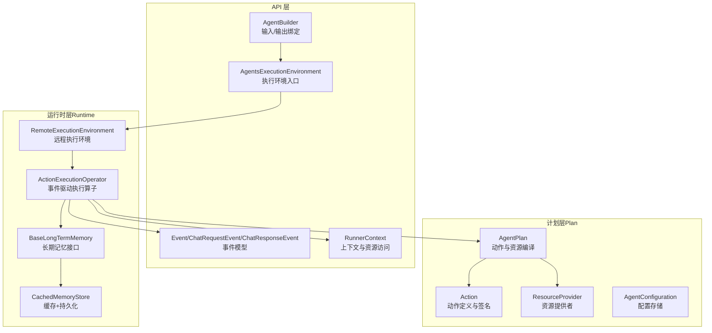
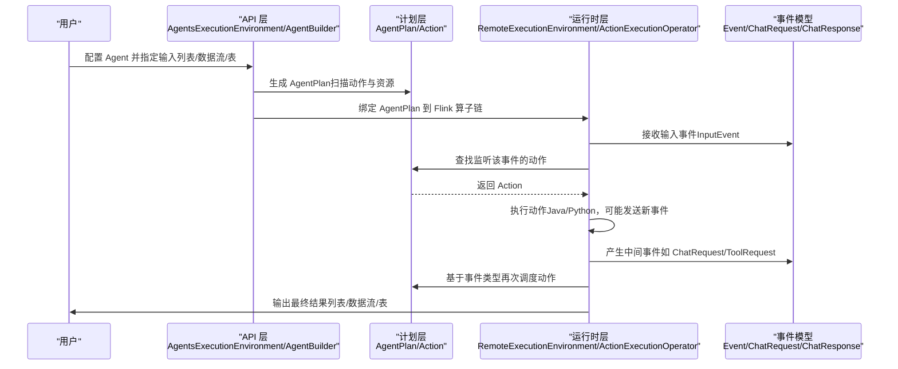
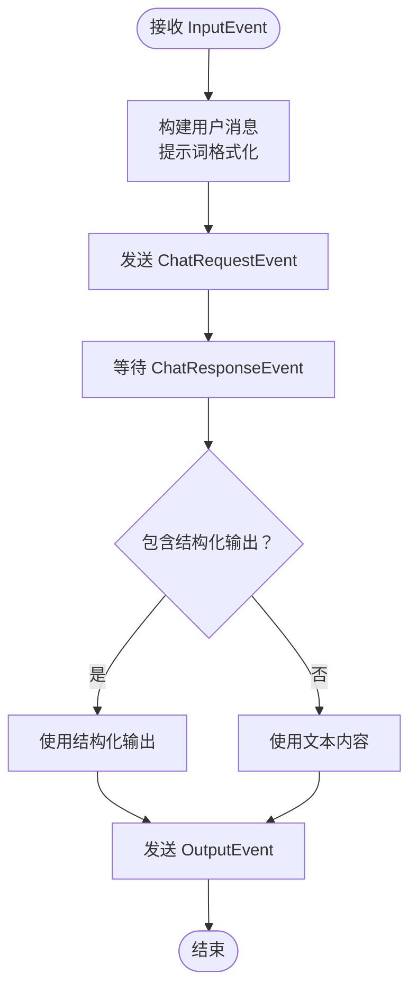
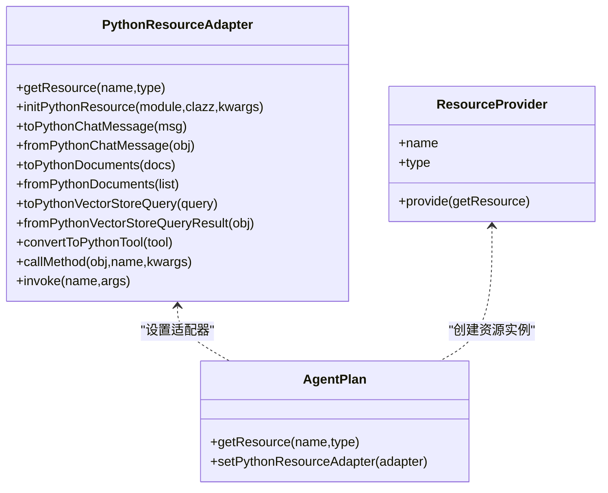
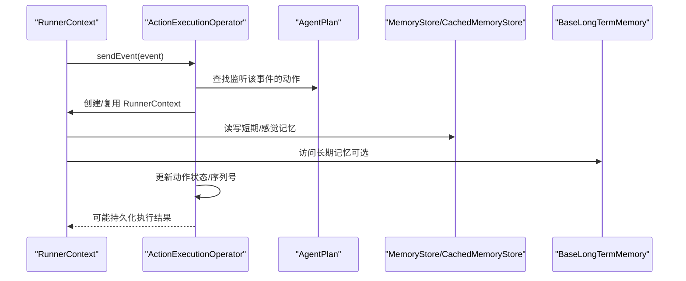
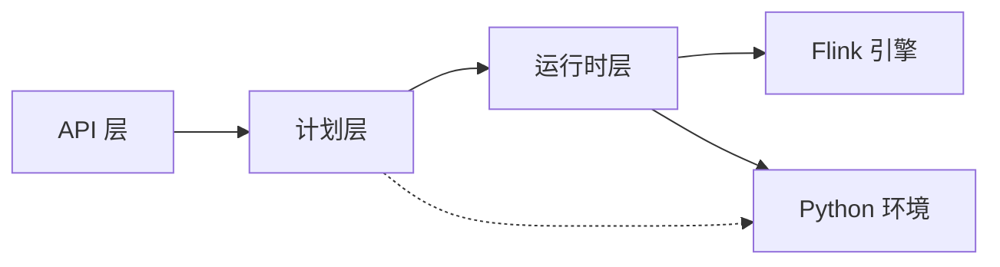
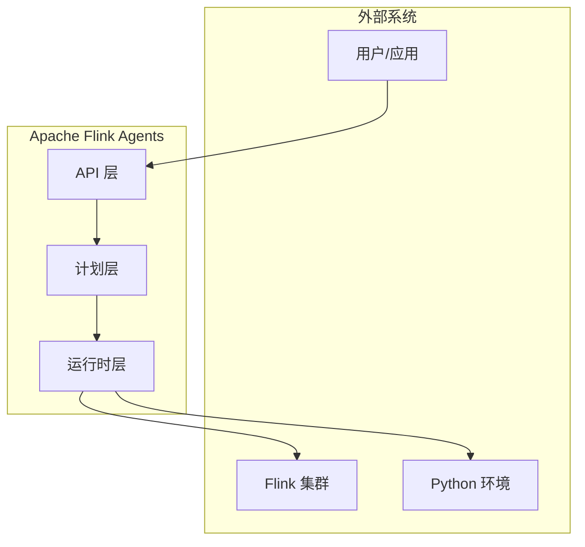

# 架构设计

<cite>
**本文引用的文件**
- [AgentBuilder.java](file://api/src/main/java/org/apache/flink/agents/api/AgentBuilder.java)
- [AgentsExecutionEnvironment.java](file://api/src/main/java/org/apache/flink/agents/api/AgentsExecutionEnvironment.java)
- [AgentPlan.java](file://plan/src/main/java/org/apache/flink/agents/plan/AgentPlan.java)
- [Action.java](file://plan/src/main/java/org/apache/flink/agents/plan/actions/Action.java)
- [ReActAgent.java](file://api/src/main/java/org/apache/flink/agents/api/agents/ReActAgent.java)
- [ChatRequestEvent.java](file://api/src/main/java/org/apache/flink/agents/api/event/ChatRequestEvent.java)
- [ChatResponseEvent.java](file://api/src/main/java/org/apache/flink/agents/api/event/ChatResponseEvent.java)
- [RunnerContext.java](file://api/src/main/java/org/apache/flink/agents/api/context/RunnerContext.java)
- [Event.java](file://api/src/main/java/org/apache/flink/agents/api/Event.java)
- [RemoteExecutionEnvironment.java](file://runtime/src/main/java/org/apache/flink/agents/runtime/env/RemoteExecutionEnvironment.java)
- [ActionExecutionOperator.java](file://runtime/src/main/java/org/apache/flink/agents/runtime/operator/ActionExecutionOperator.java)
- [PythonResourceAdapter.java](file://api/src/main/java/org/apache/flink/agents/api/resource/python/PythonResourceAdapter.java)
- [ResourceProvider.java](file://plan/src/main/java/org/apache/flink/agents/plan/resourceprovider/ResourceProvider.java)
- [BaseLongTermMemory.java](file://api/src/main/java/org/apache/flink/agents/api/memory/BaseLongTermMemory.java)
- [CachedMemoryStore.java](file://runtime/src/main/java/org/apache/flink/agents/runtime/memory/CachedMemoryStore.java)
- [AgentConfiguration.java](file://plan/src/main/java/org/apache/flink/agents/plan/AgentConfiguration.java)
</cite>

## 目录
1. [引言](#引言)
2. [项目结构](#项目结构)
3. [核心组件](#核心组件)
4. [架构总览](#架构总览)
5. [详细组件分析](#详细组件分析)
6. [依赖分析](#依赖分析)
7. [性能考虑](#性能考虑)
8. [故障排查指南](#故障排查指南)
9. [结论](#结论)
10. [附录](#附录)

## 引言
本架构设计文档面向 Apache Flink Agents，聚焦于三层架构与事件驱动机制的设计与实现：API 层负责用户接口与资源声明；计划层（Plan）负责将用户定义的智能体编译为可序列化的执行计划；运行时层（Runtime）负责在 Flink 流式引擎中以事件驱动方式执行动作、管理状态与跨语言资源。文档同时阐述 ReAct 代理机制的“思维-行动-观察”循环、Java-Python 互操作的资源适配器模式、以及组件间的依赖注入、事件传递与状态管理策略。

## 项目结构
仓库采用多模块组织，围绕 API、计划（Plan）、运行时（Runtime）与集成（Integrations）展开，并提供端到端测试与 Python 包支持：
- api：对外 API、事件模型、注解、工具、向量库、资源抽象等
- plan：Agent 计划编译、动作序列化、资源提供者、函数封装等
- runtime：Flink 运行时集成、算子、状态存储、内存与度量等
- integrations：各类外部服务（聊天模型、嵌入模型、MCP、向量库）的 Java 集成
- e2e-test：端到端与跨语言测试
- python：Python 侧 API、事件、工具、向量库、运行时桥接与集成

图表来源
- [AgentBuilder.java](file://api/src/main/java/org/apache/flink/agents/api/AgentBuilder.java#L35-L76)
- [AgentsExecutionEnvironment.java](file://api/src/main/java/org/apache/flink/agents/api/AgentsExecutionEnvironment.java#L43-L222)
- [AgentPlan.java](file://plan/src/main/java/org/apache/flink/agents/plan/AgentPlan.java#L70-L124)
- [Action.java](file://plan/src/main/java/org/apache/flink/agents/plan/actions/Action.java#L35-L100)
- [ResourceProvider.java](file://plan/src/main/java/org/apache/flink/agents/plan/resourceprovider/ResourceProvider.java#L30-L76)
- [RemoteExecutionEnvironment.java](file://runtime/src/main/java/org/apache/flink/agents/runtime/env/RemoteExecutionEnvironment.java#L44-L217)
- [ActionExecutionOperator.java](file://runtime/src/main/java/org/apache/flink/agents/runtime/operator/ActionExecutionOperator.java#L108-L200)
- [BaseLongTermMemory.java](file://api/src/main/java/org/apache/flink/agents/api/memory/BaseLongTermMemory.java#L27-L134)
- [CachedMemoryStore.java](file://runtime/src/main/java/org/apache/flink/agents/runtime/memory/CachedMemoryStore.java#L25-L66)

章节来源
- [AgentBuilder.java](file://api/src/main/java/org/apache/flink/agents/api/AgentBuilder.java#L35-L76)
- [AgentsExecutionEnvironment.java](file://api/src/main/java/org/apache/flink/agents/api/AgentsExecutionEnvironment.java#L43-L222)
- [AgentPlan.java](file://plan/src/main/java/org/apache/flink/agents/plan/AgentPlan.java#L70-L124)
- [Action.java](file://plan/src/main/java/org/apache/flink/agents/plan/actions/Action.java#L35-L100)
- [ResourceProvider.java](file://plan/src/main/java/org/apache/flink/agents/plan/resourceprovider/ResourceProvider.java#L30-L76)
- [RemoteExecutionEnvironment.java](file://runtime/src/main/java/org/apache/flink/agents/runtime/env/RemoteExecutionEnvironment.java#L44-L217)
- [ActionExecutionOperator.java](file://runtime/src/main/java/org/apache/flink/agents/runtime/operator/ActionExecutionOperator.java#L108-L200)
- [BaseLongTermMemory.java](file://api/src/main/java/org/apache/flink/agents/api/memory/BaseLongTermMemory.java#L27-L134)
- [CachedMemoryStore.java](file://runtime/src/main/java/org/apache/flink/agents/runtime/memory/CachedMemoryStore.java#L25-L66)

## 核心组件
- API 层
  - 执行环境入口：提供本地与远程两种执行环境，统一从列表、数据流或表构造 AgentBuilder
  - 输入/输出绑定：将 Agent 的输出转换为列表、数据流或表
  - 事件模型：定义通用事件基类与聊天请求/响应事件
  - 上下文接口：RunnerContext 提供发送事件、内存访问、指标组、资源获取与持久化执行能力
- 计划层
  - AgentPlan：扫描用户 Agent，提取动作与资源提供者，构建动作映射与事件触发关系，支持 Java/Python 资源与 MCP 服务器
  - Action：封装动作名称、监听事件类型、执行函数与配置
  - ResourceProvider：携带资源元信息并在运行时创建资源实例
  - AgentConfiguration：键值配置存储与类型安全读取
- 运行时层
  - RemoteExecutionEnvironment：将 AgentPlan 注入到 Flink 算子链，支持 DataStream/Table 输入与输出
  - ActionExecutionOperator：事件驱动的动作执行算子，负责动作调度、状态恢复、内存与度量、跨语言资源桥接
  - 内存与状态：BaseLongTermMemory 抽象长期记忆，CachedMemoryStore 提供缓存与持久化写回

章节来源
- [AgentsExecutionEnvironment.java](file://api/src/main/java/org/apache/flink/agents/api/AgentsExecutionEnvironment.java#L43-L222)
- [AgentBuilder.java](file://api/src/main/java/org/apache/flink/agents/api/AgentBuilder.java#L35-L76)
- [Event.java](file://api/src/main/java/org/apache/flink/agents/api/Event.java#L29-L90)
- [ChatRequestEvent.java](file://api/src/main/java/org/apache/flink/agents/api/event/ChatRequestEvent.java#L28-L58)
- [ChatResponseEvent.java](file://api/src/main/java/org/apache/flink/agents/api/event/ChatResponseEvent.java#L26-L43)
- [RunnerContext.java](file://api/src/main/java/org/apache/flink/agents/api/context/RunnerContext.java#L29-L138)
- [AgentPlan.java](file://plan/src/main/java/org/apache/flink/agents/plan/AgentPlan.java#L70-L124)
- [Action.java](file://plan/src/main/java/org/apache/flink/agents/plan/actions/Action.java#L35-L100)
- [ResourceProvider.java](file://plan/src/main/java/org/apache/flink/agents/plan/resourceprovider/ResourceProvider.java#L30-L76)
- [AgentConfiguration.java](file://plan/src/main/java/org/apache/flink/agents/plan/AgentConfiguration.java#L28-L180)
- [RemoteExecutionEnvironment.java](file://runtime/src/main/java/org/apache/flink/agents/runtime/env/RemoteExecutionEnvironment.java#L44-L217)
- [ActionExecutionOperator.java](file://runtime/src/main/java/org/apache/flink/agents/runtime/operator/ActionExecutionOperator.java#L108-L200)
- [BaseLongTermMemory.java](file://api/src/main/java/org/apache/flink/agents/api/memory/BaseLongTermMemory.java#L27-L134)
- [CachedMemoryStore.java](file://runtime/src/main/java/org/apache/flink/agents/runtime/memory/CachedMemoryStore.java#L25-L66)

## 架构总览
三层架构与事件驱动工作流如下：

图表来源
- [AgentsExecutionEnvironment.java](file://api/src/main/java/org/apache/flink/agents/api/AgentsExecutionEnvironment.java#L128-L198)
- [AgentPlan.java](file://plan/src/main/java/org/apache/flink/agents/plan/AgentPlan.java#L219-L221)
- [ActionExecutionOperator.java](file://runtime/src/main/java/org/apache/flink/agents/runtime/operator/ActionExecutionOperator.java#L108-L200)
- [Event.java](file://api/src/main/java/org/apache/flink/agents/api/Event.java#L29-L90)
- [ChatRequestEvent.java](file://api/src/main/java/org/apache/flink/agents/api/event/ChatRequestEvent.java#L28-L58)
- [ChatResponseEvent.java](file://api/src/main/java/org/apache/flink/agents/api/event/ChatResponseEvent.java#L26-L43)

## 详细组件分析

### 分层架构与职责划分
- API 层
  - 责任：暴露统一的执行环境入口、输入绑定与输出转换；提供事件模型与上下文接口
  - 关键点：通过工厂方法按是否传入 Flink 环境返回本地或远程执行环境；支持从列表、数据流、表三种输入源构建管道
- 计划层
  - 责任：将用户定义的 Agent 编译为可序列化的 AgentPlan；建立事件到动作的映射；管理资源提供者与缓存
  - 关键点：扫描注解与静态方法，构建内置动作与用户自定义动作；对 Java/Python 资源进行差异化处理；支持 MCP 服务器自动发现工具与提示词
- 运行时层
  - 责任：在 Flink 中执行 AgentPlan；事件驱动的动作调度；状态与内存管理；跨语言资源桥接
  - 关键点：ActionExecutionOperator 作为核心算子，负责动作任务拆分、状态恢复、度量与日志；RemoteExecutionEnvironment 将计划接入 Flink 管道

章节来源
- [AgentsExecutionEnvironment.java](file://api/src/main/java/org/apache/flink/agents/api/AgentsExecutionEnvironment.java#L68-L121)
- [AgentPlan.java](file://plan/src/main/java/org/apache/flink/agents/plan/AgentPlan.java#L132-L141)
- [RemoteExecutionEnvironment.java](file://runtime/src/main/java/org/apache/flink/agents/runtime/env/RemoteExecutionEnvironment.java#L59-L94)
- [ActionExecutionOperator.java](file://runtime/src/main/java/org/apache/flink/agents/runtime/operator/ActionExecutionOperator.java#L108-L200)

### 事件驱动架构与 ReAct 循环
- 事件驱动
  - 输入事件被包装为 InputEvent 后进入 ActionExecutionOperator
  - 算子根据事件类型查找对应 Action，调用 RunnerContext 执行动作逻辑
  - 动作可发送新的事件（如 ChatRequestEvent），形成事件链式流转
- ReAct 机制
  - ReActAgent 在收到 InputEvent 后，组装用户提示与输入消息，发送 ChatRequestEvent
  - 收到 ChatResponseEvent 后解析结构化输出，生成 OutputEvent
  - 该过程体现了“思维（Reasoning）- 行动（Action）- 观察（Observation）”的循环

图表来源
- [ReActAgent.java](file://api/src/main/java/org/apache/flink/agents/api/agents/ReActAgent.java#L103-L181)
- [ChatRequestEvent.java](file://api/src/main/java/org/apache/flink/agents/api/event/ChatRequestEvent.java#L28-L58)
- [ChatResponseEvent.java](file://api/src/main/java/org/apache/flink/agents/api/event/ChatResponseEvent.java#L26-L43)

章节来源
- [ReActAgent.java](file://api/src/main/java/org/apache/flink/agents/api/agents/ReActAgent.java#L50-L181)
- [ChatRequestEvent.java](file://api/src/main/java/org/apache/flink/agents/api/event/ChatRequestEvent.java#L28-L58)
- [ChatResponseEvent.java](file://api/src/main/java/org/apache/flink/agents/api/event/ChatResponseEvent.java#L26-L43)

### 跨语言执行架构与资源适配器模式
- 资源适配器
  - PythonResourceAdapter 定义了 Java 与 Python 对象之间的互操作接口，包括消息、文档、查询、工具等对象的双向转换与方法调用
  - 运行时通过 JavaResourceAdapter 与 PythonResourceAdapterImpl 实现双向桥接
- 资源提供者
  - ResourceProvider 携带资源元信息，在运行时创建资源实例；支持 Java 与 Python 资源提供者
  - AgentPlan 在检测到 Python 资源时，设置 PythonResourceAdapter 并预取 MCP 工具与提示词到本地缓存
- 执行路径
  - Java 动作调用 Python 资源：通过 JavaResourceAdapter 将 Java 对象转为 Python 对象，调用 Python 方法后回传结果
  - Python 动作调用 Java 资源：通过 PythonResourceAdapterImpl 将 Python 对象转为 Java 对象，再由 RunnerContext 使用

图表来源
- [PythonResourceAdapter.java](file://api/src/main/java/org/apache/flink/agents/api/resource/python/PythonResourceAdapter.java#L32-L141)
- [ResourceProvider.java](file://plan/src/main/java/org/apache/flink/agents/plan/resourceprovider/ResourceProvider.java#L30-L76)
- [AgentPlan.java](file://plan/src/main/java/org/apache/flink/agents/plan/AgentPlan.java#L143-L197)

章节来源
- [PythonResourceAdapter.java](file://api/src/main/java/org/apache/flink/agents/api/resource/python/PythonResourceAdapter.java#L32-L141)
- [ResourceProvider.java](file://plan/src/main/java/org/apache/flink/agents/plan/resourceprovider/ResourceProvider.java#L30-L76)
- [AgentPlan.java](file://plan/src/main/java/org/apache/flink/agents/plan/AgentPlan.java#L143-L197)

### 组件交互模式：依赖注入、事件传递与状态管理
- 依赖注入
  - AgentPlan 通过扫描注解与静态方法收集动作与资源；资源提供者在运行时创建资源实例
  - RemoteExecutionEnvironment 将注册到执行环境的资源注入到 Agent 中
- 事件传递
  - RunnerContext.sendEvent 发送事件；ActionExecutionOperator 根据事件类型查找动作并执行
  - 输出事件（OutputEvent）直接透传到下游；中间事件继续驱动后续动作
- 状态管理
  - ActionExecutionOperator 维护动作状态、待处理输入事件、当前处理键集合与检查点序列号
  - 内存管理：CachedMemoryStore 提供内存缓存与持久化写回；BaseLongTermMemory 抽象长期记忆集合的增删查与语义检索

图表来源
- [RunnerContext.java](file://api/src/main/java/org/apache/flink/agents/api/context/RunnerContext.java#L29-L138)
- [ActionExecutionOperator.java](file://runtime/src/main/java/org/apache/flink/agents/runtime/operator/ActionExecutionOperator.java#L108-L200)
- [AgentPlan.java](file://plan/src/main/java/org/apache/flink/agents/plan/AgentPlan.java#L231-L264)
- [CachedMemoryStore.java](file://runtime/src/main/java/org/apache/flink/agents/runtime/memory/CachedMemoryStore.java#L25-L66)
- [BaseLongTermMemory.java](file://api/src/main/java/org/apache/flink/agents/api/memory/BaseLongTermMemory.java#L27-L134)

章节来源
- [RunnerContext.java](file://api/src/main/java/org/apache/flink/agents/api/context/RunnerContext.java#L29-L138)
- [ActionExecutionOperator.java](file://runtime/src/main/java/org/apache/flink/agents/runtime/operator/ActionExecutionOperator.java#L108-L200)
- [AgentPlan.java](file://plan/src/main/java/org/apache/flink/agents/plan/AgentPlan.java#L231-L264)
- [CachedMemoryStore.java](file://runtime/src/main/java/org/apache/flink/agents/runtime/memory/CachedMemoryStore.java#L25-L66)
- [BaseLongTermMemory.java](file://api/src/main/java/org/apache/flink/agents/api/memory/BaseLongTermMemory.java#L27-L134)

## 依赖分析
- 组件耦合
  - API 层与运行时层通过 AgentBuilder/AgentsExecutionEnvironment 解耦；RemoteExecutionEnvironment 将计划注入到算子链
  - 计划层与运行时层通过 AgentPlan 与 ActionExecutionOperator 解耦；动作与资源通过 ResourceProvider 抽象解耦
- 外部依赖
  - Flink 流式 API 与表 API；Python 环境（pemja）用于跨语言桥接
- 潜在循环依赖
  - 当前结构以 API/Plan/Runtime 单向依赖为主，未见明显循环

图表来源
- [AgentsExecutionEnvironment.java](file://api/src/main/java/org/apache/flink/agents/api/AgentsExecutionEnvironment.java#L68-L121)
- [RemoteExecutionEnvironment.java](file://runtime/src/main/java/org/apache/flink/agents/runtime/env/RemoteExecutionEnvironment.java#L59-L94)
- [ActionExecutionOperator.java](file://runtime/src/main/java/org/apache/flink/agents/runtime/operator/ActionExecutionOperator.java#L108-L200)

章节来源
- [AgentsExecutionEnvironment.java](file://api/src/main/java/org/apache/flink/agents/api/AgentsExecutionEnvironment.java#L68-L121)
- [RemoteExecutionEnvironment.java](file://runtime/src/main/java/org/apache/flink/agents/runtime/env/RemoteExecutionEnvironment.java#L59-L94)
- [ActionExecutionOperator.java](file://runtime/src/main/java/org/apache/flink/agents/runtime/operator/ActionExecutionOperator.java#L108-L200)

## 性能考虑
- 事件驱动与算子链
  - 通过 Flink 算子链与分区键实现高吞吐与低延迟；动作状态与序列号确保恢复一致性
- 跨语言开销
  - PythonResourceAdapter 仅在需要时进行对象转换与方法调用；建议减少频繁跨语言调用，合并批处理
- 内存与状态
  - CachedMemoryStore 提供缓存写回，降低状态后端压力；长期记忆建议配合容量限制与压缩策略
- 可扩展性
  - 资源提供者与动作可插拔；MCP 服务器自动发现工具与提示词提升扩展能力

## 故障排查指南
- 常见问题
  - 动作签名不匹配：Action 构造时会校验函数签名，需确保形参为 (Event, RunnerContext)
  - 资源未找到：AgentPlan 获取资源时若缓存与提供者均无对应资源会抛出异常
  - 远程环境不支持 fromList：RemoteExecutionEnvironment 不支持从列表输入，应使用数据流或表
- 排查步骤
  - 检查 AgentPlan 的动作与事件映射是否正确
  - 确认资源提供者类型与适配器是否正确设置
  - 核对 RunnerContext 的持久化执行与内存访问是否在允许范围内
  - 关注 ActionExecutionOperator 的状态恢复标记与序列号一致性

章节来源
- [Action.java](file://plan/src/main/java/org/apache/flink/agents/plan/actions/Action.java#L61-L62)
- [AgentPlan.java](file://plan/src/main/java/org/apache/flink/agents/plan/AgentPlan.java#L231-L264)
- [RemoteExecutionEnvironment.java](file://runtime/src/main/java/org/apache/flink/agents/runtime/env/RemoteExecutionEnvironment.java#L80-L83)
- [RunnerContext.java](file://api/src/main/java/org/apache/flink/agents/api/context/RunnerContext.java#L113-L133)

## 结论
本架构以清晰的三层分离与事件驱动为核心，结合可序列化的计划层与强大的运行时算子，实现了在 Flink 上的智能体流水线。ReAct 机制通过“思维-行动-观察”闭环，使智能体能够与外部资源（聊天模型、工具、向量库）协同完成复杂任务。跨语言资源适配器模式有效平衡了 Java 生态与 Python 生态的互补优势。通过状态管理与内存抽象，系统在性能、可扩展性与可维护性之间取得良好平衡。

## 附录
- 系统边界图（概念示意）

