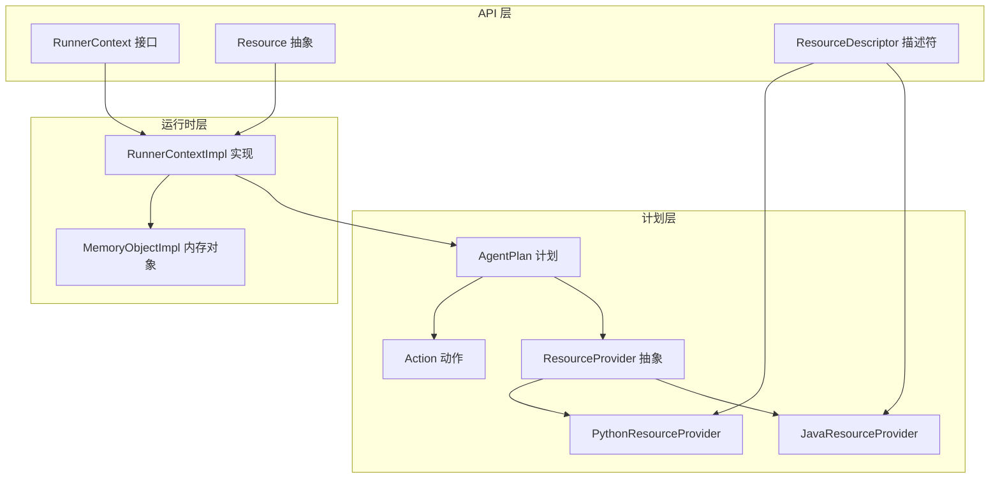
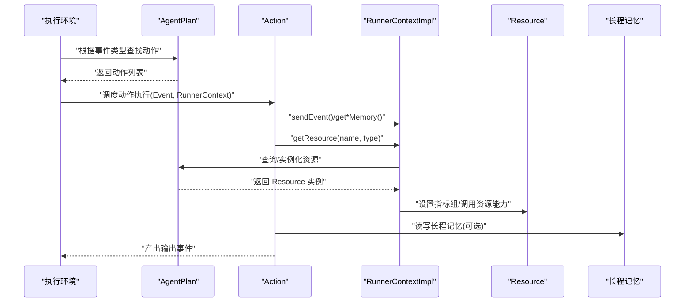
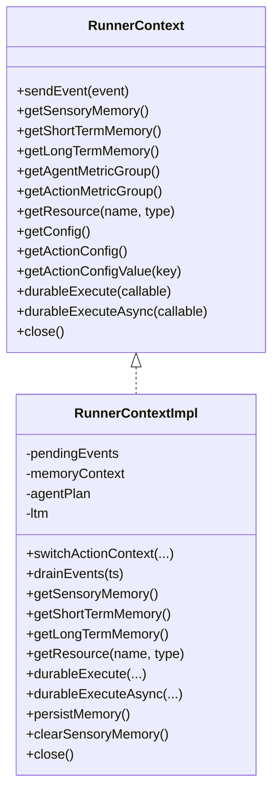
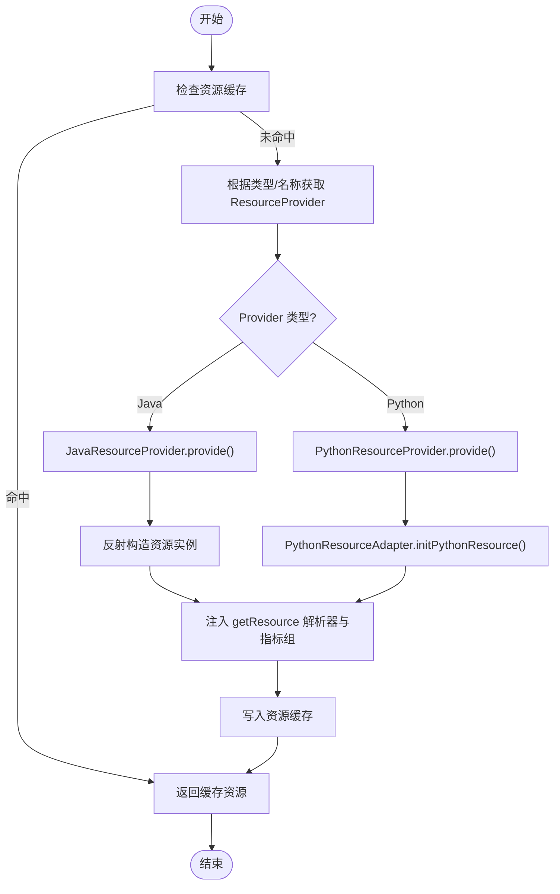
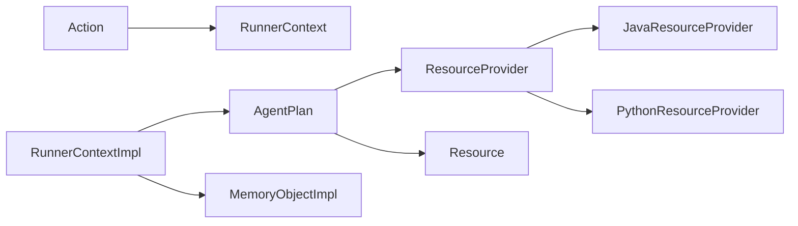

# 组件交互模式

<cite>
**本文引用的文件**
- [RunnerContext.java](file://api/src/main/java/org/apache/flink/agents/api/context/RunnerContext.java)
- [RunnerContextImpl.java](file://runtime/src/main/java/org/apache/flink/agents/runtime/context/RunnerContextImpl.java)
- [ResourceDescriptor.java](file://api/src/main/java/org/apache/flink/agents/api/resource/ResourceDescriptor.java)
- [Resource.java](file://api/src/main/java/org/apache/flink/agents/api/resource/Resource.java)
- [ResourceProvider.java](file://plan/src/main/java/org/apache/flink/agents/plan/resourceprovider/ResourceProvider.java)
- [JavaResourceProvider.java](file://plan/src/main/java/org/apache/flink/agents/plan/resourceprovider/JavaResourceProvider.java)
- [PythonResourceProvider.java](file://plan/src/main/java/org/apache/flink/agents/plan/resourceprovider/PythonResourceProvider.java)
- [AgentPlan.java](file://plan/src/main/java/org/apache/flink/agents/plan/AgentPlan.java)
- [Action.java](file://plan/src/main/java/org/apache/flink/agents/plan/actions/Action.java)
- [MemoryObjectImpl.java](file://runtime/src/main/java/org/apache/flink/agents/runtime/memory/MemoryObjectImpl.java)
</cite>

## 目录
1. [引言](#引言)
2. [项目结构](#项目结构)
3. [核心组件](#核心组件)
4. [架构总览](#架构总览)
5. [详细组件分析](#详细组件分析)
6. [依赖关系分析](#依赖关系分析)
7. [性能与并发特性](#性能与并发特性)
8. [故障传播与异常处理](#故障传播与异常处理)
9. [最佳实践与排错指南](#最佳实践与排错指南)
10. [结论](#结论)

## 引言
本文件面向 Apache Flink Agents 的组件交互模式，系统性梳理 RunnerContext 在执行期的核心作用、资源发现与获取的完整流程（ResourceDescriptor 与 ResourceProvider 的协作）、组件解耦设计（接口抽象、依赖反转、服务定位器模式），以及初始化顺序与运行时动态装配。同时给出关键交互序列图与类关系图，帮助开发者快速理解复杂组件协作。

## 项目结构
从代码库可见，系统按“API 层（对外契约）—计划层（编排与序列化）—运行时层（执行与状态）”分层组织：
- API 层：定义事件、上下文、资源、工具、向量库等通用抽象与契约
- 计划层：负责将用户 Agent 编译为可序列化的 AgentPlan，并管理资源提供者
- 运行时层：在 Flink 执行环境中调度动作、维护状态、提供 RunnerContext 实现

图表来源
- [RunnerContext.java](file://api/src/main/java/org/apache/flink/agents/api/context/RunnerContext.java#L33-L137)
- [RunnerContextImpl.java](file://runtime/src/main/java/org/apache/flink/agents/runtime/context/RunnerContextImpl.java#L60-L590)
- [ResourceDescriptor.java](file://api/src/main/java/org/apache/flink/agents/api/resource/ResourceDescriptor.java#L29-L143)
- [Resource.java](file://api/src/main/java/org/apache/flink/agents/api/resource/Resource.java#L30-L70)
- [ResourceProvider.java](file://plan/src/main/java/org/apache/flink/agents/plan/resourceprovider/ResourceProvider.java#L38-L75)
- [JavaResourceProvider.java](file://plan/src/main/java/org/apache/flink/agents/plan/resourceprovider/JavaResourceProvider.java#L29-L56)
- [PythonResourceProvider.java](file://plan/src/main/java/org/apache/flink/agents/plan/resourceprovider/PythonResourceProvider.java#L47-L148)
- [AgentPlan.java](file://plan/src/main/java/org/apache/flink/agents/plan/AgentPlan.java#L73-L624)
- [Action.java](file://plan/src/main/java/org/apache/flink/agents/plan/actions/Action.java#L43-L99)
- [MemoryObjectImpl.java](file://runtime/src/main/java/org/apache/flink/agents/runtime/memory/MemoryObjectImpl.java#L33-L259)

章节来源
- [RunnerContext.java](file://api/src/main/java/org/apache/flink/agents/api/context/RunnerContext.java#L29-L137)
- [RunnerContextImpl.java](file://runtime/src/main/java/org/apache/flink/agents/runtime/context/RunnerContextImpl.java#L60-L590)
- [ResourceDescriptor.java](file://api/src/main/java/org/apache/flink/agents/api/resource/ResourceDescriptor.java#L28-L143)
- [Resource.java](file://api/src/main/java/org/apache/flink/agents/api/resource/Resource.java#L25-L70)
- [ResourceProvider.java](file://plan/src/main/java/org/apache/flink/agents/plan/resourceprovider/ResourceProvider.java#L30-L75)
- [JavaResourceProvider.java](file://plan/src/main/java/org/apache/flink/agents/plan/resourceprovider/JavaResourceProvider.java#L28-L56)
- [PythonResourceProvider.java](file://plan/src/main/java/org/apache/flink/agents/plan/resourceprovider/PythonResourceProvider.java#L41-L148)
- [AgentPlan.java](file://plan/src/main/java/org/apache/flink/agents/plan/AgentPlan.java#L70-L624)
- [Action.java](file://plan/src/main/java/org/apache/flink/agents/plan/actions/Action.java#L35-L99)
- [MemoryObjectImpl.java](file://runtime/src/main/java/org/apache/flink/agents/runtime/memory/MemoryObjectImpl.java#L33-L259)

## 核心组件
- RunnerContext/RunnerContextImpl：动作执行期的上下文载体，负责事件发送、内存访问、资源获取、配置读取、度量组访问、持久化执行（durableExecute/durableExecuteAsync）与生命周期关闭
- Resource/ResourceDescriptor：资源抽象与跨语言描述符，承载资源类型、类名、模块路径与初始参数
- ResourceProvider/JavaResourceProvider/PythonResourceProvider：资源提供者抽象及其 Java/Python 实现，负责根据描述符在运行时实例化资源
- AgentPlan：编译后的执行计划，维护动作映射、事件到动作的路由、资源提供者注册表与资源缓存，支持跨语言 MCP 服务器的动态工具/提示注入
- Action：封装动作名称、监听事件类型与执行函数签名校验
- MemoryObjectImpl：短/长期记忆的树形存储与更新记录，支持路径访问、字段枚举与增量更新

章节来源
- [RunnerContext.java](file://api/src/main/java/org/apache/flink/agents/api/context/RunnerContext.java#L33-L137)
- [RunnerContextImpl.java](file://runtime/src/main/java/org/apache/flink/agents/runtime/context/RunnerContextImpl.java#L60-L590)
- [Resource.java](file://api/src/main/java/org/apache/flink/agents/api/resource/Resource.java#L30-L70)
- [ResourceDescriptor.java](file://api/src/main/java/org/apache/flink/agents/api/resource/ResourceDescriptor.java#L28-L143)
- [ResourceProvider.java](file://plan/src/main/java/org/apache/flink/agents/plan/resourceprovider/ResourceProvider.java#L30-L75)
- [JavaResourceProvider.java](file://plan/src/main/java/org/apache/flink/agents/plan/resourceprovider/JavaResourceProvider.java#L28-L56)
- [PythonResourceProvider.java](file://plan/src/main/java/org/apache/flink/agents/plan/resourceprovider/PythonResourceProvider.java#L41-L148)
- [AgentPlan.java](file://plan/src/main/java/org/apache/flink/agents/plan/AgentPlan.java#L73-L624)
- [Action.java](file://plan/src/main/java/org/apache/flink/agents/plan/actions/Action.java#L35-L99)
- [MemoryObjectImpl.java](file://runtime/src/main/java/org/apache/flink/agents/runtime/memory/MemoryObjectImpl.java#L33-L259)

## 架构总览
下图展示从事件触发到动作执行、资源获取与状态更新的端到端交互：

图表来源
- [AgentPlan.java](file://plan/src/main/java/org/apache/flink/agents/plan/AgentPlan.java#L231-L264)
- [Action.java](file://plan/src/main/java/org/apache/flink/agents/plan/actions/Action.java#L51-L62)
- [RunnerContextImpl.java](file://runtime/src/main/java/org/apache/flink/agents/runtime/context/RunnerContextImpl.java#L149-L231)
- [Resource.java](file://api/src/main/java/org/apache/flink/agents/api/resource/Resource.java#L30-L70)

## 详细组件分析

### RunnerContext 在组件交互中的核心作用
- 上下文传递：动作通过 RunnerContext 获取事件、内存、资源、配置与指标组；在多动作链路中保持一致的执行语义
- 资源共享：RunnerContext.getResource 将当前动作的指标组注入到资源实例，便于统一观测
- 生命周期管理：RunnerContextImpl 负责事件缓冲、内存更新收集、持久化执行上下文、长程记忆切换与关闭
- 持久化执行：durableExecute/durableExecuteAsync 支持结果缓存与恢复，避免非确定性重放

图表来源
- [RunnerContext.java](file://api/src/main/java/org/apache/flink/agents/api/context/RunnerContext.java#L33-L137)
- [RunnerContextImpl.java](file://runtime/src/main/java/org/apache/flink/agents/runtime/context/RunnerContextImpl.java#L60-L590)

章节来源
- [RunnerContext.java](file://api/src/main/java/org/apache/flink/agents/api/context/RunnerContext.java#L33-L137)
- [RunnerContextImpl.java](file://runtime/src/main/java/org/apache/flink/agents/runtime/context/RunnerContextImpl.java#L127-L231)
- [RunnerContextImpl.java](file://runtime/src/main/java/org/apache/flink/agents/runtime/context/RunnerContextImpl.java#L284-L353)
- [RunnerContextImpl.java](file://runtime/src/main/java/org/apache/flink/agents/runtime/context/RunnerContextImpl.java#L405-L426)

### ResourceDescriptor 与 ResourceProvider 协作流程
- ResourceDescriptor 描述资源的类名、模块与初始参数，支持 Java 与 Python 资源跨语言声明
- ResourceProvider 抽象负责创建资源；JavaResourceProvider 借助反射与构造函数注入描述符与资源解析器；PythonResourceProvider 通过 PythonResourceAdapter 初始化 Python 资源并绑定对应适配类
- AgentPlan 统一管理资源提供者注册表与实例缓存，支持跨语言 MCP 服务器动态注入工具与提示

图表来源
- [AgentPlan.java](file://plan/src/main/java/org/apache/flink/agents/plan/AgentPlan.java#L231-L264)
- [JavaResourceProvider.java](file://plan/src/main/java/org/apache/flink/agents/plan/resourceprovider/JavaResourceProvider.java#L37-L51)
- [PythonResourceProvider.java](file://plan/src/main/java/org/apache/flink/agents/plan/resourceprovider/PythonResourceProvider.java#L76-L126)
- [Resource.java](file://api/src/main/java/org/apache/flink/agents/api/resource/Resource.java#L30-L70)

章节来源
- [ResourceDescriptor.java](file://api/src/main/java/org/apache/flink/agents/api/resource/ResourceDescriptor.java#L28-L143)
- [ResourceProvider.java](file://plan/src/main/java/org/apache/flink/agents/plan/resourceprovider/ResourceProvider.java#L30-L75)
- [JavaResourceProvider.java](file://plan/src/main/java/org/apache/flink/agents/plan/resourceprovider/JavaResourceProvider.java#L28-L56)
- [PythonResourceProvider.java](file://plan/src/main/java/org/apache/flink/agents/plan/resourceprovider/PythonResourceProvider.java#L41-L148)
- [AgentPlan.java](file://plan/src/main/java/org/apache/flink/agents/plan/AgentPlan.java#L231-L264)
- [Resource.java](file://api/src/main/java/org/apache/flink/agents/api/resource/Resource.java#L30-L70)

### 组件解耦设计与依赖反转
- 接口抽象：RunnerContext、Resource、ResourceProvider 等均以接口/抽象类定义契约，屏蔽实现细节
- 依赖反转：动作不直接构造资源，而是通过 RunnerContext.getResource 或 ResourceProvider 提供的工厂方法间接获取
- 服务定位器模式：AgentPlan 充当资源定位器，集中管理资源提供者与缓存，动作仅需提供资源标识即可获取
- 跨语言解耦：通过 ResourceDescriptor 与 PythonResourceAdapter，Java 侧以统一方式声明与使用 Python 资源

章节来源
- [RunnerContext.java](file://api/src/main/java/org/apache/flink/agents/api/context/RunnerContext.java#L33-L137)
- [Resource.java](file://api/src/main/java/org/apache/flink/agents/api/resource/Resource.java#L25-L70)
- [ResourceProvider.java](file://plan/src/main/java/org/apache/flink/agents/plan/resourceprovider/ResourceProvider.java#L30-L75)
- [AgentPlan.java](file://plan/src/main/java/org/apache/flink/agents/plan/AgentPlan.java#L231-L264)

### 初始化顺序与运行时装配
- 启动阶段
  - AgentPlan 从用户 Agent 反射扫描，提取动作与资源提供者，构建动作映射与事件路由
  - 若存在 Python 资源或 MCP 服务器，设置 PythonResourceAdapter 并预热工具/提示缓存
- 运行时装配
  - 动作被事件触发后，由 RunnerContextImpl 切换动作上下文、挂载内存与长程记忆
  - 首次获取资源时，AgentPlan 实例化 Provider 并缓存，后续复用

章节来源
- [AgentPlan.java](file://plan/src/main/java/org/apache/flink/agents/plan/AgentPlan.java#L132-L141)
- [AgentPlan.java](file://plan/src/main/java/org/apache/flink/agents/plan/AgentPlan.java#L143-L197)
- [RunnerContextImpl.java](file://runtime/src/main/java/org/apache/flink/agents/runtime/context/RunnerContextImpl.java#L127-L133)

### 错误传播与异常处理
- 事件序列化校验：RunnerContextImpl.sendEvent 在入队前校验事件 JSON 可序列化，失败抛出非法参数异常
- 持久化执行异常：durableExecuteAsync 使用受控包装，捕获内部异常并转换为可持久化异常信息，恢复时重新抛出
- 资源获取异常：AgentPlan.getResource 未找到资源或创建失败时抛出异常；RunnerContextImpl 在资源注入指标组时保持幂等

章节来源
- [RunnerContextImpl.java](file://runtime/src/main/java/org/apache/flink/agents/runtime/context/RunnerContextImpl.java#L150-L160)
- [RunnerContextImpl.java](file://runtime/src/main/java/org/apache/flink/agents/runtime/context/RunnerContextImpl.java#L284-L353)
- [AgentPlan.java](file://plan/src/main/java/org/apache/flink/agents/plan/AgentPlan.java#L231-L264)

## 依赖关系分析
- RunnerContextImpl 依赖 AgentPlan 进行资源解析与配置读取，依赖内存实现进行状态读写
- AgentPlan 依赖 ResourceProvider 抽象与具体 Java/Python 实现，维护资源缓存
- Action 对 RunnerContext 的签名进行约束，确保执行函数具备正确的参数类型
- MemoryObjectImpl 作为内存树结构的实现，向上提供 MemoryObject 接口

图表来源
- [Action.java](file://plan/src/main/java/org/apache/flink/agents/plan/actions/Action.java#L51-L62)
- [RunnerContextImpl.java](file://runtime/src/main/java/org/apache/flink/agents/runtime/context/RunnerContextImpl.java#L109-L125)
- [AgentPlan.java](file://plan/src/main/java/org/apache/flink/agents/plan/AgentPlan.java#L231-L264)
- [ResourceProvider.java](file://plan/src/main/java/org/apache/flink/agents/plan/resourceprovider/ResourceProvider.java#L38-L75)
- [JavaResourceProvider.java](file://plan/src/main/java/org/apache/flink/agents/plan/resourceprovider/JavaResourceProvider.java#L29-L56)
- [PythonResourceProvider.java](file://plan/src/main/java/org/apache/flink/agents/plan/resourceprovider/PythonResourceProvider.java#L47-L148)
- [MemoryObjectImpl.java](file://runtime/src/main/java/org/apache/flink/agents/runtime/memory/MemoryObjectImpl.java#L33-L71)

章节来源
- [Action.java](file://plan/src/main/java/org/apache/flink/agents/plan/actions/Action.java#L35-L99)
- [RunnerContextImpl.java](file://runtime/src/main/java/org/apache/flink/agents/runtime/context/RunnerContextImpl.java#L60-L590)
- [AgentPlan.java](file://plan/src/main/java/org/apache/flink/agents/plan/AgentPlan.java#L73-L624)
- [ResourceProvider.java](file://plan/src/main/java/org/apache/flink/agents/plan/resourceprovider/ResourceProvider.java#L30-L75)
- [MemoryObjectImpl.java](file://runtime/src/main/java/org/apache/flink/agents/runtime/memory/MemoryObjectImpl.java#L33-L259)

## 性能与并发特性
- 资源缓存：AgentPlan 对已实例化资源进行缓存，减少重复反射与跨语言初始化开销
- 内存增量更新：MemoryObjectImpl 记录每次变更的 MemoryUpdate，便于批量持久化与最小化 IO
- 持久化执行：durableExecute/durableExecuteAsync 将结果与异常序列化并持久化，避免重复计算
- 指标分组：RunnerContextImpl 为每个动作创建独立指标组，降低观测开销并提升聚合效率

章节来源
- [AgentPlan.java](file://plan/src/main/java/org/apache/flink/agents/plan/AgentPlan.java#L231-L264)
- [MemoryObjectImpl.java](file://runtime/src/main/java/org/apache/flink/agents/runtime/memory/MemoryObjectImpl.java#L108-L113)
- [RunnerContextImpl.java](file://runtime/src/main/java/org/apache/flink/agents/runtime/context/RunnerContextImpl.java#L284-L353)

## 故障传播与异常处理
- 事件入队前严格校验可序列化，防止不可恢复的运行时错误
- durableExecuteAsync 将异常包装为可持久化对象，恢复时重建原始异常栈
- 资源注入指标组失败不影响主流程，但会丢失该资源的指标统计

章节来源
- [RunnerContextImpl.java](file://runtime/src/main/java/org/apache/flink/agents/runtime/context/RunnerContextImpl.java#L150-L160)
- [RunnerContextImpl.java](file://runtime/src/main/java/org/apache/flink/agents/runtime/context/RunnerContextImpl.java#L355-L389)

## 最佳实践与排错指南
- 资源命名与类型：确保资源名称唯一且类型匹配，避免缓存命中冲突
- 跨语言资源：正确设置 PythonResourceAdapter，确认模块与类名格式符合约定
- 事件序列化：保证所有发送事件实现 JSON 序列化，避免运行时校验失败
- 持久化执行：对昂贵操作使用 durableExecute/durableExecuteAsync，注意禁止在回调内访问内存与发送事件
- 内存更新：合理使用增量更新，避免频繁小粒度写导致性能下降
- 指标分组：为关键动作设置独立指标组，便于定位热点与瓶颈

## 结论
本架构通过 RunnerContext 统一承载执行上下文，借助 AgentPlan 的资源定位与缓存机制，配合 ResourceProvider 的工厂模式与跨语言适配，实现了高内聚、低耦合的动作执行体系。持久化执行与内存增量更新进一步增强了系统的可靠性与性能。遵循本文最佳实践，可有效提升开发效率与系统稳定性。