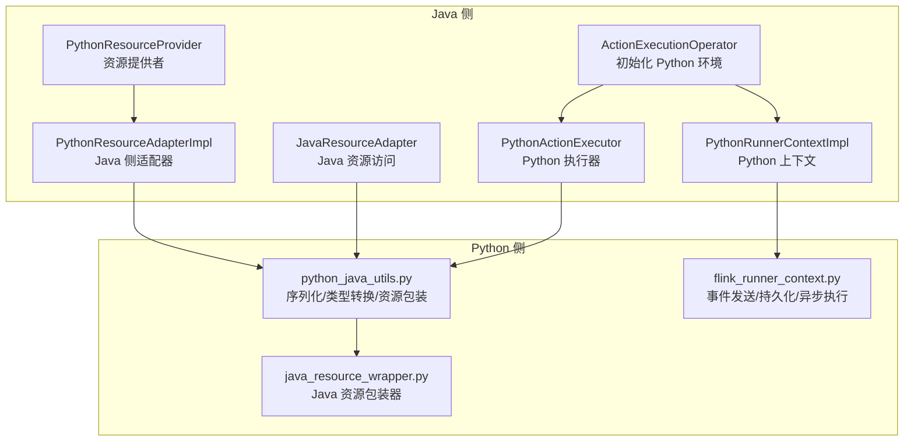
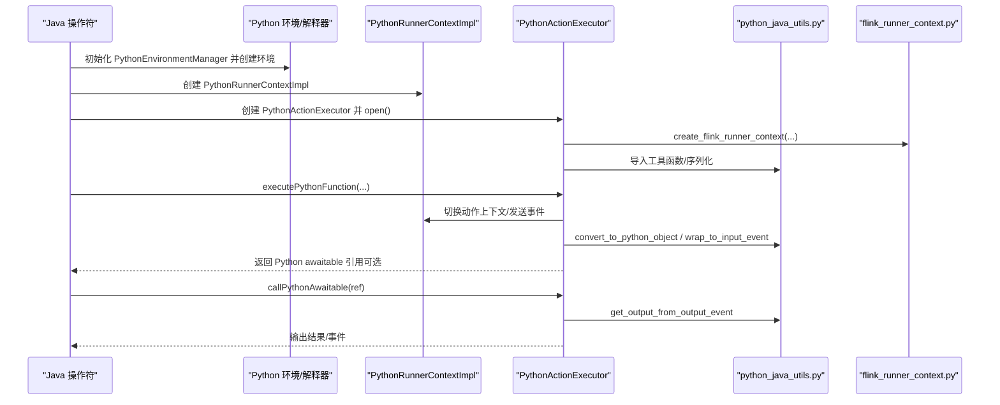
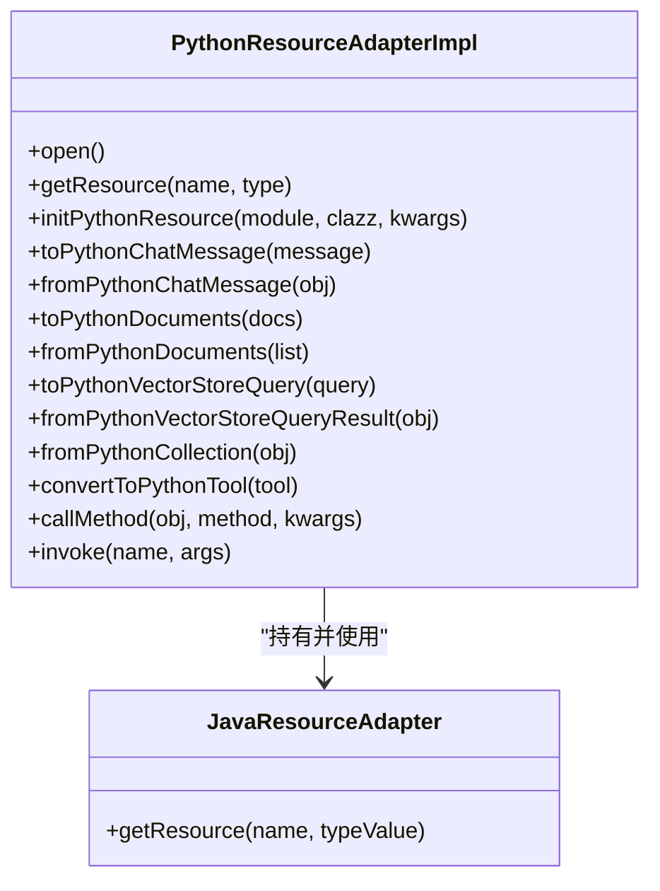
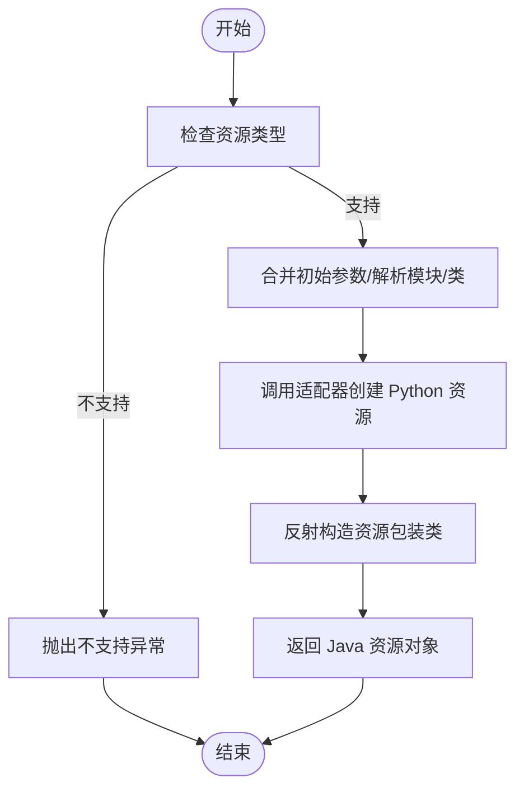
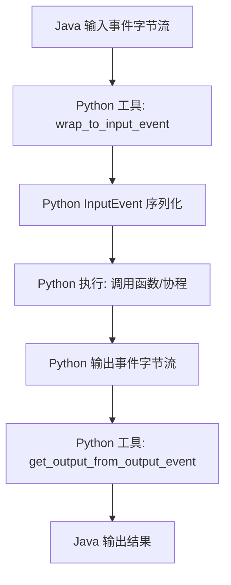
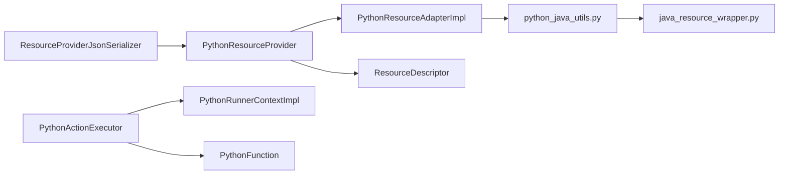

# 跨语言执行架构

<cite>
**本文引用的文件**
- [PythonResourceAdapterImpl.java](file://runtime/src/main/java/org/apache/flink/agents/runtime/python/utils/PythonResourceAdapterImpl.java)
- [PythonResourceProvider.java](file://plan/src/main/java/org/apache/flink/agents/plan/resourceprovider/PythonResourceProvider.java)
- [PythonRunnerContextImpl.java](file://runtime/src/main/java/org/apache/flink/agents/runtime/python/context/PythonRunnerContextImpl.java)
- [PythonActionExecutor.java](file://runtime/src/main/java/org/apache/flink/agents/runtime/python/utils/PythonActionExecutor.java)
- [JavaResourceAdapter.java](file://runtime/src/main/java/org/apache/flink/agents/runtime/python/utils/JavaResourceAdapter.java)
- [python_java_utils.py](file://python/flink_agents/runtime/python_java_utils.py)
- [java_resource_wrapper.py](file://python/flink_agents/runtime/java/java_resource_wrapper.py)
- [flink_runner_context.py](file://python/flink_agents/runtime/flink_runner_context.py)
- [ActionExecutionOperator.java](file://runtime/src/main/java/org/apache/flink/agents/runtime/operator/ActionExecutionOperator.java)
- [PythonFunction.java](file://plan/src/main/java/org/apache/flink/agents/plan/PythonFunction.java)
- [PythonMCPServer.java](file://plan/src/main/java/org/apache/flink/agents/plan/resource/python/PythonMCPServer.java)
- [ResourceProviderJsonSerializer.java](file://plan/src/main/java/org/apache/flink/agents/plan/serializer/ResourceProviderJsonSerializer.java)
- [PythonResourceAdapterImplTest.java](file://runtime/src/test/java/org/apache/flink/agents/runtime/python/utils/PythonResourceAdapterImplTest.java)
</cite>

## 目录
1. [引言](#引言)
2. [项目结构](#项目结构)
3. [核心组件](#核心组件)
4. [架构总览](#架构总览)
5. [组件详解](#组件详解)
6. [依赖关系分析](#依赖关系分析)
7. [性能考量](#性能考量)
8. [故障排查指南](#故障排查指南)
9. [结论](#结论)
10. [附录：跨语言调用示例路径](#附录跨语言调用示例路径)

## 引言
本技术文档聚焦 Apache Flink Agents 的跨语言执行架构，系统阐述 Java 与 Python 之间的互操作机制。重点覆盖以下方面：
- Python 环境管理与资源协调：PythonEnvironmentManager 的初始化与生命周期
- 适配器模式实现：PythonResourceAdapterImpl 如何在 Java 侧桥接 Python 资源与函数
- 资源提供机制：PythonResourceProvider 的资源实例化与生命周期管理
- 跨语言通信协议：数据序列化（cloudpickle）、事件封装、类型映射与错误处理
- 运行时上下文：PythonRunnerContextImpl 的执行环境隔离与事件收发
- 性能优化：连接池与线程池、缓存与对象复用、并发控制策略
- 实战示例：在 Java 中调用 Python 函数、在 Python 中使用 Java 资源的参考路径

## 项目结构
该仓库采用多模块组织，跨语言执行相关的关键模块如下：
- runtime：Java 运行时与 Python 执行器、适配器、上下文、操作符等
- plan：资源提供者、函数定义、序列化器等
- python：Python 侧运行时工具、资源包装器、事件上下文等
- e2e-test：端到端测试，验证跨语言资源与执行

图表来源
- [ActionExecutionOperator.java](file://runtime/src/main/java/org/apache/flink/agents/runtime/operator/ActionExecutionOperator.java#L612-L651)
- [PythonResourceProvider.java](file://plan/src/main/java/org/apache/flink/agents/plan/resourceprovider/PythonResourceProvider.java#L76-L126)
- [PythonResourceAdapterImpl.java](file://runtime/src/main/java/org/apache/flink/agents/runtime/python/utils/PythonResourceAdapterImpl.java#L41-L203)
- [JavaResourceAdapter.java](file://runtime/src/main/java/org/apache/flink/agents/runtime/python/utils/JavaResourceAdapter.java#L34-L56)
- [PythonRunnerContextImpl.java](file://runtime/src/main/java/org/apache/flink/agents/runtime/python/context/PythonRunnerContextImpl.java#L33-L68)
- [PythonActionExecutor.java](file://runtime/src/main/java/org/apache/flink/agents/runtime/python/utils/PythonActionExecutor.java#L36-L210)
- [python_java_utils.py](file://python/flink_agents/runtime/python_java_utils.py#L48-L284)
- [java_resource_wrapper.py](file://python/flink_agents/runtime/java/java_resource_wrapper.py#L29-L79)
- [flink_runner_context.py](file://python/flink_agents/runtime/flink_runner_context.py#L181-L236)

章节来源
- [ActionExecutionOperator.java](file://runtime/src/main/java/org/apache/flink/agents/runtime/operator/ActionExecutionOperator.java#L612-L651)
- [PythonResourceProvider.java](file://plan/src/main/java/org/apache/flink/agents/plan/resourceprovider/PythonResourceProvider.java#L47-L126)
- [PythonResourceAdapterImpl.java](file://runtime/src/main/java/org/apache/flink/agents/runtime/python/utils/PythonResourceAdapterImpl.java#L41-L203)
- [PythonActionExecutor.java](file://runtime/src/main/java/org/apache/flink/agents/runtime/python/utils/PythonActionExecutor.java#L36-L210)
- [python_java_utils.py](file://python/flink_agents/runtime/python_java_utils.py#L48-L284)

## 核心组件
- PythonResourceAdapterImpl：Java 侧适配器，负责将 Java 资源与对象转换为 Python 可用形式，或调用 Python 方法；同时提供从 Python 回传对象到 Java 的映射能力。
- PythonResourceProvider：计划层资源提供者，根据描述符动态加载 Python 模块类并构造资源实例，支持多种资源类型（聊天模型、嵌入模型、向量库、MCP 服务器）。
- PythonRunnerContextImpl：Python 侧运行时上下文，承载事件发送、等待 Python 协程完成、保存 awaitable 引用等职责。
- PythonActionExecutor：在 Java 侧驱动 Python 执行，负责导入 Python 模块、创建 PythonRunnerContext、执行 Python 函数、处理协程/生成器、事件封装与输出提取。
- JavaResourceAdapter：Java 侧资源访问适配器，供 Python 通过 pemja 调用以获取 Java 资源。
- python_java_utils.py：Python 侧工具集，负责 cloudpickle 序列化、事件封装/解封、Java/Python 类型映射、资源动态创建与方法调用。
- java_resource_wrapper.py：Python 侧 Java 资源包装器，将 Java Prompt、Tool、资源适配器等包装为 Python 可用对象。
- flink_runner_context.py：Python 侧 RunnerContext 实现，负责事件发送、日志字符串构建、异步执行结果持久化与缓存。

章节来源
- [PythonResourceAdapterImpl.java](file://runtime/src/main/java/org/apache/flink/agents/runtime/python/utils/PythonResourceAdapterImpl.java#L41-L203)
- [PythonResourceProvider.java](file://plan/src/main/java/org/apache/flink/agents/plan/resourceprovider/PythonResourceProvider.java#L47-L126)
- [PythonRunnerContextImpl.java](file://runtime/src/main/java/org/apache/flink/agents/runtime/python/context/PythonRunnerContextImpl.java#L33-L68)
- [PythonActionExecutor.java](file://runtime/src/main/java/org/apache/flink/agents/runtime/python/utils/PythonActionExecutor.java#L36-L210)
- [JavaResourceAdapter.java](file://runtime/src/main/java/org/apache/flink/agents/runtime/python/utils/JavaResourceAdapter.java#L34-L56)
- [python_java_utils.py](file://python/flink_agents/runtime/python_java_utils.py#L48-L284)
- [java_resource_wrapper.py](file://python/flink_agents/runtime/java/java_resource_wrapper.py#L29-L79)
- [flink_runner_context.py](file://python/flink_agents/runtime/flink_runner_context.py#L181-L236)

## 架构总览
Java 与 Python 的交互通过“计划层资源描述 + 运行时适配器 + 解释器桥接”实现。当检测到存在 Python 动作或资源时，Java 操作符初始化 Python 环境，创建 PythonRunnerContext 与 PythonActionExecutor，并在执行过程中进行事件与对象的双向序列化与类型映射。

图表来源
- [ActionExecutionOperator.java](file://runtime/src/main/java/org/apache/flink/agents/runtime/operator/ActionExecutionOperator.java#L612-L651)
- [PythonActionExecutor.java](file://runtime/src/main/java/org/apache/flink/agents/runtime/python/utils/PythonActionExecutor.java#L93-L149)
- [PythonRunnerContextImpl.java](file://runtime/src/main/java/org/apache/flink/agents/runtime/python/context/PythonRunnerContextImpl.java#L49-L67)
- [python_java_utils.py](file://python/flink_agents/runtime/python_java_utils.py#L48-L76)
- [flink_runner_context.py](file://python/flink_agents/runtime/flink_runner_context.py#L200-L236)

## 组件详解

### Python 环境管理与初始化
- Java 操作符在发现 Python 动作或资源后，创建 PythonEnvironmentManager，注入分布式缓存、临时目录、环境变量与作业标识，随后打开环境并创建 Python 解释器。
- 同时创建 PythonRunnerContextImpl，用于在 Python 执行期间收发事件与跟踪 awaitable。

章节来源
- [ActionExecutionOperator.java](file://runtime/src/main/java/org/apache/flink/agents/runtime/operator/ActionExecutionOperator.java#L612-L651)
- [PythonRunnerContextImpl.java](file://runtime/src/main/java/org/apache/flink/agents/runtime/python/context/PythonRunnerContextImpl.java#L33-L68)

### 适配器模式：PythonResourceAdapterImpl
- 作用：在 Java 侧统一管理 Python 资源与对象转换，提供以下能力：
  - 将 Java 资源转换为 Python 可用对象（工具、提示词、消息、文档、查询、集合等）
  - 在 Python 侧动态创建资源实例
  - 调用 Python 对象的方法并返回结果
  - 提供 getResource 包装，供 Python 通过 pemja 调用 Java 资源
- 关键点：
  - 通过 Python 解释器执行工具模块导入与函数调用
  - 使用 cloudpickle 进行复杂对象的序列化/反序列化
  - 针对不同资源类型（ChatMessage、Document、VectorStoreQuery 等）提供双向映射

图表来源
- [PythonResourceAdapterImpl.java](file://runtime/src/main/java/org/apache/flink/agents/runtime/python/utils/PythonResourceAdapterImpl.java#L41-L203)
- [JavaResourceAdapter.java](file://runtime/src/main/java/org/apache/flink/agents/runtime/python/utils/JavaResourceAdapter.java#L34-L56)

章节来源
- [PythonResourceAdapterImpl.java](file://runtime/src/main/java/org/apache/flink/agents/runtime/python/utils/PythonResourceAdapterImpl.java#L41-L203)
- [JavaResourceAdapter.java](file://runtime/src/main/java/org/apache/flink/agents/runtime/python/utils/JavaResourceAdapter.java#L34-L56)

### 资源提供机制：PythonResourceProvider
- 作用：根据资源描述符（模块、类名、初始参数）在运行时动态创建 Python 资源实例，并将其包装为 Java 资源对象。
- 支持类型：聊天模型、嵌入模型、向量存储、MCP 服务器等。
- 生命周期：由计划层描述，运行时通过适配器创建 Python 对象，再由资源包装类暴露给 Java 业务逻辑。

图表来源
- [PythonResourceProvider.java](file://plan/src/main/java/org/apache/flink/agents/plan/resourceprovider/PythonResourceProvider.java#L76-L126)

章节来源
- [PythonResourceProvider.java](file://plan/src/main/java/org/apache/flink/agents/plan/resourceprovider/PythonResourceProvider.java#L47-L126)

### 运行时上下文：PythonRunnerContextImpl
- 作用：在 Python 执行期间隔离运行时上下文，接收来自 Python 的事件并转发至 Java RunnerContext；保存 Python 协程引用以便后续恢复。
- 特性：仅接受 PythonEvent；提供 awaitable 引用的设置与读取。

章节来源
- [PythonRunnerContextImpl.java](file://runtime/src/main/java/org/apache/flink/agents/runtime/python/context/PythonRunnerContextImpl.java#L33-L68)

### 跨语言通信协议与数据传输
- 序列化格式：cloudpickle 用于复杂对象的序列化与反序列化，确保 Java 与 Python 间的数据一致性。
- 事件封装：将输入事件封装为 Python InputEvent，输出事件提取为 Python OutputEvent 的输出数据。
- 类型映射：大量工具函数负责 Java/Python 对象间的双向转换（消息、文档、查询、集合、角色等）。
- 错误处理：在 Python 侧捕获异常并记录，必要时抛出运行时错误；在 Java 侧通过适配器与执行器进行异常传播与清理。

图表来源
- [python_java_utils.py](file://python/flink_agents/runtime/python_java_utils.py#L63-L76)
- [PythonActionExecutor.java](file://runtime/src/main/java/org/apache/flink/agents/runtime/python/utils/PythonActionExecutor.java#L151-L164)

章节来源
- [python_java_utils.py](file://python/flink_agents/runtime/python_java_utils.py#L48-L76)
- [PythonActionExecutor.java](file://runtime/src/main/java/org/apache/flink/agents/runtime/python/utils/PythonActionExecutor.java#L151-L164)

### PythonRunnerContext 在 Python 侧的实现要点
- 事件发送：将事件序列化为字节与 JSON 字符串，调用 Java 侧上下文进行处理。
- 日志构建：事件类型与负载信息拼接为 JSON 字符串，便于审计与追踪。
- 异常与持久化：通过内部封装的执行结果与异常包装，结合线程池实现异步执行与结果记录。

章节来源
- [flink_runner_context.py](file://python/flink_agents/runtime/flink_runner_context.py#L200-L236)

### 在 Java 中调用 Python 函数
- 步骤概览：
  - 初始化 Python 环境与执行器
  - 设置 PythonRunnerContext
  - 将 Java 事件转换为 Python 对象
  - 调用 Python 函数（可能返回协程）
  - 处理协程/生成器并提取输出
- 参考路径：
  - [ActionExecutionOperator.java](file://runtime/src/main/java/org/apache/flink/agents/runtime/operator/ActionExecutionOperator.java#L612-L651)
  - [PythonActionExecutor.java](file://runtime/src/main/java/org/apache/flink/agents/runtime/python/utils/PythonActionExecutor.java#L93-L149)
  - [PythonFunction.java](file://plan/src/main/java/org/apache/flink/agents/plan/PythonFunction.java#L38-L49)

章节来源
- [ActionExecutionOperator.java](file://runtime/src/main/java/org/apache/flink/agents/runtime/operator/ActionExecutionOperator.java#L612-L651)
- [PythonActionExecutor.java](file://runtime/src/main/java/org/apache/flink/agents/runtime/python/utils/PythonActionExecutor.java#L93-L149)
- [PythonFunction.java](file://plan/src/main/java/org/apache/flink/agents/plan/PythonFunction.java#L38-L49)

### 在 Python 中使用 Java 资源
- 步骤概览：
  - Java 通过适配器提供 getResource 接口
  - Python 通过 pemja 调用 Java 资源适配器
  - Python 将 Java 资源包装为本地可用对象（提示词、工具等）
- 参考路径：
  - [JavaResourceAdapter.java](file://runtime/src/main/java/org/apache/flink/agents/runtime/python/utils/JavaResourceAdapter.java#L34-L56)
  - [python_java_utils.py](file://python/flink_agents/runtime/python_java_utils.py#L93-L102)
  - [java_resource_wrapper.py](file://python/flink_agents/runtime/java/java_resource_wrapper.py#L69-L79)

章节来源
- [JavaResourceAdapter.java](file://runtime/src/main/java/org/apache/flink/agents/runtime/python/utils/JavaResourceAdapter.java#L34-L56)
- [python_java_utils.py](file://python/flink_agents/runtime/python_java_utils.py#L93-L102)
- [java_resource_wrapper.py](file://python/flink_agents/runtime/java/java_resource_wrapper.py#L69-L79)

## 依赖关系分析
- 计划层与运行时层：
  - PythonResourceProvider 依赖 PythonResourceAdapter 与 ResourceDescriptor，在运行时创建资源包装类实例。
  - PythonActionExecutor 依赖 PythonRunnerContextImpl、PythonFunction 与 Python 工具模块。
- Python 侧工具：
  - python_java_utils.py 作为桥接层，提供序列化、类型映射与资源动态创建。
  - java_resource_wrapper.py 为 Java 资源提供 Python 包装器，便于在 Python 中直接使用。
- 序列化与序列化器：
  - ResourceProviderJsonSerializer 负责将资源提供者序列化为 JSON，便于跨语言配置传递。

图表来源
- [PythonResourceProvider.java](file://plan/src/main/java/org/apache/flink/agents/plan/resourceprovider/PythonResourceProvider.java#L76-L126)
- [PythonActionExecutor.java](file://runtime/src/main/java/org/apache/flink/agents/runtime/python/utils/PythonActionExecutor.java#L79-L111)
- [ResourceProviderJsonSerializer.java](file://plan/src/main/java/org/apache/flink/agents/plan/serializer/ResourceProviderJsonSerializer.java#L49-L73)

章节来源
- [PythonResourceProvider.java](file://plan/src/main/java/org/apache/flink/agents/plan/resourceprovider/PythonResourceProvider.java#L76-L126)
- [PythonActionExecutor.java](file://runtime/src/main/java/org/apache/flink/agents/runtime/python/utils/PythonActionExecutor.java#L79-L111)
- [ResourceProviderJsonSerializer.java](file://plan/src/main/java/org/apache/flink/agents/plan/serializer/ResourceProviderJsonSerializer.java#L49-L73)

## 性能考量
- 连接/线程池管理
  - PythonActionExecutor 在 open() 时创建 Python 线程池，用于异步执行与协程调度，避免阻塞主执行路径。
  - 建议根据任务并发度与资源占用调整线程数，减少上下文切换开销。
- 缓存与对象复用
  - PythonResourceAdapterImpl 对常用转换函数进行预注册与缓存，降低重复导入与查找成本。
  - 对于频繁使用的 Java 资源，建议在 Python 侧进行短生命周期缓存，减少跨语言调用次数。
- 并发控制
  - PythonRunnerContextImpl 通过 awaitable 引用跟踪协程状态，避免竞态条件。
  - 在 Java 侧，ActionExecutionOperator 通过邮箱线程检查与异步执行器协同，保障执行有序性。
- 序列化优化
  - cloudpickle 适用于复杂对象，但体积与 CPU 开销较高；对于简单数据，可考虑 JSON 或二进制协议以提升吞吐。
- 资源生命周期
  - PythonMCPServer 等资源包装类需显式关闭底层资源，防止泄漏；适配器层提供 close 钩子以触发释放。

章节来源
- [PythonActionExecutor.java](file://runtime/src/main/java/org/apache/flink/agents/runtime/python/utils/PythonActionExecutor.java#L93-L111)
- [PythonRunnerContextImpl.java](file://runtime/src/main/java/org/apache/flink/agents/runtime/python/context/PythonRunnerContextImpl.java#L33-L68)
- [PythonMCPServer.java](file://plan/src/main/java/org/apache/flink/agents/plan/resource/python/PythonMCPServer.java#L32-L53)

## 故障排查指南
- Python 动作执行失败
  - 检查 PythonActionExecutor 的异常包装与传播路径，定位具体失败步骤（导入、调用、协程恢复）。
  - 参考：[PythonActionExecutor.java](file://runtime/src/main/java/org/apache/flink/agents/runtime/python/utils/PythonActionExecutor.java#L145-L148)
- 资源类型不支持
  - PythonResourceProvider 在类型映射缺失时抛出异常，确认资源类型是否在支持列表中。
  - 参考：[PythonResourceProvider.java](file://plan/src/main/java/org/apache/flink/agents/plan/resourceprovider/PythonResourceProvider.java#L82-L84)
- Java 资源获取异常
  - JavaResourceAdapter 的 getResource 调用应确保类型值合法且资源存在；Python 侧通过 JavaGetResourceWrapper 转发。
  - 参考：[JavaResourceAdapter.java](file://runtime/src/main/java/org/apache/flink/agents/runtime/python/utils/JavaResourceAdapter.java#L54-L56)，[python_java_utils.py](file://python/flink_agents/runtime/python_java_utils.py#L93-L102)
- 事件序列化问题
  - 若事件 JSON 构建失败，回退为字符串表示；检查事件模型与字段完整性。
  - 参考：[flink_runner_context.py](file://python/flink_agents/runtime/flink_runner_context.py#L229-L236)
- 单元测试参考
  - 通过测试用例验证适配器行为（初始化、方法调用、函数调用），快速定位问题边界。
  - 参考：[PythonResourceAdapterImplTest.java](file://runtime/src/test/java/org/apache/flink/agents/runtime/python/utils/PythonResourceAdapterImplTest.java#L62-L194)

章节来源
- [PythonActionExecutor.java](file://runtime/src/main/java/org/apache/flink/agents/runtime/python/utils/PythonActionExecutor.java#L145-L148)
- [PythonResourceProvider.java](file://plan/src/main/java/org/apache/flink/agents/plan/resourceprovider/PythonResourceProvider.java#L82-L84)
- [JavaResourceAdapter.java](file://runtime/src/main/java/org/apache/flink/agents/runtime/python/utils/JavaResourceAdapter.java#L54-L56)
- [python_java_utils.py](file://python/flink_agents/runtime/python_java_utils.py#L93-L102)
- [flink_runner_context.py](file://python/flink_agents/runtime/flink_runner_context.py#L229-L236)
- [PythonResourceAdapterImplTest.java](file://runtime/src/test/java/org/apache/flink/agents/runtime/python/utils/PythonResourceAdapterImplTest.java#L62-L194)

## 结论
本架构通过“计划层描述 + 运行时适配器 + 解释器桥接”的方式，实现了 Java 与 Python 的深度互操作。PythonResourceAdapterImpl 作为核心适配器，承担了类型映射、序列化与资源转换的职责；PythonResourceProvider 则在运行时将描述符转化为实际资源实例；PythonRunnerContextImpl 与 PythonActionExecutor 共同保证了执行环境隔离与事件流转的可靠性。配合 cloudpickle 序列化与线程池并发控制，整体具备良好的扩展性与稳定性。

## 附录：跨语言调用示例路径
- 在 Java 中调用 Python 函数
  - [ActionExecutionOperator.java](file://runtime/src/main/java/org/apache/flink/agents/runtime/operator/ActionExecutionOperator.java#L612-L651)
  - [PythonActionExecutor.java](file://runtime/src/main/java/org/apache/flink/agents/runtime/python/utils/PythonActionExecutor.java#L123-L149)
  - [PythonFunction.java](file://plan/src/main/java/org/apache/flink/agents/plan/PythonFunction.java#L38-L49)
- 在 Python 中使用 Java 资源
  - [JavaResourceAdapter.java](file://runtime/src/main/java/org/apache/flink/agents/runtime/python/utils/JavaResourceAdapter.java#L34-L56)
  - [python_java_utils.py](file://python/flink_agents/runtime/python_java_utils.py#L93-L102)
  - [java_resource_wrapper.py](file://python/flink_agents/runtime/java/java_resource_wrapper.py#L69-L79)