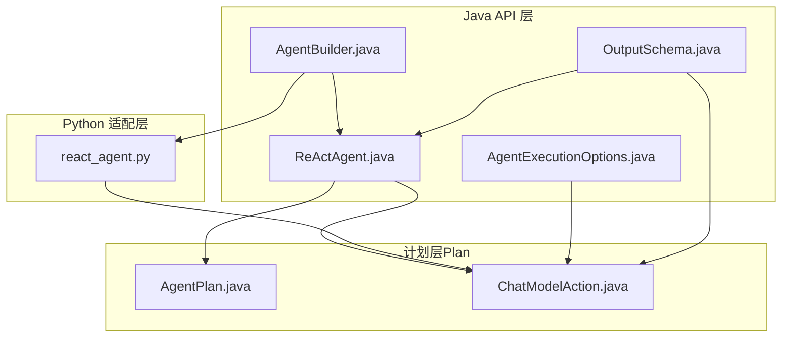
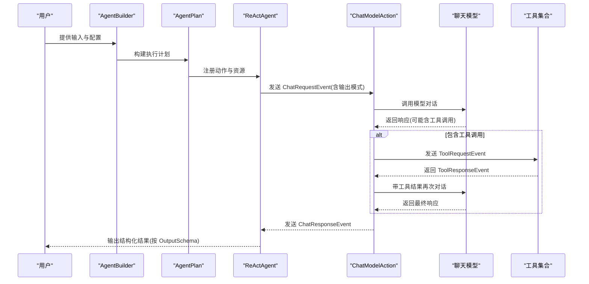
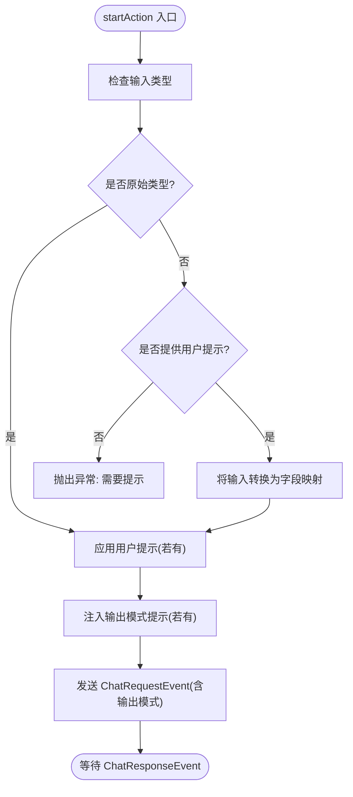
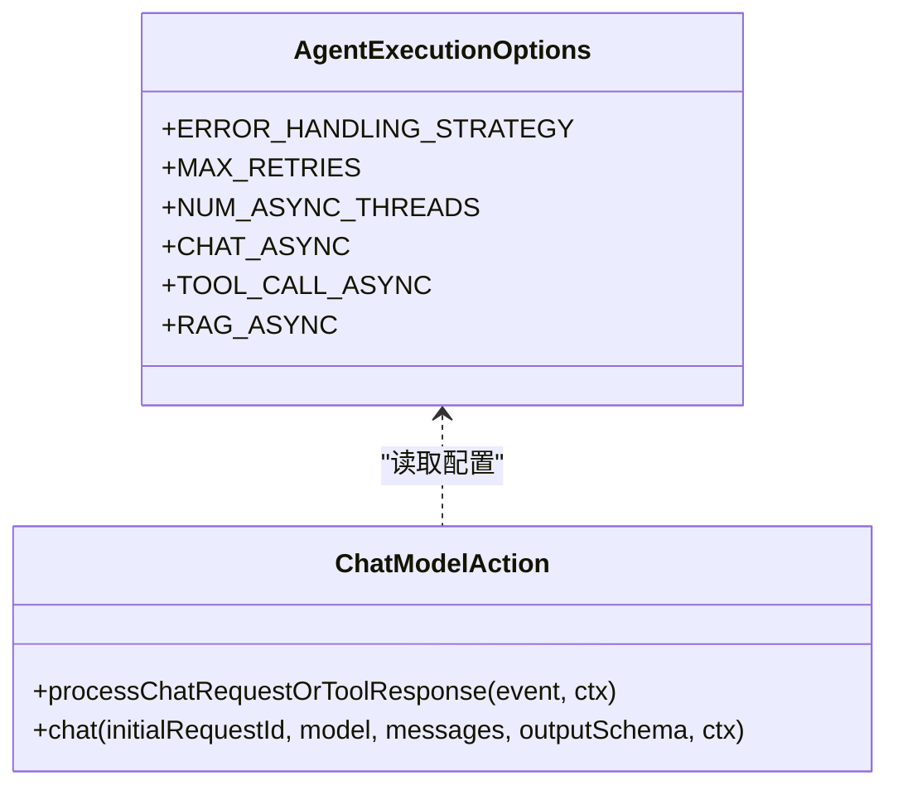
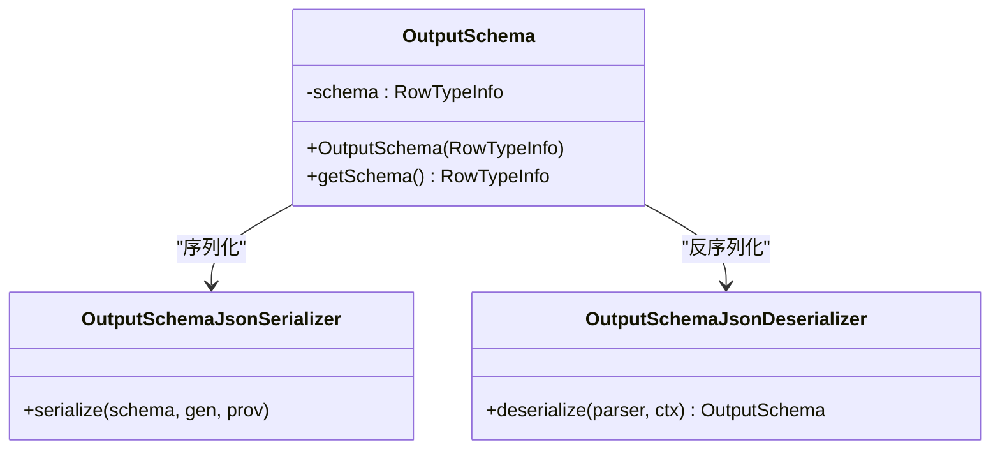
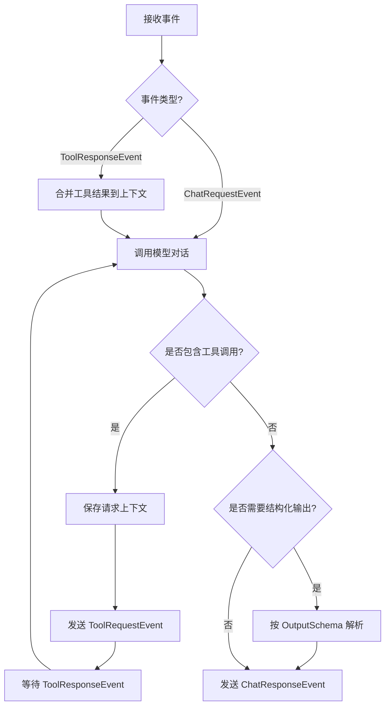
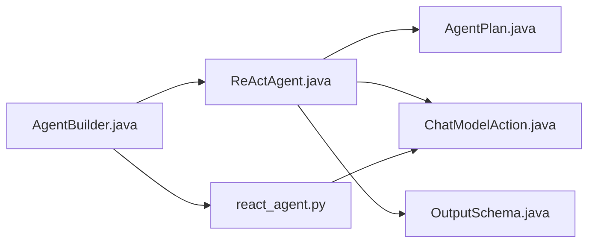

# ReAct 代理实现

<cite>
**本文引用的文件列表**
- [ReActAgent.java](file://api/src/main/java/org/apache/flink/agents/api/agents/ReActAgent.java)
- [AgentExecutionOptions.java](file://api/src/main/java/org/apache/flink/agents/api/agents/AgentExecutionOptions.java)
- [OutputSchema.java](file://api/src/main/java/org/apache/flink/agents/api/agents/OutputSchema.java)
- [AgentBuilder.java](file://api/src/main/java/org/apache/flink/agents/api/AgentBuilder.java)
- [react_agent.py](file://python/flink_agents/api/agents/react_agent.py)
- [ChatModelAction.java](file://plan/src/main/java/org/apache/flink/agents/plan/actions/ChatModelAction.java)
- [AgentPlan.java](file://plan/src/main/java/org/apache/flink/agents/plan/AgentPlan.java)
- [ReActAgentTest.java](file://api/src/test/java/org/apache/flink/agents/api/agents/ReActAgentTest.java)
- [ReActAgentTest.java](file://e2e-test/flink-agents-end-to-end-tests-integration/src/test/java/org/apache/flink/agents/integration/test/ReActAgentTest.java)
</cite>

## 目录
1. [简介](#简介)
2. [项目结构](#项目结构)
3. [核心组件](#核心组件)
4. [架构总览](#架构总览)
5. [详细组件分析](#详细组件分析)
6. [依赖关系分析](#依赖关系分析)
7. [性能考量](#性能考量)
8. [故障排查指南](#故障排查指南)
9. [结论](#结论)
10. [附录：完整使用示例与最佳实践](#附录完整使用示例与最佳实践)

## 简介
本文件系统性阐述 ReAct（推理-行动-观察）代理在该代码库中的实现与使用方式，重点覆盖：
- ReAct 核心原理与“思维-行动-观察”循环的实现机制
- AgentExecutionOptions 的配置项及其对执行行为的影响
- OutputSchema 输出模式定义与不同输出格式的选择
- 如何创建、配置与使用 ReActAgent 的完整流程
- 内置 ReActAgent 与自定义代理的差异与选型建议
- 性能调优建议与常见问题的解决方案

## 项目结构
ReActAgent 的实现横跨 Java API 层、计划层（Plan）、运行时层以及 Python 适配层，形成“声明式计划 + 运行时调度”的整体架构。

图表来源
- [ReActAgent.java](file://api/src/main/java/org/apache/flink/agents/api/agents/ReActAgent.java#L50-L101)
- [AgentExecutionOptions.java](file://api/src/main/java/org/apache/flink/agents/api/agents/AgentExecutionOptions.java#L23-L47)
- [OutputSchema.java](file://api/src/main/java/org/apache/flink/agents/api/agents/OutputSchema.java#L50-L65)
- [AgentBuilder.java](file://api/src/main/java/org/apache/flink/agents/api/AgentBuilder.java#L35-L76)
- [AgentPlan.java](file://plan/src/main/java/org/apache/flink/agents/plan/AgentPlan.java#L132-L141)
- [ChatModelAction.java](file://plan/src/main/java/org/apache/flink/agents/plan/actions/ChatModelAction.java#L51-L71)
- [react_agent.py](file://python/flink_agents/api/agents/react_agent.py#L42-L142)

章节来源
- [ReActAgent.java](file://api/src/main/java/org/apache/flink/agents/api/agents/ReActAgent.java#L50-L101)
- [AgentPlan.java](file://plan/src/main/java/org/apache/flink/agents/plan/AgentPlan.java#L132-L141)

## 核心组件
- ReActAgent：内置的 ReAct 代理实现，负责将输入转换为 ChatMessage，发送 Chat 请求，并在收到响应后按 OutputSchema 解析结构化输出。
- AgentExecutionOptions：全局执行配置，控制错误处理策略、最大重试次数、异步线程数及各类异步开关。
- OutputSchema：用于序列化/反序列化 RowTypeInfo 的辅助类，支持将 Flink Row 类型信息转换为 JSON Schema 字符串，或从 JSON 恢复 RowTypeInfo。
- AgentBuilder：统一的构建器接口，支持将代理执行结果转为 List、DataStream 或 Table。
- ChatModelAction：内置动作，负责处理 ChatRequestEvent/ToolResponseEvent，实现“思维-行动-观察”循环的聊天与工具调用链路。
- AgentPlan：从用户代理实例中提取动作与资源，生成可序列化的执行计划。

章节来源
- [ReActAgent.java](file://api/src/main/java/org/apache/flink/agents/api/agents/ReActAgent.java#L50-L101)
- [AgentExecutionOptions.java](file://api/src/main/java/org/apache/flink/agents/api/agents/AgentExecutionOptions.java#L23-L47)
- [OutputSchema.java](file://api/src/main/java/org/apache/flink/agents/api/agents/OutputSchema.java#L50-L65)
- [AgentBuilder.java](file://api/src/main/java/org/apache/flink/agents/api/AgentBuilder.java#L35-L76)
- [ChatModelAction.java](file://plan/src/main/java/org/apache/flink/agents/plan/actions/ChatModelAction.java#L51-L71)
- [AgentPlan.java](file://plan/src/main/java/org/apache/flink/agents/plan/AgentPlan.java#L132-L141)

## 架构总览
ReActAgent 的执行流程遵循“思维-行动-观察”循环：
- 思维：将用户输入与提示词格式化为 ChatMessage 列表，必要时加入系统级输出模式提示。
- 行动：通过 ChatModelAction 发送 ChatRequestEvent，触发模型对话；若模型返回工具调用，则发送 ToolRequestEvent。
- 观察：接收 ToolResponseEvent 后，将工具结果拼接到消息上下文中，再次调用模型；最终生成 ChatResponseEvent。
- 结果：根据 OutputSchema 将模型输出解析为结构化对象（Row 或 POJO），并通过 OutputEvent 输出。

图表来源
- [ReActAgent.java](file://api/src/main/java/org/apache/flink/agents/api/agents/ReActAgent.java#L103-L167)
- [ChatModelAction.java](file://plan/src/main/java/org/apache/flink/agents/plan/actions/ChatModelAction.java#L279-L327)

## 详细组件分析

### ReActAgent 实现机制
- 资源注册：默认注册一个聊天模型资源与可选的用户提示与输出模式提示。
- 输入到消息：根据输入类型（原始值、Row、POJO）与用户提示，格式化为 ChatMessage；若输入非原始类型且未提供提示，会抛出异常。
- 输出模式注入：当提供 OutputSchema（RowTypeInfo 或 POJO 类）时，自动添加系统提示，要求模型输出符合指定模式。
- 动作绑定：注册一个名为 startAction 的动作，监听 InputEvent；另一个名为 stopAction 的静态动作监听 ChatResponseEvent 并输出结果。

图表来源
- [ReActAgent.java](file://api/src/main/java/org/apache/flink/agents/api/agents/ReActAgent.java#L103-L167)

章节来源
- [ReActAgent.java](file://api/src/main/java/org/apache/flink/agents/api/agents/ReActAgent.java#L59-L101)
- [ReActAgent.java](file://api/src/main/java/org/apache/flink/agents/api/agents/ReActAgent.java#L103-L167)

### AgentExecutionOptions 执行配置
- 错误处理策略：FAIL/RETRY/IGNORE，默认 FAIL。RETRY 模式下配合最大重试次数生效。
- 最大重试次数：默认 3，仅在 RETRY 策略下生效。
- 异步线程数：默认为 CPU 核心数的两倍，用于异步执行。
- 异步开关：chat.async/tool-call.async/rag.async 默认开启，分别控制聊天、工具调用与检索的异步执行。

图表来源
- [AgentExecutionOptions.java](file://api/src/main/java/org/apache/flink/agents/api/agents/AgentExecutionOptions.java#L23-L47)
- [ChatModelAction.java](file://plan/src/main/java/org/apache/flink/agents/plan/actions/ChatModelAction.java#L206-L214)

章节来源
- [AgentExecutionOptions.java](file://api/src/main/java/org/apache/flink/agents/api/agents/AgentExecutionOptions.java#L23-L47)
- [ChatModelAction.java](file://plan/src/main/java/org/apache/flink/agents/plan/actions/ChatModelAction.java#L206-L214)

### OutputSchema 输出模式定义
- 支持两种输出模式：
  - RowTypeInfo：将字段名与基本类型信息序列化为 JSON，反序列化时恢复 RowTypeInfo。
  - POJO 类：通过 Jackson 生成 JSON Schema，作为系统提示的一部分，约束模型输出格式。
- 序列化/反序列化：提供自定义 Jackson 序列化器与反序列化器，确保跨语言与跨进程传输的一致性。

图表来源
- [OutputSchema.java](file://api/src/main/java/org/apache/flink/agents/api/agents/OutputSchema.java#L50-L65)
- [OutputSchema.java](file://api/src/main/java/org/apache/flink/agents/api/agents/OutputSchema.java#L67-L99)
- [OutputSchema.java](file://api/src/main/java/org/apache/flink/agents/api/agents/OutputSchema.java#L101-L133)

章节来源
- [OutputSchema.java](file://api/src/main/java/org/apache/flink/agents/api/agents/OutputSchema.java#L50-L65)
- [OutputSchema.java](file://api/src/main/java/org/apache/flink/agents/api/agents/OutputSchema.java#L67-L99)
- [OutputSchema.java](file://api/src/main/java/org/apache/flink/agents/api/agents/OutputSchema.java#L101-L133)
- [ReActAgentTest.java](file://api/src/test/java/org/apache/flink/agents/api/agents/ReActAgentTest.java#L30-L44)

### ChatModelAction “思维-行动-观察”循环
- 监听事件：ChatRequestEvent 与 ToolResponseEvent。
- 工具调用：若模型响应包含工具调用，保存上下文并发送 ToolRequestEvent；收到 ToolResponseEvent 后将工具结果拼接回消息上下文，再次调用模型。
- 结构化输出：当存在输出模式且无工具调用时，将模型输出解析为结构化对象（Row 或 POJO），并写入额外参数以便下游使用。
- 错误处理：依据 AgentExecutionOptions 的策略进行重试或忽略。

图表来源
- [ChatModelAction.java](file://plan/src/main/java/org/apache/flink/agents/plan/actions/ChatModelAction.java#L279-L327)
- [ChatModelAction.java](file://plan/src/main/java/org/apache/flink/agents/plan/actions/ChatModelAction.java#L158-L179)

章节来源
- [ChatModelAction.java](file://plan/src/main/java/org/apache/flink/agents/plan/actions/ChatModelAction.java#L51-L71)
- [ChatModelAction.java](file://plan/src/main/java/org/apache/flink/agents/plan/actions/ChatModelAction.java#L158-L179)
- [ChatModelAction.java](file://plan/src/main/java/org/apache/flink/agents/plan/actions/ChatModelAction.java#L279-L327)

### AgentPlan 与动作扫描
- 自动注册内置动作：ChatModelAction、ToolCallAction、ContextRetrievalAction。
- 扫描用户代理：提取 @Action 标注的方法与资源，构建可序列化的 AgentPlan，便于远程执行与跨语言交互。

章节来源
- [AgentPlan.java](file://plan/src/main/java/org/apache/flink/agents/plan/AgentPlan.java#L334-L360)

## 依赖关系分析
- ReActAgent 依赖：
  - AgentPlan：用于提取动作与资源，构建可执行计划。
  - ChatModelAction：内置动作，负责聊天与工具调用的循环。
  - OutputSchema：用于输出模式的序列化与反序列化。
- Python 侧 ReActAgent 与 Java 侧保持一致的语义，通过类型注解与资源描述符对接。

图表来源
- [ReActAgent.java](file://api/src/main/java/org/apache/flink/agents/api/agents/ReActAgent.java#L59-L101)
- [AgentPlan.java](file://plan/src/main/java/org/apache/flink/agents/plan/AgentPlan.java#L334-L360)
- [ChatModelAction.java](file://plan/src/main/java/org/apache/flink/agents/plan/actions/ChatModelAction.java#L51-L71)
- [OutputSchema.java](file://api/src/main/java/org/apache/flink/agents/api/agents/OutputSchema.java#L50-L65)
- [react_agent.py](file://python/flink_agents/api/agents/react_agent.py#L42-L142)
- [AgentBuilder.java](file://api/src/main/java/org/apache/flink/agents/api/AgentBuilder.java#L35-L76)

## 性能考量
- 异步执行：启用 chat.async、tool-call.async、rag.async 可显著提升吞吐，尤其在工具调用与模型往返较多的场景。
- 线程池大小：NUM_ASYNC_THREADS 默认为 CPU 核心数的两倍，可根据并发需求调整。
- 重试策略：在不稳定网络或模型服务波动时，合理设置 MAX_RETRIES 与 ERROR_HANDLING_STRATEGY 可提高稳定性。
- 输出模式解析：结构化输出解析发生在最终响应阶段，避免中间多次解析带来的开销。

章节来源
- [AgentExecutionOptions.java](file://api/src/main/java/org/apache/flink/agents/api/agents/AgentExecutionOptions.java#L33-L47)
- [ChatModelAction.java](file://plan/src/main/java/org/apache/flink/agents/plan/actions/ChatModelAction.java#L206-L214)

## 故障排查指南
- 输入类型不匹配：当输入为非原始类型且未提供用户提示，会抛出异常。请提供合适的 Prompt 将复杂输入转换为 ChatMessage。
- 输出模式不匹配：若模型输出不符合 OutputSchema，最终解析会失败。可通过增强提示或放宽模式约束解决。
- 工具调用失败：检查工具注册与权限，确认 ToolResponseEvent 中的 success 标志与错误信息。
- 超时与重试：适当增加 requestTimeout 与 MAX_RETRIES，或切换为 IGNORE 策略以降低阻塞风险。
- 测试验证：参考端到端测试用例，确保模型可用与资源正确注册。

章节来源
- [ReActAgent.java](file://api/src/main/java/org/apache/flink/agents/api/agents/ReActAgent.java#L122-L129)
- [ReActAgentTest.java](file://e2e-test/flink-agents-end-to-end-tests-integration/src/test/java/org/apache/flink/agents/integration/test/ReActAgentTest.java#L77-L153)

## 结论
ReActAgent 在该代码库中提供了简洁而强大的“思维-行动-观察”闭环：通过 Prompt 与 OutputSchema 约束模型输出，借助 ChatModelAction 实现工具调用与多轮对话，最终将结构化结果输出给上层应用。结合 AgentExecutionOptions 的灵活配置，可在稳定性与性能之间取得平衡。对于需要更强定制能力的场景，可基于 AgentPlan 与自定义动作扩展实现。

## 附录：完整使用示例与最佳实践
- 使用步骤概览
  1) 准备资源：注册聊天模型连接与工具函数。
  2) 定义提示：提供用户提示与输出示例，必要时加入输出模式约束。
  3) 创建 ReActAgent：传入资源描述符、提示与输出模式。
  4) 配置执行选项：设置错误处理策略、重试次数与异步开关。
  5) 绑定输入：将数据流或表作为输入，通过 AgentBuilder 转换为 List/DataStream/Table。
  6) 执行与验证：运行作业并校验输出结果。

- 示例参考
  - Java 端：参考端到端测试用例，包含资源注册、提示构造、RowTypeInfo 输出模式与 Table 输出。
  - Python 端：参考 Python 适配层 ReActAgent，使用 Pydantic BaseModel 作为输出模式。

- 最佳实践
  - 明确输出模式：优先使用 RowTypeInfo 或 Pydantic 模型，确保输出稳定可解析。
  - 分层提示：将任务指令、输出示例与约束分离到不同角色的消息中，提升模型一致性。
  - 异步优化：在工具调用频繁的场景启用异步执行，合理设置线程池大小。
  - 错误治理：在不稳定环境下采用 RETRY 策略并限制重试次数，避免雪崩。

章节来源
- [ReActAgentTest.java](file://e2e-test/flink-agents-end-to-end-tests-integration/src/test/java/org/apache/flink/agents/integration/test/ReActAgentTest.java#L77-L153)
- [react_agent.py](file://python/flink_agents/api/agents/react_agent.py#L53-L95)