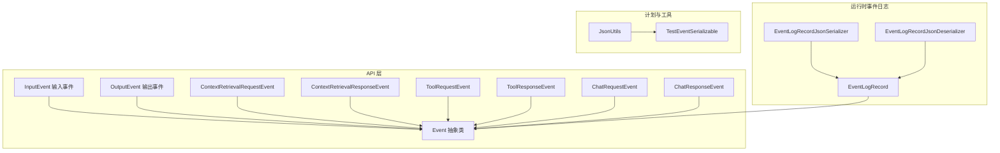
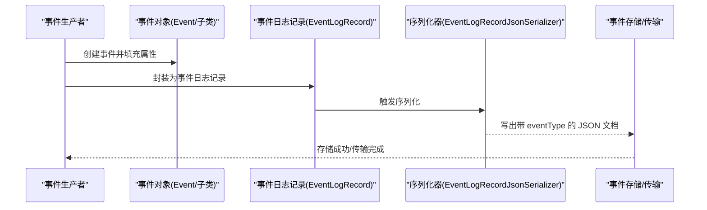
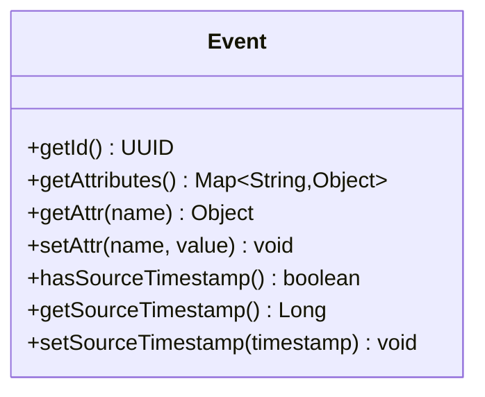
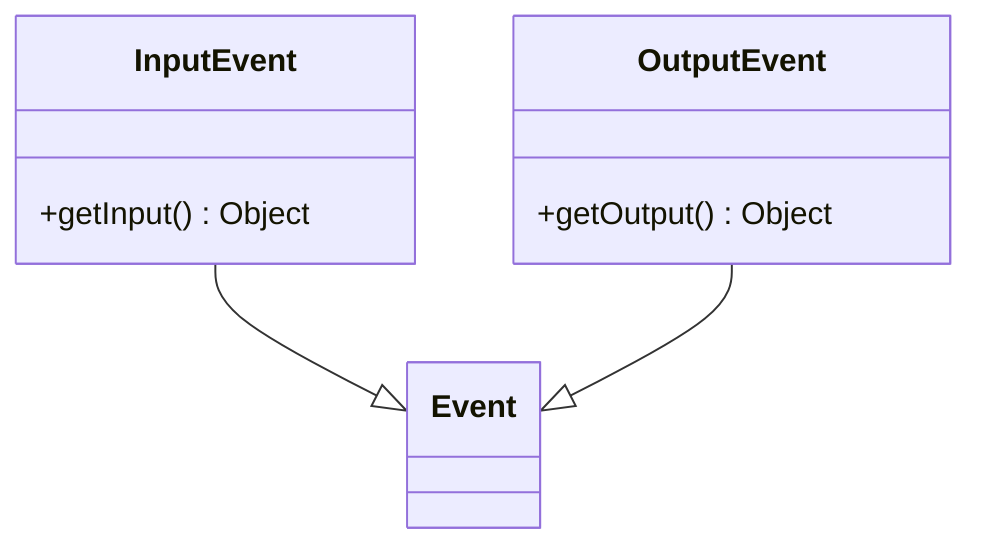
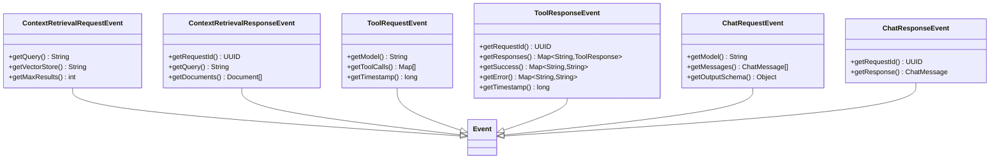
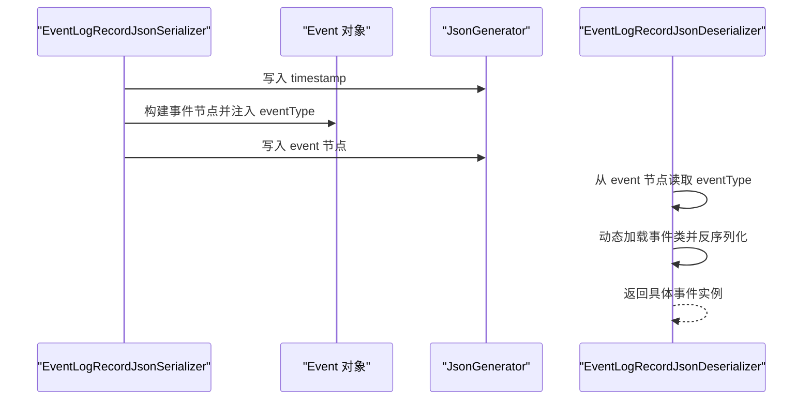
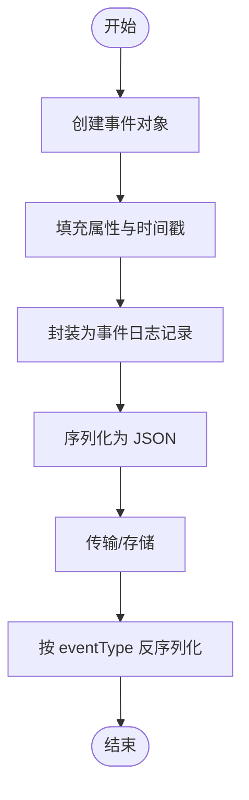
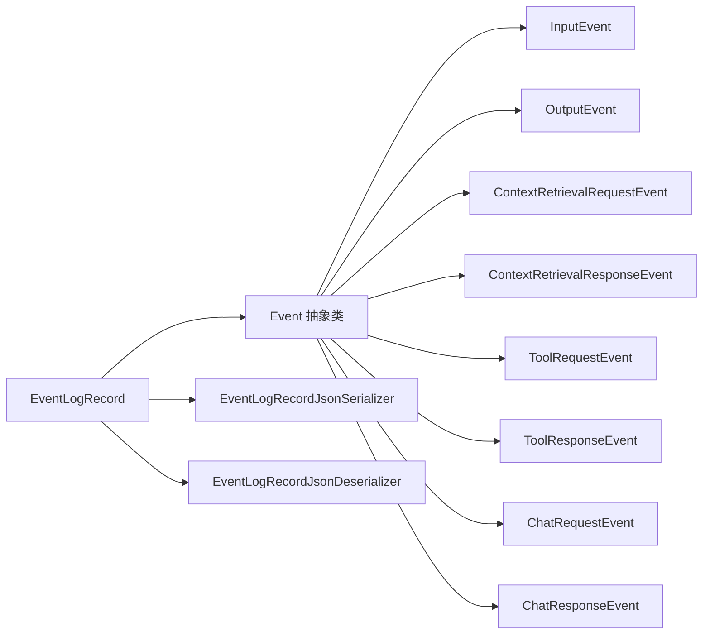

# 事件基础类型

<cite>
**本文引用的文件**
- [Event.java](file://api/src/main/java/org/apache/flink/agents/api/Event.java)
- [InputEvent.java](file://api/src/main/java/org/apache/flink/agents/api/InputEvent.java)
- [OutputEvent.java](file://api/src/main/java/org/apache/flink/agents/api/OutputEvent.java)
- [ChatRequestEvent.java](file://api/src/main/java/org/apache/flink/agents/api/event/ChatRequestEvent.java)
- [ChatResponseEvent.java](file://api/src/main/java/org/apache/flink/agents/api/event/ChatResponseEvent.java)
- [ContextRetrievalRequestEvent.java](file://api/src/main/java/org/apache/flink/agents/api/event/ContextRetrievalRequestEvent.java)
- [ContextRetrievalResponseEvent.java](file://api/src/main/java/org/apache/flink/agents/api/event/ContextRetrievalResponseEvent.java)
- [ToolRequestEvent.java](file://api/src/main/java/org/apache/flink/agents/api/event/ToolRequestEvent.java)
- [ToolResponseEvent.java](file://api/src/main/java/org/apache/flink/agents/api/event/ToolResponseEvent.java)
- [EventLogRecord.java](file://runtime/src/main/java/org/apache/flink/agents/runtime/eventlog/EventLogRecord.java)
- [EventLogRecordJsonSerializer.java](file://runtime/src/main/java/org/apache/flink/agents/runtime/eventlog/EventLogRecordJsonSerializer.java)
- [EventLogRecordJsonDeserializer.java](file://runtime/src/main/java/org/apache/flink/agents/runtime/eventlog/EventLogRecordJsonDeserializer.java)
- [JsonUtils.java](file://plan/src/main/java/org/apache/flink/agents/plan/utils/JsonUtils.java)
- [TestEventSerializable.java](file://plan/src/test/java/org/apache/flink/agents/plan/TestEventSerializable.java)
</cite>

## 目录
1. [简介](#简介)
2. [项目结构](#项目结构)
3. [核心组件](#核心组件)
4. [架构总览](#架构总览)
5. [详细组件分析](#详细组件分析)
6. [依赖分析](#依赖分析)
7. [性能考虑](#性能考虑)
8. [故障排查指南](#故障排查指南)
9. [结论](#结论)
10. [附录](#附录)

## 简介
本文件围绕事件基础类型进行系统化技术文档整理，重点覆盖以下方面：
- Event 抽象基类的设计理念与核心能力：UUID 标识符管理、属性映射系统、时间戳处理机制
- InputEvent 与 OutputEvent 的继承关系与差异化设计
- 事件的序列化与反序列化机制（Jackson 注解与 JSON 规范）
- 事件在代理执行流程中的角色与生命周期管理
- 事件类型的安全性与一致性保障机制

## 项目结构
事件相关代码主要分布在以下模块与包中：
- API 层：定义事件抽象与通用事件类型
- 运行时事件日志：封装事件记录并提供定制的 JSON 序列化/反序列化
- 计划与工具：提供 JSON 可序列化性检查工具与测试用例

图表来源
- [Event.java](file://api/src/main/java/org/apache/flink/agents/api/Event.java#L29-L89)
- [InputEvent.java](file://api/src/main/java/org/apache/flink/agents/api/InputEvent.java#L27-L47)
- [OutputEvent.java](file://api/src/main/java/org/apache/flink/agents/api/OutputEvent.java#L27-L50)
- [ContextRetrievalRequestEvent.java](file://api/src/main/java/org/apache/flink/agents/api/event/ContextRetrievalRequestEvent.java#L23-L54)
- [ContextRetrievalResponseEvent.java](file://api/src/main/java/org/apache/flink/agents/api/event/ContextRetrievalResponseEvent.java#L27-L50)
- [ToolRequestEvent.java](file://api/src/main/java/org/apache/flink/agents/api/event/ToolRequestEvent.java#L26-L48)
- [ToolResponseEvent.java](file://api/src/main/java/org/apache/flink/agents/api/event/ToolResponseEvent.java#L27-L80)
- [ChatRequestEvent.java](file://api/src/main/java/org/apache/flink/agents/api/event/ChatRequestEvent.java#L28-L56)
- [ChatResponseEvent.java](file://api/src/main/java/org/apache/flink/agents/api/event/ChatResponseEvent.java#L26-L41)
- [EventLogRecord.java](file://runtime/src/main/java/org/apache/flink/agents/runtime/eventlog/EventLogRecord.java#L26-L52)
- [EventLogRecordJsonSerializer.java](file://runtime/src/main/java/org/apache/flink/agents/runtime/eventlog/EventLogRecordJsonSerializer.java#L34-L80)
- [EventLogRecordJsonDeserializer.java](file://runtime/src/main/java/org/apache/flink/agents/runtime/eventlog/EventLogRecordJsonDeserializer.java#L32-L72)
- [JsonUtils.java](file://plan/src/main/java/org/apache/flink/agents/plan/utils/JsonUtils.java#L24-L34)
- [TestEventSerializable.java](file://plan/src/test/java/org/apache/flink/agents/plan/TestEventSerializable.java#L28-L84)

章节来源
- [Event.java](file://api/src/main/java/org/apache/flink/agents/api/Event.java#L29-L89)
- [InputEvent.java](file://api/src/main/java/org/apache/flink/agents/api/InputEvent.java#L27-L47)
- [OutputEvent.java](file://api/src/main/java/org/apache/flink/agents/api/OutputEvent.java#L27-L50)
- [EventLogRecord.java](file://runtime/src/main/java/org/apache/flink/agents/runtime/eventlog/EventLogRecord.java#L26-L52)

## 核心组件
本节聚焦 Event 抽象基类及其直接子类，解释其设计理念与关键能力。

- UUID 标识符管理
  - 每个事件实例拥有唯一标识符，用于事件追踪与去重
  - 提供读取方法获取标识符；构造器支持随机生成或显式传入
- 属性映射系统
  - 通过键值对映射存储扩展信息，支持动态设置与查询
  - 提供统一的存取接口，便于事件携带上下文数据
- 时间戳处理机制
  - 支持设置与查询“源时间戳”，用于记录事件产生的时间点
  - 提供存在性判断，避免未设置时的空指针问题

章节来源
- [Event.java](file://api/src/main/java/org/apache/flink/agents/api/Event.java#L30-L89)

## 架构总览
事件在系统中的位置与交互如下：

图表来源
- [EventLogRecord.java](file://runtime/src/main/java/org/apache/flink/agents/runtime/eventlog/EventLogRecord.java#L26-L52)
- [EventLogRecordJsonSerializer.java](file://runtime/src/main/java/org/apache/flink/agents/runtime/eventlog/EventLogRecordJsonSerializer.java#L34-L80)

## 详细组件分析

### Event 抽象基类
- 设计要点
  - 统一的标识符与属性体系，确保所有事件具备一致的元数据能力
  - 通过 Jackson 注解支持构造器驱动的反序列化
  - 提供 equals/hashCode 基于标识符与属性的比较，保证语义等价性
- 关键字段与方法
  - 标识符：唯一 ID
  - 属性映射：键值对集合
  - 源时间戳：可选的时间戳字段
  - 访问器与修改器：读写标识符、属性与时间戳
- 复杂度与性能
  - 属性映射为哈希表，读写操作期望 O(1)
  - equals/hashCode 基于标识符与映射整体计算，整体复杂度 O(n) 随属性数量线性增长

图表来源
- [Event.java](file://api/src/main/java/org/apache/flink/agents/api/Event.java#L30-L89)

章节来源
- [Event.java](file://api/src/main/java/org/apache/flink/agents/api/Event.java#L30-L89)

### InputEvent 与 OutputEvent
- 继承关系
  - InputEvent 与 OutputEvent 均继承自 Event，分别承载“输入数据”与“输出结果”
- 差异化设计
  - InputEvent：携带输入对象，适合从外部进入代理的数据
  - OutputEvent：携带输出对象，适合代理执行后的结果
- Jackson 注解
  - 两者均提供基于构造器的反序列化支持，确保 JSON 字段与构造参数一一对应

图表来源
- [InputEvent.java](file://api/src/main/java/org/apache/flink/agents/api/InputEvent.java#L27-L47)
- [OutputEvent.java](file://api/src/main/java/org/apache/flink/agents/api/OutputEvent.java#L27-L50)
- [Event.java](file://api/src/main/java/org/apache/flink/agents/api/Event.java#L30-L89)

章节来源
- [InputEvent.java](file://api/src/main/java/org/apache/flink/agents/api/InputEvent.java#L27-L47)
- [OutputEvent.java](file://api/src/main/java/org/apache/flink/agents/api/OutputEvent.java#L27-L50)

### 具体事件类型
- 上下文检索事件
  - 请求事件：包含查询词、向量库名称与最大返回条数
  - 响应事件：包含请求 ID、查询词与文档列表
- 工具调用事件
  - 请求事件：包含模型名、工具调用列表与时间戳
  - 响应事件：包含请求 ID、响应映射、成功标记、错误信息与时间戳
- 聊天事件
  - 请求事件：包含模型名、消息列表与可选输出模式
  - 响应事件：包含请求 ID 与响应消息

图表来源
- [ContextRetrievalRequestEvent.java](file://api/src/main/java/org/apache/flink/agents/api/event/ContextRetrievalRequestEvent.java#L23-L54)
- [ContextRetrievalResponseEvent.java](file://api/src/main/java/org/apache/flink/agents/api/event/ContextRetrievalResponseEvent.java#L27-L50)
- [ToolRequestEvent.java](file://api/src/main/java/org/apache/flink/agents/api/event/ToolRequestEvent.java#L26-L48)
- [ToolResponseEvent.java](file://api/src/main/java/org/apache/flink/agents/api/event/ToolResponseEvent.java#L27-L80)
- [ChatRequestEvent.java](file://api/src/main/java/org/apache/flink/agents/api/event/ChatRequestEvent.java#L28-L56)
- [ChatResponseEvent.java](file://api/src/main/java/org/apache/flink/agents/api/event/ChatResponseEvent.java#L26-L41)
- [Event.java](file://api/src/main/java/org/apache/flink/agents/api/Event.java#L30-L89)

章节来源
- [ContextRetrievalRequestEvent.java](file://api/src/main/java/org/apache/flink/agents/api/event/ContextRetrievalRequestEvent.java#L23-L54)
- [ContextRetrievalResponseEvent.java](file://api/src/main/java/org/apache/flink/agents/api/event/ContextRetrievalResponseEvent.java#L27-L50)
- [ToolRequestEvent.java](file://api/src/main/java/org/apache/flink/agents/api/event/ToolRequestEvent.java#L26-L48)
- [ToolResponseEvent.java](file://api/src/main/java/org/apache/flink/agents/api/event/ToolResponseEvent.java#L27-L80)
- [ChatRequestEvent.java](file://api/src/main/java/org/apache/flink/agents/api/event/ChatRequestEvent.java#L28-L56)
- [ChatResponseEvent.java](file://api/src/main/java/org/apache/flink/agents/api/event/ChatResponseEvent.java#L26-L41)

### 序列化与反序列化机制
- Jackson 注解与构造器驱动
  - Event、InputEvent、OutputEvent 等均提供基于构造器的反序列化注解，确保 JSON 字段与构造参数匹配
- 事件日志记录的定制序列化
  - EventLogRecord 使用自定义序列化器将事件写为 JSON，并在事件对象中注入 eventType 字段，用于后续反序列化
  - 反序列化器从事件 JSON 中提取 eventType，加载具体类并反序列化为具体事件类型
- JSON 格式规范
  - 顶层包含时间戳与事件对象
  - 事件对象包含 eventType、id、attributes 以及事件特定字段
  - 源时间戳在序列化时被移除，避免重复记录

图表来源
- [EventLogRecordJsonSerializer.java](file://runtime/src/main/java/org/apache/flink/agents/runtime/eventlog/EventLogRecordJsonSerializer.java#L34-L80)
- [EventLogRecordJsonDeserializer.java](file://runtime/src/main/java/org/apache/flink/agents/runtime/eventlog/EventLogRecordJsonDeserializer.java#L32-L72)
- [EventLogRecord.java](file://runtime/src/main/java/org/apache/flink/agents/runtime/eventlog/EventLogRecord.java#L26-L52)

章节来源
- [EventLogRecordJsonSerializer.java](file://runtime/src/main/java/org/apache/flink/agents/runtime/eventlog/EventLogRecordJsonSerializer.java#L34-L163)
- [EventLogRecordJsonDeserializer.java](file://runtime/src/main/java/org/apache/flink/agents/runtime/eventlog/EventLogRecordJsonDeserializer.java#L32-L122)
- [EventLogRecord.java](file://runtime/src/main/java/org/apache/flink/agents/runtime/eventlog/EventLogRecord.java#L26-L52)

### 事件创建、属性设置与查询示例（路径指引）
- 创建 InputEvent 并设置属性
  - 示例路径：[InputEvent.java](file://api/src/main/java/org/apache/flink/agents/api/InputEvent.java#L31-L34)
  - 设置属性示例路径：[Event.java](file://api/src/main/java/org/apache/flink/agents/api/Event.java#L60-L62)
- 查询属性与标识符
  - 查询属性示例路径：[Event.java](file://api/src/main/java/org/apache/flink/agents/api/Event.java#L56-L58)
  - 获取标识符示例路径：[Event.java](file://api/src/main/java/org/apache/flink/agents/api/Event.java#L48-L50)
- 设置源时间戳
  - 设置时间戳示例路径：[Event.java](file://api/src/main/java/org/apache/flink/agents/api/Event.java#L72-L74)
- JSON 可序列化性检查
  - 工具类示例路径：[JsonUtils.java](file://plan/src/main/java/org/apache/flink/agents/plan/utils/JsonUtils.java#L30-L33)
  - 测试用例示例路径：[TestEventSerializable.java](file://plan/src/test/java/org/apache/flink/agents/plan/TestEventSerializable.java#L58-L84)

章节来源
- [InputEvent.java](file://api/src/main/java/org/apache/flink/agents/api/InputEvent.java#L31-L34)
- [Event.java](file://api/src/main/java/org/apache/flink/agents/api/Event.java#L48-L74)
- [JsonUtils.java](file://plan/src/main/java/org/apache/flink/agents/plan/utils/JsonUtils.java#L30-L33)
- [TestEventSerializable.java](file://plan/src/test/java/org/apache/flink/agents/plan/TestEventSerializable.java#L58-L84)

### 事件在代理执行流程中的作用与生命周期
- 生命周期阶段
  - 事件创建：由代理或外部系统生成事件对象
  - 属性填充：根据上下文设置 attributes 与时间戳
  - 日志记录：封装为事件日志记录并序列化
  - 传输/持久化：通过序列化后的 JSON 进行传输或存储
  - 反序列化：根据 eventType 动态加载类并恢复事件对象
- 在运行时的作用
  - 事件日志记录作为统一载体，承载事件上下文与事件对象
  - 定制序列化器确保事件类型信息与字段顺序的一致性
  - 反序列化器通过事件类型信息实现多态事件的正确还原

图表来源
- [EventLogRecord.java](file://runtime/src/main/java/org/apache/flink/agents/runtime/eventlog/EventLogRecord.java#L26-L52)
- [EventLogRecordJsonSerializer.java](file://runtime/src/main/java/org/apache/flink/agents/runtime/eventlog/EventLogRecordJsonSerializer.java#L34-L80)
- [EventLogRecordJsonDeserializer.java](file://runtime/src/main/java/org/apache/flink/agents/runtime/eventlog/EventLogRecordJsonDeserializer.java#L32-L72)

章节来源
- [EventLogRecord.java](file://runtime/src/main/java/org/apache/flink/agents/runtime/eventlog/EventLogRecord.java#L26-L52)
- [EventLogRecordJsonSerializer.java](file://runtime/src/main/java/org/apache/flink/agents/runtime/eventlog/EventLogRecordJsonSerializer.java#L34-L163)
- [EventLogRecordJsonDeserializer.java](file://runtime/src/main/java/org/apache/flink/agents/runtime/eventlog/EventLogRecordJsonDeserializer.java#L32-L122)

### 安全性与一致性保证机制
- 类型安全
  - 反序列化器通过事件类型字符串加载具体类，并验证是否为 Event 的子类，防止非事件类型注入
- 数据完整性
  - 序列化时强制写入 eventType，反序列化时严格校验该字段的存在性
  - 对顶层 timestamp 与事件对象进行字段存在性检查，避免缺失关键字段导致的解析失败
- 一致性保障
  - 事件对象的 equals/hashCode 基于标识符与属性映射，确保跨进程/跨序列化的等价性判断
  - 属性映射采用不可变视图（内部为可变 Map）的访问方式，避免外部直接修改结构

章节来源
- [EventLogRecordJsonDeserializer.java](file://runtime/src/main/java/org/apache/flink/agents/runtime/eventlog/EventLogRecordJsonDeserializer.java#L82-L103)
- [EventLogRecordJsonSerializer.java](file://runtime/src/main/java/org/apache/flink/agents/runtime/eventlog/EventLogRecordJsonSerializer.java#L82-L93)
- [Event.java](file://api/src/main/java/org/apache/flink/agents/api/Event.java#L76-L88)

## 依赖分析
- 组件耦合
  - 所有具体事件类型均依赖 Event 抽象基类，形成清晰的层次结构
  - 事件日志记录依赖事件对象与上下文，同时通过 Jackson 自定义序列化器与反序列化器实现多态处理
- 外部依赖
  - Jackson 用于注解驱动的序列化与反序列化
  - 测试层使用 Jackson ObjectMapper 进行可序列化性检查

图表来源
- [Event.java](file://api/src/main/java/org/apache/flink/agents/api/Event.java#L30-L89)
- [InputEvent.java](file://api/src/main/java/org/apache/flink/agents/api/InputEvent.java#L27-L47)
- [OutputEvent.java](file://api/src/main/java/org/apache/flink/agents/api/OutputEvent.java#L27-L50)
- [ContextRetrievalRequestEvent.java](file://api/src/main/java/org/apache/flink/agents/api/event/ContextRetrievalRequestEvent.java#L23-L54)
- [ContextRetrievalResponseEvent.java](file://api/src/main/java/org/apache/flink/agents/api/event/ContextRetrievalResponseEvent.java#L27-L50)
- [ToolRequestEvent.java](file://api/src/main/java/org/apache/flink/agents/api/event/ToolRequestEvent.java#L26-L48)
- [ToolResponseEvent.java](file://api/src/main/java/org/apache/flink/agents/api/event/ToolResponseEvent.java#L27-L80)
- [ChatRequestEvent.java](file://api/src/main/java/org/apache/flink/agents/api/event/ChatRequestEvent.java#L28-L56)
- [ChatResponseEvent.java](file://api/src/main/java/org/apache/flink/agents/api/event/ChatResponseEvent.java#L26-L41)
- [EventLogRecord.java](file://runtime/src/main/java/org/apache/flink/agents/runtime/eventlog/EventLogRecord.java#L26-L52)
- [EventLogRecordJsonSerializer.java](file://runtime/src/main/java/org/apache/flink/agents/runtime/eventlog/EventLogRecordJsonSerializer.java#L34-L80)
- [EventLogRecordJsonDeserializer.java](file://runtime/src/main/java/org/apache/flink/agents/runtime/eventlog/EventLogRecordJsonDeserializer.java#L32-L72)

章节来源
- [Event.java](file://api/src/main/java/org/apache/flink/agents/api/Event.java#L30-L89)
- [EventLogRecord.java](file://runtime/src/main/java/org/apache/flink/agents/runtime/eventlog/EventLogRecord.java#L26-L52)
- [EventLogRecordJsonSerializer.java](file://runtime/src/main/java/org/apache/flink/agents/runtime/eventlog/EventLogRecordJsonSerializer.java#L34-L163)
- [EventLogRecordJsonDeserializer.java](file://runtime/src/main/java/org/apache/flink/agents/runtime/eventlog/EventLogRecordJsonDeserializer.java#L32-L122)

## 性能考虑
- 序列化开销
  - 事件对象序列化时会注入 eventType 并重组字段顺序，建议在批量写入时复用 ObjectMapper 实例
- 反序列化成本
  - 反序列化器需通过类名动态加载类，建议在运行环境中预热常用事件类型
- 属性映射规模
  - 属性数量较多时，equals/hashCode 的计算成本上升，建议控制 attributes 的体量或在高频路径中避免频繁比较

## 故障排查指南
- JSON 缺失关键字段
  - 现象：反序列化抛出缺少字段异常
  - 排查：确认事件 JSON 是否包含 eventType；确认事件日志记录 JSON 是否包含 timestamp 与 event 节点
- 类型不匹配
  - 现象：反序列化器提示目标类不是 Event 子类
  - 排查：核对 eventType 字段对应的类名是否正确且可加载
- 可序列化性问题
  - 现象：序列化检查失败
  - 排查：确认事件对象及其属性均为可序列化类型（提供公共访问器）

章节来源
- [EventLogRecordJsonDeserializer.java](file://runtime/src/main/java/org/apache/flink/agents/runtime/eventlog/EventLogRecordJsonDeserializer.java#L55-L72)
- [EventLogRecordJsonDeserializer.java](file://runtime/src/main/java/org/apache/flink/agents/runtime/eventlog/EventLogRecordJsonDeserializer.java#L82-L103)
- [TestEventSerializable.java](file://plan/src/test/java/org/apache/flink/agents/plan/TestEventSerializable.java#L58-L84)

## 结论
事件基础类型通过统一的抽象与多态设计，为代理执行流程提供了稳定、可扩展的事件模型。借助 Jackson 的注解与运行时定制序列化器，系统实现了类型安全与一致性的保障。InputEvent 与 OutputEvent 的差异化设计满足了输入输出场景的需求，而各类具体事件则进一步细化了聊天、工具调用与上下文检索等业务领域。通过严格的序列化/反序列化流程与测试验证，事件系统在复杂运行环境中保持了可靠性与可维护性。

## 附录
- JSON 规范要点
  - 顶层字段：timestamp、event
  - 事件对象字段：eventType、id、attributes 以及事件特定字段
  - 源时间戳在序列化时移除，避免重复记录

章节来源
- [EventLogRecordJsonSerializer.java](file://runtime/src/main/java/org/apache/flink/agents/runtime/eventlog/EventLogRecordJsonSerializer.java#L45-L56)