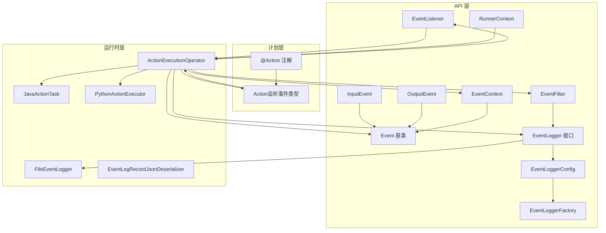
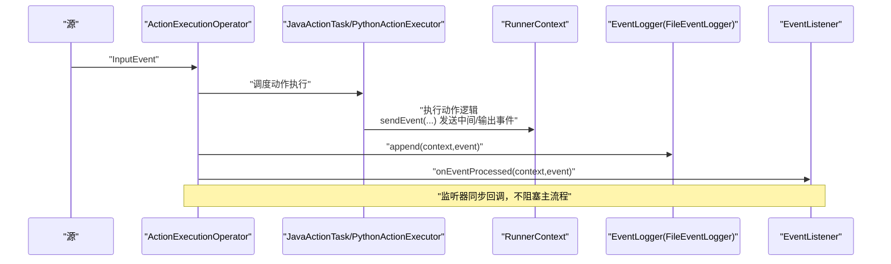
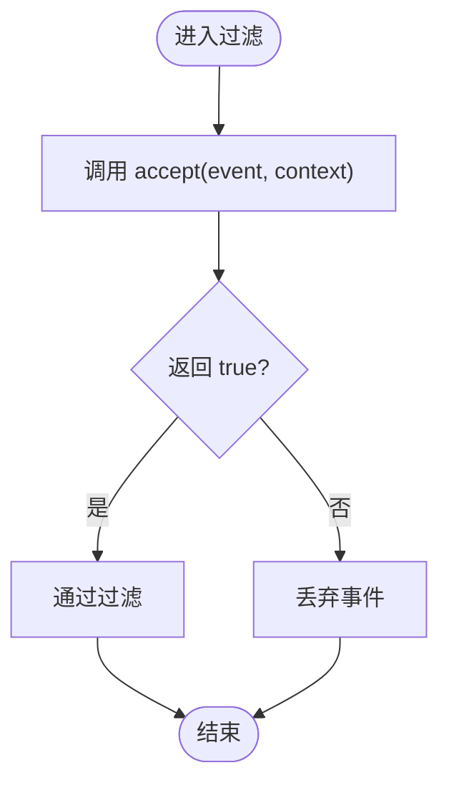
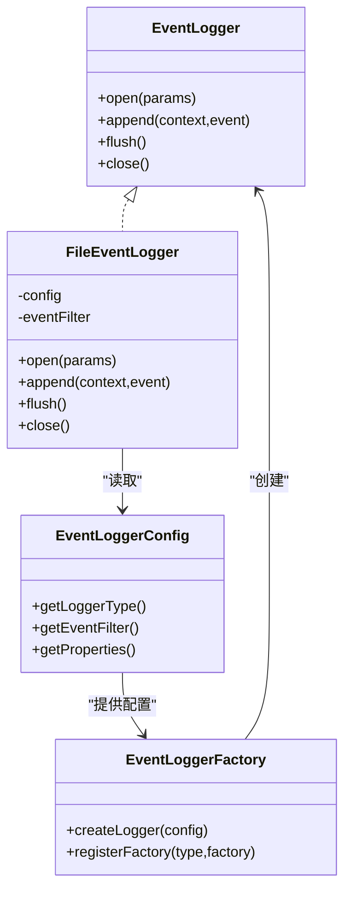
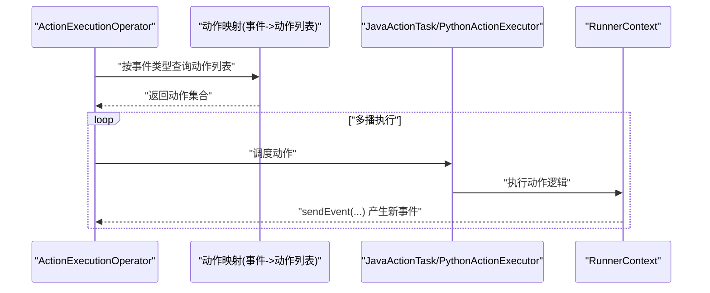
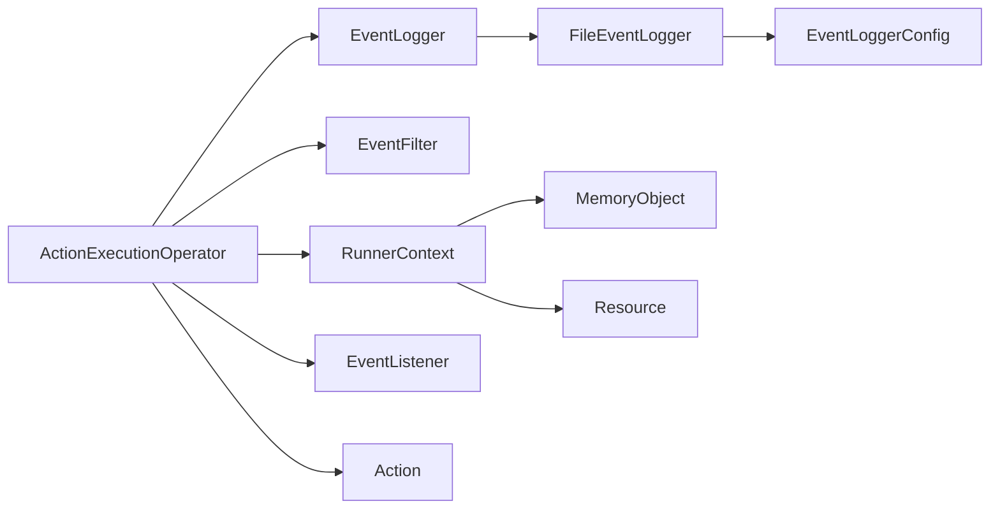

# 事件处理器

<cite>
**本文引用的文件**
- [EventListener.java](file://api/src/main/java/org/apache/flink/agents/api/listener/EventListener.java)
- [EventFilter.java](file://api/src/main/java/org/apache/flink/agents/api/EventFilter.java)
- [EventContext.java](file://api/src/main/java/org/apache/flink/agents/api/EventContext.java)
- [Event.java](file://api/src/main/java/org/apache/flink/agents/api/Event.java)
- [InputEvent.java](file://api/src/main/java/org/apache/flink/agents/api/InputEvent.java)
- [OutputEvent.java](file://api/src/main/java/org/apache/flink/agents/api/OutputEvent.java)
- [RunnerContext.java](file://api/src/main/java/org/apache/flink/agents/api/context/RunnerContext.java)
- [EventLogger.java](file://api/src/main/java/org/apache/flink/agents/api/logger/EventLogger.java)
- [EventLoggerConfig.java](file://api/src/main/java/org/apache/flink/agents/api/logger/EventLoggerConfig.java)
- [EventLoggerFactory.java](file://api/src/main/java/org/apache/flink/agents/api/logger/EventLoggerFactory.java)
- [FileEventLogger.java](file://runtime/src/main/java/org/apache/flink/agents/runtime/eventlog/FileEventLogger.java)
- [Action.java](file://plan/src/main/java/org/apache/flink/agents/plan/actions/Action.java)
- [Action.java（注解）](file://api/src/main/java/org/apache/flink/agents/api/annotation/Action.java)
- [ActionExecutionOperator.java](file://runtime/src/main/java/org/apache/flink/agents/runtime/operator/ActionExecutionOperator.java)
- [JavaActionTask.java](file://runtime/src/main/java/org/apache/flink/agents/runtime/operator/JavaActionTask.java)
- [PythonActionExecutor.java](file://runtime/src/main/java/org/apache/flink/agents/runtime/python/utils/PythonActionExecutor.java)
- [EventLogRecordJsonDeserializer.java](file://runtime/src/main/java/org/apache/flink/agents/runtime/eventlog/EventLogRecordJsonDeserializer.java)
- [ActionExecutionOperatorTest.java](file://runtime/src/test/java/org/apache/flink/agents/runtime/operator/ActionExecutionOperatorTest.java)
</cite>

## 目录
1. [简介](#简介)
2. [项目结构](#项目结构)
3. [核心组件](#核心组件)
4. [架构总览](#架构总览)
5. [详细组件分析](#详细组件分析)
6. [依赖关系分析](#依赖关系分析)
7. [性能考量](#性能考量)
8. [故障排查指南](#故障排查指南)
9. [结论](#结论)
10. [附录：使用与最佳实践](#附录使用与最佳实践)

## 简介
本文件面向事件处理器系统，围绕以下目标展开：EventListener 接口的设计与实现、EventFilter 的过滤机制、EventContext 的上下文管理、事件处理器的创建与配置、事件路由与多播机制、性能优化与并发安全、错误恢复策略，以及自定义事件处理器的开发指南与最佳实践。内容基于仓库中 API 层与运行时层的实际实现进行梳理与可视化。

## 项目结构
事件处理器相关能力横跨 API、计划（plan）、运行时（runtime）三层：
- API 层：定义事件基类、输入输出事件、事件上下文、事件过滤器、事件监听器、运行时上下文、事件日志接口与配置等。
- 计划层：描述动作（Action）及其监听的事件类型，用于构建执行图。
- 运行时层：实现事件路由、动作执行、事件日志记录、上下文隔离与内存管理等。

图表来源
- [Event.java](file://api/src/main/java/org/apache/flink/agents/api/Event.java#L29-L90)
- [InputEvent.java](file://api/src/main/java/org/apache/flink/agents/api/InputEvent.java#L27-L49)
- [OutputEvent.java](file://api/src/main/java/org/apache/flink/agents/api/OutputEvent.java#L27-L52)
- [EventContext.java](file://api/src/main/java/org/apache/flink/agents/api/EventContext.java#L26-L53)
- [EventFilter.java](file://api/src/main/java/org/apache/flink/agents/api/EventFilter.java#L27-L61)
- [EventListener.java](file://api/src/main/java/org/apache/flink/agents/api/listener/EventListener.java#L24-L51)
- [RunnerContext.java](file://api/src/main/java/org/apache/flink/agents/api/context/RunnerContext.java#L29-L138)
- [EventLogger.java](file://api/src/main/java/org/apache/flink/agents/api/logger/EventLogger.java#L24-L79)
- [EventLoggerConfig.java](file://api/src/main/java/org/apache/flink/agents/api/logger/EventLoggerConfig.java#L59-L149)
- [EventLoggerFactory.java](file://api/src/main/java/org/apache/flink/agents/api/logger/EventLoggerFactory.java#L70-L153)
- [Action.java](file://plan/src/main/java/org/apache/flink/agents/plan/actions/Action.java#L68-L99)
- [Action.java（注解）](file://api/src/main/java/org/apache/flink/agents/api/annotation/Action.java#L28-L53)
- [ActionExecutionOperator.java](file://runtime/src/main/java/org/apache/flink/agents/runtime/operator/ActionExecutionOperator.java#L547-L577)
- [JavaActionTask.java](file://runtime/src/main/java/org/apache/flink/agents/runtime/operator/JavaActionTask.java#L62-L91)
- [PythonActionExecutor.java](file://runtime/src/main/java/org/apache/flink/agents/runtime/python/utils/PythonActionExecutor.java#L131-L160)
- [FileEventLogger.java](file://runtime/src/main/java/org/apache/flink/agents/runtime/eventlog/FileEventLogger.java#L77-L157)
- [EventLogRecordJsonDeserializer.java](file://runtime/src/main/java/org/apache/flink/agents/runtime/eventlog/EventLogRecordJsonDeserializer.java#L89-L121)

章节来源
- [Event.java](file://api/src/main/java/org/apache/flink/agents/api/Event.java#L29-L90)
- [EventFilter.java](file://api/src/main/java/org/apache/flink/agents/api/EventFilter.java#L27-L61)
- [EventContext.java](file://api/src/main/java/org/apache/flink/agents/api/EventContext.java#L26-L53)
- [RunnerContext.java](file://api/src/main/java/org/apache/flink/agents/api/context/RunnerContext.java#L29-L138)
- [EventLogger.java](file://api/src/main/java/org/apache/flink/agents/api/logger/EventLogger.java#L24-L79)
- [EventLoggerConfig.java](file://api/src/main/java/org/apache/flink/agents/api/logger/EventLoggerConfig.java#L59-L149)
- [EventLoggerFactory.java](file://api/src/main/java/org/apache/flink/agents/api/logger/EventLoggerFactory.java#L70-L153)
- [FileEventLogger.java](file://runtime/src/main/java/org/apache/flink/agents/runtime/eventlog/FileEventLogger.java#L77-L157)
- [Action.java](file://plan/src/main/java/org/apache/flink/agents/plan/actions/Action.java#L68-L99)
- [Action.java（注解）](file://api/src/main/java/org/apache/flink/agents/api/annotation/Action.java#L28-L53)
- [ActionExecutionOperator.java](file://runtime/src/main/java/org/apache/flink/agents/runtime/operator/ActionExecutionOperator.java#L547-L577)
- [JavaActionTask.java](file://runtime/src/main/java/org/apache/flink/agents/runtime/operator/JavaActionTask.java#L62-L91)
- [PythonActionExecutor.java](file://runtime/src/main/java/org/apache/flink/agents/runtime/python/utils/PythonActionExecutor.java#L131-L160)
- [EventLogRecordJsonDeserializer.java](file://runtime/src/main/java/org/apache/flink/agents/runtime/eventlog/EventLogRecordJsonDeserializer.java#L89-L121)

## 核心组件
- 事件模型：Event 为抽象基类，InputEvent 与 OutputEvent 分别承载输入数据与输出结果；EventContext 提供事件类型与时间戳等上下文信息。
- 过滤器：EventFilter 通过 accept 方法对事件进行判定，支持按事件类型筛选与全量接受/拒绝。
- 监听器：EventListener 在事件处理完成后被同步回调，用于监控、指标收集或触发副作用。
- 执行上下文：RunnerContext 负责发送事件、访问短期/长期记忆、资源获取、度量组访问、持久化执行等。
- 日志与配置：EventLogger 抽象日志行为；EventLoggerConfig 与 EventLoggerFactory 提供配置与工厂注册能力；FileEventLogger 实现文件日志记录。
- 动作与路由：Action 描述可执行的动作及其监听的事件类型；@Action 注解声明方法监听的事件集合；运行时根据动作映射进行事件路由与多播。

章节来源
- [Event.java](file://api/src/main/java/org/apache/flink/agents/api/Event.java#L29-L90)
- [InputEvent.java](file://api/src/main/java/org/apache/flink/agents/api/InputEvent.java#L27-L49)
- [OutputEvent.java](file://api/src/main/java/org/apache/flink/agents/api/OutputEvent.java#L27-L52)
- [EventContext.java](file://api/src/main/java/org/apache/flink/agents/api/EventContext.java#L26-L53)
- [EventFilter.java](file://api/src/main/java/org/apache/flink/agents/api/EventFilter.java#L27-L61)
- [EventListener.java](file://api/src/main/java/org/apache/flink/agents/api/listener/EventListener.java#L24-L51)
- [RunnerContext.java](file://api/src/main/java/org/apache/flink/agents/api/context/RunnerContext.java#L29-L138)
- [EventLogger.java](file://api/src/main/java/org/apache/flink/agents/api/logger/EventLogger.java#L24-L79)
- [EventLoggerConfig.java](file://api/src/main/java/org/apache/flink/agents/api/logger/EventLoggerConfig.java#L59-L149)
- [EventLoggerFactory.java](file://api/src/main/java/org/apache/flink/agents/api/logger/EventLoggerFactory.java#L70-L153)
- [FileEventLogger.java](file://runtime/src/main/java/org/apache/flink/agents/runtime/eventlog/FileEventLogger.java#L77-L157)
- [Action.java](file://plan/src/main/java/org/apache/flink/agents/plan/actions/Action.java#L68-L99)
- [Action.java（注解）](file://api/src/main/java/org/apache/flink/agents/api/annotation/Action.java#L28-L53)

## 架构总览
事件从输入事件开始，经由动作执行与事件发送形成链路，同时通过事件过滤器与事件日志器进行记录与控制，最终在事件监听器处完成后置处理。

图表来源
- [ActionExecutionOperator.java](file://runtime/src/main/java/org/apache/flink/agents/runtime/operator/ActionExecutionOperator.java#L547-L577)
- [JavaActionTask.java](file://runtime/src/main/java/org/apache/flink/agents/runtime/operator/JavaActionTask.java#L62-L91)
- [PythonActionExecutor.java](file://runtime/src/main/java/org/apache/flink/agents/runtime/python/utils/PythonActionExecutor.java#L131-L160)
- [FileEventLogger.java](file://runtime/src/main/java/org/apache/flink/agents/runtime/eventlog/FileEventLogger.java#L123-L138)
- [EventListener.java](file://api/src/main/java/org/apache/flink/agents/api/listener/EventListener.java#L35-L51)

## 详细组件分析

### EventListener 接口：注册、注销与生命周期
- 设计要点
  - 同步回调：事件处理完成后调用，避免抛出异常影响主流程。
  - 生命周期：随动作执行周期触发，无需显式注册/注销；框架负责在合适时机回调。
- 使用建议
  - 回调内仅做轻量操作（如指标上报、简单日志），避免阻塞。
  - 如需复杂处理，应异步化并在内部自行容错。

章节来源
- [EventListener.java](file://api/src/main/java/org/apache/flink/agents/api/listener/EventListener.java#L24-L51)
- [ActionExecutionOperator.java](file://runtime/src/main/java/org/apache/flink/agents/runtime/operator/ActionExecutionOperator.java#L547-L577)

### EventFilter 过滤机制：条件匹配、优先级与策略
- 条件匹配
  - accept(event, context)：核心判定入口。
  - byEventType(...)：按事件类型白名单匹配。
  - ACCEPT_ALL/REJECT_ALL：预置策略。
- 优先级与策略
  - 过滤器在日志写入前生效，决定是否记录该事件。
  - 可组合不同策略以实现细粒度控制（例如“接受特定类型 + 自定义属性”）。
- 性能注意
  - 过滤器应保持轻量，避免复杂计算。
  - 多类型匹配采用线性扫描，建议限制事件类型数量。

图表来源
- [EventFilter.java](file://api/src/main/java/org/apache/flink/agents/api/EventFilter.java#L27-L61)
- [FileEventLogger.java](file://runtime/src/main/java/org/apache/flink/agents/runtime/eventlog/FileEventLogger.java#L123-L138)

章节来源
- [EventFilter.java](file://api/src/main/java/org/apache/flink/agents/api/EventFilter.java#L27-L61)
- [FileEventLogger.java](file://runtime/src/main/java/org/apache/flink/agents/runtime/eventlog/FileEventLogger.java#L123-L138)

### EventContext 上下文管理：事件传递、状态共享与隔离
- 作用
  - 提供事件类型（类名）与时间戳等元信息，便于日志与审计。
  - 作为事件传递过程中的载体，贯穿过滤、日志与监听阶段。
- 隔离与共享
  - 每个事件生成独立上下文实例，避免跨事件污染。
  - 与 RunnerContext 协作，后者负责状态与资源访问。

章节来源
- [EventContext.java](file://api/src/main/java/org/apache/flink/agents/api/EventContext.java#L26-L53)
- [Event.java](file://api/src/main/java/org/apache/flink/agents/api/Event.java#L29-L90)

### RunnerContext 执行环境：事件发送与状态访问
- 事件发送：sendEvent 将中间/输出事件加入待处理队列，驱动后续动作执行。
- 内存访问：短期/长期记忆根对象，支持读写与清理。
- 资源与配置：按名称与类型获取资源；访问全局与动作级配置。
- 持久化执行：durableExecute/durableExecuteAsync 支持可恢复的同步/异步调用。
- 并发与隔离：在单任务邮箱线程内执行，避免跨线程访问状态。

章节来源
- [RunnerContext.java](file://api/src/main/java/org/apache/flink/agents/api/context/RunnerContext.java#L29-L138)
- [ActionExecutionOperator.java](file://runtime/src/main/java/org/apache/flink/agents/runtime/operator/ActionExecutionOperator.java#L547-L577)

### 事件日志与配置：工厂与文件记录
- EventLogger 接口：open/append/flush/close 统一日志生命周期。
- EventLoggerConfig：设置日志器类型、事件过滤器与实现特定属性。
- EventLoggerFactory：注册内置/自定义工厂，按类型创建实例。
- FileEventLogger：基于文件的事件记录器，JSON Lines 格式，子任务级唯一文件，线程安全（Flink 子任务级别）。

图表来源
- [EventLogger.java](file://api/src/main/java/org/apache/flink/agents/api/logger/EventLogger.java#L24-L79)
- [EventLoggerConfig.java](file://api/src/main/java/org/apache/flink/agents/api/logger/EventLoggerConfig.java#L59-L149)
- [EventLoggerFactory.java](file://api/src/main/java/org/apache/flink/agents/api/logger/EventLoggerFactory.java#L70-L153)
- [FileEventLogger.java](file://runtime/src/main/java/org/apache/flink/agents/runtime/eventlog/FileEventLogger.java#L77-L157)

章节来源
- [EventLogger.java](file://api/src/main/java/org/apache/flink/agents/api/logger/EventLogger.java#L24-L79)
- [EventLoggerConfig.java](file://api/src/main/java/org/apache/flink/agents/api/logger/EventLoggerConfig.java#L59-L149)
- [EventLoggerFactory.java](file://api/src/main/java/org/apache/flink/agents/api/logger/EventLoggerFactory.java#L70-L153)
- [FileEventLogger.java](file://runtime/src/main/java/org/apache/flink/agents/runtime/eventlog/FileEventLogger.java#L77-L157)

### 事件路由与多播：动作映射与执行
- 动作定义
  - Action：包含名称、执行函数、监听事件类型列表与可选配置。
  - @Action 注解：声明方法监听的事件类型数组。
- 路由与多播
  - 运行时根据事件类型查找对应动作列表（多播），逐个执行。
  - 动作执行通过 JavaActionTask 或 PythonActionExecutor 完成，支持持续执行与异步恢复。
- 测试验证
  - 单元测试覆盖了事件路由、异步执行与事件发送链路。

图表来源
- [Action.java](file://plan/src/main/java/org/apache/flink/agents/plan/actions/Action.java#L68-L99)
- [Action.java（注解）](file://api/src/main/java/org/apache/flink/agents/api/annotation/Action.java#L28-L53)
- [ActionExecutionOperator.java](file://runtime/src/main/java/org/apache/flink/agents/runtime/operator/ActionExecutionOperator.java#L547-L577)
- [JavaActionTask.java](file://runtime/src/main/java/org/apache/flink/agents/runtime/operator/JavaActionTask.java#L62-L91)
- [PythonActionExecutor.java](file://runtime/src/main/java/org/apache/flink/agents/runtime/python/utils/PythonActionExecutor.java#L131-L160)

章节来源
- [Action.java](file://plan/src/main/java/org/apache/flink/agents/plan/actions/Action.java#L68-L99)
- [Action.java（注解）](file://api/src/main/java/org/apache/flink/agents/api/annotation/Action.java#L28-L53)
- [ActionExecutionOperator.java](file://runtime/src/main/java/org/apache/flink/agents/runtime/operator/ActionExecutionOperator.java#L547-L577)
- [JavaActionTask.java](file://runtime/src/main/java/org/apache/flink/agents/runtime/operator/JavaActionTask.java#L62-L91)
- [PythonActionExecutor.java](file://runtime/src/main/java/org/apache/flink/agents/runtime/python/utils/PythonActionExecutor.java#L131-L160)
- [ActionExecutionOperatorTest.java](file://runtime/src/test/java/org/apache/flink/agents/runtime/operator/ActionExecutionOperatorTest.java#L976-L1233)

## 依赖关系分析
- 低耦合高内聚
  - Event、EventContext、EventFilter、RunnerContext 为纯数据与接口，职责清晰。
  - EventLogger 与 FileEventLogger 解耦于业务动作，通过配置与工厂注入。
- 关键依赖链
  - ActionExecutionOperator 依赖 RunnerContext、EventFilter、EventLogger、EventListener 与动作映射。
  - FileEventLogger 依赖 EventLoggerConfig 与 EventFilter。
  - PythonActionExecutor 与 JavaActionTask 分别封装不同语言的动作执行。

图表来源
- [ActionExecutionOperator.java](file://runtime/src/main/java/org/apache/flink/agents/runtime/operator/ActionExecutionOperator.java#L547-L577)
- [RunnerContext.java](file://api/src/main/java/org/apache/flink/agents/api/context/RunnerContext.java#L29-L138)
- [EventFilter.java](file://api/src/main/java/org/apache/flink/agents/api/EventFilter.java#L27-L61)
- [EventLogger.java](file://api/src/main/java/org/apache/flink/agents/api/logger/EventLogger.java#L24-L79)
- [FileEventLogger.java](file://runtime/src/main/java/org/apache/flink/agents/runtime/eventlog/FileEventLogger.java#L77-L157)
- [EventLoggerConfig.java](file://api/src/main/java/org/apache/flink/agents/api/logger/EventLoggerConfig.java#L59-L149)
- [Action.java](file://plan/src/main/java/org/apache/flink/agents/plan/actions/Action.java#L68-L99)

章节来源
- [ActionExecutionOperator.java](file://runtime/src/main/java/org/apache/flink/agents/runtime/operator/ActionExecutionOperator.java#L547-L577)
- [RunnerContext.java](file://api/src/main/java/org/apache/flink/agents/api/context/RunnerContext.java#L29-L138)
- [EventFilter.java](file://api/src/main/java/org/apache/flink/agents/api/EventFilter.java#L27-L61)
- [EventLogger.java](file://api/src/main/java/org/apache/flink/agents/api/logger/EventLogger.java#L24-L79)
- [FileEventLogger.java](file://runtime/src/main/java/org/apache/flink/agents/runtime/eventlog/FileEventLogger.java#L77-L157)
- [EventLoggerConfig.java](file://api/src/main/java/org/apache/flink/agents/api/logger/EventLoggerConfig.java#L59-L149)
- [Action.java](file://plan/src/main/java/org/apache/flink/agents/plan/actions/Action.java#L68-L99)

## 性能考量
- 过滤前置：在日志写入前应用 EventFilter，减少无效 IO。
- 轻回调：EventListener 回调应避免阻塞，必要时异步化。
- 异步执行：durableExecuteAsync 在 JDK 21+ 使用 Continuation，降低线程切换开销。
- 文件日志：FileEventLogger 采用 JSON Lines 与追加写，避免随机 IO；flush 仅在必要时调用。
- 多播成本：动作映射与多播会增加处理次数，建议合理拆分动作与事件类型。

## 故障排查指南
- 事件未记录
  - 检查 EventLogger 是否已 open，且 EventFilter 是否允许该事件类型。
  - 参考：[FileEventLogger.append](file://runtime/src/main/java/org/apache/flink/agents/runtime/eventlog/FileEventLogger.java#L123-L138)
- 序列化/反序列化问题
  - 确保事件类型可被正确识别与反序列化。
  - 参考：[EventLogRecordJsonDeserializer](file://runtime/src/main/java/org/apache/flink/agents/runtime/eventlog/EventLogRecordJsonDeserializer.java#L89-L121)
- 监听器异常
  - 监听器不应抛出异常；若出现异常，检查实现与日志。
  - 参考：[EventListener](file://api/src/main/java/org/apache/flink/agents/api/listener/EventListener.java#L35-L51)
- 异步执行异常
  - PythonActionExecutor 在执行失败时会清空事件并抛出异常，检查 Python 函数与 Awaitable。
  - 参考：[PythonActionExecutor](file://runtime/src/main/java/org/apache/flink/agents/runtime/python/utils/PythonActionExecutor.java#L131-L160)

章节来源
- [FileEventLogger.java](file://runtime/src/main/java/org/apache/flink/agents/runtime/eventlog/FileEventLogger.java#L123-L138)
- [EventLogRecordJsonDeserializer.java](file://runtime/src/main/java/org/apache/flink/agents/runtime/eventlog/EventLogRecordJsonDeserializer.java#L89-L121)
- [EventListener.java](file://api/src/main/java/org/apache/flink/agents/api/listener/EventListener.java#L35-L51)
- [PythonActionExecutor.java](file://runtime/src/main/java/org/apache/flink/agents/runtime/python/utils/PythonActionExecutor.java#L131-L160)

## 结论
事件处理器系统通过清晰的事件模型、灵活的过滤与日志、稳定的执行上下文与动作路由，实现了可观测、可扩展与高性能的事件处理流水线。结合本文的架构视图、流程图与最佳实践，可在保证并发安全与错误恢复的前提下，快速构建与扩展自定义事件处理器。

## 附录：使用与最佳实践

### 创建与配置事件处理器
- 定义动作与监听事件
  - 使用 @Action 注解声明方法监听的事件类型数组。
  - 参考：[@Action 注解](file://api/src/main/java/org/apache/flink/agents/api/annotation/Action.java#L28-L53)
- 编写动作逻辑
  - 在 RunnerContext 中发送事件、访问内存与资源、执行持久化操作。
  - 参考：[RunnerContext](file://api/src/main/java/org/apache/flink/agents/api/context/RunnerContext.java#L29-L138)
- 配置事件日志
  - 通过 EventLoggerConfig 设置日志器类型与事件过滤器；使用 EventLoggerFactory 创建实例。
  - 参考：[EventLoggerConfig](file://api/src/main/java/org/apache/flink/agents/api/logger/EventLoggerConfig.java#L59-L149)，[EventLoggerFactory](file://api/src/main/java/org/apache/flink/agents/api/logger/EventLoggerFactory.java#L70-L153)
- 选择日志实现
  - 默认使用 FileEventLogger，按子任务生成唯一日志文件，线程安全。
  - 参考：[FileEventLogger](file://runtime/src/main/java/org/apache/flink/agents/runtime/eventlog/FileEventLogger.java#L77-L157)

### 事件路由与多播
- 动作映射
  - Action.listenEventTypes 决定事件路由；同一事件可多播到多个动作。
  - 参考：[Action](file://plan/src/main/java/org/apache/flink/agents/plan/actions/Action.java#L68-L99)
- 执行路径
  - Java 动作通过 JavaActionTask 执行；Python 动作通过 PythonActionExecutor 执行。
  - 参考：[JavaActionTask](file://runtime/src/main/java/org/apache/flink/agents/runtime/operator/JavaActionTask.java#L62-L91)，[PythonActionExecutor](file://runtime/src/main/java/org/apache/flink/agents/runtime/python/utils/PythonActionExecutor.java#L131-L160)

### 过滤策略与性能优化
- 使用 EventFilter.byEventType 进行类型白名单过滤。
- 使用 ACCEPT_ALL/REJECT_ALL 快速开关。
- 参考：[EventFilter](file://api/src/main/java/org/apache/flink/agents/api/EventFilter.java#L27-L61)

### 并发安全与错误恢复
- RunnerContext 在单任务邮箱线程内执行，避免跨线程访问状态。
- durableExecute/durableExecuteAsync 支持作业重启后的结果缓存与恢复。
- 参考：[RunnerContext](file://api/src/main/java/org/apache/flink/agents/api/context/RunnerContext.java#L112-L133)

### 自定义事件处理器开发指南
- 实现 EventLogger 接口，注册至 EventLoggerFactory。
- 实现 EventListener，在 onEventProcessed 中处理后置逻辑。
- 在动作中通过 RunnerContext.sendEvent 发送事件，形成处理链。
- 参考：[EventLogger](file://api/src/main/java/org/apache/flink/agents/api/logger/EventLogger.java#L24-L79)，[EventListener](file://api/src/main/java/org/apache/flink/agents/api/listener/EventListener.java#L24-L51)