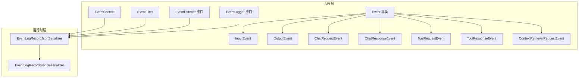
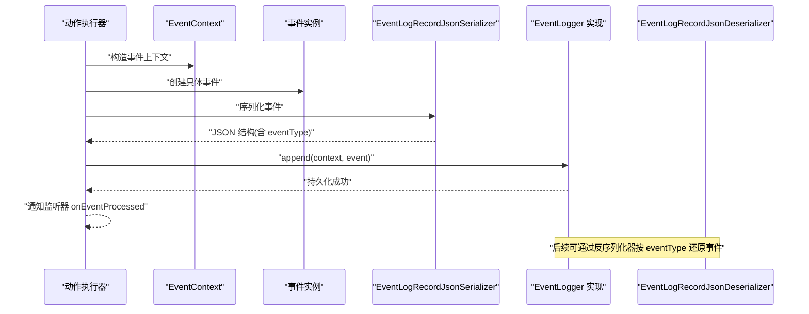
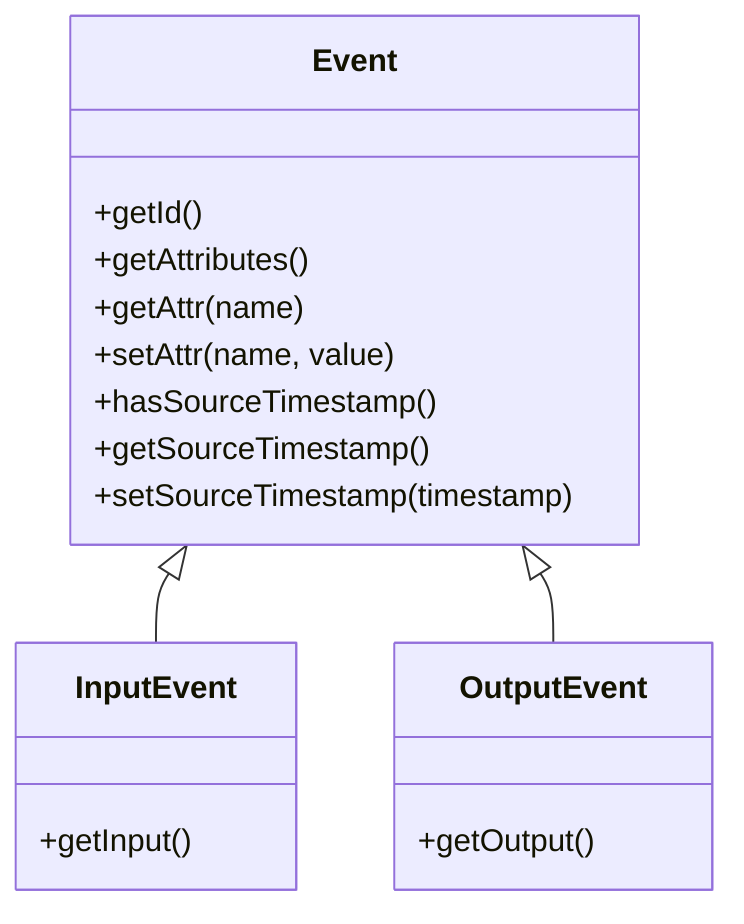
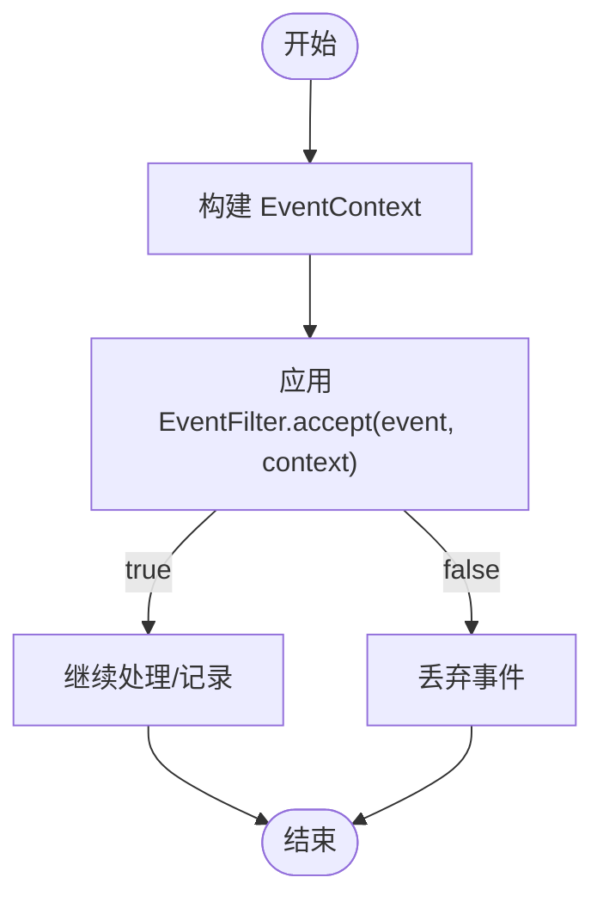
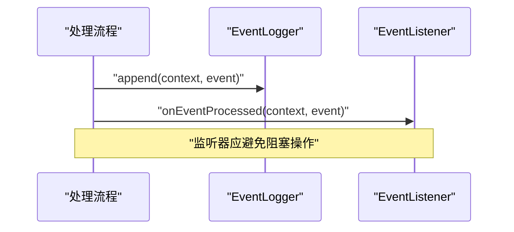
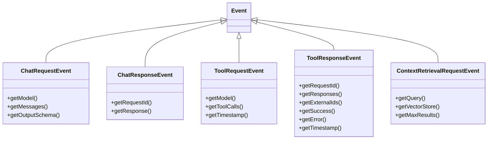
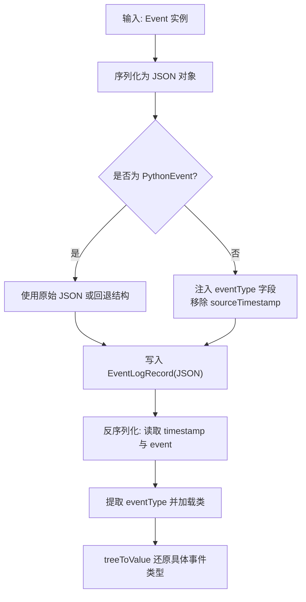
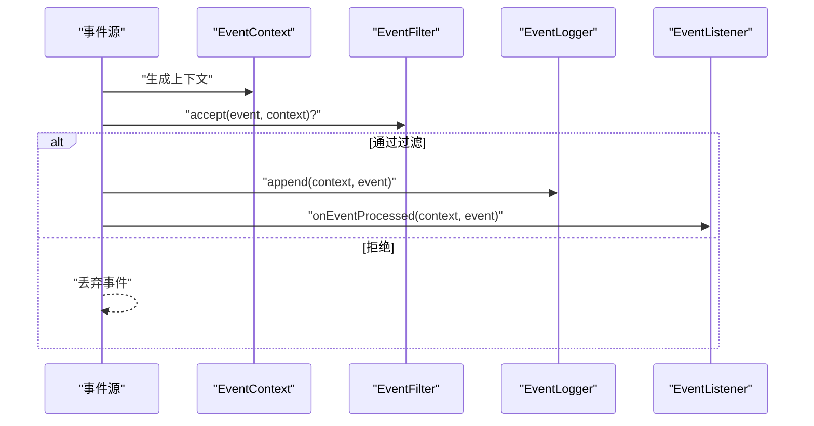
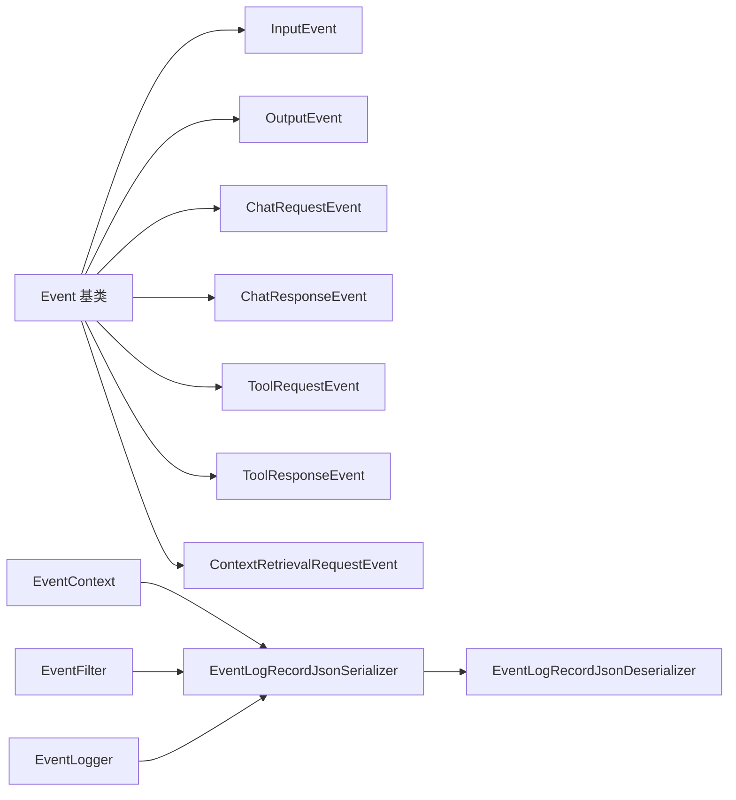

# 事件系统架构

<cite>
**本文引用的文件**
- [Event.java](file://api/src/main/java/org/apache/flink/agents/api/Event.java)
- [InputEvent.java](file://api/src/main/java/org/apache/flink/agents/api/InputEvent.java)
- [OutputEvent.java](file://api/src/main/java/org/apache/flink/agents/api/OutputEvent.java)
- [EventContext.java](file://api/src/main/java/org/apache/flink/agents/api/EventContext.java)
- [EventFilter.java](file://api/src/main/java/org/apache/flink/agents/api/EventFilter.java)
- [ChatRequestEvent.java](file://api/src/main/java/org/apache/flink/agents/api/event/ChatRequestEvent.java)
- [ToolRequestEvent.java](file://api/src/main/java/org/apache/flink/agents/api/event/ToolRequestEvent.java)
- [ContextRetrievalRequestEvent.java](file://api/src/main/java/org/apache/flink/agents/api/event/ContextRetrievalRequestEvent.java)
- [ChatResponseEvent.java](file://api/src/main/java/org/apache/flink/agents/api/event/ChatResponseEvent.java)
- [ToolResponseEvent.java](file://api/src/main/java/org/apache/flink/agents/api/event/ToolResponseEvent.java)
- [EventListener.java](file://api/src/main/java/org/apache/flink/agents/api/listener/EventListener.java)
- [EventLogger.java](file://api/src/main/java/org/apache/flink/agents/api/logger/EventLogger.java)
- [EventLogRecordJsonSerializer.java](file://runtime/src/main/java/org/apache/flink/agents/runtime/eventlog/EventLogRecordJsonSerializer.java)
- [EventLogRecordJsonDeserializer.java](file://runtime/src/main/java/org/apache/flink/agents/runtime/eventlog/EventLogRecordJsonDeserializer.java)
- [TestEventSerializable.java](file://plan/src/test/java/org/apache/flink/agents/plan/TestEventSerializable.java)
</cite>

## 目录
1. [引言](#引言)
2. [项目结构](#项目结构)
3. [核心组件](#核心组件)
4. [架构总览](#架构总览)
5. [详细组件分析](#详细组件分析)
6. [依赖关系分析](#依赖关系分析)
7. [性能考量](#性能考量)
8. [故障排查指南](#故障排查指南)
9. [结论](#结论)
10. [附录](#附录)

## 引言
本文件系统性阐述 Flink Agents 事件驱动架构的设计理念与实现方式，覆盖事件基类与输入/输出事件的抽象设计，以及多种事件类型的定义与用途（如 ChatRequestEvent、ToolRequestEvent、ContextRetrievalRequestEvent 等输入事件及对应输出事件）。文档还说明事件生命周期管理、事件处理器注册机制与事件路由策略，提供事件序列化与反序列化的实现细节，并给出事件监听器使用方法、自定义事件类型开发指南、事件系统与代理执行流程的集成方式，以及丰富的最佳实践建议。

## 项目结构
事件系统位于 API 层与运行时层之间，围绕统一的事件模型展开：
- API 层定义事件基类与事件类型、上下文、过滤器、监听器与日志接口
- 运行时层提供事件记录的 JSON 序列化/反序列化实现，支撑事件持久化与回放
- 计划与测试模块验证事件可序列化性与跨语言事件支持

图表来源
- [Event.java](file://api/src/main/java/org/apache/flink/agents/api/Event.java#L29-L89)
- [InputEvent.java](file://api/src/main/java/org/apache/flink/agents/api/InputEvent.java#L27-L48)
- [OutputEvent.java](file://api/src/main/java/org/apache/flink/agents/api/OutputEvent.java#L27-L51)
- [EventContext.java](file://api/src/main/java/org/apache/flink/agents/api/EventContext.java#L26-L52)
- [EventFilter.java](file://api/src/main/java/org/apache/flink/agents/api/EventFilter.java#L21-L61)
- [EventListener.java](file://api/src/main/java/org/apache/flink/agents/api/listener/EventListener.java#L24-L51)
- [EventLogger.java](file://api/src/main/java/org/apache/flink/agents/api/logger/EventLogger.java#L24-L78)
- [ChatRequestEvent.java](file://api/src/main/java/org/apache/flink/agents/api/event/ChatRequestEvent.java#L28-L57)
- [ChatResponseEvent.java](file://api/src/main/java/org/apache/flink/agents/api/event/ChatResponseEvent.java#L26-L42)
- [ToolRequestEvent.java](file://api/src/main/java/org/apache/flink/agents/api/event/ToolRequestEvent.java#L26-L62)
- [ToolResponseEvent.java](file://api/src/main/java/org/apache/flink/agents/api/event/ToolResponseEvent.java#L27-L94)
- [ContextRetrievalRequestEvent.java](file://api/src/main/java/org/apache/flink/agents/api/event/ContextRetrievalRequestEvent.java#L23-L69)
- [EventLogRecordJsonSerializer.java](file://runtime/src/main/java/org/apache/flink/agents/runtime/eventlog/EventLogRecordJsonSerializer.java#L34-L162)
- [EventLogRecordJsonDeserializer.java](file://runtime/src/main/java/org/apache/flink/agents/runtime/eventlog/EventLogRecordJsonDeserializer.java#L32-L121)

章节来源
- [Event.java](file://api/src/main/java/org/apache/flink/agents/api/Event.java#L29-L89)
- [InputEvent.java](file://api/src/main/java/org/apache/flink/agents/api/InputEvent.java#L27-L48)
- [OutputEvent.java](file://api/src/main/java/org/apache/flink/agents/api/OutputEvent.java#L27-L51)
- [EventContext.java](file://api/src/main/java/org/apache/flink/agents/api/EventContext.java#L26-L52)
- [EventFilter.java](file://api/src/main/java/org/apache/flink/agents/api/EventFilter.java#L21-L61)
- [EventListener.java](file://api/src/main/java/org/apache/flink/agents/api/listener/EventListener.java#L24-L51)
- [EventLogger.java](file://api/src/main/java/org/apache/flink/agents/api/logger/EventLogger.java#L24-L78)
- [ChatRequestEvent.java](file://api/src/main/java/org/apache/flink/agents/api/event/ChatRequestEvent.java#L28-L57)
- [ChatResponseEvent.java](file://api/src/main/java/org/apache/flink/agents/api/event/ChatResponseEvent.java#L26-L42)
- [ToolRequestEvent.java](file://api/src/main/java/org/apache/flink/agents/api/event/ToolRequestEvent.java#L26-L62)
- [ToolResponseEvent.java](file://api/src/main/java/org/apache/flink/agents/api/event/ToolResponseEvent.java#L27-L94)
- [ContextRetrievalRequestEvent.java](file://api/src/main/java/org/apache/flink/agents/api/event/ContextRetrievalRequestEvent.java#L23-L69)
- [EventLogRecordJsonSerializer.java](file://runtime/src/main/java/org/apache/flink/agents/runtime/eventlog/EventLogRecordJsonSerializer.java#L34-L162)
- [EventLogRecordJsonDeserializer.java](file://runtime/src/main/java/org/apache/flink/agents/runtime/eventlog/EventLogRecordJsonDeserializer.java#L32-L121)

## 核心组件
- Event 基类：统一事件标识、属性与源时间戳，提供等值性与哈希一致性
- InputEvent/OutputEvent：分别承载“进入代理的输入数据”和“代理产生的输出结果”
- EventContext：封装事件类型与处理时间戳
- EventFilter：事件过滤接口，支持按类型、自定义逻辑筛选
- EventListener：事件处理完成后的回调接口
- EventLogger：事件日志接口，统一打开、追加、刷新与关闭生命周期
- 具体事件类型：聊天请求/响应、工具调用请求/响应、上下文检索请求等

章节来源
- [Event.java](file://api/src/main/java/org/apache/flink/agents/api/Event.java#L29-L89)
- [InputEvent.java](file://api/src/main/java/org/apache/flink/agents/api/InputEvent.java#L27-L48)
- [OutputEvent.java](file://api/src/main/java/org/apache/flink/agents/api/OutputEvent.java#L27-L51)
- [EventContext.java](file://api/src/main/java/org/apache/flink/agents/api/EventContext.java#L26-L52)
- [EventFilter.java](file://api/src/main/java/org/apache/flink/agents/api/EventFilter.java#L21-L61)
- [EventListener.java](file://api/src/main/java/org/apache/flink/agents/api/listener/EventListener.java#L24-L51)
- [EventLogger.java](file://api/src/main/java/org/apache/flink/agents/api/logger/EventLogger.java#L24-L78)

## 架构总览
事件系统采用“事件模型 + 序列化/反序列化 + 日志接口”的分层设计：
- 事件模型：以 Event 为根，派生出输入/输出事件与业务事件
- 序列化策略：通过 EventLogRecordJsonSerializer 将事件写入 JSON，自动注入 eventType 字段；反序列化器根据 eventType 动态加载类并还原事件
- 日志与监听：EventLogger 负责持久化，EventListener 提供后置回调，EventFilter 控制日志/监听范围

图表来源
- [EventContext.java](file://api/src/main/java/org/apache/flink/agents/api/EventContext.java#L26-L52)
- [EventLogRecordJsonSerializer.java](file://runtime/src/main/java/org/apache/flink/agents/runtime/eventlog/EventLogRecordJsonSerializer.java#L34-L162)
- [EventLogRecordJsonDeserializer.java](file://runtime/src/main/java/org/apache/flink/agents/runtime/eventlog/EventLogRecordJsonDeserializer.java#L32-L121)
- [EventLogger.java](file://api/src/main/java/org/apache/flink/agents/api/logger/EventLogger.java#L24-L78)
- [EventListener.java](file://api/src/main/java/org/apache/flink/agents/api/listener/EventListener.java#L24-L51)

## 详细组件分析

### 事件基类与输入/输出事件
- Event 抽象类提供唯一标识、通用属性 Map、源时间戳字段与等值/哈希实现
- InputEvent 承载进入代理的输入对象
- OutputEvent 承载代理产生的输出对象

图表来源
- [Event.java](file://api/src/main/java/org/apache/flink/agents/api/Event.java#L29-L89)
- [InputEvent.java](file://api/src/main/java/org/apache/flink/agents/api/InputEvent.java#L27-L48)
- [OutputEvent.java](file://api/src/main/java/org/apache/flink/agents/api/OutputEvent.java#L27-L51)

章节来源
- [Event.java](file://api/src/main/java/org/apache/flink/agents/api/Event.java#L29-L89)
- [InputEvent.java](file://api/src/main/java/org/apache/flink/agents/api/InputEvent.java#L27-L48)
- [OutputEvent.java](file://api/src/main/java/org/apache/flink/agents/api/OutputEvent.java#L27-L51)

### 事件上下文与过滤
- EventContext 记录事件类型全限定名与处理时间戳
- EventFilter 提供按类型、自定义逻辑的过滤能力，默认接受全部或拒绝全部

图表来源
- [EventContext.java](file://api/src/main/java/org/apache/flink/agents/api/EventContext.java#L26-L52)
- [EventFilter.java](file://api/src/main/java/org/apache/flink/agents/api/EventFilter.java#L21-L61)

章节来源
- [EventContext.java](file://api/src/main/java/org/apache/flink/agents/api/EventContext.java#L26-L52)
- [EventFilter.java](file://api/src/main/java/org/apache/flink/agents/api/EventFilter.java#L21-L61)

### 事件监听器与日志接口
- EventListener 在事件处理完成后被同步回调，用于监控、指标收集或副作用触发
- EventLogger 统一了打开、追加、刷新与关闭的生命周期，便于对接不同存储后端

图表来源
- [EventListener.java](file://api/src/main/java/org/apache/flink/agents/api/listener/EventListener.java#L24-L51)
- [EventLogger.java](file://api/src/main/java/org/apache/flink/agents/api/logger/EventLogger.java#L24-L78)

章节来源
- [EventListener.java](file://api/src/main/java/org/apache/flink/agents/api/listener/EventListener.java#L24-L51)
- [EventLogger.java](file://api/src/main/java/org/apache/flink/agents/api/logger/EventLogger.java#L24-L78)

### 业务事件类型与用途
- ChatRequestEvent：表示聊天请求，携带模型名、消息列表与可选输出模式
- ChatResponseEvent：表示聊天响应，携带请求 ID 与响应消息
- ToolRequestEvent：表示工具调用请求，携带模型名、工具调用列表与时间戳
- ToolResponseEvent：表示工具调用响应，携带请求 ID、各工具响应、成功标志、错误信息与外部 ID 映射
- ContextRetrievalRequestEvent：表示上下文检索请求，携带查询语句、向量库标识与最大返回条数

图表来源
- [ChatRequestEvent.java](file://api/src/main/java/org/apache/flink/agents/api/event/ChatRequestEvent.java#L28-L57)
- [ChatResponseEvent.java](file://api/src/main/java/org/apache/flink/agents/api/event/ChatResponseEvent.java#L26-L42)
- [ToolRequestEvent.java](file://api/src/main/java/org/apache/flink/agents/api/event/ToolRequestEvent.java#L26-L62)
- [ToolResponseEvent.java](file://api/src/main/java/org/apache/flink/agents/api/event/ToolResponseEvent.java#L27-L94)
- [ContextRetrievalRequestEvent.java](file://api/src/main/java/org/apache/flink/agents/api/event/ContextRetrievalRequestEvent.java#L23-L69)

章节来源
- [ChatRequestEvent.java](file://api/src/main/java/org/apache/flink/agents/api/event/ChatRequestEvent.java#L28-L57)
- [ChatResponseEvent.java](file://api/src/main/java/org/apache/flink/agents/api/event/ChatResponseEvent.java#L26-L42)
- [ToolRequestEvent.java](file://api/src/main/java/org/apache/flink/agents/api/event/ToolRequestEvent.java#L26-L62)
- [ToolResponseEvent.java](file://api/src/main/java/org/apache/flink/agents/api/event/ToolResponseEvent.java#L27-L94)
- [ContextRetrievalRequestEvent.java](file://api/src/main/java/org/apache/flink/agents/api/event/ContextRetrievalRequestEvent.java#L23-L69)

### 事件序列化与反序列化
- 序列化：EventLogRecordJsonSerializer 将事件转换为 JSON 对象，自动注入 eventType 字段与有序字段排列，移除 sourceTimestamp
- 反序列化：EventLogRecordJsonDeserializer 从 JSON 中读取 timestamp 与 event，解析 event 中的 eventType 并动态加载类进行还原
- Python 事件兼容：对 PythonEvent 提供特殊处理，优先使用原始 JSON 字符串，必要时回退到包含 eventType/id/rawEventJsonStr 的结构

图表来源
- [EventLogRecordJsonSerializer.java](file://runtime/src/main/java/org/apache/flink/agents/runtime/eventlog/EventLogRecordJsonSerializer.java#L34-L162)
- [EventLogRecordJsonDeserializer.java](file://runtime/src/main/java/org/apache/flink/agents/runtime/eventlog/EventLogRecordJsonDeserializer.java#L32-L121)

章节来源
- [EventLogRecordJsonSerializer.java](file://runtime/src/main/java/org/apache/flink/agents/runtime/eventlog/EventLogRecordJsonSerializer.java#L34-L162)
- [EventLogRecordJsonDeserializer.java](file://runtime/src/main/java/org/apache/flink/agents/runtime/eventlog/EventLogRecordJsonDeserializer.java#L32-L121)

### 事件生命周期与路由策略
- 生命周期：事件产生 → 上下文封装 → 过滤 → 序列化/持久化 → 监听器回调 → 下游处理
- 路由策略：基于事件类型与过滤器决定是否记录与通知监听器；业务事件（如 ChatRequestEvent/ToolRequestEvent）在代理计划中被动作处理器消费

图表来源
- [EventFilter.java](file://api/src/main/java/org/apache/flink/agents/api/EventFilter.java#L21-L61)
- [EventLogger.java](file://api/src/main/java/org/apache/flink/agents/api/logger/EventLogger.java#L24-L78)
- [EventListener.java](file://api/src/main/java/org/apache/flink/agents/api/listener/EventListener.java#L24-L51)

章节来源
- [EventFilter.java](file://api/src/main/java/org/apache/flink/agents/api/EventFilter.java#L21-L61)
- [EventLogger.java](file://api/src/main/java/org/apache/flink/agents/api/logger/EventLogger.java#L24-L78)
- [EventListener.java](file://api/src/main/java/org/apache/flink/agents/api/listener/EventListener.java#L24-L51)

### 事件监听器使用方法与注册机制
- 使用方式：实现 EventListener 接口，在 onEventProcessed 中处理事件与上下文
- 注册机制：监听器通常由运行时框架在事件处理完成后同步回调，无需显式注册；若需扩展，请遵循轻量与非阻塞原则

章节来源
- [EventListener.java](file://api/src/main/java/org/apache/flink/agents/api/listener/EventListener.java#L24-L51)

### 自定义事件类型的开发指南
- 继承 Event 并定义必要的领域字段
- 确保所有字段可被 Jackson 序列化（提供 getter）
- 如需参与日志记录，保持字段简洁且可序列化
- 若涉及跨语言场景，参考 PythonEvent 的兼容处理思路

章节来源
- [Event.java](file://api/src/main/java/org/apache/flink/agents/api/Event.java#L29-L89)
- [EventLogRecordJsonSerializer.java](file://runtime/src/main/java/org/apache/flink/agents/runtime/eventlog/EventLogRecordJsonSerializer.java#L82-L117)

### 事件系统与代理执行流程的集成
- 输入事件：InputEvent 作为代理入口，驱动动作执行
- 输出事件：OutputEvent 作为代理结果输出
- 业务事件：ChatRequestEvent/ToolRequestEvent/ContextRetrievalRequestEvent 等在代理计划的动作中被消费，产生对应的响应事件（ChatResponseEvent/ToolResponseEvent）

章节来源
- [InputEvent.java](file://api/src/main/java/org/apache/flink/agents/api/InputEvent.java#L27-L48)
- [OutputEvent.java](file://api/src/main/java/org/apache/flink/agents/api/OutputEvent.java#L27-L51)
- [ChatRequestEvent.java](file://api/src/main/java/org/apache/flink/agents/api/event/ChatRequestEvent.java#L28-L57)
- [ToolRequestEvent.java](file://api/src/main/java/org/apache/flink/agents/api/event/ToolRequestEvent.java#L26-L62)
- [ContextRetrievalRequestEvent.java](file://api/src/main/java/org/apache/flink/agents/api/event/ContextRetrievalRequestEvent.java#L23-L69)
- [ChatResponseEvent.java](file://api/src/main/java/org/apache/flink/agents/api/event/ChatResponseEvent.java#L26-L42)
- [ToolResponseEvent.java](file://api/src/main/java/org/apache/flink/agents/api/event/ToolResponseEvent.java#L27-L94)

## 依赖关系分析
事件系统内部依赖清晰，耦合度低：
- 事件类型均继承 Event，共享统一的标识与属性体系
- 序列化/反序列化依赖 eventType 字段实现多态还原
- 日志与监听通过接口解耦，便于替换实现

图表来源
- [Event.java](file://api/src/main/java/org/apache/flink/agents/api/Event.java#L29-L89)
- [InputEvent.java](file://api/src/main/java/org/apache/flink/agents/api/InputEvent.java#L27-L48)
- [OutputEvent.java](file://api/src/main/java/org/apache/flink/agents/api/OutputEvent.java#L27-L51)
- [ChatRequestEvent.java](file://api/src/main/java/org/apache/flink/agents/api/event/ChatRequestEvent.java#L28-L57)
- [ChatResponseEvent.java](file://api/src/main/java/org/apache/flink/agents/api/event/ChatResponseEvent.java#L26-L42)
- [ToolRequestEvent.java](file://api/src/main/java/org/apache/flink/agents/api/event/ToolRequestEvent.java#L26-L62)
- [ToolResponseEvent.java](file://api/src/main/java/org/apache/flink/agents/api/event/ToolResponseEvent.java#L27-L94)
- [ContextRetrievalRequestEvent.java](file://api/src/main/java/org/apache/flink/agents/api/event/ContextRetrievalRequestEvent.java#L23-L69)
- [EventContext.java](file://api/src/main/java/org/apache/flink/agents/api/EventContext.java#L26-L52)
- [EventFilter.java](file://api/src/main/java/org/apache/flink/agents/api/EventFilter.java#L21-L61)
- [EventLogger.java](file://api/src/main/java/org/apache/flink/agents/api/logger/EventLogger.java#L24-L78)
- [EventLogRecordJsonSerializer.java](file://runtime/src/main/java/org/apache/flink/agents/runtime/eventlog/EventLogRecordJsonSerializer.java#L34-L162)
- [EventLogRecordJsonDeserializer.java](file://runtime/src/main/java/org/apache/flink/agents/runtime/eventlog/EventLogRecordJsonDeserializer.java#L32-L121)

章节来源
- [Event.java](file://api/src/main/java/org/apache/flink/agents/api/Event.java#L29-L89)
- [EventLogRecordJsonSerializer.java](file://runtime/src/main/java/org/apache/flink/agents/runtime/eventlog/EventLogRecordJsonSerializer.java#L34-L162)
- [EventLogRecordJsonDeserializer.java](file://runtime/src/main/java/org/apache/flink/agents/runtime/eventlog/EventLogRecordJsonDeserializer.java#L32-L121)

## 性能考量
- 序列化开销：事件 JSON 包含 eventType 字段与有序字段，建议控制事件体大小与嵌套层级
- 过滤成本：EventFilter 的 accept 方法应尽量轻量，避免复杂计算
- 监听器影响：EventListener 不应在回调中执行阻塞操作，避免影响代理吞吐
- 多态反序列化：按 eventType 动态加载类存在反射成本，建议在启动阶段预热或缓存常用类型映射

## 故障排查指南
- 序列化失败：检查事件字段是否具备可序列化 getter，参考测试用例对可序列化性的断言
- 反序列化异常：确认 JSON 中包含有效的 eventType 字段，且类路径正确
- 日志未生效：核对 EventLogger 配置与 EventFilter 设置，确保事件通过过滤

章节来源
- [TestEventSerializable.java](file://plan/src/test/java/org/apache/flink/agents/plan/TestEventSerializable.java#L58-L84)
- [EventLogRecordJsonDeserializer.java](file://runtime/src/main/java/org/apache/flink/agents/runtime/eventlog/EventLogRecordJsonDeserializer.java#L82-L103)

## 结论
该事件系统以 Event 为核心，通过统一的上下文、过滤、监听与日志接口，结合基于 eventType 的多态序列化/反序列化机制，实现了高内聚、低耦合的事件驱动架构。业务事件类型清晰、生命周期明确、路由策略灵活，能够有效支撑代理执行流程与跨语言扩展需求。

## 附录
- 最佳实践建议
  - 事件字段保持简单可序列化，避免大对象与循环引用
  - 使用 EventFilter 精准控制日志与监听范围，降低系统开销
  - 监听器实现应无副作用、无阻塞、可重入
  - 自定义事件类型需保证可逆序列化，必要时提供默认构造与完整 getter
  - 在跨语言场景下，优先使用 PythonEvent 的兼容处理策略