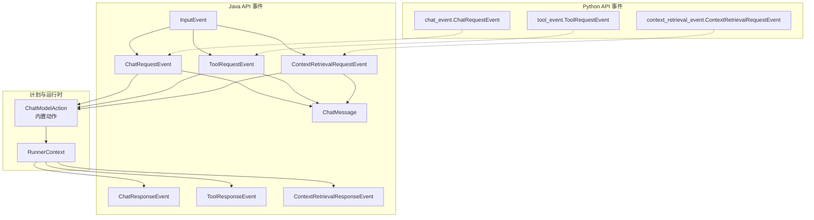
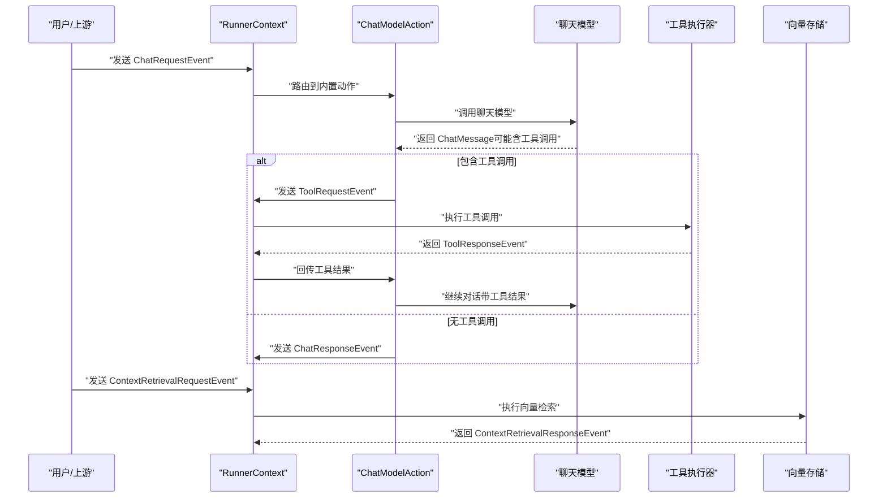
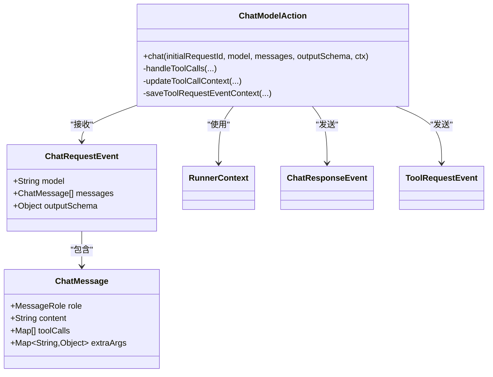
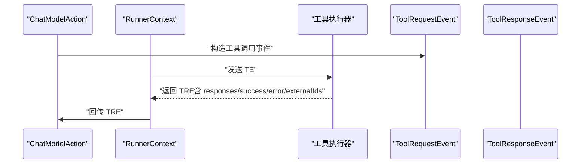
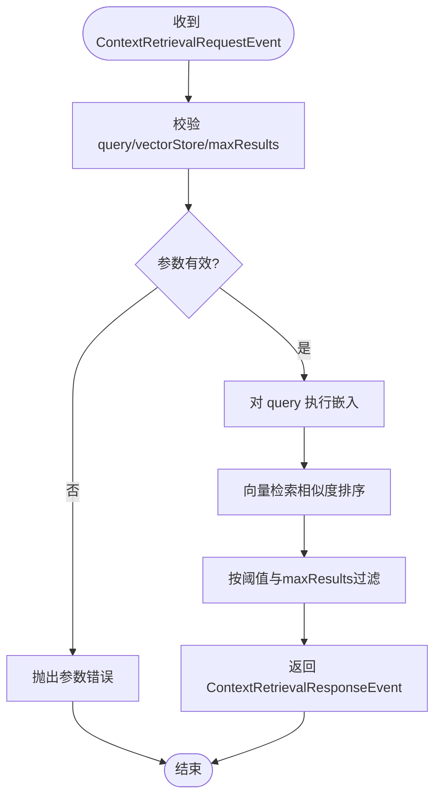
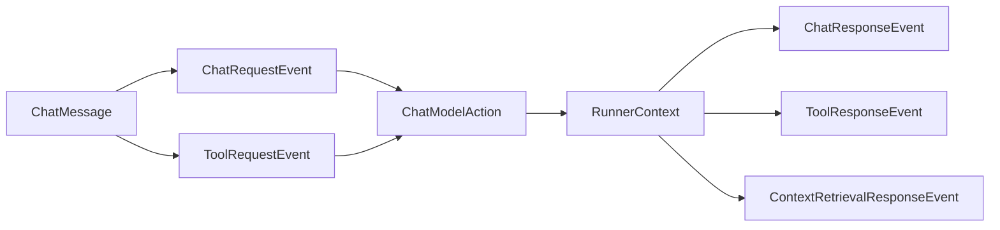

# 输入事件类型

<cite>
**本文引用的文件**
- [ChatRequestEvent.java](file://api/src/main/java/org/apache/flink/agents/api/event/ChatRequestEvent.java)
- [ToolRequestEvent.java](file://api/src/main/java/org/apache/flink/agents/api/event/ToolRequestEvent.java)
- [ContextRetrievalRequestEvent.java](file://api/src/main/java/org/apache/flink/agents/api/event/ContextRetrievalRequestEvent.java)
- [ChatResponseEvent.java](file://api/src/main/java/org/apache/flink/agents/api/event/ChatResponseEvent.java)
- [ToolResponseEvent.java](file://api/src/main/java/org/apache/flink/agents/api/event/ToolResponseEvent.java)
- [ContextRetrievalResponseEvent.java](file://api/src/main/java/org/apache/flink/agents/api/event/ContextRetrievalResponseEvent.java)
- [ChatMessage.java](file://api/src/main/java/org/apache/flink/agents/api/chat/messages/ChatMessage.java)
- [InputEvent.java](file://api/src/main/java/org/apache/flink/agents/api/InputEvent.java)
- [ChatModelAction.java](file://plan/src/main/java/org/apache/flink/agents/plan/actions/ChatModelAction.java)
- [chat_event.py](file://python/flink_agents/api/events/chat_event.py)
- [tool_event.py](file://python/flink_agents/api/events/tool_event.py)
- [context_retrieval_event.py](file://python/flink_agents/api/events/context_retrieval_event.py)
- [ChatModelIntegrationTest.java](file://e2e-test/flink-agents-end-to-end-tests-integration/src/test/java/org/apache/flink/agents/integration/test/ChatModelIntegrationTest.java)
</cite>

## 目录
1. [引言](#引言)
2. [项目结构](#项目结构)
3. [核心组件](#核心组件)
4. [架构总览](#架构总览)
5. [详细组件分析](#详细组件分析)
6. [依赖关系分析](#依赖关系分析)
7. [性能考量](#性能考量)
8. [故障排查指南](#故障排查指南)
9. [结论](#结论)
10. [附录：使用示例与最佳实践](#附录使用示例与最佳实践)

## 引言
本文件围绕输入事件类型进行系统化技术说明，重点覆盖以下三类事件：
- ChatRequestEvent：聊天请求事件，承载模型名、消息列表与可选输出模式（结构化输出）。
- ToolRequestEvent：工具调用请求事件，承载模型名、批量工具调用参数与时间戳。
- ContextRetrievalRequestEvent：上下文检索请求事件，承载查询文本、向量库标识与最大返回条数。

文档将从数据结构、处理逻辑、验证规则、错误处理、与代理执行流程的集成方式等方面展开，并提供跨语言（Java/Python）的使用示例路径与最佳实践建议。

## 项目结构
输入事件位于 Java API 模块的事件包中，同时在 Python API 中提供等价的事件定义；计划模块中的内置动作负责将输入事件转换为后续处理步骤（如工具调用、上下文检索），并在运行时通过 RunnerContext 进行事件发送与状态保存。

图表来源
- [ChatRequestEvent.java](file://api/src/main/java/org/apache/flink/agents/api/event/ChatRequestEvent.java#L28-L57)
- [ToolRequestEvent.java](file://api/src/main/java/org/apache/flink/agents/api/event/ToolRequestEvent.java#L26-L62)
- [ContextRetrievalRequestEvent.java](file://api/src/main/java/org/apache/flink/agents/api/event/ContextRetrievalRequestEvent.java#L23-L69)
- [ChatResponseEvent.java](file://api/src/main/java/org/apache/flink/agents/api/event/ChatResponseEvent.java#L26-L42)
- [ToolResponseEvent.java](file://api/src/main/java/org/apache/flink/agents/api/event/ToolResponseEvent.java#L27-L94)
- [ContextRetrievalResponseEvent.java](file://api/src/main/java/org/apache/flink/agents/api/event/ContextRetrievalResponseEvent.java#L27-L64)
- [ChatMessage.java](file://api/src/main/java/org/apache/flink/agents/api/chat/messages/ChatMessage.java#L29-L157)
- [InputEvent.java](file://api/src/main/java/org/apache/flink/agents/api/InputEvent.java#L27-L48)
- [ChatModelAction.java](file://plan/src/main/java/org/apache/flink/agents/plan/actions/ChatModelAction.java#L51-L200)
- [chat_event.py](file://python/flink_agents/api/events/chat_event.py#L26-L56)
- [tool_event.py](file://python/flink_agents/api/events/tool_event.py#L24-L55)
- [context_retrieval_event.py](file://python/flink_agents/api/events/context_retrieval_event.py#L25-L56)

章节来源
- [ChatRequestEvent.java](file://api/src/main/java/org/apache/flink/agents/api/event/ChatRequestEvent.java#L28-L57)
- [ToolRequestEvent.java](file://api/src/main/java/org/apache/flink/agents/api/event/ToolRequestEvent.java#L26-L62)
- [ContextRetrievalRequestEvent.java](file://api/src/main/java/org/apache/flink/agents/api/event/ContextRetrievalRequestEvent.java#L23-L69)
- [ChatMessage.java](file://api/src/main/java/org/apache/flink/agents/api/chat/messages/ChatMessage.java#L29-L157)
- [InputEvent.java](file://api/src/main/java/org/apache/flink/agents/api/InputEvent.java#L27-L48)
- [ChatModelAction.java](file://plan/src/main/java/org/apache/flink/agents/plan/actions/ChatModelAction.java#L51-L200)
- [chat_event.py](file://python/flink_agents/api/events/chat_event.py#L26-L56)
- [tool_event.py](file://python/flink_agents/api/events/tool_event.py#L24-L55)
- [context_retrieval_event.py](file://python/flink_agents/api/events/context_retrieval_event.py#L25-L56)

## 核心组件
- ChatRequestEvent：封装一次聊天请求的必要字段，支持可选的输出模式（结构化输出），用于触发聊天模型对话与可选的工具调用生成。
- ToolRequestEvent：封装工具调用请求，携带模型名与批量工具调用参数，便于下游工具执行器批量处理。
- ContextRetrievalRequestEvent：封装上下文检索请求，包含查询文本、向量存储标识与最大返回条数，用于检索相关文档片段。

章节来源
- [ChatRequestEvent.java](file://api/src/main/java/org/apache/flink/agents/api/event/ChatRequestEvent.java#L28-L57)
- [ToolRequestEvent.java](file://api/src/main/java/org/apache/flink/agents/api/event/ToolRequestEvent.java#L26-L62)
- [ContextRetrievalRequestEvent.java](file://api/src/main/java/org/apache/flink/agents/api/event/ContextRetrievalRequestEvent.java#L23-L69)

## 架构总览
下图展示了输入事件如何被内置动作处理并驱动后续流程（工具调用、上下文检索、响应生成）：

图表来源
- [ChatModelAction.java](file://plan/src/main/java/org/apache/flink/agents/plan/actions/ChatModelAction.java#L132-L156)
- [ChatRequestEvent.java](file://api/src/main/java/org/apache/flink/agents/api/event/ChatRequestEvent.java#L28-L57)
- [ToolRequestEvent.java](file://api/src/main/java/org/apache/flink/agents/api/event/ToolRequestEvent.java#L26-L62)
- [ToolResponseEvent.java](file://api/src/main/java/org/apache/flink/agents/api/event/ToolResponseEvent.java#L27-L94)
- [ContextRetrievalRequestEvent.java](file://api/src/main/java/org/apache/flink/agents/api/event/ContextRetrievalRequestEvent.java#L23-L69)
- [ContextRetrievalResponseEvent.java](file://api/src/main/java/org/apache/flink/agents/api/event/ContextRetrievalResponseEvent.java#L27-L64)

## 详细组件分析

### ChatRequestEvent：聊天请求处理机制
- 字段与职责
  - model：目标聊天模型资源名，用于在运行时解析具体模型资源。
  - messages：消息列表，元素类型为 ChatMessage，承载角色、内容与工具调用元数据。
  - outputSchema：可选输出模式，支持类或结构化模式，用于将模型输出转为结构化对象。
- 上下文管理
  - 内置动作会将初始请求的消息与后续工具调用产生的消息合并，形成连贯的对话上下文。
  - 工具请求事件的上下文（初始请求ID、模型名、输出模式）会被持久化到感知记忆中，以便工具执行后回填。
- 处理流程
  - 若模型响应包含工具调用，则生成 ToolRequestEvent 并发送；否则直接生成 ChatResponseEvent。
  - 当存在输出模式时，内置动作会尝试将模型输出转换为结构化对象并写入额外参数，供下游使用。
- 数据验证与错误处理
  - model 与 messages 必填且非空；outputSchema 类型需受支持。
  - 不支持的输出模式将抛出异常，避免产生不一致的结构化输出。
- 与代理执行流程的集成
  - 由内置动作统一调度，结合 RunnerContext 发送事件与读取资源。
  - 支持在多轮对话中复用初始请求ID，确保事件关联性与一致性。

图表来源
- [ChatRequestEvent.java](file://api/src/main/java/org/apache/flink/agents/api/event/ChatRequestEvent.java#L28-L57)
- [ChatMessage.java](file://api/src/main/java/org/apache/flink/agents/api/chat/messages/ChatMessage.java#L29-L157)
- [ChatModelAction.java](file://plan/src/main/java/org/apache/flink/agents/plan/actions/ChatModelAction.java#L51-L200)
- [ChatResponseEvent.java](file://api/src/main/java/org/apache/flink/agents/api/event/ChatResponseEvent.java#L26-L42)
- [ToolRequestEvent.java](file://api/src/main/java/org/apache/flink/agents/api/event/ToolRequestEvent.java#L26-L62)

章节来源
- [ChatRequestEvent.java](file://api/src/main/java/org/apache/flink/agents/api/event/ChatRequestEvent.java#L28-L57)
- [ChatMessage.java](file://api/src/main/java/org/apache/flink/agents/api/chat/messages/ChatMessage.java#L29-L157)
- [ChatModelAction.java](file://plan/src/main/java/org/apache/flink/agents/plan/actions/ChatModelAction.java#L51-L200)

### ToolRequestEvent：工具调用请求格式
- 字段与职责
  - model：生成该工具调用的模型资源名。
  - toolCalls：批量工具调用参数，每个元素为键值对映射，键通常包含工具名与参数。
  - timestamp：事件创建时间，便于审计与排序。
- 参数传递与返回值处理
  - 工具调用参数以映射形式传递，便于跨语言与跨资源适配。
  - 工具执行完成后，由运行时生成 ToolResponseEvent，包含成功标志、错误信息与外部ID映射。
- 数据验证与错误处理
  - toolCalls 非空且每个调用项必须包含有效参数；若工具执行失败，错误信息将记录在 ToolResponseEvent 的错误映射中。
- 与代理执行流程的集成
  - 内置动作在检测到模型响应中的工具调用后，自动构造 ToolRequestEvent 并发送；工具结果回传后继续对话。

图表来源
- [ToolRequestEvent.java](file://api/src/main/java/org/apache/flink/agents/api/event/ToolRequestEvent.java#L26-L62)
- [ToolResponseEvent.java](file://api/src/main/java/org/apache/flink/agents/api/event/ToolResponseEvent.java#L27-L94)
- [ChatModelAction.java](file://plan/src/main/java/org/apache/flink/agents/plan/actions/ChatModelAction.java#L132-L156)

章节来源
- [ToolRequestEvent.java](file://api/src/main/java/org/apache/flink/agents/api/event/ToolRequestEvent.java#L26-L62)
- [ToolResponseEvent.java](file://api/src/main/java/org/apache/flink/agents/api/event/ToolResponseEvent.java#L27-L94)
- [ChatModelAction.java](file://plan/src/main/java/org/apache/flink/agents/plan/actions/ChatModelAction.java#L132-L156)

### ContextRetrievalRequestEvent：上下文检索机制
- 字段与职责
  - query：检索查询文本。
  - vectorStore：向量存储资源名，用于定位具体的向量库。
  - maxResults：最大返回结果数量，默认值为固定常量。
- 查询向量、相似度阈值与结果过滤
  - 查询文本经嵌入模型向量化后，与向量库中的向量计算相似度，按相似度排序并截断至 maxResults。
  - 结果过滤可通过向量检索配置（如最小相似度阈值）进一步控制，具体阈值由向量存储实现决定。
- 响应事件
  - ContextRetrievalResponseEvent 返回原始查询与检索到的文档列表，便于后续处理（如拼接到提示词中）。
- 数据验证与错误处理
  - query 与 vectorStore 必填；maxResults 应为正整数。
  - 向量存储不可用或查询失败时，应在运行时捕获异常并返回错误信息。
- 与代理执行流程的集成
  - 由内置动作或自定义流程触发检索请求，随后将结果注入到聊天消息中以增强回答质量。

图表来源
- [ContextRetrievalRequestEvent.java](file://api/src/main/java/org/apache/flink/agents/api/event/ContextRetrievalRequestEvent.java#L23-L69)
- [ContextRetrievalResponseEvent.java](file://api/src/main/java/org/apache/flink/agents/api/event/ContextRetrievalResponseEvent.java#L27-L64)

章节来源
- [ContextRetrievalRequestEvent.java](file://api/src/main/java/org/apache/flink/agents/api/event/ContextRetrievalRequestEvent.java#L23-L69)
- [ContextRetrievalResponseEvent.java](file://api/src/main/java/org/apache/flink/agents/api/event/ContextRetrievalResponseEvent.java#L27-L64)

## 依赖关系分析
- 事件与消息
  - ChatRequestEvent 与 ToolRequestEvent 均依赖 ChatMessage 表达消息角色与内容；ToolRequestEvent 可能来源于 ChatMessage 的工具调用字段。
- 事件与内置动作
  - ChatModelAction 统一处理 ChatRequestEvent 与 ToolResponseEvent，负责上下文维护、工具调用生成与结构化输出转换。
- 事件与运行时
  - RunnerContext 提供资源解析、事件发送与内存存取能力，贯穿事件生命周期。
- 跨语言一致性
  - Python 侧事件定义与 Java 侧字段语义保持一致，便于跨语言协作与序列化传输。

图表来源
- [ChatMessage.java](file://api/src/main/java/org/apache/flink/agents/api/chat/messages/ChatMessage.java#L29-L157)
- [ChatRequestEvent.java](file://api/src/main/java/org/apache/flink/agents/api/event/ChatRequestEvent.java#L28-L57)
- [ToolRequestEvent.java](file://api/src/main/java/org/apache/flink/agents/api/event/ToolRequestEvent.java#L26-L62)
- [ChatModelAction.java](file://plan/src/main/java/org/apache/flink/agents/plan/actions/ChatModelAction.java#L51-L200)
- [ChatResponseEvent.java](file://api/src/main/java/org/apache/flink/agents/api/event/ChatResponseEvent.java#L26-L42)
- [ToolResponseEvent.java](file://api/src/main/java/org/apache/flink/agents/api/event/ToolResponseEvent.java#L27-L94)
- [ContextRetrievalResponseEvent.java](file://api/src/main/java/org/apache/flink/agents/api/event/ContextRetrievalResponseEvent.java#L27-L64)

章节来源
- [ChatMessage.java](file://api/src/main/java/org/apache/flink/agents/api/chat/messages/ChatMessage.java#L29-L157)
- [ChatRequestEvent.java](file://api/src/main/java/org/apache/flink/agents/api/event/ChatRequestEvent.java#L28-L57)
- [ToolRequestEvent.java](file://api/src/main/java/org/apache/flink/agents/api/event/ToolRequestEvent.java#L26-L62)
- [ChatModelAction.java](file://plan/src/main/java/org/apache/flink/agents/plan/actions/ChatModelAction.java#L51-L200)

## 性能考量
- 工具调用批处理：ToolRequestEvent 支持批量工具调用，减少事件往返次数，提升吞吐。
- 上下文压缩：通过仅保留必要的消息与工具调用上下文，避免上下文过长导致的延迟与成本上升。
- 向量检索优化：合理设置 maxResults 与相似度阈值，平衡召回率与性能；对高频查询可引入缓存。
- 输出模式转换：结构化输出转换发生在内存中，建议对大型输出进行分片或异步处理。

## 故障排查指南
- ChatRequestEvent
  - 现象：输出模式转换失败或结构化对象为空。
  - 排查：确认 outputSchema 类型是否受支持；检查模型输出 JSON 是否符合预期。
- ToolRequestEvent
  - 现象：工具调用超时或返回错误。
  - 排查：核对 toolCalls 参数完整性；检查工具执行器日志；关注 ToolResponseEvent 中的错误映射。
- ContextRetrievalRequestEvent
  - 现象：检索结果为空或性能异常。
  - 排查：确认 vectorStore 资源可用；调整 maxResults 与相似度阈值；检查嵌入模型与向量库配置。

章节来源
- [ChatModelAction.java](file://plan/src/main/java/org/apache/flink/agents/plan/actions/ChatModelAction.java#L158-L179)
- [ToolResponseEvent.java](file://api/src/main/java/org/apache/flink/agents/api/event/ToolResponseEvent.java#L27-L94)
- [ContextRetrievalRequestEvent.java](file://api/src/main/java/org/apache/flink/agents/api/event/ContextRetrievalRequestEvent.java#L23-L69)

## 结论
输入事件类型为代理执行提供了清晰、可扩展的交互接口。通过 ChatRequestEvent、ToolRequestEvent 与 ContextRetrievalRequestEvent，系统实现了从对话、工具调用到上下文检索的完整闭环。内置动作与运行时上下文共同保障了事件的正确流转与状态管理。建议在生产环境中严格遵循数据验证规则、合理配置输出模式与检索阈值，并结合批处理与缓存策略优化整体性能。

## 附录：使用示例与最佳实践

### 使用示例（Java）
- 创建 ChatRequestEvent
  - 参考路径：[ChatRequestEvent.java](file://api/src/main/java/org/apache/flink/agents/api/event/ChatRequestEvent.java#L34-L43)
- 创建 ToolRequestEvent
  - 参考路径：[ToolRequestEvent.java](file://api/src/main/java/org/apache/flink/agents/api/event/ToolRequestEvent.java#L32-L36)
- 创建 ContextRetrievalRequestEvent
  - 参考路径：[ContextRetrievalRequestEvent.java](file://api/src/main/java/org/apache/flink/agents/api/event/ContextRetrievalRequestEvent.java#L32-L42)
- 在代理中使用输入事件
  - 参考路径：[ChatModelIntegrationTest.java](file://e2e-test/flink-agents-end-to-end-tests-integration/src/test/java/org/apache/flink/agents/integration/test/ChatModelIntegrationTest.java#L88-L93)

### 使用示例（Python）
- 定义 ChatRequestEvent
  - 参考路径：[chat_event.py](file://python/flink_agents/api/events/chat_event.py#L26-L41)
- 定义 ToolRequestEvent
  - 参考路径：[tool_event.py](file://python/flink_agents/api/events/tool_event.py#L24-L36)
- 定义 ContextRetrievalRequestEvent
  - 参考路径：[context_retrieval_event.py](file://python/flink_agents/api/events/context_retrieval_event.py#L25-L39)

### 最佳实践
- 明确区分输入事件与内部事件：输入事件来自外部或上游，内部事件由框架或动作生成。
- 保持事件字段简洁与稳定：避免频繁变更字段名与类型，确保序列化兼容性。
- 使用 RunnerContext 进行资源解析与事件发送，避免硬编码。
- 对工具调用进行幂等设计与重试策略，结合 ToolResponseEvent 的成功/错误映射进行可观测性监控。
- 对上下文检索设置合理的 maxResults 与阈值，避免过度检索带来的性能问题。
- 在多轮对话中复用初始请求ID，确保事件链路可追踪。