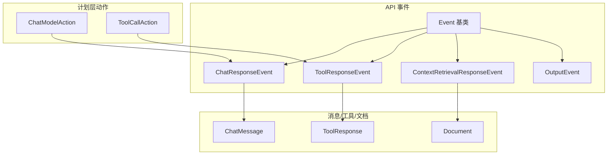
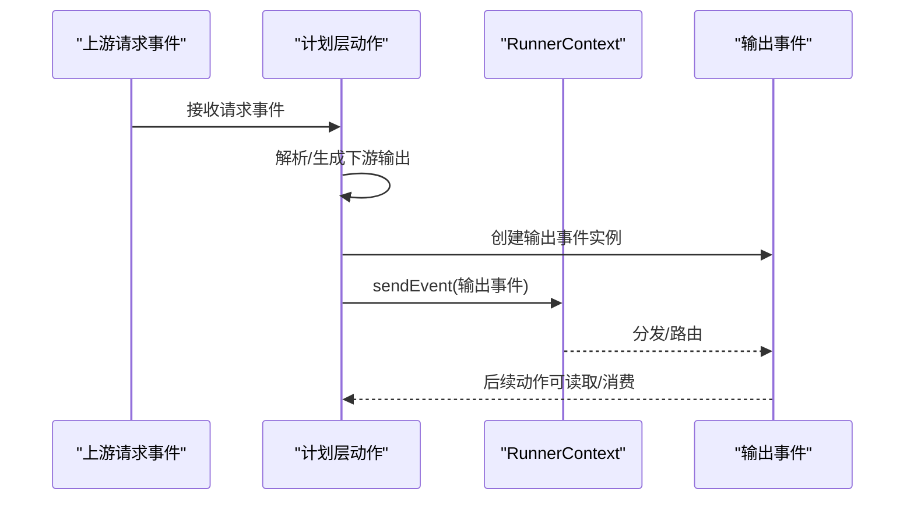
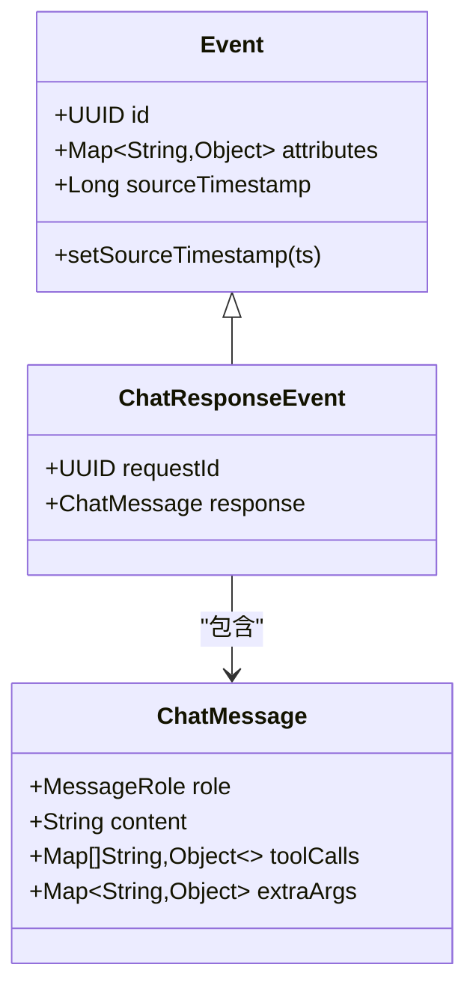
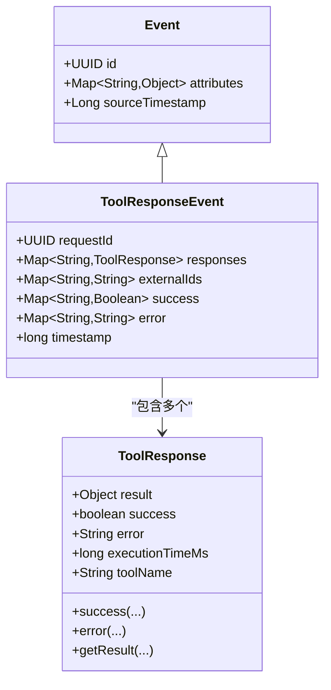
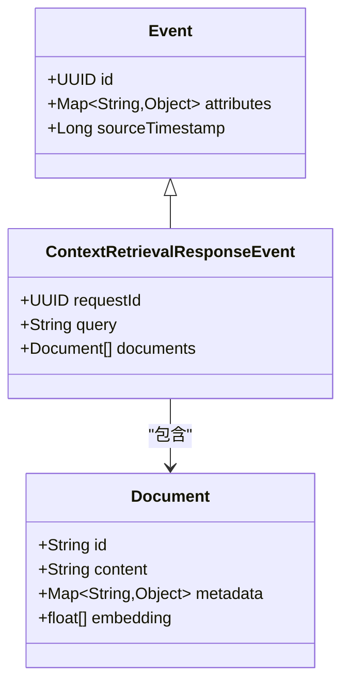
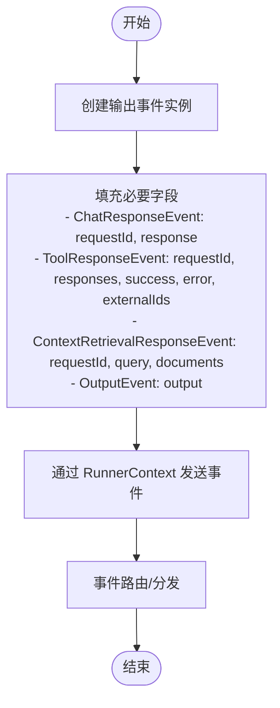
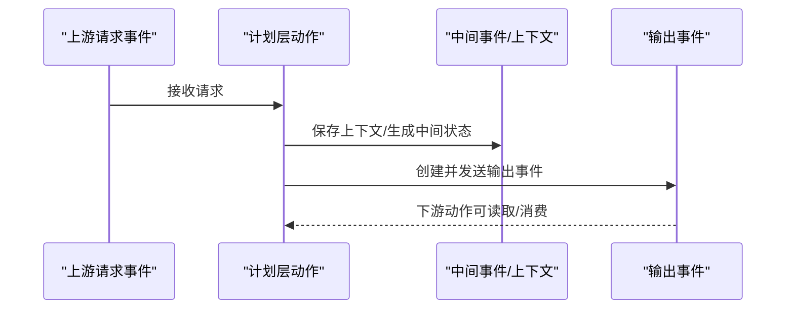
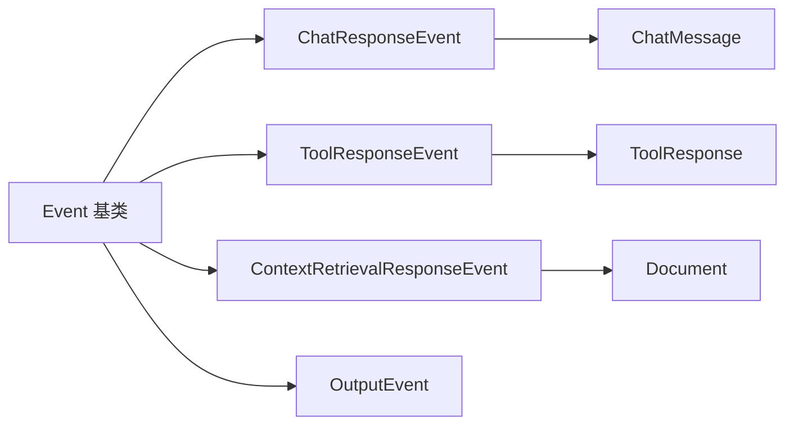

# 输出事件类型

<cite>
**本文引用的文件列表**
- [ChatResponseEvent.java](file://api/src/main/java/org/apache/flink/agents/api/event/ChatResponseEvent.java)
- [ToolResponseEvent.java](file://api/src/main/java/org/apache/flink/agents/api/event/ToolResponseEvent.java)
- [ContextRetrievalResponseEvent.java](file://api/src/main/java/org/apache/flink/agents/api/event/ContextRetrievalResponseEvent.java)
- [OutputEvent.java](file://api/src/main/java/org/apache/flink/agents/api/OutputEvent.java)
- [Event.java](file://api/src/main/java/org/apache/flink/agents/api/Event.java)
- [ChatMessage.java](file://api/src/main/java/org/apache/flink/agents/api/chat/messages/ChatMessage.java)
- [ToolResponse.java](file://api/src/main/java/org/apache/flink/agents/api/tools/ToolResponse.java)
- [Document.java](file://api/src/main/java/org/apache/flink/agents/api/vectorstores/Document.java)
- [ChatModelAction.java](file://plan/src/main/java/org/apache/flink/agents/plan/actions/ChatModelAction.java)
- [ToolCallAction.java](file://plan/src/main/java/org/apache/flink/agents/plan/actions/ToolCallAction.java)
- [ToolRequestEvent.java](file://api/src/main/java/org/apache/flink/agents/api/event/ToolRequestEvent.java)
- [ContextRetrievalRequestEvent.java](file://api/src/main/java/org/apache/flink/agents/api/event/ContextRetrievalRequestEvent.java)
- [EventLogRecord.java](file://runtime/src/main/java/org/apache/flink/agents/runtime/eventlog/EventLogRecord.java)
- [MemorySegmentPool.java](file://runtime/src/main/java/org/apache/flink/agents/runtime/memory/MemorySegmentPool.java)
- [VectorStoreLongTermMemory.java](file://runtime/src/main/java/org/apache/flink/agents/runtime/memory/VectorStoreLongTermMemory.java)
</cite>

## 目录
1. [简介](#简介)
2. [项目结构](#项目结构)
3. [核心组件](#核心组件)
4. [架构总览](#架构总览)
5. [详细组件分析](#详细组件分析)
6. [依赖关系分析](#依赖关系分析)
7. [性能考量与内存管理](#性能考量与内存管理)
8. [故障排查指南](#故障排查指南)
9. [结论](#结论)

## 简介
本文件聚焦于输出事件类型，系统性梳理三类关键输出事件：
- ChatResponseEvent：封装聊天模型的回复内容与消息格式，支持工具调用提示与流式输出的后续处理。
- ToolResponseEvent：封装工具执行结果，统一表达成功/失败、错误信息与外部ID映射，并记录时间戳。
- ContextRetrievalResponseEvent：封装上下文检索结果，携带查询语句与匹配文档集合（含元数据）。

同时，文档阐述事件的创建、填充与传播流程，解释与上游输入事件的关联机制与响应模式，并给出性能优化与内存管理策略建议。

## 项目结构
输出事件位于 API 模块的事件包中，作为事件体系的子类，继承通用事件基类；其依赖的消息、工具响应与文档等实体分别位于各自领域包内。在计划层（plan）中，动作（Action）负责将上游请求事件转换为下游输出事件，并通过 RunnerContext 发送。

图表来源
- [Event.java](file://api/src/main/java/org/apache/flink/agents/api/Event.java#L29-L90)
- [ChatResponseEvent.java](file://api/src/main/java/org/apache/flink/agents/api/event/ChatResponseEvent.java#L26-L42)
- [ToolResponseEvent.java](file://api/src/main/java/org/apache/flink/agents/api/event/ToolResponseEvent.java#L28-L94)
- [ContextRetrievalResponseEvent.java](file://api/src/main/java/org/apache/flink/agents/api/event/ContextRetrievalResponseEvent.java#L28-L64)
- [ChatMessage.java](file://api/src/main/java/org/apache/flink/agents/api/chat/messages/ChatMessage.java#L33-L157)
- [ToolResponse.java](file://api/src/main/java/org/apache/flink/agents/api/tools/ToolResponse.java#L27-L183)
- [Document.java](file://api/src/main/java/org/apache/flink/agents/api/vectorstores/Document.java#L34-L110)
- [ChatModelAction.java](file://plan/src/main/java/org/apache/flink/agents/plan/actions/ChatModelAction.java#L132-L156)
- [ToolCallAction.java](file://plan/src/main/java/org/apache/flink/agents/plan/actions/ToolCallAction.java#L61-L89)

章节来源
- [Event.java](file://api/src/main/java/org/apache/flink/agents/api/Event.java#L29-L90)
- [ChatResponseEvent.java](file://api/src/main/java/org/apache/flink/agents/api/event/ChatResponseEvent.java#L26-L42)
- [ToolResponseEvent.java](file://api/src/main/java/org/apache/flink/agents/api/event/ToolResponseEvent.java#L28-L94)
- [ContextRetrievalResponseEvent.java](file://api/src/main/java/org/apache/flink/agents/api/event/ContextRetrievalResponseEvent.java#L28-L64)

## 核心组件
- ChatResponseEvent：携带请求ID与 ChatMessage 回复，用于表达一次聊天模型的响应。
- ToolResponseEvent：携带请求ID、工具响应映射、成功标志、错误信息与外部ID映射，以及时间戳。
- ContextRetrievalResponseEvent：携带请求ID、查询语句与文档列表。
- OutputEvent：通用输出事件载体，承载任意对象输出。
- 事件基类 Event：提供事件ID、属性与源时间戳能力。

章节来源
- [ChatResponseEvent.java](file://api/src/main/java/org/apache/flink/agents/api/event/ChatResponseEvent.java#L26-L42)
- [ToolResponseEvent.java](file://api/src/main/java/org/apache/flink/agents/api/event/ToolResponseEvent.java#L28-L94)
- [ContextRetrievalResponseEvent.java](file://api/src/main/java/org/apache/flink/agents/api/event/ContextRetrievalResponseEvent.java#L28-L64)
- [OutputEvent.java](file://api/src/main/java/org/apache/flink/agents/api/OutputEvent.java#L31-L51)
- [Event.java](file://api/src/main/java/org/apache/flink/agents/api/Event.java#L30-L90)

## 架构总览
输出事件的产生与传播遵循“动作处理上游请求事件 -> 创建并填充输出事件 -> 通过 RunnerContext 发送”的模式。以下序列图展示典型链路。

图表来源
- [ChatModelAction.java](file://plan/src/main/java/org/apache/flink/agents/plan/actions/ChatModelAction.java#L132-L156)
- [ToolCallAction.java](file://plan/src/main/java/org/apache/flink/agents/plan/actions/ToolCallAction.java#L61-L89)
- [Event.java](file://api/src/main/java/org/apache/flink/agents/api/Event.java#L30-L90)

## 详细组件分析

### ChatResponseEvent：聊天响应处理
- 结构要点
  - 请求ID：用于与上游聊天请求事件关联。
  - 回复消息：ChatMessage 类型，承载角色、文本内容、工具调用与额外参数。
- 关联与传播
  - 在聊天动作中，当模型返回包含工具调用的回复时，会保存工具调用上下文并发送工具请求事件；随后收到工具执行结果后，再继续推进对话或发出最终 ChatResponseEvent。
- 消息格式与工具调用
  - ChatMessage 支持多种角色与工具调用字段，便于在响应中指示下一步工具调用意图。
- 流式输出支持
  - 虽 ChatResponseEvent 本身不直接表示流式片段，但其与工具调用的配合可用于构建“先工具调用，再汇总最终回复”的流式体验。

图表来源
- [ChatResponseEvent.java](file://api/src/main/java/org/apache/flink/agents/api/event/ChatResponseEvent.java#L26-L42)
- [ChatMessage.java](file://api/src/main/java/org/apache/flink/agents/api/chat/messages/ChatMessage.java#L33-L157)
- [Event.java](file://api/src/main/java/org/apache/flink/agents/api/Event.java#L30-L90)

章节来源
- [ChatResponseEvent.java](file://api/src/main/java/org/apache/flink/agents/api/event/ChatResponseEvent.java#L26-L42)
- [ChatMessage.java](file://api/src/main/java/org/apache/flink/agents/api/chat/messages/ChatMessage.java#L33-L157)
- [ChatModelAction.java](file://plan/src/main/java/org/apache/flink/agents/plan/actions/ChatModelAction.java#L132-L156)

### ToolResponseEvent：工具执行结果封装
- 结构要点
  - 请求ID：与上游工具请求事件关联。
  - 工具响应映射：键为工具调用ID，值为 ToolResponse。
  - 成功标志映射：键为工具调用ID，值为布尔成功状态。
  - 错误信息映射：键为工具调用ID，值为错误字符串。
  - 外部ID映射：键为工具调用ID，值为原始外部ID（可选）。
  - 时间戳：事件创建时间。
- 成功/错误状态与异常处理
  - ToolResponse 提供 success()/error(...) 多种工厂方法，支持带执行耗时与工具名的构造，便于统一记录与统计。
  - 异常可直接转为错误响应，自动提取消息或类名。
- 元数据与传播
  - ToolResponseEvent 可携带外部ID映射，便于跨系统追踪工具调用来源。

图表来源
- [ToolResponseEvent.java](file://api/src/main/java/org/apache/flink/agents/api/event/ToolResponseEvent.java#L28-L94)
- [ToolResponse.java](file://api/src/main/java/org/apache/flink/agents/api/tools/ToolResponse.java#L27-L183)
- [Event.java](file://api/src/main/java/org/apache/flink/agents/api/Event.java#L30-L90)

章节来源
- [ToolResponseEvent.java](file://api/src/main/java/org/apache/flink/agents/api/event/ToolResponseEvent.java#L28-L94)
- [ToolResponse.java](file://api/src/main/java/org/apache/flink/agents/api/tools/ToolResponse.java#L27-L183)
- [ToolCallAction.java](file://plan/src/main/java/org/apache/flink/agents/plan/actions/ToolCallAction.java#L61-L89)

### ContextRetrievalResponseEvent：检索结果包装
- 结构要点
  - 请求ID：与上游检索请求事件关联。
  - 查询语句：原始查询文本。
  - 文档列表：Document 列表，包含内容、元数据与可选向量嵌入。
- 匹配文档与元数据
  - Document 支持 id、content、metadata 与 embedding 字段，便于后续排序、过滤与可视化。
- 与上游请求的关联
  - ContextRetrievalRequestEvent 定义了查询、向量库与最大结果数等字段，用于驱动检索动作。

图表来源
- [ContextRetrievalResponseEvent.java](file://api/src/main/java/org/apache/flink/agents/api/event/ContextRetrievalResponseEvent.java#L28-L64)
- [Document.java](file://api/src/main/java/org/apache/flink/agents/api/vectorstores/Document.java#L34-L110)
- [Event.java](file://api/src/main/java/org/apache/flink/agents/api/Event.java#L30-L90)

章节来源
- [ContextRetrievalResponseEvent.java](file://api/src/main/java/org/apache/flink/agents/api/event/ContextRetrievalResponseEvent.java#L28-L64)
- [Document.java](file://api/src/main/java/org/apache/flink/agents/api/vectorstores/Document.java#L34-L110)
- [ContextRetrievalRequestEvent.java](file://api/src/main/java/org/apache/flink/agents/api/event/ContextRetrievalRequestEvent.java#L24-L36)

### 输出事件的创建、填充与传播
- 创建与填充
  - ChatResponseEvent：以请求ID与 ChatMessage 构造。
  - ToolResponseEvent：以请求ID、响应映射、成功/错误映射与外部ID映射构造，内部设置时间戳。
  - ContextRetrievalResponseEvent：以请求ID、查询与文档列表构造。
  - OutputEvent：以任意输出对象构造，用于通用输出场景。
- 传播
  - 动作通过 RunnerContext.sendEvent 将输出事件分发到下游监听器或后续动作。
  - 事件日志记录 EventLogRecord 封装事件上下文与事件体，便于结构化存储与回放。

图表来源
- [ChatResponseEvent.java](file://api/src/main/java/org/apache/flink/agents/api/event/ChatResponseEvent.java#L30-L41)
- [ToolResponseEvent.java](file://api/src/main/java/org/apache/flink/agents/api/event/ToolResponseEvent.java#L36-L56)
- [ContextRetrievalResponseEvent.java](file://api/src/main/java/org/apache/flink/agents/api/event/ContextRetrievalResponseEvent.java#L34-L38)
- [OutputEvent.java](file://api/src/main/java/org/apache/flink/agents/api/OutputEvent.java#L34-L46)
- [EventLogRecord.java](file://runtime/src/main/java/org/apache/flink/agents/runtime/eventlog/EventLogRecord.java#L35-L53)

章节来源
- [ChatResponseEvent.java](file://api/src/main/java/org/apache/flink/agents/api/event/ChatResponseEvent.java#L30-L41)
- [ToolResponseEvent.java](file://api/src/main/java/org/apache/flink/agents/api/event/ToolResponseEvent.java#L36-L56)
- [ContextRetrievalResponseEvent.java](file://api/src/main/java/org/apache/flink/agents/api/event/ContextRetrievalResponseEvent.java#L34-L38)
- [OutputEvent.java](file://api/src/main/java/org/apache/flink/agents/api/OutputEvent.java#L34-L46)
- [EventLogRecord.java](file://runtime/src/main/java/org/apache/flink/agents/runtime/eventlog/EventLogRecord.java#L35-L53)

### 与上游输入事件的关联机制与响应模式
- 关联机制
  - 所有输出事件均携带 requestId，用于与上游请求事件建立一一对应关系。
  - 计划层动作在处理上游请求时，会保存必要的上下文（如工具调用上下文），并在后续输出事件中恢复或传递。
- 响应模式
  - 聊天：模型可能先返回工具调用提示，动作据此发送工具请求事件；工具完成后，动作组合结果并发送 ChatResponseEvent。
  - 工具：动作收集各工具执行结果，封装为 ToolResponseEvent 并发送。
  - 检索：动作根据查询与向量库检索，封装为 ContextRetrievalResponseEvent 并发送。

图表来源
- [ChatModelAction.java](file://plan/src/main/java/org/apache/flink/agents/plan/actions/ChatModelAction.java#L132-L156)
- [ToolCallAction.java](file://plan/src/main/java/org/apache/flink/agents/plan/actions/ToolCallAction.java#L61-L89)
- [ToolRequestEvent.java](file://api/src/main/java/org/apache/flink/agents/api/event/ToolRequestEvent.java#L24-L62)

章节来源
- [ChatModelAction.java](file://plan/src/main/java/org/apache/flink/agents/plan/actions/ChatModelAction.java#L132-L156)
- [ToolCallAction.java](file://plan/src/main/java/org/apache/flink/agents/plan/actions/ToolCallAction.java#L61-L89)
- [ToolRequestEvent.java](file://api/src/main/java/org/apache/flink/agents/api/event/ToolRequestEvent.java#L24-L62)

## 依赖关系分析
- 继承关系
  - ChatResponseEvent、ToolResponseEvent、ContextRetrievalResponseEvent、OutputEvent 均继承自 Event。
- 内聚与耦合
  - 输出事件与消息/工具/文档实体之间为弱耦合的数据承载关系，通过字段持有而非强绑定。
  - 计划层动作与事件之间存在运行时耦合，通过 RunnerContext 进行解耦分发。
- 外部依赖
  - 事件序列化/反序列化由 Jackson 注解支持，事件日志记录器负责结构化存储。

图表来源
- [Event.java](file://api/src/main/java/org/apache/flink/agents/api/Event.java#L30-L90)
- [ChatResponseEvent.java](file://api/src/main/java/org/apache/flink/agents/api/event/ChatResponseEvent.java#L26-L42)
- [ToolResponseEvent.java](file://api/src/main/java/org/apache/flink/agents/api/event/ToolResponseEvent.java#L28-L94)
- [ContextRetrievalResponseEvent.java](file://api/src/main/java/org/apache/flink/agents/api/event/ContextRetrievalResponseEvent.java#L28-L64)
- [ChatMessage.java](file://api/src/main/java/org/apache/flink/agents/api/chat/messages/ChatMessage.java#L33-L157)
- [ToolResponse.java](file://api/src/main/java/org/apache/flink/agents/api/tools/ToolResponse.java#L27-L183)
- [Document.java](file://api/src/main/java/org/apache/flink/agents/api/vectorstores/Document.java#L34-L110)

章节来源
- [Event.java](file://api/src/main/java/org/apache/flink/agents/api/Event.java#L30-L90)
- [ChatResponseEvent.java](file://api/src/main/java/org/apache/flink/agents/api/event/ChatResponseEvent.java#L26-L42)
- [ToolResponseEvent.java](file://api/src/main/java/org/apache/flink/agents/api/event/ToolResponseEvent.java#L28-L94)
- [ContextRetrievalResponseEvent.java](file://api/src/main/java/org/apache/flink/agents/api/event/ContextRetrievalResponseEvent.java#L28-L64)

## 性能考量与内存管理
- 事件序列化与日志
  - 事件采用注解驱动的 JSON 序列化，事件日志记录器对事件进行结构化封装，便于高效存储与回放。
- 内存池与缓冲区
  - 内存段池 MemorySegmentPool 提供可回收的内存段，按需分配与释放，避免频繁 GC。
- 长期记忆与异步压缩
  - 向量库存储长期记忆时支持异步压缩，降低写放大与读放大，提升吞吐。
- 建议
  - 控制事件大小：避免在 ChatMessage 或 ToolResponse 中携带超大对象，必要时使用引用或外部存储。
  - 批量化处理：对批量工具调用的结果进行聚合，减少事件数量。
  - 合理设置容量：根据业务峰值调整内存池与向量库集合容量，避免频繁扩容。

章节来源
- [EventLogRecord.java](file://runtime/src/main/java/org/apache/flink/agents/runtime/eventlog/EventLogRecord.java#L35-L53)
- [MemorySegmentPool.java](file://runtime/src/main/java/org/apache/flink/agents/runtime/memory/MemorySegmentPool.java#L39-L78)
- [VectorStoreLongTermMemory.java](file://runtime/src/main/java/org/apache/flink/agents/runtime/memory/VectorStoreLongTermMemory.java#L188-L200)

## 故障排查指南
- 工具执行失败
  - 检查 ToolResponseEvent 的 success/error 映射，定位具体失败的工具调用ID与错误信息。
  - 使用 ToolResponse.error(Throwable) 获取异常摘要，辅助快速定位问题。
- 检索结果为空
  - 核对 ContextRetrievalRequestEvent 的查询与向量库配置，确认最大结果数与检索模式。
  - 检查 Document 的 metadata 是否包含预期字段，确保后续处理逻辑可用。
- 事件丢失或错配
  - 核对 requestId 是否一致，确保动作正确保存与恢复上下文。
  - 检查 RunnerContext 的事件分发是否正常，关注事件日志记录状态。

章节来源
- [ToolResponseEvent.java](file://api/src/main/java/org/apache/flink/agents/api/event/ToolResponseEvent.java#L70-L76)
- [ToolResponse.java](file://api/src/main/java/org/apache/flink/agents/api/tools/ToolResponse.java#L85-L101)
- [ContextRetrievalRequestEvent.java](file://api/src/main/java/org/apache/flink/agents/api/event/ContextRetrievalRequestEvent.java#L24-L36)
- [EventLogRecord.java](file://runtime/src/main/java/org/apache/flink/agents/runtime/eventlog/EventLogRecord.java#L35-L53)

## 结论
输出事件类型围绕 ChatResponseEvent、ToolResponseEvent 与 ContextRetrievalResponseEvent 构建，形成从聊天、工具到检索的闭环输出体系。通过 requestId 实现与上游请求的强关联，借助计划层动作完成创建、填充与传播。结合事件日志、内存池与异步压缩等机制，可在保证可观测性的同时提升整体性能与稳定性。