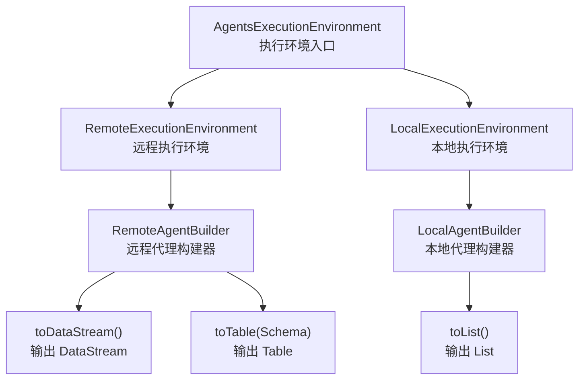
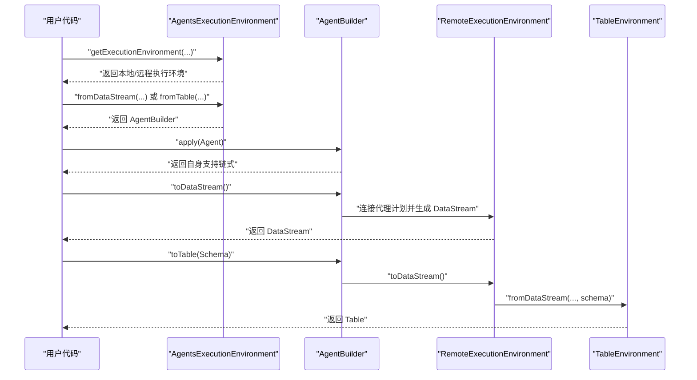
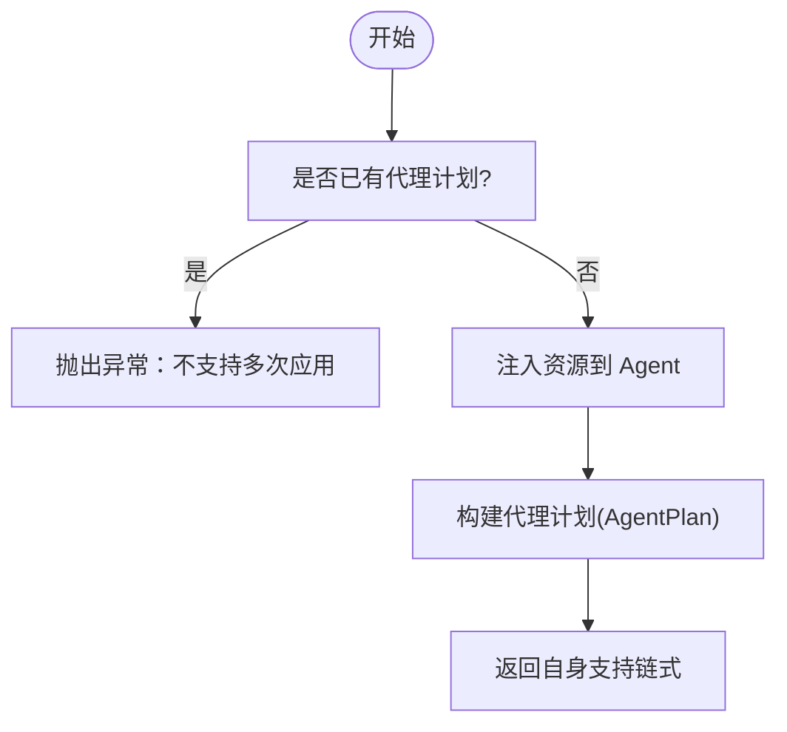
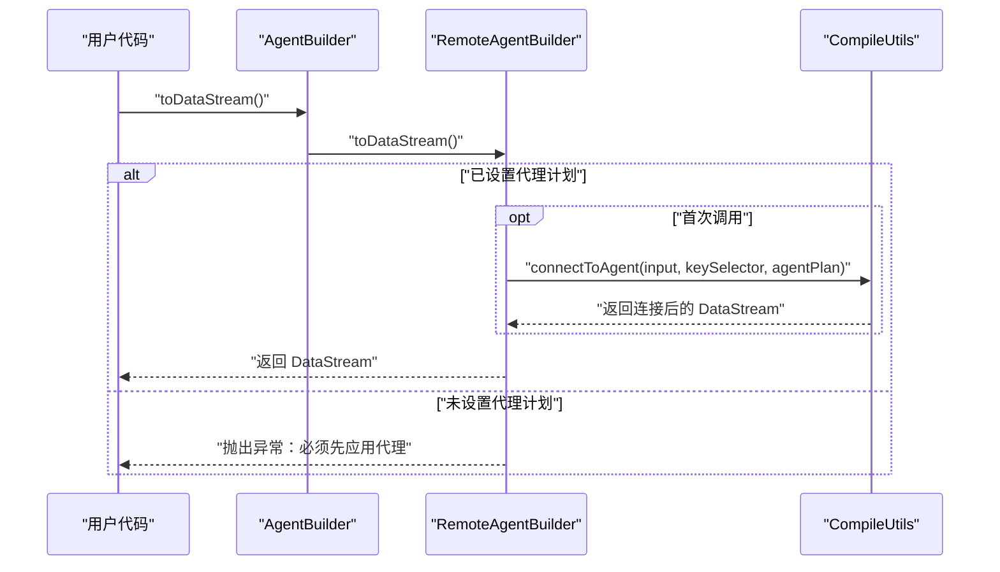
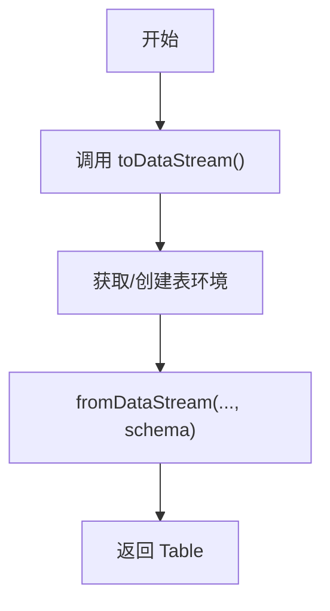
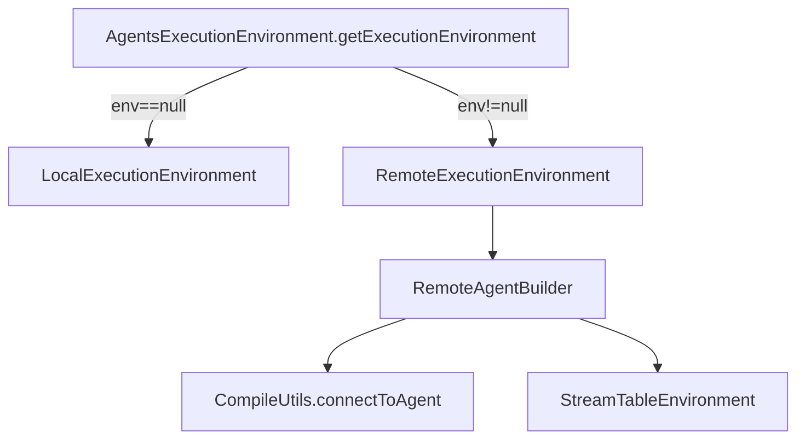

# 代理构建器（AgentBuilder）

<cite>
**本文引用的文件**
- [AgentBuilder.java](file://api/src/main/java/org/apache/flink/agents/api/AgentBuilder.java)
- [AgentsExecutionEnvironment.java](file://api/src/main/java/org/apache/flink/agents/api/AgentsExecutionEnvironment.java)
- [RemoteExecutionEnvironment.java](file://runtime/src/main/java/org/apache/flink/agents/runtime/env/RemoteExecutionEnvironment.java)
- [FlinkIntegrationTest.java](file://e2e-test/flink-agents-end-to-end-tests-integration/src/test/java/org/apache/flink/agents/integration/test/FlinkIntegrationTest.java)
- [ReActAgentTest.java](file://e2e-test/flink-agents-end-to-end-tests-integration/src/test/java/org/apache/flink/agents/integration/test/ReActAgentTest.java)
- [flink_intergration_test.py](file://python/flink_agents/e2e_tests/e2e_tests_integration/flink_intergration_test.py)
- [RemoteExecutionEnvironment.java（Python）](file://python/flink_agents/runtime/remote_execution_environment.py)
- [LocalExecutionEnvironment.java（Python）](file://python/flink_agents/runtime/local_execution_environment.py)
</cite>

## 目录
1. [简介](#简介)
2. [项目结构](#项目结构)
3. [核心组件](#核心组件)
4. [架构总览](#架构总览)
5. [详细组件分析](#详细组件分析)
6. [依赖关系分析](#依赖关系分析)
7. [性能考虑](#性能考虑)
8. [故障排查指南](#故障排查指南)
9. [结论](#结论)
10. [附录](#附录)

## 简介
本文件为 Flink Agents 中的 AgentBuilder 接口提供系统化、分层次的 API 文档。重点阐述以下内容：
- 流畅式 API 的设计思想与实现方式
- apply() 方法用于设置自定义代理的使用方法
- 三种输出转换方法：
  - toList()：将代理输出转换为本地列表格式（适用于本地执行）
  - toDataStream()：将输出转换为 Flink DataStream，便于在 Flink 流水线中继续处理
  - toTable()：使用指定 Schema 将输出转换为 Flink Table
- 完整的使用示例路径（以“章节来源”中的文件路径为准）
- 方法链式调用的实现原理与最佳实践
- 错误处理策略与性能优化建议

## 项目结构
围绕 AgentBuilder 的关键模块与职责如下：
- API 层接口与入口
  - AgentBuilder：定义流畅式 API 的三类输出方法与代理应用方法
  - AgentsExecutionEnvironment：根据是否传入 Flink 环境选择本地或远程执行环境，并提供 fromXxx 入口
- 运行时实现
  - RemoteExecutionEnvironment：远程执行环境，提供 DataStream/Table 输入与 toDataStream/toTable 输出
  - LocalExecutionEnvironment（Python 端）：本地执行环境，提供 fromList 与 toList 输出
- 测试与示例
  - Java 端与 Python 端的端到端测试，展示 toDataStream/toTable 的典型用法

图表来源
- [AgentsExecutionEnvironment.java](file://api/src/main/java/org/apache/flink/agents/api/AgentsExecutionEnvironment.java#L68-L97)
- [RemoteExecutionEnvironment.java](file://runtime/src/main/java/org/apache/flink/agents/runtime/env/RemoteExecutionEnvironment.java#L84-L93)
- [RemoteExecutionEnvironment.java](file://runtime/src/main/java/org/apache/flink/agents/runtime/env/RemoteExecutionEnvironment.java#L119-L216)
- [LocalExecutionEnvironment.java（Python）](file://python/flink_agents/runtime/local_execution_environment.py#L92-L157)

章节来源
- [AgentsExecutionEnvironment.java](file://api/src/main/java/org/apache/flink/agents/api/AgentsExecutionEnvironment.java#L68-L97)
- [RemoteExecutionEnvironment.java](file://runtime/src/main/java/org/apache/flink/agents/runtime/env/RemoteExecutionEnvironment.java#L84-L93)
- [LocalExecutionEnvironment.java（Python）](file://python/flink_agents/runtime/local_execution_environment.py#L92-L157)

## 核心组件
- AgentBuilder 接口
  - 提供 apply(Agent)、toList()、toDataStream()、toTable(Schema) 四个方法，构成流畅式 API 的核心
- AgentsExecutionEnvironment
  - 工厂方法 getExecutionEnvironment(...) 基于是否传入 Flink 环境决定本地或远程执行环境
  - 提供 fromList/fromDataStream/fromTable 三大输入入口，返回对应的 AgentBuilder 实现
- RemoteExecutionEnvironment
  - 远程执行环境，支持 DataStream/Table 输入，输出 toDataStream/toTable；不支持 toList
- LocalExecutionEnvironment（Python）
  - 本地执行环境，支持 fromList，输出 toList；不支持 toDataStream/toTable

章节来源
- [AgentBuilder.java](file://api/src/main/java/org/apache/flink/agents/api/AgentBuilder.java#L35-L76)
- [AgentsExecutionEnvironment.java](file://api/src/main/java/org/apache/flink/agents/api/AgentsExecutionEnvironment.java#L130-L189)
- [RemoteExecutionEnvironment.java](file://runtime/src/main/java/org/apache/flink/agents/runtime/env/RemoteExecutionEnvironment.java#L78-L93)
- [LocalExecutionEnvironment.java（Python）](file://python/flink_agents/runtime/local_execution_environment.py#L107-L157)

## 架构总览
AgentBuilder 的调用链从执行环境入口开始，经过输入类型选择，最终落到具体输出方法。远程执行环境强调流式处理能力，本地执行环境强调简单易用。

图表来源
- [AgentsExecutionEnvironment.java](file://api/src/main/java/org/apache/flink/agents/api/AgentsExecutionEnvironment.java#L68-L97)
- [RemoteExecutionEnvironment.java](file://runtime/src/main/java/org/apache/flink/agents/runtime/env/RemoteExecutionEnvironment.java#L84-L93)
- [RemoteExecutionEnvironment.java](file://runtime/src/main/java/org/apache/flink/agents/runtime/env/RemoteExecutionEnvironment.java#L190-L214)

## 详细组件分析

### 流畅式 API 设计理念与实现
- 设计理念
  - 通过单一接口统一代理配置与多种输出形态，提升可读性与可维护性
  - apply() 返回自身，形成链式调用；toXxx() 执行最终输出，避免中间状态暴露
- 实现要点
  - 接口方法均声明为 public，便于跨模块使用
  - 输出方法在远程实现中延迟计算并缓存结果，减少重复连接开销

章节来源
- [AgentBuilder.java](file://api/src/main/java/org/apache/flink/agents/api/AgentBuilder.java#L35-L76)
- [RemoteExecutionEnvironment.java](file://runtime/src/main/java/org/apache/flink/agents/runtime/env/RemoteExecutionEnvironment.java#L190-L214)

### apply(Agent)：设置自定义代理
- 作用
  - 将用户提供的 Agent 注册到执行环境中，生成代理计划（AgentPlan），为后续输出做准备
- 行为差异
  - 远程实现：检查资源注入、构建代理计划并缓存
  - 本地实现：创建本地运行器并绑定输入/输出
- 调用前置条件
  - 必须先调用 fromXxx 设置输入，再调用 apply(Agent)
  - 远程实现要求已存在输入 DataStream/Table

图表来源
- [RemoteExecutionEnvironment.java](file://runtime/src/main/java/org/apache/flink/agents/runtime/env/RemoteExecutionEnvironment.java#L171-L181)
- [RemoteExecutionEnvironment.java（Python）](file://python/flink_agents/runtime/remote_execution_environment.py#L81-L99)

章节来源
- [RemoteExecutionEnvironment.java](file://runtime/src/main/java/org/apache/flink/agents/runtime/env/RemoteExecutionEnvironment.java#L171-L181)
- [RemoteExecutionEnvironment.java（Python）](file://python/flink_agents/runtime/remote_execution_environment.py#L81-L99)

### toList()：本地列表输出
- 适用场景
  - 本地执行环境（fromList 输入），直接返回 List<Map<String, Object>>
- 不支持情况
  - 远程执行环境（fromDataStream/fromTable）不支持 toList，调用会抛出异常
- 典型用法
  - 在本地测试/开发阶段快速收集结果进行断言或打印

章节来源
- [AgentsExecutionEnvironment.java](file://api/src/main/java/org/apache/flink/agents/api/AgentsExecutionEnvironment.java#L130-L139)
- [RemoteExecutionEnvironment.java](file://runtime/src/main/java/org/apache/flink/agents/runtime/env/RemoteExecutionEnvironment.java#L78-L82)
- [LocalExecutionEnvironment.java（Python）](file://python/flink_agents/runtime/local_execution_environment.py#L71-L89)

### toDataStream()：Flink DataStream 输出
- 作用
  - 将代理输出事件转换为 Flink DataStream，可在 Flink 流水线中继续处理
- 关键行为
  - 若未设置 KeySelector，则使用“透传”选择器
  - 首次调用时建立连接并缓存结果，后续调用复用缓存
- 前置条件
  - 必须先 apply(Agent)，否则抛出非法状态异常
- 典型用法
  - 与下游算子组合（如过滤、聚合、写入外部系统）

图表来源
- [RemoteExecutionEnvironment.java](file://runtime/src/main/java/org/apache/flink/agents/runtime/env/RemoteExecutionEnvironment.java#L190-L207)

章节来源
- [RemoteExecutionEnvironment.java](file://runtime/src/main/java/org/apache/flink/agents/runtime/env/RemoteExecutionEnvironment.java#L190-L207)

### toTable(Schema)：Flink Table 输出
- 作用
  - 将代理输出转换为 Flink Table，基于提供的 Schema 定义结构
- 实现流程
  - 复用 toDataStream() 获取 DataStream
  - 使用 StreamTableEnvironment.fromDataStream(...) 绑定 Schema
- 典型用法
  - 与 Table API 组合进行 SQL 查询、窗口分析等

图表来源
- [RemoteExecutionEnvironment.java](file://runtime/src/main/java/org/apache/flink/agents/runtime/env/RemoteExecutionEnvironment.java#L210-L214)

章节来源
- [RemoteExecutionEnvironment.java](file://runtime/src/main/java/org/apache/flink/agents/runtime/env/RemoteExecutionEnvironment.java#L210-L214)

### 方法链式调用的实现原理与最佳实践
- 实现原理
  - apply() 返回当前 AgentBuilder 实例，使链式调用成为可能
  - toXxx() 作为终结方法，负责最终输出与副作用（如连接代理、创建表环境）
- 最佳实践
  - 先 fromXxx 设置输入，再 apply(Agent)，最后调用 toXxx
  - 远程执行时确保提供合适的 KeySelector（若输入非 KeyedStream）
  - 复用同一 AgentBuilder 实例多次调用 toXxx 时，注意远程实现对缓存的利用

章节来源
- [AgentBuilder.java](file://api/src/main/java/org/apache/flink/agents/api/AgentBuilder.java#L35-L76)
- [RemoteExecutionEnvironment.java](file://runtime/src/main/java/org/apache/flink/agents/runtime/env/RemoteExecutionEnvironment.java#L190-L214)

### 使用示例（路径指引）
- Java 端 DataStream → Table
  - 示例路径：[FlinkIntegrationTest.java](file://e2e-test/flink-agents-end-to-end-tests-integration/src/test/java/org/apache/flink/agents/integration/test/FlinkIntegrationTest.java#L148-L182)
- Java 端 Table → Table
  - 示例路径：[FlinkIntegrationTest.java](file://e2e-test/flink-agents-end-to-end-tests-integration/src/test/java/org/apache/flink/agents/integration/test/FlinkIntegrationTest.java#L104-L146)
- Java 端 Table → Table（ReAct 场景）
  - 示例路径：[ReActAgentTest.java](file://e2e-test/flink-agents-end-to-end-tests-integration/src/test/java/org/apache/flink/agents/integration/test/ReActAgentTest.java#L144-L163)
- Python 端 DataStream → DataStream
  - 示例路径：[flink_intergration_test.py](file://python/flink_agents/e2e_tests/e2e_tests_integration/flink_intergration_test.py#L69-L108)

章节来源
- [FlinkIntegrationTest.java](file://e2e-test/flink-agents-end-to-end-tests-integration/src/test/java/org/apache/flink/agents/integration/test/FlinkIntegrationTest.java#L104-L182)
- [ReActAgentTest.java](file://e2e-test/flink-agents-end-to-end-tests-integration/src/test/java/org/apache/flink/agents/integration/test/ReActAgentTest.java#L144-L163)
- [flink_intergration_test.py](file://python/flink_agents/e2e_tests/e2e_tests_integration/flink_intergration_test.py#L69-L108)

## 依赖关系分析
- 执行环境选择
  - 无 Flink 环境：返回本地执行环境（支持 fromList 与 toList）
  - 有 Flink 环境：返回远程执行环境（支持 fromDataStream/fromTable 与 toDataStream/toTable）
- 远程实现依赖
  - CompileUtils.connectToAgent：连接代理计划与输入流
  - StreamTableEnvironment：将 DataStream 转换为 Table

图表来源
- [AgentsExecutionEnvironment.java](file://api/src/main/java/org/apache/flink/agents/api/AgentsExecutionEnvironment.java#L68-L97)
- [RemoteExecutionEnvironment.java](file://runtime/src/main/java/org/apache/flink/agents/runtime/env/RemoteExecutionEnvironment.java#L84-L93)
- [RemoteExecutionEnvironment.java](file://runtime/src/main/java/org/apache/flink/agents/runtime/env/RemoteExecutionEnvironment.java#L190-L214)

章节来源
- [AgentsExecutionEnvironment.java](file://api/src/main/java/org/apache/flink/agents/api/AgentsExecutionEnvironment.java#L68-L97)
- [RemoteExecutionEnvironment.java](file://runtime/src/main/java/org/apache/flink/agents/runtime/env/RemoteExecutionEnvironment.java#L84-L93)

## 性能考虑
- 缓存与惰性计算
  - 远程实现中，toDataStream() 首次调用后缓存结果，避免重复连接开销
- KeySelector 选择
  - 对于非 KeyedStream 的 DataStream，必须显式提供 KeySelector，否则远程实现会抛错
- 并行度与状态
  - 使用 KeySelector 可启用有状态操作；合理设置并行度以提升吞吐
- 序列化与传输
  - toTable() 依赖 Schema 明确结构，有助于下游优化；toDataStream() 输出对象需可序列化

章节来源
- [RemoteExecutionEnvironment.java](file://runtime/src/main/java/org/apache/flink/agents/runtime/env/RemoteExecutionEnvironment.java#L190-L207)
- [RemoteExecutionEnvironment.java（Python）](file://python/flink_agents/runtime/remote_execution_environment.py#L101-L132)

## 故障排查指南
- “必须先应用代理”
  - 触发原因：在未调用 apply(Agent) 前调用 toDataStream()/toTable()
  - 解决方案：先调用 apply(Agent)，再调用输出方法
  - 参考位置：[RemoteExecutionEnvironment.java](file://runtime/src/main/java/org/apache/flink/agents/runtime/env/RemoteExecutionEnvironment.java#L191-L194)
- “不支持 toList”
  - 触发原因：在远程执行环境中调用 toList()
  - 解决方案：改用 toDataStream()/toTable() 或切换到本地执行环境
  - 参考位置：[RemoteExecutionEnvironment.java](file://runtime/src/main/java/org/apache/flink/agents/runtime/env/RemoteExecutionEnvironment.java#L184-L188)
- “KeySelector 必须提供”
  - 触发原因：远程执行环境对非 KeyedStream 的 DataStream 输入未提供 KeySelector
  - 解决方案：为 fromDataStream 提供 KeySelector
  - 参考位置：[RemoteExecutionEnvironment.java（Python）](file://python/flink_agents/runtime/remote_execution_environment.py#L200-L209)
- “不支持 fromList”
  - 触发原因：在远程执行环境中调用 fromList
  - 解决方案：改用 fromDataStream/fromTable
  - 参考位置：[RemoteExecutionEnvironment.java](file://runtime/src/main/java/org/apache/flink/agents/runtime/env/RemoteExecutionEnvironment.java#L78-L82)

章节来源
- [RemoteExecutionEnvironment.java](file://runtime/src/main/java/org/apache/flink/agents/runtime/env/RemoteExecutionEnvironment.java#L184-L194)
- [RemoteExecutionEnvironment.java（Python）](file://python/flink_agents/runtime/remote_execution_environment.py#L200-L209)

## 结论
AgentBuilder 通过流畅式 API 将代理配置与多种输出形态统一起来，既满足本地开发的便捷性，又适配远程 Flink 环境的流式处理需求。正确理解 apply() 的前置条件、toXxx() 的行为差异以及远程实现的缓存与 KeySelector 要求，是高效使用该接口的关键。

## 附录
- 关键 API 概览
  - AgentBuilder.apply(Agent)：注册代理并返回自身
  - AgentBuilder.toList()：本地列表输出（仅本地执行环境）
  - AgentBuilder.toDataStream()：输出 DataStream（远程执行环境）
  - AgentBuilder.toTable(Schema)：输出 Table（远程执行环境）
- 入口与环境选择
  - AgentsExecutionEnvironment.getExecutionEnvironment(...)：自动选择本地/远程执行环境
  - fromList/fromDataStream/fromTable：根据输入类型选择对应 AgentBuilder

章节来源
- [AgentBuilder.java](file://api/src/main/java/org/apache/flink/agents/api/AgentBuilder.java#L35-L76)
- [AgentsExecutionEnvironment.java](file://api/src/main/java/org/apache/flink/agents/api/AgentsExecutionEnvironment.java#L68-L97)
- [AgentsExecutionEnvironment.java](file://api/src/main/java/org/apache/flink/agents/api/AgentsExecutionEnvironment.java#L130-L189)