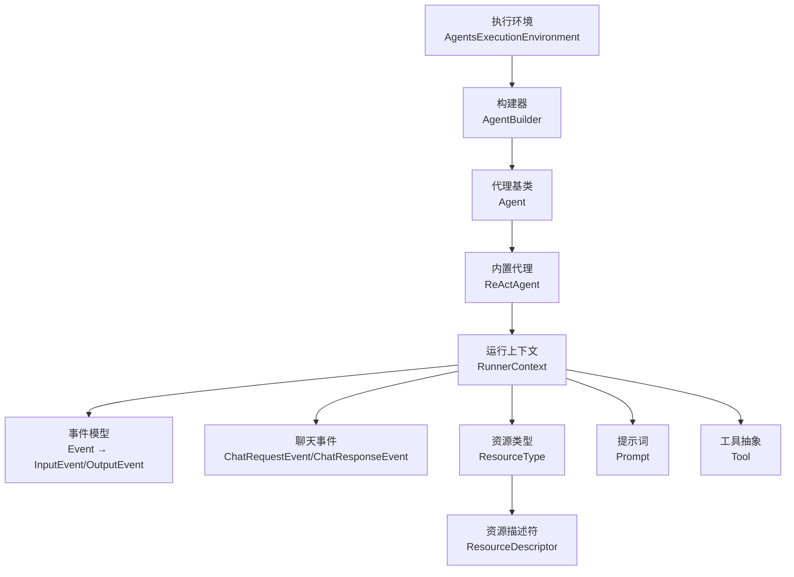
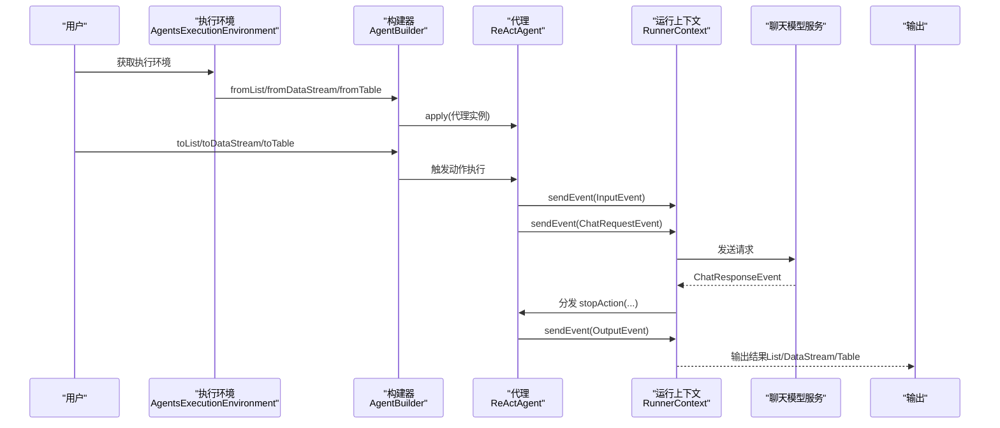
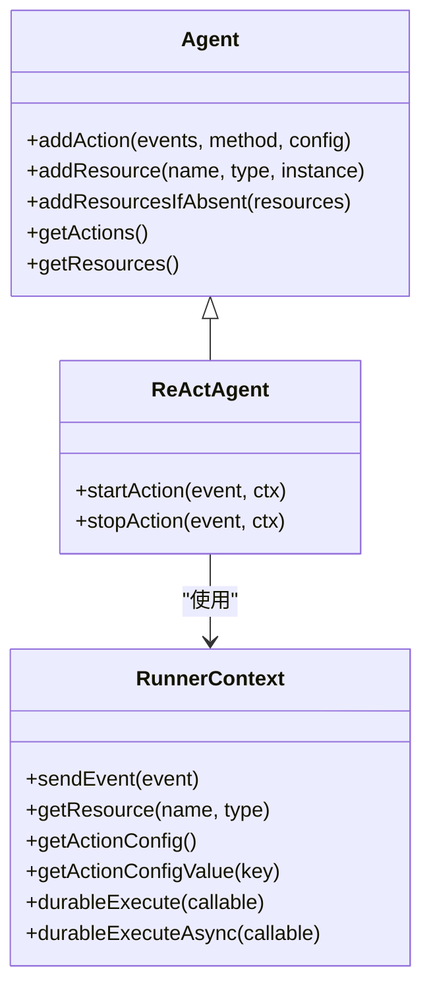
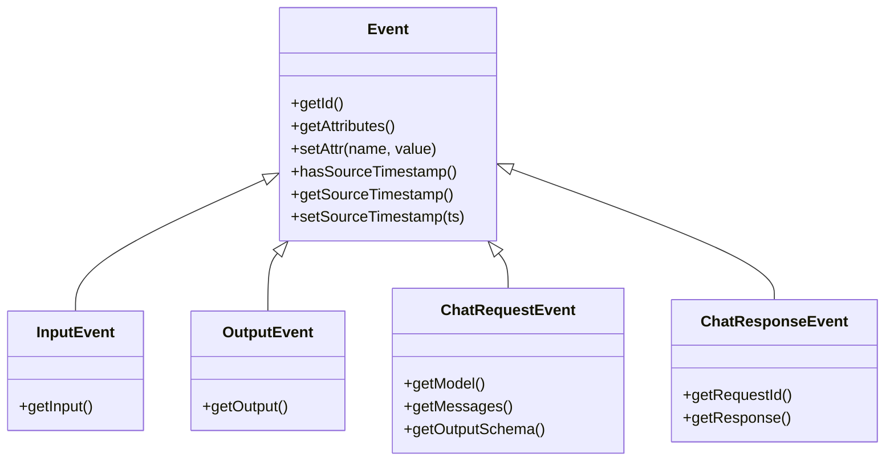
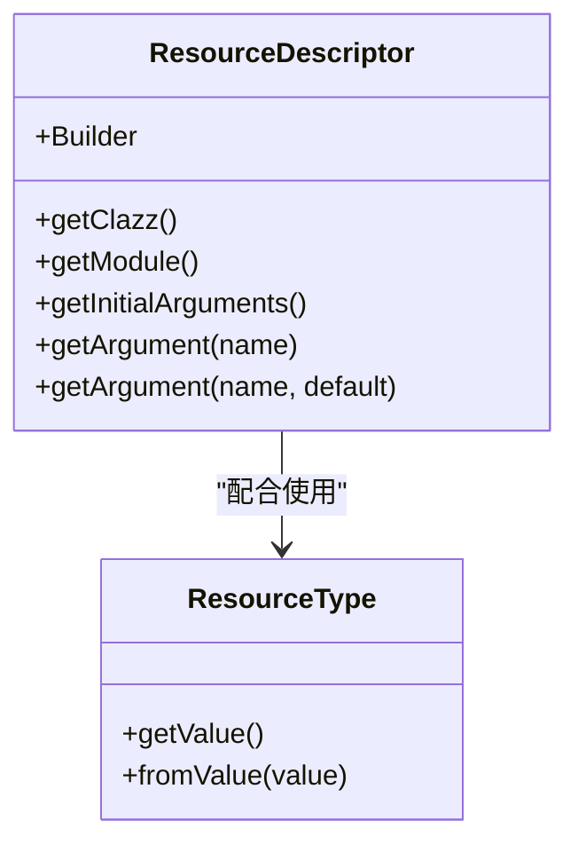
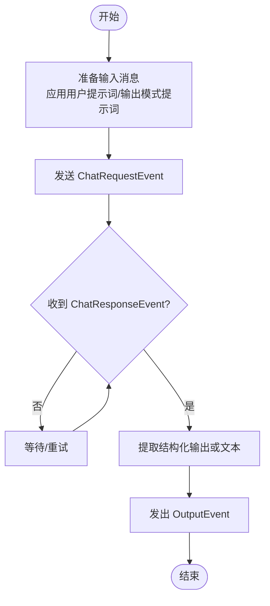
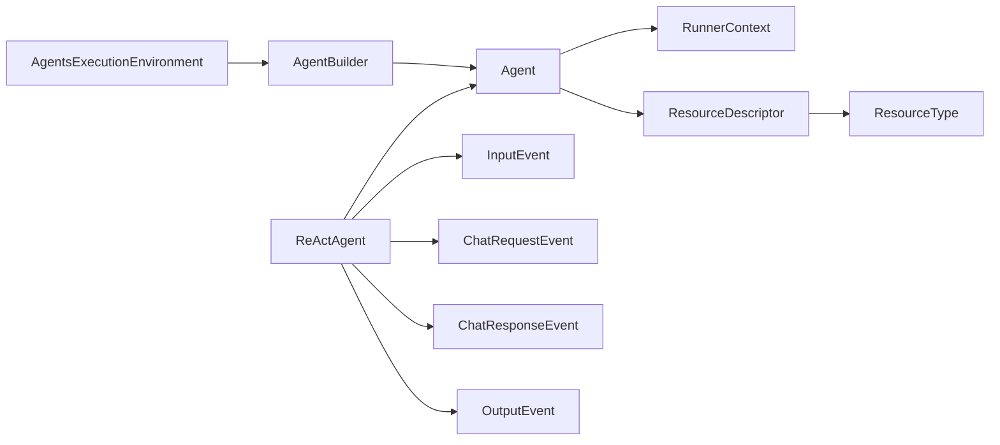

# 核心 API

<cite>
**本文引用的文件**   
- [AgentBuilder.java](file://api/src/main/java/org/apache/flink/agents/api/AgentBuilder.java)
- [AgentsExecutionEnvironment.java](file://api/src/main/java/org/apache/flink/agents/api/AgentsExecutionEnvironment.java)
- [Agent.java](file://api/src/main/java/org/apache/flink/agents/api/agents/Agent.java)
- [ReActAgent.java](file://api/src/main/java/org/apache/flink/agents/api/agents/ReActAgent.java)
- [RunnerContext.java](file://api/src/main/java/org/apache/flink/agents/api/context/RunnerContext.java)
- [Event.java](file://api/src/main/java/org/apache/flink/agents/api/Event.java)
- [InputEvent.java](file://api/src/main/java/org/apache/flink/agents/api/InputEvent.java)
- [OutputEvent.java](file://api/src/main/java/org/apache/flink/agents/api/OutputEvent.java)
- [ChatRequestEvent.java](file://api/src/main/java/org/apache/flink/agents/api/event/ChatRequestEvent.java)
- [ChatResponseEvent.java](file://api/src/main/java/org/apache/flink/agents/api/event/ChatResponseEvent.java)
- [ResourceDescriptor.java](file://api/src/main/java/org/apache/flink/agents/api/resource/ResourceDescriptor.java)
- [ResourceType.java](file://api/src/main/java/org/apache/flink/agents/api/resource/ResourceType.java)
- [Action.java](file://api/src/main/java/org/apache/flink/agents/api/annotation/Action.java)
- [Prompt.java](file://api/src/main/java/org/apache/flink/agents/api/prompt/Prompt.java)
- [Tool.java](file://api/src/main/java/org/apache/flink/agents/api/tools/Tool.java)
- [ReActAgentTest.java](file://api/src/test/java/org/apache/flink/agents/api/agents/ReActAgentTest.java)
- [ResourceDescriptorTest.java](file://api/src/test/java/org/apache/flink/agents/api/resource/ResourceDescriptorTest.java)
</cite>

## 目录
1. [简介](#简介)
2. [项目结构](#项目结构)
3. [核心组件](#核心组件)
4. [架构总览](#架构总览)
5. [详细组件分析](#详细组件分析)
6. [依赖关系分析](#依赖关系分析)
7. [性能考量](#性能考量)
8. [故障排查指南](#故障排查指南)
9. [结论](#结论)
10. [附录：常见用法与示例路径](#附录常见用法与示例路径)

## 简介
本文件系统性梳理 Apache Flink Agents 的核心 API，重点覆盖以下方面：
- AgentBuilder 的流畅式 API 设计与使用流程（输入、配置、输出）
- ReActAgent 的实现原理与“思维-行动-观察”循环
- 事件系统（Event、InputEvent、OutputEvent 及其子类型）的职责与交互
- 资源管理（ResourceDescriptor、ResourceType、资源注册与跨语言支持）
- 公共接口方法签名、参数与返回值说明
- 错误处理策略与最佳实践
- 面向不同经验水平开发者的分层讲解

## 项目结构
本节聚焦与核心 API 直接相关的模块与文件组织方式：
- 执行环境与构建器：AgentsExecutionEnvironment、AgentBuilder
- 代理基类与内置实现：Agent、ReActAgent
- 事件模型：Event、InputEvent、OutputEvent、ChatRequestEvent、ChatResponseEvent
- 上下文与运行时：RunnerContext
- 资源与类型：ResourceDescriptor、ResourceType
- 注解与提示词：Action、Prompt
- 工具抽象：Tool

图表来源
- [AgentsExecutionEnvironment.java](file://api/src/main/java/org/apache/flink/agents/api/AgentsExecutionEnvironment.java#L43-L223)
- [AgentBuilder.java](file://api/src/main/java/org/apache/flink/agents/api/AgentBuilder.java#L35-L77)
- [Agent.java](file://api/src/main/java/org/apache/flink/agents/api/agents/Agent.java#L34-L131)
- [ReActAgent.java](file://api/src/main/java/org/apache/flink/agents/api/agents/ReActAgent.java#L51-L183)
- [RunnerContext.java](file://api/src/main/java/org/apache/flink/agents/api/context/RunnerContext.java#L33-L138)
- [Event.java](file://api/src/main/java/org/apache/flink/agents/api/Event.java#L30-L90)
- [InputEvent.java](file://api/src/main/java/org/apache/flink/agents/api/InputEvent.java#L28-L49)
- [OutputEvent.java](file://api/src/main/java/org/apache/flink/agents/api/OutputEvent.java#L31-L52)
- [ChatRequestEvent.java](file://api/src/main/java/org/apache/flink/agents/api/event/ChatRequestEvent.java#L29-L58)
- [ChatResponseEvent.java](file://api/src/main/java/org/apache/flink/agents/api/event/ChatResponseEvent.java#L26-L43)
- [ResourceType.java](file://api/src/main/java/org/apache/flink/agents/api/resource/ResourceType.java#L26-L62)
- [ResourceDescriptor.java](file://api/src/main/java/org/apache/flink/agents/api/resource/ResourceDescriptor.java#L29-L144)
- [Prompt.java](file://api/src/main/java/org/apache/flink/agents/api/prompt/Prompt.java#L77-L326)
- [Tool.java](file://api/src/main/java/org/apache/flink/agents/api/tools/Tool.java#L30-L70)

章节来源
- [AgentsExecutionEnvironment.java](file://api/src/main/java/org/apache/flink/agents/api/AgentsExecutionEnvironment.java#L43-L223)
- [AgentBuilder.java](file://api/src/main/java/org/apache/flink/agents/api/AgentBuilder.java#L35-L77)

## 核心组件
本节对关键 API 进行深入解析，并给出方法签名、参数与返回值说明。

- 执行环境与构建器
  - AgentsExecutionEnvironment
    - 方法：getExecutionEnvironment(...)、fromList(...)、fromDataStream(...)、fromTable(...)、execute()、addResource(...)
    - 作用：根据是否传入 Flink 环境选择本地或远程执行；统一注册资源；提供 AgentBuilder 输入入口
  - AgentBuilder
    - 方法：apply(agent)、toList()、toDataStream()、toTable(schema)
    - 作用：以流畅式 API 配置代理，将代理执行结果转换为 List、DataStream 或 Table

- 代理基类与内置实现
  - Agent
    - 方法：addAction(...)、addResource(...)、addResourcesIfAbsent(...)、getActions()、getResources()
    - 作用：声明动作与资源；维护动作表与资源表；提供错误处理策略枚举
  - ReActAgent
    - 构造：接收 ResourceDescriptor、可选 Prompt、可选输出模式（RowTypeInfo/POJO 类）
    - 动作：startAction(...)（发送 ChatRequestEvent）、stopAction(...)（接收 ChatResponseEvent 并发出 OutputEvent）

- 事件系统
  - Event（基类）：提供 UUID 标识、属性 Map、来源时间戳等通用能力
  - InputEvent：携带单条输入数据
  - OutputEvent：承载代理输出
  - ChatRequestEvent：请求聊天模型推理，可携带输出模式
  - ChatResponseEvent：响应聊天模型推理，携带请求 ID 与消息内容

- 运行上下文
  - RunnerContext：sendEvent(...)、getSensoryMemory()/getShortTermMemory()/getLongTermMemory()、getResource(...)、getConfig()、getActionConfig()/getActionConfigValue(...)、durableExecute(...)、durableExecuteAsync(...)、close()

- 资源管理
  - ResourceDescriptor：描述资源（含跨语言支持），提供 Builder 模式
  - ResourceType：枚举资源类型（如 chat_model、embedding_model、vector_store、prompt、tool、mcp_server）
  - Agent.addResource(...) 与 AgentsExecutionEnvironment.addResource(...)：注册资源到代理或执行环境

- 注解与提示词
  - @Action：标记动作方法监听的事件类型
  - Prompt：模板化提示词，支持字符串与消息模板，生成格式化文本或消息列表

- 工具抽象
  - Tool：工具元数据、类型、调用方法；提供从方法构造函数工具的能力

章节来源
- [AgentsExecutionEnvironment.java](file://api/src/main/java/org/apache/flink/agents/api/AgentsExecutionEnvironment.java#L43-L223)
- [AgentBuilder.java](file://api/src/main/java/org/apache/flink/agents/api/AgentBuilder.java#L35-L77)
- [Agent.java](file://api/src/main/java/org/apache/flink/agents/api/agents/Agent.java#L34-L131)
- [ReActAgent.java](file://api/src/main/java/org/apache/flink/agents/api/agents/ReActAgent.java#L51-L183)
- [Event.java](file://api/src/main/java/org/apache/flink/agents/api/Event.java#L30-L90)
- [InputEvent.java](file://api/src/main/java/org/apache/flink/agents/api/InputEvent.java#L28-L49)
- [OutputEvent.java](file://api/src/main/java/org/apache/flink/agents/api/OutputEvent.java#L31-L52)
- [ChatRequestEvent.java](file://api/src/main/java/org/apache/flink/agents/api/event/ChatRequestEvent.java#L29-L58)
- [ChatResponseEvent.java](file://api/src/main/java/org/apache/flink/agents/api/event/ChatResponseEvent.java#L26-L43)
- [RunnerContext.java](file://api/src/main/java/org/apache/flink/agents/api/context/RunnerContext.java#L33-L138)
- [ResourceDescriptor.java](file://api/src/main/java/org/apache/flink/agents/api/resource/ResourceDescriptor.java#L29-L144)
- [ResourceType.java](file://api/src/main/java/org/apache/flink/agents/api/resource/ResourceType.java#L26-L62)
- [Action.java](file://api/src/main/java/org/apache/flink/agents/api/annotation/Action.java#L28-L54)
- [Prompt.java](file://api/src/main/java/org/apache/flink/agents/api/prompt/Prompt.java#L77-L326)
- [Tool.java](file://api/src/main/java/org/apache/flink/agents/api/tools/Tool.java#L30-L70)

## 架构总览
下图展示了从输入到输出的端到端流程，以及 ReActAgent 的“思维-行动-观察”循环：

图表来源
- [AgentsExecutionEnvironment.java](file://api/src/main/java/org/apache/flink/agents/api/AgentsExecutionEnvironment.java#L139-L198)
- [AgentBuilder.java](file://api/src/main/java/org/apache/flink/agents/api/AgentBuilder.java#L43-L76)
- [ReActAgent.java](file://api/src/main/java/org/apache/flink/agents/api/agents/ReActAgent.java#L103-L181)
- [ChatRequestEvent.java](file://api/src/main/java/org/apache/flink/agents/api/event/ChatRequestEvent.java#L34-L43)
- [ChatResponseEvent.java](file://api/src/main/java/org/apache/flink/agents/api/event/ChatResponseEvent.java#L30-L41)
- [OutputEvent.java](file://api/src/main/java/org/apache/flink/agents/api/OutputEvent.java#L34-L46)

## 详细组件分析

### AgentBuilder 流畅式 API
- 设计目标
  - 将代理集成到 Flink 数据流/表管线中，提供统一的输出形态（List、DataStream、Table）
- 关键方法
  - apply(Agent)：绑定代理实例
  - toList()：本地执行环境下的聚合输出
  - toDataStream()：将事件输出接入 Flink DataStream
  - toTable(Schema)：将事件输出映射为 Flink Table
- 使用要点
  - 在远程执行环境中，toDataStream/toTable 用于与 Flink 管线无缝衔接
  - 在本地执行环境中，toList 便于快速验证

章节来源
- [AgentBuilder.java](file://api/src/main/java/org/apache/flink/agents/api/AgentBuilder.java#L35-L77)

### AgentsExecutionEnvironment 执行环境
- 设计目标
  - 根据是否传入 Flink 环境自动切换本地/远程执行
  - 提供资源注册与输入源接入（List/DataStream/Table）
- 关键方法
  - getExecutionEnvironment(...)：工厂方法
  - fromList/fromDataStream/fromTable：输入源接入
  - addResource(...)：注册资源
  - execute()：触发执行
- 最佳实践
  - 远程执行时务必传入 StreamExecutionEnvironment 与（可选）StreamTableEnvironment
  - 资源在执行前完成注册，避免运行期缺失

章节来源
- [AgentsExecutionEnvironment.java](file://api/src/main/java/org/apache/flink/agents/api/AgentsExecutionEnvironment.java#L68-L222)

### Agent 与 ReActAgent：动作与资源
- Agent
  - addAction(...)：注册静态动作方法，指定监听事件类型
  - addResource(...)：注册资源（支持 ResourceDescriptor 与可序列化资源）
  - getActions()/getResources()：查询内部状态
- ReActAgent
  - 构造阶段：注册默认聊天模型资源、可选输出模式提示词、可选用户提示词
  - startAction(...)：将输入封装为 ChatMessage 列表，发送 ChatRequestEvent
  - stopAction(...)：接收 ChatResponseEvent，提取结构化输出或文本，发出 OutputEvent

图表来源
- [Agent.java](file://api/src/main/java/org/apache/flink/agents/api/agents/Agent.java#L34-L131)
- [ReActAgent.java](file://api/src/main/java/org/apache/flink/agents/api/agents/ReActAgent.java#L51-L183)
- [RunnerContext.java](file://api/src/main/java/org/apache/flink/agents/api/context/RunnerContext.java#L33-L138)

章节来源
- [Agent.java](file://api/src/main/java/org/apache/flink/agents/api/agents/Agent.java#L63-L111)
- [ReActAgent.java](file://api/src/main/java/org/apache/flink/agents/api/agents/ReActAgent.java#L59-L101)

### 事件系统：InputEvent、OutputEvent 与聊天事件
- Event 基类
  - 提供唯一标识、属性 Map、来源时间戳
- InputEvent
  - 携带单条输入对象，作为代理处理的起点
- OutputEvent
  - 承载代理最终输出，作为下游消费的数据源
- ChatRequestEvent/ChatResponseEvent
  - 请求与响应聊天模型推理，支持输出模式约束与结构化输出传递

图表来源
- [Event.java](file://api/src/main/java/org/apache/flink/agents/api/Event.java#L30-L90)
- [InputEvent.java](file://api/src/main/java/org/apache/flink/agents/api/InputEvent.java#L28-L49)
- [OutputEvent.java](file://api/src/main/java/org/apache/flink/agents/api/OutputEvent.java#L31-L52)
- [ChatRequestEvent.java](file://api/src/main/java/org/apache/flink/agents/api/event/ChatRequestEvent.java#L29-L58)
- [ChatResponseEvent.java](file://api/src/main/java/org/apache/flink/agents/api/event/ChatResponseEvent.java#L26-L43)

章节来源
- [Event.java](file://api/src/main/java/org/apache/flink/agents/api/Event.java#L48-L74)
- [InputEvent.java](file://api/src/main/java/org/apache/flink/agents/api/InputEvent.java#L45-L47)
- [OutputEvent.java](file://api/src/main/java/org/apache/flink/agents/api/OutputEvent.java#L48-L50)
- [ChatRequestEvent.java](file://api/src/main/java/org/apache/flink/agents/api/event/ChatRequestEvent.java#L45-L56)
- [ChatResponseEvent.java](file://api/src/main/java/org/apache/flink/agents/api/event/ChatResponseEvent.java#L35-L41)

### RunnerContext：动作执行上下文
- 能力概览
  - 发送事件：sendEvent(...)
  - 内存访问：感知记忆、短期记忆、长期记忆
  - 资源访问：getResource(name, type)
  - 配置访问：getConfig()、getActionConfig()/getActionConfigValue(key)
  - 持久化执行：durableExecute(...)、durableExecuteAsync(...)
  - 资源清理：close()
- 注意事项
  - durableExecute(...) 期间禁止访问内存与 sendEvent
  - 异步路径在 JDK 21+ 使用 Continuation，在低版本回退同步

章节来源
- [RunnerContext.java](file://api/src/main/java/org/apache/flink/agents/api/context/RunnerContext.java#L39-L136)

### 资源管理：ResourceDescriptor 与 ResourceType
- ResourceDescriptor
  - 描述资源（Java/Python 类名、模块路径、初始参数）
  - Builder 模式便于链式配置
  - 支持跨语言资源声明（Python 模块路径需显式指定）
- ResourceType
  - 枚举资源类型：chat_model、chat_model_connection、embedding_model、embedding_model_connection、vector_store、prompt、tool、mcp_server
  - 提供 fromValue(...) 反序列化支持
- 注册机制
  - Agent.addResource(...)：注册到代理
  - AgentsExecutionEnvironment.addResource(...)：注册到执行环境（全局共享）

图表来源
- [ResourceDescriptor.java](file://api/src/main/java/org/apache/flink/agents/api/resource/ResourceDescriptor.java#L29-L144)
- [ResourceType.java](file://api/src/main/java/org/apache/flink/agents/api/resource/ResourceType.java#L26-L62)

章节来源
- [ResourceDescriptor.java](file://api/src/main/java/org/apache/flink/agents/api/resource/ResourceDescriptor.java#L64-L98)
- [ResourceType.java](file://api/src/main/java/org/apache/flink/agents/api/resource/ResourceType.java#L53-L60)

### 注解与提示词：@Action 与 Prompt
- @Action
  - 作用：将方法标记为动作，声明监听的事件类型数组
  - 用法：配合 Agent.addAction(...) 或运行时扫描机制
- Prompt
  - 工厂方法：fromText(...)、fromMessages(...)
  - 格式化：formatString(...)、formatMessages(...)
  - 实现：LocalPrompt（字符串/消息模板），支持占位符替换

章节来源
- [Action.java](file://api/src/main/java/org/apache/flink/agents/api/annotation/Action.java#L43-L53)
- [Prompt.java](file://api/src/main/java/org/apache/flink/agents/api/prompt/Prompt.java#L85-L115)

### 工具抽象：Tool
- 职责：封装工具元数据、类型与调用逻辑
- 关键点：getResourceType() 固定为 TOOL；getName()/getDescription() 来源于元数据
- 工具函数：fromMethod(...) 快速包装方法为工具

章节来源
- [Tool.java](file://api/src/main/java/org/apache/flink/agents/api/tools/Tool.java#L34-L68)

### ReActAgent 的“思维-行动-观察”循环详解
- 思维（Planning）
  - ReActAgent 在 startAction 中根据输入与可选用户 Prompt 生成 ChatMessage 列表
  - 若存在输出模式提示词，将其插入消息序列开头，引导模型按模式输出
- 行动（Acting）
  - 通过 RunnerContext 发送 ChatRequestEvent，触发外部聊天模型推理
- 观察（Observing）
  - 监听 ChatResponseEvent，提取结构化输出或文本内容
  - 发出 OutputEvent，驱动后续动作或结束流程

图表来源
- [ReActAgent.java](file://api/src/main/java/org/apache/flink/agents/api/agents/ReActAgent.java#L103-L181)
- [ChatRequestEvent.java](file://api/src/main/java/org/apache/flink/agents/api/event/ChatRequestEvent.java#L34-L43)
- [ChatResponseEvent.java](file://api/src/main/java/org/apache/flink/agents/api/event/ChatResponseEvent.java#L30-L41)
- [OutputEvent.java](file://api/src/main/java/org/apache/flink/agents/api/OutputEvent.java#L34-L46)

章节来源
- [ReActAgent.java](file://api/src/main/java/org/apache/flink/agents/api/agents/ReActAgent.java#L103-L181)

## 依赖关系分析
- 组件耦合
  - Agent 与 RunnerContext：动作执行依赖上下文能力（内存、资源、配置、持久化执行）
  - ReActAgent 与事件：依赖 InputEvent、ChatRequestEvent、ChatResponseEvent、OutputEvent 完成闭环
  - 资源体系：Agent/执行环境通过 ResourceDescriptor 与 ResourceType 统一资源注册与检索
- 外部依赖
  - Flink DataStream/Table：通过 AgentsExecutionEnvironment 与 AgentBuilder 接入
  - Jackson：用于资源与事件的序列化/反序列化（由相关类标注可见）

图表来源
- [Agent.java](file://api/src/main/java/org/apache/flink/agents/api/agents/Agent.java#L34-L131)
- [ReActAgent.java](file://api/src/main/java/org/apache/flink/agents/api/agents/ReActAgent.java#L51-L183)
- [RunnerContext.java](file://api/src/main/java/org/apache/flink/agents/api/context/RunnerContext.java#L33-L138)
- [ResourceDescriptor.java](file://api/src/main/java/org/apache/flink/agents/api/resource/ResourceDescriptor.java#L29-L144)
- [ResourceType.java](file://api/src/main/java/org/apache/flink/agents/api/resource/ResourceType.java#L26-L62)
- [AgentsExecutionEnvironment.java](file://api/src/main/java/org/apache/flink/agents/api/AgentsExecutionEnvironment.java#L43-L223)
- [AgentBuilder.java](file://api/src/main/java/org/apache/flink/agents/api/AgentBuilder.java#L35-L77)

## 性能考量
- 异步与恢复
  - durableExecuteAsync 在 JDK 21+ 使用 Continuation，减少阻塞；在低版本回退同步，注意吞吐差异
- 序列化开销
  - 跨语言资源（ResourceDescriptor）与事件（Event）采用 JSON 序列化，建议控制参数规模与层级
- 记忆与状态
  - 长期/短期/感知记忆访问可能涉及状态后端，应避免在回调中频繁读写
- 输出形态
  - toDataStream/toTable 更适合大规模流式处理；toList 仅适用于小规模本地验证

## 故障排查指南
- 资源未注册
  - 现象：运行时报找不到资源
  - 处理：确保在 Agent.addResource(...) 或 AgentsExecutionEnvironment.addResource(...) 中正确注册
- 动作重复定义
  - 现象：抛出已存在动作名称异常
  - 处理：检查动作命名唯一性，或移除重复注册
- 输入类型不匹配
  - 现象：非原生类型输入且未提供 Prompt，抛出异常
  - 处理：提供用户 Prompt 将输入转换为 ChatMessage，或改用原生类型
- 输出模式不兼容
  - 现象：输出模式不是 RowTypeInfo 或 POJO 类
  - 处理：使用受支持的模式或调整为受支持类型
- 持久化执行违规
  - 现象：在 durableExecute(...) 中访问内存或发送事件导致异常
  - 处理：遵循 RunnerContext 的限制，仅执行无副作用的纯计算

章节来源
- [Agent.java](file://api/src/main/java/org/apache/flink/agents/api/agents/Agent.java#L97-L111)
- [ReActAgent.java](file://api/src/main/java/org/apache/flink/agents/api/agents/ReActAgent.java#L124-L147)
- [RunnerContext.java](file://api/src/main/java/org/apache/flink/agents/api/context/RunnerContext.java#L113-L133)

## 结论
Flink Agents 的核心 API 通过“执行环境 + 构建器 + 代理 + 事件 + 资源”的协作，提供了从本地验证到 Flink 流水线集成的一体化方案。ReActAgent 以清晰的动作模型与事件驱动的“思维-行动-观察”循环，为 LLM 驱动的智能代理提供了可扩展的实现范式。借助 ResourceDescriptor 与 ResourceType，系统实现了跨语言资源的统一管理。建议在生产中结合 RunnerContext 的持久化执行能力与事件序列化特性，合理设计动作与资源，确保可维护性与可扩展性。

## 附录：常见用法与示例路径
- 本地列表输入与输出
  - 示例路径：[ReActAgentTest.java](file://api/src/test/java/org/apache/flink/agents/api/agents/ReActAgentTest.java#L30-L44)
- 资源描述符序列化与参数传递
  - 示例路径：[ResourceDescriptorTest.java](file://api/src/test/java/org/apache/flink/agents/api/resource/ResourceDescriptorTest.java#L32-L54)
- 从 DataStream/表接入代理
  - 示例路径：参考执行环境与构建器方法签名
    - [AgentsExecutionEnvironment.java](file://api/src/main/java/org/apache/flink/agents/api/AgentsExecutionEnvironment.java#L139-L198)
    - [AgentBuilder.java](file://api/src/main/java/org/apache/flink/agents/api/AgentBuilder.java#L43-L76)
- 自定义动作与监听事件
  - 示例路径：注解与动作注册
    - [@Action](file://api/src/main/java/org/apache/flink/agents/api/annotation/Action.java#L43-L53)
    - [Agent.java](file://api/src/main/java/org/apache/flink/agents/api/agents/Agent.java#L63-L81)
- 提示词模板与消息格式化
  - 示例路径：提示词工厂与格式化
    - [Prompt.java](file://api/src/main/java/org/apache/flink/agents/api/prompt/Prompt.java#L85-L115)