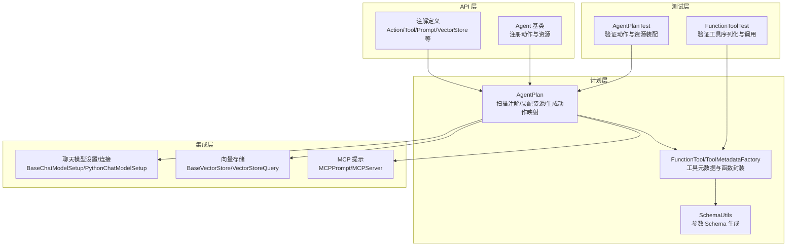
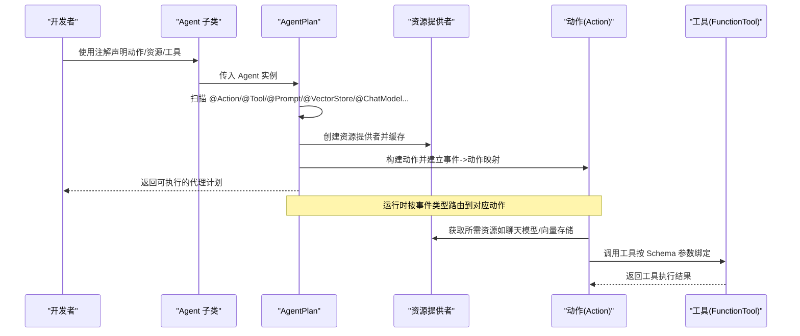
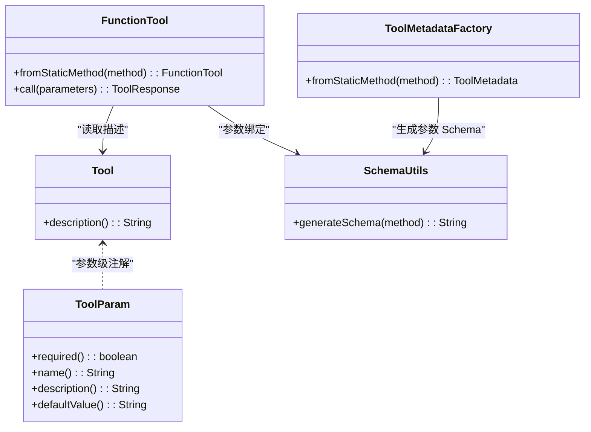
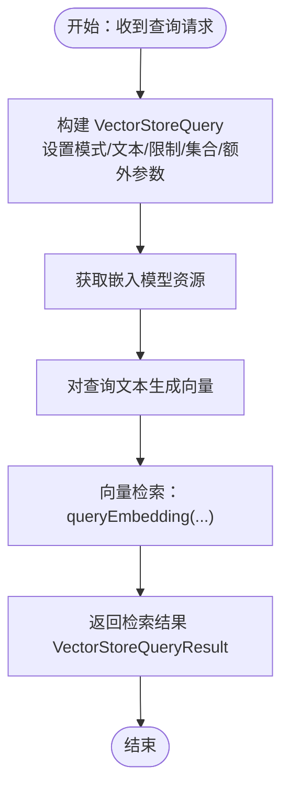
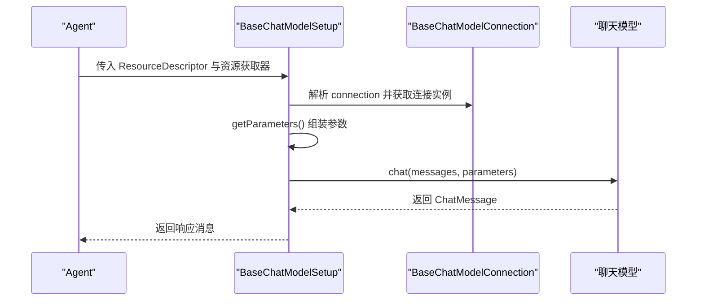
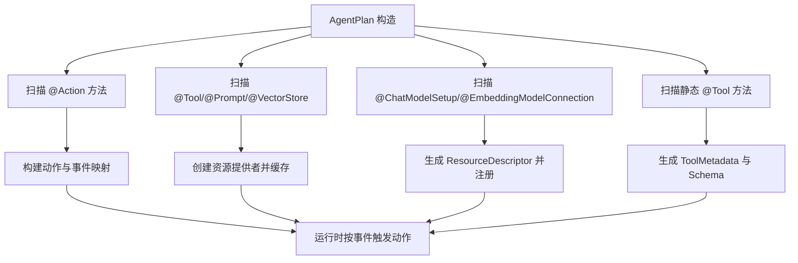
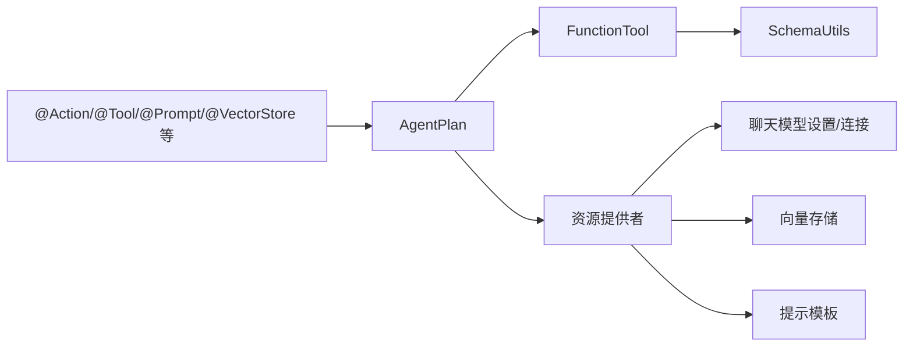

# 注解系统

<cite>
**本文引用的文件**
- [Action.java](file://api/src/main/java/org/apache/flink/agents/api/annotation/Action.java)
- [ChatModelConnection.java](file://api/src/main/java/org/apache/flink/agents/api/annotation/ChatModelConnection.java)
- [ChatModelSetup.java](file://api/src/main/java/org/apache/flink/agents/api/annotation/ChatModelSetup.java)
- [EmbeddingModelConnection.java](file://api/src/main/java/org/apache/flink/agents/api/annotation/EmbeddingModelConnection.java)
- [Prompt.java](file://api/src/main/java/org/apache/flink/agents/api/annotation/Prompt.java)
- [Tool.java](file://api/src/main/java/org/apache/flink/agents/api/annotation/Tool.java)
- [ToolParam.java](file://api/src/main/java/org/apache/flink/agents/api/annotation/ToolParam.java)
- [VectorStore.java](file://api/src/main/java/org/apache/flink/agents/api/annotation/VectorStore.java)
- [Agent.java](file://api/src/main/java/org/apache/flink/agents/api/agents/Agent.java)
- [AgentPlan.java](file://plan/src/main/java/org/apache/flink/agents/plan/AgentPlan.java)
- [FunctionTool.java](file://plan/src/main/java/org/apache/flink/agents/plan/tools/FunctionTool.java)
- [ToolMetadataFactory.java](file://plan/src/main/java/org/apache/flink/agents/plan/tools/ToolMetadataFactory.java)
- [SchemaUtils.java](file://plan/src/main/java/org/apache/flink/agents/plan/tools/SchemaUtils.java)
- [AgentPlanTest.java](file://plan/src/test/java/org/apache/flink/agents/plan/AgentPlanTest.java)
- [FunctionToolTest.java](file://plan/src/test/java/org/apache/flink/agents/plan/tools/FunctionToolTest.java)
- [AnthropicChatModelSetup.java](file://integrations/chat-models/anthropic/src/main/java/org/apache/flink/agents/integrations/chatmodels/anthropic/AnthropicChatModelSetup.java)
- [BaseChatModelSetup.java](file://api/src/main/java/org/apache/flink/agents/api/chat/model/BaseChatModelSetup.java)
- [PythonChatModelSetup.java](file://api/src/main/java/org/apache/flink/agents/api/chat/model/python/PythonChatModelSetup.java)
- [BaseVectorStore.java](file://api/src/main/java/org/apache/flink/agents/api/vectorstores/BaseVectorStore.java)
- [VectorStoreQuery.java](file://api/src/main/java/org/apache/flink/agents/api/vectorstores/VectorStoreQuery.java)
- [MCPPrompt.java](file://integrations/mcp/src/main/java/org/apache/flink/agents/integrations/mcp/MCPPrompt.java)
- [MCPServer.java](file://integrations/mcp/src/main/java/org/apache/flink/agents/integrations/mcp/MCPServer.java)
- [VectorStoreIntegrationAgent.java](file://e2e-test/flink-agents-end-to-end-tests-integration/src/test/java/org/apache/flink/agents/integration/test/VectorStoreIntegrationAgent.java)
- [VectorStoreCrossLanguageAgent.java](file://e2e-test/flink-agents-end-to-end-tests-resource-cross-language/src/test/java/org/apache/flink/agents/resource/test/VectorStoreCrossLanguageAgent.java)
</cite>

## 目录
1. [简介](#简介)
2. [项目结构](#项目结构)
3. [核心组件](#核心组件)
4. [架构总览](#架构总览)
5. [详细组件分析](#详细组件分析)
6. [依赖关系分析](#依赖关系分析)
7. [性能考量](#性能考量)
8. [故障排查指南](#故障排查指南)
9. [结论](#结论)
10. [附录](#附录)

## 简介
本文件为注解系统的权威参考文档，面向希望使用注解简化代理开发的开发者。文档覆盖以下注解的功能、属性参数、使用约束与最佳实践：
- @Action：标记动作方法，声明其监听的事件类型
- @ChatModelConnection：标注聊天模型连接资源
- @ChatModelSetup：标注聊天模型“设置”资源（含静态工厂方法）
- @EmbeddingModelConnection：标注嵌入模型连接资源描述符
- @Prompt：标注提示模板资源
- @Tool：标注工具资源（字段或静态方法），支持通过@ToolParam细化参数
- @VectorStore：标注向量存储资源（字段或静态方法）

同时，文档解释注解驱动的代理开发模式与自动化配置的工作原理，剖析注解处理器（扫描与装配）的实现细节，并给出与代理计划编译过程的集成方式、常见问题排查与优化建议。

## 项目结构
注解系统主要分布在以下模块：
- api 模块：定义注解与基础资源接口
- plan 模块：解析注解、生成代理计划（AgentPlan）、构建工具元数据与函数工具
- integrations 模块：具体资源实现（如聊天模型、向量存储等）
- e2e-test 模块：端到端测试，展示注解在真实场景中的使用

图表来源
- [AgentPlan.java](file://plan/src/main/java/org/apache/flink/agents/plan/AgentPlan.java#L298-L376)
- [FunctionTool.java](file://plan/src/main/java/org/apache/flink/agents/plan/tools/FunctionTool.java#L57-L102)
- [SchemaUtils.java](file://plan/src/main/java/org/apache/flink/agents/plan/tools/SchemaUtils.java#L34-L66)
- [BaseChatModelSetup.java](file://api/src/main/java/org/apache/flink/agents/api/chat/model/BaseChatModelSetup.java#L37-L64)
- [BaseVectorStore.java](file://api/src/main/java/org/apache/flink/agents/api/vectorstores/BaseVectorStore.java#L87-L121)
- [MCPPrompt.java](file://integrations/mcp/src/main/java/org/apache/flink/agents/integrations/mcp/MCPPrompt.java#L28-L208)

章节来源
- [AgentPlan.java](file://plan/src/main/java/org/apache/flink/agents/plan/AgentPlan.java#L298-L376)
- [Agent.java](file://api/src/main/java/org/apache/flink/agents/api/agents/Agent.java#L38-L71)

## 核心组件
- 注解定义：位于 api/src/main/java/org/apache/flink/agents/api/annotation 下，定义了 @Action、@ChatModelConnection、@ChatModelSetup、@EmbeddingModelConnection、@Prompt、@Tool、@ToolParam、@VectorStore 共同构成注解体系
- 资源与动作装配：AgentPlan 在构造时扫描 Agent 子类，提取注解信息并生成动作映射与资源提供者
- 工具元数据与函数封装：FunctionTool 将静态方法包装为可调用工具；SchemaUtils 依据方法签名与 @ToolParam 生成参数 Schema
- 基础资源抽象：Agent 基类提供动作注册与资源容器；BaseChatModelSetup/PythonChatModelSetup 定义聊天模型设置的通用行为；BaseVectorStore/VectorStoreQuery 定义向量检索流程

章节来源
- [Action.java](file://api/src/main/java/org/apache/flink/agents/api/annotation/Action.java#L28-L53)
- [Tool.java](file://api/src/main/java/org/apache/flink/agents/api/annotation/Tool.java#L26-L42)
- [ToolParam.java](file://api/src/main/java/org/apache/flink/agents/api/annotation/ToolParam.java#L29-L63)
- [Prompt.java](file://api/src/main/java/org/apache/flink/agents/api/annotation/Prompt.java#L26-L34)
- [VectorStore.java](file://api/src/main/java/org/apache/flink/agents/api/annotation/VectorStore.java#L26-L36)
- [ChatModelConnection.java](file://api/src/main/java/org/apache/flink/agents/api/annotation/ChatModelConnection.java#L26-L34)
- [ChatModelSetup.java](file://api/src/main/java/org/apache/flink/agents/api/annotation/ChatModelSetup.java#L26-L34)
- [EmbeddingModelConnection.java](file://api/src/main/java/org/apache/flink/agents/api/annotation/EmbeddingModelConnection.java#L26-L35)
- [Agent.java](file://api/src/main/java/org/apache/flink/agents/api/agents/Agent.java#L38-L71)
- [AgentPlan.java](file://plan/src/main/java/org/apache/flink/agents/plan/AgentPlan.java#L298-L376)
- [FunctionTool.java](file://plan/src/main/java/org/apache/flink/agents/plan/tools/FunctionTool.java#L57-L102)
- [SchemaUtils.java](file://plan/src/main/java/org/apache/flink/agents/plan/tools/SchemaUtils.java#L34-L66)

## 架构总览
注解驱动的代理开发模式由“注解 + 扫描 + 计划生成 + 运行时执行”四阶段组成：
- 注解阶段：开发者在 Agent 子类中使用注解声明动作、资源与工具
- 扫描阶段：AgentPlan 遍历 Agent 类，读取注解元数据
- 计划生成阶段：生成动作映射、资源提供者、工具元数据与 Schema
- 运行时执行阶段：根据事件触发动作，按需获取资源并执行工具

图表来源
- [AgentPlan.java](file://plan/src/main/java/org/apache/flink/agents/plan/AgentPlan.java#L298-L376)
- [FunctionTool.java](file://plan/src/main/java/org/apache/flink/agents/plan/tools/FunctionTool.java#L57-L102)
- [Agent.java](file://api/src/main/java/org/apache/flink/agents/api/agents/Agent.java#L38-L71)

## 详细组件分析

### @Action：动作注解
- 目的：将方法标记为代理动作，并声明其监听的事件类型数组
- 属性：
  - listenEvents：必须提供至少一个事件类型，用于建立事件到动作的映射
- 使用约束：
  - 仅作用于方法
  - 方法签名通常为 (Event, RunnerContext) 或兼容签名
- 最佳实践：
  - 为单一职责的动作方法添加注解，避免在一个动作中处理多种不相关的事件
  - 明确事件边界，减少不必要的事件广播
- 示例路径：
  - [AgentPlanTest.java](file://plan/src/test/java/org/apache/flink/agents/plan/AgentPlanTest.java#L129-L146)
  - [AgentPlan.java](file://plan/src/main/java/org/apache/flink/agents/plan/AgentPlan.java#L298-L376)

章节来源
- [Action.java](file://api/src/main/java/org/apache/flink/agents/api/annotation/Action.java#L28-L53)
- [AgentPlanTest.java](file://plan/src/test/java/org/apache/flink/agents/plan/AgentPlanTest.java#L129-L146)
- [AgentPlan.java](file://plan/src/main/java/org/apache/flink/agents/plan/AgentPlan.java#L298-L376)

### @Tool 与 @ToolParam：工具注解
- 目的：将字段或静态方法标记为工具资源；@ToolParam 细化参数的名称、是否必填、描述与默认值
- 属性：
  - @Tool.description：工具描述，默认为空字符串
  - @ToolParam.name/description/defaultValue/required：参数级元数据
- 使用约束：
  - 字段：直接注入工具实例
  - 静态方法：被封装为 FunctionTool，方法必须为 static
- 最佳实践：
  - 对复杂工具方法使用 @ToolParam 明确参数语义与默认值
  - 保持工具方法纯函数特性，便于序列化与跨语言传递
- 示例路径：
  - [FunctionToolTest.java](file://plan/src/test/java/org/apache/flink/agents/plan/tools/FunctionToolTest.java#L29-L50)
  - [FunctionTool.java](file://plan/src/main/java/org/apache/flink/agents/plan/tools/FunctionTool.java#L57-L102)
  - [ToolMetadataFactory.java](file://plan/src/main/java/org/apache/flink/agents/plan/tools/ToolMetadataFactory.java#L36-L53)
  - [SchemaUtils.java](file://plan/src/main/java/org/apache/flink/agents/plan/tools/SchemaUtils.java#L34-L66)

图表来源
- [Tool.java](file://api/src/main/java/org/apache/flink/agents/api/annotation/Tool.java#L26-L42)
- [ToolParam.java](file://api/src/main/java/org/apache/flink/agents/api/annotation/ToolParam.java#L29-L63)
- [FunctionTool.java](file://plan/src/main/java/org/apache/flink/agents/plan/tools/FunctionTool.java#L57-L102)
- [ToolMetadataFactory.java](file://plan/src/main/java/org/apache/flink/agents/plan/tools/ToolMetadataFactory.java#L36-L53)
- [SchemaUtils.java](file://plan/src/main/java/org/apache/flink/agents/plan/tools/SchemaUtils.java#L34-L66)

章节来源
- [Tool.java](file://api/src/main/java/org/apache/flink/agents/api/annotation/Tool.java#L26-L42)
- [ToolParam.java](file://api/src/main/java/org/apache/flink/agents/api/annotation/ToolParam.java#L29-L63)
- [FunctionTool.java](file://plan/src/main/java/org/apache/flink/agents/plan/tools/FunctionTool.java#L57-L102)
- [ToolMetadataFactory.java](file://plan/src/main/java/org/apache/flink/agents/plan/tools/ToolMetadataFactory.java#L36-L53)
- [SchemaUtils.java](file://plan/src/main/java/org/apache/flink/agents/plan/tools/SchemaUtils.java#L34-L66)

### @Prompt：提示模板注解
- 目的：将字段或方法标记为提示模板资源，供动作在对话或文本生成中使用
- 使用约束：
  - 可作用于字段或方法
- 最佳实践：
  - 将提示模板与动作解耦，通过资源提供者统一管理
  - 对动态参数使用占位符并在运行时替换
- 示例路径：
  - [Prompt.java](file://api/src/main/java/org/apache/flink/agents/api/annotation/Prompt.java#L26-L34)
  - [AgentPlan.java](file://plan/src/main/java/org/apache/flink/agents/plan/AgentPlan.java#L471-L487)

章节来源
- [Prompt.java](file://api/src/main/java/org/apache/flink/agents/api/annotation/Prompt.java#L26-L34)
- [AgentPlan.java](file://plan/src/main/java/org/apache/flink/agents/plan/AgentPlan.java#L471-L487)

### @VectorStore：向量存储注解
- 目的：将字段或静态方法标记为向量存储资源，用于上下文检索与知识增强
- 使用约束：
  - 可作用于字段或方法
  - 与 BaseVectorStore/VectorStoreQuery 协作完成查询与集合管理
- 最佳实践：
  - 明确集合名与查询参数，合理限制返回数量
  - 结合嵌入模型进行语义检索
- 示例路径：
  - [VectorStore.java](file://api/src/main/java/org/apache/flink/agents/api/annotation/VectorStore.java#L26-L36)
  - [BaseVectorStore.java](file://api/src/main/java/org/apache/flink/agents/api/vectorstores/BaseVectorStore.java#L87-L121)
  - [VectorStoreQuery.java](file://api/src/main/java/org/apache/flink/agents/api/vectorstores/VectorStoreQuery.java#L63-L109)
  - [VectorStoreIntegrationAgent.java](file://e2e-test/flink-agents-end-to-end-tests-integration/src/test/java/org/apache/flink/agents/integration/test/VectorStoreIntegrationAgent.java#L129-L155)
  - [VectorStoreCrossLanguageAgent.java](file://e2e-test/flink-agents-end-to-end-tests-resource-cross-language/src/test/java/org/apache/flink/agents/resource/test/VectorStoreCrossLanguageAgent.java#L212-L231)

图表来源
- [BaseVectorStore.java](file://api/src/main/java/org/apache/flink/agents/api/vectorstores/BaseVectorStore.java#L87-L121)
- [VectorStoreQuery.java](file://api/src/main/java/org/apache/flink/agents/api/vectorstores/VectorStoreQuery.java#L63-L109)

章节来源
- [VectorStore.java](file://api/src/main/java/org/apache/flink/agents/api/annotation/VectorStore.java#L26-L36)
- [BaseVectorStore.java](file://api/src/main/java/org/apache/flink/agents/api/vectorstores/BaseVectorStore.java#L87-L121)
- [VectorStoreQuery.java](file://api/src/main/java/org/apache/flink/agents/api/vectorstores/VectorStoreQuery.java#L63-L109)
- [VectorStoreIntegrationAgent.java](file://e2e-test/flink-agents-end-to-end-tests-integration/src/test/java/org/apache/flink/agents/integration/test/VectorStoreIntegrationAgent.java#L129-L155)
- [VectorStoreCrossLanguageAgent.java](file://e2e-test/flink-agents-end-to-end-tests-resource-cross-language/src/test/java/org/apache/flink/agents/resource/test/VectorStoreCrossLanguageAgent.java#L212-L231)

### @ChatModelConnection 与 @ChatModelSetup：聊天模型注解
- 目的：
  - @ChatModelConnection：标注聊天模型连接资源（方法级）
  - @ChatModelSetup：标注聊天模型“设置”资源（字段或方法，常为静态工厂）
- 使用约束：
  - @ChatModelSetup 标注的方法应返回 ResourceDescriptor 描述如何创建连接与设置参数
  - BaseChatModelSetup/PythonChatModelSetup 提供统一的聊天调用入口与跨语言适配
- 最佳实践：
  - 将模型参数（如温度、最大令牌数、工具列表）集中于设置资源中
  - 使用 BaseChatModelSetup 的 getParameters 与 chat(...) 方法进行统一调用
- 示例路径：
  - [ChatModelConnection.java](file://api/src/main/java/org/apache/flink/agents/api/annotation/ChatModelConnection.java#L26-L34)
  - [ChatModelSetup.java](file://api/src/main/java/org/apache/flink/agents/api/annotation/ChatModelSetup.java#L26-L34)
  - [AnthropicChatModelSetup.java](file://integrations/chat-models/anthropic/src/main/java/org/apache/flink/agents/integrations/chatmodels/anthropic/AnthropicChatModelSetup.java#L31-L59)
  - [BaseChatModelSetup.java](file://api/src/main/java/org/apache/flink/agents/api/chat/model/BaseChatModelSetup.java#L37-L64)
  - [PythonChatModelSetup.java](file://api/src/main/java/org/apache/flink/agents/api/chat/model/python/PythonChatModelSetup.java#L66-L88)

图表来源
- [BaseChatModelSetup.java](file://api/src/main/java/org/apache/flink/agents/api/chat/model/BaseChatModelSetup.java#L37-L64)
- [PythonChatModelSetup.java](file://api/src/main/java/org/apache/flink/agents/api/chat/model/python/PythonChatModelSetup.java#L66-L88)
- [AnthropicChatModelSetup.java](file://integrations/chat-models/anthropic/src/main/java/org/apache/flink/agents/integrations/chatmodels/anthropic/AnthropicChatModelSetup.java#L31-L59)

章节来源
- [ChatModelConnection.java](file://api/src/main/java/org/apache/flink/agents/api/annotation/ChatModelConnection.java#L26-L34)
- [ChatModelSetup.java](file://api/src/main/java/org/apache/flink/agents/api/annotation/ChatModelSetup.java#L26-L34)
- [BaseChatModelSetup.java](file://api/src/main/java/org/apache/flink/agents/api/chat/model/BaseChatModelSetup.java#L37-L64)
- [PythonChatModelSetup.java](file://api/src/main/java/org/apache/flink/agents/api/chat/model/python/PythonChatModelSetup.java#L66-L88)
- [AnthropicChatModelSetup.java](file://integrations/chat-models/anthropic/src/main/java/org/apache/flink/agents/integrations/chatmodels/anthropic/AnthropicChatModelSetup.java#L31-L59)

### @EmbeddingModelConnection：嵌入模型连接注解
- 目的：标注返回 ResourceDescriptor 的方法，描述如何配置与创建嵌入模型连接
- 使用约束：
  - 方法必须返回 ResourceDescriptor
- 最佳实践：
  - 将嵌入模型与向量存储配合使用，确保维度一致
- 示例路径：
  - [EmbeddingModelConnection.java](file://api/src/main/java/org/apache/flink/agents/api/annotation/EmbeddingModelConnection.java#L26-L35)

章节来源
- [EmbeddingModelConnection.java](file://api/src/main/java/org/apache/flink/agents/api/annotation/EmbeddingModelConnection.java#L26-L35)

### 注解处理器与自动化配置工作原理
- 动作扫描：AgentPlan 遍历 Agent 类的所有方法，提取 @Action 注解，构建动作对象与事件类型映射
- 资源扫描：识别 @Tool/@Prompt/@VectorStore/@ChatModelConnection/@ChatModelSetup/@EmbeddingModelConnection 等注解，创建对应的资源提供者并缓存
- 工具元数据：对静态方法工具，使用 ToolMetadataFactory 与 SchemaUtils 生成工具元数据与参数 Schema
- 运行时路由：根据事件类型从 actionsByEvent 映射定位动作，按需获取资源并执行

图表来源
- [AgentPlan.java](file://plan/src/main/java/org/apache/flink/agents/plan/AgentPlan.java#L298-L376)
- [AgentPlan.java](file://plan/src/main/java/org/apache/flink/agents/plan/AgentPlan.java#L471-L487)
- [FunctionTool.java](file://plan/src/main/java/org/apache/flink/agents/plan/tools/FunctionTool.java#L57-L102)
- [ToolMetadataFactory.java](file://plan/src/main/java/org/apache/flink/agents/plan/tools/ToolMetadataFactory.java#L36-L53)
- [SchemaUtils.java](file://plan/src/main/java/org/apache/flink/agents/plan/tools/SchemaUtils.java#L34-L66)

章节来源
- [AgentPlan.java](file://plan/src/main/java/org/apache/flink/agents/plan/AgentPlan.java#L298-L376)
- [AgentPlan.java](file://plan/src/main/java/org/apache/flink/agents/plan/AgentPlan.java#L471-L487)
- [FunctionTool.java](file://plan/src/main/java/org/apache/flink/agents/plan/tools/FunctionTool.java#L57-L102)
- [ToolMetadataFactory.java](file://plan/src/main/java/org/apache/flink/agents/plan/tools/ToolMetadataFactory.java#L36-L53)
- [SchemaUtils.java](file://plan/src/main/java/org/apache/flink/agents/plan/tools/SchemaUtils.java#L34-L66)

### 自定义注解开发指南
- 设计原则：
  - 明确定义目标（方法/字段/参数），选择合适的 @Target
  - 保留策略使用 RUNTIME，保证运行时可反射读取
  - 提供清晰的属性与默认值，便于工具链解析
- 实现步骤：
  - 在 api/annotation 下新增注解定义
  - 在 plan/AgentPlan 中扩展扫描逻辑，识别新注解并生成相应资源提供者或动作
  - 编写单元测试与端到端测试，验证注解在真实 Agent 中的行为
- 示例参考：
  - 现有注解的定义与使用路径见各注解文件与测试用例

章节来源
- [Action.java](file://api/src/main/java/org/apache/flink/agents/api/annotation/Action.java#L28-L53)
- [Tool.java](file://api/src/main/java/org/apache/flink/agents/api/annotation/Tool.java#L26-L42)
- [Prompt.java](file://api/src/main/java/org/apache/flink/agents/api/annotation/Prompt.java#L26-L34)
- [VectorStore.java](file://api/src/main/java/org/apache/flink/agents/api/annotation/VectorStore.java#L26-L36)
- [ChatModelConnection.java](file://api/src/main/java/org/apache/flink/agents/api/annotation/ChatModelConnection.java#L26-L34)
- [ChatModelSetup.java](file://api/src/main/java/org/apache/flink/agents/api/annotation/ChatModelSetup.java#L26-L34)
- [EmbeddingModelConnection.java](file://api/src/main/java/org/apache/flink/agents/api/annotation/EmbeddingModelConnection.java#L26-L35)

## 依赖关系分析
- 注解与计划层：
  - AgentPlan 依赖注解以扫描动作与资源
  - FunctionTool/ToolMetadataFactory/SchemaUtils 依赖注解生成工具元数据
- 资源层：
  - BaseChatModelSetup/PythonChatModelSetup 依赖 ResourceDescriptor 与资源获取器
  - BaseVectorStore 依赖嵌入模型设置与查询对象
- 测试层：
  - AgentPlanTest 与 FunctionToolTest 验证注解装配与工具调用

图表来源
- [AgentPlan.java](file://plan/src/main/java/org/apache/flink/agents/plan/AgentPlan.java#L298-L376)
- [FunctionTool.java](file://plan/src/main/java/org/apache/flink/agents/plan/tools/FunctionTool.java#L57-L102)
- [SchemaUtils.java](file://plan/src/main/java/org/apache/flink/agents/plan/tools/SchemaUtils.java#L34-L66)
- [BaseChatModelSetup.java](file://api/src/main/java/org/apache/flink/agents/api/chat/model/BaseChatModelSetup.java#L37-L64)
- [BaseVectorStore.java](file://api/src/main/java/org/apache/flink/agents/api/vectorstores/BaseVectorStore.java#L87-L121)

章节来源
- [AgentPlan.java](file://plan/src/main/java/org/apache/flink/agents/plan/AgentPlan.java#L298-L376)
- [FunctionTool.java](file://plan/src/main/java/org/apache/flink/agents/plan/tools/FunctionTool.java#L57-L102)
- [SchemaUtils.java](file://plan/src/main/java/org/apache/flink/agents/plan/tools/SchemaUtils.java#L34-L66)
- [BaseChatModelSetup.java](file://api/src/main/java/org/apache/flink/agents/api/chat/model/BaseChatModelSetup.java#L37-L64)
- [BaseVectorStore.java](file://api/src/main/java/org/apache/flink/agents/api/vectorstores/BaseVectorStore.java#L87-L121)

## 性能考量
- 动作与资源缓存：AgentPlan 内部维护资源缓存，避免重复创建与反射开销
- 工具 Schema 预生成：通过 SchemaUtils 在计划阶段生成参数 Schema，降低运行时参数校验成本
- 跨语言适配：PythonChatModelSetup 等通过适配器调用，注意序列化与反序列化的性能影响
- 向量检索优化：合理设置查询限制与集合元数据，减少无谓的检索负载

## 故障排查指南
- 动作未触发：
  - 检查 @Action.listenEvents 是否包含当前事件类型
  - 确认方法签名与 RunnerContext 兼容
- 工具调用失败：
  - 核对 @ToolParam.required 与 defaultValue 设置
  - 确保参数名称与类型匹配，必要时使用 @ToolParam.name 指定别名
- 资源未找到：
  - 检查 @ChatModelSetup/@VectorStore/@Prompt 等注解是否正确标注
  - 确认 ResourceDescriptor 参数完整且类型匹配
- 向量检索异常：
  - 校验集合名与元数据一致性
  - 确认嵌入模型与向量存储维度一致

章节来源
- [AgentPlanTest.java](file://plan/src/test/java/org/apache/flink/agents/plan/AgentPlanTest.java#L282-L312)
- [FunctionTool.java](file://plan/src/main/java/org/apache/flink/agents/plan/tools/FunctionTool.java#L99-L141)
- [VectorStoreIntegrationAgent.java](file://e2e-test/flink-agents-end-to-end-tests-integration/src/test/java/org/apache/flink/agents/integration/test/VectorStoreIntegrationAgent.java#L129-L155)

## 结论
注解系统通过“声明式注解 + 计划生成”的方式，显著降低了代理开发的复杂度。开发者只需专注于业务逻辑，其余的资源装配、动作路由与工具元数据生成均由框架自动完成。结合跨语言适配与端到端测试，注解系统能够稳定支撑从本地到分布式、从 Java 到 Python 的混合运行时环境。

## 附录
- 常用注解速查表
  - @Action：动作方法，listenEvents 必填
  - @Tool：工具资源，字段或静态方法；@ToolParam 细化参数
  - @Prompt：提示模板资源
  - @VectorStore：向量存储资源
  - @ChatModelConnection：聊天模型连接资源
  - @ChatModelSetup：聊天模型设置资源（静态工厂）
  - @EmbeddingModelConnection：嵌入模型连接资源描述符