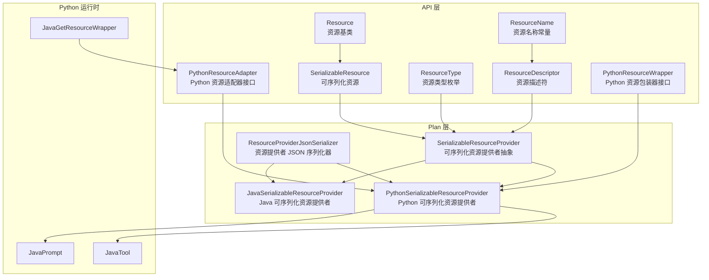
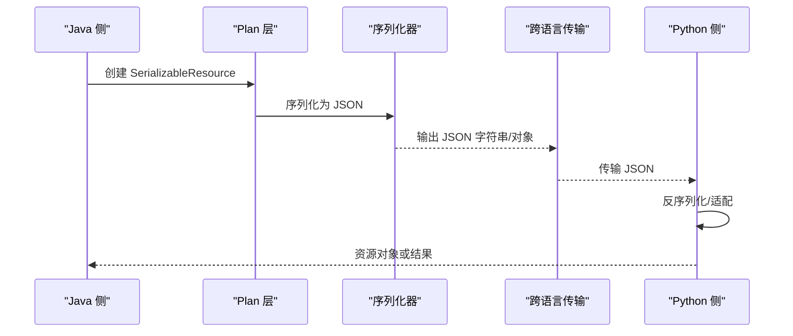
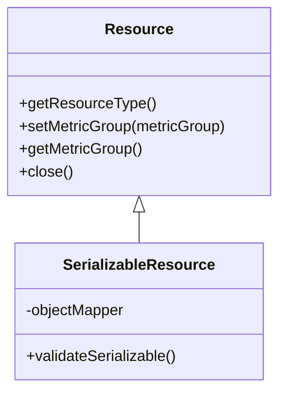
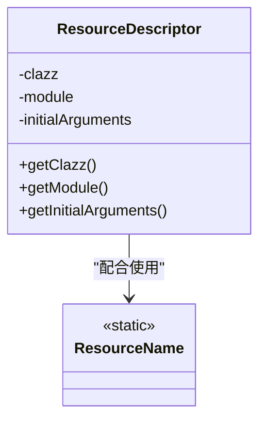
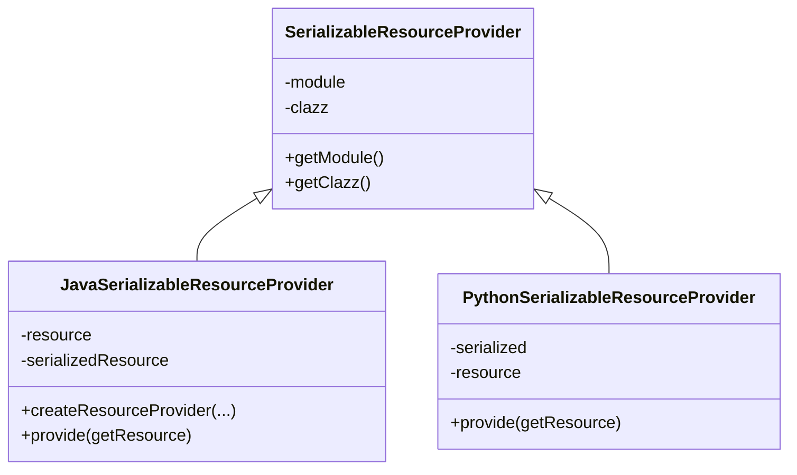
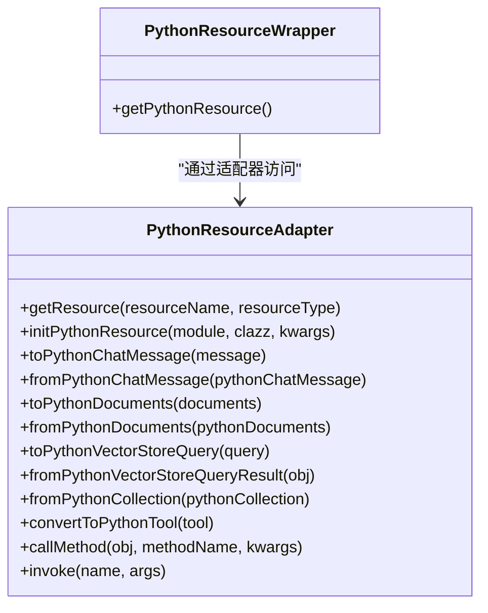
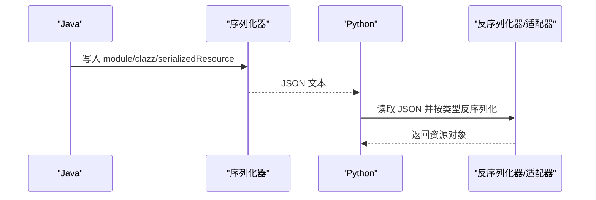
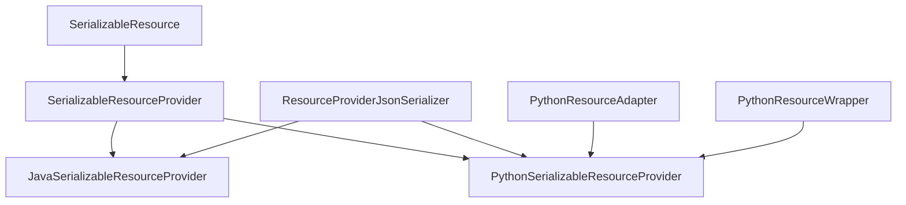

# 可序列化资源

<cite>
**本文引用的文件**
- [SerializableResource.java](file://api/src/main/java/org/apache/flink/agents/api/resource/SerializableResource.java)
- [Resource.java](file://api/src/main/java/org/apache/flink/agents/api/resource/Resource.java)
- [ResourceDescriptor.java](file://api/src/main/java/org/apache/flink/agents/api/resource/ResourceDescriptor.java)
- [ResourceName.java](file://api/src/main/java/org/apache/flink/agents/api/resource/ResourceName.java)
- [ResourceType.java](file://api/src/main/java/org/apache/flink/agents/api/resource/ResourceType.java)
- [SerializableResourceProvider.java](file://plan/src/main/java/org/apache/flink/agents/plan/resourceprovider/SerializableResourceProvider.java)
- [JavaSerializableResourceProvider.java](file://plan/src/main/java/org/apache/flink/agents/plan/resourceprovider/JavaSerializableResourceProvider.java)
- [PythonSerializableResourceProvider.java](file://plan/src/main/java/org/apache/flink/agents/plan/resourceprovider/PythonSerializableResourceProvider.java)
- [ResourceProviderJsonSerializer.java](file://plan/src/main/java/org/apache/flink/agents/plan/serializer/ResourceProviderJsonSerializer.java)
- [PythonResourceAdapter.java](file://api/src/main/java/org/apache/flink/agents/api/resource/python/PythonResourceAdapter.java)
- [PythonResourceWrapper.java](file://api/src/main/java/org/apache/flink/agents/api/resource/python/PythonResourceWrapper.java)
- [python_serializable_resource_provider.json](file://plan/src/test/resources/resource_providers/python_serializable_resource_provider.json)
- [JavaTool.java](file://python/flink_agents/runtime/java/java_resource_wrapper.py)
- [JavaPrompt.java](file://python/flink_agents/runtime/java/java_resource_wrapper.py)
- [JavaGetResourceWrapper.java](file://python/flink_agents/runtime/java/java_resource_wrapper.py)
- [Agent.java](file://api/src/main/java/org/apache/flink/agents/api/agents/Agent.java)
</cite>

## 目录
1. [引言](#引言)
2. [项目结构](#项目结构)
3. [核心组件](#核心组件)
4. [架构总览](#架构总览)
5. [详细组件分析](#详细组件分析)
6. [依赖关系分析](#依赖关系分析)
7. [性能考量](#性能考量)
8. [故障排除指南](#故障排除指南)
9. [结论](#结论)
10. [附录：实现指南与最佳实践](#附录实现指南与最佳实践)

## 引言
本技术文档聚焦于可序列化资源系统（Serializable Resource），系统性阐述其设计目标、在跨语言执行中的关键作用、与普通资源的区别、序列化与反序列化的实现机制，以及在 Java 与 Python 之间进行资源对象转换的技术细节。文档还提供可序列化资源的实现指南、版本兼容性与性能优化建议，并给出调试技巧与常见问题排查方法，辅以丰富的代码示例路径，帮助读者快速掌握可序列化资源的实际应用。

## 项目结构
可序列化资源系统横跨 API 层与 Plan 层，同时涉及 Python 端的适配器与包装器，形成“Java 资源声明/序列化 → Plan 序列化 → 跨语言传输 → Python 反序列化/适配”的闭环。

图表来源
- [Resource.java](file://api/src/main/java/org/apache/flink/agents/api/resource/Resource.java#L30-L70)
- [SerializableResource.java](file://api/src/main/java/org/apache/flink/agents/api/resource/SerializableResource.java#L30-L49)
- [ResourceDescriptor.java](file://api/src/main/java/org/apache/flink/agents/api/resource/ResourceDescriptor.java#L29-L72)
- [ResourceName.java](file://api/src/main/java/org/apache/flink/agents/api/resource/ResourceName.java#L43-L184)
- [ResourceType.java](file://api/src/main/java/org/apache/flink/agents/api/resource/ResourceType.java#L26-L44)
- [SerializableResourceProvider.java](file://plan/src/main/java/org/apache/flink/agents/plan/resourceprovider/SerializableResourceProvider.java#L30-L58)
- [JavaSerializableResourceProvider.java](file://plan/src/main/java/org/apache/flink/agents/plan/resourceprovider/JavaSerializableResourceProvider.java#L36-L94)
- [PythonSerializableResourceProvider.java](file://plan/src/main/java/org/apache/flink/agents/plan/resourceprovider/PythonSerializableResourceProvider.java#L37-L84)
- [ResourceProviderJsonSerializer.java](file://plan/src/main/java/org/apache/flink/agents/plan/serializer/ResourceProviderJsonSerializer.java#L49-L121)
- [PythonResourceAdapter.java](file://api/src/main/java/org/apache/flink/agents/api/resource/python/PythonResourceAdapter.java#L37-L140)
- [PythonResourceWrapper.java](file://api/src/main/java/org/apache/flink/agents/api/resource/python/PythonResourceWrapper.java#L24-L32)
- [JavaTool.java](file://python/flink_agents/runtime/java/java_resource_wrapper.py#L29-L42)
- [JavaPrompt.java](file://python/flink_agents/runtime/java/java_resource_wrapper.py#L43-L68)
- [JavaGetResourceWrapper.java](file://python/flink_agents/runtime/java/java_resource_wrapper.py#L69-L79)

章节来源
- [Resource.java](file://api/src/main/java/org/apache/flink/agents/api/resource/Resource.java#L30-L70)
- [SerializableResource.java](file://api/src/main/java/org/apache/flink/agents/api/resource/SerializableResource.java#L30-L49)
- [ResourceDescriptor.java](file://api/src/main/java/org/apache/flink/agents/api/resource/ResourceDescriptor.java#L29-L72)
- [ResourceName.java](file://api/src/main/java/org/apache/flink/agents/api/resource/ResourceName.java#L43-L184)
- [ResourceType.java](file://api/src/main/java/org/apache/flink/agents/api/resource/ResourceType.java#L26-L44)
- [SerializableResourceProvider.java](file://plan/src/main/java/org/apache/flink/agents/plan/resourceprovider/SerializableResourceProvider.java#L30-L58)
- [JavaSerializableResourceProvider.java](file://plan/src/main/java/org/apache/flink/agents/plan/resourceprovider/JavaSerializableResourceProvider.java#L36-L94)
- [PythonSerializableResourceProvider.java](file://plan/src/main/java/org/apache/flink/agents/plan/resourceprovider/PythonSerializableResourceProvider.java#L37-L84)
- [ResourceProviderJsonSerializer.java](file://plan/src/main/java/org/apache/flink/agents/plan/serializer/ResourceProviderJsonSerializer.java#L49-L121)
- [PythonResourceAdapter.java](file://api/src/main/java/org/apache/flink/agents/api/resource/python/PythonResourceAdapter.java#L37-L140)
- [PythonResourceWrapper.java](file://api/src/main/java/org/apache/flink/agents/api/resource/python/PythonResourceWrapper.java#L24-L32)
- [JavaTool.java](file://python/flink_agents/runtime/java/java_resource_wrapper.py#L29-L42)
- [JavaPrompt.java](file://python/flink_agents/runtime/java/java_resource_wrapper.py#L43-L68)
- [JavaGetResourceWrapper.java](file://python/flink_agents/runtime/java/java_resource_wrapper.py#L69-L79)

## 核心组件
- 可序列化资源基类：确保资源具备 JSON 可序列化能力，并提供运行时校验。
- 资源提供者抽象：区分 Java 与 Python 的可序列化资源提供者，统一模块名、类名与序列化载体。
- 跨语言适配器与包装器：在 Java 与 Python 之间桥接资源对象，完成数据转换与方法调用。
- 描述符与命名常量：为跨平台资源声明提供稳定的类名与模块路径映射。
- 序列化器：将资源提供者序列化为 JSON，便于跨语言传输与持久化。

章节来源
- [SerializableResource.java](file://api/src/main/java/org/apache/flink/agents/api/resource/SerializableResource.java#L30-L49)
- [SerializableResourceProvider.java](file://plan/src/main/java/org/apache/flink/agents/plan/resourceprovider/SerializableResourceProvider.java#L30-L58)
- [JavaSerializableResourceProvider.java](file://plan/src/main/java/org/apache/flink/agents/plan/resourceprovider/JavaSerializableResourceProvider.java#L36-L94)
- [PythonSerializableResourceProvider.java](file://plan/src/main/java/org/apache/flink/agents/plan/resourceprovider/PythonSerializableResourceProvider.java#L37-L84)
- [PythonResourceAdapter.java](file://api/src/main/java/org/apache/flink/agents/api/resource/python/PythonResourceAdapter.java#L37-L140)
- [PythonResourceWrapper.java](file://api/src/main/java/org/apache/flink/agents/api/resource/python/PythonResourceWrapper.java#L24-L32)
- [ResourceDescriptor.java](file://api/src/main/java/org/apache/flink/agents/api/resource/ResourceDescriptor.java#L29-L72)
- [ResourceName.java](file://api/src/main/java/org/apache/flink/agents/api/resource/ResourceName.java#L43-L184)
- [ResourceType.java](file://api/src/main/java/org/apache/flink/agents/api/resource/ResourceType.java#L26-L44)

## 架构总览
可序列化资源系统通过“声明期”与“运行期”两个阶段协作：
- 声明期：Java 侧定义可序列化资源，Plan 层将其封装为可序列化资源提供者，并序列化为 JSON。
- 运行期：Python 侧接收 JSON，反序列化为对应资源或通过适配器动态构造资源实例，完成跨语言调用。

图表来源
- [JavaSerializableResourceProvider.java](file://plan/src/main/java/org/apache/flink/agents/plan/resourceprovider/JavaSerializableResourceProvider.java#L64-L74)
- [ResourceProviderJsonSerializer.java](file://plan/src/main/java/org/apache/flink/agents/plan/serializer/ResourceProviderJsonSerializer.java#L101-L111)
- [PythonSerializableResourceProvider.java](file://plan/src/main/java/org/apache/flink/agents/plan/resourceprovider/PythonSerializableResourceProvider.java#L70-L84)
- [PythonResourceAdapter.java](file://api/src/main/java/org/apache/flink/agents/api/resource/python/PythonResourceAdapter.java#L37-L140)

## 详细组件分析

### 可序列化资源基类（SerializableResource）
- 设计目的：确保资源具备 JSON 可序列化能力，并在构建时进行校验，避免运行期因不可序列化导致失败。
- 关键点：
  - 使用 Jackson ObjectMapper 进行序列化校验。
  - 提供 validateSerializable 方法，异常即刻暴露问题。
- 适用场景：所有需要跨语言传输或持久化的资源都应继承该类。

图表来源
- [Resource.java](file://api/src/main/java/org/apache/flink/agents/api/resource/Resource.java#L30-L70)
- [SerializableResource.java](file://api/src/main/java/org/apache/flink/agents/api/resource/SerializableResource.java#L30-L49)

章节来源
- [SerializableResource.java](file://api/src/main/java/org/apache/flink/agents/api/resource/SerializableResource.java#L30-L49)
- [Resource.java](file://api/src/main/java/org/apache/flink/agents/api/resource/Resource.java#L30-L70)

### 资源描述符与命名常量（ResourceDescriptor、ResourceName）
- ResourceDescriptor：用于跨平台资源声明，支持 Java 类全名与 Python 模块路径分离，便于跨语言识别与初始化。
- ResourceName：集中管理资源类名，Java 与 Python 实现分别列出，保证一致性与可维护性。

图表来源
- [ResourceDescriptor.java](file://api/src/main/java/org/apache/flink/agents/api/resource/ResourceDescriptor.java#L29-L88)
- [ResourceName.java](file://api/src/main/java/org/apache/flink/agents/api/resource/ResourceName.java#L43-L184)

章节来源
- [ResourceDescriptor.java](file://api/src/main/java/org/apache/flink/agents/api/resource/ResourceDescriptor.java#L29-L88)
- [ResourceName.java](file://api/src/main/java/org/apache/flink/agents/api/resource/ResourceName.java#L43-L184)

### 资源类型枚举（ResourceType）
- 统一资源类型标识，支持聊天模型、嵌入模型、向量库、工具、提示词等。
- 便于序列化器与运行时根据类型选择正确的反序列化策略。

章节来源
- [ResourceType.java](file://api/src/main/java/org/apache/flink/agents/api/resource/ResourceType.java#L26-L44)

### 可序列化资源提供者（SerializableResourceProvider 及其实现）
- 抽象层：统一模块名、类名与类型信息，屏蔽 Java/Python 差异。
- Java 实现：在序列化时保存资源的 JSON 字符串；在反序列化时按类名动态加载并还原对象。
- Python 实现：在序列化时保存资源的字典结构；在反序列化时根据类型构造对应资源对象。

图表来源
- [SerializableResourceProvider.java](file://plan/src/main/java/org/apache/flink/agents/plan/resourceprovider/SerializableResourceProvider.java#L30-L58)
- [JavaSerializableResourceProvider.java](file://plan/src/main/java/org/apache/flink/agents/plan/resourceprovider/JavaSerializableResourceProvider.java#L36-L94)
- [PythonSerializableResourceProvider.java](file://plan/src/main/java/org/apache/flink/agents/plan/resourceprovider/PythonSerializableResourceProvider.java#L37-L84)

章节来源
- [SerializableResourceProvider.java](file://plan/src/main/java/org/apache/flink/agents/plan/resourceprovider/SerializableResourceProvider.java#L30-L58)
- [JavaSerializableResourceProvider.java](file://plan/src/main/java/org/apache/flink/agents/plan/resourceprovider/JavaSerializableResourceProvider.java#L36-L94)
- [PythonSerializableResourceProvider.java](file://plan/src/main/java/org/apache/flink/agents/plan/resourceprovider/PythonSerializableResourceProvider.java#L37-L84)

### 跨语言资源适配与包装（PythonResourceAdapter、PythonResourceWrapper）
- PythonResourceAdapter：提供从 Java 到 Python 的对象转换、方法调用与资源检索能力，是 Java 与 Python 交互的核心桥梁。
- PythonResourceWrapper：为封装 Python 资源的对象提供统一访问底层 Python 对象的接口，便于上层统一处理。

图表来源
- [PythonResourceAdapter.java](file://api/src/main/java/org/apache/flink/agents/api/resource/python/PythonResourceAdapter.java#L37-L140)
- [PythonResourceWrapper.java](file://api/src/main/java/org/apache/flink/agents/api/resource/python/PythonResourceWrapper.java#L24-L32)

章节来源
- [PythonResourceAdapter.java](file://api/src/main/java/org/apache/flink/agents/api/resource/python/PythonResourceAdapter.java#L37-L140)
- [PythonResourceWrapper.java](file://api/src/main/java/org/apache/flink/agents/api/resource/python/PythonResourceWrapper.java#L24-L32)

### 序列化与反序列化流程（JSON）
- Java 侧：通过序列化器将 Java 可序列化资源提供者写入 JSON，包含模块名、类名与序列化字符串。
- Python 侧：根据类型与序列化内容反序列化为具体资源对象，或通过适配器动态构造。

图表来源
- [ResourceProviderJsonSerializer.java](file://plan/src/main/java/org/apache/flink/agents/plan/serializer/ResourceProviderJsonSerializer.java#L75-L99)
- [JavaSerializableResourceProvider.java](file://plan/src/main/java/org/apache/flink/agents/plan/resourceprovider/JavaSerializableResourceProvider.java#L80-L94)
- [PythonSerializableResourceProvider.java](file://plan/src/main/java/org/apache/flink/agents/plan/resourceprovider/PythonSerializableResourceProvider.java#L70-L84)

章节来源
- [ResourceProviderJsonSerializer.java](file://plan/src/main/java/org/apache/flink/agents/plan/serializer/ResourceProviderJsonSerializer.java#L75-L99)
- [JavaSerializableResourceProvider.java](file://plan/src/main/java/org/apache/flink/agents/plan/resourceprovider/JavaSerializableResourceProvider.java#L80-L94)
- [PythonSerializableResourceProvider.java](file://plan/src/main/java/org/apache/flink/agents/plan/resourceprovider/PythonSerializableResourceProvider.java#L70-L84)

### 跨语言资源传递示例（JSON 结构）
- 测试资源提供者 JSON 示例展示了 Python 可序列化资源提供者的字段组织方式，包括模块名、类名、序列化内容与类型标记。

章节来源
- [python_serializable_resource_provider.json](file://plan/src/test/resources/resource_providers/python_serializable_resource_provider.json#L1-L39)

### Python 端 Java 资源包装（JavaTool、JavaPrompt、JavaGetResourceWrapper）
- JavaTool：用于承载 Java 工具元数据，使 Python 侧能识别并正确路由到 Java 执行环境。
- JavaPrompt：Python 侧对 Java Prompt 的包装，负责消息格式化与关闭逻辑。
- JavaGetResourceWrapper：Python 侧对 Java 资源适配器的包装，统一资源检索入口。

章节来源
- [JavaTool.java](file://python/flink_agents/runtime/java/java_resource_wrapper.py#L29-L42)
- [JavaPrompt.java](file://python/flink_agents/runtime/java/java_resource_wrapper.py#L43-L68)
- [JavaGetResourceWrapper.java](file://python/flink_agents/runtime/java/java_resource_wrapper.py#L69-L79)

## 依赖关系分析
- 组件耦合：
  - SerializableResourceProvider 是 Java 与 Python 可序列化资源提供者的共同父类，降低跨语言差异。
  - ResourceProviderJsonSerializer 针对不同提供者类型进行分支序列化，耦合度可控。
  - PythonResourceAdapter 与 PythonResourceWrapper 为 Python 侧提供统一的资源访问与转换接口。
- 外部依赖：
  - Jackson 用于 Java 侧序列化校验与 JSON 序列化。
  - pemja 用于 Python 与 Java 的互操作（在 PythonResourceAdapter 的注释中体现）。

图表来源
- [SerializableResource.java](file://api/src/main/java/org/apache/flink/agents/api/resource/SerializableResource.java#L30-L49)
- [SerializableResourceProvider.java](file://plan/src/main/java/org/apache/flink/agents/plan/resourceprovider/SerializableResourceProvider.java#L30-L58)
- [JavaSerializableResourceProvider.java](file://plan/src/main/java/org/apache/flink/agents/plan/resourceprovider/JavaSerializableResourceProvider.java#L36-L94)
- [PythonSerializableResourceProvider.java](file://plan/src/main/java/org/apache/flink/agents/plan/resourceprovider/PythonSerializableResourceProvider.java#L37-L84)
- [ResourceProviderJsonSerializer.java](file://plan/src/main/java/org/apache/flink/agents/plan/serializer/ResourceProviderJsonSerializer.java#L49-L121)
- [PythonResourceAdapter.java](file://api/src/main/java/org/apache/flink/agents/api/resource/python/PythonResourceAdapter.java#L37-L140)
- [PythonResourceWrapper.java](file://api/src/main/java/org/apache/flink/agents/api/resource/python/PythonResourceWrapper.java#L24-L32)

章节来源
- [ResourceProviderJsonSerializer.java](file://plan/src/main/java/org/apache/flink/agents/plan/serializer/ResourceProviderJsonSerializer.java#L49-L121)
- [PythonResourceAdapter.java](file://api/src/main/java/org/apache/flink/agents/api/resource/python/PythonResourceAdapter.java#L37-L140)
- [PythonResourceWrapper.java](file://api/src/main/java/org/apache/flink/agents/api/resource/python/PythonResourceWrapper.java#L24-L32)

## 性能考量
- 序列化成本控制：
  - 尽量减少可序列化资源中的大对象与冗余字段，优先序列化必要参数。
  - 使用 JavaSerializableResourceProvider 的 createResourceProvider 工厂方法，避免重复序列化。
- 反序列化缓存：
  - Java 侧在首次反序列化后缓存资源实例，避免重复反序列化开销。
  - Python 侧可对已反序列化的资源进行本地缓存，减少重复构造。
- 网络传输优化：
  - 合理拆分资源提供者 JSON，仅传输必要字段，避免携带过大的中间态数据。
- 类加载与反射：
  - Java 侧反序列化时通过上下文类加载器加载类，注意类路径与依赖完整性，避免类加载失败带来的重试成本。

## 故障排除指南
- 常见错误与定位：
  - “资源不可序列化”：检查资源是否包含不可序列化字段（如非静态内部类、未实现序列化接口的成员）。可通过 validateSerializable 快速定位。
  - “类型不匹配”：确认 Python 端的 module/clazz 与 Java 端一致，且类型枚举值匹配。
  - “反序列化失败”：核对 JSON 中的 serialized 或 serializedResource 字段是否完整，类名与模块路径是否正确。
  - “跨语言适配失败”：检查 PythonResourceAdapter 的方法签名与参数映射，确保数据类型转换正确。
- 调试建议：
  - 在 Java 侧打印序列化后的 JSON，核对字段完整性。
  - 在 Python 侧记录反序列化过程的日志，定位具体字段或类型问题。
  - 使用最小化资源示例复现问题，逐步增加复杂度缩小范围。

章节来源
- [SerializableResource.java](file://api/src/main/java/org/apache/flink/agents/api/resource/SerializableResource.java#L40-L48)
- [JavaSerializableResourceProvider.java](file://plan/src/main/java/org/apache/flink/agents/plan/resourceprovider/JavaSerializableResourceProvider.java#L80-L94)
- [PythonSerializableResourceProvider.java](file://plan/src/main/java/org/apache/flink/agents/plan/resourceprovider/PythonSerializableResourceProvider.java#L70-L84)
- [ResourceProviderJsonSerializer.java](file://plan/src/main/java/org/apache/flink/agents/plan/serializer/ResourceProviderJsonSerializer.java#L75-L99)
- [PythonResourceAdapter.java](file://api/src/main/java/org/apache/flink/agents/api/resource/python/PythonResourceAdapter.java#L37-L140)

## 结论
可序列化资源系统通过“可序列化基类 + 资源提供者 + 序列化器 + 跨语言适配器”的组合，实现了 Java 与 Python 之间的资源对象转换与调用。其关键价值在于：
- 明确区分“可序列化资源”与“普通资源”，确保跨语言传递的可靠性；
- 统一的序列化/反序列化流程与类型标识，简化跨语言集成；
- 通过描述符与命名常量保障跨平台一致性；
- 提供完善的调试与故障排除手段，降低集成风险。

## 附录：实现指南与最佳实践

### 如何实现一个可序列化资源
- 继承可序列化资源基类，确保资源具备 JSON 可序列化能力，并在构建时调用 validateSerializable。
- 在资源中避免持有不可序列化或易变状态，尽量将外部依赖通过 ResourceDescriptor 注入。
- 为资源提供稳定的类名与模块路径，便于跨语言识别。

章节来源
- [SerializableResource.java](file://api/src/main/java/org/apache/flink/agents/api/resource/SerializableResource.java#L30-L49)
- [ResourceDescriptor.java](file://api/src/main/java/org/apache/flink/agents/api/resource/ResourceDescriptor.java#L29-L88)

### 如何开发支持跨语言调用的资源类型
- Java 侧：
  - 使用 JavaSerializableResourceProvider.createResourceProvider 将资源序列化为 JSON。
  - 在 Plan 层注册资源提供者，确保类型与模块信息正确。
- Python 侧：
  - 使用 PythonSerializableResourceProvider 根据类型反序列化为具体资源对象。
  - 通过 PythonResourceAdapter 完成数据转换与方法调用。

章节来源
- [JavaSerializableResourceProvider.java](file://plan/src/main/java/org/apache/flink/agents/plan/resourceprovider/JavaSerializableResourceProvider.java#L64-L74)
- [PythonSerializableResourceProvider.java](file://plan/src/main/java/org/apache/flink/agents/plan/resourceprovider/PythonSerializableResourceProvider.java#L70-L84)
- [ResourceProviderJsonSerializer.java](file://plan/src/main/java/org/apache/flink/agents/plan/serializer/ResourceProviderJsonSerializer.java#L75-L99)
- [PythonResourceAdapter.java](file://api/src/main/java/org/apache/flink/agents/api/resource/python/PythonResourceAdapter.java#L37-L140)

### 序列化格式与版本兼容性
- JSON 字段建议：
  - name、type、module、clazz、serialized 或 serializedResource。
  - 通过 __resource_provider_type__ 标识提供者类型，便于反序列化时选择策略。
- 版本兼容：
  - 为新增字段提供默认值，避免旧版本解析失败。
  - 保持 module/clazz 的稳定性，避免跨语言映射失效。

章节来源
- [ResourceProviderJsonSerializer.java](file://plan/src/main/java/org/apache/flink/agents/plan/serializer/ResourceProviderJsonSerializer.java#L75-L99)
- [python_serializable_resource_provider.json](file://plan/src/test/resources/resource_providers/python_serializable_resource_provider.json#L1-L39)

### 性能优化建议
- 减少序列化体积：移除不必要的字段，合并配置项。
- 缓存策略：对反序列化后的资源进行缓存，避免重复构造。
- 类加载优化：确保类路径完整，减少类加载失败与重试。

### 调试技巧与示例路径
- 快速验证资源可序列化：调用 validateSerializable，捕获异常并查看堆栈。
- 核对 JSON 输出：参考测试资源提供者 JSON 示例，比对字段与类型。
- 资源注册与获取：通过 Agent.addResource 注册资源，再在运行时通过 RunnerContext 获取，验证类型与实例一致性。

章节来源
- [SerializableResource.java](file://api/src/main/java/org/apache/flink/agents/api/resource/SerializableResource.java#L40-L48)
- [Agent.java](file://api/src/main/java/org/apache/flink/agents/api/agents/Agent.java#L102-L111)
- [python_serializable_resource_provider.json](file://plan/src/test/resources/resource_providers/python_serializable_resource_provider.json#L1-L39)