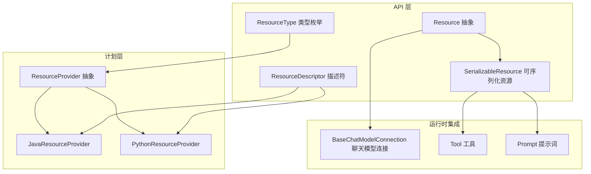
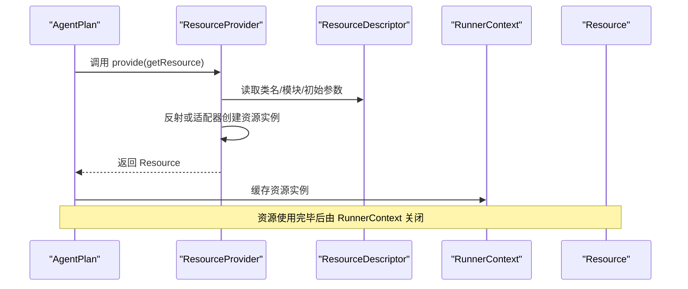
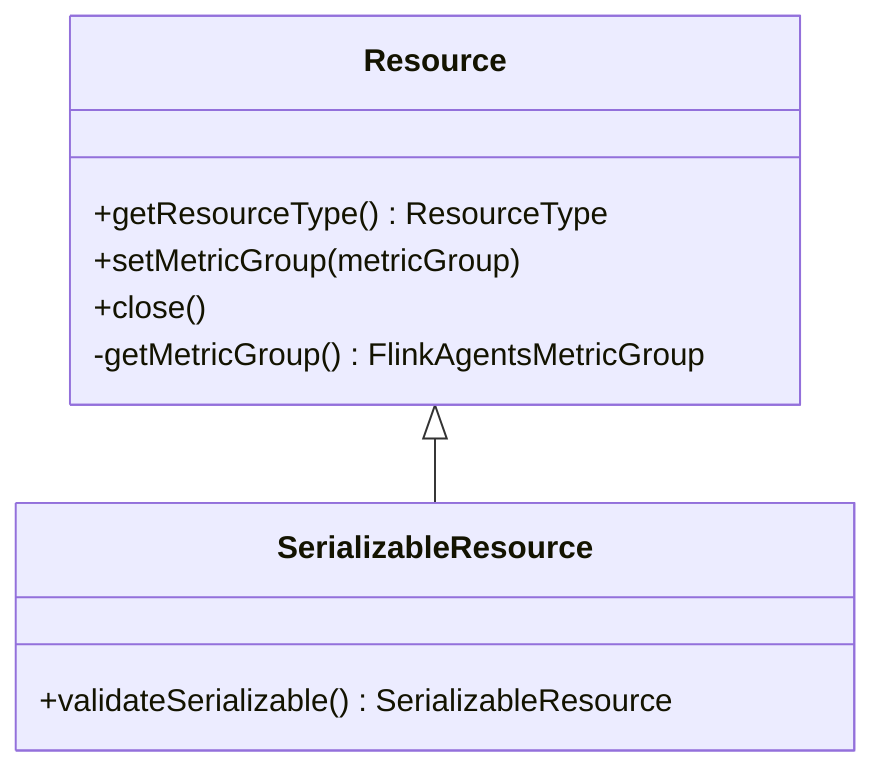
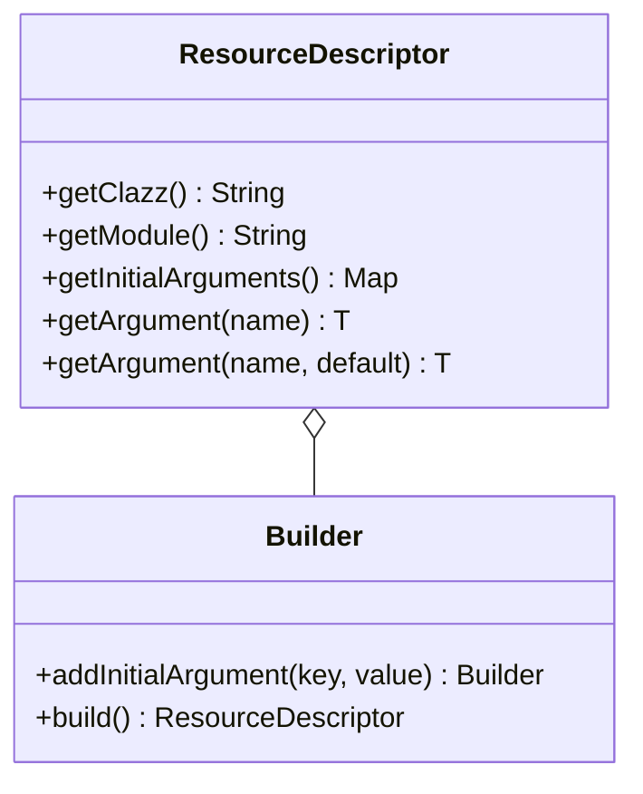
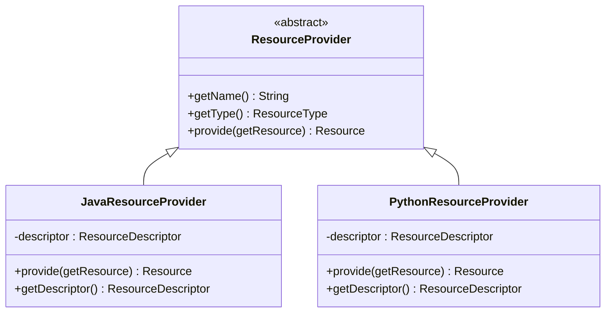
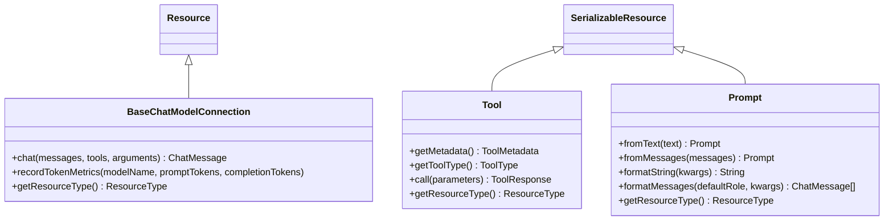
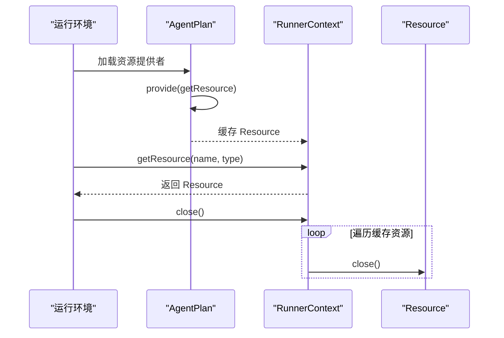
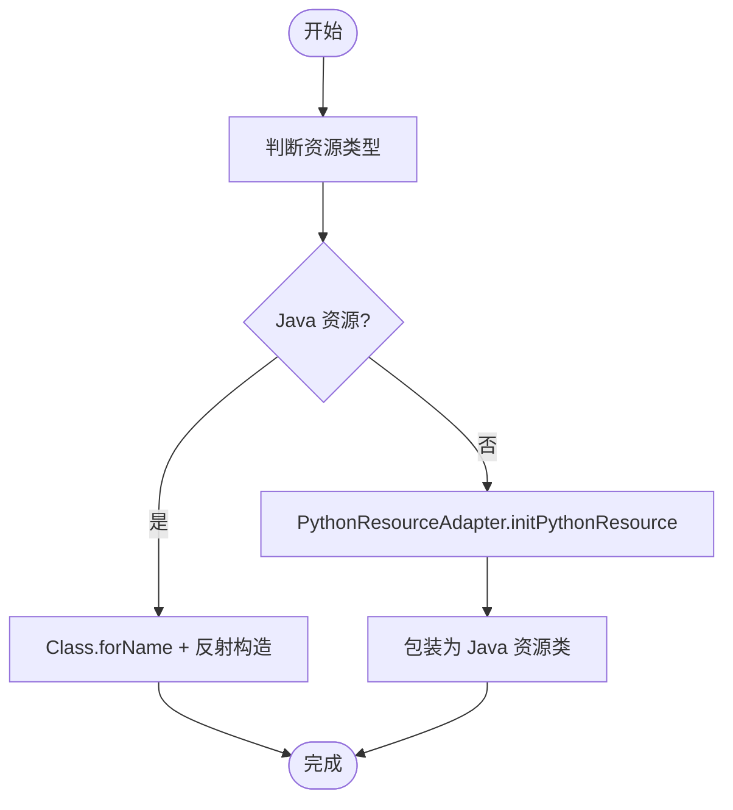
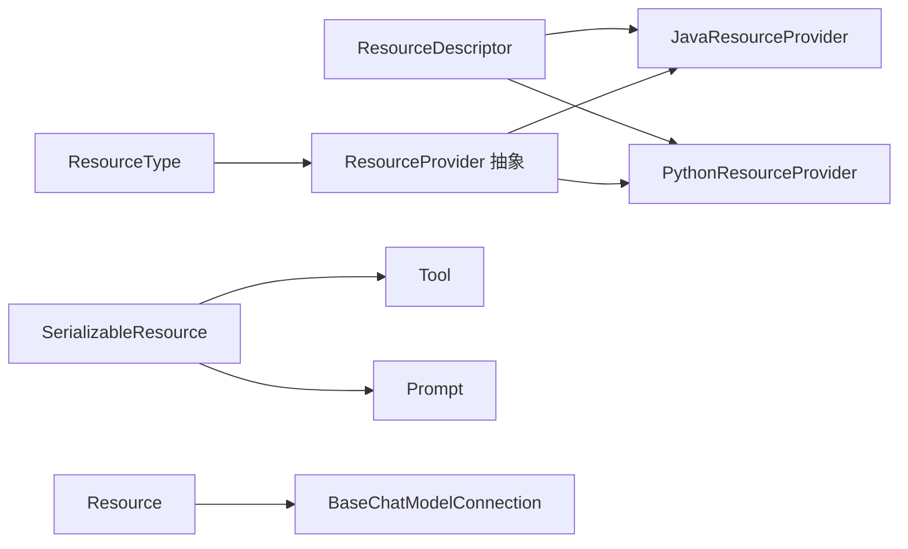

# 资源接口设计

<cite>
**本文引用的文件**
- [Resource.java](file://api/src/main/java/org/apache/flink/agents/api/resource/Resource.java)
- [ResourceDescriptor.java](file://api/src/main/java/org/apache/flink/agents/api/resource/ResourceDescriptor.java)
- [ResourceName.java](file://api/src/main/java/org/apache/flink/agents/api/resource/ResourceName.java)
- [ResourceType.java](file://api/src/main/java/org/apache/flink/agents/api/resource/ResourceType.java)
- [SerializableResource.java](file://api/src/main/java/org/apache/flink/agents/api/resource/SerializableResource.java)
- [ResourceProvider.java](file://plan/src/main/java/org/apache/flink/agents/plan/resourceprovider/ResourceProvider.java)
- [JavaResourceProvider.java](file://plan/src/main/java/org/apache/flink/agents/plan/resourceprovider/JavaResourceProvider.java)
- [PythonResourceProvider.java](file://plan/src/main/java/org/apache/flink/agents/plan/resourceprovider/PythonResourceProvider.java)
- [BaseChatModelConnection.java](file://api/src/main/java/org/apache/flink/agents/api/chat/model/BaseChatModelConnection.java)
- [Tool.java](file://api/src/main/java/org/apache/flink/agents/api/tools/Tool.java)
- [Prompt.java](file://api/src/main/java/org/apache/flink/agents/api/prompt/Prompt.java)
- [ResourceDescriptorTest.java](file://api/src/test/java/org/apache/flink/agents/api/resource/ResourceDescriptorTest.java)
- [ResourceProviderSerializerTest.java](file://plan/src/test/java/org/apache/flink/agents/plan/serializer/ResourceProviderSerializerTest.java)
- [AgentPlan.java](file://plan/src/main/java/org/apache/flink/agents/plan/AgentPlan.java)
- [RunnerContext.java](file://api/src/main/java/org/apache/flink/agents/api/context/RunnerContext.java)
</cite>

## 目录
1. [引言](#引言)
2. [项目结构](#项目结构)
3. [核心组件](#核心组件)
4. [架构总览](#架构总览)
5. [详细组件分析](#详细组件分析)
6. [依赖分析](#依赖分析)
7. [性能考虑](#性能考虑)
8. [故障排查指南](#故障排查指南)
9. [结论](#结论)
10. [附录：实现指南与最佳实践](#附录实现指南与最佳实践)

## 引言
本技术文档围绕资源接口系统进行深入解析，重点阐述 Resource 接口的设计原则、核心方法定义及其在资源管理系统中的基础地位；说明资源接口与资源描述符、资源提供者之间的协作关系；给出资源生命周期（初始化、使用、销毁）的接口约定；并提供基于 Resource 接口开发自定义资源类型的实现指南与最佳实践。文档同时通过序列图、类图与流程图展示关键交互与算法，帮助读者快速掌握资源接口体系。

## 项目结构
资源接口系统主要分布在以下模块：
- api 模块：定义资源抽象与通用能力（Resource、ResourceDescriptor、ResourceType、SerializableResource 等）
- plan 模块：定义资源提供者（ResourceProvider 及其 Java/Python 实现），负责在运行时创建资源实例
- 运行时与集成：具体资源类型（如聊天模型连接、工具、提示词）继承 Resource 或其可序列化基类
- 测试：验证资源描述符序列化、资源提供者序列化等行为

图表来源
- [Resource.java](file://api/src/main/java/org/apache/flink/agents/api/resource/Resource.java#L30-L70)
- [ResourceDescriptor.java](file://api/src/main/java/org/apache/flink/agents/api/resource/ResourceDescriptor.java#L29-L143)
- [ResourceType.java](file://api/src/main/java/org/apache/flink/agents/api/resource/ResourceType.java#L26-L61)
- [SerializableResource.java](file://api/src/main/java/org/apache/flink/agents/api/resource/SerializableResource.java#L30-L49)
- [ResourceProvider.java](file://plan/src/main/java/org/apache/flink/agents/plan/resourceprovider/ResourceProvider.java#L38-L75)
- [JavaResourceProvider.java](file://plan/src/main/java/org/apache/flink/agents/plan/resourceprovider/JavaResourceProvider.java#L29-L56)
- [PythonResourceProvider.java](file://plan/src/main/java/org/apache/flink/agents/plan/resourceprovider/PythonResourceProvider.java#L47-L148)
- [BaseChatModelConnection.java](file://api/src/main/java/org/apache/flink/agents/api/chat/model/BaseChatModelConnection.java#L38-L78)
- [Tool.java](file://api/src/main/java/org/apache/flink/agents/api/tools/Tool.java#L30-L69)
- [Prompt.java](file://api/src/main/java/org/apache/flink/agents/api/prompt/Prompt.java#L77-L121)

章节来源
- [Resource.java](file://api/src/main/java/org/apache/flink/agents/api/resource/Resource.java#L30-L70)
- [ResourceDescriptor.java](file://api/src/main/java/org/apache/flink/agents/api/resource/ResourceDescriptor.java#L29-L143)
- [ResourceType.java](file://api/src/main/java/org/apache/flink/agents/api/resource/ResourceType.java#L26-L61)
- [SerializableResource.java](file://api/src/main/java/org/apache/flink/agents/api/resource/SerializableResource.java#L30-L49)
- [ResourceProvider.java](file://plan/src/main/java/org/apache/flink/agents/plan/resourceprovider/ResourceProvider.java#L38-L75)
- [JavaResourceProvider.java](file://plan/src/main/java/org/apache/flink/agents/plan/resourceprovider/JavaResourceProvider.java#L29-L56)
- [PythonResourceProvider.java](file://plan/src/main/java/org/apache/flink/agents/plan/resourceprovider/PythonResourceProvider.java#L47-L148)
- [BaseChatModelConnection.java](file://api/src/main/java/org/apache/flink/agents/api/chat/model/BaseChatModelConnection.java#L38-L78)
- [Tool.java](file://api/src/main/java/org/apache/flink/agents/api/tools/Tool.java#L30-L69)
- [Prompt.java](file://api/src/main/java/org/apache/flink/agents/api/prompt/Prompt.java#L77-L121)

## 核心组件
- Resource 抽象：所有资源的基础抽象，提供资源类型查询、度量组绑定、关闭钩子等通用能力
- ResourceDescriptor：资源描述符，承载资源类名、模块路径与初始化参数，支持跨语言兼容
- ResourceType：资源类型枚举，统一管理资源类别
- SerializableResource：可序列化资源基类，确保资源可被序列化
- ResourceProvider 及其实现：负责在运行时根据描述符创建资源实例，分为 Java 与 Python 两类
- 具体资源类型：如聊天模型连接、工具、提示词等均继承 Resource 或 SerializableResource

章节来源
- [Resource.java](file://api/src/main/java/org/apache/flink/agents/api/resource/Resource.java#L30-L70)
- [ResourceDescriptor.java](file://api/src/main/java/org/apache/flink/agents/api/resource/ResourceDescriptor.java#L29-L143)
- [ResourceType.java](file://api/src/main/java/org/apache/flink/agents/api/resource/ResourceType.java#L26-L61)
- [SerializableResource.java](file://api/src/main/java/org/apache/flink/agents/api/resource/SerializableResource.java#L30-L49)
- [ResourceProvider.java](file://plan/src/main/java/org/apache/flink/agents/plan/resourceprovider/ResourceProvider.java#L38-L75)
- [JavaResourceProvider.java](file://plan/src/main/java/org/apache/flink/agents/plan/resourceprovider/JavaResourceProvider.java#L29-L56)
- [PythonResourceProvider.java](file://plan/src/main/java/org/apache/flink/agents/plan/resourceprovider/PythonResourceProvider.java#L47-L148)
- [BaseChatModelConnection.java](file://api/src/main/java/org/apache/flink/agents/api/chat/model/BaseChatModelConnection.java#L38-L78)
- [Tool.java](file://api/src/main/java/org/apache/flink/agents/api/tools/Tool.java#L30-L69)
- [Prompt.java](file://api/src/main/java/org/apache/flink/agents/api/prompt/Prompt.java#L77-L121)

## 架构总览
资源接口系统采用“描述符 + 提供者”的解耦设计：描述符携带资源元信息，提供者在运行时按需创建资源实例；资源类型通过枚举统一管理，便于扩展与序列化。运行时通过上下文函数按名称与类型获取其他资源，形成资源依赖网络。

图表来源
- [AgentPlan.java](file://plan/src/main/java/org/apache/flink/agents/plan/AgentPlan.java#L249-L281)
- [ResourceProvider.java](file://plan/src/main/java/org/apache/flink/agents/plan/resourceprovider/ResourceProvider.java#L73-L74)
- [JavaResourceProvider.java](file://plan/src/main/java/org/apache/flink/agents/plan/resourceprovider/JavaResourceProvider.java#L37-L51)
- [PythonResourceProvider.java](file://plan/src/main/java/org/apache/flink/agents/plan/resourceprovider/PythonResourceProvider.java#L76-L126)
- [RunnerContext.java](file://api/src/main/java/org/apache/flink/agents/api/context/RunnerContext.java#L135-L136)

## 详细组件分析

### Resource 抽象与生命周期
- 设计原则
  - 统一资源语义：所有资源共享资源类型、度量组绑定与关闭机制
  - 生命周期钩子：提供 close() 作为资源释放入口，便于统一回收
- 方法与约定
  - getResourceType(): 返回资源类型枚举
  - setMetricGroup()/getMetricGroup(): 绑定运行时度量组，用于指标上报
  - close(): 默认空实现，具体资源应覆盖以释放外部资源
- 生命周期阶段
  - 初始化：构造时接收 ResourceDescriptor 与 getResource 函数
  - 使用：在动作执行中通过 RunnerContext 获取并使用
  - 销毁：RunnerContext 在作业结束时调用 close()

图表来源
- [Resource.java](file://api/src/main/java/org/apache/flink/agents/api/resource/Resource.java#L30-L70)
- [SerializableResource.java](file://api/src/main/java/org/apache/flink/agents/api/resource/SerializableResource.java#L30-L49)

章节来源
- [Resource.java](file://api/src/main/java/org/apache/flink/agents/api/resource/Resource.java#L30-L70)
- [SerializableResource.java](file://api/src/main/java/org/apache/flink/agents/api/resource/SerializableResource.java#L30-L49)

### ResourceDescriptor：资源描述符
- 能力
  - 记录资源类名、模块路径与初始化参数，支持跨语言兼容
  - 提供 Builder 构建器，简化参数配置
  - 支持 Jackson 序列化，便于在计划层传递与持久化
- 关键字段
  - clazz：资源类标识（Java 全限定名或 Python 简称）
  - module：Python 模块路径（Java 资源可为空）
  - initialArguments：初始化参数映射
- 使用场景
  - Java 资源：直接指定 Java 全限定类名
  - Python 资源：通过 module 指定模块路径，或在 initialArguments 中携带 java_clazz 映射

图表来源
- [ResourceDescriptor.java](file://api/src/main/java/org/apache/flink/agents/api/resource/ResourceDescriptor.java#L29-L143)

章节来源
- [ResourceDescriptor.java](file://api/src/main/java/org/apache/flink/agents/api/resource/ResourceDescriptor.java#L29-L143)
- [ResourceDescriptorTest.java](file://api/src/test/java/org/apache/flink/agents/api/resource/ResourceDescriptorTest.java#L32-L54)

### ResourceType：资源类型枚举
- 覆盖范围：聊天模型、嵌入模型、向量库、工具、提示词、MCP 服务器等
- 用途：统一资源分类，驱动提供者选择与序列化/反序列化
- 扩展性：新增资源类型只需在枚举中添加条目并配套提供者实现

章节来源
- [ResourceType.java](file://api/src/main/java/org/apache/flink/agents/api/resource/ResourceType.java#L26-L61)

### ResourceProvider 及其实现：资源提供者
- 抽象职责
  - 携带资源元数据并在运行时创建资源实例
  - 通过 BiFunction<String, ResourceType, Resource> 提供对其他资源的获取能力
- JavaResourceProvider
  - 基于反射加载类，调用带 ResourceDescriptor 与 getResource 的构造函数
  - 支持从 initialArguments 中提取 java_clazz 以兼容跨语言声明
- PythonResourceProvider
  - 通过 PythonResourceAdapter 初始化 Python 资源对象
  - 将 Python 对象包装为对应 Java 资源类型（如聊天模型连接、嵌入模型连接、向量库、MCP 服务器）

图表来源
- [ResourceProvider.java](file://plan/src/main/java/org/apache/flink/agents/plan/resourceprovider/ResourceProvider.java#L38-L75)
- [JavaResourceProvider.java](file://plan/src/main/java/org/apache/flink/agents/plan/resourceprovider/JavaResourceProvider.java#L29-L56)
- [PythonResourceProvider.java](file://plan/src/main/java/org/apache/flink/agents/plan/resourceprovider/PythonResourceProvider.java#L47-L148)

章节来源
- [ResourceProvider.java](file://plan/src/main/java/org/apache/flink/agents/plan/resourceprovider/ResourceProvider.java#L38-L75)
- [JavaResourceProvider.java](file://plan/src/main/java/org/apache/flink/agents/plan/resourceprovider/JavaResourceProvider.java#L29-L56)
- [PythonResourceProvider.java](file://plan/src/main/java/org/apache/flink/agents/plan/resourceprovider/PythonResourceProvider.java#L47-L148)

### 具体资源类型：聊天模型连接、工具、提示词
- BaseChatModelConnection
  - 继承 Resource，提供聊天请求处理与令牌用量指标记录
  - getResourceType() 返回 CHAT_MODEL_CONNECTION
- Tool
  - 继承 SerializableResource，提供工具元数据、类型与调用接口
  - getResourceType() 返回 TOOL
- Prompt
  - 继承 SerializableResource，提供字符串与消息模板格式化能力
  - getResourceType() 返回 PROMPT

图表来源
- [BaseChatModelConnection.java](file://api/src/main/java/org/apache/flink/agents/api/chat/model/BaseChatModelConnection.java#L38-L78)
- [Tool.java](file://api/src/main/java/org/apache/flink/agents/api/tools/Tool.java#L30-L69)
- [Prompt.java](file://api/src/main/java/org/apache/flink/agents/api/prompt/Prompt.java#L77-L121)

章节来源
- [BaseChatModelConnection.java](file://api/src/main/java/org/apache/flink/agents/api/chat/model/BaseChatModelConnection.java#L38-L78)
- [Tool.java](file://api/src/main/java/org/apache/flink/agents/api/tools/Tool.java#L30-L69)
- [Prompt.java](file://api/src/main/java/org/apache/flink/agents/api/prompt/Prompt.java#L77-L121)

### 资源生命周期管理与 RunnerContext 协作
- 初始化：AgentPlan 在运行时根据 ResourceProvider 创建资源，并通过 RunnerContext 缓存
- 使用：动作执行期间通过 RunnerContext 按名称与类型获取资源
- 销毁：RunnerContext 调用 close() 逐个释放资源

图表来源
- [AgentPlan.java](file://plan/src/main/java/org/apache/flink/agents/plan/AgentPlan.java#L249-L281)
- [RunnerContext.java](file://api/src/main/java/org/apache/flink/agents/api/context/RunnerContext.java#L135-L136)

章节来源
- [AgentPlan.java](file://plan/src/main/java/org/apache/flink/agents/plan/AgentPlan.java#L249-L281)
- [RunnerContext.java](file://api/src/main/java/org/apache/flink/agents/api/context/RunnerContext.java#L135-L136)

### 资源接口方法签名与返回值规范
- Resource
  - getResourceType(): 返回 ResourceType
  - setMetricGroup(metricGroup): void
  - close(): void（默认空实现）
- SerializableResource
  - validateSerializable(): 返回当前实例或抛出非法参数异常
- BaseChatModelConnection
  - chat(messages, tools, arguments): 返回 ChatMessage
  - recordTokenMetrics(modelName, promptTokens, completionTokens): 无返回（内部指标上报）
- Tool
  - call(parameters): 返回 ToolResponse
  - getToolType(): 返回 ToolType
- Prompt
  - formatString(kwargs): 返回格式化后的字符串
  - formatMessages(defaultRole, kwargs): 返回格式化后的消息列表

章节来源
- [Resource.java](file://api/src/main/java/org/apache/flink/agents/api/resource/Resource.java#L48-L69)
- [SerializableResource.java](file://api/src/main/java/org/apache/flink/agents/api/resource/SerializableResource.java#L40-L48)
- [BaseChatModelConnection.java](file://api/src/main/java/org/apache/flink/agents/api/chat/model/BaseChatModelConnection.java#L58-L77)
- [Tool.java](file://api/src/main/java/org/apache/flink/agents/api/tools/Tool.java#L52-L53)
- [Prompt.java](file://api/src/main/java/org/apache/flink/agents/api/prompt/Prompt.java#L105-L115)

### 资源协作关系：ResourceDescriptor 与 ResourceProvider
- Java 资源
  - JavaResourceProvider 通过 Class.forName 与反射构造资源实例，构造函数签名要求包含 ResourceDescriptor 与 BiFunction
- Python 资源
  - PythonResourceProvider 通过 PythonResourceAdapter 初始化 Python 对象，并以相同签名构造对应的 Java 包装类
  - 支持动态映射 ResourceType 到 Java 包装类，以及 MCP 服务器的特殊处理

图表来源
- [JavaResourceProvider.java](file://plan/src/main/java/org/apache/flink/agents/plan/resourceprovider/JavaResourceProvider.java#L46-L51)
- [PythonResourceProvider.java](file://plan/src/main/java/org/apache/flink/agents/plan/resourceprovider/PythonResourceProvider.java#L117-L126)

章节来源
- [JavaResourceProvider.java](file://plan/src/main/java/org/apache/flink/agents/plan/resourceprovider/JavaResourceProvider.java#L29-L56)
- [PythonResourceProvider.java](file://plan/src/main/java/org/apache/flink/agents/plan/resourceprovider/PythonResourceProvider.java#L47-L148)

## 依赖分析
- 耦合与内聚
  - Resource 与 SerializableResource 形成清晰的抽象层次，具体资源类型内聚在各自包下
  - ResourceProvider 与 ResourceDescriptor 解耦，便于跨语言扩展
- 外部依赖
  - Jackson 用于序列化/反序列化 ResourceDescriptor 与资源提供者
  - 反射与类加载用于 Java 资源实例化
  - PythonResourceAdapter 用于 Python 资源初始化与桥接

图表来源
- [ResourceDescriptor.java](file://api/src/main/java/org/apache/flink/agents/api/resource/ResourceDescriptor.java#L29-L143)
- [ResourceProvider.java](file://plan/src/main/java/org/apache/flink/agents/plan/resourceprovider/ResourceProvider.java#L38-L75)
- [JavaResourceProvider.java](file://plan/src/main/java/org/apache/flink/agents/plan/resourceprovider/JavaResourceProvider.java#L29-L56)
- [PythonResourceProvider.java](file://plan/src/main/java/org/apache/flink/agents/plan/resourceprovider/PythonResourceProvider.java#L47-L148)
- [SerializableResource.java](file://api/src/main/java/org/apache/flink/agents/api/resource/SerializableResource.java#L30-L49)
- [Tool.java](file://api/src/main/java/org/apache/flink/agents/api/tools/Tool.java#L30-L69)
- [Prompt.java](file://api/src/main/java/org/apache/flink/agents/api/prompt/Prompt.java#L77-L121)
- [BaseChatModelConnection.java](file://api/src/main/java/org/apache/flink/agents/api/chat/model/BaseChatModelConnection.java#L38-L78)

章节来源
- [ResourceDescriptor.java](file://api/src/main/java/org/apache/flink/agents/api/resource/ResourceDescriptor.java#L29-L143)
- [ResourceProvider.java](file://plan/src/main/java/org/apache/flink/agents/plan/resourceprovider/ResourceProvider.java#L38-L75)
- [JavaResourceProvider.java](file://plan/src/main/java/org/apache/flink/agents/plan/resourceprovider/JavaResourceProvider.java#L29-L56)
- [PythonResourceProvider.java](file://plan/src/main/java/org/apache/flink/agents/plan/resourceprovider/PythonResourceProvider.java#L47-L148)
- [SerializableResource.java](file://api/src/main/java/org/apache/flink/agents/api/resource/SerializableResource.java#L30-L49)
- [Tool.java](file://api/src/main/java/org/apache/flink/agents/api/tools/Tool.java#L30-L69)
- [Prompt.java](file://api/src/main/java/org/apache/flink/agents/api/prompt/Prompt.java#L77-L121)
- [BaseChatModelConnection.java](file://api/src/main/java/org/apache/flink/agents/api/chat/model/BaseChatModelConnection.java#L38-L78)

## 性能考虑
- 反射开销：JavaResourceProvider 通过反射创建实例，建议在资源池或缓存中复用实例
- 度量上报：BaseChatModelConnection 的指标上报为轻量级操作，避免在高频路径中重复计算
- 序列化成本：ResourceDescriptor 与资源提供者的序列化用于计划传输，建议在构建期完成，运行时尽量避免频繁序列化
- Python 适配器：PythonResourceProvider 依赖 PythonResourceAdapter，注意 Python 环境初始化与对象生命周期管理

## 故障排查指南
- 资源描述符序列化失败
  - 症状：序列化/反序列化异常或参数丢失
  - 排查：确认 ResourceDescriptor 的 initialArguments 仅包含可序列化对象；参考测试用例验证
- Java 资源类加载失败
  - 症状：ClassNotFoundException 或构造函数不匹配
  - 排查：确认 ResourceDescriptor.clazz 为有效全限定类名；构造函数签名必须包含 ResourceDescriptor 与 BiFunction
- Python 资源初始化失败
  - 症状：PythonResourceAdapter 未设置或初始化异常
  - 排查：确保在 AgentPlan 中设置 PythonResourceAdapter；检查 module 与 clazz 配置
- 资源关闭未生效
  - 症状：资源泄漏或句柄未释放
  - 排查：确认 RunnerContext 在作业结束时调用 close；具体资源是否正确覆盖 close()

章节来源
- [ResourceDescriptorTest.java](file://api/src/test/java/org/apache/flink/agents/api/resource/ResourceDescriptorTest.java#L32-L54)
- [ResourceProviderSerializerTest.java](file://plan/src/test/java/org/apache/flink/agents/plan/serializer/ResourceProviderSerializerTest.java#L58-L86)
- [JavaResourceProvider.java](file://plan/src/main/java/org/apache/flink/agents/plan/resourceprovider/JavaResourceProvider.java#L46-L51)
- [PythonResourceProvider.java](file://plan/src/main/java/org/apache/flink/agents/plan/resourceprovider/PythonResourceProvider.java#L76-L126)
- [AgentPlan.java](file://plan/src/main/java/org/apache/flink/agents/plan/AgentPlan.java#L274-L281)

## 结论
资源接口系统通过 Resource 抽象、ResourceDescriptor 描述符与 ResourceProvider 提供者三者协同，实现了资源的统一建模、跨语言兼容与生命周期管理。该设计既保证了扩展性（新增资源类型只需实现对应提供者与包装类），又兼顾了运行时性能与可维护性。结合度量组绑定与统一关闭机制，资源接口为上层动作执行提供了稳定可靠的基础能力。

## 附录：实现指南与最佳实践
- 自定义资源类型实现步骤
  - 定义资源类型枚举项（如 ResourceType.XXX）
  - 编写资源实现类，继承 Resource 或 SerializableResource
  - 提供带 ResourceDescriptor 与 BiFunction 的构造函数
  - 在计划层编写 ResourceProvider 实现（Java/Python），按需设置 BiFunction 回调
  - 如需跨语言，准备 Python 包装类并通过 PythonResourceAdapter 初始化
- 线程安全
  - 资源实例通常由 RunnerContext 管理，避免在资源内部保存全局可变状态
  - 若资源持有外部连接，请在 close() 中显式释放
- 资源清理
  - 在 close() 中释放文件句柄、网络连接、线程池等资源
  - 使用度量组记录关键指标，便于监控与排障
- 异常处理
  - provide() 中捕获并转换底层异常为运行时异常，便于上层统一处理
  - validateSerializable() 用于在构建期发现不可序列化问题
- 示例参考
  - 聊天模型连接：参考 BaseChatModelConnection 的构造与方法签名
  - 工具：参考 Tool 的元数据与调用接口
  - 提示词：参考 Prompt 的工厂方法与格式化接口

章节来源
- [Resource.java](file://api/src/main/java/org/apache/flink/agents/api/resource/Resource.java#L36-L39)
- [SerializableResource.java](file://api/src/main/java/org/apache/flink/agents/api/resource/SerializableResource.java#L40-L48)
- [ResourceProvider.java](file://plan/src/main/java/org/apache/flink/agents/plan/resourceprovider/ResourceProvider.java#L73-L74)
- [JavaResourceProvider.java](file://plan/src/main/java/org/apache/flink/agents/plan/resourceprovider/JavaResourceProvider.java#L46-L51)
- [PythonResourceProvider.java](file://plan/src/main/java/org/apache/flink/agents/plan/resourceprovider/PythonResourceProvider.java#L117-L126)
- [BaseChatModelConnection.java](file://api/src/main/java/org/apache/flink/agents/api/chat/model/BaseChatModelConnection.java#L40-L48)
- [Tool.java](file://api/src/main/java/org/apache/flink/agents/api/tools/Tool.java#L34-L36)
- [Prompt.java](file://api/src/main/java/org/apache/flink/agents/api/prompt/Prompt.java#L85-L97)