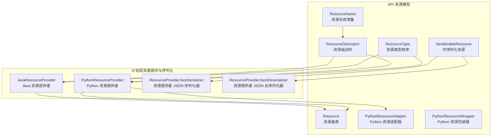
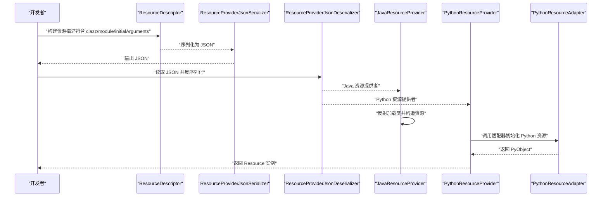
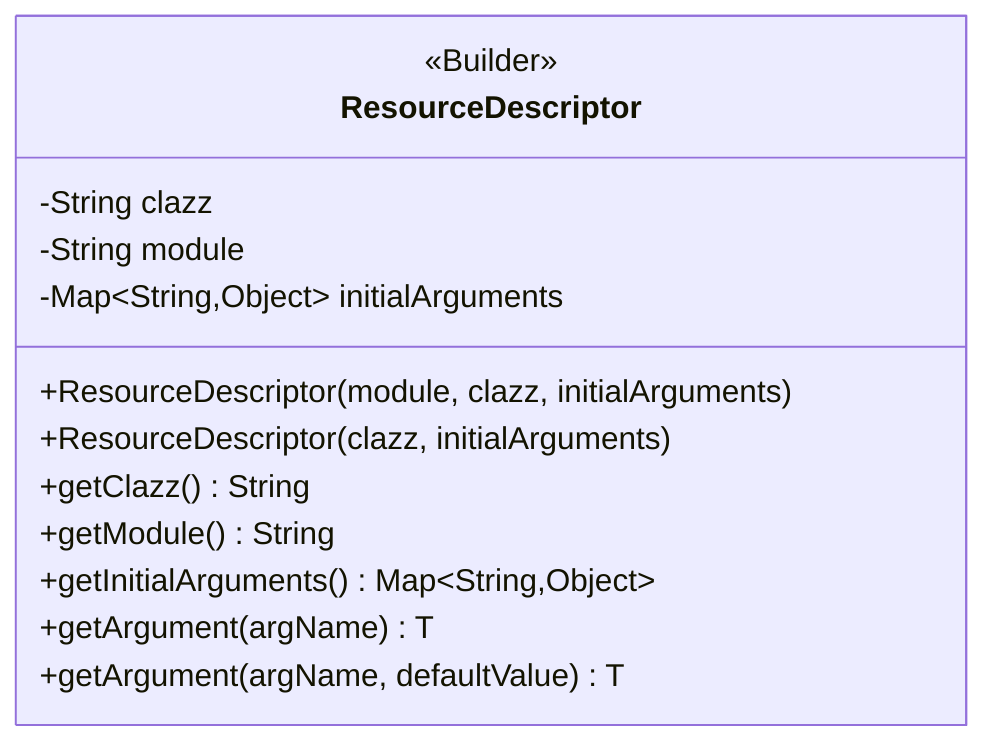
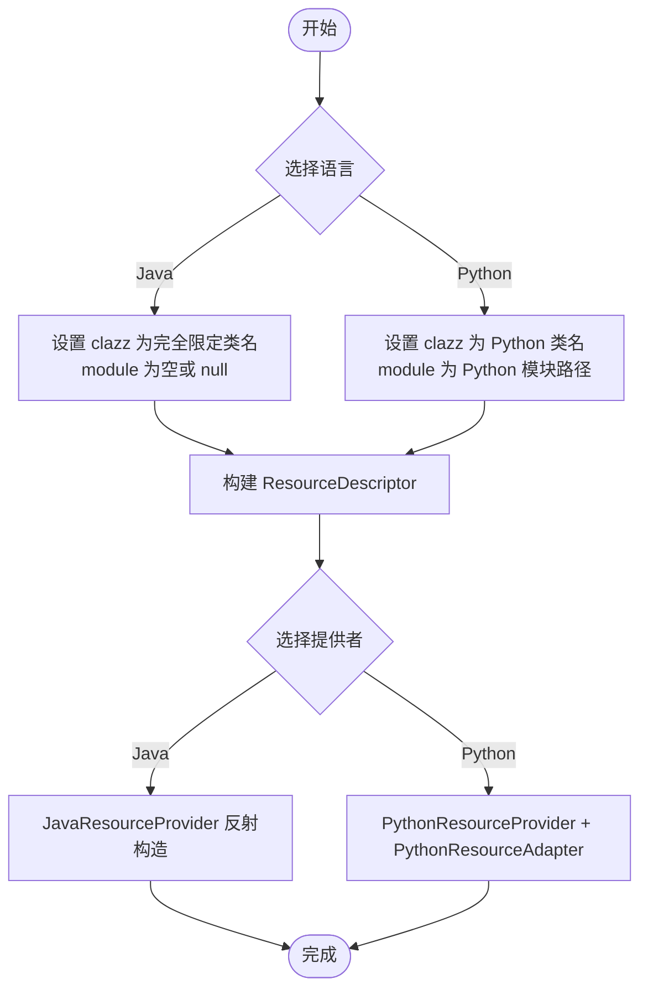
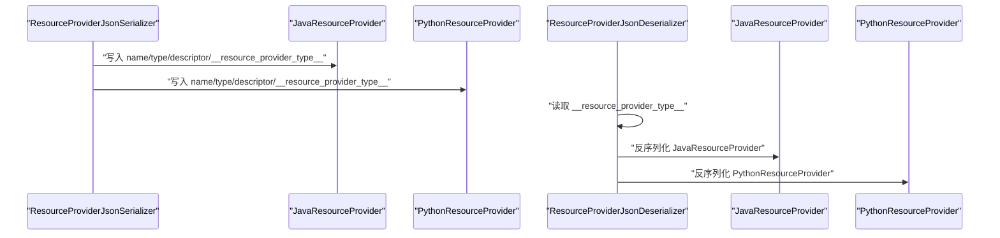
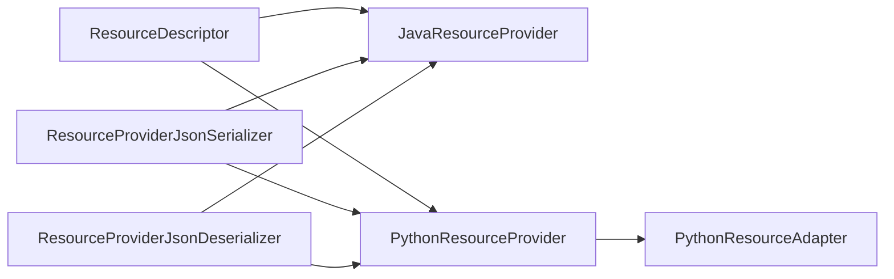

# 资源描述符

<cite>
**本文引用的文件**
- [ResourceDescriptor.java](file://api/src/main/java/org/apache/flink/agents/api/resource/ResourceDescriptor.java)
- [Resource.java](file://api/src/main/java/org/apache/flink/agents/api/resource/Resource.java)
- [ResourceType.java](file://api/src/main/java/org/apache/flink/agents/api/resource/ResourceType.java)
- [ResourceName.java](file://api/src/main/java/org/apache/flink/agents/api/resource/ResourceName.java)
- [SerializableResource.java](file://api/src/main/java/org/apache/flink/agents/api/resource/SerializableResource.java)
- [PythonResourceAdapter.java](file://api/src/main/java/org/apache/flink/agents/api/resource/python/PythonResourceAdapter.java)
- [PythonResourceWrapper.java](file://api/src/main/java/org/apache/flink/agents/api/resource/python/PythonResourceWrapper.java)
- [JavaResourceProvider.java](file://plan/src/main/java/org/apache/flink/agents/plan/resourceprovider/JavaResourceProvider.java)
- [PythonResourceProvider.java](file://plan/src/main/java/org/apache/flink/agents/plan/resourceprovider/PythonResourceProvider.java)
- [ResourceProviderJsonDeserializer.java](file://plan/src/main/java/org/apache/flink/agents/plan/serializer/ResourceProviderJsonDeserializer.java)
- [ResourceProviderJsonSerializer.java](file://plan/src/main/java/org/apache/flink/agents/plan/serializer/ResourceProviderJsonSerializer.java)
- [ResourceDescriptorTest.java](file://api/src/test/java/org/apache/flink/agents/api/resource/ResourceDescriptorTest.java)
- [agent_plan_with_python_resource_providers.json](file://plan/src/test/resources/agent_plans/agent_plan_with_python_resource_providers.json)
</cite>

## 目录
1. [简介](#简介)
2. [项目结构](#项目结构)
3. [核心组件](#核心组件)
4. [架构总览](#架构总览)
5. [组件详解](#组件详解)
6. [依赖关系分析](#依赖关系分析)
7. [性能考量](#性能考量)
8. [故障排查指南](#故障排查指南)
9. [结论](#结论)
10. [附录](#附录)

## 简介
本文件围绕资源描述符系统进行深入技术说明，重点解析 ResourceDescriptor 的设计理念与实现细节，并阐明其在跨平台资源管理中的关键作用。文档覆盖以下主题：
- 构造函数参数语义：clazz、module、initialArguments 的含义与用法
- Builder 模式使用方法与最佳实践
- 不同类型资源的声明方式：Java 资源与 Python 资源
- 序列化机制与 JSON 字段映射关系
- 参数校验、默认值处理与错误处理策略

## 项目结构
资源描述符系统位于 API 层，配合计划层的资源提供者与序列化器完成跨语言资源的声明、传输与实例化。

图表来源
- [ResourceDescriptor.java](file://api/src/main/java/org/apache/flink/agents/api/resource/ResourceDescriptor.java#L29-L144)
- [Resource.java](file://api/src/main/java/org/apache/flink/agents/api/resource/Resource.java#L30-L71)
- [ResourceType.java](file://api/src/main/java/org/apache/flink/agents/api/resource/ResourceType.java#L26-L61)
- [ResourceName.java](file://api/src/main/java/org/apache/flink/agents/api/resource/ResourceName.java#L43-L185)
- [SerializableResource.java](file://api/src/main/java/org/apache/flink/agents/api/resource/SerializableResource.java#L30-L50)
- [PythonResourceAdapter.java](file://api/src/main/java/org/apache/flink/agents/api/resource/python/PythonResourceAdapter.java#L37-L141)
- [PythonResourceWrapper.java](file://api/src/main/java/org/apache/flink/agents/api/resource/python/PythonResourceWrapper.java#L24-L33)
- [JavaResourceProvider.java](file://plan/src/main/java/org/apache/flink/agents/plan/resourceprovider/JavaResourceProvider.java#L29-L57)
- [PythonResourceProvider.java](file://plan/src/main/java/org/apache/flink/agents/plan/resourceprovider/PythonResourceProvider.java#L47-L149)
- [ResourceProviderJsonSerializer.java](file://plan/src/main/java/org/apache/flink/agents/plan/serializer/ResourceProviderJsonSerializer.java#L36-L122)
- [ResourceProviderJsonDeserializer.java](file://plan/src/main/java/org/apache/flink/agents/plan/serializer/ResourceProviderJsonDeserializer.java#L43-L125)

章节来源
- [ResourceDescriptor.java](file://api/src/main/java/org/apache/flink/agents/api/resource/ResourceDescriptor.java#L29-L144)
- [JavaResourceProvider.java](file://plan/src/main/java/org/apache/flink/agents/plan/resourceprovider/JavaResourceProvider.java#L29-L57)
- [PythonResourceProvider.java](file://plan/src/main/java/org/apache/flink/agents/plan/resourceprovider/PythonResourceProvider.java#L47-L149)
- [ResourceProviderJsonSerializer.java](file://plan/src/main/java/org/apache/flink/agents/plan/serializer/ResourceProviderJsonSerializer.java#L36-L122)
- [ResourceProviderJsonDeserializer.java](file://plan/src/main/java/org/apache/flink/agents/plan/serializer/ResourceProviderJsonDeserializer.java#L43-L125)

## 核心组件
- ResourceDescriptor：跨平台资源描述符，承载资源类名、模块路径与初始化参数，支持 Java 与 Python 资源声明。
- Resource：资源抽象基类，定义资源生命周期与度量组绑定。
- ResourceType：资源类型枚举，统一资源类型标识。
- ResourceName：资源名称常量集合，提供 Java 与 Python 实现的类名映射。
- SerializableResource：可序列化资源基类，提供 JSON 可序列化性校验。
- PythonResourceAdapter：Java 与 Python 互操作适配器，负责 Python 对象初始化与数据转换。
- PythonResourceWrapper：Python 资源包装器接口，统一访问底层 Python 资源对象。
- JavaResourceProvider / PythonResourceProvider：资源提供者，负责根据描述符在运行时创建具体资源实例。
- ResourceProviderJsonSerializer / ResourceProviderJsonDeserializer：资源提供者的 JSON 序列化与反序列化器。

章节来源
- [ResourceDescriptor.java](file://api/src/main/java/org/apache/flink/agents/api/resource/ResourceDescriptor.java#L29-L144)
- [Resource.java](file://api/src/main/java/org/apache/flink/agents/api/resource/Resource.java#L30-L71)
- [ResourceType.java](file://api/src/main/java/org/apache/flink/agents/api/resource/ResourceType.java#L26-L61)
- [ResourceName.java](file://api/src/main/java/org/apache/flink/agents/api/resource/ResourceName.java#L43-L185)
- [SerializableResource.java](file://api/src/main/java/org/apache/flink/agents/api/resource/SerializableResource.java#L30-L50)
- [PythonResourceAdapter.java](file://api/src/main/java/org/apache/flink/agents/api/resource/python/PythonResourceAdapter.java#L37-L141)
- [PythonResourceWrapper.java](file://api/src/main/java/org/apache/flink/agents/api/resource/python/PythonResourceWrapper.java#L24-L33)
- [JavaResourceProvider.java](file://plan/src/main/java/org/apache/flink/agents/plan/resourceprovider/JavaResourceProvider.java#L29-L57)
- [PythonResourceProvider.java](file://plan/src/main/java/org/apache/flink/agents/plan/resourceprovider/PythonResourceProvider.java#L47-L149)
- [ResourceProviderJsonSerializer.java](file://plan/src/main/java/org/apache/flink/agents/plan/serializer/ResourceProviderJsonSerializer.java#L36-L122)
- [ResourceProviderJsonDeserializer.java](file://plan/src/main/java/org/apache/flink/agents/plan/serializer/ResourceProviderJsonDeserializer.java#L43-L125)

## 架构总览
资源描述符贯穿“声明—序列化—反序列化—实例化”的完整链路，支持 Java 与 Python 资源的跨语言协作。

图表来源
- [ResourceDescriptor.java](file://api/src/main/java/org/apache/flink/agents/api/resource/ResourceDescriptor.java#L64-L72)
- [ResourceProviderJsonSerializer.java](file://plan/src/main/java/org/apache/flink/agents/plan/serializer/ResourceProviderJsonSerializer.java#L41-L65)
- [ResourceProviderJsonDeserializer.java](file://plan/src/main/java/org/apache/flink/agents/plan/serializer/ResourceProviderJsonDeserializer.java#L50-L72)
- [JavaResourceProvider.java](file://plan/src/main/java/org/apache/flink/agents/plan/resourceprovider/JavaResourceProvider.java#L37-L51)
- [PythonResourceProvider.java](file://plan/src/main/java/org/apache/flink/agents/plan/resourceprovider/PythonResourceProvider.java#L76-L126)
- [PythonResourceAdapter.java](file://api/src/main/java/org/apache/flink/agents/api/resource/python/PythonResourceAdapter.java#L56-L56)

## 组件详解

### ResourceDescriptor 设计与实现
- 字段与 JSON 映射
  - target_clazz → clazz：资源类标识；Java 资源为完全限定类名；Python 资源为简单类名。
  - target_module → module：Python 模块路径；Java 资源通常为空。
  - arguments → initialArguments：初始化参数映射。
- 构造函数与参数语义
  - 支持 Jackson 注解驱动的 JSON 反序列化。
  - 提供便捷构造函数：仅传入 clazz 与 initialArguments，默认 module 为空字符串。
- Builder 模式
  - 提供 Builder.newBuilder(clazz) 与 addInitialArgument(argName, argValue) 链式添加参数，最终 build() 生成 ResourceDescriptor。
- 参数访问
  - getArgument(argName)：按名称获取参数值，可能为 null。
  - getArgument(argName, defaultValue)：带默认值的安全访问。
- 哈希与相等性
  - 基于 clazz、module、initialArguments 的 equals/hashCode 实现，保证描述符比较一致性。

图表来源
- [ResourceDescriptor.java](file://api/src/main/java/org/apache/flink/agents/api/resource/ResourceDescriptor.java#L29-L144)

章节来源
- [ResourceDescriptor.java](file://api/src/main/java/org/apache/flink/agents/api/resource/ResourceDescriptor.java#L29-L144)
- [ResourceDescriptorTest.java](file://api/src/test/java/org/apache/flink/agents/api/resource/ResourceDescriptorTest.java#L32-L54)

### 跨平台资源声明与使用
- Java 资源声明
  - 使用 ResourceDescriptor(clazz=完全限定类名, module="", initialArguments=...)。
  - 通过 JavaResourceProvider 在运行时反射加载类并构造资源实例。
- Python 资源声明
  - 使用 ResourceDescriptor(clazz=Python 类名, module=Python 模块路径, initialArguments=...)。
  - 通过 PythonResourceProvider 结合 PythonResourceAdapter 初始化 Python 资源对象。
- ResourceName 常量
  - 提供 Java 与 Python 实现的类名映射，便于在声明时直接引用。

图表来源
- [ResourceDescriptor.java](file://api/src/main/java/org/apache/flink/agents/api/resource/ResourceDescriptor.java#L43-L72)
- [JavaResourceProvider.java](file://plan/src/main/java/org/apache/flink/agents/plan/resourceprovider/JavaResourceProvider.java#L37-L51)
- [PythonResourceProvider.java](file://plan/src/main/java/org/apache/flink/agents/plan/resourceprovider/PythonResourceProvider.java#L76-L126)
- [ResourceName.java](file://api/src/main/java/org/apache/flink/agents/api/resource/ResourceName.java#L43-L185)

章节来源
- [ResourceDescriptor.java](file://api/src/main/java/org/apache/flink/agents/api/resource/ResourceDescriptor.java#L43-L72)
- [JavaResourceProvider.java](file://plan/src/main/java/org/apache/flink/agents/plan/resourceprovider/JavaResourceProvider.java#L37-L51)
- [PythonResourceProvider.java](file://plan/src/main/java/org/apache/flink/agents/plan/resourceprovider/PythonResourceProvider.java#L76-L126)
- [ResourceName.java](file://api/src/main/java/org/apache/flink/agents/api/resource/ResourceName.java#L43-L185)

### 序列化机制与 JSON 字段映射
- ResourceDescriptor 的 JSON 字段映射
  - target_clazz → clazz
  - target_module → module
  - arguments → initialArguments
- ResourceProvider 的 JSON 字段映射
  - PythonResourceProvider：name、type、descriptor、__resource_provider_type__
  - JavaResourceProvider：name、type、descriptor、__resource_provider_type__
  - PythonSerializableResourceProvider：name、type、module、clazz、serialized、__resource_provider_type__
  - JavaSerializableResourceProvider：name、type、module、clazz、serializedResource、__resource_provider_type__
- 反序列化流程
  - ResourceProviderJsonDeserializer 根据 __resource_provider_type__ 判断类型并调用对应反序列化方法，从 JSON 中提取 descriptor/module/clazz/serialized 等字段，构造具体资源提供者实例。

图表来源
- [ResourceProviderJsonSerializer.java](file://plan/src/main/java/org/apache/flink/agents/plan/serializer/ResourceProviderJsonSerializer.java#L67-L120)
- [ResourceProviderJsonDeserializer.java](file://plan/src/main/java/org/apache/flink/agents/plan/serializer/ResourceProviderJsonDeserializer.java#L74-L123)

章节来源
- [ResourceProviderJsonSerializer.java](file://plan/src/main/java/org/apache/flink/agents/plan/serializer/ResourceProviderJsonSerializer.java#L36-L122)
- [ResourceProviderJsonDeserializer.java](file://plan/src/main/java/org/apache/flink/agents/plan/serializer/ResourceProviderJsonDeserializer.java#L43-L125)
- [agent_plan_with_python_resource_providers.json](file://plan/src/test/resources/agent_plans/agent_plan_with_python_resource_providers.json#L68-L126)

### 参数验证、默认值与错误处理
- 参数验证
  - PythonResourceProvider 在提供资源时对 Python 资源类型进行检查，不支持的类型抛出异常。
  - PythonResourceProvider 在未设置 PythonResourceAdapter 时抛出状态异常。
  - PythonResourceProvider 在 MCP_SERVER 类型下强制使用内置模块与类名。
  - 当 module 为空且 kwargs 中缺少 pythonClazz 或格式非法时，抛出参数异常。
- 默认值处理
  - ResourceDescriptor 构造函数允许 initialArguments 为 null，内部以空 Map 存储。
  - 构造函数允许 module 为空字符串，表示 Java 资源。
- 错误处理
  - ResourceProviderJsonDeserializer 在缺失 __resource_provider_type__ 或不支持的类型时抛出 IO/运行时异常。
  - SerializableResource.validateSerializable 在无法序列化时抛出参数异常。

章节来源
- [PythonResourceProvider.java](file://plan/src/main/java/org/apache/flink/agents/plan/resourceprovider/PythonResourceProvider.java#L76-L126)
- [ResourceProviderJsonDeserializer.java](file://plan/src/main/java/org/apache/flink/agents/plan/serializer/ResourceProviderJsonDeserializer.java#L50-L72)
- [SerializableResource.java](file://api/src/main/java/org/apache/flink/agents/api/resource/SerializableResource.java#L40-L48)

### Builder 模式使用方法与最佳实践
- 使用场景
  - 动态组装 ResourceDescriptor 的 initialArguments，避免构造函数参数过多导致可读性差。
- 最佳实践
  - 优先使用 Builder.newBuilder(clazz) 开始构建。
  - 使用 addInitialArgument 连续添加参数，最后调用 build() 生成不可变实例。
  - 将 ResourceDescriptor 作为资源提供者的输入，确保 JSON 序列化后字段映射正确。

章节来源
- [ResourceDescriptor.java](file://api/src/main/java/org/apache/flink/agents/api/resource/ResourceDescriptor.java#L121-L142)

### 代码示例（路径指引）
- Java 资源声明
  - 示例路径：[ChatModelIntegrationAgent.java](file://e2e-test/flink-agents-end-to-end-tests-integration/src/test/java/org/apache/flink/agents/integration/test/ChatModelIntegrationAgent.java#L70-L132)
  - 示例路径：[VectorStoreLongTermMemoryAgent.java](file://e2e-test/flink-agents-end-to-end-tests-integration/src/test/java/org/apache/flink/agents/integration/test/VectorStoreLongTermMemoryAgent.java#L108-L140)
- Python 资源声明
  - 示例路径：[agent_plan_with_python_resource_providers.json](file://plan/src/test/resources/agent_plans/agent_plan_with_python_resource_providers.json#L68-L126)
- ResourceDescriptor 测试（序列化与反序列化）
  - 示例路径：[ResourceDescriptorTest.java](file://api/src/test/java/org/apache/flink/agents/api/resource/ResourceDescriptorTest.java#L32-L54)

章节来源
- [ResourceDescriptorTest.java](file://api/src/test/java/org/apache/flink/agents/api/resource/ResourceDescriptorTest.java#L32-L54)
- [agent_plan_with_python_resource_providers.json](file://plan/src/test/resources/agent_plans/agent_plan_with_python_resource_providers.json#L68-L126)

## 依赖关系分析
- 耦合与内聚
  - ResourceDescriptor 与资源提供者之间通过 JSON 字段映射耦合，保持良好内聚。
  - JavaResourceProvider 与 PythonResourceProvider 分别面向不同语言实现，职责清晰。
- 外部依赖
  - Jackson 用于 JSON 序列化与反序列化。
  - pemja.core.object.PyObject 用于 Python 对象封装。
- 循环依赖
  - 无循环依赖迹象；序列化器与提供者相互独立。

图表来源
- [ResourceDescriptor.java](file://api/src/main/java/org/apache/flink/agents/api/resource/ResourceDescriptor.java#L29-L144)
- [JavaResourceProvider.java](file://plan/src/main/java/org/apache/flink/agents/plan/resourceprovider/JavaResourceProvider.java#L29-L57)
- [PythonResourceProvider.java](file://plan/src/main/java/org/apache/flink/agents/plan/resourceprovider/PythonResourceProvider.java#L47-L149)
- [PythonResourceAdapter.java](file://api/src/main/java/org/apache/flink/agents/api/resource/python/PythonResourceAdapter.java#L37-L141)
- [ResourceProviderJsonSerializer.java](file://plan/src/main/java/org/apache/flink/agents/plan/serializer/ResourceProviderJsonSerializer.java#L36-L122)
- [ResourceProviderJsonDeserializer.java](file://plan/src/main/java/org/apache/flink/agents/plan/serializer/ResourceProviderJsonDeserializer.java#L43-L125)

章节来源
- [ResourceDescriptor.java](file://api/src/main/java/org/apache/flink/agents/api/resource/ResourceDescriptor.java#L29-L144)
- [JavaResourceProvider.java](file://plan/src/main/java/org/apache/flink/agents/plan/resourceprovider/JavaResourceProvider.java#L29-L57)
- [PythonResourceProvider.java](file://plan/src/main/java/org/apache/flink/agents/plan/resourceprovider/PythonResourceProvider.java#L47-L149)
- [ResourceProviderJsonSerializer.java](file://plan/src/main/java/org/apache/flink/agents/plan/serializer/ResourceProviderJsonSerializer.java#L36-L122)
- [ResourceProviderJsonDeserializer.java](file://plan/src/main/java/org/apache/flink/agents/plan/serializer/ResourceProviderJsonDeserializer.java#L43-L125)

## 性能考量
- JSON 序列化开销
  - ResourceProviderJsonSerializer/Deserializer 采用 Jackson，序列化/反序列化性能稳定，建议在批量资源声明时复用 ObjectMapper。
- 反射与动态加载
  - JavaResourceProvider 使用 Class.forName 与 Constructor 获取，建议在应用启动阶段预热常用类，减少首次延迟。
- Python 互操作
  - PythonResourceProvider 依赖 PythonResourceAdapter 初始化 PyObject，注意 Python 环境初始化成本，尽量复用适配器实例。

## 故障排查指南
- 反序列化失败
  - 症状：反序列化抛出异常，提示缺失 __resource_provider_type__ 或不支持的类型。
  - 排查：确认 JSON 中 __resource_provider_type__ 字段是否正确，以及资源提供者类型是否受支持。
- Python 资源初始化失败
  - 症状：提供 Python 资源时报错，如 pythonClazz 格式非法或未设置 PythonResourceAdapter。
  - 排查：检查 ResourceDescriptor.module 与 initialArguments 中的 pythonClazz 格式，确保模块路径与类名合法。
- 序列化失败
  - 症状：SerializableResource.validateSerializable 抛出参数异常。
  - 排查：确认资源对象中包含不可序列化字段，必要时调整字段类型或实现自定义序列化。

章节来源
- [ResourceProviderJsonDeserializer.java](file://plan/src/main/java/org/apache/flink/agents/plan/serializer/ResourceProviderJsonDeserializer.java#L50-L72)
- [PythonResourceProvider.java](file://plan/src/main/java/org/apache/flink/agents/plan/resourceprovider/PythonResourceProvider.java#L76-L126)
- [SerializableResource.java](file://api/src/main/java/org/apache/flink/agents/api/resource/SerializableResource.java#L40-L48)

## 结论
ResourceDescriptor 通过简洁的字段设计与完善的 Builder 模式，为跨平台资源声明提供了统一入口；配合资源提供者与 JSON 序列化器，实现了 Java 与 Python 资源的一致化管理。遵循参数验证与错误处理的最佳实践，可在复杂场景中保持系统的稳定性与可维护性。

## 附录
- 关键术语
  - 资源：由 Agent 在执行过程中使用的组件，如聊天模型、嵌入模型、向量库、工具与提示词。
  - 描述符：描述资源类名、模块与初始化参数的数据结构。
  - 提供者：根据描述符在运行时创建具体资源实例的工厂类。
  - 适配器：桥接 Java 与 Python 的互操作层，负责 Python 对象初始化与数据转换。
- 相关文件索引
  - [ResourceDescriptor.java](file://api/src/main/java/org/apache/flink/agents/api/resource/ResourceDescriptor.java#L29-L144)
  - [Resource.java](file://api/src/main/java/org/apache/flink/agents/api/resource/Resource.java#L30-L71)
  - [ResourceType.java](file://api/src/main/java/org/apache/flink/agents/api/resource/ResourceType.java#L26-L61)
  - [ResourceName.java](file://api/src/main/java/org/apache/flink/agents/api/resource/ResourceName.java#L43-L185)
  - [SerializableResource.java](file://api/src/main/java/org/apache/flink/agents/api/resource/SerializableResource.java#L30-L50)
  - [PythonResourceAdapter.java](file://api/src/main/java/org/apache/flink/agents/api/resource/python/PythonResourceAdapter.java#L37-L141)
  - [PythonResourceWrapper.java](file://api/src/main/java/org/apache/flink/agents/api/resource/python/PythonResourceWrapper.java#L24-L33)
  - [JavaResourceProvider.java](file://plan/src/main/java/org/apache/flink/agents/plan/resourceprovider/JavaResourceProvider.java#L29-L57)
  - [PythonResourceProvider.java](file://plan/src/main/java/org/apache/flink/agents/plan/resourceprovider/PythonResourceProvider.java#L47-L149)
  - [ResourceProviderJsonSerializer.java](file://plan/src/main/java/org/apache/flink/agents/plan/serializer/ResourceProviderJsonSerializer.java#L36-L122)
  - [ResourceProviderJsonDeserializer.java](file://plan/src/main/java/org/apache/flink/agents/plan/serializer/ResourceProviderJsonDeserializer.java#L43-L125)
  - [ResourceDescriptorTest.java](file://api/src/test/java/org/apache/flink/agents/api/resource/ResourceDescriptorTest.java#L32-L54)
  - [agent_plan_with_python_resource_providers.json](file://plan/src/test/resources/agent_plans/agent_plan_with_python_resource_providers.json#L68-L126)