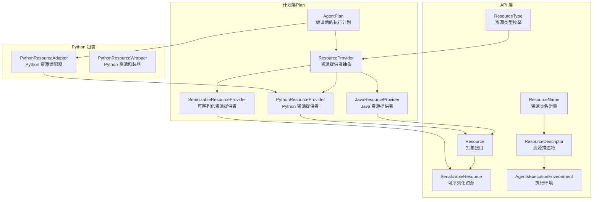
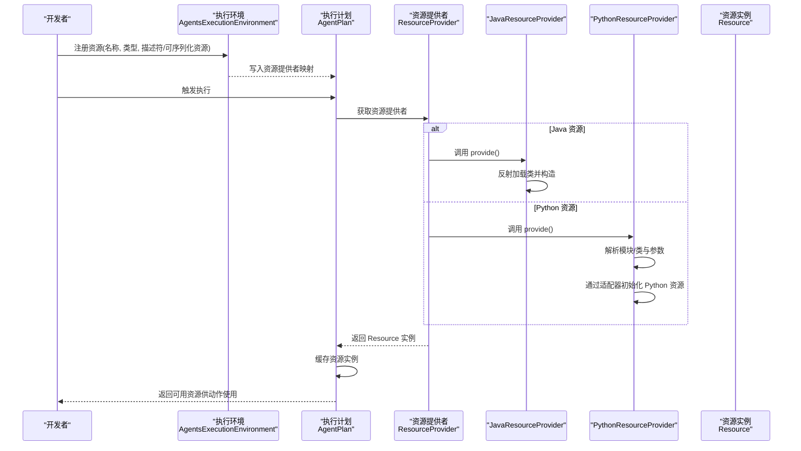
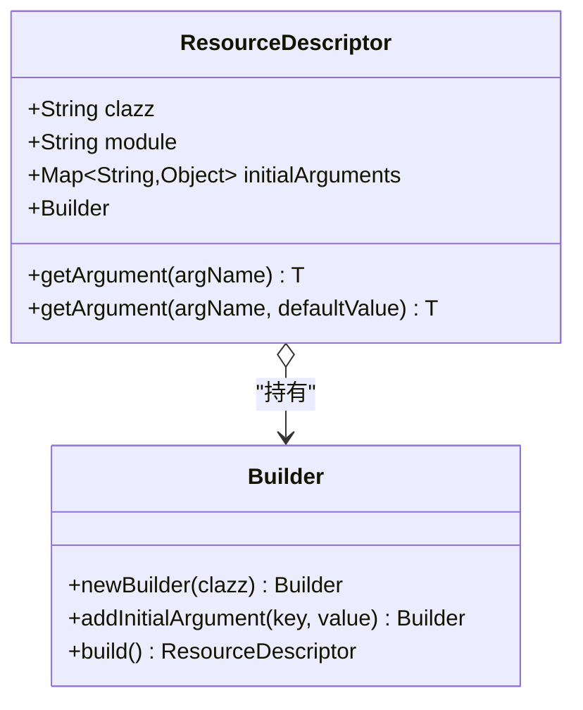
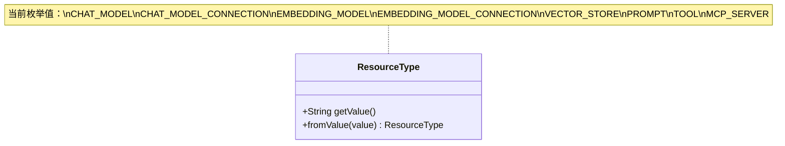
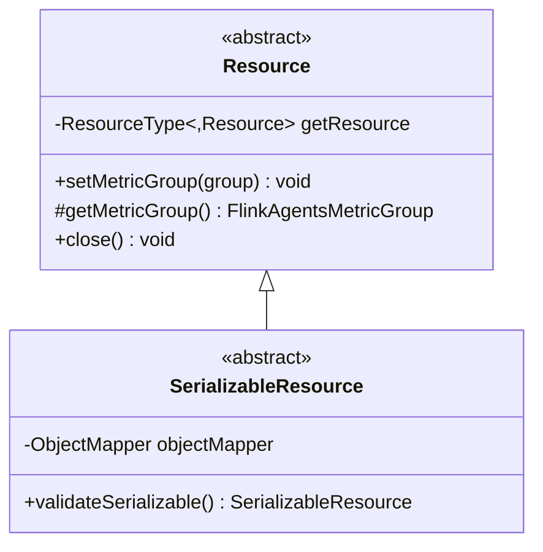
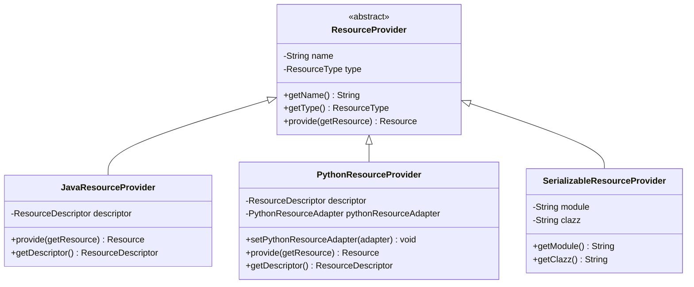
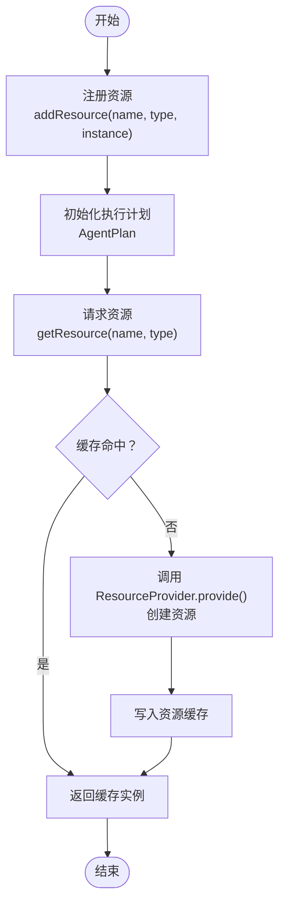
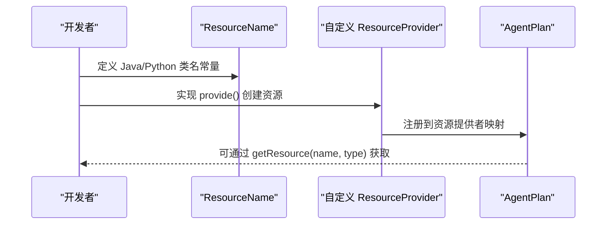
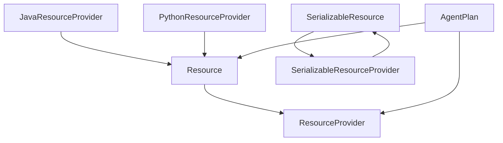

# 资源管理系统

<cite>
**本文引用的文件**
- [ResourceDescriptor.java](file://api/src/main/java/org/apache/flink/agents/api/resource/ResourceDescriptor.java)
- [ResourceType.java](file://api/src/main/java/org/apache/flink/agents/api/resource/ResourceType.java)
- [Resource.java](file://api/src/main/java/org/apache/flink/agents/api/resource/Resource.java)
- [SerializableResource.java](file://api/src/main/java/org/apache/flink/agents/api/resource/SerializableResource.java)
- [ResourceName.java](file://api/src/main/java/org/apache/flink/agents/api/resource/ResourceName.java)
- [AgentsExecutionEnvironment.java](file://api/src/main/java/org/apache/flink/agents/api/AgentsExecutionEnvironment.java)
- [ResourceProvider.java](file://plan/src/main/java/org/apache/flink/agents/plan/resourceprovider/ResourceProvider.java)
- [JavaResourceProvider.java](file://plan/src/main/java/org/apache/flink/agents/plan/resourceprovider/JavaResourceProvider.java)
- [PythonResourceProvider.java](file://plan/src/main/java/org/apache/flink/agents/plan/resourceprovider/PythonResourceProvider.java)
- [SerializableResourceProvider.java](file://plan/src/main/java/org/apache/flink/agents/plan/resourceprovider/SerializableResourceProvider.java)
- [AgentPlan.java](file://plan/src/main/java/org/apache/flink/agents/plan/AgentPlan.java)
- [ResourceDescriptorTest.java](file://api/src/test/java/org/apache/flink/agents/api/resource/ResourceDescriptorTest.java)
</cite>

## 目录
1. [简介](#简介)
2. [项目结构](#项目结构)
3. [核心组件](#核心组件)
4. [架构总览](#架构总览)
5. [详细组件分析](#详细组件分析)
6. [依赖关系分析](#依赖关系分析)
7. [性能考量](#性能考量)
8. [故障排查指南](#故障排查指南)
9. [结论](#结论)
10. [附录](#附录)

## 简介
本文件面向高级开发者，系统性阐述 Flink Agents 资源管理子系统的架构与实现，重点覆盖以下主题：
- ResourceDescriptor 资源描述符的设计：资源标识、类型定义与配置参数的管理方式
- ResourceType 枚举：资源类型的分类标准与扩展点
- Resource 与 SerializableResource 的差异及使用场景：可序列化资源在跨语言执行中的关键作用
- 资源注册、发现与使用的完整流程
- 资源生命周期管理、资源池化与资源清理的最佳实践
- 自定义资源类型开发与现有资源系统的扩展方法
- 基于仓库内真实代码的流程图与类图，帮助快速理解与落地实践

## 项目结构
资源管理相关代码主要分布在以下模块：
- api 模块：定义资源抽象、描述符、类型与执行环境入口
- plan 模块：定义资源提供者（ResourceProvider）及其 Java/Python 实现，以及资源序列化提供者
- runtime 模块：运行时上下文与执行环境（与资源管理交互）
- python 模块：Python 资源包装器与适配器（与 plan 中的 PythonResourceProvider 协作）

下图给出资源管理相关模块的高层结构与职责划分：

图表来源
- [Resource.java](file://api/src/main/java/org/apache/flink/agents/api/resource/Resource.java#L30-L71)
- [SerializableResource.java](file://api/src/main/java/org/apache/flink/agents/api/resource/SerializableResource.java#L30-L50)
- [ResourceDescriptor.java](file://api/src/main/java/org/apache/flink/agents/api/resource/ResourceDescriptor.java#L29-L144)
- [ResourceType.java](file://api/src/main/java/org/apache/flink/agents/api/resource/ResourceType.java#L26-L61)
- [ResourceName.java](file://api/src/main/java/org/apache/flink/agents/api/resource/ResourceName.java#L43-L185)
- [AgentsExecutionEnvironment.java](file://api/src/main/java/org/apache/flink/agents/api/AgentsExecutionEnvironment.java#L44-L223)
- [ResourceProvider.java](file://plan/src/main/java/org/apache/flink/agents/plan/resourceprovider/ResourceProvider.java#L38-L76)
- [JavaResourceProvider.java](file://plan/src/main/java/org/apache/flink/agents/plan/resourceprovider/JavaResourceProvider.java#L29-L57)
- [PythonResourceProvider.java](file://plan/src/main/java/org/apache/flink/agents/plan/resourceprovider/PythonResourceProvider.java#L47-L149)
- [SerializableResourceProvider.java](file://plan/src/main/java/org/apache/flink/agents/plan/resourceprovider/SerializableResourceProvider.java#L30-L60)
- [AgentPlan.java](file://plan/src/main/java/org/apache/flink/agents/plan/AgentPlan.java#L74-L124)

章节来源
- [AgentsExecutionEnvironment.java](file://api/src/main/java/org/apache/flink/agents/api/AgentsExecutionEnvironment.java#L44-L223)
- [AgentPlan.java](file://plan/src/main/java/org/apache/flink/agents/plan/AgentPlan.java#L74-L124)

## 核心组件
本节从“资源描述符”“资源类型”“资源抽象”“可序列化资源”“资源提供者”“执行环境”六个维度，系统梳理资源管理的核心构件。

- 资源描述符 ResourceDescriptor
  - 作用：承载资源的类标识、模块路径与初始化参数，支持 Java 与 Python 跨语言声明
  - 关键字段：目标类名、模块名、初始参数映射；提供 Builder 构建与参数读取能力
  - 跨语言兼容：当模块为空时按 Java 类名解析；否则通过参数传递 Java 实际类名
- 资源类型 ResourceType
  - 作用：统一资源分类，当前支持聊天模型、嵌入模型、向量库、工具、提示词与 MCP 服务器
  - 扩展：新增类型需在枚举中登记，并在资源提供者与运行时逻辑中适配
- 资源 Resource 与可序列化资源 SerializableResource
  - Resource：所有资源的抽象基类，提供资源类型、度量组绑定与关闭接口
  - SerializableResource：继承 Resource 并实现序列化，用于分布式/跨进程传输
- 资源提供者 ResourceProvider 及其 Java/Python 实现
  - ResourceProvider：携带资源元数据并在运行时创建 Resource 实例
  - JavaResourceProvider：基于反射加载 Java 类并构造资源实例
  - PythonResourceProvider：通过 PythonResourceAdapter 初始化 Python 资源并封装为 Resource
  - SerializableResourceProvider：标记资源提供者负责可序列化资源，便于跨语言传输
- 执行环境 AgentsExecutionEnvironment
  - 作用：集中注册资源（可序列化资源或资源描述符），并根据上下文选择本地或远程执行环境

章节来源
- [ResourceDescriptor.java](file://api/src/main/java/org/apache/flink/agents/api/resource/ResourceDescriptor.java#L29-L144)
- [ResourceType.java](file://api/src/main/java/org/apache/flink/agents/api/resource/ResourceType.java#L26-L61)
- [Resource.java](file://api/src/main/java/org/apache/flink/agents/api/resource/Resource.java#L30-L71)
- [SerializableResource.java](file://api/src/main/java/org/apache/flink/agents/api/resource/SerializableResource.java#L30-L50)
- [ResourceProvider.java](file://plan/src/main/java/org/apache/flink/agents/plan/resourceprovider/ResourceProvider.java#L38-L76)
- [JavaResourceProvider.java](file://plan/src/main/java/org/apache/flink/agents/plan/resourceprovider/JavaResourceProvider.java#L29-L57)
- [PythonResourceProvider.java](file://plan/src/main/java/org/apache/flink/agents/plan/resourceprovider/PythonResourceProvider.java#L47-L149)
- [SerializableResourceProvider.java](file://plan/src/main/java/org/apache/flink/agents/plan/resourceprovider/SerializableResourceProvider.java#L30-L60)
- [AgentsExecutionEnvironment.java](file://api/src/main/java/org/apache/flink/agents/api/AgentsExecutionEnvironment.java#L44-L223)

## 架构总览
下图展示资源从“注册/声明”到“运行时创建与缓存”的整体流程，涵盖 Java 与 Python 资源路径。

图表来源
- [AgentsExecutionEnvironment.java](file://api/src/main/java/org/apache/flink/agents/api/AgentsExecutionEnvironment.java#L207-L221)
- [AgentPlan.java](file://plan/src/main/java/org/apache/flink/agents/plan/AgentPlan.java#L249-L264)
- [JavaResourceProvider.java](file://plan/src/main/java/org/apache/flink/agents/plan/resourceprovider/JavaResourceProvider.java#L37-L51)
- [PythonResourceProvider.java](file://plan/src/main/java/org/apache/flink/agents/plan/resourceprovider/PythonResourceProvider.java#L76-L126)

## 详细组件分析

### ResourceDescriptor：资源描述符设计
- 资源标识
  - clazz：Java 资源为全限定类名；Python 资源为简单类名，实际模块由 module 指定
  - module：Python 模块路径；Java 场景通常为空
- 配置参数管理
  - initialArguments：以键值对形式传递初始化参数；支持复杂对象（如列表、嵌套映射）
  - Builder 模式：链式添加参数，简化构建过程
- 跨语言兼容
  - 当 module 为空时，直接使用 clazz 作为 Java 类名
  - 否则从 initialArguments 中移除 java_clazz，确保 Java 侧能正确加载
- 序列化验证
  - 测试覆盖了复杂参数的序列化与反序列化一致性，保证描述符可安全传输

图表来源
- [ResourceDescriptor.java](file://api/src/main/java/org/apache/flink/agents/api/resource/ResourceDescriptor.java#L29-L144)

章节来源
- [ResourceDescriptor.java](file://api/src/main/java/org/apache/flink/agents/api/resource/ResourceDescriptor.java#L44-L76)
- [ResourceDescriptorTest.java](file://api/src/test/java/org/apache/flink/agents/api/resource/ResourceDescriptorTest.java#L32-L54)

### ResourceType：资源类型枚举与分类标准
- 分类标准
  - 以业务域划分：聊天模型、嵌入模型、向量库、工具、提示词、MCP 服务器
  - 统一字符串值：便于序列化/反序列化与跨语言交换
- 使用方式
  - 从字符串解析：fromValue 支持反序列化
  - 在资源提供者与运行时中按类型分派处理逻辑

图表来源
- [ResourceType.java](file://api/src/main/java/org/apache/flink/agents/api/resource/ResourceType.java#L26-L61)

章节来源
- [ResourceType.java](file://api/src/main/java/org/apache/flink/agents/api/resource/ResourceType.java#L26-L61)

### Resource 与 SerializableResource：抽象与序列化
- Resource 抽象
  - 提供 getResourceType、度量组绑定与关闭接口
  - 通过 RunnerContext 注入 getResource 函数，支持资源间相互引用
- SerializableResource
  - 继承 Resource 并实现序列化
  - 提供 validateSerializable 校验资源是否可 JSON 序列化，保障跨进程/跨语言传输安全

图表来源
- [Resource.java](file://api/src/main/java/org/apache/flink/agents/api/resource/Resource.java#L30-L71)
- [SerializableResource.java](file://api/src/main/java/org/apache/flink/agents/api/resource/SerializableResource.java#L30-L50)

章节来源
- [Resource.java](file://api/src/main/java/org/apache/flink/agents/api/resource/Resource.java#L30-L71)
- [SerializableResource.java](file://api/src/main/java/org/apache/flink/agents/api/resource/SerializableResource.java#L30-L50)

### 资源提供者：Java/Python/可序列化资源提供者
- ResourceProvider 抽象
  - 携带资源名称与类型，定义 provide 接口在运行时创建 Resource
- JavaResourceProvider
  - 通过反射加载类，调用构造函数注入 ResourceDescriptor 与 getResource
  - 处理 Java 与 Python 资源的类名差异（module 为空时直接使用 clazz）
- PythonResourceProvider
  - 将 ResourceDescriptor 映射到对应 Python 包装类（如聊天模型、嵌入模型、向量库、MCP 服务器）
  - 通过 PythonResourceAdapter 初始化 Python 对象并封装为 Resource
- SerializableResourceProvider
  - 标记提供可序列化资源，便于跨语言传输与持久化

图表来源
- [ResourceProvider.java](file://plan/src/main/java/org/apache/flink/agents/plan/resourceprovider/ResourceProvider.java#L38-L76)
- [JavaResourceProvider.java](file://plan/src/main/java/org/apache/flink/agents/plan/resourceprovider/JavaResourceProvider.java#L29-L57)
- [PythonResourceProvider.java](file://plan/src/main/java/org/apache/flink/agents/plan/resourceprovider/PythonResourceProvider.java#L47-L149)
- [SerializableResourceProvider.java](file://plan/src/main/java/org/apache/flink/agents/plan/resourceprovider/SerializableResourceProvider.java#L30-L60)

章节来源
- [ResourceProvider.java](file://plan/src/main/java/org/apache/flink/agents/plan/resourceprovider/ResourceProvider.java#L38-L76)
- [JavaResourceProvider.java](file://plan/src/main/java/org/apache/flink/agents/plan/resourceprovider/JavaResourceProvider.java#L37-L51)
- [PythonResourceProvider.java](file://plan/src/main/java/org/apache/flink/agents/plan/resourceprovider/PythonResourceProvider.java#L76-L126)
- [SerializableResourceProvider.java](file://plan/src/main/java/org/apache/flink/agents/plan/resourceprovider/SerializableResourceProvider.java#L35-L58)

### 执行环境与资源生命周期：注册、发现与使用
- 注册阶段
  - 通过 AgentsExecutionEnvironment.addResource 注册资源
  - 支持两种输入：SerializableResource（可直接使用）与 ResourceDescriptor（延迟创建）
- 发现与使用
  - AgentPlan 维护资源提供者映射与资源缓存
  - 首次请求某资源时，通过 ResourceProvider.provide 创建并放入缓存
  - 后续请求直接返回缓存实例，避免重复创建
- 生命周期与清理
  - AgentPlan.close 遍历缓存资源逐一关闭并清空缓存，确保资源释放

图表来源
- [AgentsExecutionEnvironment.java](file://api/src/main/java/org/apache/flink/agents/api/AgentsExecutionEnvironment.java#L207-L221)
- [AgentPlan.java](file://plan/src/main/java/org/apache/flink/agents/plan/AgentPlan.java#L249-L264)
- [AgentPlan.java](file://plan/src/main/java/org/apache/flink/agents/plan/AgentPlan.java#L274-L281)

章节来源
- [AgentsExecutionEnvironment.java](file://api/src/main/java/org/apache/flink/agents/api/AgentsExecutionEnvironment.java#L207-L221)
- [AgentPlan.java](file://plan/src/main/java/org/apache/flink/agents/plan/AgentPlan.java#L249-L264)
- [AgentPlan.java](file://plan/src/main/java/org/apache/flink/agents/plan/AgentPlan.java#L274-L281)

### 资源池化与清理最佳实践
- 资源池化
  - 使用 AgentPlan 的资源缓存机制，避免重复实例化
  - 对于高成本资源（如网络连接、模型加载），建议在缓存中复用
- 清理策略
  - 在作业结束时调用 AgentPlan.close，确保资源释放
  - 资源实现应实现 close 方法，释放底层句柄或线程
- 并发与线程安全
  - 资源缓存采用并发映射，注意资源内部状态的线程安全

章节来源
- [AgentPlan.java](file://plan/src/main/java/org/apache/flink/agents/plan/AgentPlan.java#L92-L99)
- [AgentPlan.java](file://plan/src/main/java/org/apache/flink/agents/plan/AgentPlan.java#L274-L281)
- [Resource.java](file://api/src/main/java/org/apache/flink/agents/api/resource/Resource.java#L68-L70)

### 开发自定义资源类型与扩展资源系统
- 新增资源类型
  - 在 ResourceType 中添加新枚举值，并提供统一字符串值
  - 在 ResourceName 中补充 Java/Python 实现类名常量
- 实现资源提供者
  - 若为 Java 资源：实现 ResourceProvider 子类（或使用 JavaResourceProvider），在 provide 中完成实例化
  - 若为 Python 资源：实现 PythonResourceProvider，映射到对应的 Python 包装类
  - 若为可序列化资源：实现 SerializableResourceProvider，确保资源可序列化
- 运行时集成
  - 在 AgentPlan 中按类型分派资源提供者
  - 如涉及 Python 资源，确保设置 PythonResourceAdapter 并正确初始化

图表来源
- [ResourceType.java](file://api/src/main/java/org/apache/flink/agents/api/resource/ResourceType.java#L26-L61)
- [ResourceName.java](file://api/src/main/java/org/apache/flink/agents/api/resource/ResourceName.java#L43-L185)
- [ResourceProvider.java](file://plan/src/main/java/org/apache/flink/agents/plan/resourceprovider/ResourceProvider.java#L38-L76)
- [AgentPlan.java](file://plan/src/main/java/org/apache/flink/agents/plan/AgentPlan.java#L125-L141)

章节来源
- [ResourceType.java](file://api/src/main/java/org/apache/flink/agents/api/resource/ResourceType.java#L26-L61)
- [ResourceName.java](file://api/src/main/java/org/apache/flink/agents/api/resource/ResourceName.java#L43-L185)
- [ResourceProvider.java](file://plan/src/main/java/org/apache/flink/agents/plan/resourceprovider/ResourceProvider.java#L38-L76)
- [AgentPlan.java](file://plan/src/main/java/org/apache/flink/agents/plan/AgentPlan.java#L125-L141)

## 依赖关系分析
- 组件耦合
  - Resource 与 ResourceProvider：ResourceProvider 负责创建 Resource，二者通过 provide 接口耦合
  - JavaResourceProvider 与 PythonResourceProvider：分别面向 Java/Python 资源，共享 ResourceProvider 抽象
  - SerializableResource 与 SerializableResourceProvider：强调可序列化语义，便于跨语言传输
  - AgentPlan 与 ResourceProvider：AgentPlan 维护资源提供者映射与缓存，形成资源发现与复用中心
- 外部依赖
  - 反射加载：JavaResourceProvider 使用 Class.forName 与构造函数反射
  - JSON 序列化：ResourceDescriptor、ResourceProvider 等通过 Jackson 进行序列化/反序列化
  - Python 适配：PythonResourceProvider 依赖 PythonResourceAdapter 与 pemja.core.object.PyObject

图表来源
- [Resource.java](file://api/src/main/java/org/apache/flink/agents/api/resource/Resource.java#L30-L71)
- [SerializableResource.java](file://api/src/main/java/org/apache/flink/agents/api/resource/SerializableResource.java#L30-L50)
- [ResourceProvider.java](file://plan/src/main/java/org/apache/flink/agents/plan/resourceprovider/ResourceProvider.java#L38-L76)
- [JavaResourceProvider.java](file://plan/src/main/java/org/apache/flink/agents/plan/resourceprovider/JavaResourceProvider.java#L29-L57)
- [PythonResourceProvider.java](file://plan/src/main/java/org/apache/flink/agents/plan/resourceprovider/PythonResourceProvider.java#L47-L149)
- [SerializableResourceProvider.java](file://plan/src/main/java/org/apache/flink/agents/plan/resourceprovider/SerializableResourceProvider.java#L30-L60)
- [AgentPlan.java](file://plan/src/main/java/org/apache/flink/agents/plan/AgentPlan.java#L74-L124)

章节来源
- [JavaResourceProvider.java](file://plan/src/main/java/org/apache/flink/agents/plan/resourceprovider/JavaResourceProvider.java#L46-L50)
- [PythonResourceProvider.java](file://plan/src/main/java/org/apache/flink/agents/plan/resourceprovider/PythonResourceProvider.java#L117-L125)

## 性能考量
- 资源缓存
  - 使用并发映射缓存资源实例，避免重复创建与初始化开销
- 反射成本
  - Java 资源通过反射加载类与构造，建议在启动阶段预热或减少频繁反射调用
- Python 适配
  - Python 资源初始化涉及跨语言桥接，尽量复用已创建实例，减少频繁初始化
- 度量与监控
  - Resource 支持绑定度量组，可在资源实现中埋点统计耗时与错误

## 故障排查指南
- 常见问题与定位
  - 资源未找到：检查资源名称与类型是否匹配，确认资源提供者已注册
  - 类加载失败：Java 资源需确保类名与模块路径正确，ClassLoader 可见
  - Python 资源初始化异常：检查 Python 模块与类名格式，确保 PythonResourceAdapter 已设置
  - 序列化失败：可序列化资源需满足 JSON 序列化约束，使用 validateSerializable 进行校验
- 关闭资源
  - 作业结束后务必调用 AgentPlan.close，确保资源释放与清理

章节来源
- [PythonResourceProvider.java](file://plan/src/main/java/org/apache/flink/agents/plan/resourceprovider/PythonResourceProvider.java#L76-L126)
- [SerializableResource.java](file://api/src/main/java/org/apache/flink/agents/api/resource/SerializableResource.java#L40-L48)
- [AgentPlan.java](file://plan/src/main/java/org/apache/flink/agents/plan/AgentPlan.java#L274-L281)

## 结论
Flink Agents 资源管理系统通过 ResourceDescriptor、ResourceType、Resource/SerializableResource、ResourceProvider 与 AgentPlan 的协同，实现了资源的统一建模、跨语言声明与运行时创建。该体系具备良好的扩展性：新增资源类型只需在枚举与常量中登记，并实现相应的资源提供者；同时通过缓存与关闭机制保障性能与资源安全。对于高级开发者，建议在自定义资源时遵循可序列化与线程安全原则，并结合度量组进行可观测性建设。

## 附录
- 示例参考（代码路径）
  - 资源描述符序列化测试：[ResourceDescriptorTest.java](file://api/src/test/java/org/apache/flink/agents/api/resource/ResourceDescriptorTest.java#L32-L54)
  - Java 资源提供者创建流程：[JavaResourceProvider.java](file://plan/src/main/java/org/apache/flink/agents/plan/resourceprovider/JavaResourceProvider.java#L37-L51)
  - Python 资源提供者创建流程：[PythonResourceProvider.java](file://plan/src/main/java/org/apache/flink/agents/plan/resourceprovider/PythonResourceProvider.java#L76-L126)
  - 资源注册与执行环境：[AgentsExecutionEnvironment.java](file://api/src/main/java/org/apache/flink/agents/api/AgentsExecutionEnvironment.java#L207-L221)
  - 资源生命周期与缓存：[AgentPlan.java](file://plan/src/main/java/org/apache/flink/agents/plan/AgentPlan.java#L249-L264), [AgentPlan.java](file://plan/src/main/java/org/apache/flink/agents/plan/AgentPlan.java#L274-L281)