# 资源类型定义

<cite>
**本文引用的文件**
- [ResourceType.java](file://api/src/main/java/org/apache/flink/agents/api/resource/ResourceType.java)
- [Resource.java](file://api/src/main/java/org/apache/flink/agents/api/resource/Resource.java)
- [ResourceDescriptor.java](file://api/src/main/java/org/apache/flink/agents/api/resource/ResourceDescriptor.java)
- [ResourceName.java](file://api/src/main/java/org/apache/flink/agents/api/resource/ResourceName.java)
- [SerializableResource.java](file://api/src/main/java/org/apache/flink/agents/api/resource/SerializableResource.java)
- [ResourceProvider.java](file://plan/src/main/java/org/apache/flink/agents/plan/resourceprovider/ResourceProvider.java)
- [JavaResourceProvider.java](file://plan/src/main/java/org/apache/flink/agents/plan/resourceprovider/JavaResourceProvider.java)
- [PythonResourceProvider.java](file://plan/src/main/java/org/apache/flink/agents/plan/resourceprovider/PythonResourceProvider.java)
- [PythonResourceAdapter.java](file://api/src/main/java/org/apache/flink/agents/api/resource/python/PythonResourceAdapter.java)
- [PythonResourceWrapper.java](file://api/src/main/java/org/apache/flink/agents/api/resource/python/PythonResourceWrapper.java)
</cite>

## 目录
1. [简介](#简介)
2. [项目结构](#项目结构)
3. [核心组件](#核心组件)
4. [架构总览](#架构总览)
5. [详细组件分析](#详细组件分析)
6. [依赖关系分析](#依赖关系分析)
7. [性能考量](#性能考量)
8. [故障排查指南](#故障排查指南)
9. [结论](#结论)
10. [附录](#附录)

## 简介
本文件系统性阐述 Flink Agents 中“资源类型”（ResourceType）的设计与实现，覆盖以下主题：
- ResourceType 枚举的分类体系与命名规范
- 各资源类型的定义标准、特点、适用场景与使用限制
- 资源类型与具体实现类之间的映射与绑定机制
- 资源注册、验证与管理的实现细节
- 如何基于业务需求选择合适的资源类型
- 实际用法示例（以路径引用代替代码片段）

## 项目结构
围绕资源类型系统的关键文件分布如下：
- API 层：资源抽象与描述（Resource、ResourceType、ResourceDescriptor、ResourceName、SerializableResource）
- 计划层（Plan）：资源提供者（ResourceProvider 及其 Java/Python 实现）
- 运行时交互：Python 资源适配器（PythonResourceAdapter）与包装器（PythonResourceWrapper）

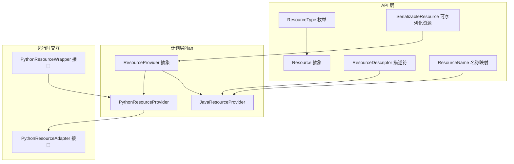

图表来源
- [ResourceType.java](file://api/src/main/java/org/apache/flink/agents/api/resource/ResourceType.java#L26-L44)
- [Resource.java](file://api/src/main/java/org/apache/flink/agents/api/resource/Resource.java#L30-L66)
- [ResourceDescriptor.java](file://api/src/main/java/org/apache/flink/agents/api/resource/ResourceDescriptor.java#L29-L88)
- [ResourceName.java](file://api/src/main/java/org/apache/flink/agents/api/resource/ResourceName.java#L43-L184)
- [SerializableResource.java](file://api/src/main/java/org/apache/flink/agents/api/resource/SerializableResource.java#L30-L48)
- [ResourceProvider.java](file://plan/src/main/java/org/apache/flink/agents/plan/resourceprovider/ResourceProvider.java#L38-L74)
- [JavaResourceProvider.java](file://plan/src/main/java/org/apache/flink/agents/plan/resourceprovider/JavaResourceProvider.java#L29-L56)
- [PythonResourceProvider.java](file://plan/src/main/java/org/apache/flink/agents/plan/resourceprovider/PythonResourceProvider.java#L47-L126)
- [PythonResourceAdapter.java](file://api/src/main/java/org/apache/flink/agents/api/resource/python/PythonResourceAdapter.java#L37-L140)
- [PythonResourceWrapper.java](file://api/src/main/java/org/apache/flink/agents/api/resource/python/PythonResourceWrapper.java#L24-L32)

章节来源
- [ResourceType.java](file://api/src/main/java/org/apache/flink/agents/api/resource/ResourceType.java#L21-L61)
- [Resource.java](file://api/src/main/java/org/apache/flink/agents/api/resource/Resource.java#L25-L70)
- [ResourceDescriptor.java](file://api/src/main/java/org/apache/flink/agents/api/resource/ResourceDescriptor.java#L28-L143)
- [ResourceName.java](file://api/src/main/java/org/apache/flink/agents/api/resource/ResourceName.java#L21-L184)
- [SerializableResource.java](file://api/src/main/java/org/apache/flink/agents/api/resource/SerializableResource.java#L25-L49)
- [ResourceProvider.java](file://plan/src/main/java/org/apache/flink/agents/plan/resourceprovider/ResourceProvider.java#L30-L75)
- [JavaResourceProvider.java](file://plan/src/main/java/org/apache/flink/agents/plan/resourceprovider/JavaResourceProvider.java#L28-L56)
- [PythonResourceProvider.java](file://plan/src/main/java/org/apache/flink/agents/plan/resourceprovider/PythonResourceProvider.java#L41-L148)
- [PythonResourceAdapter.java](file://api/src/main/java/org/apache/flink/agents/api/resource/python/PythonResourceAdapter.java#L32-L140)
- [PythonResourceWrapper.java](file://api/src/main/java/org/apache/flink/agents/api/resource/python/PythonResourceWrapper.java#L20-L32)

## 核心组件
- ResourceType：统一的资源类型枚举，定义了当前支持的资源类别及其字符串值映射，提供从字符串解析类型的静态方法。
- Resource：所有资源的抽象基类，定义资源类型查询、度量组绑定以及关闭生命周期钩子。
- ResourceDescriptor：资源描述符，承载目标类名、模块名与初始化参数，支持跨语言（Java/Python）兼容。
- ResourceName：资源名称映射表，按资源类型分层组织 Java 与 Python 的实现类全限定名或模块路径。
- SerializableResource：可序列化资源抽象，提供 JSON 序列化校验能力。
- ResourceProvider：资源提供者抽象，负责在运行时创建 Resource 实例；包含 JavaResourceProvider 与 PythonResourceProvider 两个实现。
- PythonResourceAdapter：Java 与 Python 互操作的适配接口，负责 Python 对象初始化、数据转换与方法调用。
- PythonResourceWrapper：对 Python 资源对象的统一访问包装接口。

章节来源
- [ResourceType.java](file://api/src/main/java/org/apache/flink/agents/api/resource/ResourceType.java#L26-L60)
- [Resource.java](file://api/src/main/java/org/apache/flink/agents/api/resource/Resource.java#L30-L69)
- [ResourceDescriptor.java](file://api/src/main/java/org/apache/flink/agents/api/resource/ResourceDescriptor.java#L29-L88)
- [ResourceName.java](file://api/src/main/java/org/apache/flink/agents/api/resource/ResourceName.java#L43-L184)
- [SerializableResource.java](file://api/src/main/java/org/apache/flink/agents/api/resource/SerializableResource.java#L30-L48)
- [ResourceProvider.java](file://plan/src/main/java/org/apache/flink/agents/plan/resourceprovider/ResourceProvider.java#L38-L74)
- [PythonResourceAdapter.java](file://api/src/main/java/org/apache/flink/agents/api/resource/python/PythonResourceAdapter.java#L37-L140)
- [PythonResourceWrapper.java](file://api/src/main/java/org/apache/flink/agents/api/resource/python/PythonResourceWrapper.java#L24-L32)

## 架构总览
资源类型系统通过“类型枚举 + 描述符 + 提供者 + 适配器”的分层设计，实现资源的声明、序列化、跨语言绑定与运行时实例化。

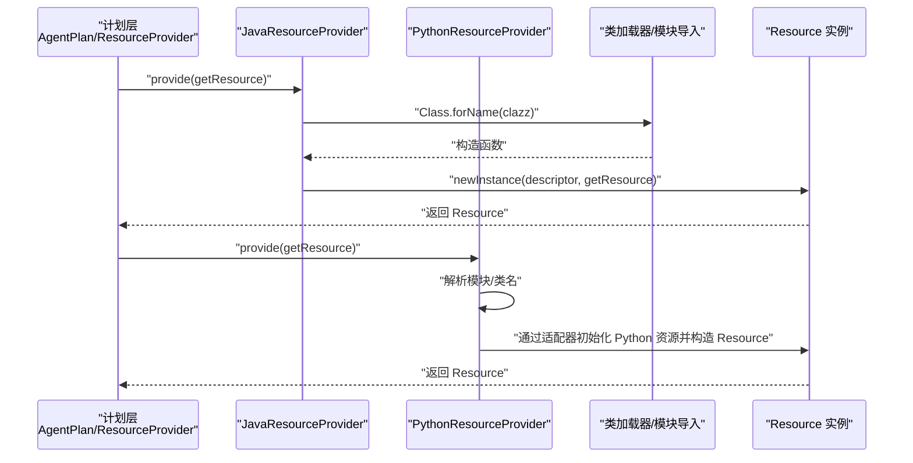

图表来源
- [JavaResourceProvider.java](file://plan/src/main/java/org/apache/flink/agents/plan/resourceprovider/JavaResourceProvider.java#L37-L51)
- [PythonResourceProvider.java](file://plan/src/main/java/org/apache/flink/agents/plan/resourceprovider/PythonResourceProvider.java#L76-L126)
- [ResourceProvider.java](file://plan/src/main/java/org/apache/flink/agents/plan/resourceprovider/ResourceProvider.java#L73-L74)

## 详细组件分析

### ResourceType 枚举与分类体系
- 定义范围：聊天模型、聊天模型连接、嵌入模型、嵌入模型连接、向量库、提示词、工具、MCP 服务器。
- 字符串值映射：每个枚举项对应一个稳定字符串值，用于序列化与反序列化。
- 解析方法：支持从字符串值解析回枚举，未知值抛出异常。

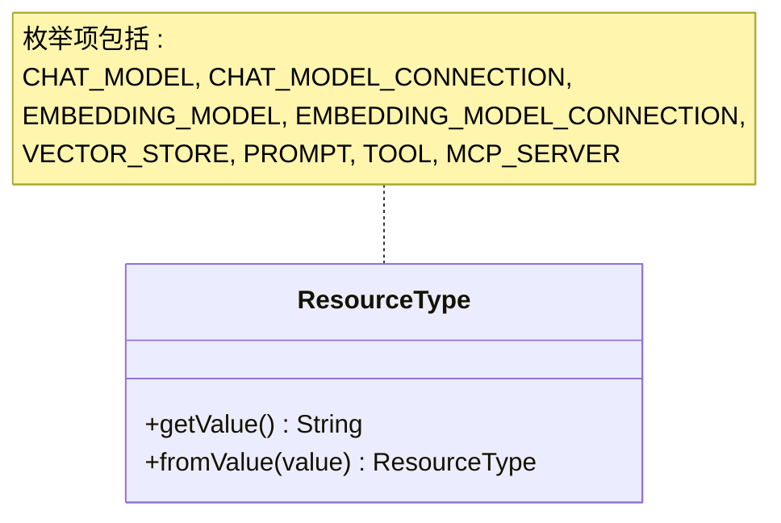

图表来源
- [ResourceType.java](file://api/src/main/java/org/apache/flink/agents/api/resource/ResourceType.java#L26-L60)

章节来源
- [ResourceType.java](file://api/src/main/java/org/apache/flink/agents/api/resource/ResourceType.java#L21-L61)

### Resource 抽象与生命周期
- 角色：所有资源的基类，统一暴露 getResourceType、度量组绑定与关闭钩子。
- 关键点：通过 RunnerContext 注入度量组；关闭钩子默认空实现，由具体资源覆盖。

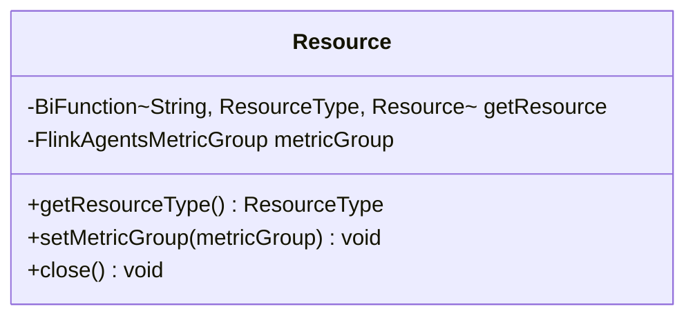

图表来源
- [Resource.java](file://api/src/main/java/org/apache/flink/agents/api/resource/Resource.java#L30-L69)

章节来源
- [Resource.java](file://api/src/main/java/org/apache/flink/agents/api/resource/Resource.java#L25-L70)

### ResourceDescriptor 描述符与跨语言兼容
- 字段：目标类名（clazz）、模块名（module）、初始参数（initialArguments）。
- 兼容策略：
  - Java 资源：clazz 为完全限定类名，module 留空。
  - Python 资源：clazz 为简单类名，module 为 Python 模块路径。
- 工具：Builder 支持链式添加初始参数；提供参数读取与哈希相等性。

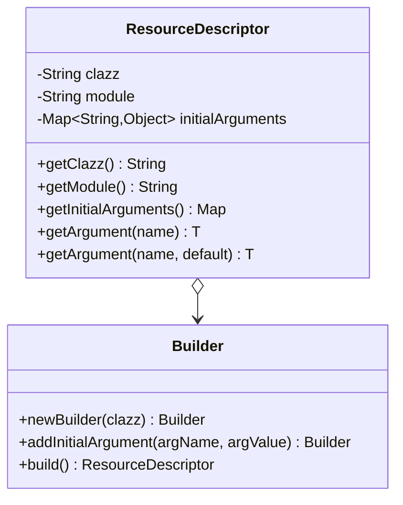

图表来源
- [ResourceDescriptor.java](file://api/src/main/java/org/apache/flink/agents/api/resource/ResourceDescriptor.java#L29-L142)

章节来源
- [ResourceDescriptor.java](file://api/src/main/java/org/apache/flink/agents/api/resource/ResourceDescriptor.java#L28-L143)

### ResourceName 名称映射与绑定机制
- 结构：按资源类型分层（如 ChatModel、EmbeddingModel、VectorStore），Java 与 Python 分别给出实现类名或模块路径。
- 绑定规则：
  - Java：直接使用全限定类名。
  - Python：使用模块路径与类名，配合 ResourceDescriptor 的 module/clazz 字段。
- 特殊：MCP 服务器在 Python 中采用动态模块与类名解析。

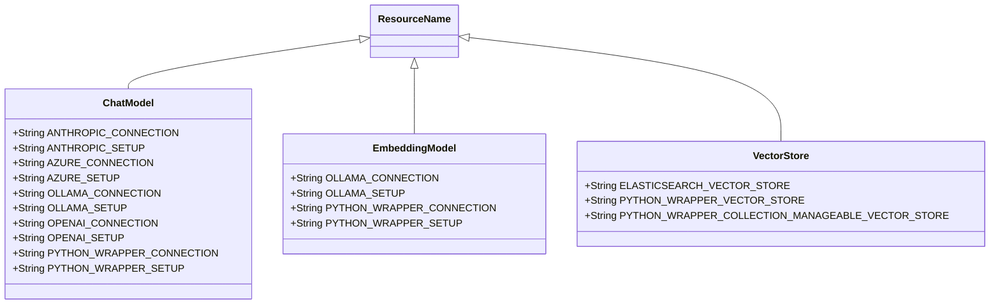

图表来源
- [ResourceName.java](file://api/src/main/java/org/apache/flink/agents/api/resource/ResourceName.java#L43-L184)

章节来源
- [ResourceName.java](file://api/src/main/java/org/apache/flink/agents/api/resource/ResourceName.java#L21-L184)

### SerializableResource 可序列化资源
- 目标：确保资源可被序列化以便跨进程/跨语言传递与持久化。
- 校验：提供 validateSerializable 方法，内部使用 ObjectMapper 校验资源是否可 JSON 序列化。

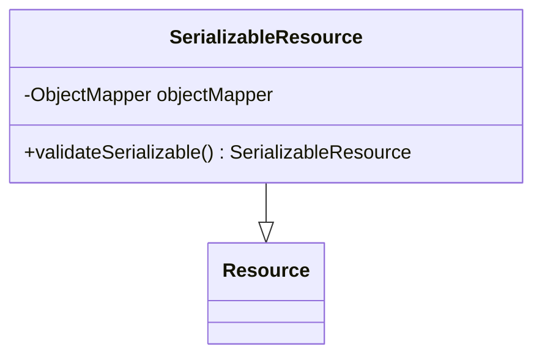

图表来源
- [SerializableResource.java](file://api/src/main/java/org/apache/flink/agents/api/resource/SerializableResource.java#L30-L48)

章节来源
- [SerializableResource.java](file://api/src/main/java/org/apache/flink/agents/api/resource/SerializableResource.java#L25-L49)

### ResourceProvider 抽象与实现
- 抽象职责：携带资源元数据并在运行时创建 Resource 实例；提供 name、type 与 provide 方法。
- Java 实现：JavaResourceProvider 通过反射加载类并调用带 ResourceDescriptor 与 getResource 的构造函数。
- Python 实现：PythonResourceProvider 将资源类型映射到对应的 Python 包装类，借助 PythonResourceAdapter 初始化 Python 资源并构造 Resource。

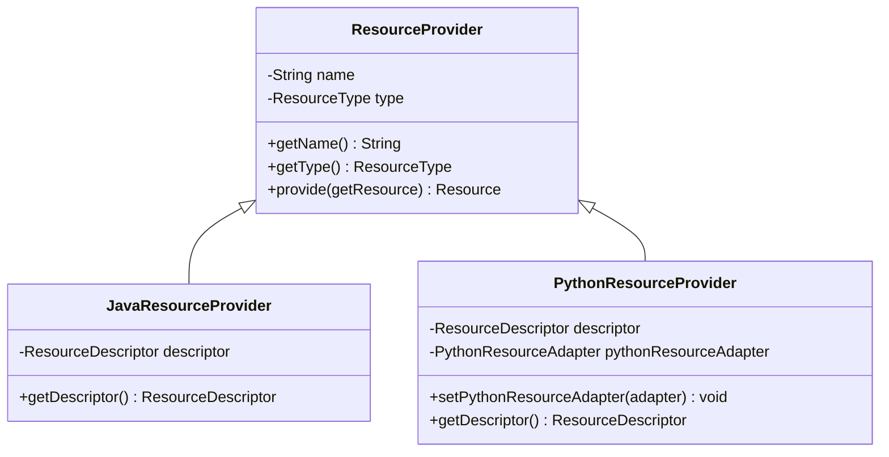

图表来源
- [ResourceProvider.java](file://plan/src/main/java/org/apache/flink/agents/plan/resourceprovider/ResourceProvider.java#L38-L74)
- [JavaResourceProvider.java](file://plan/src/main/java/org/apache/flink/agents/plan/resourceprovider/JavaResourceProvider.java#L29-L56)
- [PythonResourceProvider.java](file://plan/src/main/java/org/apache/flink/agents/plan/resourceprovider/PythonResourceProvider.java#L47-L126)

章节来源
- [ResourceProvider.java](file://plan/src/main/java/org/apache/flink/agents/plan/resourceprovider/ResourceProvider.java#L30-L75)
- [JavaResourceProvider.java](file://plan/src/main/java/org/apache/flink/agents/plan/resourceprovider/JavaResourceProvider.java#L28-L56)
- [PythonResourceProvider.java](file://plan/src/main/java/org/apache/flink/agents/plan/resourceprovider/PythonResourceProvider.java#L41-L148)

### PythonResourceAdapter 与 PythonResourceWrapper
- PythonResourceAdapter：提供资源检索、Python 对象初始化、消息/文档/查询/集合等双向转换、方法调用与通用 invoke 能力。
- PythonResourceWrapper：统一暴露 getPythonResource，便于从 Java 侧访问底层 Python 资源对象。

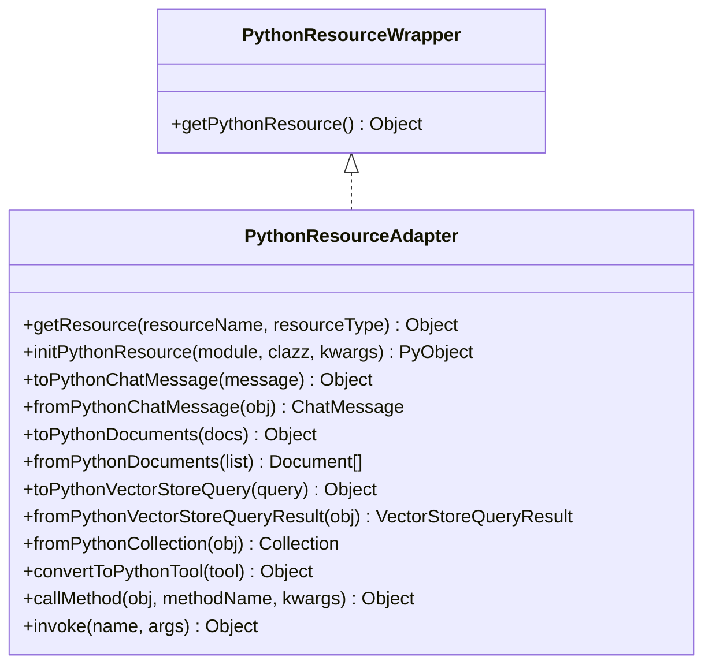

图表来源
- [PythonResourceAdapter.java](file://api/src/main/java/org/apache/flink/agents/api/resource/python/PythonResourceAdapter.java#L37-L140)
- [PythonResourceWrapper.java](file://api/src/main/java/org/apache/flink/agents/api/resource/python/PythonResourceWrapper.java#L24-L32)

章节来源
- [PythonResourceAdapter.java](file://api/src/main/java/org/apache/flink/agents/api/resource/python/PythonResourceAdapter.java#L32-L140)
- [PythonResourceWrapper.java](file://api/src/main/java/org/apache/flink/agents/api/resource/python/PythonResourceWrapper.java#L20-L32)

### 资源类型与具体实现的映射与绑定流程
- Java 资源绑定：通过 ResourceDescriptor 的 clazz/module 与反射构造；ResourceName 提供 Java 实现类名。
- Python 资源绑定：通过 PythonResourceProvider 将 ResourceType 映射到对应 Python 包装类，再由 PythonResourceAdapter 初始化 Python 资源。
- 运行时获取：RunnerContext.getResource 会委托 ResourceProvider 提供资源实例。

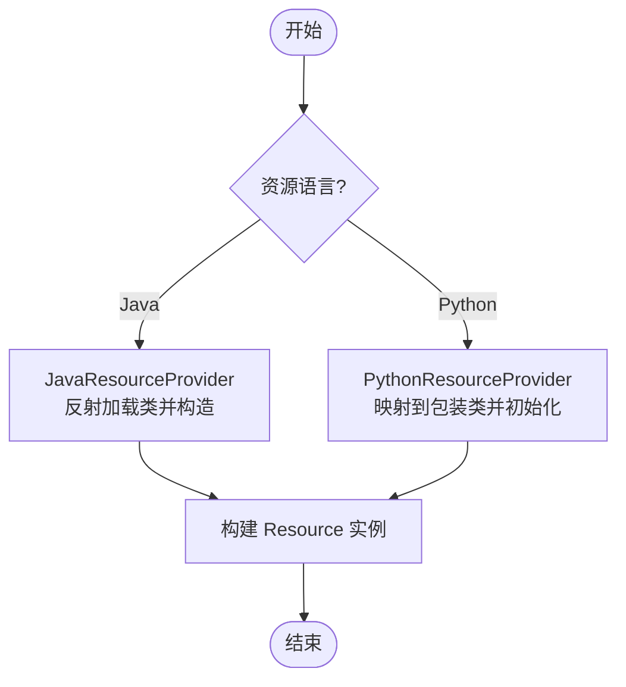

图表来源
- [JavaResourceProvider.java](file://plan/src/main/java/org/apache/flink/agents/plan/resourceprovider/JavaResourceProvider.java#L37-L51)
- [PythonResourceProvider.java](file://plan/src/main/java/org/apache/flink/agents/plan/resourceprovider/PythonResourceProvider.java#L76-L126)

章节来源
- [JavaResourceProvider.java](file://plan/src/main/java/org/apache/flink/agents/plan/resourceprovider/JavaResourceProvider.java#L28-L56)
- [PythonResourceProvider.java](file://plan/src/main/java/org/apache/flink/agents/plan/resourceprovider/PythonResourceProvider.java#L41-L148)

## 依赖关系分析
- 类型依赖：Resource 实现依赖 ResourceType；ResourceDescriptor 作为 Java/Python 资源的统一描述载体。
- 提供者依赖：JavaResourceProvider 依赖 ResourceDescriptor 与类加载器；PythonResourceProvider 依赖 PythonResourceAdapter 与 ResourceDescriptor。
- 运行时依赖：PythonResourceAdapter 为 Python 资源提供桥接能力；PythonResourceWrapper 为访问 Python 资源提供统一入口。

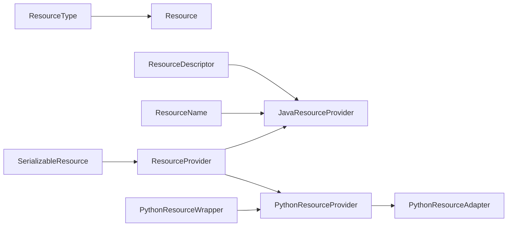

图表来源
- [ResourceType.java](file://api/src/main/java/org/apache/flink/agents/api/resource/ResourceType.java#L26-L44)
- [Resource.java](file://api/src/main/java/org/apache/flink/agents/api/resource/Resource.java#L30-L48)
- [ResourceDescriptor.java](file://api/src/main/java/org/apache/flink/agents/api/resource/ResourceDescriptor.java#L29-L88)
- [ResourceName.java](file://api/src/main/java/org/apache/flink/agents/api/resource/ResourceName.java#L43-L184)
- [SerializableResource.java](file://api/src/main/java/org/apache/flink/agents/api/resource/SerializableResource.java#L30-L48)
- [ResourceProvider.java](file://plan/src/main/java/org/apache/flink/agents/plan/resourceprovider/ResourceProvider.java#L38-L74)
- [JavaResourceProvider.java](file://plan/src/main/java/org/apache/flink/agents/plan/resourceprovider/JavaResourceProvider.java#L29-L56)
- [PythonResourceProvider.java](file://plan/src/main/java/org/apache/flink/agents/plan/resourceprovider/PythonResourceProvider.java#L47-L126)
- [PythonResourceAdapter.java](file://api/src/main/java/org/apache/flink/agents/api/resource/python/PythonResourceAdapter.java#L37-L140)
- [PythonResourceWrapper.java](file://api/src/main/java/org/apache/flink/agents/api/resource/python/PythonResourceWrapper.java#L24-L32)

章节来源
- [ResourceType.java](file://api/src/main/java/org/apache/flink/agents/api/resource/ResourceType.java#L21-L61)
- [Resource.java](file://api/src/main/java/org/apache/flink/agents/api/resource/Resource.java#L25-L70)
- [ResourceDescriptor.java](file://api/src/main/java/org/apache/flink/agents/api/resource/ResourceDescriptor.java#L28-L143)
- [ResourceName.java](file://api/src/main/java/org/apache/flink/agents/api/resource/ResourceName.java#L21-L184)
- [SerializableResource.java](file://api/src/main/java/org/apache/flink/agents/api/resource/SerializableResource.java#L25-L49)
- [ResourceProvider.java](file://plan/src/main/java/org/apache/flink/agents/plan/resourceprovider/ResourceProvider.java#L30-L75)
- [JavaResourceProvider.java](file://plan/src/main/java/org/apache/flink/agents/plan/resourceprovider/JavaResourceProvider.java#L28-L56)
- [PythonResourceProvider.java](file://plan/src/main/java/org/apache/flink/agents/plan/resourceprovider/PythonResourceProvider.java#L41-L148)
- [PythonResourceAdapter.java](file://api/src/main/java/org/apache/flink/agents/api/resource/python/PythonResourceAdapter.java#L32-L140)
- [PythonResourceWrapper.java](file://api/src/main/java/org/apache/flink/agents/api/resource/python/PythonResourceWrapper.java#L20-L32)

## 性能考量
- 反射开销：JavaResourceProvider 使用反射加载类并调用构造函数，建议在资源池化与缓存中复用已加载类与构造器。
- 序列化成本：SerializableResource 的 validateSerializable 会进行一次完整 JSON 序列化，应在资源创建阶段执行，避免在热路径重复校验。
- Python 互操作：PythonResourceProvider 通过 PythonResourceAdapter 初始化 Python 资源，注意模块导入与对象生命周期管理，减少频繁初始化带来的延迟。
- 度量与监控：Resource 支持绑定度量组，建议在资源实现中记录关键指标（如初始化耗时、调用次数、错误率）。

## 故障排查指南
- 未知资源类型：当从字符串解析 ResourceType 失败时会抛出异常。请检查序列化字符串是否匹配枚举项。
- Java 资源加载失败：确认 ResourceDescriptor 的 clazz/module 正确，且类具备带 ResourceDescriptor 与 getResource 的构造函数。
- Python 资源初始化失败：检查 PythonResourceProvider 的模块/类名解析逻辑，确保 pythonClazz 格式正确（module.ClassName）。
- 序列化校验失败：SerializableResource.validateSerializable 抛出非法参数异常时，检查资源内部字段是否可被 Jackson 序列化。
- Python 适配器未设置：PythonResourceProvider 在 provide 前需设置 PythonResourceAdapter，否则会触发状态检查异常。

章节来源
- [ResourceType.java](file://api/src/main/java/org/apache/flink/agents/api/resource/ResourceType.java#L53-L60)
- [JavaResourceProvider.java](file://plan/src/main/java/org/apache/flink/agents/plan/resourceprovider/JavaResourceProvider.java#L46-L50)
- [PythonResourceProvider.java](file://plan/src/main/java/org/apache/flink/agents/plan/resourceprovider/PythonResourceProvider.java#L79-L115)
- [SerializableResource.java](file://api/src/main/java/org/apache/flink/agents/api/resource/SerializableResource.java#L40-L48)

## 结论
资源类型系统通过清晰的枚举定义、描述符建模与提供者抽象，实现了 Java 与 Python 资源的统一管理与跨语言绑定。ResourceType 为资源分类提供了稳定契约，ResourceDescriptor 保证了跨平台兼容，ResourceProvider 则在运行时完成资源实例化。结合 PythonResourceAdapter 的桥接能力，系统能够灵活扩展新的资源类型与实现。

## 附录

### 资源类型选择与使用建议
- 聊天模型（CHAT_MODEL/CHAT_MODEL_CONNECTION）：适用于对话生成与消息处理。优先考虑本地 Ollama 或云端 OpenAI/Azure 等。
- 嵌入模型（EMBEDDING_MODEL/EMBEDDING_MODEL_CONNECTION）：适用于文本向量化与相似度计算。可选本地 Ollama 或 OpenAI。
- 向量库（VECTOR_STORE）：适用于检索增强与知识库管理。可选 Elasticsearch 或 Chroma 等。
- 提示词（PROMPT）：适用于模板化提示与上下文注入。
- 工具（TOOL）：适用于外部函数调用与动作执行。
- MCP 服务器（MCP_SERVER）：适用于标准化的工具与内容协议集成。

章节来源
- [ResourceType.java](file://api/src/main/java/org/apache/flink/agents/api/resource/ResourceType.java#L24-L34)
- [ResourceName.java](file://api/src/main/java/org/apache/flink/agents/api/resource/ResourceName.java#L47-L184)

### 实际用法示例（以路径引用代替代码）
- 声明 Java 聊天模型连接
  - ResourceDescriptor：指定全限定类名与初始化参数
  - ResourceName：使用 ChatModel.OFFICIAL_CONNECTION
  - JavaResourceProvider：通过反射加载并构造
  - 参考路径
    - [ResourceDescriptor.java](file://api/src/main/java/org/apache/flink/agents/api/resource/ResourceDescriptor.java#L64-L76)
    - [ResourceName.java](file://api/src/main/java/org/apache/flink/agents/api/resource/ResourceName.java#L63-L72)
    - [JavaResourceProvider.java](file://plan/src/main/java/org/apache/flink/agents/plan/resourceprovider/JavaResourceProvider.java#L37-L51)
- 声明 Python 嵌入模型连接
  - ResourceDescriptor：指定 Python 模块与类名
  - PythonResourceProvider：映射到 Python 包装类并初始化
  - PythonResourceAdapter：负责模块导入与对象构造
  - 参考路径
    - [PythonResourceProvider.java](file://plan/src/main/java/org/apache/flink/agents/plan/resourceprovider/PythonResourceProvider.java#L76-L126)
    - [PythonResourceAdapter.java](file://api/src/main/java/org/apache/flink/agents/api/resource/python/PythonResourceAdapter.java#L56-L56)
- 验证可序列化资源
  - SerializableResource.validateSerializable：确保资源可 JSON 序列化
  - 参考路径
    - [SerializableResource.java](file://api/src/main/java/org/apache/flink/agents/api/resource/SerializableResource.java#L40-L48)