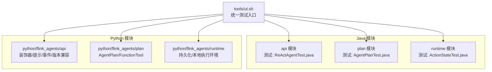
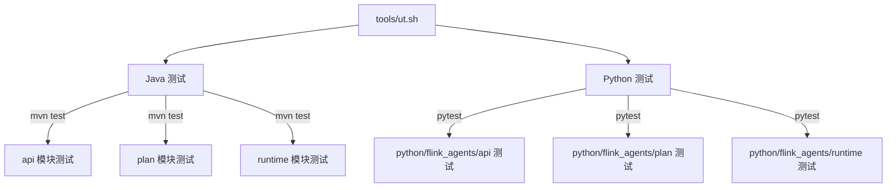
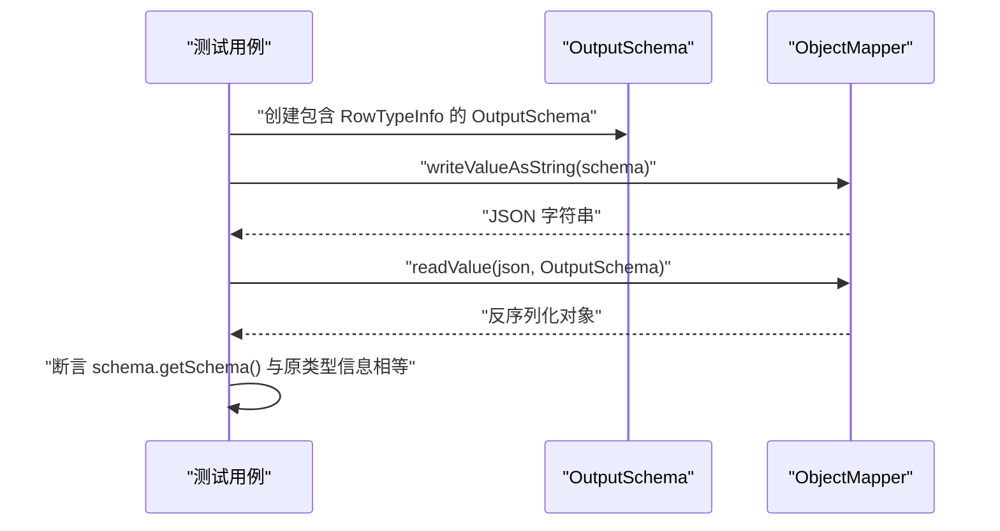
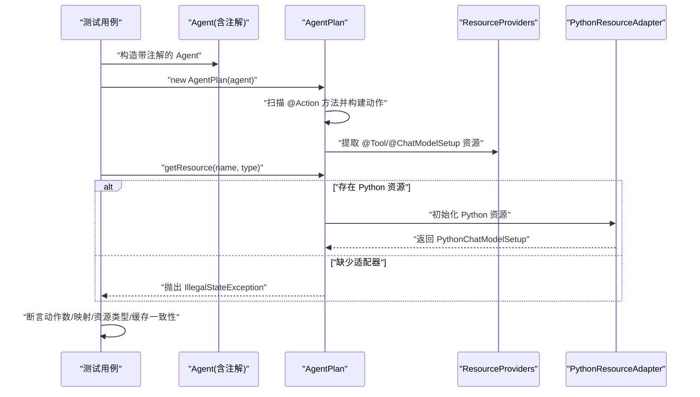
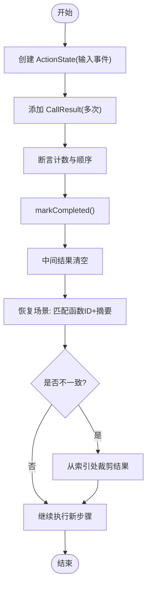
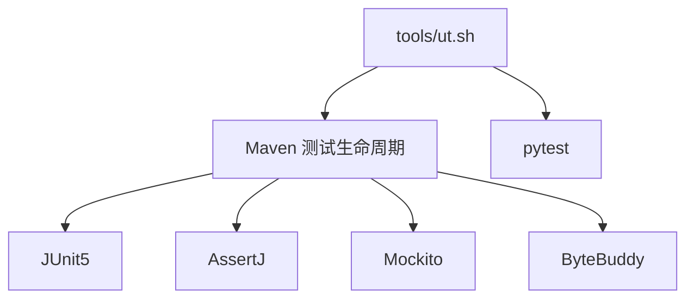

# 单元测试

<cite>
**本文引用的文件**
- [ReActAgentTest.java](file://api/src/test/java/org/apache/flink/agents/api/agents/ReActAgentTest.java)
- [AgentPlanTest.java](file://plan/src/test/java/org/apache/flink/agents/plan/AgentPlanTest.java)
- [ActionStateTest.java](file://runtime/src/test/java/org/apache/flink/agents/runtime/actionstate/ActionStateTest.java)
- [test_decorators.py](file://python/flink_agents/api/tests/test_decorators.py)
- [test_prompt.py](file://python/flink_agents/api/tests/test_prompt.py)
- [test_tool.py](file://python/flink_agents/api/tests/test_tool.py)
- [test_event.py](file://python/flink_agents/api/tests/test_event.py)
- [test_version_compatibility.py](file://python/flink_agents/api/tests/test_version_compatibility.py)
- [test_durable_execution.py](file://python/flink_agents/runtime/tests/test_durable_execution.py)
- [test_local_execution_environment.py](file://python/flink_agents/runtime/tests/test_local_execution_environment.py)
- [test_agent_plan.py](file://python/flink_agents/plan/tests/test_agent_plan.py)
- [test_function_tool.py](file://python/flink_agents/plan/tests/tools/test_function_tool.py)
- [ut.sh](file://tools/ut.sh)
- [pom.xml](file://pom.xml)
</cite>

## 目录
1. [引言](#引言)
2. [项目结构](#项目结构)
3. [核心组件](#核心组件)
4. [架构总览](#架构总览)
5. [详细组件分析](#详细组件分析)
6. [依赖分析](#依赖分析)
7. [性能考虑](#性能考虑)
8. [故障排查指南](#故障排查指南)
9. [结论](#结论)
10. [附录](#附录)

## 引言
本指南面向开发者，系统化梳理 Apache Flink Agents 在 Java 与 Python 两端的单元测试实践，覆盖 API 层（如 ReActAgent 输出模式）、计划层（AgentPlan 反射与资源提供）、运行时层（ActionState 状态管理）以及 Python API 的装饰器、提示词、工具等模块。文档提供分层测试策略、断言与数据准备规范、模拟对象使用建议、覆盖率与质量评估方法、测试环境配置与依赖管理、调试技巧与常见问题解决方案。

## 项目结构
测试分布在多模块中：
- Java 端：api、plan、runtime 模块下分别包含对应组件的单元测试。
- Python 端：python/flink_agents 下按功能域划分测试，如 api、plan、runtime。
- 工具脚本：tools/ut.sh 提供统一的 Java/Python 测试执行入口，支持多 Flink 版本。

图表来源
- [ut.sh](file://tools/ut.sh#L122-L328)
- [ReActAgentTest.java](file://api/src/test/java/org/apache/flink/agents/api/agents/ReActAgentTest.java#L29-L45)
- [AgentPlanTest.java](file://plan/src/test/java/org/apache/flink/agents/plan/AgentPlanTest.java#L56-L482)
- [ActionStateTest.java](file://runtime/src/test/java/org/apache/flink/agents/runtime/actionstate/ActionStateTest.java#L31-L311)
- [test_decorators.py](file://python/flink_agents/api/tests/test_decorators.py#L27-L65)
- [test_prompt.py](file://python/flink_agents/api/tests/test_prompt.py#L24-L131)
- [test_tool.py](file://python/flink_agents/api/tests/test_tool.py#L49-L72)
- [test_event.py](file://python/flink_agents/api/tests/test_event.py#L28-L128)
- [test_version_compatibility.py](file://python/flink_agents/api/tests/test_version_compatibility.py#L26-L170)
- [test_durable_execution.py](file://python/flink_agents/runtime/tests/test_durable_execution.py#L51-L220)
- [test_local_execution_environment.py](file://python/flink_agents/runtime/tests/test_local_execution_environment.py#L60-L127)
- [test_agent_plan.py](file://python/flink_agents/plan/tests/test_agent_plan.py#L59-L320)
- [test_function_tool.py](file://python/flink_agents/plan/tests/tools/test_function_tool.py#L51-L65)

章节来源
- [ut.sh](file://tools/ut.sh#L1-L328)
- [pom.xml](file://pom.xml#L1-L200)

## 核心组件
- API 层（Java）：ReActAgent 输出模式序列化测试，验证 RowTypeInfo 到 OutputSchema 的 JSON 序列化与反序列化一致性。
- 计划层（Java）：AgentPlan 构造与资源提供、动作收集、事件映射、资源适配器设置与缓存、异常路径等。
- 运行时层（Java）：ActionState 的调用结果管理、完成标记、恢复场景、非确定性检测与回滚。
- Python API（装饰器/提示/事件/版本兼容）：装饰器监听事件类型断言、提示词模板格式化、事件序列化与 Row 兼容、版本比较与归一化。
- Python 计划层：AgentPlan 从 Agent 构建、资源检索、动作序列化/反序列化、资源声明与连接。
- Python 运行时：函数 ID/参数摘要计算、cloudpickle 异常序列化、本地执行环境约束与异步执行。

章节来源
- [ReActAgentTest.java](file://api/src/test/java/org/apache/flink/agents/api/agents/ReActAgentTest.java#L30-L43)
- [AgentPlanTest.java](file://plan/src/test/java/org/apache/flink/agents/plan/AgentPlanTest.java#L247-L480)
- [ActionStateTest.java](file://runtime/src/test/java/org/apache/flink/agents/runtime/actionstate/ActionStateTest.java#L33-L310)
- [test_decorators.py](file://python/flink_agents/api/tests/test_decorators.py#L27-L65)
- [test_prompt.py](file://python/flink_agents/api/tests/test_prompt.py#L35-L131)
- [test_event.py](file://python/flink_agents/api/tests/test_event.py#L28-L128)
- [test_version_compatibility.py](file://python/flink_agents/api/tests/test_version_compatibility.py#L26-L170)
- [test_agent_plan.py](file://python/flink_agents/plan/tests/test_agent_plan.py#L59-L320)
- [test_durable_execution.py](file://python/flink_agents/runtime/tests/test_durable_execution.py#L51-L220)
- [test_local_execution_environment.py](file://python/flink_agents/runtime/tests/test_local_execution_environment.py#L60-L127)
- [test_tool.py](file://python/flink_agents/api/tests/test_tool.py#L58-L72)
- [test_function_tool.py](file://python/flink_agents/plan/tests/tools/test_function_tool.py#L51-L65)

## 架构总览
下图展示 Java 与 Python 两端测试在模块间的分布与交互关系，以及统一入口脚本如何协调执行。

图表来源
- [ut.sh](file://tools/ut.sh#L122-L328)
- [pom.xml](file://pom.xml#L58-L67)

## 详细组件分析

### API 层：ReActAgent 输出模式测试
- 目标：验证 OutputSchema 的序列化/反序列化正确性，确保 RowTypeInfo 能被稳定编码与解码。
- 关键点：
  - 使用 ObjectMapper 对 OutputSchema 进行 JSON 序列化与反序列化。
  - 断言反序列化后的 schema 与原始类型信息一致。
- 测试数据准备：构造 RowTypeInfo（含整型与字符串字段名），封装为 OutputSchema。
- 断言策略：相等性断言，确保类型信息未丢失。
- 复杂度：O(1)，主要受 Jackson 序列化开销影响。

图表来源
- [ReActAgentTest.java](file://api/src/test/java/org/apache/flink/agents/api/agents/ReActAgentTest.java#L30-L43)

章节来源
- [ReActAgentTest.java](file://api/src/test/java/org/apache/flink/agents/api/agents/ReActAgentTest.java#L30-L43)

### 计划层：AgentPlan 行为与资源提供测试
- 目标：验证基于注解的动作收集、事件到动作映射、资源提供者提取与缓存、异常处理。
- 关键点：
  - 动作收集：通过反射扫描带 @Action 注解的方法，生成 JavaFunction 并建立 listenEventTypes 映射。
  - 资源提供：从 @Tool、@ChatModelSetup 等注解提取资源描述，生成 JavaSerializableResourceProvider 或 PythonResourceProvider，并缓存实例。
  - 异常路径：当资源不存在或缺少 PythonResourceAdapter 时抛出明确异常。
  - 配置注入：addAction 支持为特定动作注入配置项。
- 测试数据准备：自定义 Agent 子类，标注多个动作与资源；提供 PythonResourceAdapter 实现以启用 Python 资源解析。
- 断言策略：数量断言、类型断言、映射断言、异常断言。
- 复杂度：O(N)（N 为动作/事件/资源数量），主要由反射与映射构建决定。

图表来源
- [AgentPlanTest.java](file://plan/src/test/java/org/apache/flink/agents/plan/AgentPlanTest.java#L247-L480)

章节来源
- [AgentPlanTest.java](file://plan/src/test/java/org/apache/flink/agents/plan/AgentPlanTest.java#L247-L480)

### 运行时层：ActionState 状态管理测试
- 目标：验证细粒度持久化执行中的状态管理，包括调用结果记录、完成标记、恢复与非确定性检测。
- 关键点：
  - CallResult 增删改查、越界访问保护、批量清理。
  - markCompleted 清空中间结果并标记完成。
  - 恢复场景：根据函数 ID 与摘要匹配已执行步骤，必要时回滚至最近一致点。
- 测试数据准备：构造 InputEvent、MemoryUpdate、OutputEvent、CallResult 列表。
- 断言策略：计数断言、相等性断言、边界断言、恢复匹配断言。
- 复杂度：增删改查 O(k)（k 为已记录调用次数），恢复匹配 O(k)。

图表来源
- [ActionStateTest.java](file://runtime/src/test/java/org/apache/flink/agents/runtime/actionstate/ActionStateTest.java#L232-L310)

章节来源
- [ActionStateTest.java](file://runtime/src/test/java/org/apache/flink/agents/runtime/actionstate/ActionStateTest.java#L33-L310)

### Python API：装饰器测试
- 目标：验证 @action 装饰器对监听事件类型元数据的正确注入与校验。
- 关键点：
  - 单事件监听：断言 _listen_events 为单元素元组。
  - 多事件监听：断言 _listen_events 为多元素元组。
  - 错误用法：无事件或传入非事件类型应触发断言错误。
- 测试数据准备：定义简单转发动作函数，分别以单/多/无/非法事件类型装饰。
- 断言策略：属性存在性断言、元组值断言、异常断言。

章节来源
- [test_decorators.py](file://python/flink_agents/api/tests/test_decorators.py#L27-L65)

### Python API：提示词测试
- 目标：验证 Prompt.from_text/from_messages 的格式化输出与消息结构。
- 关键点：
  - 文本模板与消息模板的格式化一致性。
  - 缺失参数时的占位保留策略。
  - JSON 模式嵌入与序列化。
- 测试数据准备：构造文本与消息模板，填充变量后断言输出。
- 断言策略：字符串相等断言、消息结构断言、异常断言。

章节来源
- [test_prompt.py](file://python/flink_agents/api/tests/test_prompt.py#L24-L131)

### Python API：事件与 Row 序列化测试
- 目标：验证事件模型的可序列化性与 Row 类型的兼容策略。
- 关键点：
  - 可序列化字段与不可序列化字段的组合。
  - Row 字段的回退序列化策略与自定义回退函数。
  - 混合类型的序列化一致性。
- 测试数据准备：构造包含 Row 与普通字段的事件对象。
- 断言策略：JSON 含义断言、结构断言、异常断言。

章节来源
- [test_event.py](file://python/flink_agents/api/tests/test_event.py#L28-L128)

### Python API：工具元数据测试
- 目标：验证 ToolMetadata 的序列化/反序列化一致性。
- 关键点：
  - 从函数签名生成 JSON Schema。
  - 与期望 JSON 文件对比。
- 测试数据准备：定义带注释的函数，生成 ToolMetadata。
- 断言策略：JSON 对象相等断言。

章节来源
- [test_tool.py](file://python/flink_agents/api/tests/test_tool.py#L49-L72)

### Python API：版本兼容性测试
- 目标：验证版本归一化与比较逻辑，支持快照/两段/三段版本。
- 关键点：
  - 归一化：两段版本补零，去除后缀。
  - 比较：ge()/lt() 与边界用例。
  - 懒加载：首次访问才初始化。
- 测试数据准备：使用 patch 替换 importlib.metadata.version。
- 断言策略：布尔断言、异常断言、懒加载断言。

章节来源
- [test_version_compatibility.py](file://python/flink_agents/api/tests/test_version_compatibility.py#L26-L170)

### Python 计划层：AgentPlan 与 FunctionTool 测试
- 目标：验证 Python 端 AgentPlan 的构建、资源检索、动作序列化/反序列化；FunctionTool 的序列化/反序列化。
- 关键点：
  - from_agent 构建：动作签名检查、事件类型映射、PythonFunction 定位。
  - 资源检索：通过名称与类型获取资源实例。
  - 序列化一致性：与基准 JSON 对比。
- 测试数据准备：自定义 Agent 与资源实现，生成 AgentPlan；FunctionTool 由可调用对象生成。
- 断言策略：对象相等断言、异常断言、JSON 对比断言。

章节来源
- [test_agent_plan.py](file://python/flink_agents/plan/tests/test_agent_plan.py#L59-L320)
- [test_function_tool.py](file://python/flink_agents/plan/tests/tools/test_function_tool.py#L51-L65)

### Python 运行时：持久化与本地执行环境测试
- 目标：验证函数 ID/参数摘要计算、cloudpickle 异常序列化、本地执行环境约束与异步执行。
- 关键点：
  - 函数 ID：区分函数/lambda/实例/静态/类方法。
  - 参数摘要：相同参数产生相同摘要，不同顺序/关键字参数产生不同摘要。
  - 异常序列化：保留类型与消息，支持自定义属性。
  - 本地执行：from_list 仅能调用一次、多 Agent apply 抛错、重复 execute 抛错。
- 测试数据准备：定义多种函数与异常类型，构造本地执行环境。
- 断言策略：字符串包含断言、类型断言、异常断言、运行时错误断言。

章节来源
- [test_durable_execution.py](file://python/flink_agents/runtime/tests/test_durable_execution.py#L51-L220)
- [test_local_execution_environment.py](file://python/flink_agents/runtime/tests/test_local_execution_environment.py#L60-L127)

## 依赖分析
- 统一测试入口：tools/ut.sh 支持 Java/Python 单独/联合执行，可指定多 Flink 版本，自动安装依赖并运行测试。
- Maven 依赖：JUnit5、AssertJ、Mockito、ByteBuddy 等用于 Java 测试；pytest 用于 Python 测试。
- 模块划分：api/plan/runtime 分层清晰，测试覆盖各层关键路径。

图表来源
- [ut.sh](file://tools/ut.sh#L122-L328)
- [pom.xml](file://pom.xml#L82-L107)

章节来源
- [ut.sh](file://tools/ut.sh#L1-L328)
- [pom.xml](file://pom.xml#L1-L200)

## 性能考虑
- 序列化成本：Jackson/ObjectMapper 与 cloudpickle 的序列化/反序列化开销需关注；测试中尽量复用对象与最小化序列化次数。
- 反射与映射：AgentPlan 构造涉及反射扫描与映射构建，避免在热路径重复构建；测试中可通过缓存与共享实例降低开销。
- 断言策略：优先使用精确断言（如相等性、类型断言），减少模糊断言导致的额外比较成本。
- 并发与隔离：测试间保持独立，避免共享可变状态；使用临时目录与隔离资源。

## 故障排查指南
- Java 测试失败
  - 环境问题：确认 Maven 依赖安装完整，排除列表中未包含 e2e 模块。
  - 版本不匹配：确保 Flink 版本与依赖一致，必要时使用 -f 指定版本。
  - 日志与报告：查看目标目录下的测试报告与日志，定位具体失败用例。
- Python 测试失败
  - 依赖管理：优先使用 uv；若无 uv，回退 pip 安装 test 分组与指定 Flink 版本。
  - 本地执行环境：from_list 仅能调用一次，重复调用会抛出运行时错误；确保执行流程符合约束。
  - 异步执行：异步动作需等待 durable_execute_async 完成，避免断言过早。
- 覆盖率与质量
  - Java：结合 Maven Surefire/Failsafe 与 JaCoCo 插件统计覆盖率，识别未覆盖分支与路径。
  - Python：使用 pytest-cov 统计覆盖率，结合阈值与报告定位薄弱模块。
- 常见问题
  - 装饰器断言失败：确认 @action 装饰器的事件类型为 Event 子类。
  - 提示词格式异常：检查模板变量与缺失参数的占位策略。
  - 版本比较异常：确保版本字符串符合预期格式，必要时进行归一化处理。

章节来源
- [ut.sh](file://tools/ut.sh#L122-L328)
- [test_local_execution_environment.py](file://python/flink_agents/runtime/tests/test_local_execution_environment.py#L99-L127)
- [test_durable_execution.py](file://python/flink_agents/runtime/tests/test_durable_execution.py#L130-L220)

## 结论
本指南提供了 Apache Flink Agents 在 Java 与 Python 两端的系统化单元测试实践，覆盖 API、计划与运行时三层，明确了断言策略、测试数据准备与模拟对象使用规范，并给出了覆盖率与质量评估、测试环境配置与调试技巧。建议在开发过程中遵循“先断言、后模拟、再重构”的原则，持续提升测试质量与覆盖率。

## 附录
- 测试执行命令参考
  - Java 单测：mvn test
  - Python 单测：pytest flink_agents -k "not e2e_tests"
  - 统一入口：./tools/ut.sh -b -v（同时运行 Java/Python，显示详细输出）
- 覆盖率工具
  - Java：JaCoCo 插件集成于 Maven 生命周期
  - Python：pytest-cov（覆盖率阈值与报告生成）