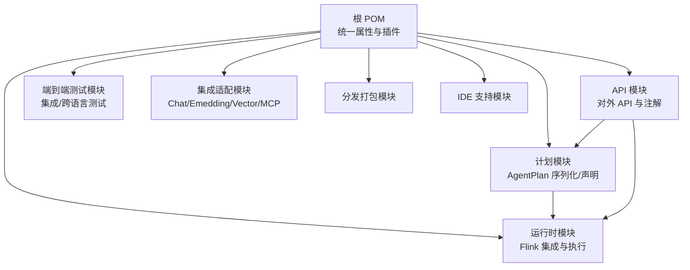
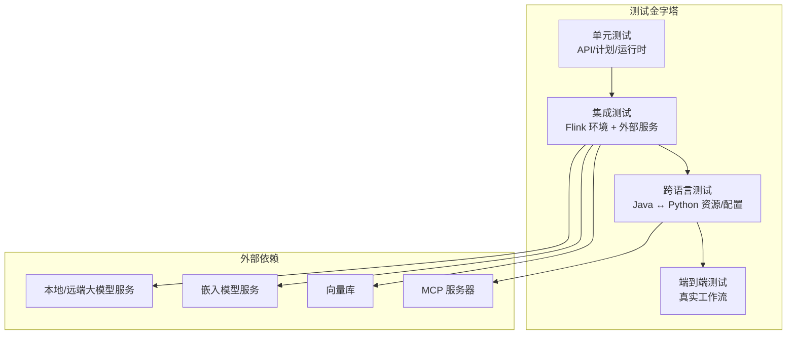
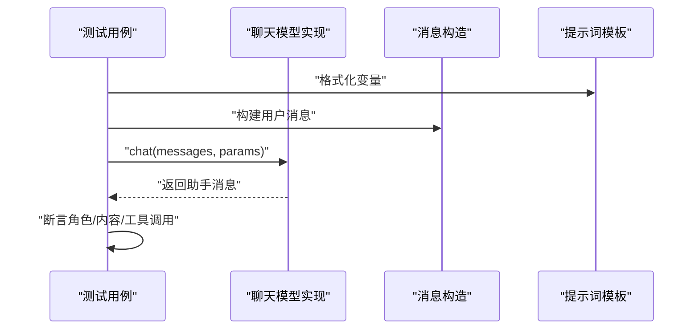
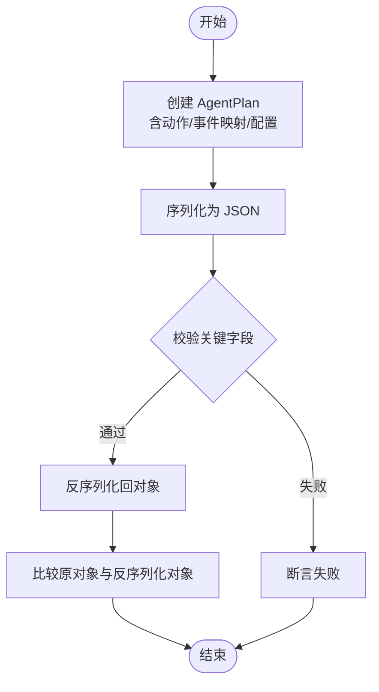
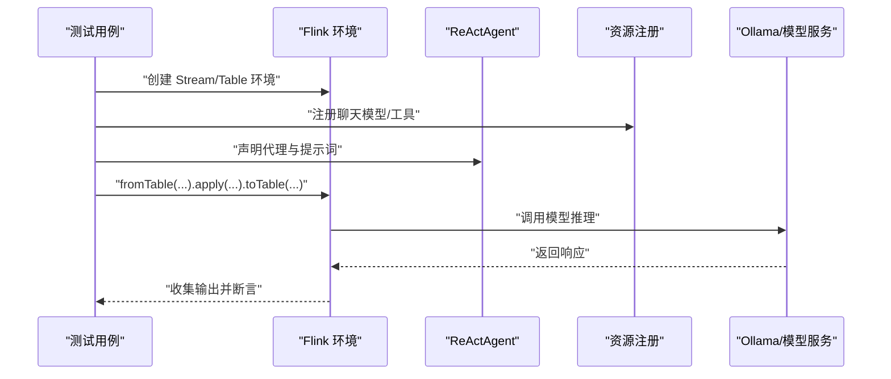
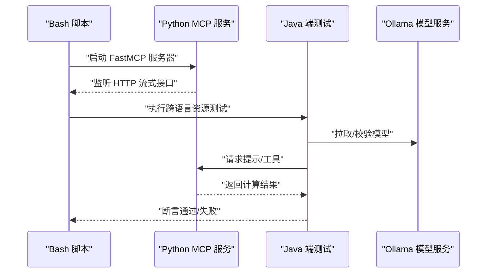
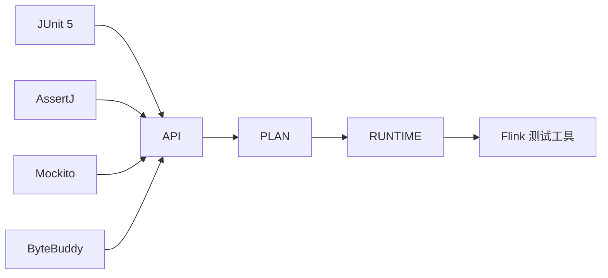

# 测试指南

<cite>
**本文引用的文件**   
- [根 POM（父级）](file://pom.xml)
- [API 模块 POM](file://api/pom.xml)
- [计划模块 POM](file://plan/pom.xml)
- [运行时模块 POM](file://runtime/pom.xml)
- [Python 项目配置](file://python/pyproject.toml)
- [单元测试脚本（Java/Python）](file://tools/ut.sh)
- [端到端测试脚本（Bash）](file://tools/e2e.sh)
- [API 单测：ReActAgent 输出模式序列化](file://api/src/test/java/org/apache/flink/agents/api/agents/ReActAgentTest.java)
- [计划单测：AgentPlan JSON 序列化](file://plan/src/test/java/org/apache/flink/agents/plan/serializer/AgentPlanJsonSerializerTest.java)
- [API 单测：BaseChatModel 行为](file://api/src/test/java/org/apache/flink/agents/api/chat/model/BaseChatModelTest.java)
- [集成端到端：ReActAgent 端到端测试](file://e2e-test/flink-agents-end-to-end-tests-integration/src/test/java/org/apache/flink/agents/integration/test/ReActAgentTest.java)
- [跨语言端到端：资源跨语言测试准备工具](file://e2e-test/flink-agents-end-to-end-tests-resource-cross-language/src/test/java/org/apache/flink/agents/resource/test/CrossLanguageTestPreparationUtils.java)
- [Python 端到端：MCP 服务器示例](file://python/flink_agents/e2e_tests/e2e_tests_integration/e2e_tests_mcp/mcp_server.py)
</cite>

## 目录
1. [引言](#引言)
2. [项目结构](#项目结构)
3. [核心组件](#核心组件)
4. [架构总览](#架构总览)
5. [详细组件分析](#详细组件分析)
6. [依赖关系分析](#依赖关系分析)
7. [性能考量](#性能考量)
8. [故障排查指南](#故障排查指南)
9. [结论](#结论)
10. [附录](#附录)

## 引言
本测试指南面向开发者与 QA 工程师，系统性介绍 Apache Flink Agents 的测试体系与实践，覆盖：
- 单元测试组织与策略：API 层、计划层、运行时层
- 端到端测试设计与实现：集成测试、跨语言测试
- 测试环境搭建与配置：测试数据、模拟服务、工具链
- 测试用例编写最佳实践：断言策略、测试隔离、性能测试
- 持续集成与自动化测试：脚本与参数
- 覆盖率要求与改进策略
- 调试与问题排查技巧

## 项目结构
项目采用多模块 Maven 结构，配合 Python 包与 Bash 脚本，形成“Java 单元测试 + Python 单元测试 + 端到端测试”的完整测试矩阵。

图表来源
- [根 POM（父级）](file://pom.xml#L58-L67)
- [API 模块 POM](file://api/pom.xml#L28-L67)
- [计划模块 POM](file://plan/pom.xml#L28-L87)
- [运行时模块 POM](file://runtime/pom.xml#L28-L144)

章节来源
- [根 POM（父级）](file://pom.xml#L58-L67)
- [API 模块 POM](file://api/pom.xml#L28-L67)
- [计划模块 POM](file://plan/pom.xml#L28-L87)
- [运行时模块 POM](file://runtime/pom.xml#L28-L144)

## 核心组件
- API 层：定义代理、事件、提示词、资源、向量库等核心抽象与注解，提供 Java/Python 双栈能力。
- 计划层：负责将代理声明转换为可序列化的 AgentPlan，并支持 Java/Python 资源提供器与函数桥接。
- 运行时层：在 Flink 上执行代理动作，管理状态、内存、度量与异步执行。
- 端到端测试：验证真实场景下的集成与跨语言交互，包含模型、嵌入、向量库与 MCP 的联动。

章节来源
- [根 POM（父级）](file://pom.xml#L58-L67)
- [计划模块 POM](file://plan/pom.xml#L28-L87)
- [运行时模块 POM](file://runtime/pom.xml#L28-L144)

## 架构总览
下图展示测试金字塔与测试范围映射：

## 详细组件分析

### API 层测试策略
目标：验证消息格式、提示词处理、聊天模型行为、嵌入模型工具、资源描述符、向量库桥接等。

- 关键断言策略
  - 结构断言：消息角色、内容、工具调用字段完整性
  - 行为断言：空输入兜底、多轮对话顺序、长文本处理
  - 资源断言：资源类型匹配、参数透传

- 示例参考
  - [API 单测：ReActAgent 输出模式序列化](file://api/src/test/java/org/apache/flink/agents/api/agents/ReActAgentTest.java#L30-L44)
  - [API 单测：BaseChatModel 行为](file://api/src/test/java/org/apache/flink/agents/api/chat/model/BaseChatModelTest.java#L107-L255)

图表来源
- [API 单测：BaseChatModel 行为](file://api/src/test/java/org/apache/flink/agents/api/chat/model/BaseChatModelTest.java#L107-L255)

章节来源
- [API 单测：ReActAgent 输出模式序列化](file://api/src/test/java/org/apache/flink/agents/api/agents/ReActAgentTest.java#L30-L44)
- [API 单测：BaseChatModel 行为](file://api/src/test/java/org/apache/flink/agents/api/chat/model/BaseChatModelTest.java#L107-L255)

### 计划层测试策略
目标：验证 AgentPlan 的声明、序列化/反序列化、动作映射、事件触发、资源提供器桥接。

- 关键断言策略
  - 字段存在性：actions/actions_by_event/config
  - 函数类型：JavaFunction/PythonFunction
  - 事件映射：监听事件类型列表
  - 空计划：空对象序列化一致性

- 示例参考
  - [计划单测：AgentPlan JSON 序列化](file://plan/src/test/java/org/apache/flink/agents/plan/serializer/AgentPlanJsonSerializerTest.java#L67-L229)

图表来源
- [计划单测：AgentPlan JSON 序列化](file://plan/src/test/java/org/apache/flink/agents/plan/serializer/AgentPlanJsonSerializerTest.java#L67-L229)

章节来源
- [计划单测：AgentPlan JSON 序列化](file://plan/src/test/java/org/apache/flink/agents/plan/serializer/AgentPlanJsonSerializerTest.java#L67-L229)

### 运行时层测试策略
目标：验证 Flink 环境下的动作状态、异步执行、内存对象、RunnerContext 执行、度量上报等。

- 建议关注点
  - 状态序列化/反序列化一致性
  - 异步动作的延续执行与上下文传递
  - 内存对象的本地/远程执行差异
  - RunnerContext 的资源获取与执行边界

- 参考模块
  - [运行时模块 POM（测试依赖与 Flink 版本）](file://runtime/pom.xml#L91-L144)

章节来源
- [运行时模块 POM](file://runtime/pom.xml#L91-L144)

### 端到端测试设计与实现

#### 集成测试（Java）
目标：在真实 Flink 环境中验证 ReActAgent 的数据表/数据流处理、工具调用、输出模式与错误重试策略。

- 设计要点
  - 使用本地或远端大模型服务（如 Ollama），按需拉取模型
  - 注册资源：聊天模型连接/设置、工具函数
  - 定义输入表与输出模式，执行代理并收集结果
  - 断言输出与期望一致

- 示例参考
  - [集成端到端：ReActAgent 端到端测试](file://e2e-test/flink-agents-end-to-end-tests-integration/src/test/java/org/apache/flink/agents/integration/test/ReActAgentTest.java#L77-L189)

图表来源
- [集成端到端：ReActAgent 端到端测试](file://e2e-test/flink-agents-end-to-end-tests-integration/src/test/java/org/apache/flink/agents/integration/test/ReActAgentTest.java#L77-L189)

章节来源
- [集成端到端：ReActAgent 端到端测试](file://e2e-test/flink-agents-end-to-end-tests-integration/src/test/java/org/apache/flink/agents/integration/test/ReActAgentTest.java#L77-L189)

#### 跨语言测试（Java ↔ Python）
目标：验证 Java 与 Python 资源/配置在不同语言间的一致性与互操作性。

- 设计要点
  - 启动 MCP 服务器（Python）
  - Java 端准备模型镜像（如 Ollama）
  - 通过 Bash 脚本驱动测试，确保 JVM 参数与路径正确
  - 断言跨语言资源可用与配置互通

- 示例参考
  - [跨语言端到端：资源跨语言测试准备工具](file://e2e-test/flink-agents-end-to-end-tests-resource-cross-language/src/test/java/org/apache/flink/agents/resource/test/CrossLanguageTestPreparationUtils.java#L31-L79)
  - [Python 端到端：MCP 服务器示例](file://python/flink_agents/e2e_tests/e2e_tests_integration/e2e_tests_mcp/mcp_server.py#L29-L61)

图表来源
- [跨语言端到端：资源跨语言测试准备工具](file://e2e-test/flink-agents-end-to-end-tests-resource-cross-language/src/test/java/org/apache/flink/agents/resource/test/CrossLanguageTestPreparationUtils.java#L31-L79)
- [Python 端到端：MCP 服务器示例](file://python/flink_agents/e2e_tests/e2e_tests_integration/e2e_tests_mcp/mcp_server.py#L29-L61)

章节来源
- [跨语言端到端：资源跨语言测试准备工具](file://e2e-test/flink-agents-end-to-end-tests-resource-cross-language/src/test/java/org/apache/flink/agents/resource/test/CrossLanguageTestPreparationUtils.java#L31-L79)
- [Python 端到端：MCP 服务器示例](file://python/flink_agents/e2e_tests/e2e_tests_integration/e2e_tests_mcp/mcp_server.py#L29-L61)

## 依赖关系分析
- 统一版本与工具
  - JUnit 5、AssertJ、Mockito、ByteBuddy 作为测试框架与辅助
  - Maven Surefire 插件配置以兼容 Java 11/21
  - Testcontainers 在计划模块用于容器化测试

- 模块间依赖
  - API → 计划（API 为计划层基础）
  - 计划 → 运行时（计划层为运行时输入）
  - 运行时 → Flink（运行时依赖 Flink 测试工具）

图表来源
- [根 POM（父级）](file://pom.xml#L82-L107)
- [计划模块 POM](file://plan/pom.xml#L66-L87)

章节来源
- [根 POM（父级）](file://pom.xml#L82-L107)
- [计划模块 POM](file://plan/pom.xml#L66-L87)

## 性能考量
- 单测性能
  - 使用最小化依赖与内存对象，避免真实网络调用
  - 对长文本/批量处理进行边界值测试，避免超时
- 集成与端到端性能
  - 控制并发与并行度，避免 Ollama/MCP 瞬时压力过大
  - 使用日志级别控制与短超时，便于快速反馈
- 资源准备
  - 提前拉取模型镜像，减少测试等待时间
  - 使用本地/缓存服务，降低外部依赖波动

## 故障排查指南
- 常见问题与定位
  - 端到端测试失败：检查模型是否就绪、MCP 服务是否启动、JVM 参数是否包含必要的导出
  - 跨语言资源不可用：确认 Python 环境与依赖安装、MCP 服务器监听端口、模型镜像拉取成功
  - 序列化异常：核对 AgentPlan 字段与函数类型，确保 JSON 序列化/反序列化一致
- 调试技巧
  - 使用日志配置文件与更详细的日志级别
  - 将复杂断言拆分为多个小断言，逐步缩小问题范围
  - 在本地复现：先运行单测，再运行集成测试，最后运行端到端测试

章节来源
- [集成端到端：ReActAgent 端到端测试](file://e2e-test/flink-agents-end-to-end-tests-integration/src/test/java/org/apache/flink/agents/integration/test/ReActAgentTest.java#L77-L189)
- [跨语言端到端：资源跨语言测试准备工具](file://e2e-test/flink-agents-end-to-end-tests-resource-cross-language/src/test/java/org/apache/flink/agents/resource/test/CrossLanguageTestPreparationUtils.java#L31-L79)

## 结论
通过“单元测试 → 集成测试 → 跨语言测试 → 端到端测试”的分层策略，结合自动化脚本与清晰的断言策略，可以有效保障 Apache Flink Agents 在多语言与多组件协同下的稳定性与正确性。建议在持续集成中固定运行顺序与超时，逐步提升覆盖率并优化关键路径性能。

## 附录

### 测试环境搭建与配置
- Java 环境
  - 使用 Maven 安装所有模块（含 test-jar）以便运行集成测试
  - 确保 JVM 参数包含必要的导出，满足 JDK 11/21 兼容
- Python 环境
  - 使用 uv 或 pip 安装测试依赖组，确保 pytest 可用
  - 安装对应版本的 Flink Python 包以匹配测试场景
- 外部服务
  - Ollama：用于本地/远端模型推理
  - MCP：用于跨语言提示与工具服务
  - 向量库/嵌入服务：根据具体集成模块准备

章节来源
- [根 POM（父级）](file://pom.xml#L308-L315)
- [Python 项目配置](file://python/pyproject.toml#L86-L88)

### 自动化测试与持续集成
- 单元测试脚本
  - 支持仅运行 Java/Python/两者，指定 Flink 版本，可选运行端到端
  - 默认安装所有模块并执行单测；如开启端到端则安装 dist 并执行集成测试
- 端到端测试脚本
  - 统一入口：先构建项目，再按顺序执行资源跨语言、AgentPlan 兼容性、配置互通等测试
  - 统计通过/失败数量，便于 CI 报告

章节来源
- [单元测试脚本（Java/Python）](file://tools/ut.sh#L122-L196)
- [单元测试脚本（Java/Python）](file://tools/ut.sh#L198-L284)
- [端到端测试脚本（Bash）](file://tools/e2e.sh#L20-L86)
- [端到端测试脚本（Bash）](file://tools/e2e.sh#L149-L166)

### 测试用例编写最佳实践
- 断言策略
  - 结构断言：消息角色、工具调用、额外参数
  - 行为断言：空输入兜底、多轮对话顺序、长文本处理
  - 序列化断言：JSON 字段存在性与函数类型一致性
- 测试隔离
  - 使用临时目录与独立资源命名，避免并发冲突
  - 对外部服务进行超时与重试控制
- 性能测试
  - 长文本/批量数据的边界测试
  - 并发与并行度对吞吐的影响评估

### 覆盖率要求与改进策略
- 覆盖率目标
  - 核心模块（API/计划/运行时）行覆盖率与分支覆盖率不低于 80%
- 改进策略
  - 针对高风险路径补充边界条件与异常场景
  - 引入更多跨语言与外部服务交互的测试样例
  - 使用工具生成覆盖率报告并定期回归